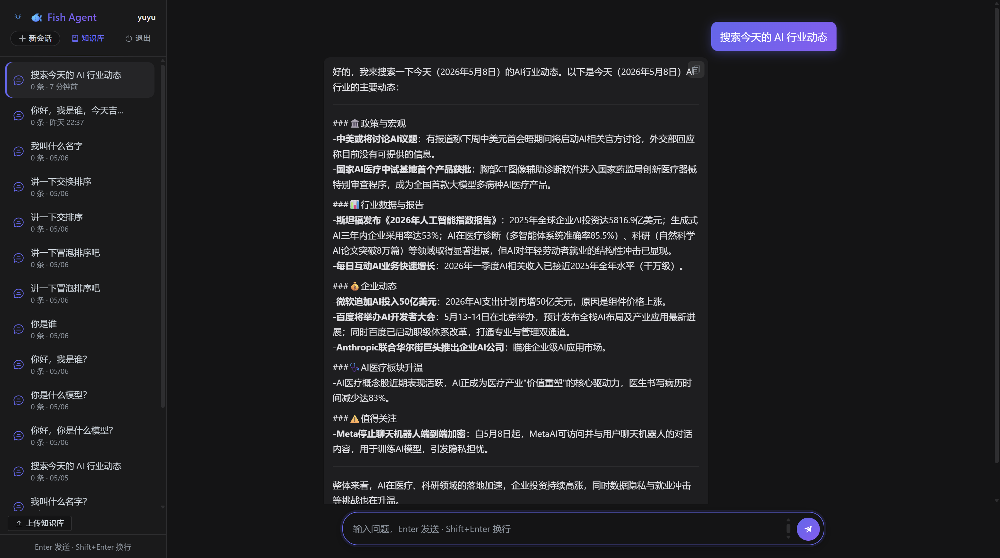
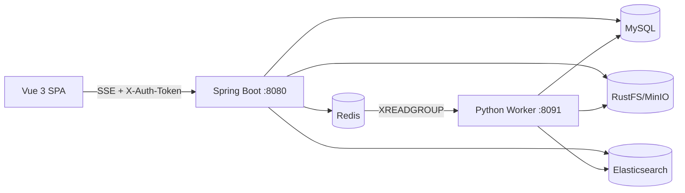
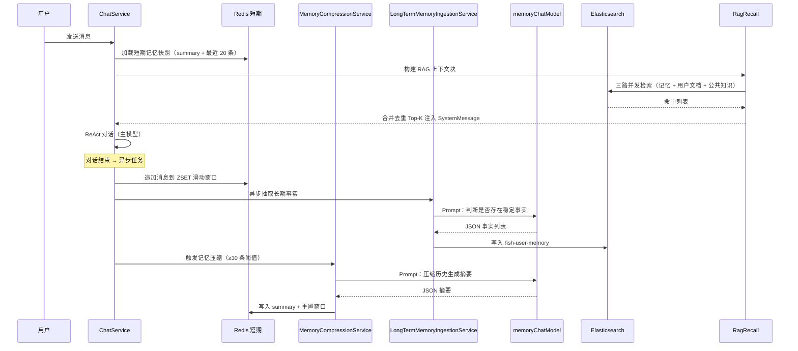
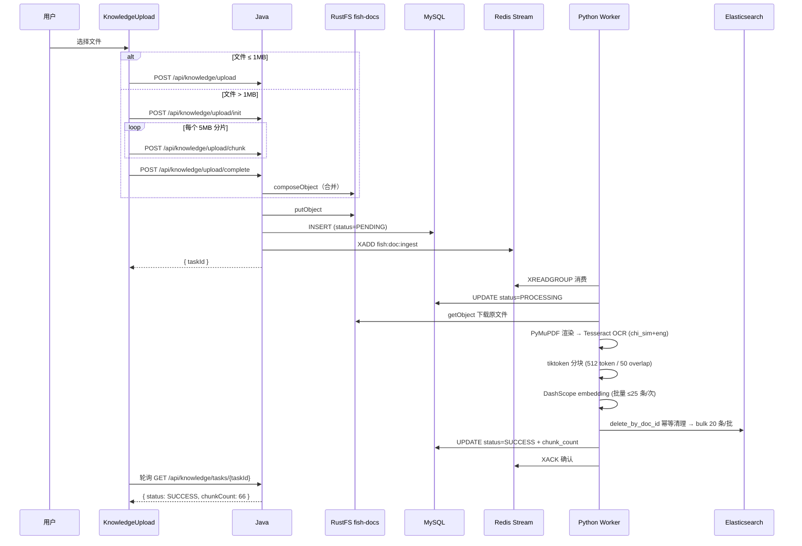

# Fish-Agent

基于 **Spring AI Alibaba ReAct** 的全栈智能体应用。具备分层记忆、三路 RAG 检索、知识库闭环、流式对话与多维限流能力等。Java + Python + Vue 3 全栈架构。

> **Vibecoding 项目**：从最初的需求分析与架构选型由人工完成，后续所有代码编写、代码审查、Bug 修复均由 AI 驱动。这也是对「AI 辅助全栈开发」的一次实战验证。

读 [document/](document/) 目录下的全景文档与模块详解可快速上手此项目，也可将其作为学习以下技术的参考：

- **ReAct Agent** 工具编排与 SPI 插件体系
- **Spring AI** 多模型路由、Chat/Embedding 独立配置
- **Redis** Stream 消息队列、Lua 令牌桶限流、会话锁
- **Elasticsearch** dense_vector 向量检索 + ik_max_word 全文双路召回
- **Python** PyMuPDF + Tesseract OCR 中文 PDF 解析管线
- **Vue 3 + SSE** 流式对话前端、暗夜模式 CSS 变量体系

## 核心能力链

登录鉴权 → Redis 令牌桶 + SSE 并发限流 → 同会话互斥锁 → 多轮 SSE 流式对话 → 短期记忆压缩 / 长期事实抽取 → 三路 ES RAG 检索注入 → ReAct 工具调用。

对话模型 **DashScope / Ollama / DeepSeek** 三路可选，嵌入独立配置，切换只需一个环境变量。

知识库闭环：前端上传（直传/分片）→ Java 写入 RustFS + MySQL + Redis Stream → Python Worker 异步消费 → PyMuPDF + Tesseract OCR 解析 PDF → tiktoken 分块 → DashScope embedding → ES 批量写入 → 前端管理页。





## 技术栈


| 层级                | 技术                                                   | 说明                                                                     |
| ----------------- | ---------------------------------------------------- | ---------------------------------------------------------------------- |
| **运行时**           | JDK 21                                               | 虚拟线程 `spring.threads.virtual.enabled=true`                             |
| **框架**            | Spring Boot 3.5 + Spring AI Alibaba 1.1.2            | ReAct Agent + `ModelCallLimitHook`                                     |
| **AI 模型**         | DeepSeek (Chat) / DashScope (Embedding) / Ollama     | Chat 与 Embedding 独立路由，三路切换零侵入                                          |
| **持久层**           | MyBatis-Plus 3.5                                     | `sys_user` / `chat_metadata` / `document_metadata`                     |
| **缓存**            | Redis (Lettuce)                                      | Session + 短期记忆 + Stream 队列 + 限流令牌桶 + 会话互斥锁                             |
| **检索引擎**          | Elasticsearch 8.x `dense_vector`                     | 三索引：用户记忆 / 私有知识 / 公共知识，文本 + 向量双路召回                                     |
| **对象存储**          | MinIO / RustFS (S3 兼容)                               | 对话 JSON 存档 + 文档原文                                                      |
| **Python Worker** | Python 3.11+                                         | PyMuPDF + Tesseract OCR (`chi_sim+eng`) + tiktoken + httpx → DashScope |
| **前端**            | Vue 3.5 + TypeScript + Vite 6 + Element Plus + Pinia | SSE 流式呈现 + 暗夜模式 + Markdown 代码高亮 + 分片上传                                 |
| **安全**            | spring-security-crypto (BCrypt)                      | UUID Token + Redis Session + `HandlerInterceptor` 鉴权                   |


## 核心亮点

### ReAct 智能体 + 工具 SPI 插件体系

10 个工具（内置 5 个 + 外部 5 个）通过 `AgentToolProvider` SPI 接口 + `ToolRegistry` 自动发现。外部工具按 `@ConditionalOnProperty` 懒装配，单工具构造失败不影响其他工具注册。三重防死循环：`CompileConfig.recursionLimit`（图节点硬上限）+ `ModelCallLimitHook`（优雅终止）+ `AgentStatus` 原子状态机（外部可中断）。

### 三路模型路由 + 对话/嵌入独立配置

`FishLlmEnvironmentPostProcessor` 在 Spring 环境早期将 `fish.llm.chat-provider` 自动推导为 `spring.ai.model.chat`（DASHSCOPE → `dashscope` / OLLAMA → `ollama` / DEEPSEEK → `openai`）。DeepSeek 通过复用 OpenAI 兼容适配器零代码接入——仅需改 `base-url` 和 `api-key`。v2.4 新增独立 `memoryChatModel` Bean，记忆压缩与长期事实抽取使用专用模型配置（更低 temperature、禁用 tool calling），通过 `@Qualifier` 精确注入。

### 分层记忆：Redis 短期 + ES 长期 + RAG 检索

分层依据是访问模式而非数据类型：短期记忆（Redis ZSET 滑动窗口 + LLM 摘要）在每轮对话开始时**同步**加载，延迟直接影响首字等待，必须是 Redis 微秒级；长期事实（ES `dense_vector`）跨会话累积，检索时**异步**注入，需要全文 + 向量双路查询能力。短期压缩与长期录入两条链路职责不交叉——压缩「只写 Redis」、录入「只写 ES」。`LongTermMemoryFactSanitizer` 在写入前过滤误抽取，保证向量索引信噪比。




### RAG 三索引双路并发召回

`fish-user-memory`（对话事实，`source_type=chat`）+ `fish-user-knowledge`（用户文档，PRIVATE）+ `fish-public-knowledge`（公共知识，PUBLIC）三索引分离，每子查询 3 索引 × 2 路（文本 `match` + 向量 `knn`）= 6 路并发。结果按 score 去重合并后注入单条 SystemMessage。虚拟线程下 ThreadLocal 显式快照回放，保证 `user_id` filter 在异步线程中不丢失。`source_type=chat` 防御性 filter 防止文档切片误入记忆上下文。

### 知识库闭环：Java 投递 + Python Worker 异步消费

Java 只负责写入 RustFS + MySQL + Redis Stream，Python Worker 异步消费。通过 Redis Stream 消费者组解耦，两个进程仅共享基础设施。PDF 解析经过三代库迭代（pypdf → pdfminer → PyMuPDF + Tesseract OCR），用「渲染为 300 DPI PNG → OCR 识别」替代「解码字体映射」，中文准确率 >95%。tiktoken `cl100k_base` 精确按 token 分块（512 token / 50 overlap），与 embedding 模型输入限制对齐。三重崩溃保障：XAUTOCLAIM（120s idle 自动恢复）+ Python `delete_by_doc_id` 幂等 + Java `OrphanTaskCompensationService` 定时清理孤儿 PROCESSING 记录。




### Redis Lua 三层限流 + 会话互斥

令牌桶（惰性 refill，请求驱动计算）+ SSE 并发槽（Lua 原子 INCR + 超限回滚）+ 会话互斥锁（`SET NX EX 120`）。429 / 409 精确区分频率与并发拒绝。所有释放逻辑（SSE DECR + 会话锁 DEL + `disposable.dispose()`）合并到 `releaseSseSlotOnce`（`AtomicBoolean` 幂等），`emitter` 回调在 `subscribe()` 之前注册，防止 Reactor 异步完成导致回调丢失和锁泄漏。限流仅 `/api/chat/**` 生效，Redis 异常时 fail-open 放行。

### 虚拟线程 + ThreadLocal 显式快照回放

JDK 21 虚拟线程在 `CompletableFuture.runAsync()` 中切换 carrier thread 时 ThreadLocal 不自动传递。RAG 并发检索、短期压缩、长期事实抽取等所有异步路径，入口快照 `UserContextHolder.get()` → 异步 lambda 中显式 `UserContextHolder.set(snapshot)` → finally `UserContextHolder.clear()`。三行代码保证虚拟线程与传统线程池全兼容。

### 配置双端对齐

Python Worker 的 `config.py`（pydantic-settings）与 Java 的 `application.yml`（`@ConfigurationProperties`）使用相同的环境变量名体系。一份 `.env` 两端共用，Docker Compose 一键注入。

## 环境要求


| 依赖                | 版本/说明                           |
| ----------------- | ------------------------------- |
| **JDK**           | 21+（虚拟线程 Project Loom）          |
| **Node.js**       | 18+                             |
| **pnpm**          | 最新版                             |
| **Python**        | 3.10+                           |
| **Docker**        | ES / Redis / RustFS             |
| **MySQL**         | 8.x（本地）                         |
| **Tesseract OCR** | Windows 需手动安装 + `chi_sim` 中文语言包 |


## 快速开始

### 1. 启动 Docker 中间件

```bash
# Elasticsearch 8.x（向量存储）
docker run -d --name es-vector -p 9200:9200 -p 9300:9300 \
  -e "discovery.type=single-node" -e "xpack.security.enabled=false" \
  -e "ES_JAVA_OPTS=-Xms1g -Xmx1g" \
  -v <你的目录>:/usr/share/elasticsearch/data \
  docker.elastic.co/elasticsearch/elasticsearch:8.13.0

# Redis（缓存 + Stream + 限流）
docker run -d --name redis -p 6379:6379 --restart always \
  -v <你的目录>:/data \
  redis:8.0 redis-server --appendonly yes

# RustFS / MinIO（S3 兼容对象存储）
docker run -d --name rustfs_local -p 9000:9000 -p 9001:9001 \
  -v <你的目录>:/data \
  rustfs/rustfs:latest /data
```

### 2. MySQL 初始化

执行仓库内的建库建表脚本：

```bash
mysql -u root -p < database/sql/fish_agent.sql
```

脚本会创建 `fish_agent` 数据库及 `sys_user`、`chat_metadata`、`document_metadata` 三张表。

### 2.1 ES 索引创建

将 `database/es/es.txt` 中的 PUT 请求拷贝到 Kibana Dev Tools（或 curl）执行，创建三个索引：


| 索引                      | DDL 位置      | 用途                         |
| ----------------------- | ----------- | -------------------------- |
| `fish-user-memory`      | `es.txt` 顶部 | 对话长期事实（`source_type=chat`） |
| `fish-user-knowledge`   | `es.txt` 中部 | 用户文档切片（PRIVATE）            |
| `fish-public-knowledge` | `es.txt` 下部 | 公共知识切片（PUBLIC）             |


> 三个索引的 `dense_vector.dims` 须与 `DASHSCOPE_EMBEDDING_DIMENSIONS`（默认 1536）一致。

### 3. 配置 API Key 与模型选择

**Java 后端：**

```bash
cp src/main/resources/application-dev.yml.example src/main/resources/application-dev.yml
```

编辑 `application-dev.yml`，填入你的凭据（模板字段对应关系见 `application-dev.yml.example`）。

启动时默认激活 `dev` profile，自动加载 `application-dev.yml`。

**模型选择：**


| 组件           | 环境变量                          | 可选值                                 |
| ------------ | ----------------------------- | ----------------------------------- |
| Chat 对话      | `FISH_LLM_CHAT_PROVIDER`      | `DEEPSEEK`（默认）、`OLLAMA`、`DASHSCOPE` |
| Embedding 嵌入 | `FISH_LLM_EMBEDDING_PROVIDER` | `DASHSCOPE`（默认）、`OLLAMA`            |


> Chat 与 Embedding 可自由组合：如 Chat 用 DeepSeek + Embedding 用 DashScope。注意当前不支持 DeepSeek 嵌入。

**外部工具 API Key：**

以下工具需自行申请 API Key，未配置时对应工具不会注册（Agent 仍正常运行）：


| 工具            | 配置项                                             | 申请/文档地址                                                                           |
| ------------- | ----------------------------------------------- | --------------------------------------------------------------------------------- |
| Tavily 搜索     | `TAVILY_API_KEY`                                | [Tavily API](https://docs.tavily.com/documentation/api-reference/endpoint/search) |
| 博查 AI 搜索      | `BOCHA_API_KEY`                                 | [博查AI开放平台](https://open.bochaai.com/)                                             |
| 高德地图（天气+地理编码） | `AMAP_KEY`                                      | [高德开放平台](https://lbs.amap.com/)                                                   |
| 邮件发送          | `MAIL_HOST` / `MAIL_USERNAME` / `MAIL_PASSWORD` | 需自备 SMTP 服务器，如 QQ邮箱/SendGrid 等                                                    |


> 邮件工具依赖 `JavaMailSender`，仅在 `spring.mail.host` 配置时启用。未配置 SMTP 时 Agent 可正常对话，但无法发送邮件。

**Python Worker：**

```bash
cp python/.env.example python/.env
```

编辑 `python/.env`，填入真实连接信息。键名与 Java `application.yml` 对齐，可复用同一套值。

### 4. 启动 Python Worker

```bash
cd python
python -m venv .venv
source .venv/bin/activate   # Windows: .venv\Scripts\activate
pip install -r requirements.txt

# Windows 需安装 Tesseract OCR + chi_sim 语言包：
# https://github.com/UB-Mannheim/tesseract/releases

# 若 Tesseract 安装路径不在系统 PATH 中，可直接修改
# python/fish_worker/parser/pdf.py 顶部的 _possible_paths 列表，
# 加入你的安装路径即可，无需改动其他代码：
#   _possible_paths = [
#       r"你的路径\Tesseract-OCR\tesseract.exe",
#       ...
#   ]

python -m fish_worker
```

验证：

```bash
curl http://localhost:8091/health
# → {"redis":"ok","mysql":"ok","elasticsearch":"ok","minio":"ok","status":"ok"}
```

详细说明见 [python/README.md](python/README.md)。

### 5. 启动 Java 后端

```bash
mvn spring-boot:run
```

后端监听 `http://localhost:8080`，默认 `dev` profile 自动加载 `application-dev.yml`。启动日志中 `[FishLlm]` 前缀输出当前路由决策。

### 6. 启动前端

```bash
cd frontend
pnpm install
pnpm dev
```

访问 `http://localhost:5173`，Vite 自动将 `/api/**` 反代到 `localhost:8080`。

## 项目结构

```
Fish-Agent/
├── src/main/java/com/yuyu/fishagent/
│   ├── agent/                   ReAct Agent 核心（循环 + 工具编排 + 状态机）
│   │   ├── memory/
│   │   │   ├── shortterm/       Redis ZSET 短期记忆
│   │   │   ├── longterm/        ES 长期事实抽取
│   │   │   ├── compress/        LLM 记忆压缩
│   │   │   └── rag/             查询重写 → 多查询扩展 → 三路并发召回
│   │   └── tool/                工具 SPI（内置 5 + 外部 5）
│   ├── auth/                    鉴权（GlobalAuthInterceptor + Redis Session + UserContext）
│   ├── ratelimit/               Redis Lua 令牌桶 + SSE 并发 + 会话互斥锁
│   ├── config/                  配置层（模型路由 / RustFS / 限流 / 知识库 / CORS）
│   │   └── llm/                 EnvironmentPostProcessor + Chat/Embedding Bean 收敛
│   ├── controller/              REST 控制器（Auth / Chat / Memory / Knowledge）
│   ├── service/                 业务服务（Chat 编排 / 记忆压缩 / 长期录入 / 知识库闭环）
│   │   └── knowledge/           文档上传入队 + 列表/删除管理 + 孤儿补偿
│   ├── entity/ / mapper/ / dto/ MyBatis-Plus 实体 + DTO
│   └── exception/               全局异常处理（含 409 SESSION_LOCKED）
├── src/main/resources/
│   ├── application.yml          主配置（git 追踪）
│   ├── application-dev.yml      本地敏感凭据（gitignore）
│   ├── application-dev.yml.example  模板
│   └── META-INF/spring.factories   注册 FishLlmEnvironmentPostProcessor
├── python/                      Python Worker（Stream 消费 → OCR → chunk → embed → ES）
├── frontend/                    Vue 3 前端（SSE 流式 + 暗夜模式 + 知识库管理）
├── docker/                      Docker 启动命令参考
├── database/
│   ├── sql/fish_agent.sql       MySQL 建表
│   └── es/es.txt                ES 索引 DDL
└── document/                    项目文档（全景文档 + 模块详解 + 速查）
```

## 关键环境变量


| 变量                                        | 必填           | 默认值                     | 说明                                                                                                                                             |
| ----------------------------------------- | ------------ | ----------------------- | ---------------------------------------------------------------------------------------------------------------------------------------------- |
| `DEEPSEEK_API_KEY`                        | DeepSeek 模式  | —                       | DeepSeek Chat API Key                                                                                                                          |
| `DASHSCOPE_API_KEY`                       | DashScope 模式 | —                       | 对话 + Embedding                                                                                                                                 |
| `FISH_LLM_CHAT_PROVIDER`                  | 否            | `DEEPSEEK`              | DASHSCOPE / OLLAMA / DEEPSEEK                                                                                                                  |
| `FISH_LLM_EMBEDDING_PROVIDER`             | 否            | `DASHSCOPE`             | DASHSCOPE / OLLAMA                                                                                                                             |
| `DB_URL` / `DB_USERNAME` / `DB_PASSWORD`  | 是            | —                       | MySQL 连接                                                                                                                                       |
| `REDIS_HOST` / `REDIS_PORT`               | 否            | `localhost:6379`        | Redis 连接                                                                                                                                       |
| `ELASTICSEARCH_URIS`                      | 否            | `http://localhost:9200` | ES 连接                                                                                                                                          |
| `RUSTFS_ACCESS_KEY` / `RUSTFS_SECRET_KEY` | RustFS 开启    | —                       | MinIO 凭据                                                                                                                                       |
| `TAVILY_API_KEY`                          | 否            | —                       | 搜索工具：[API 文档](https://docs.tavily.com/documentation/api-reference/endpoint/search)                                                             |
| `BOCHA_API_KEY`                           | 否            | —                       | AI 搜索：[博查开放平台](https://open.bochaai.com/)                                                                                                      |
| `AMAP_KEY`                                | 否            | —                       | 高德地图：[地理编码](https://lbs.amap.com/api/webservice/guide/api/georegeo) / [天气](https://lbs.amap.com/api/webservice/guide/api-advanced/weatherinfo) |
| `FISH_RATE_LIMIT_ENABLED`                 | 否            | `true`                  | 限流总开关                                                                                                                                          |
| `FISH_RAG_ENABLED`                        | 否            | `true`                  | RAG 总开关                                                                                                                                        |
| `SPRING_PROFILES_ACTIVE`                  | 否            | `dev`                   | 生产环境设为 `prod`                                                                                                                                  |


## 子模块文档

- [Python Worker 详细说明](python/README.md) —— venv / Docker 启动、OCR 管线、配置对齐、水平扩展
- [前端详细说明](frontend/README.md) —— SSE 协议、目录结构、组件说明
- [v2 全景文档](document/v2/v2-全景文档-20260505.md) —— 全链路架构、数据模型、关键流程、代码路径速查
- [模块详解](document/模块及面试要点/) —— 6 大模块的技术选型对比与面试追问预判

