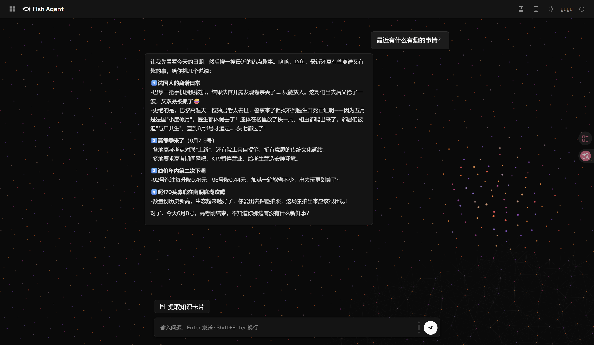
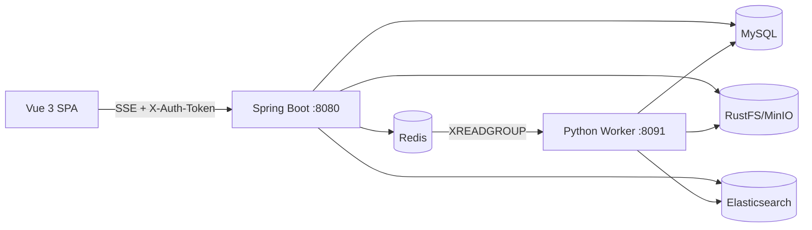
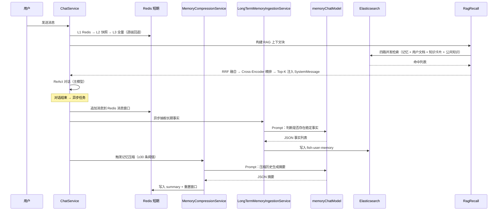
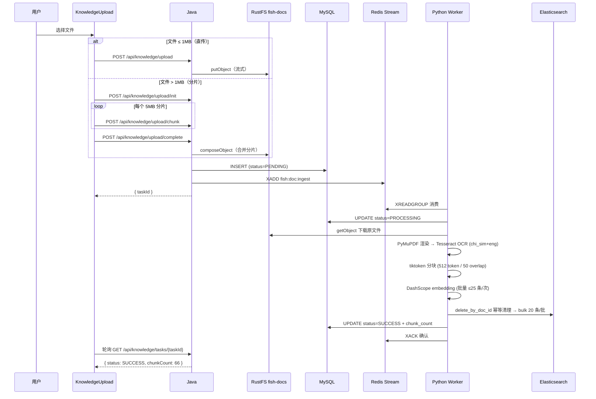

# Fish-Agent

基于 **Spring AI Alibaba ReAct** 的全栈智能体应用。具备三层记忆、五级 RAG 管线、知识库闭环、知识卡片系统、流式对话与多维限流能力；工程化方面实现了 MDC 全链路追踪、Resilience4j 熔断保护和 Redis 多级缓存。Java + Python + Vue 3 全栈架构。

> **Vibecoding 项目**：从最初的需求分析与架构选型由人工完成，后续所有代码编写、代码审查、Bug 修复均由 AI 驱动。这也是对「AI 辅助全栈开发」的一次实战验证。

读 [document/](document/) 目录下的全景文档与模块详解可快速上手此项目，也可将其作为学习以下技术的参考：

- **ReAct Agent** 工具编排与 SPI 插件体系
- **Spring AI** 多模型路由、Chat/Embedding 独立配置
- **RAG 五级管线** LLM 查询扩展 → 四索引双路并发召回 → RRF 分数融合 → Cross-Encoder 精排 → Top-K 注入
- **Resilience4j** Circuit Breaker 熔断保护（Reactor Flux + 同步双模式）
- **Spring Cache + Redis** 多级缓存、userId 防 key 越权、延迟驱逐
- **MDC TraceId** 全链路追踪（Servlet / CompletableFuture / Reactor / SSE 四层传播）
- **Redis** Stream 消息队列、Lua 令牌桶限流、会话锁
- **Elasticsearch** dense_vector 向量检索 + ik_max_word 全文双路召回
- **Python** 6 种格式文档解析 + 结构感知分块（PDF/TXT/DOCX/HTML/XLSX/PPTX）
- **Vue 3 + SSE** 流式对话前端、知识图谱可视化、翻转复习、暗夜模式



## 核心能力链

登录鉴权 → Redis 令牌桶 + SSE 并发限流 → 同会话互斥锁 → TraceFilter 注入 traceId → 多轮 SSE 流式对话 → CircuitBreaker 熔断保护 → 三层短期记忆（L1 Redis → L2 快照 → L3 全量）+ 长期事实抽取 → RAG 五级管线（查询扩展 → 四索引双路召回 → RRF 融合 → Cross-Encoder 精排 → Top-K 注入）→ ReAct 工具调用。

对话模型 **DashScope / Ollama / DeepSeek** 三路可选，嵌入独立配置，切换只需一个环境变量。

知识库闭环：前端上传（直传/分片）→ Java 写入 RustFS + MySQL + Redis Stream → Python Worker 异步消费 → PyMuPDF + Tesseract OCR 解析 PDF → tiktoken 分块 → DashScope embedding → ES 批量写入 → 前端管理页。



## 技术栈

| 层级 | 技术 | 说明 |
|------|------|------|
| **运行时** | JDK 21 | 虚拟线程 `spring.threads.virtual.enabled=true` |
| **框架** | Spring Boot 3.5.13 + Spring AI 1.1.4 + Spring AI Alibaba 1.1.2 | ReAct Agent + `ModelCallLimitHook` |
| **AI 模型** | DeepSeek (Chat) / DashScope (Embedding) / Ollama | Chat 与 Embedding 独立路由，三路切换零侵入 |
| **持久层** | MyBatis-Plus 3.5 | `sys_user` / `chat_metadata` / `document_metadata` / `knowledge_card` 等 |
| **缓存** | Redis (Lettuce) + Spring Cache | Session + 短期记忆 + Stream 队列 + 限流令牌桶 + 会话互斥锁 + 知识卡片多级缓存 |
| **熔断** | Resilience4j 2.2.0 | 4 个 CB 实例（llm / es-text / es-vector / rerank），Reactor + 同步双模式 |
| **检索引擎** | Elasticsearch 8.x `dense_vector` | 四索引：用户记忆 / 私有知识 / 公共知识 / 知识卡片，文本 + 向量双路召回 |
| **对象存储** | MinIO / RustFS (S3 兼容) | 对话 JSON 存档 + 文档原文 |
| **链路追踪** | SLF4j MDC + TraceFilter | traceId 全链路传播，logback 结构化日志 |
| **Python Worker** | Python 3.11+ | 6 种格式解析 + 结构感知分块 + tiktoken + httpx → DashScope Embedding |
| **前端** | Vue 3.5 + TypeScript + Vite 6 + Element Plus + Pinia | SSE 流式呈现 + 暗夜模式 + Markdown 代码高亮 + 分片上传 |
| **安全** | spring-security-crypto (BCrypt) | UUID Token + Redis Session（非 JWT，支持即时登出/封禁）+ `HandlerInterceptor` 鉴权 |

## 核心亮点

### ReAct 智能体 + 工具 SPI 插件体系

10 个工具（内置 5 个 + 外部 5 个）通过 `AgentToolProvider` SPI 接口 + `ToolRegistry` 自动发现。外部工具按 `@ConditionalOnProperty` 懒装配，单工具构造失败不影响其他工具注册。三重防死循环：`CompileConfig.recursionLimit`（图节点硬上限）+ `ModelCallLimitHook`（优雅终止）+ `AgentStatus` 原子状态机（外部可中断）。

### 三路模型路由 + 对话/嵌入独立配置

`FishLlmEnvironmentPostProcessor` 在 Spring 环境早期将 `fish.llm.chat-provider` 自动推导为 `spring.ai.model.chat`（DASHSCOPE → `dashscope` / OLLAMA → `ollama` / DEEPSEEK → `openai`）。DeepSeek 通过复用 OpenAI 兼容适配器零代码接入——仅需改 `base-url` 和 `api-key`。v2.4 新增独立 `memoryChatModel` Bean，记忆压缩与长期事实抽取使用专用模型配置（更低 temperature、禁用 tool calling），通过 `@Qualifier` 精确注入。

### 三层短期记忆 + ES 长期事实

短期记忆按访问热度分三层（Read-Through / Write-Through）：**L1 Redis 热窗口**（~1ms，JSON 消息窗口 + LLM 摘要）→ **L2 RustFS 快照**（~10ms，压缩摘要 + 窗口备份）→ **L3 全量历史**（~1-3s，完整对话 JSONL 冷加载）。热会话命中 L1 微秒返回，冷会话逐级回退并自动回填上级缓存。长期事实（ES `dense_vector`）跨会话累积，检索时**异步**注入。短期压缩与长期录入两条链路职责不交叉——压缩「只写 Redis + RustFS」、录入「只写 ES」。`LongTermMemoryFactSanitizer` 白名单过滤 + ES kNN 去重（手动 cosine ≥ 0.92），保证向量索引信噪比。



### RAG 五级管线：查询扩展 → 四索引召回 → RRF 融合 → 精排 → 注入

**第一级 — LLM 查询扩展**：将用户 query 语义分解为 1-4 条完整检索句（3s 超时自动降级为原句），替代简单的词级切分，支持多意图查询。

**第二级 — 四索引双路并发召回**：`fish-user-memory`（对话事实，`source_type=chat`）+ `fish-user-knowledge`（用户文档）+ `fish-knowledge-card`（知识卡片，confirmed 状态）+ `fish-public-knowledge`（公共知识）四索引分离，每子查询 4 索引 × 2 路（文本 `match` + 向量 `knn`）= 8 路并发。虚拟线程下 ThreadLocal 显式快照回放，保证 `user_id` filter 在异步线程中不丢失。可选 HyDE 假设性答案增强（生成假设答案替代原 query embedding，仅影响向量检索路）。

**第三级 — RRF 分数融合**：`score = Σ 1/(k + rank + 1)`（k=60，BEIR benchmark 经验值），只看排名不看原始分，天然解决 BM25 与 cosine 分数量纲不可比的问题。候选池 poolSize=50。

**第四级 — Cross-Encoder 精排**：DashScope qwen3-rerank 模型对候选池做 query-document 交互式编码，精度远高于双塔模型。取 Top-8 注入，失败降级为截取融合池前 N 条。

**第五级 — Top-K 注入**：去重合并后注入单条 SystemMessage，最大 4000 字符。

RAG 检索和重排序均经 CircuitBreaker 熔断保护：es-text / es-vector / rerank 三个独立熔断器，ES 不可用时自动降级为仅向量/仅文本单路召回，rerank 不可用时降级为原始 RRF 分数排序。

### 知识卡片系统

AI 驱动的结构化知识管理。核心流程：用户选中知识块 → LLM 结构化提取（标题/摘要/标签/关键词，>4000 token 时前半段摘要 + 最近 20 条原文）→ 用户确认入库 → 关键词归一化（`normalized_name` 去重，`trim().toLowerCase()` 统一大小写变体）→ 自动关系发现 → 分组层级树 → ES 同步支持语义检索。

**多信号关联发现**：四信号加权投票（关键词 Jaccard × 0.35 + 同分组 × 0.20 + 关键词层次扩展 × 0.20 + Embedding 语义 × 0.25），阈值 0.45，兼顾精确匹配与语义相似，可解释性强于纯 embedding 方案。

**Redis 多级缓存**：卡片 CRUD 全链路缓存（detail / stats / relation 三维度独立缓存），缓存 key 内嵌 `userId` 防止越权访问，`transactionAware()` 保证事务提交后再驱逐，CacheErrorHandler 兜底降级。

**前端特性**：vis-network 力导向知识图谱可视化 + 翻转复习模式（忘了/模糊/熟悉三级 + CSS 3D flip 动画）。

### 知识库闭环：Java 投递 + Python Worker 异步消费

Java 只负责写入 RustFS + MySQL + Redis Stream，Python Worker 异步消费。通过 Redis Stream 消费者组解耦，两个进程仅共享基础设施。Python Worker 支持 **6 种文档格式**（PDF / TXT / MD / DOCX / HTML / XLSX / PPTX），PDF 解析经过三代库迭代（pypdf → pdfminer → PyMuPDF + Tesseract OCR），用「渲染为 300 DPI PNG → OCR 识别」替代「解码字体映射」，中文准确率 >95%。**结构感知分块**：正文按句子边界贪心打包（512 token / 50 overlap），表格整表优先→超限时行组切分 + 重复表头，保证表格语义完整性。DashScope embedding 批量写入 ES（25 条/次，指数退避重试）。

**五重崩溃保障**：XAUTOCLAIM（120s idle 自动恢复临时崩溃）+ Python `delete_by_doc_id` 幂等清理 + Worker 30s 心跳刷新（防长任务被误判孤儿）+ MySQL CAS 原子更新（防并发竞争）+ Java `OrphanTaskCompensationService`（60s 定时清理永久崩溃的 PROCESSING 记录）。



### Resilience4j 熔断保护

4 个独立 CircuitBreaker 实例覆盖所有外部服务调用：**llm**（LLM 流式调用，`CircuitBreakerOperator` + `transformDeferred` 保护 Reactor Flux 完整生命周期）、**es-text**（ES 全文召回）、**es-vector**（ES 向量召回）、**rerank**（重排序服务）。状态机 CLOSED → OPEN → HALF-OPEN 自动切换：OPEN 时 LLM 降级为预设回复模板，ES 双路召回降级为可用单路，rerank 降级为原始 score 排序。慢调用检测（`slowCallDurationThreshold`）在延迟飙升时提前触发熔断，不等到服务完全不可用。

### MDC TraceId 全链路传播

`TraceFilter`（`@Order(HIGHEST_PRECEDENCE)`）在请求入口生成/透传 `traceId` 写入 MDC，覆盖四类异步场景：CompletableFuture 通过 `MdcAsync` 工具类自动传播；Reactor `subscribe` 回调手动 `MDC.setContextMap(snapshot)` 恢复；SSE `emitter` 的 `onTimeout` / `onCompletion` / `onError` 三回调同样在回调体内恢复 MDC，保证非 Servlet 线程的日志也能关联到原始请求；`TraceFilter#finally` 统一清理。logback 配置 `%X{traceId}` 输出，日志可按请求维度聚合排查。

### Redis Lua 三层限流 + 会话互斥

令牌桶（惰性 refill，请求驱动计算）+ SSE 并发槽（Lua 原子 INCR + 超限回滚）+ 会话互斥锁（`SET NX EX 120`）。429 / 409 精确区分频率与并发拒绝。所有释放逻辑（SSE DECR + 会话锁 DEL + `disposable.dispose()`）合并到 `releaseSseSlotOnce`（`AtomicBoolean` 幂等），`emitter` 回调在 `subscribe()` 之前注册，防止 Reactor 异步完成导致回调丢失和锁泄漏。限流仅 `/api/chat/**` 生效，Redis 异常时 fail-open 放行。

### 虚拟线程 + ThreadLocal 显式快照回放

JDK 21 虚拟线程在 `CompletableFuture.runAsync()` 中切换 carrier thread 时 ThreadLocal 不自动传递。RAG 并发检索、短期压缩、长期事实抽取等所有异步路径，入口快照 `UserContextHolder.get()` + `MDC.getCopyOfContextMap()` → 异步 lambda 中显式 `set()` → finally `clear()`。`UserContextHolder`（用户身份）与 `MDC`（链路追踪）三件套同步传播，保证虚拟线程与传统线程池全兼容。

### 配置双端对齐

Python Worker 的 `config.py`（pydantic-settings）与 Java 的 `application.yml`（`@ConfigurationProperties`）使用相同的环境变量名体系。一份 `.env` 两端共用，Docker Compose 一键注入。

## 环境要求

| 依赖 | 版本/说明 |
|------|----------|
| **JDK** | 21+（虚拟线程 Project Loom） |
| **Node.js** | 18+ |
| **pnpm** | 最新版 |
| **Python** | 3.10+ |
| **Docker** | ES / Redis / RustFS |
| **MySQL** | 8.x（本地） |
| **Tesseract OCR** | Windows 需手动安装 + `chi_sim` 中文语言包 |

## 快速开始

### 1. 启动 Docker 中间件

```bash
# Elasticsearch 8.x（向量存储）
docker run -d --name es-vector -p 9200:9200 -p 9300:9300 \
  -e "discovery.type=single-node" -e "xpack.security.enabled=false" \
  -e "ES_JAVA_OPTS=-Xms1g -Xmx1g" \
  -v <你的目录>:/usr/share/elasticsearch/data \
  docker.elastic.co/elasticsearch/elasticsearch:8.13.0

# Redis（缓存 + Stream + 限流）
docker run -d --name redis -p 6379:6379 --restart always \
  -v <你的目录>:/data \
  redis:8.0 redis-server --appendonly yes

# RustFS / MinIO（S3 兼容对象存储）
docker run -d --name rustfs_local -p 9000:9000 -p 9001:9001 \
  -v <你的目录>:/data \
  rustfs/rustfs:latest /data
```

### 2. MySQL 初始化

执行仓库内的建库建表脚本：

```bash
mysql -u root -p < database/sql/fish_agent.sql
```

脚本会创建 `fish_agent` 数据库及 `sys_user`、`chat_metadata`、`document_metadata`、`knowledge_card`、`card_relation`、`card_group`、`card_keyword`、`keyword`、`keyword_relation` 等表。

### 2.1 ES 索引创建

将 `database/es/es.txt` 中的 PUT 请求拷贝到 Kibana Dev Tools（或 curl）执行，创建四个索引：

| 索引 | DDL 位置 | 用途 |
|------|---------|------|
| `fish-user-memory` | `es.txt` 顶部 | 对话长期事实（`source_type=chat`） |
| `fish-user-knowledge` | `es.txt` 中部 | 用户文档切片（PRIVATE） |
| `fish-public-knowledge` | `es.txt` 下部 | 公共知识切片（PUBLIC） |
| `fish-knowledge-card` | `es.txt` 尾部 | 知识卡片全文 + 向量检索 |

> 四个索引的 `dense_vector.dims` 须与 `DASHSCOPE_EMBEDDING_DIMENSIONS`（默认 1536）一致。

### 3. 配置 API Key 与模型选择

**Java 后端：**

```bash
cp src/main/resources/application-dev.yml.example src/main/resources/application-dev.yml
```

编辑 `application-dev.yml`，填入你的凭据（模板字段对应关系见 `application-dev.yml.example`）。

启动时默认激活 `dev` profile，自动加载 `application-dev.yml`。

**模型选择：**

| 组件 | 环境变量 | 可选值 |
|------|---------|-------|
| Chat 对话 | `FISH_LLM_CHAT_PROVIDER` | `DEEPSEEK`（默认）、`OLLAMA`、`DASHSCOPE` |
| Embedding 嵌入 | `FISH_LLM_EMBEDDING_PROVIDER` | `DASHSCOPE`（默认）、`OLLAMA` |

> Chat 与 Embedding 可自由组合：如 Chat 用 DeepSeek + Embedding 用 DashScope。注意当前不支持 DeepSeek 嵌入。

**外部工具 API Key：**

以下工具需自行申请 API Key，未配置时对应工具不会注册（Agent 仍正常运行）：

| 工具 | 配置项 | 申请/文档地址 |
|------|--------|-------------|
| Tavily 搜索 | `TAVILY_API_KEY` | [Tavily API](https://docs.tavily.com/documentation/api-reference/endpoint/search) |
| 博查 AI 搜索 | `BOCHA_API_KEY` | [博查AI开放平台](https://open.bochaai.com/) |
| 高德地图（天气+地理编码） | `AMAP_KEY` | [高德开放平台](https://lbs.amap.com/) |
| 邮件发送 | `MAIL_HOST` / `MAIL_USERNAME` / `MAIL_PASSWORD` | 需自备 SMTP 服务器，如 QQ邮箱/SendGrid 等 |

> 邮件工具依赖 `JavaMailSender`，仅在 `spring.mail.host` 配置时启用。未配置 SMTP 时 Agent 可正常对话，但无法发送邮件。

**Python Worker：**

```bash
cp python/.env.example python/.env
```

编辑 `python/.env`，填入真实连接信息。键名与 Java `application.yml` 对齐，可复用同一套值。

### 4. 启动 Python Worker

```bash
cd python
python -m venv .venv
source .venv/bin/activate   # Windows: .venv\Scripts\activate
pip install -r requirements.txt

# Windows 需安装 Tesseract OCR + chi_sim 语言包：
# https://github.com/UB-Mannheim/tesseract/releases

# 若 Tesseract 安装路径不在系统 PATH 中，可直接修改
# python/fish_worker/parser/pdf.py 顶部的 _possible_paths 列表，
# 加入你的安装路径即可，无需改动其他代码：
#   _possible_paths = [
#       r"你的路径\Tesseract-OCR\tesseract.exe",
#       ...
#   ]

python -m fish_worker
```

验证：

```bash
curl http://localhost:8091/health
# → {"redis":"ok","mysql":"ok","elasticsearch":"ok","minio":"ok","status":"ok"}
```

详细说明见 [python/README.md](python/README.md)。

### 5. 启动 Java 后端

```bash
mvn spring-boot:run
```

后端监听 `http://localhost:8080`，默认 `dev` profile 自动加载 `application-dev.yml`。启动日志中 `[FishLlm]` 前缀输出当前路由决策。

### 6. 启动前端

```bash
cd frontend
pnpm install
pnpm dev
```

访问 `http://localhost:5173`，Vite 自动将 `/api/**` 反代到 `localhost:8080`。

## 项目结构

```
Fish-Agent/
├── src/main/java/com/yuyu/fishagent/
│   ├── agent/                   ReAct Agent 核心（循环 + 工具编排 + 状态机 + config/）
│   │   └── tool/                工具 SPI（内置 5 + 外部 5）
│   ├── chat/                    对话模块（Controller + Service + history/ + dto/ + entity/ + mapper/）
│   ├── rag/                     RAG + 知识库（Controller + service/ + pipeline/ + document/ + dto/ + config/）
│   ├── memory/                  记忆系统（Controller + Service + shortterm/ + longterm/ + compress/ + config/）
│   ├── card/                    知识卡片（Controller + Service + extract/ + 关系发现 + 分组层级 + ES 同步）
│   ├── auth/                    认证鉴权（Controller + Service + context/ + interceptor/ + session/ + config/）
│   ├── llm/                     LLM 配置（三路模型路由 + Chat/Embedding Bean）
│   ├── common/                  共享基础设施
│   │   ├── cache/               Spring Cache + Redis 缓存配置与常量
│   │   ├── resilience/          Resilience4j 熔断器配置与辅助工具
│   │   ├── trace/               MDC TraceId 过滤器与异步传播工具
│   │   ├── ratelimit/           Redis Lua 令牌桶限流
│   │   ├── exception/           全局异常处理
│   │   ├── config/              Web / 调度等通用配置
│   │   └── dto/                 跨模块 DTO
│   └── FishAgentApplication.java
├── src/main/resources/
│   ├── application.yml          主配置（git 追踪）
│   ├── application-dev.yml      本地敏感凭据（gitignore）
│   ├── application-dev.yml.example  模板
│   ├── logback-spring.xml       日志配置（MDC traceId 输出）
│   └── META-INF/spring.factories
├── python/                      Python Worker（Stream 消费 → OCR → chunk → embed → ES）
├── frontend/                    Vue 3 前端（SSE 流式 + 暗夜模式 + 知识库管理 + 知识卡片）
├── docker/                      Docker 启动命令参考
├── database/
│   ├── sql/fish_agent.sql       MySQL 建表
│   └── es/es.txt                ES 索引 DDL
└── document/                    项目文档（全景文档 + 模块详解 + 速查）
```

## 关键环境变量

| 变量 | 必填 | 默认值 | 说明 |
|------|------|-------|------|
| `DEEPSEEK_API_KEY` | DeepSeek 模式 | — | DeepSeek Chat API Key |
| `DASHSCOPE_API_KEY` | DashScope 模式 | — | 对话 + Embedding |
| `FISH_LLM_CHAT_PROVIDER` | 否 | `DEEPSEEK` | DASHSCOPE / OLLAMA / DEEPSEEK |
| `FISH_LLM_EMBEDDING_PROVIDER` | 否 | `DASHSCOPE` | DASHSCOPE / OLLAMA |
| `DB_URL` / `DB_USERNAME` / `DB_PASSWORD` | 是 | — | MySQL 连接 |
| `REDIS_HOST` / `REDIS_PORT` | 否 | `localhost:6379` | Redis 连接 |
| `ELASTICSEARCH_URIS` | 否 | `http://localhost:9200` | ES 连接 |
| `RUSTFS_ACCESS_KEY` / `RUSTFS_SECRET_KEY` | RustFS 开启 | — | MinIO 凭据 |
| `TAVILY_API_KEY` | 否 | — | 搜索工具：[API 文档](https://docs.tavily.com/documentation/api-reference/endpoint/search) |
| `BOCHA_API_KEY` | 否 | — | AI 搜索：[博查开放平台](https://open.bochaai.com/) |
| `AMAP_KEY` | 否 | — | 高德地图：[地理编码](https://lbs.amap.com/api/webservice/guide/api/georegeo) / [天气](https://lbs.amap.com/api/webservice/guide/api-advanced/weatherinfo) |
| `FISH_RATE_LIMIT_ENABLED` | 否 | `true` | 限流总开关 |
| `FISH_RAG_ENABLED` | 否 | `true` | RAG 总开关 |
| `SPRING_PROFILES_ACTIVE` | 否 | `dev` | 生产环境设为 `prod` |

## 子模块文档

- [Python Worker 详细说明](python/README.md) —— venv / Docker 启动、OCR 管线、配置对齐、水平扩展
- [前端详细说明](frontend/README.md) —— SSE 协议、目录结构、组件说明
- [v5 全景文档](document/v5/v5-全景文档-20260608.md) —— 最新版本全链路架构（含 v5.0 工程化提升）
- [v5.0 增量文档](document/v5/v5.0-后端工程化提升-20260608.md) —— MDC 追踪 / Redis 缓存 / Resilience4j 熔断
- [模块要点（面试速查）](document/模块要点/) —— 8 个模块独立文档，架构图 + 关键代码 + 面试 Q&A
- [v3 全景文档](document/v3/v3-全景文档-20260512.md) —— v3.x 全链路架构、数据模型、代码路径速查
- [v2 全景文档](document/v2/v2-全景文档-20260505.md) —— v2.x 历史版本全景（含 v2.0 ~ v2.6 增量索引）
