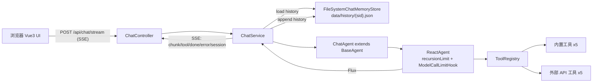

# Fish-Agent 项目结构快照（v1 / 2026-04-27）

> 本文档对应 plan `fish-agent_全栈实现_70f9605b.plan.md` 全部落地后的工程状态，
> 覆盖后端（Spring Boot 3.5 + Spring AI Alibaba Agent Framework）与前端（Vue 3.5 + Vite 6 + Element Plus）。

---

## 1. 总体架构



设计要点：

- 工具通过 SPI（`AgentToolProvider`）解耦注册，新增工具只需"建类 + `@Component`"，零侵入。
- Agent 用 `AgentStatus` 状态机 + `recursionLimit` + `ModelCallLimitHook` 三重防死循环。
- 历史存储抽象为 `ChatMemoryStore` 接口，默认文件系统实现，未来可平滑替换 Redis/ES。
- 前后端通过 SSE 流式协议通信，前端用 fetch + ReadableStream 解析帧。

---

## 2. 技术栈

| 层 | 选型 | 版本 | 说明 |
|---|---|---|---|
| JDK | Java | 21 | virtual threads 已开启 |
| 框架 | Spring Boot | 3.5.13 | 不能升 4.x（Spring AI Alibaba 1.1.2.x 仅支持 SB 3.5） |
| Agent | spring-ai-alibaba-agent-framework | 1.1.2.0 | ReactAgent 编排 |
| 模型 | spring-ai-alibaba-starter-dashscope | 1.1.2.0 | 通义千问 |
| 持久化 | 文件系统 / Jackson | - | data/history/{sid}.json |
| 网页解析 | Jsoup | 1.18.3 | WebFetchTool |
| 邮件 | spring-boot-starter-mail | - | MailTool |
| 前端 | Vue + Vite + Element Plus + Pinia | 3.5 / 6 / 2.10 / 3 | 单页应用 |
| 渲染 | marked + highlight.js | 14 / 11 | Markdown + 代码高亮 |

---

## 3. 后端目录结构

```
src/main/java/com/yuyu/fishagent/
├── FishAgentApplication.java                     启动入口（@SpringBootApplication）
├── agent/
│   ├── AgentStatus.java                          状态枚举：IDLE/RUNNING/FINISHED/ERROR/MAX_ITER_REACHED
│   ├── BaseAgent.java                            抽象基类：ChatModel + 状态机 + buildReactAgent()
│   ├── ChatAgent.java                            助手型 Agent（@Component），@PostConstruct 装配 ReactAgent
│   ├── tool/
│   │   ├── AgentToolProvider.java                工具 SPI：name() / build() / enabled()
│   │   ├── ToolRegistry.java                     自动收集 Provider，单工具失败隔离
│   │   ├── builtin/
│   │   │   ├── DateTimeToolProvider.java         get_current_datetime（IANA 时区）
│   │   │   ├── CalculatorToolProvider.java       calculator（自实现 Shunting-yard，无 ScriptEngine）
│   │   │   ├── WebFetchToolProvider.java         web_fetch（Jsoup 解析，8000 字符截断）
│   │   │   ├── FileReadToolProvider.java         file_read（沙盒 startsWith 校验）
│   │   │   └── FileWriteToolProvider.java        file_write（沙盒，支持 append）
│   │   └── external/
│   │       ├── TavilySearchToolProvider.java     web_search_tavily（@ConditionalOnProperty fish.tools.tavily.api-key）
│   │       ├── BochaSearchToolProvider.java      web_search_bocha（@ConditionalOnProperty fish.tools.bocha.api-key）
│   │       ├── AmapWeatherToolProvider.java      amap_weather（中文城市名自动转 adcode）
│   │       ├── AmapGeoToolProvider.java          amap_geocode（共用 AMAP_KEY）
│   │       └── MailToolProvider.java             send_mail（@ConditionalOnProperty spring.mail.host）
│   └── memory/
│       ├── ChatMemoryStore.java                  存储 SPI：load/append/appendAll/clear/listSessions
│       └── FileSystemChatMemoryStore.java        默认实现：每会话一把 ReentrantLock + temp + ATOMIC_MOVE
├── controller/
│   └── ChatController.java                       SSE 接口 + 会话管理 REST
├── service/
│   └── ChatService.java                          串联 store + agent + 流式 SSE 发射
├── dto/
│   ├── ChatRequest.java                          { sessionId, message }
│   ├── ChatMessageDTO.java                       { role, content, createdAt }
│   └── SessionInfo.java                          { sessionId, title, messageCount, updatedAt }
├── config/
│   ├── AgentProperties.java                      fish.agent.* (max-iterations / history-dir / sandbox-dir / instruction)
│   ├── ToolProperties.java                       fish.tools.* (tavily / bocha / amap)
│   └── WebMvcConfig.java                         CORS：localhost:* / 127.0.0.1:*
└── exception/
    └── GlobalExceptionHandler.java               IllegalArgumentException -> 400；其它 -> 500
```

资源文件：

```
src/main/resources/
└── application.yml      集中配置（spring.ai.dashscope / spring.mail / fish.agent / fish.tools）
```

运行期产物（不入版本库）：

```
data/
├── history/{sid}.json   会话历史（启动时自动创建）
└── sandbox/             文件读写工具的沙盒根
```

---

## 4. 前端目录结构

```
frontend/
├── package.json                vue 3.5 / vite 6 / element-plus 2.10 / pinia 3 / marked / highlight.js
├── vite.config.ts              /api 代理到 :8080，自动按需加载 Element Plus
├── tsconfig.json               strict + paths "@/*" -> "src/*"
├── index.html                  挂载点 #app
├── env.d.ts                    Vite 客户端类型
├── .env.development            VITE_API_BASE=（默认走 vite 代理）
├── auto-imports.d.ts           unplugin-auto-import 自动产物
├── components.d.ts             unplugin-vue-components 自动产物
└── src/
    ├── main.ts                 Pinia + Element Plus + 全局样式
    ├── App.vue                 仅渲染 ChatView
    ├── style.css               主题变量（CSS 变量）+ markdown 排版
    ├── api/
    │   └── chat.ts             fetch + ReadableStream 解析 SSE 帧（支持 AbortSignal 取消）
    ├── store/
    │   └── chat.ts             pinia：sessions / activeSid / messagesBySid / streaming / errorMsg
    ├── types/
    │   └── chat.ts             ChatMessage / SessionInfo（与后端 DTO 对齐）
    ├── utils/
    │   └── time.ts             相对时间格式化（刚刚 / N 分钟前 / 今天 HH:mm…）
    ├── components/
    │   ├── SessionSidebar.vue  会话列表（新建/切换/删除，streaming 期间禁用）
    │   ├── MessageList.vue     消息流 + 粘底滚动 + 回到底部按钮
    │   ├── MessageBubble.vue   用户/助手/工具三类气泡 + Markdown + 代码块 + 流式光标 + 复制
    │   └── ChatInput.vue       Enter 发送 / Shift+Enter 换行 / 取消生成
    └── views/
        └── ChatView.vue        三栏布局（侧栏 + 消息区 + 输入区）
```

---

## 5. HTTP / SSE 接口

| Method | Path | 说明 |
|---|---|---|
| POST | `/api/chat/stream` | 流式对话（SSE，5 分钟超时）。请求体：`{ sessionId?, message }` |
| GET | `/api/chat/sessions` | 列出全部会话摘要（按 updatedAt 倒序） |
| GET | `/api/chat/sessions/{sid}` | 取某会话历史消息列表 |
| DELETE | `/api/chat/sessions/{sid}` | 删除某会话 |

SSE 事件类型：

| event | data | 触发时机 |
|---|---|---|
| `session` | sid | 流开始时回推真实 sid（前端首次新建会话时收到后写回 store） |
| `chunk` | token 增量字符串 | 模型 token 流；做了"最终聚合 chunk 跳过"防止内容翻倍 |
| `tool` | 工具名 / JSON | 工具调用展示（前端用黄色卡片气泡） |
| `done` | 完整 assistant 文本 | 流正常结束 |
| `error` | 错误信息 | 流异常 / 取消 |

---

## 6. 内置 + 外部工具清单

| 名称 | 类型 | 启用条件 | 说明 |
|---|---|---|---|
| `get_current_datetime` | builtin | 始终 | 支持 IANA 时区 |
| `calculator` | builtin | 始终 | 自实现栈式求值，安全 |
| `web_fetch` | builtin | 始终 | Jsoup 抓取并去脚本/样式，8000 字符截断 |
| `file_read` | builtin | 始终 | 沙盒内读，256KB 截断 |
| `file_write` | builtin | 始终 | 沙盒内写，支持 append |
| `web_search_tavily` | external | `fish.tools.tavily.api-key` 非空 | 国际联网搜索 |
| `web_search_bocha` | external | `fish.tools.bocha.api-key` 非空 | 中文友好联网搜索 |
| `amap_weather` | external | `fish.tools.amap.key` 非空 | 实时/预报天气，中文城市名自动 → adcode |
| `amap_geocode` | external | `fish.tools.amap.key` 非空 | 地址 → adcode/经纬度 |
| `send_mail` | external | `spring.mail.host` 非空 | 纯文本邮件 |

> 任意 key 缺失，对应工具自动跳过装配，Agent 仍能正常运行（少了那项能力）。

---

## 7. 配置项（`application.yml`）

```
spring.ai.dashscope.api-key     ${DASHSCOPE_API_KEY:}
spring.mail.host/port/username/password
fish.agent.max-iterations       默认 10
fish.agent.history-dir          默认 data/history
fish.agent.sandbox-dir          默认 data/sandbox
fish.agent.instruction          系统人设（可在 yml 直接改）
fish.tools.tavily.api-key/base-url/max-results
fish.tools.bocha.api-key/base-url/count
fish.tools.amap.key/base-url
```

环境变量清单：

| 用途 | 变量名 | 备注 |
|---|---|---|
| 通义千问 | `DASHSCOPE_API_KEY` | 必填 |
| Tavily 搜索 | `TAVILY_API_KEY` | 可选 |
| 博查搜索 | `BOCHA_API_KEY` | 可选 |
| 高德 | `AMAP_KEY` | 可选（天气 + 地理共用） |
| 邮件 | `MAIL_HOST` `MAIL_USERNAME` `MAIL_PASSWORD` `MAIL_PORT` | 可选 |

---

## 8. 防死循环机制（三重保险）

1. **`CompileConfig.recursionLimit`**（`BaseAgent#buildReactAgent`）
   - 取 `max(maxIterations * 4, 20)`，graph 节点切换硬上限，触达抛异常。
2. **`ModelCallLimitHook`**
   - `runLimit = maxIterations`，触达后追加 AssistantMessage 跳到 end，模型不会再被调用，优雅终止。
3. **`AgentStatus` 状态机**
   - `BaseAgent` 持 `AtomicReference<AgentStatus>`；`ChatAgent.stream` 在 `doOnComplete/doOnError/doOnCancel` 中迁移状态，便于日志/监控观察。

---

## 9. 启动方式

后端：

```bash
$env:DASHSCOPE_API_KEY="sk-..."   # PowerShell
mvn spring-boot:run
```

前端：

```bash
cd frontend
pnpm i
pnpm dev
```

访问 `http://localhost:5173`，问 "上海现在天气怎么样？" 即可端到端验证：
1. 助手判定需要调天气工具；
2. SSE 持续推送增量 token；
3. 消息持久化到 `data/history/{sid}.json`，刷新页面后历史仍在。

---

## 10. 已知差异 / 后续可选增强

| 项 | 当前状态 | 可选改进 |
|---|---|---|
| sid 级并发互斥 | `ChatService` 未做（前端 streaming 期间已禁用按钮兜底） | 加 `ConcurrentHashMap<String, AtomicBoolean>` 抢占 |
| `AgentStatus.MAX_ITER_REACHED` | 枚举值已定义，未被赋值（触达上限走 `END` 后是 `FINISHED`） | 监听 hook 触发后显式 `transitionTo(MAX_ITER_REACHED)` 并 SSE 推 `event: warn` |
| 工具调用气泡 | SSE 事件已支持，需要后端在 `ChatService.handleNode` 里对 `ToolResponseMessage` 类节点 emit `event: tool` | 当前仅做了 token chunk 转发 |
| 多模型切换 | 仅 DashScope | 抽象 `ChatModel` Bean factory，按 sid/请求选择 |

---

## 11. 文件清单（去除 node_modules / target / data）

后端（27 个 .java + 1 个 yml）：见第 3 节目录树。

前端（17 个工程文件）：

```
.env.development
.gitignore
auto-imports.d.ts
components.d.ts
env.d.ts
index.html
package.json
pnpm-lock.yaml
README.md
tsconfig.json
vite.config.ts
src/App.vue
src/main.ts
src/style.css
src/api/chat.ts
src/components/ChatInput.vue
src/components/MessageBubble.vue
src/components/MessageList.vue
src/components/SessionSidebar.vue
src/store/chat.ts
src/types/chat.ts
src/utils/time.ts
src/views/ChatView.vue
```

---

_快照生成时间：2026-04-27 · 版本 v1_
