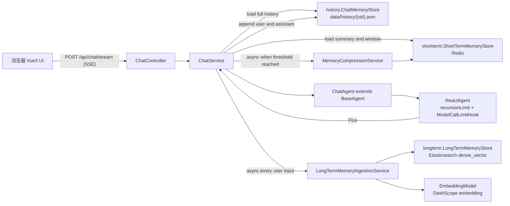

# Fish-Agent 项目结构快照（v1.1 / 2026-04-27）

> 本文档基于 `项目结构-v1-20260427.md` 更新，记录 v1.1 中新增的 AI 记忆管理能力：
> Redis 短期记忆摘要、ES 向量长期记忆主动录入、记忆模块分包解耦，以及关键 debug 日志链路。

---

## 1. 总体架构



设计要点：

- 原始聊天历史、短期摘要、长期事实分包隔离，避免一个 `memory` 包同时承载多种语义。
- 短期记忆只用于上下文压缩：达到阈值后生成摘要 + 最近消息窗口，写入 Redis。
- 长期记忆改为主动录入：每轮用户输入后独立判断“我是谁 / 我喜欢什么 / 长期偏好”等稳定事实，再写入 ES 向量索引。
- 短期摘要流程不写 ES，避免把摘要产物重复灌入长期记忆。
- 记忆链路补充 `log.debug`，方便观察触发、跳过、写入和失败原因。

---

## 2. 技术栈变化

| 层 | 选型 | 说明 |
|---|---|---|
| JDK | Java 21 | 与 v1 一致，virtual threads 已开启 |
| Agent | Spring AI Alibaba Agent Framework 1.1.2.0 | ReAct 编排不变 |
| ChatModel | DashScope | 对话与记忆判断共用当前 `ChatModel` |
| Embedding | DashScope Embedding | 用于长期事实向量化 |
| 短期记忆 | Redis + Jackson | 保存 `summary` 和最近 N 条消息窗口 |
| 长期记忆 | Elasticsearch `dense_vector` | 保存长期事实原文 + embedding |
| 原始历史 | 文件系统 JSON | `data/history/{sid}.json`，作为完整事实来源 |

---

## 3. 后端目录结构

```text
src/main/java/com/yuyu/fishagent/
├── FishAgentApplication.java
├── agent/
│   ├── AgentStatus.java
│   ├── BaseAgent.java
│   ├── ChatAgent.java
│   ├── memory/
│   │   ├── history/
│   │   │   ├── ChatMemoryStore.java                 原始聊天历史 SPI
│   │   │   └── FileSystemChatMemoryStore.java       文件系统历史实现
│   │   ├── shortterm/
│   │   │   ├── ShortTermMemoryStore.java            短期记忆 SPI
│   │   │   ├── ShortTermMemorySnapshot.java         摘要 + 最近消息窗口
│   │   │   └── RedisShortTermMemoryStore.java       Redis 短期记忆实现
│   │   ├── longterm/
│   │   │   ├── LongTermMemoryStore.java             长期记忆 SPI
│   │   │   ├── LongTermMemoryDocument.java          ES 长期事实文档
│   │   │   ├── ElasticsearchLongTermMemoryStore.java ES dense_vector 写入实现
│   │   │   ├── LongTermMemoryPromptBuilder.java     主动录入 Prompt
│   │   │   └── LongTermMemoryResponseParser.java    长期事实 JSON 解析
│   │   └── compress/
│   │       ├── MemoryPromptBuilder.java             短期摘要 Prompt
│   │       └── MemoryResponseParser.java            短期摘要 JSON 解析
│   └── tool/
│       ├── AgentToolProvider.java
│       ├── ToolRegistry.java
│       ├── builtin/
│       └── external/
├── controller/
│   ├── ChatController.java
│   └── MemoryController.java                        手动记忆压缩接口
├── service/
│   ├── ChatService.java                             聊天编排 + 记忆触发
│   ├── MemoryCompressionService.java                短期摘要压缩，只写 Redis
│   └── LongTermMemoryIngestionService.java          长期事实主动录入，只写 ES
├── dto/
│   ├── ChatRequest.java
│   ├── ChatMessageDTO.java
│   ├── MemoryCompressionRequest.java
│   ├── MemoryCompressionResult.java
│   └── SessionInfo.java
├── config/
│   ├── AgentProperties.java
│   ├── MemoryProperties.java                        fish.memory.* 配置
│   ├── ToolProperties.java
│   └── WebMvcConfig.java
└── exception/
    └── GlobalExceptionHandler.java
```

资源文件：

```text
src/main/resources/
└── application.yml      DashScope / Redis / Elasticsearch / fish.agent / fish.memory / fish.tools
```

运行期产物：

```text
data/
├── history/{sid}.json   原始完整会话历史
└── sandbox/             文件读写工具沙盒根目录
```

---

## 4. 记忆功能行为

### 4.1 原始历史

`history.ChatMemoryStore` 仍然保存完整聊天记录，默认实现为 `FileSystemChatMemoryStore`：

- 每个会话一个 JSON 文件。
- 每个 sessionId 一把 `ReentrantLock`。
- 写入使用临时文件 + rename，降低文件损坏风险。

### 4.2 短期记忆

短期记忆用于控制模型上下文长度：

1. `ChatService` 每轮先加载完整文件历史。
2. 再读取 `ShortTermMemoryStore.load(sid)`。
3. 如果 Redis 中有摘要，把摘要作为 `SystemMessage` 注入模型上下文。
4. 上下文消息优先使用 Redis 最近窗口；没有 Redis 快照时，从文件历史截取最近 N 条。
5. 当完整历史条数达到 `fish.memory.summary-trigger-threshold` 时，异步调用 `MemoryCompressionService`。
6. `MemoryCompressionService` 只写 Redis，不写 ES。

短期摘要 Prompt 明确要求：

- 只生成 `short_term_summary`。
- `long_term_facts` 必须返回空数组。
- 不负责长期事实录入。

### 4.3 长期记忆

长期记忆用于保存稳定用户事实：

1. 每轮聊天完成后，`ChatService` 都会异步触发 `LongTermMemoryIngestionService`。
2. 服务只分析当前 `userInput`，不分析短期摘要。
3. `LongTermMemoryPromptBuilder` 要求模型只提取稳定事实。
4. 没有稳定事实时返回空数组并跳过 ES。
5. 有事实时调用 `LongTermMemoryStore.saveFacts`。
6. `ElasticsearchLongTermMemoryStore` 使用 `EmbeddingModel` 生成向量，并写入 ES `dense_vector` 索引。

会录入的例子：

- “我叫鱼鱼”
- “我喜欢喝拿铁”
- “我正在开发 Fish-Agent 项目”

会过滤的例子：

- “我是谁？”
- “帮我查天气”
- “agent 喜欢充电”
- 临时任务、寒暄、未确认推测

---

## 5. 关键接口

| Method | Path | 说明 |
|---|---|---|
| POST | `/api/chat/stream` | 主聊天接口，SSE 流式返回，同时触发短期/长期记忆链路 |
| GET | `/api/chat/sessions` | 列出会话 |
| GET | `/api/chat/sessions/{sid}` | 获取会话完整历史 |
| DELETE | `/api/chat/sessions/{sid}` | 删除会话 |
| POST | `/api/memory/compress` | 手动短期记忆压缩接口，主要用于调试 |

注意：`/api/memory/compress` 现在只应视为短期摘要入口，不再负责长期 ES 写入。

---

## 6. 配置项

当前 `application.yml` 关键配置：

```yaml
spring:
  ai:
    dashscope:
      api-key: ${DASHSCOPE_API_KEY:}
      embedding:
        options:
          model: ${DASHSCOPE_EMBEDDING_MODEL:text-embedding-v2}
          dimensions: ${DASHSCOPE_EMBEDDING_DIMENSIONS:1536}
  data:
    redis:
      host: ${REDIS_HOST:localhost}
      port: ${REDIS_PORT:6379}
      password: ${REDIS_PASSWORD:}
      database: ${REDIS_DATABASE:2}
  elasticsearch:
    uris: ${ELASTICSEARCH_URIS:http://localhost:9200}
    username: ${ELASTICSEARCH_USERNAME:}
    password: ${ELASTICSEARCH_PASSWORD:}

fish:
  memory:
    short-term-window-size: 20
    summary-trigger-threshold: 30
    redis-key-prefix: fish:memory
    short-term-ttl-days: 30
    long-term-enabled: ${MEMORY_LONG_TERM_ENABLED:true}
    long-term-index-name: fish-long-term-memory
    embedding-dimensions: ${DASHSCOPE_EMBEDDING_DIMENSIONS:1536}
```

环境变量清单：

| 用途 | 变量名 | 说明 |
|---|---|---|
| 通义千问 / Embedding | `DASHSCOPE_API_KEY` | 必填 |
| Embedding 模型 | `DASHSCOPE_EMBEDDING_MODEL` | 默认 `text-embedding-v2` |
| Embedding 维度 | `DASHSCOPE_EMBEDDING_DIMENSIONS` | 默认 `1536`，需与 ES mapping 一致 |
| Redis | `REDIS_HOST` `REDIS_PORT` `REDIS_PASSWORD` `REDIS_DATABASE` | 短期记忆 |
| Elasticsearch | `ELASTICSEARCH_URIS` `ELASTICSEARCH_USERNAME` `ELASTICSEARCH_PASSWORD` | 长期向量记忆 |
| 长期记忆开关 | `MEMORY_LONG_TERM_ENABLED` | 默认 `true` |

---

## 7. Debug 日志

v1.1 为记忆链路补充了关键 debug 日志：

- `ChatService`
  - 是否读取到短期摘要
  - 本轮上下文窗口大小
  - 是否触发短期摘要压缩
  - 是否触发长期记忆主动录入
- `MemoryCompressionService`
  - 开始/完成短期摘要压缩
  - Redis 写入的摘要长度和窗口数量
  - 明确输出“短期摘要流程不写入 ES”
- `LongTermMemoryIngestionService`
  - 当前输入是否进入长期事实判断
  - 是否提取到长期事实
  - 没有事实时跳过 ES 写入
- `RedisShortTermMemoryStore`
  - RedisTemplate 是否可用
  - 写入/读取的 key
  - summary 是否命中、窗口消息数量
- `ElasticsearchLongTermMemoryStore`
  - 长期记忆是否启用
  - ES 索引是否创建或已存在
  - `EmbeddingModel` / `ElasticsearchOperations` 是否可用
  - 每条事实写入的 id、index、向量维度

---

## 8. 验证结论

当前验证结论：

- 短期记忆摘要可正常写入 Redis。
- 长期记忆主动录入可正常写入 ES 向量索引。
- “我叫鱼鱼”等稳定身份事实会录入。
- “agent 喜欢充电”等非用户事实不会错误录入。
- 短期摘要不再写 ES，避免长期记忆冗余。

---

## 9. v1.1 改动摘要

相对 v1，主要改动如下：

- 新增 `MemoryProperties`，集中配置 `fish.memory.*`。
- `memory` 包拆分为 `history`、`shortterm`、`longterm`、`compress` 四个子域。
- `ChatService` 接入短期摘要读取、上下文滑动窗口、短期摘要阈值触发。
- 新增 `MemoryCompressionService`，负责短期摘要压缩和 Redis 写入。
- 新增 `LongTermMemoryIngestionService`，负责每轮用户输入后的长期事实主动录入。
- 新增 ES 向量存储实现：`LongTermMemoryDocument` + `ElasticsearchLongTermMemoryStore`。
- 新增长期记忆专用 Prompt 和 JSON Parser，避免复用短期摘要输出。
- `application.yml` 增加 Redis、Elasticsearch、DashScope Embedding 和 debug 日志配置。

---

## 10. 后续可选增强

| 项 | 当前状态 | 可选改进 |
|---|---|---|
| 长期记忆召回 | 已写入 ES，但聊天上下文暂未召回 | 增加向量检索 topK，把相关长期事实注入 `ChatService` 上下文 |
| 长期事实去重 | 依赖模型过滤，ES 层未去重 | 写入前按相似度或 hash 去重 |
| 记忆录入模型 | 复用当前 `ChatModel` | 抽象专用 MemoryModelClient，便于使用更便宜的小模型 |
| 异步执行器 | 使用 `CompletableFuture.runAsync` 默认线程池 | 配置独立线程池，限制并发和队列 |
| ES mapping 变更 | 启动时仅在索引不存在时创建 | 增加索引版本和迁移策略 |

---

_快照生成时间：2026-04-27 · 版本 v1.1_
