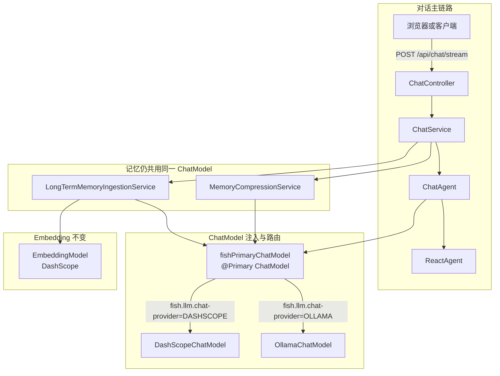
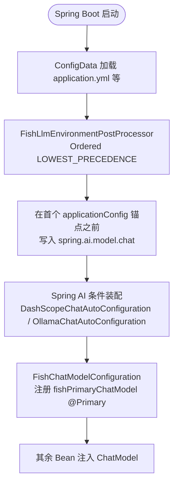
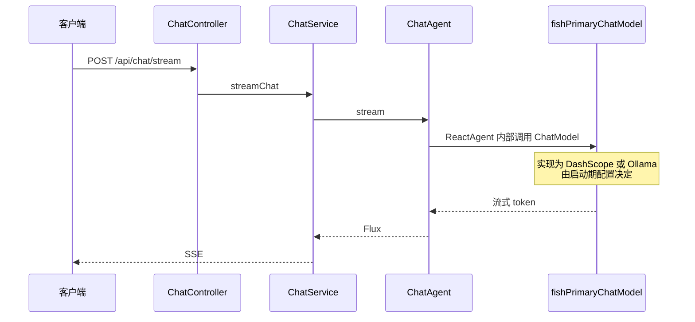

# Fish-Agent 更新说明（v1.2 / 2026-05-02）

> 本文档为**增量更新**，目录结构与 [项目结构-v1.1-20260427.md](../项目结构-v1.1-20260427.md) 对齐，**仅描述相对 v1.1 的变更**：接入本地 Ollama（如 `qwen2.5:7b`）、与 DashScope 云端对话可切换、`spring-ai-bom` 与 Spring AI Ollama starter 依赖、配置与启动流程说明。  
> 未重复叙述 v1.1 中记忆、Redis、ES 等既有能力。

---

## 1. 总体架构（变更视角）

在 v1.1 主链路不变的前提下，**对话用 `ChatModel`** 增加「云端 DashScope / 本地 Ollama」二选一；**Embedding** 仍仅走 DashScope（长期记忆向量化不变）。



设计要点（增量）：

- 业务层仍只依赖 `org.springframework.ai.chat.model.ChatModel`，`ChatService` / `ChatAgent` / 记忆服务**无需改调用签名**。
- 通过 `fish.llm.chat-provider` 与 `spring.ai.model.chat` 协同，保证 Spring AI 条件装配**只激活一套** Chat 自动配置；另用 `@Primary` 的 `fishPrimaryChatModel` 消除多实现 Bean 的注入歧义。
- 切换为本地模型后，**短期摘要与长期事实判断**也会走同一套 `ChatModel`（与 v1.1「共用 ChatModel」一致）；若日后要单独「记忆用小模型」，需再拆 Bean（本次未做）。

---

## 2. 技术栈变化（仅更新行）

| 层 | v1.1 | v1.2 说明 |
|---|---|---|
| 依赖管理 | 无 Spring AI BOM | 增加 `spring-ai-bom`（`spring-ai.version` 与 Alibaba 对齐，当前 **1.1.4**） |
| ChatModel | 仅 DashScope | **DashScope 或 Ollama** 二选一，由配置决定；默认 **DashScope** |
| 本地推理 | 无 | **Ollama**：`spring-ai-starter-model-ollama`，默认连接 `http://localhost:11434`，模型名可配 |
| Embedding | DashScope | **不变**，仍为 DashScope |

---

## 3. 后端目录结构（增量）

在 v1.1 `config/` 下新增子包 **`config/llm/`**（仅与对话路由相关）：

```text
src/main/java/com/yuyu/fishagent/config/llm/
├── FishLlmChatProvider.java              枚举 DASHSCOPE / OLLAMA 与 spring.ai.model.chat 字面量映射
├── FishLlmProperties.java              fish.llm.* 配置绑定
├── FishLlmEnvironmentPostProcessor.java 启动早期写入 spring.ai.model.chat（见第 6 节）
├── FishChatModelConfiguration.java     @Primary ChatModel，按 fish.llm 选择具体实现
└── FishLlmConfigurationConsistencyLogger.java 启动后对比 fish 与 spring.ai.model.chat 并打日志
```

资源文件（增量）：

```text
src/main/resources/
├── application.yml                       增加 fish.llm、spring.ai.ollama 等（见第 5 节）
└── META-INF/
    └── spring.factories                  注册 FishLlmEnvironmentPostProcessor
```

`pom.xml`（增量）：

- `dependencyManagement` 导入 `spring-ai-bom`。
- 依赖 `spring-ai-starter-model-ollama`（版本由 BOM 管理）。

---

## 4. 关键行为说明

### 4.1 `fish.llm.chat-provider` 与 `spring.ai.model.chat`

| `fish.llm.chat-provider` | 推导的 `spring.ai.model.chat` | 装配的 Chat 实现 |
|---|---|---|
| `DASHSCOPE`（默认） | `dashscope` | `DashScopeChatModel` |
| `OLLAMA` | `ollama` | `OllamaChatModel` |

Spring AI / Alibaba 通过 **`spring.ai.model.chat`** 上的 `@ConditionalOnProperty` 决定启用哪一套 Chat 自动配置；**必须与 `fish.llm.chat-provider` 一致**，否则会出现「fish 为 OLLAMA 但容器里没有 `OllamaChatModel`」的启动失败。

### 4.2 配置占位符

```yaml
fish:
  llm:
    chat-provider: ${FISH_LLM_CHAT_PROVIDER:DASHSCOPE}
```

含义：**若存在环境变量 `FISH_LLM_CHAT_PROVIDER`，则以其为准**；未设置时使用默认值 `DASHSCOPE`。因此仅改 yaml 是生效的，但若 IDE / 系统里仍设置了 `FISH_LLM_CHAT_PROVIDER`，会覆盖 yaml 中的字面量。

### 4.3 更高优先级覆盖（运维常用）

以下来源若设置了 `spring.ai.model.chat`，优先级**高于**由 `FishLlmEnvironmentPostProcessor` 插入到 ConfigData 之前的推导值（仍低于部分系统级来源时以 Spring 实际 `PropertySources` 顺序为准，实践中以 **环境变量 / JVM 参数** 为准）：

- 环境变量 **`SPRING_AI_MODEL_CHAT`**（如 `ollama` / `dashscope`）
- JVM 参数 **`-Dspring.ai.model.chat=...`**

**建议**：日常用 `fish.llm.chat-provider` 切换；若与 `SPRING_AI_MODEL_CHAT` 同时配置且不一致，以环境变量为准，并留意启动日志里 `[FishLlm]` 的告警或一致性日志。

---

## 5. 配置项（增量）

`application.yml` 中与本次更新相关的键（节选说明，完整以仓库文件为准）：

| 键 / 环境变量 | 说明 |
|---|---|
| `fish.llm.chat-provider` | `DASHSCOPE` \| `OLLAMA`；可用 `FISH_LLM_CHAT_PROVIDER` 注入 |
| `spring.ai.ollama.base-url` | 默认 `http://localhost:11434`；可用 `OLLAMA_BASE_URL` |
| `spring.ai.ollama.chat.options.model` | 默认 `qwen2.5:7b`；可用 `OLLAMA_CHAT_MODEL`，需与本机 `ollama pull` 名称一致 |
| `spring.ai.dashscope.*` | 云端 API Key、Embedding 等，与 v1.1 一致；**对话走 DashScope 时仍必填 API Key** |
| `SPRING_AI_MODEL_CHAT` | 可选；显式指定框架选用哪套 Chat 自动配置 |

---

## 6. LLM 路由与启动流程（流程图）

### 6.1 属性写入与装配顺序（逻辑）



要点：

- **EnvironmentPostProcessor 使用 `Ordered.LOWEST_PRECEDENCE`**，确保在 **ConfigData 已注册 `applicationConfig:` 属性源之后**再执行，从而能找到锚点并把 `spring.ai.model.chat` 插在 **yaml 配置块之前**，避免「EPP 过早执行 → 仅 addLast → 最终被后续配置覆盖」导致仍为 `dashscope`、Ollama 未装配的问题。
- 成功时日志会出现 **`[FishLlm] 已根据 fish.llm.chat-provider=... 设置 spring.ai.model.chat=...`**；若未找到锚点会有 **WARN**，提示检查覆盖关系。

### 6.2 运行时请求路径（对话）



---

## 7. 常见问题（FAQ）

| 现象 | 可能原因 | 处理建议 |
|---|---|---|
| `fish.llm.chat-provider=OLLAMA` 但报「需要 OllamaChatModel Bean，但未注册」 | 运行时 `spring.ai.model.chat` 仍为 `dashscope`，或 Ollama 自动配置未满足 | 查看异常中打印的 **`spring.ai.model.chat` 当前值**；删除冲突的 **`SPRING_AI_MODEL_CHAT=dashscope`**；确认本机 Ollama 已启动且已 **`ollama pull`** 与配置一致的模型名 |
| 本机已部署 Ollama 仍走 DashScope | 未将 `fish.llm.chat-provider` 设为 `OLLAMA`，或环境变量仍为默认 / 被覆盖 | 设 `OLLAMA` 或 `FISH_LLM_CHAT_PROVIDER=OLLAMA`；看启动日志 **`[FishLlm] 对话模型路由：...`** |
| 改 yaml 不生效 | 环境变量 `FISH_LLM_CHAT_PROVIDER` 或 `SPRING_AI_MODEL_CHAT` 覆盖 | 检查 IDE 运行配置与系统环境变量 |

---

## 8. 验证建议（增量）

- **DashScope**：`fish.llm.chat-provider=DASHSCOPE`，`DASHSCOPE_API_KEY` 有效，`/api/chat/stream` 正常。
- **Ollama**：`fish.llm.chat-provider=OLLAMA`，本机 Ollama 可访问，`OLLAMA_CHAT_MODEL` 与已拉取模型一致，应用启动无 `OllamaChatModel` 缺失错误，再测 `/api/chat/stream`。
- **切换**：仅改配置（及必要环境变量）后重启即可，无需改 Controller / Service 业务代码。

---

## 9. v1.2 改动摘要（相对 v1.1）

- `pom.xml`：`spring-ai-bom` + `spring-ai-starter-model-ollama`。
- `application.yml`：`fish.llm`、`spring.ai.ollama` 块与注释。
- `config/llm/*`：`FishLlmEnvironmentPostProcessor`（`META-INF/spring.factories`）、`FishChatModelConfiguration`、`FishLlmProperties`、`FishLlmChatProvider`、`FishLlmConfigurationConsistencyLogger`。
- 单元测试：`FishLlmChatProviderTest`；既有 `FishAgentApplicationTests` 仍用于校验上下文可加载。

---

_文档版本：v1.2 · 生成日期：2026-05-02 · 对应代码变更：Ollama 接入与对话模型可切换_
