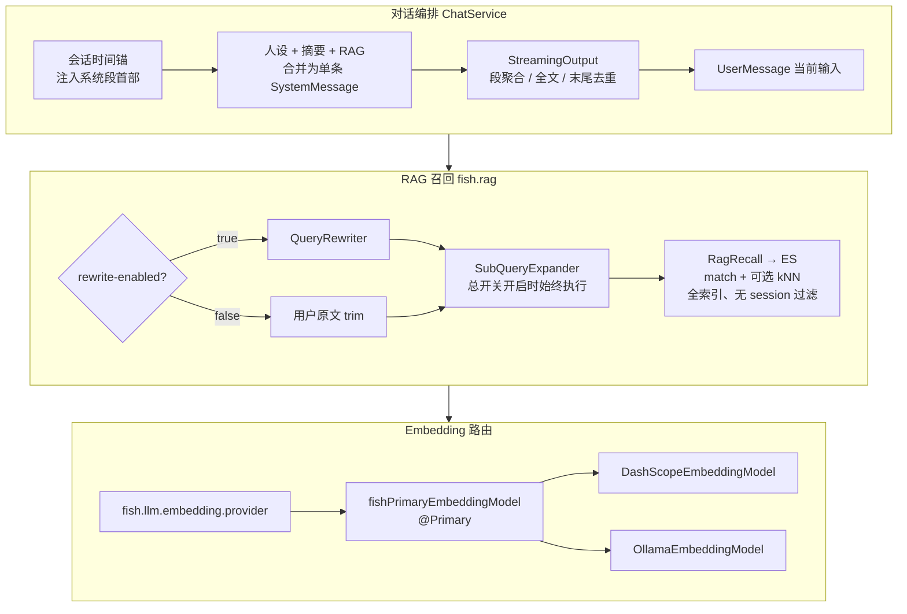
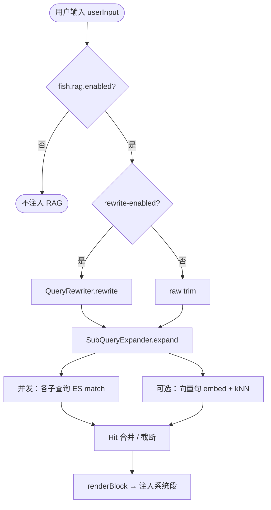
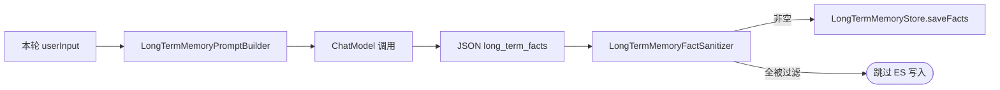
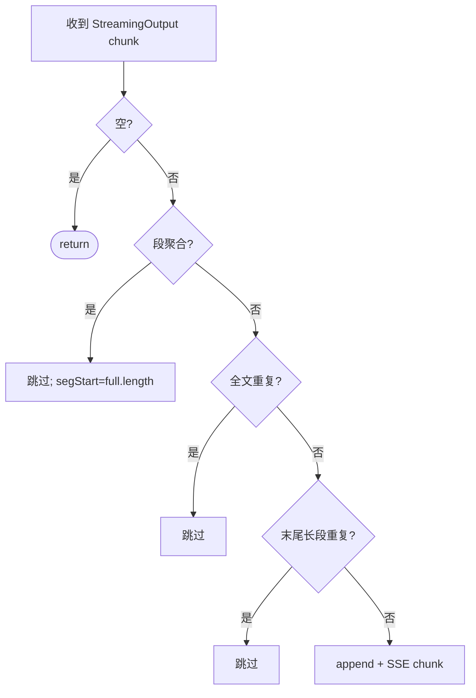

# Fish-Agent 更新说明（v1.3 / 2026-05-02）

> 本文档为**增量更新**，叙述风格与 [v1.1-记忆更新-20260427.md](./v1.1-记忆更新-20260427.md)、[v1.2-Ollama与对话路由更新-20260502.md](./v1.2-Ollama与对话路由更新-20260502.md) 对齐，**仅描述相对 v1.2 的变更**。  
> 范围：**长期记忆 RAG 召回**、**Embedding 与对话路由解耦**、**系统消息与时间锚**、**SSE 流式去重**、**长期事实写入过滤**、以及相关的 `fish.rag` / `fish.llm` 配置与体验优化。  
> 未重复叙述 v1.2 中 Ollama/DashScope 对话切换、EnvironmentPostProcessor 等既有内容。

---

## 1. 总体架构（变更视角）

在 v1.2 主链路不变的前提下，本版本在 **Chat 编排层** 与 **记忆/RAG 层** 做了以下收敛：

- **RAG**：可选查询重写 + **始终**多查询扩展 + **全索引** ES 文本/向量召回（不再按 `sessionId` 过滤）；对模型暴露的上下文合并为**单条** `SystemMessage` 片段，并约束「勿对用户复述记忆元话术」。
- **Embedding**：与 `fish.llm.chat-provider` **解耦**，由 `fish.llm.embedding.provider` 单独选择 DashScope / Ollama，并注册 `@Primary` `fishPrimaryEmbeddingModel` 消除双 starter 下的多 Bean 歧义。
- **时间**：每轮请求在合并系统段**最前**注入服务器当前时间（与 `get_current_datetime` 默认行为一致），人设补充「以会话时间为锚、搜索日期≠此刻」。
- **流式输出**：在 `ChatService` 侧识别段聚合与**整段/末尾重复** chunk，减少同一轮回答在 UI 上出现两遍长文。
- **长期记忆写入**：提示词收紧 + `LongTermMemoryFactSanitizer` 过滤，避免把 **Fish-Agent 产品能力说明** 写入 ES。



设计要点（增量）：

- **单条 `SystemMessage`**：`ReactAgent` 的 `systemPrompt` 置空，人设与记忆上下文全部由 `ChatService` 合并注入，避免 Alibaba `AgentLlmNode` 对「多条 SystemMessage」的英文 WARN，并降低模型对用户复述「长期记忆片段」类元话术的概率。
- **RAG 与「用户气泡」仍解耦**：`persist` 仍使用原始 `userInput`；仅模型上下文中的系统段携带 RAG 块。

---

## 2. 技术栈与行为变化（相对 v1.2）

| 主题 | v1.2 | v1.3 说明 |
|---|---|---|
| Embedding 路由 | 文档写「仍仅 DashScope」；代码曾随 `chat-provider` 对齐 | **`fish.llm.embedding.provider`** 独立配置，默认 `DASHSCOPE`；`FishEmbeddingModelConfiguration` 注册 `@Primary` `EmbeddingModel` |
| 多 `EmbeddingModel` Bean | 双 starter 下可能 `NoUniqueBeanDefinitionException` | 由 `@Primary` 主 Bean 统一注入 RAG / 长期写入 |
| 长期记忆 ES 召回 | 若曾按会话过滤则同会话可见 | **全索引** `match(content)` + 无 filter 的 kNN；`sessionId` 参数在接口上保留，ES 实现忽略 |
| RAG 查询扩展 | — | **`fish.rag.enabled=true` 时始终扩展**，无单独「扩展开关」 |
| RAG 查询重写 | — | **`fish.rag.rewrite-enabled`** 手控；`false` 时用用户原文 trim 进入扩展与向量句 |
| 系统时间 | 依赖模型或搜索推断「现在」 | **每轮注入**「当前会话时间（服务器，时区 …）」+ 人设规则 |
| SSE 流式 | 段聚合去重 | 增加 **全文相同**、**末尾长段相同** 去重；换行规范化比较 |
| 长期事实入库 | 仅模型 JSON 约束 | **提示词**排除产品说明 + **`LongTermMemoryFactSanitizer`** 写入前过滤 |

---

## 3. 后端目录结构（增量）

在既有 `agent/memory/`、`config/llm/`、`service/` 基础上新增或显著扩展的包与类：

```text
src/main/java/com/yuyu/fishagent/
├── agent/memory/rag/
│   ├── query/
│   │   ├── RagQueryRewrite.java
│   │   └── RagQueryRewriteConfiguration.java
│   ├── expand/
│   │   ├── RagQueryExpand.java
│   │   └── RagQueryExpandConfiguration.java
│   └── recall/
│       ├── RagRecall.java                    ES 文本/向量检索、合并、渲染注入块
│       └── RagRecallConfiguration.java       ragRecallExecutor、DocumentSearcher Bean
├── agent/memory/longterm/
│   └── LongTermMemoryFactSanitizer.java      写入 ES 前过滤「Fish-Agent 能力说明」类误抽取
├── config/
│   ├── RagProperties.java                    fish.rag.* 绑定
│   └── llm/
│       ├── FishLlmEmbeddingProperties.java fish.llm.embedding.*
│       └── FishEmbeddingModelConfiguration.java  @Primary EmbeddingModel
└── service/
    └── ChatService.java                      单条 SystemMessage、时间锚、流式去重、触发 RAG
```

资源与配置（增量键，完整以仓库 `application.yml` 为准）：

```text
src/main/resources/application.yml
  fish.llm.embedding.*
  fish.rag.*
  fish.agent.instruction（时间锚、搜索日期、记忆元话术等行为约束）
```

---

## 4. 关键行为说明

### 4.1 RAG：`fish.rag`

| 键 / 概念 | 说明 |
|---|---|
| `fish.rag.enabled` | 总开关；`false` 时不跑 RAG、不调 ES |
| `fish.rag.rewrite-enabled` | **查询重写**开关；`false` 用用户原文 trim |
| `fish.rag.rewrite-provider` 等 | 仅在 `rewrite-enabled=true` 时参与 `QueryRewriter` 选型 |
| 多查询扩展 | **无单独关闭项**；`enabled=true` 时始终 `SubQueryExpander.expand` |
| ES 召回 | **不按 `sessionId` 过滤**；文本 `match` + 可选向量 kNN |

### 4.2 LLM：`fish.llm.embedding`

与 `fish.llm.chat-provider` **独立**：

| `fish.llm.embedding.provider` | 主 `EmbeddingModel` 来源 |
|---|---|
| `DASHSCOPE`（默认） | `DashScopeEmbeddingModel` |
| `OLLAMA` | `OllamaEmbeddingModel` |

启动日志中 `[FishLlm]` 会额外打印一行 **嵌入模型路由**。

### 4.3 `ChatService` 系统段与时间锚

每轮在合并系统段**最前**追加一行（示例形态）：

`当前会话时间（服务器，时区 Asia/Shanghai）：2026-05-02 14:18:00。`

格式与 **`get_current_datetime` 不传 `timezone`** 时一致（`ZoneId.systemDefault()` + `yyyy-MM-dd HH:mm:ss`）。

### 4.4 流式去重（`handleNode`）

对 `StreamingOutput.chunk()` 依次判定：

1. **段聚合**：规范化换行后，若 chunk 等于本段自 `segStart` 起的累计文本 → 跳过并推进 `segStart`。
2. **整段重复**：规范化后 chunk 与当前**全文**相同且长度 ≥ 48 → 跳过。
3. **末尾长段重复**：chunk 为**真后缀**（短于全文）、长度 ≥ 160，且规范化后与 `full` 末尾一致 → 跳过（覆盖「前半正常、后半整块再来一遍」类框架重复 flush）。

### 4.5 长期事实：`LongTermMemoryFactSanitizer`

在 `LongTermMemoryIngestionService` 解析 `long_term_facts` 之后、`saveFacts` 之前执行。典型丢弃：

- `Fish-Agent 是一个具备思考推理、工具调用、记忆、RAG…`

典型保留：

- `用户是 Fish-Agent 的开发者`
- `用户名叫鱼鱼`、`用户喜欢喝可乐`

---

## 5. 配置项（增量节选）

| 键 / 环境变量 | 说明 |
|---|---|
| `fish.llm.embedding.provider` | `DASHSCOPE` \| `OLLAMA`；可用 `FISH_LLM_EMBEDDING_PROVIDER` |
| `fish.rag.enabled` | RAG 总开关 |
| `fish.rag.rewrite-enabled` | 查询重写；可用 `FISH_RAG_REWRITE_ENABLED` |
| `fish.rag.rewrite-provider` | `NONE` \| `CHAT_MODEL`（依赖重写开启） |
| `fish.rag.recall.*` | 子查询条数、`vector-leg-enabled`、`knn-num-candidates` 等（**已无** `session-scoped-only`） |

---

## 6. 流程图

### 6.1 RAG 编排（单轮用户输入）



### 6.2 长期记忆主动录入（含过滤）



### 6.3 流式 chunk 判定顺序（逻辑）



---

## 7. 常见问题（FAQ）

| 现象 | 可能原因 | 处理建议 |
|---|---|---|
| 日志 WARN：`EmbeddingModel` 找到 2 个 Bean | 同时引入 DashScope 与 Ollama starter | 确认已升级到含 `FishEmbeddingModelConfiguration` 的版本；检查 `fish.llm.embedding.provider` |
| RAG 向量腿失败 / 无向量召回 | Embedding 与索引维度不一致、或 ES 不可用 | 对齐 `memory.embedding-dimensions` 与所选 Embedding；看 `[RagRecall]` 日志 |
| 仍出现「长期记忆片段」类对用户说法 | 模型偶发不遵守约束 | 检查 `fish.agent.instruction` 与 `RagRecall.renderBlock` 是否被自定义覆盖 |
| 同一轮回答仍出现两遍（短段） | 去重阈值对极短重复不生效 | 属刻意保留短句重复；若仍有问题可抓 `DEBUG` 下 chunk 形态再调规则 |
| ES 里仍有历史「Fish-Agent 能力说明」 | 过滤只影响新写入 | 在 Kibana 或 Delete API 清理旧文档，或按会话重建索引 |

---

## 8. 验证建议（增量）

- **Embedding 独立**：`fish.llm.chat-provider=OLLAMA` 且 `fish.llm.embedding.provider=DASHSCOPE`，确认长期记忆写入与 RAG 向量仍用 DashScope 维度；启动无 `EmbeddingModel` 歧义异常。
- **RAG**：开启 `fish.rag.enabled` 与长期记忆，确认 ES 命中不随 `sessionId` 隔离；切换 `rewrite-enabled` 观察是否仍扩展子查询。
- **时间锚**：提问「今天日期」类问题，模型应以系统段首行会话时间为准，而非仅凭搜索结果年份。
- **流式**：长回答 + 工具调用场景，前端仅出现一份连续正文。
- **长期记忆**：对话中出现 Fish-Agent 功能介绍，ES 中**不应**再新增纯产品说明文档；用户身份类事实仍应写入。

---

## 9. v1.3 改动摘要（相对 v1.2）

- **配置**：`fish.llm.embedding`、`fish.rag`（含 `rewrite-enabled`、去除会话级 ES 过滤相关键）、`fish.agent.instruction` 行为约束与时间/搜索说明。
- **LLM**：`FishLlmEmbeddingProperties`、`FishEmbeddingModelConfiguration`、`FishLlmConfigurationConsistencyLogger` 扩展。
- **RAG**：`RagProperties`、`agent/memory/rag/{query,expand,recall}/`、`RagRecall` 全索引召回与单条系统注入块文案。
- **编排**：`ChatService` 合并系统消息、会话时间锚、流式去重三段逻辑；`ChatAgent` 构建 `ReactAgent` 时 `systemPrompt` 为空串。
- **长期记忆**：`LongTermMemoryPromptBuilder` 过滤规则、`LongTermMemoryFactSanitizer`、`LongTermMemoryIngestionService` 写入前过滤。
- **测试**：`LongTermMemoryFactSanitizerTest` 等（以仓库 `src/test` 为准）。

---

_文档版本：v1.3 · 生成日期：2026-05-02 · 对应代码变更：RAG 全索引与重写开关、Embedding 独立路由、系统段/时间/流式去重、长期事实入库过滤_
