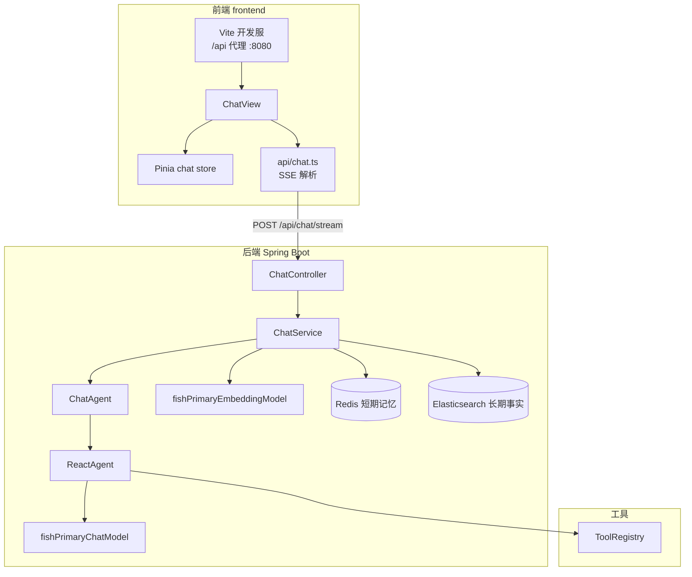
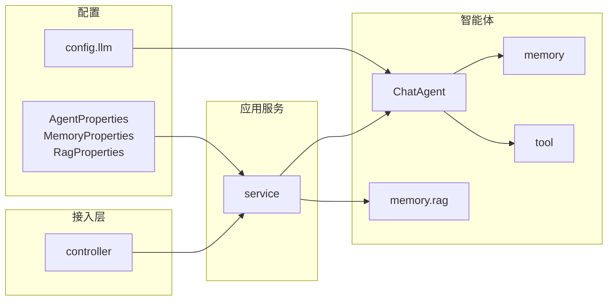
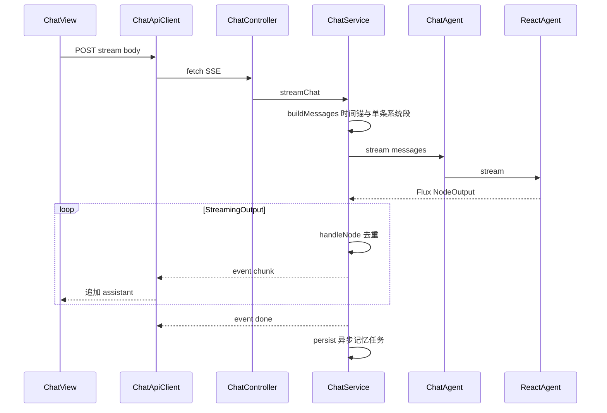
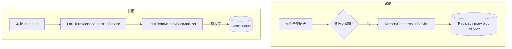
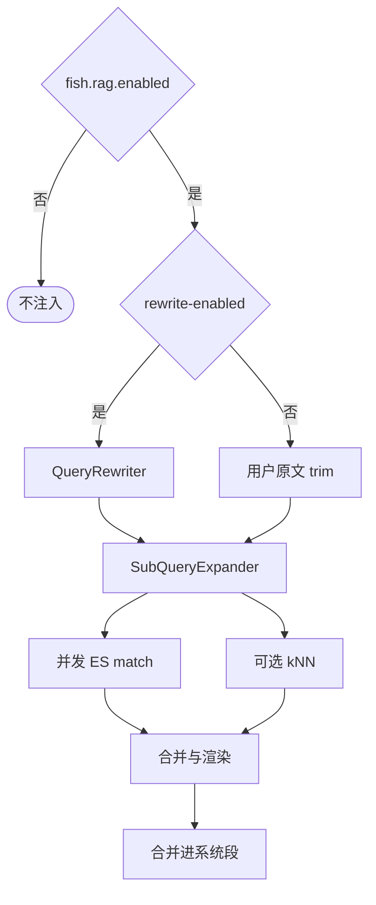
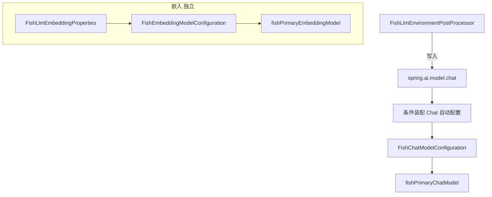

# Fish-Agent 版本总结（v1.x / 2026-05-02）

> 本文档为 **v1.x 能力线的汇总与全景说明**，便于新人或评审快速理解**前后端架构、技术栈、亮点与主流程**。  
> **增量变更细节**仍以分文档为准，请按需查阅：
>
> - [v1-20260427.md](v1.0-20260427.md) — 初版全栈、工具与前端结构  
> - [v1.1-记忆更新-20260427.md](./v1.1-记忆更新-20260427.md) — Redis 短期记忆、ES 长期记忆、主动录入  
> - [v1.2-Ollama与对话路由更新-20260502.md](./v1.2-Ollama与对话路由更新-20260502.md) — DashScope/Ollama 对话切换、`fish.llm` 与 Spring AI 路由  
> - [v1.3-长期记忆RAG与编排更新-20260502.md](./v1.3-长期记忆RAG与编排更新-20260502.md) — RAG、Embedding 独立、系统段与时间锚、流式去重、事实入库过滤  

**一句话**：Fish-Agent 是基于 Spring Boot + Spring AI Alibaba **ReAct** 的全栈智能体，具备 **工具 SPI**、**文件历史 + Redis 摘要 + ES 向量长期记忆**、**可选重写 + 多查询扩展的 RAG**、**对话与嵌入模型可分别路由**，前端以 **Vue3 + SSE** 流式呈现对话。

---

## 1. 全栈总体架构



要点：

- 前端默认 `pnpm dev`（Vite），`/api/**` 反向代理到后端；SSE 事件 `session` / `chunk` / `tool` / `done` / `error` 与 [frontend/README.md](../../frontend/README.md) 一致。  
- 后端 `ChatService` 负责组装上下文（时间锚、人设、短期摘要、RAG）、订阅 `Flux<NodeOutput>`、去重后推 SSE、落盘历史并异步触发压缩与长期录入。  
- **Embedding** 由 `fish.llm.embedding.provider` 选择实现，供长期写入与 RAG 向量腿共用，与 **Chat** 的 `fish.llm.chat-provider` 可独立配置。

---

## 2. 后端分层与目录（完整）

### 2.1 分层示意



### 2.2 包职责一览

| 包 / 模块 | 职责 |
|---|---|
| `controller` | REST + SSE 入口（聊天、会话管理、手动记忆压缩） |
| `service` | 编排：`ChatService`、短期压缩、长期主动录入 |
| `agent` | `BaseAgent` / `ChatAgent`、`ReactAgent` 构建、状态机 |
| `agent.tool` | `AgentToolProvider` SPI、`ToolRegistry` 聚合内置与外部工具 |
| `agent.memory.history` | 原始会话 JSON（文件系统实现） |
| `agent.memory.shortterm` | Redis 摘要 + 最近消息窗口 |
| `agent.memory.longterm` | ES 文档、写入、事实 Prompt/解析与 **Sanitizer** |
| `agent.memory.compress` | 仅摘要写 Redis；长期事实由主动录入链路负责 |
| `agent.memory.rag` | `query` / `expand` / `recall`：重写、扩展、ES 召回与注入渲染 |
| `config.llm` | `fish.llm`：Chat 路由、Embedding 路由、EPP、一致性日志 |

### 2.3 源码树（`src/main/java/com/yuyu/fishagent`，与仓库一致）

下列为当前后端 **全部 `.java` 文件**（按包排序，附一行职责说明）。

```text
src/main/java/com/yuyu/fishagent/
├── FishAgentApplication.java                    Spring Boot 入口
├── agent/
│   ├── AgentStatus.java                         智能体状态枚举
│   ├── BaseAgent.java                           抽象基类：ReactAgent 构建、递归与 Hook
│   ├── ChatAgent.java                           助手 Agent：工具集 + 流式 stream
│   ├── memory/
│   │   ├── compress/
│   │   │   ├── MemoryPromptBuilder.java         短期摘要 Prompt
│   │   │   └── MemoryResponseParser.java        短期摘要 JSON 解析
│   │   ├── history/
│   │   │   ├── ChatMemoryStore.java             原始历史 SPI
│   │   │   └── FileSystemChatMemoryStore.java   文件系统会话 JSON 实现
│   │   ├── longterm/
│   │   │   ├── ElasticsearchLongTermMemoryStore.java  ES 向量写入实现
│   │   │   ├── LongTermMemoryDocument.java      ES 文档模型
│   │   │   ├── LongTermMemoryFactSanitizer.java 写入前过滤产品说明类误抽取
│   │   │   ├── LongTermMemoryPromptBuilder.java 长期事实抽取 Prompt
│   │   │   ├── LongTermMemoryResponseParser.java 长期事实 JSON 解析
│   │   │   └── LongTermMemoryStore.java         长期记忆 SPI
│   │   ├── rag/
│   │   │   ├── expand/
│   │   │   │   ├── RagQueryExpand.java          多查询扩展逻辑
│   │   │   │   └── RagQueryExpandConfiguration.java 扩展器 Bean
│   │   │   ├── query/
│   │   │   │   ├── RagQueryRewrite.java         查询重写逻辑与 CHAT_MODEL 实现
│   │   │   │   └── RagQueryRewriteConfiguration.java 重写器 Bean
│   │   │   └── recall/
│   │   │       ├── RagRecall.java               ES 召回、合并、渲染、DefaultAugmentation
│   │   │       └── RagRecallConfiguration.java  ragRecallExecutor、DocumentSearcher 等
│   │   └── shortterm/
│   │       ├── RedisShortTermMemoryStore.java   Redis 短期记忆实现
│   │       ├── ShortTermMemorySnapshot.java     摘要 + 最近窗口快照
│   │       └── ShortTermMemoryStore.java        短期记忆 SPI
│   └── tool/
│       ├── AgentToolProvider.java               工具 SPI
│       ├── ToolRegistry.java                    自动收集并暴露 ToolCallback
│       ├── builtin/
│       │   ├── CalculatorToolProvider.java      calculator
│       │   ├── DateTimeToolProvider.java        get_current_datetime
│       │   ├── FileReadToolProvider.java        file_read
│       │   ├── FileWriteToolProvider.java       file_write
│       │   └── WebFetchToolProvider.java        web_fetch
│       └── external/
│           ├── AmapGeoToolProvider.java         amap_geocode
│           ├── AmapWeatherToolProvider.java     amap_weather
│           ├── BochaSearchToolProvider.java     web_search_bocha
│           ├── MailToolProvider.java          send_mail
│           └── TavilySearchToolProvider.java    web_search_tavily
├── config/
│   ├── AgentProperties.java                     fish.agent.*
│   ├── MemoryProperties.java                    fish.memory.*
│   ├── RagProperties.java                       fish.rag.*
│   ├── ToolProperties.java                      fish.tools.*
│   ├── WebMvcConfig.java                        CORS 等 Web 配置
│   └── llm/
│       ├── FishChatModelConfiguration.java      @Primary ChatModel
│       ├── FishEmbeddingModelConfiguration.java @Primary EmbeddingModel
│       ├── FishLlmChatProvider.java             DASHSCOPE / OLLAMA 枚举
│       ├── FishLlmConfigurationConsistencyLogger.java 启动后 fish 与 spring.ai.model.chat 一致性日志
│       ├── FishLlmEmbeddingProperties.java    fish.llm.embedding.*
│       ├── FishLlmEnvironmentPostProcessor.java 早期写入 spring.ai.model.chat
│       └── FishLlmProperties.java               fish.llm.chat-provider 等
├── controller/
│   ├── ChatController.java                      SSE 流式对话与会话 REST
│   └── MemoryController.java                    手动触发短期压缩
├── dto/
│   ├── ChatMessageDTO.java                      单条历史消息
│   ├── ChatRequest.java                         聊天请求体
│   ├── MemoryCompressionRequest.java            压缩请求
│   ├── MemoryCompressionResult.java             压缩结果
│   └── SessionInfo.java                         会话摘要列表项
├── exception/
│   └── GlobalExceptionHandler.java              全局异常到 HTTP 状态
└── service/
    ├── ChatService.java                         编排：上下文、SSE、持久化、记忆与 RAG 触发
    ├── LongTermMemoryIngestionService.java      长期事实主动录入
    └── MemoryCompressionService.java           短期摘要压缩写 Redis
```

**资源与启动扩展**（非 `fishagent` 包内 Java，但属后端工程）：

```text
src/main/resources/
├── application.yml                              集中配置
└── META-INF/
    └── spring.factories                         注册 FishLlmEnvironmentPostProcessor
```

以上 `com.yuyu.fishagent` 包内共 **58** 个 `.java` 源文件，与当前仓库一致（统计口径：`src/main/java/com/yuyu/fishagent/**/*.java`）。

---


## 3. 前端架构

| 区域 | 说明 |
|---|---|
| `views/ChatView.vue` | 主布局：侧栏 + 消息区 + 输入区 |
| `components/SessionSidebar.vue` | 会话列表、新建/切换/删除 |
| `components/MessageList.vue` | 消息流、粘底滚动 |
| `components/MessageBubble.vue` | 用户/助手/工具气泡、Markdown、代码高亮、流式光标 |
| `components/ChatInput.vue` | 发送与取消生成 |
| `api/chat.ts` | `fetch` + `ReadableStream` 解析 SSE，支持 `AbortSignal` |
| `store/chat.ts` | Pinia：`sessions`、`activeSid`、`messagesBySid`、`streaming`、`errorMsg` |
| `types/chat.ts` | 与后端 DTO 对齐 |

构建链：**Vue 3 + Vite + TypeScript + Element Plus + Pinia**；`marked` + `highlight.js` 用于助手 Markdown 渲染（详见 [v1-20260427.md](v1.0-20260427.md) 与前端 README）。

---

## 4. 技术栈汇总（当前态）

| 层 | 选型 | 版本 / 说明 |
|---|---|---|
| JDK | Java | 21；`spring.threads.virtual.enabled` |
| 后端框架 | Spring Boot | 3.5.13（与 Spring AI Alibaba 1.1.2.x 对齐，不升 4.x） |
| Agent 编排 | spring-ai-alibaba-agent-framework | 1.1.2.0，`ReactAgent` + `ModelCallLimitHook` |
| 对话模型 | DashScope / Ollama | `fish.llm.chat-provider` + `spring.ai.model.chat`；`fishPrimaryChatModel` `@Primary` |
| 嵌入模型 | DashScope / Ollama | **`fish.llm.embedding.provider`**；`fishPrimaryEmbeddingModel` `@Primary` |
| Spring AI BOM | spring-ai-bom | 1.1.4（与 Alibaba 对齐） |
| 短期记忆 | Redis + Jackson | 摘要 + 滑动窗口 |
| 长期记忆 | Elasticsearch `dense_vector` | 事实原文 + 向量；主动录入 + **事实过滤** |
| 原始历史 | 文件系统 JSON | `data/history/{sid}.json` |
| 关系型 | MySQL 驱动 | 运行时依赖，按需使用 |
| 前端 | Vue + Vite + Element Plus + Pinia | 与仓库 `frontend/package.json` 一致；`/api` 代理后端 |
| 其它 | Jsoup、spring-mail 等 | 网页抓取、邮件工具等（见 v1 工具表） |

---

## 5. 项目亮点

1. **ReAct + 工具 SPI**：`AgentToolProvider` 注册即生效，失败隔离；内置与外部工具可按配置装配。  
2. **三重防死循环**：图 `recursionLimit`、`ModelCallLimitHook` 调用上限、`AgentStatus` 状态机。  
3. **记忆分层**：文件全量历史为事实源；Redis 控上下文长度；ES 存可检索的长期事实；短期压缩不写 ES，避免重复灌入。  
4. **长期事实质量**：模型 JSON 抽取 + **`LongTermMemoryFactSanitizer`**，减少把「Fish-Agent 产品能力说明」写入用户索引。  
5. **RAG 可运维**：总开关、`rewrite-enabled` 手控重写、**扩展始终执行**（总开关开启时）、ES **全索引**文本 + 可选 kNN；与用户气泡持久化解耦。  
6. **LLM 路由清晰**：Chat 与 Embedding **分配置**，解决双 starter 下多 `EmbeddingModel` Bean 歧义。  
7. **对话体验**：合并 **单条** `SystemMessage`（人设/摘要/RAG）、**会话时间锚**、人设约束「搜索日期≠此刻」与「勿对用户说记忆元话术」；**流式 chunk 段聚合与重复尾段去重**。  
8. **全栈 SSE**：前后端事件契约明确，支持取消与工具过程展示。

---

## 6. 关键流程图

### 6.1 端到端流式对话（SSE）



### 6.2 记忆：短期压缩与长期录入



### 6.3 RAG 单轮（高层）



### 6.4 LLM 路由（启动期）



---

## 7. 仓库结构速览

**后端**：完整 Java 包与类清单见 **第 2.3 节**；`META-INF/spring.factories` 见第 2.3 节文末。

**前端**

```text
frontend/src/
├── api/chat.ts
├── store/chat.ts
├── views/ChatView.vue
├── components/     SessionSidebar, MessageList, MessageBubble, ChatInput
└── types/chat.ts
```

**运行期产物（默认不入库）**：`data/history/`、`data/sandbox/`；配置集中在 `src/main/resources/application.yml`。

---

## 8. 后续可改进方向

- **流式去重**：当前为启发式（段聚合、全文相同、末尾长段相同）；若出现新型重复 chunk，可结合框架版本升级或增加可配置阈值。  
- **RAG 策略**：全索引便于召回；若需多租户或隐私隔离，可恢复**可选**的 `sessionId` / 用户维度过滤并配置化。  
- **记忆模型拆分**：压缩与长期事实判断可与主对话使用不同 `ChatModel`（小模型降本），需额外 Bean 与路由设计。  
- **工具调用策略**：人设层可强化「新闻类问题优先搜索」，减少多轮澄清才触发工具的情况。  
- **前端**：断线重连、错误重试、`done` 与增量拼接一致性监控；长会话性能与虚拟列表。  
- **运维与数据**：ES 历史脏文档清理脚本；日志与 Metrics（调用链、工具耗时、RAG 命中率）。  
- **文档**：v1.2 中关于 Embedding 的个别表述已被 v1.3 替代，汇总文以本文与 v1.3 为准。

---

## 9. 参考索引

| 文档 | 内容侧重 |
|---|---|
| [v1-20260427.md](v1.0-20260427.md) | 初版架构、工具清单、HTTP/SSE、前端目录 |
| [v1.1-记忆更新-20260427.md](./v1.1-记忆更新-20260427.md) | Redis、ES、记忆分包与行为 |
| [v1.2-Ollama与对话路由更新-20260502.md](./v1.2-Ollama与对话路由更新-20260502.md) | Ollama、EPP、`fishPrimaryChatModel` |
| [v1.3-长期记忆RAG与编排更新-20260502.md](./v1.3-长期记忆RAG与编排更新-20260502.md) | RAG、Embedding、`fish.rag`、编排与过滤 |

---

_文档版本：v1.x 总结 · 日期：2026-05-02 · 覆盖能力线：v1 → v1.3；后续增量请另建 v1.4-主题-日期.md 并在本节补充链接。_
