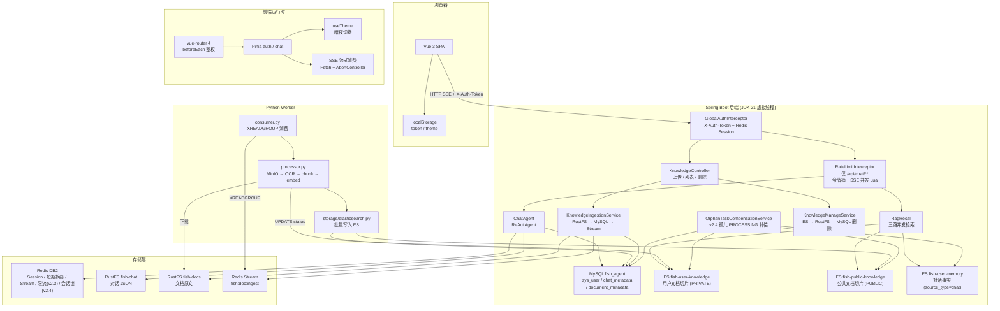
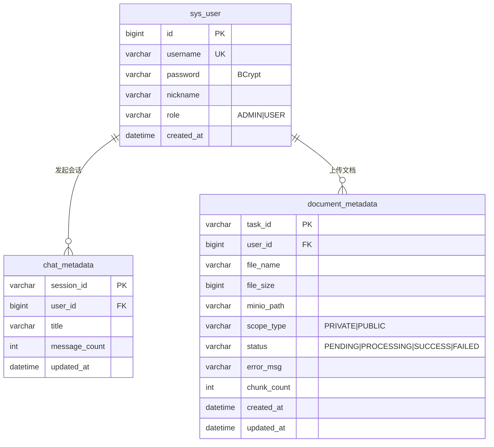
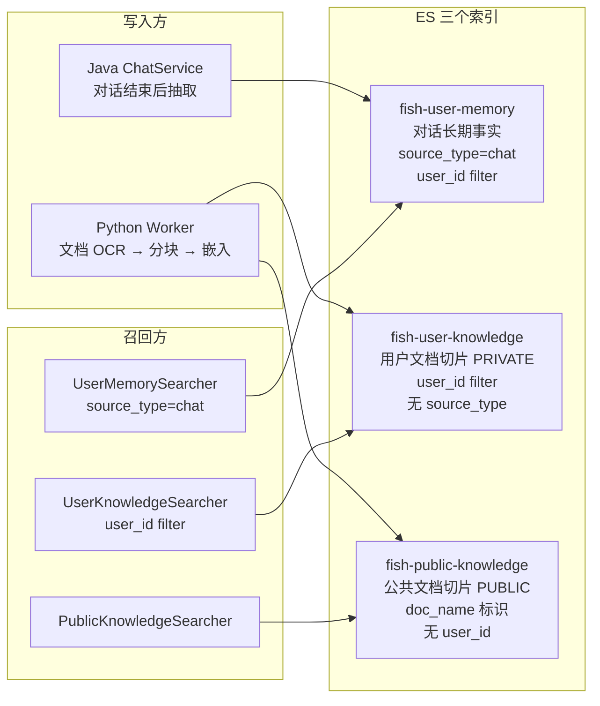
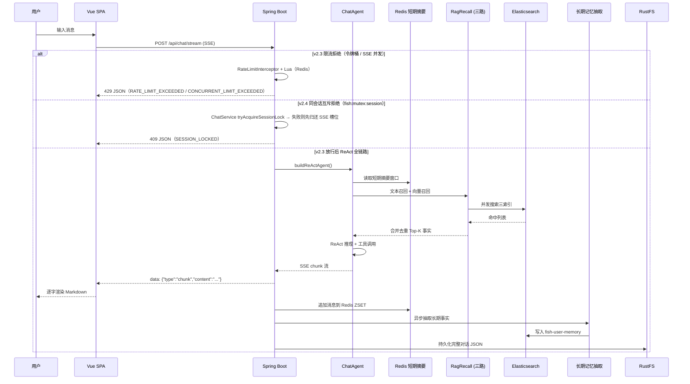
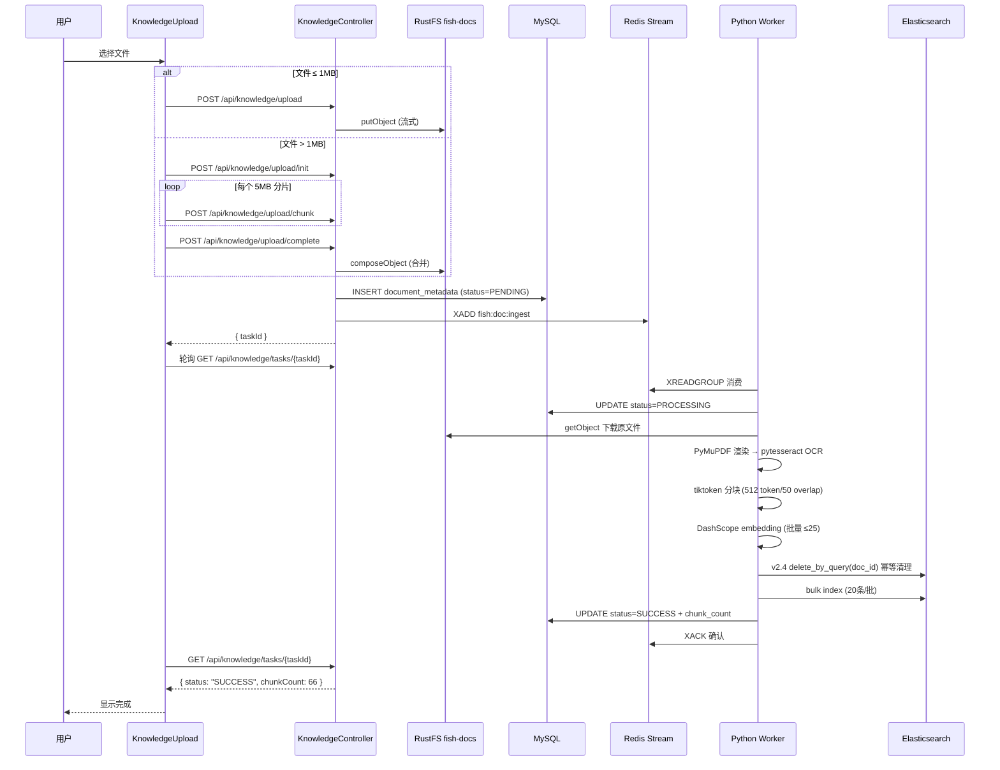
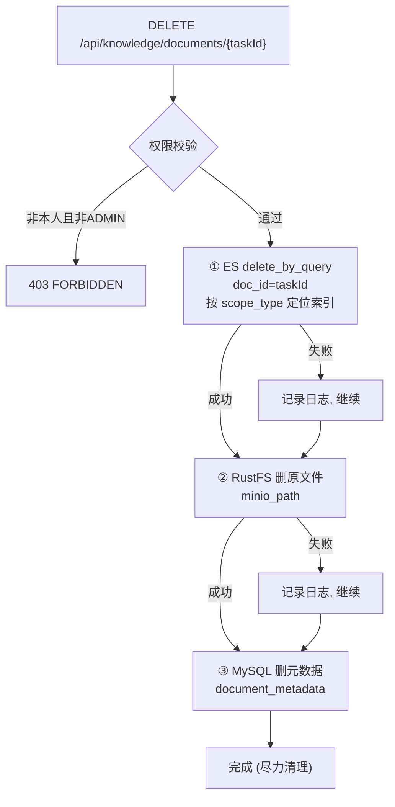

# Fish-Agent v2 全景文档

> 项目路径：`D:\1_Backend\Fish-Agent`
> 覆盖版本：**v2.0 + v2.1 + v2.2 + v2.3 + v2.4 + v2.5 + v2.6**（v1 → v1.3 → v2.0 → v2.1 → v2.2 → v2.3 → v2.4 → v2.5 → v2.6 能力线）
> 后端 Java 源文件约 **103** 个，`frontend/src` 下 TS/Vue 约 **21** 个，Python Worker 约 **19** 个文件。

**分文档索引**

- [v1-全景文档](../v1/v1-全景文档-20260504.md) — v1.x 能力基线
- [v2.0-全新版本](v2.0-全新版本-20260504.md) — v2.0 增量记录
- [v2.1-知识库闭环与管理页](v2.1-知识库闭环与管理页-20260505.md) — v2.1 增量记录
- [v2.2-DeepSeek对话接入](v2.2-DeepSeek对话接入-20260506.md) — v2.2 增量记录
- [v2.3-Redis对话限流](v2.3-Redis对话限流-20260506.md) — v2.3 增量记录
- [v2.4-记忆链路与可靠性增强](v2.4-记忆链路与可靠性增强-20260506.md) — v2.4 增量记录（独立记忆模型、会话互斥 409、孤儿任务补偿、Python ES 幂等）
- [v2.5-前端交互与视觉优化](v2.5-前端交互与视觉优化-20260506.md) — v2.5 增量记录（新会话首发可见、disabled 按钮暗色修复、滚动条主题化、聊天页微交互优化；**2026-05-08** 追加前端全面美化：design token、登录毛玻璃、气泡与代码块语言栏、胶囊输入、侧栏与知识库 banner 等，零新增依赖）
- [v2.6-可靠性与体验改进](v2.6-可靠性与体验改进-20260508.md) — v2.6 增量记录（SSE persist 异常安全、会话重命名 PATCH 端点、409 冲突友好提示、主题跨 Tab 同步、工具调用卡片增强、会话删除二次确认、全局错误边界、长对话渐进式渲染）
- [Redis常量名速查](../速查文档/Redis常量名速查.md)
- [数据库速查](../速查文档/数据库速查.md)
- [向量库速查](../速查文档/向量库速查.md)
- [ES 索引 DDL](../../database/es/es.txt)
- [MySQL 建表语句](../../database/sql/fish_agent.sql)
- [Python Worker 说明](../../python/README.md)

---

## 一、项目定位

Fish-Agent 是基于 **Spring Boot 3.5 + Spring AI Alibaba ReAct** 的全栈智能体应用。

**核心能力链**：登录鉴权 → **`/api/chat/**` Redis 令牌桶 + SSE 并发限流** → **同 `sessionId` Redis 互斥（v2.4，防双击竞态）** → 多轮对话（SSE 流式）→ **可选独立 ChatModel 的**短期记忆压缩 / 长期事实抽取（v2.4）→ 三路 ES RAG 检索注入 → 工具调用。

**对话模型路由**：支持 **DashScope**（阿里云通义）/ **Ollama**（本地）/ **DeepSeek**（OpenAI-compatible）三路可选，嵌入独立配置，切换只需修改一个环境变量，上层业务零感知。

**知识库闭环**：前端上传（直传/分片）→ Java 写入 RustFS + MySQL + Redis Stream → Python Worker 异步消费 → OCR 解析 PDF → token 分块 → embedding 向量化 → ES 批量写入 → 前端管理页列表/删除。

**前端**：Vue 3 + TypeScript + Element Plus，SSE 流式呈现，暗夜模式持久化；**v2.5** 新增新会话 pending 首发可见、disabled 按钮暗色一致性、全局滚动条主题化与聊天页微交互优化；**同日后续迭代（文档记录于 v2.5 分册）** 完成前端全面美化：扩展 CSS 变量与设计 token、登录页渐变毛玻璃、消息区居中与欢迎动效、用户气泡渐变与 Markdown 代码块语言栏、胶囊输入框、侧栏品牌线与列表态、知识库页顶部 banner 与处理中脉冲动画，**不引入新 npm 包、不改 store/api/router 逻辑**，明暗主题同步；**v2.6** 新增会话重命名（PATCH 端点 + 侧栏内联编辑）、409 并发冲突中文友好提示、主题跨 Tab 同步（storage 事件监听）、工具调用卡片增强（友好中文名 + 可折叠 payload）、会话删除二次确认（ElMessageBox）、全局错误边界（onErrorCaptured + errorHandler 双层兜底）、长对话渐进式渲染（最近 30 条 + loadMore）、SSE persist 异常安全（独立 try-catch 防挂死）。

---

## 二、全链路架构



---

## 三、技术栈

### 3.1 后端 (Java)

| 分层 | 技术 | 说明 |
|------|------|------|
| 运行时 | JDK 21 | 虚拟线程 `spring.threads.virtual.enabled=true` |
| 框架 | Spring Boot 3.5.13 | 自动配置 + `@ConfigurationProperties` |
| AI 引擎 | Spring AI Alibaba 1.1.2 | ReAct Agent + `ModelCallLimitHook` |
| AI BOM | Spring AI BOM 1.1.4 | Chat / Embedding SPI |
| 模型路由 | DashScope / Ollama / DeepSeek（Chat） | `fish.llm.chat-provider` / `embedding.provider` 可独立配置；嵌入不支持 DEEPSEEK |
| 持久层 | MyBatis-Plus 3.5 | `sys_user`、`chat_metadata`、`document_metadata` |
| 缓存 | Redis (Lettuce) | DB2：Session + 短期摘要 + Stream + **`fish:ratelimit:*`（v2.3）** + **`fish:mutex:session:*`（v2.4 会话互斥）** |
| 检索引擎 | Elasticsearch 8.x | 三索引：用户记忆 / 私有知识 / 公共知识 |
| 对象存储 | MinIO (RustFS) | 对话 JSON (`fish-chat`) + 文档原文 (`fish-docs`) |
| 安全 | spring-security-crypto | BCrypt 密码哈希（无完整 FilterChain） |
| 工具库 | Lombok, Jsoup, JUnit 5 | — |

### 3.2 Python Worker

| 分层 | 技术 | 说明 |
|------|------|------|
| 运行时 | Python 3.11+ | Docker 多阶段构建 |
| 消息消费 | redis-py 5.x | `XREADGROUP` + `XAUTOCLAIM` + `XACK` |
| 对象存储 | minio-py 7.x | 下载 `fish-docs` 桶原始文件 |
| PDF 解析 | PyMuPDF (fitz) 1.24+ | 渲染为 300 DPI PNG 图片 |
| OCR 识别 | pytesseract 0.3+ | Tesseract 引擎, `chi_sim+eng` 中英双语 |
| token 分块 | tiktoken 0.7+ | `cl100k_base` 编码器, 512 token / 50 overlap |
| embedding | httpx → DashScope API | 批量 25 条/次, `text-embedding-v2` 1536 维 |
| ES 写入 | elasticsearch-py 8.x | 20 条/批 bulk index, 失败不回滚 |
| 配置 | pydantic-settings 2.x | 所有环境变量与 Java `application.yml` 命名对齐 |
| 数据库 | PyMySQL 1.x | `document_metadata` 状态更新, `threading.local()` 连接复用 |

### 3.3 前端

| 分层 | 技术 | 说明 |
|------|------|------|
| 框架 | Vue 3.5 + TypeScript 5.6 | Composition API + `<script setup>` |
| 构建 | Vite 6 | HMR 热更新, 自动导入 Element Plus |
| 路由 | vue-router 4 | `/login` `/chat` `/knowledge`, `beforeEach` token 校验 |
| UI 库 | Element Plus 2.x + Icons | `el-table`, `el-upload`, `el-tag`, 暗色变量 `.dark` |
| 状态管理 | Pinia | auth (token+nickname), chat (sessions+messages+streaming) |
| SSE 消费 | Fetch API + ReadableStream | `AbortController` 取消生成, 逐 chunk 增量渲染 |
| Markdown | marked + highlight.js | 代码高亮 (github-dark 主题), 内联代码着色 |
| 暗夜模式 | `useTheme` composable | `data-theme` + `html.dark` 双机制, `localStorage` 持久化 |
| CSS 体系 | CSS 变量约 30 项 | `:root` 亮色 + `[data-theme='dark']` 暗色全覆盖；含圆角/阴影/过渡/渐变 design token |

---

## 四、后端源码目录

```
src/main/java/com/yuyu/fishagent/
├── FishAgentApplication.java                   @SpringBootApplication + @MapperScan
├── enums/UserRole.java                          ADMIN / USER
│
├── entity/                                      MyBatis-Plus 实体
│   ├── SysUser.java                             id, username, password(BCrypt), nickname, role
│   ├── ChatMetadata.java                        session_id, user_id, title, message_count
│   └── DocumentMetadata.java                    task_id, user_id, scope_type, status, chunk_count
│
├── mapper/                                      MyBatis-Plus BaseMapper
│   ├── SysUserMapper.java
│   ├── ChatMetadataMapper.java
│   └── DocumentMetadataMapper.java
│
├── auth/                                        认证鉴权体系
│   ├── context/
│   │   ├── UserContext.java                     用户上下文记录 (userId, nickname, role)
│   │   └── UserContextHolder.java               ThreadLocal<UserContext> 存取
│   ├── session/RedisSessionManager.java          Redis Hash 存 token→userId, TTL 续期
│   └── interceptor/
│       ├── GlobalAuthInterceptor.java           拦截 /api/**, 校验 X-Auth-Token
│       ├── RateLimitInterceptor.java             v2.3：仅 /api/chat/**，令牌桶 + SSE 并发
│       └── PermissionInterceptor.java           预留 ADMIN 路由权限细分
│
├── ratelimit/                                   v2.3：Redis Lua 限流；v2.4：会话互斥锁
│   ├── RateLimitResult.java                     密封接口：放行 / 两类拒绝
│   └── RateLimitService.java                    evaluate + decrementSseConcurrent + tryAcquireSessionLock
│
├── agent/                                       智能体核心
│   ├── ChatAgent.java                           ReAct Agent 主循环, 工具编排
│   ├── BaseAgent.java                           抽象基类
│   ├── AgentStatus.java                         原子状态枚举 (IDLE/RUNNING/STOPPED)
│   └── AgentConfig.java                         recursionLimit + modelCallLimit
│   │
│   ├── memory/                                  分层记忆体系
│   │   ├── history/                             对话持久化 (SPI)
│   │   │   ├── ChatMemoryStore.java             SPI 接口
│   │   │   ├── RustFsChatMemoryStore.java       RustFS fish-chat 桶 (默认)
│   │   │   └── UserScopedFileChatMemoryStore.java 本地文件回退
│   │   ├── shortterm/                           短期摘要 (Redis ZSET 滑动窗口)
│   │   │   └── RedisShortTermMemoryStore.java
│   │   ├── longterm/                            长期事实 (ES + LLM 抽取)
│   │   │   ├── ElasticsearchLongTermMemoryStore.java
│   │   │   ├── LongTermMemoryStore.java         SPI
│   │   │   ├── UserMemoryDocument.java          ES 文档 POJO
│   │   │   ├── PublicKnowledgeDocument.java     ES 文档 POJO
│   │   │   ├── LongTermMemoryPromptBuilder.java 事实抽取 Prompt 模板
│   │   │   ├── LongTermMemoryResponseParser.java JSON 解析
│   │   │   └── FactSanitizer.java               事实清洗去噪
│   │   ├── compress/                            记忆压缩 (LLM 摘要)
│   │   │   ├── MemoryPromptBuilder.java
│   │   │   └── MemoryResponseParser.java
│   │   └── rag/                                 RAG 检索
│   │       ├── query/RagQueryRewrite.java       可选查询重写
│   │       ├── expand/RagQueryExpand.java       多子查询扩展
│   │       └── recall/
│   │           ├── RagRecall.java               编排 + 合并去重 + 渲染注入块
│   │           ├── RagRecallConfiguration.java  三路 Searcher Bean 装配
│   │           ├── UserMemoryElasticsearchSearcher.java      fish-user-memory (source_type=chat)
│   │           ├── UserKnowledgeElasticsearchSearcher.java   fish-user-knowledge (user_id filter)
│   │           └── PublicKnowledgeElasticsearchSearcher.java fish-public-knowledge
│   │
│   └── tool/                                    工具 SPI 体系
│       ├── AgentToolProvider.java               SPI 接口
│       ├── ToolRegistry.java                    自动发现 + 单工具失败隔离
│       ├── builtin/                             DateTime, Calculator, WebFetch, FileRead, FileWrite
│       └── external/                            Tavily, Bocha, AmapWeather, AmapGeo, Mail
│
├── config/                                      配置层
│   ├── AgentProperties.java / MemoryProperties.java（含 v2.4 fish.memory.chat） / RagProperties.java
│   ├── ToolProperties.java / AuthProperties.java / RateLimitProperties.java  v2.3 fish.rate-limit
│   ├── KnowledgeProperties.java                 索引名 + Stream key + v2.4 compensation
│   ├── SchedulingConfiguration.java             v2.4 @EnableScheduling
│   ├── RustFsProperties.java
│   ├── WebMvcConfig.java                        CORS + 拦截器注册
│   └── llm/
│       ├── FishLlmEnvironmentPostProcessor.java 早期写入 spring.ai.model.chat
│       └── FishChatModelConfiguration.java      v2.4 @Bean memoryChatModel
│
├── controller/
│   ├── AuthController.java                      /api/auth/login|register|logout|me
│   ├── ChatController.java                      /api/chat/stream|sessions|sessions/{sid} + PATCH rename
│   ├── MemoryController.java                    /api/memory/compress (调试)
│   └── KnowledgeController.java                 /api/knowledge/** + /api/admin/knowledge/**
│
├── service/
│   ├── ChatService.java                         对话编排主入口 (SSE → Agent → 记忆)
│   ├── AuthService.java                         登录注册, BCrypt, Redis Session
│   ├── ChatMetadataService.java                 会话元数据 CRUD
│   ├── MemoryCompressionService.java            短期→长期压缩
│   ├── LongTermMemoryIngestionService.java      对话结束后事实抽取入库
│   ├── storage/RustFsService.java               MinIO 封装
│   └── knowledge/
│       ├── KnowledgeIngestionService.java       上传 → RustFS → MySQL → Redis Stream
│       ├── KnowledgeManageService.java          列表查询 / 删除 (ES→RustFS→MySQL)
│       ├── OrphanTaskCompensationService.java   v2.4 定时清理孤儿 PROCESSING + ES + MySQL
│       └── MultipartInitResult.java             分片上传中间结果 record
│
├── dto/                                         请求/响应 DTO (record)
│   ├── LoginRequest / RegisterRequest / LoginResponse
│   ├── ChatRequest / ChatStreamChunk
│   ├── KnowledgeUploadResponse
│   ├── DocumentMetadataResponse / DocumentMetadataPageResponse
│   ├── DocumentTaskStatusResponse
│   └── MultipartInitRequest / MultipartInitResponse / MultipartPartInfo / ...
│
├── exception/
│   ├── GlobalExceptionHandler.java              统一异常 → JSON（含 v2.4 409 SESSION_LOCKED）
│   └── SessionLockedException.java              v2.4 同会话并发占用
```

**工程根目录**：`lombok.config`（v2.4：Lombok 构造器传递 `@Qualifier`）。

---

## 五、Python Worker 源码目录

```
python/
├── Dockerfile                           多阶段构建, Tesseract OCR 中文语言包
├── requirements.txt                     redis, minio, PyMySQL, elasticsearch, PyMuPDF, pytesseract, tiktoken, httpx, pydantic-settings
├── .env.example                         环境变量模板（与 Java application.yml 对齐）
├── README.md                            本地 venv + Docker 启动说明
│
└── fish_worker/
    ├── __init__.py                      包声明 + __version__
    ├── __main__.py                      python -m fish_worker 入口
    ├── main.py                          CLI 主入口: 组装依赖 → 注册信号 → 启动消费循环
    ├── config.py                        pydantic-settings, 所有环境变量映射, DB_URL JDBC 兼容解析
    ├── exceptions.py                    WorkerError / UnsupportedFileTypeError
    ├── deps.py                          WorkerContext @dataclass DI 容器
    ├── consumer.py                      Redis Stream XREADGROUP + XAUTOCLAIM + XACK, ThreadPoolExecutor
    ├── processor.py                     单任务流水线: MinIO → 解析 → 分块 → 嵌入 → ES → MySQL
    ├── health.py                        HTTP /health 端点 (Redis/MySQL/ES/MinIO 四探针, 10s TTL 缓存)
    │
    ├── storage/
    │   ├── minio.py                     DocObjectStore: get_object(bytes, content_type)
    │   └── elasticsearch.py            ElasticsearchIndexer: v2.4 delete_by_doc_id + 20条/批 bulk
    │
    ├── db/
    │   └── mysql.py                     DocumentMetadataRepository: update_status, threading.local() 连接复用
    │
    ├── parser/
    │   ├── base.py                      @dataclass RawElement, BaseParser(ABC)
    │   ├── factory.py                   ParserFactory: MIME → Parser, octet-stream + .pdf 推断兜底
    │   └── pdf.py                       PdfParser: PyMuPDF 渲染 300 DPI → pytesseract OCR (chi_sim+eng)
    │
    └── chunker/
        ├── text_chunker.py              tiktoken cl100k_base, 512 token / 50 overlap, 按页分组不跨页
        └── embedder.py                  Embedder: DashScope (批量 ≤25) / Ollama (逐条), 维度校验
```

---

## 六、前端源码目录

```
frontend/
├── package.json                  Vue 3 / Vite 6 / vue-router 4 / Element Plus / Pinia
├── pnpm-lock.yaml
├── vite.config.ts                /api → :8080 代理, AutoImport + ElementPlusResolver
├── tsconfig.json                 strict, "@/*" 路径别名
├── index.html                    lang="zh-CN", #app
│
└── src/
    ├── main.ts                   ① 主题防闪烁初始化 → ② createApp + Pinia + router + ElementPlus + errorHandler (v2.6)
    ├── App.vue                   <RouterView> + onErrorCaptured 错误边界 (v2.6)
    ├── style.css                 :root 约 30 项 CSS 变量（含圆角/阴影/过渡/渐变 token）+ [data-theme='dark'] 全覆盖 + Element Plus 暗色适配
    │
    ├── composables/
    │   └── useTheme.ts           applyTheme() 三同步: data-theme + html.dark + localStorage
    │
    ├── router/index.ts           /login (public), /chat, /knowledge, beforeEach token 校验
    │
    ├── api/
    │   ├── auth.ts               登录/注册/登出/fetchMe (X-Auth-Token)
    │   ├── chat.ts               SSE 流式对话 + AbortSignal 取消 + 409 友好提示 + renameSession (v2.6)
    │   └── knowledge.ts          直传/分片上传/列表/删除/状态轮询, 11 个 API 函数
    │
    ├── store/
    │   ├── auth.ts               token + nickname localStorage 持久化
    │   └── chat.ts               sessions / activeSid / messagesBySid / streaming 流式编排 + rename + cleanup (v2.6)
    │
    ├── types/
    │   ├── auth.ts
    │   └── chat.ts
    │
    ├── utils/time.ts             相对时间格式化
    │
    ├── views/
    │   ├── LoginView.vue         登录/注册 Tab, el-card 无阴影细边框
    │   ├── ChatView.vue          三栏布局: SessionSidebar + MessageList + ChatInput
    │   └── KnowledgeView.vue     文档上传 + 分页列表 + 删除确认 + 管理员全部文档 Tab
    │
    └── components/
        ├── SessionSidebar.vue    header: 暗夜切换 + 品牌名 + 昵称 + 新会话 + 知识库 + 退出
        ├── MessageList.vue       消息流 + 粘底滚动 + 回到底部, 空状态 4 张欢迎建议卡片
        ├── MessageBubble.vue     用户/助手/工具气泡 + Markdown + 代码高亮 + 一键复制
        ├── ChatInput.vue         Enter 发送 / Shift+Enter 换行 / 停止生成
        └── KnowledgeUpload.vue   小文件直传 (≤1MB) / 大文件分片 (5MB/chunk) + 状态轮询
```

---

## 七、数据模型

### 7.1 MySQL 核心表



### 7.2 Elasticsearch 三索引职责



**索引映射对照**

| 索引 | 字段 | 写入方 | 召回 filter |
|------|------|--------|-------------|
| `fish-user-memory` | id, user_id, content, embedding, source_type, doc_id, page_number, chunk_index | Java | `user_id` + `source_type=chat` |
| `fish-user-knowledge` | id, user_id, content, embedding, doc_id, page_number, chunk_index | Python Worker | `user_id` |
| `fish-public-knowledge` | id, doc_name, content, embedding, doc_id, page_number, chunk_index | Python Worker | 无 |

---

## 八、关键流程

### 8.1 对话完整链路



### 8.2 知识库上传 + Python Worker 闭环



### 8.3 知识库删除流程



---

## 九、项目亮点（简历向）

### 架构设计

**1. ReAct 智能体 + 工具插件化 SPI 体系**
`AgentToolProvider` 接口 + `ToolRegistry` 自动发现，内置 5 个工具（DateTime, Calculator, WebFetch, FileRead, FileWrite），外部 5 个工具（Tavily, Bocha, 高德天气, 高德地理, Mail）按 `@ConditionalOnProperty` 懒装配。单工具异常不影响 Agent 主循环。三重防死循环：`recursionLimit`（图节点上限）+ `ModelCallLimitHook`（模型调用次数触达后优雅追加并结束）+ `AgentStatus` 原子状态机。

**2. 三索引 RAG 检索引擎**
`fish-user-memory`（对话事实）+ `fish-user-knowledge`（私有文档）+ `fish-public-knowledge`（公共文档）三索引完全分离。每个子查询 3 索引 × 2 路（文本 + 向量）= 6 路并发召回，虚拟线程线程池执行。`UserContextHolder` 快照在异步线程中回放，避免 ThreadLocal 丢失导致私有检索空集。结果按 score 去重合并后注入 SystemMessage。

**3. 知识库全链路闭环 (Java + Python + Stream 解耦)**
上传支持小文件直传（≤1MB 流式写入）与大文件分片（5MB/chunk, MinIO compose 合并）。Java 只负责写入 RustFS + MySQL + Redis Stream，Python Worker 通过 `XREADGROUP` 消费者组异步消费。两个进程仅共享基础设施（Redis/MySQL/RustFS/ES），互不感知。Python 用 `threading.Event` 做优雅关闭，`ThreadPoolExecutor` 并发处理，`XAUTOCLAIM` 120s idle 自动崩溃恢复。

**4. OCR 驱动的 PDF 解析管线**
经过 pypdf → pdfminer → PyMuPDF 三代库迭代，最终方案：PyMuPDF 渲染每页为 300 DPI PNG → Tesseract OCR (`chi_sim+eng` 中英双语) → tiktoken `cl100k_base` 512 token 分块 (50 overlap, 按页不跨页) → DashScope `text-embedding-v2` 1536 维 embedding → ES bulk 20 条/批写入。完全绕过字体编码层，用"看见→认出"替代"解码→乱码"。

### 工程实践

**5. 分层持久化 + 多租户数据隔离**
Redis 登录 Session（TTL 续期）→ RustFS/MinIO 对话 JSON 持久化 → MySQL 会话元数据 → Redis ZSET 短期摘要滑动窗口 → Elasticsearch 长期事实三索引。私有数据强制 `user_id` term filter，`GlobalAuthInterceptor` + `ThreadLocal<UserContext>` 全链路携带用户身份，虚拟线程上下文丢失时手动快照回放。

**6. CSS 变量驱动的暗夜模式**
约 30 项 CSS 变量控制全局色彩与设计 token 体系（圆角/阴影/过渡/渐变），`useTheme` composable 统一同步 `data-theme`（自定义变量）+ `html.dark`（Element Plus 16 个组件内部变量）双机制。`main.ts` 在 `createApp` 之前初始化主题避免首帧闪白，`localStorage` 持久化用户偏好。

**7. 防御性编程细节**
- `UserMemorySearcher` 加 `source_type=chat` 防御 filter（即使历史 `source_type=document` 误写入也不会召回）
- Python `consumer.py` 无论任务成功/失败/非法消息都 XACK（避免毒消息 PEL 死循环）
- Python `db/mysql.py` 用 `threading.local()` 每个线程独立复用 MySQL 连接，`ping(reconnect=True)` 自动重连
- 删除操作按 ES → RustFS → MySQL 顺序「尽力清理」，每步失败只记日志不抛异常，避免孤儿资源
- 前端 `KnowledgeUpload` 上传失败自动调 `abortMultipartUpload` 清理 MinIO 残留分片
- `ChatService` 的 `SseEmitter` 生命周期回调（含会话锁释放 + SSE 槽 DECR）**必须在 `chatAgent.stream().subscribe()` 之前注册**：若 Reactor 的 `onComplete` 异步触发 `emitter.complete()` 时回调尚未注册，`releaseSseSlotOnce` 永久不被执行，导致会话锁泄漏阻断该 session 的所有后续对话。`Disposable` 通过 `Disposable[]` 单元素数组引用桥接（subscribe 才产生，但回调需要引用它）

### 技术选型亮点

**8. 三路对话路由 + 对话 / 嵌入独立配置**
`FishLlmEnvironmentPostProcessor` 在 Spring Boot 早期阶段将 `fish.llm.chat-provider`（`DASHSCOPE` / `OLLAMA` / `DEEPSEEK`）映射为 `spring.ai.model.chat`，精确激活对应 starter 自动配置；`FishChatModelConfiguration` 按枚举选出唯一 `@Primary ChatModel`，**v2.4** 另注册 **`memoryChatModel`**（`fish.memory.chat.*`，DEEPSEEK 下 `OpenAiChatModel.builder(主模型).defaultOptions(...)`）。DeepSeek 兼容 OpenAI 接口，v2.2 通过 `spring-ai-starter-model-openai` + `spring.ai.openai.base-url` 零侵入接入。嵌入路由（`fish.llm.embedding.provider`）与对话完全独立，可自由组合（如 Chat 用 DeepSeek、Embedding 用 DashScope）。

**9. 配置双端对齐**
Python Worker 的 `config.py`（pydantic-settings）与 Java 的 `application.yml`（`@ConfigurationProperties`）使用相同的环境变量名体系（`REDIS_HOST`、`ELASTICSEARCH_URIS`、`DASHSCOPE_API_KEY`、`KNOWLEDGE_USER_INDEX` 等），一份 `.env` 两端共用，Docker Compose 一键注入。

**10. SSE 流式对话 + 前端精细控制**
后端 `SseEmitter` (5 分钟超时) 发送 `session/chunk/tool/done/error` 五种事件；前端 `ReadableStream` 逐 chunk 增量追加 + `marked` 实时渲染 Markdown + `highlight.js` 代码着色。`AbortController` 支持用户中途取消，后端感知 `IOException` 后终止 Agent 推理。流结束后自动聚焦输入框。

**11. Redis Lua 对话限流（v2.3）**
`RateLimitInterceptor` 仅匹配 **`/api/chat/**`**：按 **`userId`** 令牌桶（默认约 **60 req/min** 等价速率 + 突发桶）与 **`POST /api/chat/stream`** 的 **SSE 并发槽**（默认 **2**）；Lua 原子 **`INCR`/回滚** 防竞态；**`ChatService`** 在 **`SseEmitter`** 三路生命周期回调中与 **`disposable.dispose()`** 合并释放槽位，空消息与组装异常路径主动 **`DECR`**；超限 **`429`** + JSON **`code`** 区分频率与并发；配置 **`fish.rate-limit.*`**（`FISH_RATE_LIMIT_*` 环境变量）。

**12. 记忆链路隔离 + 会话互斥 + 孤儿补偿（v2.4）**
**`memoryChatModel`** 与 **`@Qualifier`** 注入记忆服务，主 ReAct 仍用 **`@Primary`**；**`fish:mutex:session:{sessionId}`** **`SET NX EX 120`** 防同会话并发流，**409** 与 SSE **DECR** 同一 **`releaseSseSlotOnce`** 防槽位泄漏；**`OrphanTaskCompensationService`** 定时清理超时 **`PROCESSING`** 的 ES 切片并 **`FAILED`** 落库；Python **`delete_by_doc_id`** 在 bulk 前执行，与 Java 补偿共同降低重投脏数据风险。

---

## 十、HTTP / SSE 接口速查

### 认证

| Method | Path | Auth | 说明 |
|--------|------|------|------|
| POST | `/api/auth/register` | 否 | 注册 |
| POST | `/api/auth/login` | 否 | 登录, 返回 token |
| POST | `/api/auth/logout` | 是 | 登出, Redis 删 session |
| GET | `/api/auth/me` | 是 | 当前用户 (id, nickname, role) |

### 对话

| Method | Path | Auth | 说明 |
|--------|------|------|------|
| POST | `/api/chat/stream` | 是 | SSE 流式对话, body: `{sessionId?, message}`；**v2.3**：超限可能 **`429`** + JSON（非 SSE）；**v2.4**：同会话并发可能 **`409`** + `SESSION_LOCKED`（非 SSE） |
| GET | `/api/chat/sessions` | 是 | 当前用户会话列表；**v2.3**：占用令牌桶 |
| GET | `/api/chat/sessions/{sid}` | 是 | 会话历史消息；**v2.3**：占用令牌桶 |
| DELETE | `/api/chat/sessions/{sid}` | 是 | 删除会话；**v2.3**：占用令牌桶 |
| PATCH | `/api/chat/sessions/{sid}` | 是 | **v2.6**：重命名会话标题，body: `{"title":"..."}` |
| POST | `/api/memory/compress` | 是 | 手动触发短期压缩 (调试) |

**SSE 事件类型**: `session` / `chunk` / `tool` / `done` / `error`

**v2.3 限流响应（429，`application/json`）**：`RATE_LIMIT_EXCEEDED`（可选 `retryAfter` 秒） / `CONCURRENT_LIMIT_EXCEEDED`（仅流式接口占 SSE 槽）。

**v2.4 会话占用（409，`application/json`）**：`SESSION_LOCKED`（同 `sessionId` 已有进行中的流式请求）。

### 知识库 (用户)

| Method | Path | Auth | 说明 |
|--------|------|------|------|
| POST | `/api/knowledge/upload` | 是 | 小文件直传 (≤1MB) |
| POST | `/api/knowledge/upload/init` | 是 | 分片上传初始化 |
| POST | `/api/knowledge/upload/chunk` | 是 | 上传单个分片 |
| POST | `/api/knowledge/upload/complete` | 是 | 完成分片合并并入队 |
| POST | `/api/knowledge/upload/abort` | 是 | 取消分片上传 |
| GET | `/api/knowledge/tasks/{taskId}` | 是 | 轮询解析状态 |
| GET | `/api/knowledge/documents` | 是 | 当前用户文档列表 (分页) |
| DELETE | `/api/knowledge/documents/{taskId}` | 是 | 删除文档 (本人或 ADMIN) |

### 知识库 (管理员)

| Method | Path | Auth | 说明 |
|--------|------|------|------|
| POST | `/api/admin/knowledge/upload` | ADMIN | 上传公共知识文档 |
| POST | `/api/admin/knowledge/upload/init` | ADMIN | 分片初始化 |
| GET | `/api/admin/knowledge/documents` | ADMIN | 全部文档列表 (分页) |

---

## 十一、关键环境变量

| 变量 | 必填 | 默认值 | 说明 |
|------|------|--------|------|
| `DASHSCOPE_API_KEY` | DashScope 模式 | — | 对话 + Embedding |
| `FISH_LLM_CHAT_PROVIDER` | 否 | `DASHSCOPE` | `DASHSCOPE` / `OLLAMA` / `DEEPSEEK`（DeepSeek Chat，嵌入勿用 DEEPSEEK） |
| `FISH_LLM_EMBEDDING_PROVIDER` | 否 | `DASHSCOPE` | `DASHSCOPE` / `OLLAMA` |
| `OLLAMA_BASE_URL` | Ollama 模式 | `http://localhost:11434` | Ollama 服务地址 |
| `OLLAMA_CHAT_MODEL` | Ollama 模式 | `qwen2.5:7b` | 对话模型名 |
| `DEEPSEEK_API_KEY` | DeepSeek 对话模式 | — | `FISH_LLM_CHAT_PROVIDER=DEEPSEEK` 时必填 |
| `DEEPSEEK_BASE_URL` | DeepSeek 对话模式 | `https://api.deepseek.com` | 兼容 OpenAI 接口根 URL |
| `DEEPSEEK_CHAT_MODEL` | DeepSeek 对话模式 | `deepseek-chat` | ReAct 建议 chat；reasoner 与工具协同差异大 |
| `MEMORY_CHAT_ENABLED` | 否 | `true` | v2.4：是否启用独立记忆模型配置 |
| `MEMORY_CHAT_MODEL` | 否 | `deepseek-chat` | v2.4：记忆链路模型名（DeepSeek 路径） |
| `MEMORY_CHAT_TEMPERATURE` | 否 | `0.1` | v2.4：记忆链路 temperature |
| `KNOWLEDGE_COMPENSATION_ENABLED` | 否 | `true` | v2.4：是否启用孤儿 PROCESSING 补偿调度 |
| `KNOWLEDGE_COMPENSATION_TIMEOUT_MINUTES` | 否 | `10` | v2.4：PROCESSING 超时判孤儿阈值（分钟） |
| `FISH_RATE_LIMIT_ENABLED` | 否 | `true` | v2.3：关闭则不限流 |
| `FISH_RATE_LIMIT_TOKEN_BUCKET_CAPACITY` | 否 | `60` | v2.3：令牌桶容量 |
| `FISH_RATE_LIMIT_TOKEN_BUCKET_REFILL_RATE` | 否 | `1.0` | v2.3：令牌/秒 |
| `FISH_RATE_LIMIT_TOKEN_BUCKET_KEY_TTL` | 否 | `120` | v2.3：token Hash TTL（秒） |
| `FISH_RATE_LIMIT_SSE_MAX_CONNECTIONS` | 否 | `2` | v2.3：每用户并发 SSE 上限 |
| `FISH_RATE_LIMIT_SSE_KEY_TTL` | 否 | `300` | v2.3：SSE 计数 key TTL（秒） |
| `DB_URL` | 是 | — | JDBC URL 或独立字段 |
| `DB_HOST/PORT/NAME/USERNAME/PASSWORD` | 是 | — | MySQL 连接 |
| `REDIS_HOST/PORT/PASSWORD` | 否 | `localhost:6379` | Redis 连接 |
| `ELASTICSEARCH_URIS` | 否 | `http://localhost:9200` | ES 连接 |
| `RUSTFS_ENDPOINT/ACCESS_KEY/SECRET_KEY` | RustFS 开启 | — | MinIO 兼容 |
| `RUSTFS_ENABLED` | 否 | `true` | false → 本地文件 |
| `AUTH_SESSION_TTL` | 否 | `86400` | Redis Session TTL (秒) |
| `MEMORY_LONG_TERM_ENABLED` | 否 | `true` | 长期记忆写入开关 |
| `MEMORY_USER_INDEX` | 否 | `fish-user-memory` | 用户记忆索引 |
| `KNOWLEDGE_USER_INDEX` | 否 | `fish-user-knowledge` | 用户知识索引 |
| `KNOWLEDGE_PUBLIC_INDEX` | 否 | `fish-public-knowledge` | 公共知识索引 |
| `FISH_DOC_INGEST_STREAM` | 否 | `fish:doc:ingest` | Stream 键 |
| `FISH_WORKER_CONSUMER_GROUP` | 否 | `fish-doc-worker-group` | 消费者组 |
| `FISH_WORKER_CONCURRENCY` | 否 | `2` | Python 并发数 |
| `FISH_WORKER_CHUNK_SIZE` | 否 | `512` | 分块 token 数 |
| `FISH_RAG_ENABLED` | 否 | `true` | RAG 总开关 |
| `FISH_RAG_REWRITE_ENABLED` | 否 | `true` | 查询重写开关 |
| `TAVILY_API_KEY` / `BOCHA_API_KEY` | 否 | — | 联网搜索工具 |
| `AMAP_KEY` | 否 | — | 高德工具 |
| `MAIL_HOST/USERNAME/PASSWORD` | 否 | — | 邮件工具 |

---

## 十二、关键代码路径速查

| 职责 | 路径 |
|------|------|
| 鉴权拦截 | `auth/interceptor/GlobalAuthInterceptor.java` |
| 对话限流拦截（v2.3） | `auth/interceptor/RateLimitInterceptor.java` |
| 限流 Lua 与 Redis（v2.3 + v2.4 会话锁） | `ratelimit/RateLimitService.java` |
| 限流配置属性（v2.3） | `config/RateLimitProperties.java` |
| 调度启用（v2.4） | `config/SchedulingConfiguration.java` |
| 孤儿任务补偿（v2.4） | `service/knowledge/OrphanTaskCompensationService.java` |
| 会话占用异常（v2.4） | `exception/SessionLockedException.java` |
| Lombok @Qualifier（v2.4） | 工程根 `lombok.config` |
| Web 拦截器链注册 + CORS（v2.6 PATCH 放行） | `config/WebMvcConfig.java` |
| 对话模型路由（三路枚举） | `config/llm/FishLlmChatProvider.java` |
| 对话模型 Bean 选择 | `config/llm/FishChatModelConfiguration.java` |
| 嵌入模型 Bean 选择（含 DEEPSEEK 防御） | `config/llm/FishEmbeddingModelConfiguration.java` |
| 对话编排（v2.4 会话锁 + SSE 释放合并；v2.6 persist 异常安全） | `service/ChatService.java` |
| 会话元数据 CRUD（v2.6 renameTitle + 所有权校验） | `service/ChatMetadataService.java` |
| 智能体核心 | `agent/ChatAgent.java` |
| ReAct 主循环 + 工具调用 | `agent/ChatAgent.java` (buildReActAgent) |
| 三路 RAG 召回编排 | `agent/memory/rag/recall/RagRecall.java` |
| 私有记忆检索 | `agent/memory/rag/recall/UserMemoryElasticsearchSearcher.java` |
| 私有知识检索 | `agent/memory/rag/recall/UserKnowledgeElasticsearchSearcher.java` |
| 公共知识检索 | `agent/memory/rag/recall/PublicKnowledgeElasticsearchSearcher.java` |
| 知识上传编排 | `service/knowledge/KnowledgeIngestionService.java` |
| 知识管理查询/删除 | `service/knowledge/KnowledgeManageService.java` |
| 知识控制器 | `controller/KnowledgeController.java` |
| Python 消费入口 | `python/fish_worker/consumer.py` |
| Python 处理管线 | `python/fish_worker/processor.py` |
| Python PDF OCR 解析 | `python/fish_worker/parser/pdf.py` |
| Python token 分块 | `python/fish_worker/chunker/text_chunker.py` |
| Python embedding | `python/fish_worker/chunker/embedder.py` |
| Python ES 写入 | `python/fish_worker/storage/elasticsearch.py` |
| Python MySQL 状态 | `python/fish_worker/db/mysql.py` |
| Python 配置 | `python/fish_worker/config.py` |
| 暗夜模式 + 跨 Tab 同步（v2.6 storage 事件） | `frontend/src/composables/useTheme.ts` |
| 主题防闪烁 + 全局 errorHandler（v2.6） | `frontend/src/main.ts` |
| CSS 变量体系 + 滚动条 + design token / Markdown 增强 / 全局动画（v2.5） | `frontend/src/style.css` |
| 登录页渐变毛玻璃（v2.5 追加） | `frontend/src/views/LoginView.vue` |
| 聊天主布局 + onUnmounted cleanup（v2.6） | `frontend/src/views/ChatView.vue` |
| 侧栏 + 暗夜按钮 + 品牌线与列表态（v2.5）+ 重命名 + 删除确认（v2.6） | `frontend/src/components/SessionSidebar.vue` |
| 消息气泡 + 复制 + 代码块语言栏 / 渐变用户气泡（v2.5）+ 工具卡片增强（v2.6） | `frontend/src/components/MessageBubble.vue` |
| 欢迎建议卡片 + 粘底滚动 + 手动平滑回底 + 消息区居中（v2.5）+ 渐进式渲染（v2.6） | `frontend/src/components/MessageList.vue` |
| 胶囊输入 + 渐变发送 / 停止脉冲（v2.5） | `frontend/src/components/ChatInput.vue` |
| 知识库管理页 + 顶部 banner / 表格圆角 / 状态脉冲（v2.5） | `frontend/src/views/KnowledgeView.vue` |
| 知识上传组件 | `frontend/src/components/KnowledgeUpload.vue` |

---

## 十三、近期可改进项 (v2.6+)

- **文档预览**：从 RustFS 生成临时签名 URL 供前端预览原文
- **Office 格式扩展**：Python Worker 扩展 Word (`python-docx`) / Excel (`openpyxl`) 解析
- **长期事实去重**：写入前按 embedding 余弦相似度幂等过滤
- **记忆模型多后端**：DASHSCOPE / OLLAMA 下独立 `memoryChatModel`（当前 v2.4 降级主模型）
- **SSE 断线重连**：前端 `done` 事件 + 增量拼接一致性校验
- **Docker Compose 一键部署**：MySQL + Redis + ES + MinIO + Python Worker
- **DeepSeek 嵌入支持**：当前嵌入路由不支持 DEEPSEEK，后续可扩展 `OpenAiEmbeddingModel` 分支

**v2.4 已交付（自本全景文档起不再列为待办）**：会话级互斥 409、独立记忆模型 Bean、孤儿 PROCESSING 补偿、Python bulk 前 `delete_by_doc_id`。

**v2.5 已交付（自本全景文档起不再列为待办）**：新会话首条消息即时可见（`__pending__`）、plain 按钮 disabled 暗色修复、全局滚动条样式统一、MessageList/MessageBubble/SessionSidebar/ChatInput 微交互优化；**2026-05-08** 追加前端全面美化（`style.css` design token 与动画、`LoginView`/`KnowledgeView`/气泡与输入等 8 文件纯样式与轻模板调整，零新增依赖，明暗主题一致）。

**v2.6 已交付（自本全景文档起不再列为待办）**：SSE persist 异常安全（独立 try-catch）、会话重命名 PATCH 端点 + CORS 放行、409 并发冲突前端中文友好提示、主题跨 Tab 同步、工具调用卡片增强（friendlyToolName + 折叠 payload）、会话删除二次确认（ElMessageBox）、全局错误边界（onErrorCaptured + errorHandler）、长对话渐进式渲染（30 条 + loadMore）、AbortController 卸载清理。

---

_文档版本：**v2 全景（v2.0 + v2.1 + v2.2 + v2.3 + v2.4 + v2.5 + v2.6 合并）** · 最后更新：2026-05-08_
