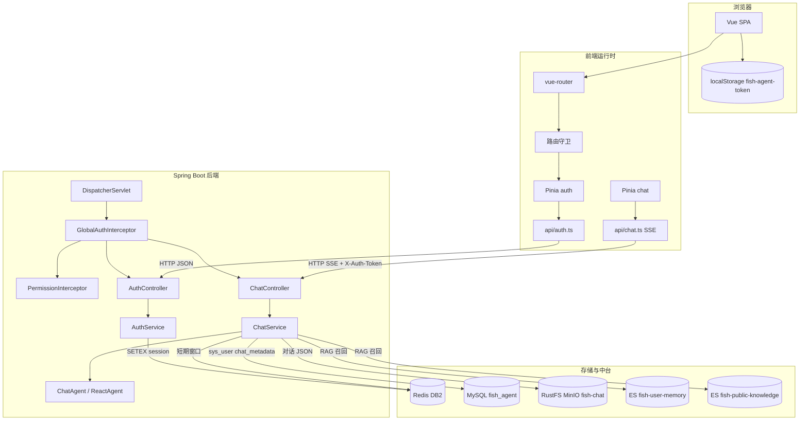
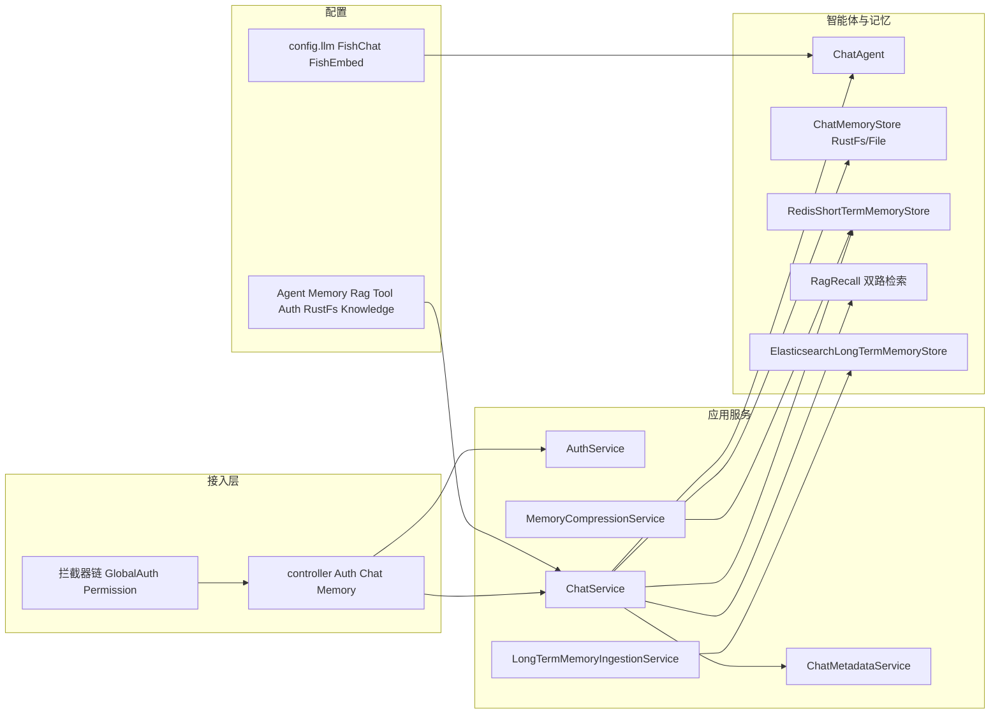
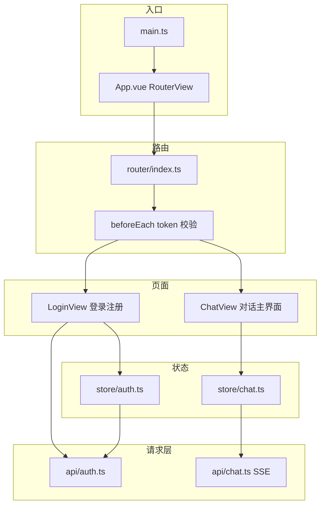

# Fish-Agent v2.0 全景文档

> 项目路径：`D:\1_Backend\Fish-Agent`  
> 覆盖版本：**v2.0 全新能力基线**（在 v1 → v1.3 能力线上演进：登录鉴权、MySQL 元数据、RustFS 对话存储、双索引 RAG、Vue Router 登录流、私有记忆按 `user_id` 隔离与虚拟线程 ThreadLocal 修复）。  
> 后端 Java 源文件约 **82** 个，`frontend/src` 下 TS/Vue 约 **16** 个（不含自动生成声明）。

**分文档索引**（历史增量仍以 v1 为准）：

- [v1-全景文档-20260504.md](../v1/v1-全景文档-20260504.md) — v1.x 全景（含工具、记忆、RAG、路由等基线描述）  
- [v1.x-版本总结-20260502.md](../v1/v1.x-版本总结-20260502.md) — v1.x 能力线汇总  
- [Redis常量名速查.md](../速查文档/Redis常量名速查.md) — 短期记忆 key + 登录会话 key  

---

## 一、一句话定位

Fish-Agent 是基于 **Spring Boot 3.5 + Spring AI Alibaba ReAct** 的全栈智能体应用：具备 **登录态（Redis Session + ThreadLocal）**、**MySQL 用户与会话元数据**、**RustFS（默认）或本地用户分区文件** 的对话持久化、**Redis 短期摘要 + 双索引 Elasticsearch RAG（私有按 user_id / 公有全库）**、工具 SPI、对话与嵌入模型可独立路由；前端 **Vue 3 + vue-router + Pinia**，以 **SSE** 流式呈现对话，接口统一携带 **`X-Auth-Token`**。

---

## 二、前后端总体架构

### 2.1 全链路一览（浏览器 → 后端 → 存储）



要点：**鉴权白名单**仅 `/api/auth/login|register|logout`；其余 `/api/**` 必须带 **`X-Auth-Token`**。默认 **`RUSTFS_ENABLED=true`** 写对话对象；`false` 时落 **`data/history/{userId}/{sessionId}.json`**。

---

### 2.2 后端分层架构（运行时）



---

### 2.3 前端 SPA 架构



---

## 三、技术栈汇总

**后端**

- JDK 21（虚拟线程 `spring.threads.virtual.enabled=true`）
- Spring Boot 3.5.13（锁定，与 Spring AI Alibaba 1.1.2.x 对齐）
- Spring AI Alibaba Agent Framework 1.1.2.0、`spring-ai-bom` 1.1.4
- 对话 / 嵌入路由：`fish.llm.chat-provider`、`fish.llm.embedding.provider`（DashScope / Ollama）
- **MySQL + MyBatis-Plus**：`sys_user`、`chat_metadata`
- **Redis**：短期记忆 + **登录 Session（token → UserContext JSON）**
- **Elasticsearch**：`fish-user-memory`（私有）、`fish-public-knowledge`（公有）
- **RustFS / MinIO SDK**：默认对话 JSON 对象存储（桶 `fish-chat`）
- **spring-security-crypto**：BCrypt 密码哈希（无完整 Spring Security FilterChain）
- Jsoup、Mail、Lombok、JUnit 5（同 v1.x）

**前端**

- Vue 3.5 + TypeScript 5.6 + Vite 6
- **vue-router 4**：`/login`、`/chat`、导航守卫
- Element Plus、Pinia、`marked` + `highlight.js`
- `pnpm` 安装依赖（仓库含 `pnpm-lock.yaml`）

---

## 四、后端文件目录

```
D:\1_Backend\Fish-Agent\
├── pom.xml                                  Maven（含 mybatis-plus-spring-boot3-starter、minio、spring-security-crypto）
├── src/main/resources/application.yml       集中配置（数据源 / Redis / ES / fish.*）
├── src/main/resources/META-INF/spring.factories
└── src/main/java/com/yuyu/fishagent/
    ├── FishAgentApplication.java            @SpringBootApplication + @MapperScan
    ├── enums/UserRole.java
    ├── entity/SysUser.java, ChatMetadata.java
    ├── mapper/SysUserMapper.java, ChatMetadataMapper.java
    ├── auth/
    │   ├── context/UserContext.java, UserContextHolder.java
    │   ├── session/RedisSessionManager.java
    │   └── interceptor/GlobalAuthInterceptor.java, PermissionInterceptor.java
    ├── agent/
    │   ├── AgentStatus.java, BaseAgent.java, ChatAgent.java
    │   ├── memory/
    │   │   ├── history/ChatMemoryStore.java
    │   │   ├── history/RustFsChatMemoryStore.java（rustfs.enabled=true）
    │   │   ├── history/UserScopedFileChatMemoryStore.java（rustfs.enabled=false）
    │   │   ├── shortterm/...
    │   │   ├── longterm/
    │   │   │   ├── LongTermMemoryStore.java, UserMemoryDocument.java, PublicKnowledgeDocument.java
    │   │   │   ├── ElasticsearchLongTermMemoryStore.java
    │   │   │   └── LongTermMemoryPromptBuilder / ResponseParser / FactSanitizer ...
    │   │   ├── compress/...
    │   │   └── rag/query|expand|recall/...（含 UserMemoryElasticsearchSearcher、PublicKnowledgeElasticsearchSearcher）
    │   └── tool/...
    ├── config/
    │   ├── AgentProperties, MemoryProperties, RagProperties, ToolProperties
    │   ├── AuthProperties, KnowledgeProperties, RustFsProperties
    │   ├── WebMvcConfig.java（CORS + 拦截器）
    │   └── llm/...
    ├── controller/ChatController.java, AuthController.java, MemoryController.java
    ├── service/
    │   ├── ChatService.java, AuthService.java, ChatMetadataService.java
    │   ├── MemoryCompressionService.java, LongTermMemoryIngestionService.java
    │   └── storage/RustFsService.java
    ├── dto/（含 LoginRequest、RegisterRequest、LoginResponse 等）
    └── exception/GlobalExceptionHandler.java
```

**运行期产物（默认不入库）**

```
data/
├── history/{userId}/{sessionId}.json   仅当 RUSTFS_ENABLED=false 时使用
└── sandbox/                            文件工具沙盒
```

---

## 五、前端文件目录

```
frontend/
├── package.json          Vue 3 / Vite 6 / vue-router 4 / Element Plus / Pinia
├── pnpm-lock.yaml
├── vite.config.ts
├── tsconfig.json
└── src/
    ├── main.ts           Pinia + router + Element Plus
    ├── App.vue           RouterView
    ├── router/index.ts   /login /chat 与守卫
    ├── api/auth.ts, api/chat.ts（X-Auth-Token）
    ├── store/auth.ts, store/chat.ts
    ├── types/auth.ts, types/chat.ts
    ├── views/LoginView.vue, ChatView.vue
    └── components/（SessionSidebar 含退出、MessageList、MessageBubble、ChatInput 等）
```

### 5.1 侧栏布局与昵称展示（v2.0 前端）

**涉及文件**：`frontend/src/components/SessionSidebar.vue`、`frontend/src/store/auth.ts`；接口沿用 `frontend/src/api/auth.ts` 中的 **`fetchMe`**（`GET /api/auth/me`）。

**布局（Chat 页左侧栏顶部）**：使用 **CSS Grid 两行两列**——第一行左侧为「🐟 Fish Agent」标题，右侧为当前用户展示名；第二行左侧为「新会话」，右侧为「退出」。标题与展示名同一行对齐，「新会话」与「退出」同一行对齐，避免原先「主色实心按钮横向撑满」导致的头重脚轻。

**「新会话」按钮**：Element Plus **`type="primary"` + `plain`**（浅色描边主色）、小尺寸圆角，`width: auto`，紧贴标题下方左侧，不再强制全宽。

**昵称与登录态 store**（`store/auth.ts`）：

- 与 token 并列持久化 **`fish-agent-nickname`**（localStorage key：`fish-agent-nickname`）。
- **`setSession`**：对 `nickname` 做 `trim`，空值不写昵称 key，避免污染本地缓存。
- **`applyProfile(me)`**：供 **`/api/auth/me`** 回填 **userId / nickname / role**，**不修改 token**；与登录响应结构共用 `LoginResponse`。
- 初始化读取昵称时 **`readStoredNickname()`** 会丢弃历史脏数据（如字符串 **`"null"`**）。

**进入聊天后的同步**：`SessionSidebar` 在 **`onMounted`** 中若存在 token，则调用 **`fetchMe`** → **`applyProfile`**，保证刷新页面后与 Redis 会话侧用户信息一致。

**展示逻辑**：去掉固定占位文案「用户」。若本地尚无可用昵称且 **`/me` 请求未完成**，昵称区域短暂显示 **`…`**；请求结束后以服务端字段为准。

**与后端展示名约定（简述）**：库中 **`nickname` 为空** 时，登录签发与 **`/api/auth/me`** 均 **回落为 `username`**，避免前端拿到空昵称；后端实现见 `AuthService`（`resolveDisplayNickname`）与 `AuthController#me`。前端依赖该约定，使侧栏展示名始终可读。

---

## 六、后端项目亮点（简历向）

**1. ReAct 智能体 + 工具 SPI（继承 v1.x）**  
`AgentToolProvider` 插件化注册，`ToolRegistry` 聚合与单工具失败隔离；外部工具按配置懒加载。

**2. 登录态与多用户数据隔离**  
Redis 存放会话 token；`GlobalAuthInterceptor` 校验并刷新 TTL，`UserContextHolder` 注入当前用户；聊天会话列表与 RustFS/文件写入均与 **`user_id`** 绑定（`ChatMetadataService`）。

**3. 分层持久化**  
- **完整对话 JSON**：默认 **RustFS**（S3 兼容），本地文件为明确降级路径。  
- **会话列表元数据**：MySQL `chat_metadata`。  
- **短期上下文**：Redis。  
- **长期可检索事实**：ES 私有索引 + **`user_id` 强制 filter**；公有知识库索引独立双路并发召回。

**4. RAG 工程化细节**  
可选查询重写、始终多查询扩展、虚拟线程并发、私有/公有索引分别检索后合并；**异步召回线程回放 `UserContext` 快照**，避免 ThreadLocal 丢失导致私有检索为空。

**5. SSE 与线程安全**  
流结束回调在非 MVC 线程执行时 **快照 UserContext** 再 `persist`，避免 `ChatMemoryStore` 读不到登录用户。

**6. 对话与嵌入模型独立路由（继承 v1.x）**  
`@Primary` ChatModel / EmbeddingModel，`FishLlmEnvironmentPostProcessor` 兼容 DashScope/Ollama 条件装配。

---

## 七、近期可改进项（v2.0 → v2.1+）

- **会话级并发互斥**：同 `sessionId` 后端串行化流式请求（409），减轻 RustFS/Redis 竞态。  
- **工具调用气泡**：后端对工具节点 emit `event: tool`，与前端组件对齐。  
- **用户资料注入**：将 `sys_user.nickname` 等稳定字段注入 SystemMessage，减少对 ES「名字类事实」的依赖。  
- **RustFS 写入降级策略**：连接失败时的明确错误码与前端提示文案。  
- **ES 索引迁移 Job**：mapping 变更时的 alias / reindex 脚本纳入运维文档。

---

## 八、后期推荐改造方向

**功能演进**

- **权限拦截器落地**：`PermissionInterceptor` 按 `ADMIN` 路由细分。  
- **知识库摄入管线**：`fish-docs` 桶原始文件 → 解析切片 → 写入 `fish-public-knowledge`。  
- **多 Agent 编排**：Supervisor + 子 Agent 分工。

**工程质量**

- SpringDoc OpenAPI、Docker Compose（MySQL + Redis + ES + MinIO）、CI 单测门禁。

**体验优化**

- SSE 断线重连、消息列表虚拟滚动、前端模型切换入口。

---

## 九、HTTP / SSE 接口速查

| Method | Path | 说明 |
|--------|------|------|
| POST | `/api/auth/register` | 注册（无需 Token） |
| POST | `/api/auth/login` | 登录（无需 Token） |
| POST | `/api/auth/logout` | 登出（可选带 Token 清理服务端会话） |
| GET | `/api/auth/me` | 当前用户概要（**需** `X-Auth-Token`） |
| POST | `/api/chat/stream` | 流式对话（SSE），**需 Token**，body: `{ sessionId?, message }` |
| GET | `/api/chat/sessions` | 当前用户的会话摘要列表 |
| GET | `/api/chat/sessions/{sid}` | 会话历史 |
| DELETE | `/api/chat/sessions/{sid}` | 删除会话 |
| POST | `/api/memory/compress` | 手动触发短期摘要压缩（需 Token） |

SSE 事件：`session` / `chunk` / `tool` / `done` / `error`

---

## 十、关键环境变量

| 变量名 | 必填 | 说明 |
|--------|------|------|
| `DASHSCOPE_API_KEY` | DashScope 模式 | 对话 + Embedding |
| `FISH_LLM_CHAT_PROVIDER` | 否 | `DASHSCOPE` / `OLLAMA` |
| `FISH_LLM_EMBEDDING_PROVIDER` | 否 | `DASHSCOPE` / `OLLAMA` |
| `DB_URL` / `DB_USERNAME` / `DB_PASSWORD` | MySQL 读写 | JDBC 中 **`characterEncoding=UTF-8`**（勿写 `utf8mb4`） |
| `REDIS_*` | 否 | 会话 + 短期记忆 |
| `ELASTICSEARCH_URIS` | 否 | 长期记忆与 RAG |
| `RUSTFS_ENABLED` | 否 | 默认 `true`；`false` 回退本地 `history-dir/{userId}` |
| `RUSTFS_ENDPOINT` / `RUSTFS_ACCESS_KEY` / `RUSTFS_SECRET_KEY` | RustFS 开启时 | MinIO 兼容配置 |
| `AUTH_SESSION_TTL` | 否 | Redis 会话 TTL（秒） |
| `MEMORY_LONG_TERM_ENABLED` | 否 | 长期写入开关 |
| `MEMORY_USER_INDEX` | 否 | 默认 `fish-user-memory` |
| `KNOWLEDGE_PUBLIC_INDEX` | 否 | 默认 `fish-public-knowledge` |
| `FISH_RAG_ENABLED` / `FISH_RAG_REWRITE_ENABLED` | 否 | RAG 总开关与重写 |

其余 Tavily/Bocha/Amap/Mail 等同 [v1 全景 §九](../v1/v1-全景文档-20260504.md)。

---

_文档版本：**v2.0 全景** · 生成日期：2026-05-04 · 对应代码能力线：v1 → v1.3 → **v2.0**_
