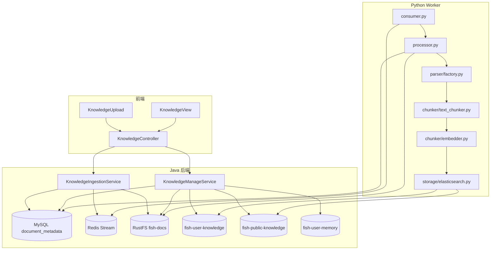

# Fish-Agent v2.1 知识库闭环与管理页

> 项目路径：`D:\1_Backend\Fish-Agent`  
> 覆盖版本：**v2.1**（在 [v2.0 全景](v2.0-全新版本-20260504.md) 基线上完成：**知识库上传链路（Java）**、**Python Worker 文档解析入库**、**用户记忆与用户知识库索引分离**、**知识库管理页（列表/删除）**、**前端样式统一 + UI 扩展 + 暗夜模式**）。  
> 文档生成日期：**2026-05-05**

**分文档索引**

- [v2.0-全新版本-20260504.md](v2.0-全新版本-20260504.md) — v2.0 架构与接口基线  
- [database/es/es.txt](../../database/es/es.txt) — ES 索引创建与迁移脚本  
- [database/sql/fish_agent.sql](../../database/sql/fish_agent.sql) — `document_metadata` 建表语句（含 `chunk_count`）  
- [python/README.md](../../python/README.md) — Python Worker 本地 / Docker 启动说明

---

## 一、v2.1 一句话增量

v2.1 将知识库能力从“仅上传入队”扩展为“上传 → 解析 → 切片嵌入 → 检索召回 → 管理删除”闭环，并完成关键隔离；同时前端完成从简约样式到可用性增强（暗夜模式 / 欢迎建议卡片）的升级：  
- **`fish-user-memory`** 仅存对话事实（`source_type=chat`）  
- **`fish-user-knowledge`** 存用户上传文档切片（PRIVATE）  
- **`fish-public-knowledge`** 存公共知识切片（PUBLIC）

---

## 二、整体架构（Java + Python + 前端管理页）

---

## 三、数据模型与索引约定

## 3.1 MySQL：`document_metadata`

核心字段：

| 字段 | 说明 |
|------|------|
| `task_id` | 上传任务唯一 ID，前端轮询与异步处理追踪主键 |
| `user_id` | 上传人 |
| `minio_path` | `fish-docs` 桶对象路径 |
| `scope_type` | `PRIVATE` / `PUBLIC` |
| `status` | `PENDING` / `PROCESSING` / `SUCCESS` / `FAILED` |
| `error_msg` | 失败信息或告警信息 |
| `chunk_count` | 写入 ES 的切片数（成功时） |

## 3.2 Elasticsearch：三索引职责

| 索引 | 用途 | 主要写入方 |
|------|------|-----------|
| `fish-user-memory` | 用户对话长期事实（仅 chat） | Java |
| `fish-user-knowledge` | 用户上传文档切片（PRIVATE） | Python Worker |
| `fish-public-knowledge` | 公共文档切片（PUBLIC） | Python Worker |

**迁移原则**：
- 已有历史 `source_type=document` 若仍在 `fish-user-memory`，需按 `database/es/es.txt` 执行一次清理脚本。
- `UserMemoryElasticsearchSearcher` 查询侧已加 `source_type=chat` 防御过滤。

---

## 四、上传与异步处理链路

## 4.1 上传入口（Java）

- 小文件（<= 1MB）走直传：`POST /api/knowledge/upload` 或 `/api/admin/knowledge/upload`
- 大文件（> 1MB）走分片：`init -> chunk -> complete`，底层采用 staging + `composeObject`
- 上传成功后：
  1) `document_metadata` 写入 `PENDING`  
  2) `XADD` 到 `fish:doc:ingest`

## 4.2 Worker 处理（Python）

处理步骤：
1. `XREADGROUP` 消费任务  
2. 下载 MinIO 原文件  
3. 按 MIME 选择解析器（当前重点支持 PDF）  
4. token 分块（默认 512/50）  
5. 生成向量并批量写 ES  
6. 回写 `document_metadata`（`PROCESSING -> SUCCESS/FAILED`）

状态机：
- `PENDING` -> `PROCESSING` -> `SUCCESS` / `FAILED`
- 无可提取文本时：`SUCCESS` + `chunk_count=0`

---

## 五、RAG 召回策略更新

v2.1 为三路并发召回：

1. `UserMemoryElasticsearchSearcher`（`fish-user-memory`，强制 `user_id` + `source_type=chat`）  
2. `UserKnowledgeElasticsearchSearcher`（`fish-user-knowledge`，强制 `user_id`）  
3. `PublicKnowledgeElasticsearchSearcher`（`fish-public-knowledge`）

最终合并去重后注入提示词上下文。

---

## 六、知识库管理页（前端 + 后端）

## 6.1 前端页面

新增页面：`frontend/src/views/KnowledgeView.vue`

能力：
- 上传区（复用 `KnowledgeUpload`）
- 文档列表分页
- 删除操作（二次确认）
- 管理员可查看“全部文档”

路由：
- `GET /knowledge` 页面路由（需登录）
- 侧栏新增“知识库”导航入口

## 6.1.1 前端样式与交互升级（v2.1 合并项）

在不变更核心业务链路的前提下，v2.1 合并了一次前端视觉与交互升级，主题保持 Fish-Agent，并新增暗夜模式能力：

- 主题机制双轨同步：统一通过 `applyTheme()` 同时设置 `data-theme`（自定义 CSS 变量）与 `html.dark`（Element Plus 暗色变量）
- 暗夜模式落地：左上角新增主题切换按钮（`Moon/Sunny`），支持持久化到 `localStorage` 并在 `main.ts` 首帧初始化，避免刷新闪白
- 全局变量补齐：`:root` 增加亮色默认变量（如 `--bubble-assistant`、`--bubble-assistant-text`），并在 `[data-theme='dark']` 下覆盖对应暗色值
- 欢迎区交互增强：`messages.length === 0` 时展示 4 个建议卡片，点击即调用 `store.send()`，发送首条消息后自动隐藏
- 对话区与输入区细节：消息气泡/复制按钮/回到底部按钮去硬编码，统一改为变量驱动；输入栏增加轻阴影与暗色下的深阴影

## 6.2 后端接口

| Method | Path | 说明 |
|--------|------|------|
| GET | `/api/knowledge/documents?page=1&size=20` | 当前用户文档列表 |
| GET | `/api/admin/knowledge/documents?page=1&size=20` | 管理员查看全部 |
| DELETE | `/api/knowledge/documents/{taskId}` | 删除文档任务（本人或管理员） |
| GET | `/api/knowledge/tasks/{taskId}` | 上传处理状态查询 |

---

## 七、删除语义与执行顺序

`KnowledgeManageService` 固定按以下顺序执行（尽力清理）：

1. **删 ES 切片**（按 `scope_type` 定位目标索引，`doc_id=taskId`）  
2. **删 RustFS 原文件**（`minio_path`）  
3. **删 MySQL 元数据**（`document_metadata`）

这样可避免先删 MySQL 导致中途故障时出现不可追踪的孤儿切片。

---

## 八、关键代码路径

| 职责 | 路径 |
|------|------|
| 上传编排 | `src/main/java/com/yuyu/fishagent/service/knowledge/KnowledgeIngestionService.java` |
| 管理查询/删除 | `src/main/java/com/yuyu/fishagent/service/knowledge/KnowledgeManageService.java` |
| 接口控制器 | `src/main/java/com/yuyu/fishagent/controller/KnowledgeController.java` |
| 私有知识检索 | `src/main/java/com/yuyu/fishagent/agent/memory/rag/recall/UserKnowledgeElasticsearchSearcher.java` |
| 记忆检索过滤 | `src/main/java/com/yuyu/fishagent/agent/memory/rag/recall/UserMemoryElasticsearchSearcher.java` |
| Worker 配置 | `python/fish_worker/config.py` |
| Worker 处理流程 | `python/fish_worker/processor.py` |
| Worker ES 写入 | `python/fish_worker/storage/elasticsearch.py` |
| 管理页 | `frontend/src/views/KnowledgeView.vue` |
| 前端知识 API | `frontend/src/api/knowledge.ts` |
| 主题切换逻辑 | `frontend/src/composables/useTheme.ts` |
| 前端启动主题初始化 | `frontend/src/main.ts` |
| 全局样式变量 | `frontend/src/style.css` |
| 侧栏与导航样式 | `frontend/src/components/SessionSidebar.vue` |
| 欢迎区建议卡片 | `frontend/src/components/MessageList.vue` |
| 消息气泡样式 | `frontend/src/components/MessageBubble.vue` |
| 输入栏样式 | `frontend/src/components/ChatInput.vue` |
| 登录页样式 | `frontend/src/views/LoginView.vue` |

---

## 九、环境变量增量（相对 v2.0）

| 变量名 | 说明 |
|--------|------|
| `FISH_DOC_INGEST_STREAM` | 文档解析任务 Stream 键 |
| `KNOWLEDGE_USER_INDEX` | 用户知识库索引（默认 `fish-user-knowledge`） |
| `KNOWLEDGE_PUBLIC_INDEX` | 公共知识库索引（默认 `fish-public-knowledge`） |
| `MEMORY_USER_INDEX` | 用户记忆索引（默认 `fish-user-memory`，Worker 不再写入） |
| `FISH_KNOWLEDGE_MAX_FILE_SIZE` | 上传单文件上限 |
| `FISH_KNOWLEDGE_MAX_REQUEST_SIZE` | 上传请求上限 |

---

## 十、后续建议

- 文档下载 / 预览能力
- Office（Word/Excel）解析扩展
- ES 部分失败补偿扫描与重试任务

---

_文档版本：**v2.1 知识库闭环与管理页** · 生成日期：2026-05-05 · 承接 **v2.0** 全景_
