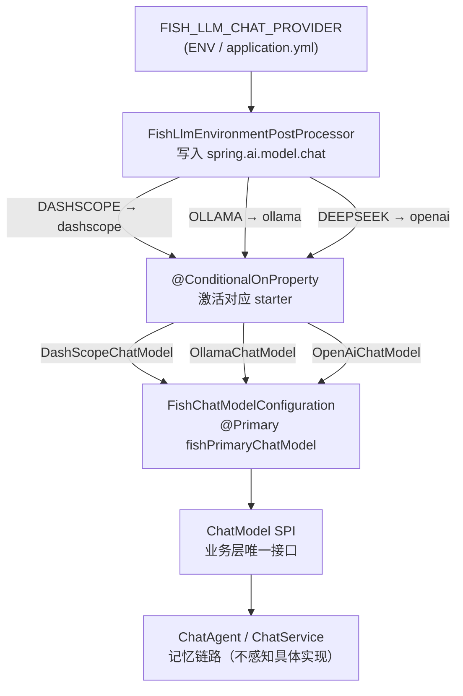

# Fish-Agent v2.2 DeepSeek 对话接入

> 项目路径：`D:\1_Backend\Fish-Agent`  
> 覆盖版本：**v2.2**（在 [v2.1 全景](v2.1-知识库闭环与管理页-20260505.md) 基线上完成：**DeepSeek Chat 第三条对话路由**、**OpenAI-compatible 自动配置接入**、**requireBean 错误消息泛化**、**嵌入路由防御**、**单元测试覆盖**）。  
> 文档生成日期：**2026-05-06**

**分文档索引**

- [v2.0-全新版本-20260504.md](v2.0-全新版本-20260504.md) — v2.0 架构与接口基线  
- [v2.1-知识库闭环与管理页-20260505.md](v2.1-知识库闭环与管理页-20260505.md) — v2.1 增量记录  
- [v2-全景文档-20260505.md](v2-全景文档-20260505.md) — v2 全景（含 v2.2 更新）

---

## 一、v2.2 一句话增量

在已有 `DASHSCOPE / OLLAMA` 双路对话路由的基础上，引入 **`DEEPSEEK`** 作为第三条路由。DeepSeek 兼容 OpenAI 接口，复用 `spring-ai-starter-model-openai` 适配器，通过 `spring.ai.openai.base-url` 指向 DeepSeek 端点。上层业务代码（`ChatAgent`、`ChatService`、记忆链路）**零改动**，对话模型切换只需修改一个环境变量。

---

## 二、对话路由架构变化

### 2.1 路由链路（v2.2 之后）



### 2.2 枚举对照

| `FISH_LLM_CHAT_PROVIDER` | `spring.ai.model.chat` | 激活的 Bean | 必填密钥 |
|--------------------------|------------------------|-------------|----------|
| `DASHSCOPE`（默认） | `dashscope` | `DashScopeChatModel` | `DASHSCOPE_API_KEY` |
| `OLLAMA` | `ollama` | `OllamaChatModel` | 无（本地服务） |
| `DEEPSEEK` | `openai` | `OpenAiChatModel` | `DEEPSEEK_API_KEY` |

---

## 三、新增 / 修改文件清单

| 文件 | 变更性质 | 说明 |
|------|----------|------|
| `pom.xml` | 新增依赖 | `spring-ai-starter-model-openai`（受 Spring AI BOM 1.1.4 管理） |
| `config/llm/FishLlmChatProvider.java` | 新增枚举值 | `DEEPSEEK("openai")`；`parse()` 支持大小写不敏感；Javadoc 区分对话与嵌入 |
| `config/llm/FishChatModelConfiguration.java` | 新增 case + 重构 | `case DEEPSEEK` 选 `OpenAiChatModel`；`requireBean` 错误消息改为按提供方分支，移除旧 Ollama 硬编码提示 |
| `config/llm/FishEmbeddingModelConfiguration.java` | 修复编译错误 | `case DEEPSEEK` 抛出 `IllegalStateException`（嵌入不支持 DEEPSEEK） |
| `resources/application.yml` | 新增配置段 + 注释更新 | `spring.ai.openai.*`、`spring.autoconfigure.exclude` 5 个多余 OpenAI 自动配置、注释同步 |
| `config/llm/FishLlmEmbeddingProperties.java` | Javadoc | 补充嵌入勿使用 DEEPSEEK 说明 |
| `test/.../FishLlmChatProviderTest.java` | 补测试用例 | `parse_deepseek_caseInsensitive`、`deepseek_toSpringAiModelChatValue_isOpenai` |

---

## 四、关键实现细节

### 4.1 为什么 DEEPSEEK 对应 `spring.ai.model.chat=openai`

DeepSeek 完整实现了 OpenAI Chat Completions API（`/v1/chat/completions`）。Spring AI 的 `spring-ai-starter-model-openai` 在激活时只要求 `spring.ai.model.chat=openai`，通过 `spring.ai.openai.base-url` 配置服务端点，因此无需额外适配层。`FishLlmChatProvider.DEEPSEEK` 的 `toSpringAiModelChatValue()` 直接返回 `"openai"`，`FishLlmEnvironmentPostProcessor` 无需任何改动。

### 4.2 排除多余的 OpenAI 自动配置

`spring-ai-starter-model-openai` 除 Chat 外还会装配 Speech、Transcription、Embedding、Image、Moderation 五类 Bean，每类在 **无 API key 时均会启动失败**。v2.2 在 `spring.autoconfigure.exclude` 中显式排除这五项，仅保留 `OpenAiChatAutoConfiguration`：

```yaml
spring:
  autoconfigure:
    exclude:
      - org.springframework.ai.model.openai.autoconfigure.OpenAiAudioSpeechAutoConfiguration
      - org.springframework.ai.model.openai.autoconfigure.OpenAiAudioTranscriptionAutoConfiguration
      - org.springframework.ai.model.openai.autoconfigure.OpenAiEmbeddingAutoConfiguration
      - org.springframework.ai.model.openai.autoconfigure.OpenAiImageAutoConfiguration
      - org.springframework.ai.model.openai.autoconfigure.OpenAiModerationAutoConfiguration
```

这样在使用 `DASHSCOPE` 或 `OLLAMA` 时，即使未配置 `DEEPSEEK_API_KEY`，应用也能正常启动。

> **注**：以上完整类名基于 Spring AI 1.1.4 的预期包结构。若实际 JAR 中类名或包路径不同（例如可能位于 `org.springframework.ai.openai.autoconfigure` 而非 `org.springframework.ai.model.openai.autoconfigure`），可通过 `mvn dependency:tree` 找到 `spring-ai-openai` JAR，再用 `jar tf` 确认实际 AutoConfiguration 类名后修正。

### 4.3 嵌入路由不支持 DEEPSEEK

`FishLlmChatProvider` 枚举被对话与嵌入双方复用（`FishLlmEmbeddingProperties.provider` 类型也是该枚举）。新增 `DEEPSEEK` 后，`FishEmbeddingModelConfiguration` 的 switch 需要穷举新值，否则编译报错。v2.2 做法是：

```java
case DEEPSEEK -> throw new IllegalStateException(
    "fish.llm.embedding.provider=DEEPSEEK 暂不支持；嵌入请继续使用 DASHSCOPE 或 OLLAMA");
```

**嵌入继续使用 DashScope**（默认）或 Ollama，配置键为 `FISH_LLM_EMBEDDING_PROVIDER`，与对话独立。

### 4.4 requireBean 错误消息泛化

原来 `FishChatModelConfiguration.requireBean` 的错误消息硬编码了"Ollama 需该值为 ollama 才会装配"等 Ollama 专用排障文案，当 DEEPSEEK 触发失败时会打印误导性提示。v2.2 重构为按提供方分支输出：

| 提供方 | 排障提示 |
|--------|----------|
| `OLLAMA` | 确认 Ollama 已启动、`spring.ai.ollama.base-url` 可达、模型已 pull |
| `DASHSCOPE` | 确认 `DASHSCOPE_API_KEY` 已配置，Chat 自动配置未被排除 |
| `DEEPSEEK` | 确认 `DEEPSEEK_API_KEY`、`spring.ai.openai.base-url` 已配置 |

### 4.5 deepseek-chat vs deepseek-reasoner

| 模型 | 工具调用 | ReAct 兼容性 | 适用场景 |
|------|----------|--------------|----------|
| `deepseek-chat`（V3，默认） | 稳定支持 | 兼容 | 日常对话 + ReAct Agent |
| `deepseek-reasoner`（R1） | 行为差异大，可能跳过工具直接输出推理链 | 不稳定 | 纯推理任务（不含工具调用） |
| `deepseek-v4-pro` 等较新/实验性模型 | 可能不支持（返回 400） | 不兼容 | 简单对话（不涉及工具） |

**实测**：`deepseek-v4-pro` 在简单对话中正常，但一旦携带 `tools` 参数即返回 `400 Bad Request`，DeepSeek API 不报具体原因。`deepseek-chat` 无此问题。
**建议：** ReAct 场景下始终使用 `deepseek-chat`；接到 400 时优先排查 `DEEPSEEK_CHAT_MODEL` 是否误设为非 `deepseek-chat`。

---

## 五、application.yml 变更摘要

```yaml
spring:
  # 排除无需的 OpenAI 子模态自动配置（无 key 时装配失败）
  autoconfigure:
    exclude:
      - ...（5 项，见四.4.2）

  ai:
    # spring.ai.model.chat 合法值：dashscope | ollama | openai（DeepSeek 走 openai 适配）
    # （由 FishLlmEnvironmentPostProcessor 根据 fish.llm.chat-provider 自动注入）

    openai:
      # fish.llm.chat-provider=DEEPSEEK 时生效，DeepSeek 兼容 OpenAI 接口
      base-url: ${DEEPSEEK_BASE_URL:https://api.deepseek.com}
      api-key: ${DEEPSEEK_API_KEY:}
      chat:
        options:
          # deepseek-chat（V3）工具调用稳定，适合 ReAct；deepseek-reasoner（R1）与工具协同差异大
          model: ${DEEPSEEK_CHAT_MODEL:deepseek-chat}

fish:
  llm:
    # 合法值：DASHSCOPE / OLLAMA / DEEPSEEK
    # 切换 DeepSeek：FISH_LLM_CHAT_PROVIDER=DEEPSEEK，并配置 DEEPSEEK_API_KEY
    chat-provider: ${FISH_LLM_CHAT_PROVIDER:DASHSCOPE}
    embedding:
      # 请勿设为 DEEPSEEK（当前嵌入不支持；仅 DASHSCOPE / OLLAMA）
      provider: ${FISH_LLM_EMBEDDING_PROVIDER:DASHSCOPE}
```

---

## 六、环境变量增量（相对 v2.1）

| 变量名 | 必填 | 默认值 | 说明 |
|--------|------|--------|------|
| `DEEPSEEK_API_KEY` | DeepSeek 模式 | — | `FISH_LLM_CHAT_PROVIDER=DEEPSEEK` 时必填 |
| `DEEPSEEK_BASE_URL` | 否 | `https://api.deepseek.com` | 可覆盖为私有部署地址 |
| `DEEPSEEK_CHAT_MODEL` | 否 | `deepseek-chat` | 建议 ReAct 使用 `deepseek-chat` |

---

## 七、快速切换指南

### 使用 DashScope（默认，无需修改）

```bash
DASHSCOPE_API_KEY=sk-xxx
# FISH_LLM_CHAT_PROVIDER 不设置或为 DASHSCOPE
```

### 切换到 DeepSeek

```bash
FISH_LLM_CHAT_PROVIDER=DEEPSEEK
DEEPSEEK_API_KEY=sk-xxx
# 可选：DEEPSEEK_CHAT_MODEL=deepseek-chat（默认）
```

### 切换到 Ollama（本地）

```bash
FISH_LLM_CHAT_PROVIDER=OLLAMA
OLLAMA_BASE_URL=http://localhost:11434
OLLAMA_CHAT_MODEL=qwen2.5:7b
```

三种模式下嵌入始终可独立配置：

```bash
FISH_LLM_EMBEDDING_PROVIDER=DASHSCOPE   # 或 OLLAMA，不能设为 DEEPSEEK
DASHSCOPE_API_KEY=sk-xxx                # DASHSCOPE 嵌入时必填
```

---

## 八、关键代码路径

| 职责 | 路径 |
|------|------|
| 对话提供方枚举 | `config/llm/FishLlmChatProvider.java` |
| 对话路由后处理器 | `config/llm/FishLlmEnvironmentPostProcessor.java` |
| 对话 Bean 选择 | `config/llm/FishChatModelConfiguration.java` |
| 嵌入 Bean 选择（含 DEEPSEEK 防御） | `config/llm/FishEmbeddingModelConfiguration.java` |
| 嵌入提供方配置 | `config/llm/FishLlmEmbeddingProperties.java` |
| 枚举单元测试 | `test/.../FishLlmChatProviderTest.java` |

---

## 九、不涉及内容

- `FishLlmEnvironmentPostProcessor`：无需改动，`DEEPSEEK.toSpringAiModelChatValue()` 返回 `"openai"` 已足够激活 Spring AI OpenAI 自动配置。
- 上层业务：`ChatAgent`、`ChatService`、记忆链路（长期抽取 / 短期压缩 / RAG）均注入 `ChatModel` 接口，对具体实现无感知。
- 前端、Python Worker：无变动。
- 嵌入模型：本版本未接入 DeepSeek 嵌入，向量维度与索引结构不变。

---

_文档版本：**v2.2 DeepSeek 对话接入** · 生成日期：2026-05-06 · 承接 **v2.1** 知识库闭环_
