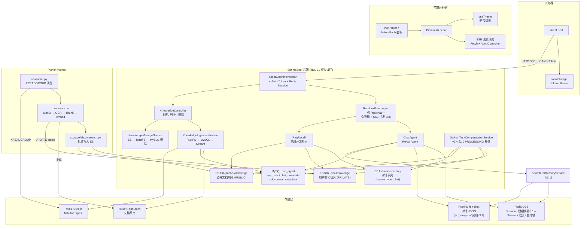
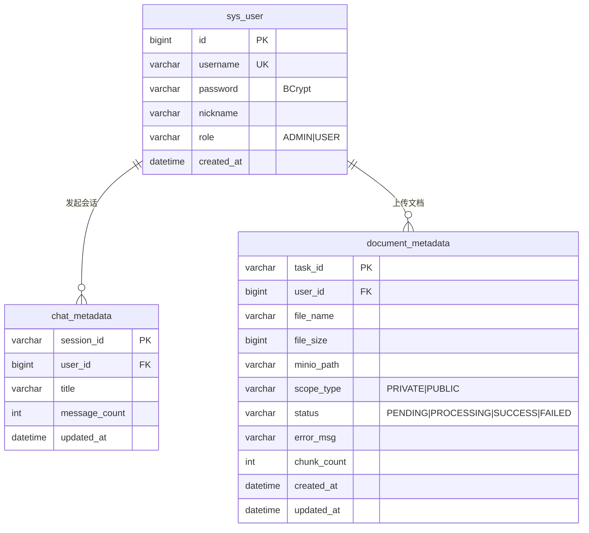
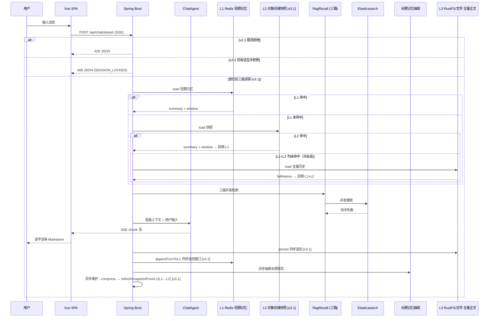

# Fish-Agent v3 全景文档

> 项目路径：`D:\1_Backend\Fish-Agent`
> 覆盖版本：**v2.0 ~ v2.6 + v3.0 + v3.1 + v3.2 + v3.3**（v1 → v1.3 → v2.0 → ... → v2.6 → v3.0 后端模块重构 → v3.1 短期记忆三级读穿写穿 → v3.2 Worker 心跳与 Embedding 重试 → **v3.3 多格式文档解析 + OCR 文本清洗**）
> 后端 Java 源文件约 **108** 个，`frontend/src` 下 TS/Vue 约 **21** 个，Python Worker 约 **19** 个文件。

**分文档索引**

- [v2 全景文档](../v2/v2-全景文档-20260505.md) — v2.x 全景（含 v2.0 ~ v2.6 增量索引）
- [v3.0-后端模块重构](v3.0-后端模块重构-20260512.md) — v3.0 增量记录（按业务域分包，零功能变更）
- [v3.1-短期记忆三级读穿写穿](v3.1-短期记忆三级读穿写穿-20260601.md) — v3.1 增量记录（L1/L2/L3 三级读穿写穿）
- [v3.2-Worker心跳与embedding重试](v3.2-Worker心跳与embedding重试-20260601.md) — v3.2 增量记录（Worker P0 修复）
- **[v3.3-多格式解析与OCR清洗](v3.3-多格式解析与OCR清洗-20260604.md) — v3.3 增量记录（6 种新格式 + 文本清洗管道）**
- [Redis常量名速查](../速查文档/Redis常量名速查.md)
- [数据库速查](../速查文档/数据库速查.md)
- [向量库速查](../速查文档/向量库速查.md)
- [ES 索引 DDL](../../database/es/es.txt)
- [MySQL 建表语句](../../database/sql/fish_agent.sql)
- [Python Worker 说明](../../python/README.md)

---

## 一、项目定位

Fish-Agent 是基于 **Spring Boot 3.5 + Spring AI Alibaba ReAct** 的全栈智能体应用。

**核心能力链**：登录鉴权 → **`/api/chat/**` Redis 令牌桶 + SSE 并发限流** → **同 `sessionId` Redis 互斥（v2.4，防双击竞态）** → 多轮对话（SSE 流式）→ **三级短期记忆（v3.1：L1 Redis → L2 对象存储快照 → L3 全量正文，热路径只读 Redis）** / 长期事实抽取（v2.4）→ 三路 ES RAG 检索注入 → 工具调用。

**对话模型路由**：支持 **DashScope**（阿里云通义）/ **Ollama**（本地）/ **DeepSeek**（OpenAI-compatible）三路可选，嵌入独立配置，切换只需修改一个环境变量，上层业务零感知。

**知识库闭环**：前端上传（直传/分片）→ Java 写入 RustFS + MySQL + Redis Stream → Python Worker 异步消费 → **多格式解析（v3.3：PDF OCR / txt / md / docx / html / xlsx / pptx）** → **文本清洗管道（v3.3：NFC / 控制字符 / OCR 替换 / 标点合并 / 空白标准化）** → token 分块 → embedding 向量化（v3.2：429/5xx 指数退避重试）→ ES 批量写入 → 前端管理页列表/删除。Worker 心跳（v3.2）防长任务被孤儿补偿误杀，终态 CAS + ES 清理保证数据一致。

**前端**：Vue 3 + TypeScript + Element Plus，SSE 流式呈现，暗夜模式持久化；v2.5 前端全面美化；v2.6 可靠性与体验改进；v3.0 后端包结构从按技术层分包重构为按业务域分包；v3.1 短期记忆三级读穿写穿（L1/L2/L3），热路径只读 Redis；v3.2 Worker 心跳 + Embedding 重试，长任务不误杀、瞬时错误自动重试；**v3.3 多格式文档解析（txt/md/docx/html/xlsx/pptx）+ OCR 文本统一清洗管道**。

---

## 二、全链路架构



---

## 三、技术栈

### 3.1 后端 (Java)

| 分层 | 技术 | 说明 |
|------|------|------|
| 运行时 | JDK 21 | 虚拟线程 `spring.threads.virtual.enabled=true` |
| 框架 | Spring Boot 3.5.13 | 自动配置 + `@ConfigurationProperties` |
| AI 引擎 | Spring AI Alibaba 1.1.2 | ReAct Agent + `ModelCallLimitHook` |
| AI BOM | Spring AI BOM 1.1.4 | Chat / Embedding SPI |
| 模型路由 | DashScope / Ollama / DeepSeek（Chat） | `fish.llm.chat-provider` / `embedding.provider` 可独立配置 |
| 持久层 | MyBatis-Plus 3.5 | `sys_user`、`chat_metadata`、`document_metadata` |
| 缓存 | Redis (Lettuce) | DB2：Session + 短期摘要(L1) + Stream + 限流 + 会话互斥 |
| 检索引擎 | Elasticsearch 8.x | 三索引：用户记忆 / 私有知识 / 公共知识 |
| 对象存储 | MinIO (RustFS) | 对话 JSON (`fish-chat`) + 文档原文 (`fish-docs`) |
| 安全 | spring-security-crypto | BCrypt 密码哈希（无完整 FilterChain） |
| 工具库 | Lombok, Jsoup, JUnit 5 | — |

### 3.2 Python Worker

| 分层 | 技术 | 说明 |
|------|------|------|
| 运行时 | Python 3.11+ | Docker 多阶段构建 |
| 消息消费 | redis-py 5.x | `XREADGROUP` + `XAUTOCLAIM` + `XACK` |
| 对象存储 | minio-py 7.x | 下载 `fish-docs` 桶原始文件 |
| PDF 解析 | PyMuPDF (fitz) 1.24+ | 渲染为 300 DPI PNG 图片 |
| 多格式解析 | python-docx / BeautifulSoup / openpyxl / python-pptx | **v3.3**：docx / html / xlsx / pptx / txt / md |
| 文本清洗 | 标准库 `unicodedata` + `re` | **v3.3**：NFC / 控制字符 / OCR 替换 / 标点合并 / 空白标准化 |
| OCR 识别 | pytesseract 0.3+ | Tesseract 引擎, `chi_sim+eng` 中英双语 |
| token 分块 | tiktoken 0.7+ | `cl100k_base` 编码器, 512 token / 50 overlap |
| embedding | httpx → DashScope API | 批量 25 条/次, `text-embedding-v2` 1536 维, **v3.2: 429/5xx/网络错误指数退避重试** |
| ES 写入 | elasticsearch-py 8.x | 20 条/批 bulk index |
| 配置 | pydantic-settings 2.x | 所有环境变量与 Java `application.yml` 命名对齐 |
| 数据库 | PyMySQL 1.x | `document_metadata` 状态更新, **v3.2: CAS 写入 + 心跳 touch** |
| 心跳 | threading + PyMySQL | **v3.2**: 守护线程每 30s 刷新 `updated_at`，防孤儿补偿误杀 |

### 3.3 前端

| 分层 | 技术 | 说明 |
|------|------|------|
| 框架 | Vue 3.5 + TypeScript 5.6 | Composition API + `<script setup>` |
| 构建 | Vite 6 | HMR 热更新, 自动导入 Element Plus |
| 路由 | vue-router 4 | `/login` `/chat` `/knowledge`, `beforeEach` token 校验 |
| UI 库 | Element Plus 2.x + Icons | 暗色变量 `.dark` |
| 状态管理 | Pinia | auth (token+nickname), chat (sessions+messages+streaming) |
| SSE 消费 | Fetch API + ReadableStream | `AbortController` 取消生成 |
| Markdown | marked + highlight.js | 代码高亮, 内联代码着色 |
| 暗夜模式 | `useTheme` composable | `data-theme` + `html.dark` 双机制 |
| CSS 体系 | CSS 变量约 30 项 | `:root` 亮色 + `[data-theme='dark']` 暗色全覆盖 |

---

## 四、后端源码目录（v3.0 按业务域分包）

```
src/main/java/com/yuyu/fishagent/
├── FishAgentApplication.java                   @SpringBootApplication + @MapperScan(3个包)
│
├── agent/                                      Agent 核心
│   ├── BaseAgent.java                          抽象基类
│   ├── ChatAgent.java                          ReAct Agent 主循环, 工具编排
│   ├── AgentStatus.java                        原子状态枚举 (IDLE/RUNNING/STOPPED)
│   ├── config/
│   │   ├── AgentProperties.java                Agent 配置（人设、最大迭代次数等）
│   │   └── ToolProperties.java                 外部工具配置
│   └── tool/
│       ├── AgentToolProvider.java              SPI 接口
│       ├── ToolRegistry.java                   自动发现 + 单工具失败隔离
│       ├── builtin/                            DateTime, Calculator, WebFetch, FileRead, FileWrite
│       └── external/                           Tavily, Bocha, AmapWeather, AmapGeo, Mail
│
├── chat/                                       对话模块
│   ├── ChatController.java                    /api/chat/stream|sessions|sessions/{sid} + PATCH rename
│   ├── ChatService.java                       对话编排主入口 (SSE → Agent → 记忆)
│   ├── ChatMetadataService.java               会话元数据 CRUD
│   ├── history/                               对话持久化 (SPI)
│   │   ├── ChatMemoryStore.java               SPI 接口
│   │   ├── RustFsChatMemoryStore.java         RustFS fish-chat 桶 (默认)
│   │   └── UserScopedFileChatMemoryStore.java 本地文件回退
│   ├── dto/
│   │   ├── ChatRequest.java
│   │   └── SessionInfo.java
│   ├── entity/
│   │   └── ChatMetadata.java                  session_id, user_id, title, message_count
│   └── mapper/
│       └── ChatMetadataMapper.java
│
├── rag/                                        RAG + 知识库模块
│   ├── KnowledgeController.java               /api/knowledge/** + /api/admin/knowledge/**
│   ├── service/
│   │   ├── KnowledgeIngestionService.java     上传 → RustFS → MySQL → Redis Stream
│   │   ├── KnowledgeManageService.java        列表查询 / 删除 (ES→RustFS→MySQL)
│   │   ├── OrphanTaskCompensationService.java v2.4 定时清理孤儿 PROCESSING
│   │   ├── MultipartInitResult.java           分片上传中间结果 record
│   │   └── RustFsService.java                 MinIO 封装
│   ├── pipeline/                               RAG 检索管道
│   │   ├── query/RagQueryRewrite.java         可选查询重写
│   │   ├── expand/RagQueryExpand.java         多子查询扩展
│   │   └── recall/
│   │       ├── RagRecall.java                 编排 + 合并去重 + 渲染注入块
│   │       ├── RagRecallConfiguration.java    三路 Searcher Bean 装配
│   │       ├── UserMemoryElasticsearchSearcher.java      fish-user-memory
│   │       ├── UserKnowledgeElasticsearchSearcher.java   fish-user-knowledge
│   │       └── PublicKnowledgeElasticsearchSearcher.java fish-public-knowledge
│   ├── document/                               ES 文档模型
│   │   ├── PublicKnowledgeDocument.java
│   │   └── UserMemoryDocument.java
│   ├── dto/
│   │   ├── DocumentMetadataPageResponse.java
│   │   ├── DocumentMetadataResponse.java
│   │   ├── DocumentTaskStatusResponse.java
│   │   ├── KnowledgeUploadResponse.java
│   │   └── Multipart*.java (6个)
│   ├── entity/
│   │   └── DocumentMetadata.java              task_id, user_id, scope_type, status, chunk_count
│   ├── mapper/
│   │   └── DocumentMetadataMapper.java
│   └── config/
│       ├── KnowledgeProperties.java            索引名 + Stream key + compensation
│       ├── RagProperties.java                  RAG 检索配置
│       └── RustFsProperties.java               MinIO 配置
│
├── memory/                                     记忆系统模块
│   ├── MemoryController.java                  /api/memory/compress (调试)
│   ├── LongTermMemoryIngestionService.java    对话结束后事实抽取入库
│   ├── MemoryCompressionService.java          短期→长期压缩
│   ├── shortterm/                              短期记忆 (Redis L1 + 对象存储 L2)
│   │   ├── ShortTermMemoryStore.java          L1 SPI 接口 (save/load/clear)
│   │   ├── RedisShortTermMemoryStore.java     L1 Redis 实现
│   │   ├── ShortTermSnapshotStore.java        L2 快照 SPI 接口 (load/save/clear) [v3.1]
│   │   ├── RustFsShortTermSnapshotStore.java  L2 RustFS 实现 ({sid}.stm.json) [v3.1]
│   │   ├── FileShortTermSnapshotStore.java    L2 文件兜底实现 [v3.1]
│   │   ├── ShortTermMemoryService.java        三级协调器 (L1→L2→L3 读穿/写穿) [v3.1]
│   │   └── ShortTermMemorySnapshot.java       快照 record
│   ├── longterm/                               长期记忆 (ES + LLM 抽取)
│   │   ├── LongTermMemoryStore.java           SPI
│   │   ├── ElasticsearchLongTermMemoryStore.java
│   │   ├── LongTermMemoryPromptBuilder.java   事实抽取 Prompt 模板
│   │   ├── LongTermMemoryResponseParser.java  JSON 解析
│   │   └── LongTermMemoryFactSanitizer.java   事实清洗去噪
│   ├── compress/                               记忆压缩 (LLM 摘要)
│   │   ├── MemoryPromptBuilder.java
│   │   └── MemoryResponseParser.java
│   ├── dto/
│   │   ├── MemoryCompressionRequest.java
│   │   └── MemoryCompressionResult.java
│   └── config/
│       └── MemoryProperties.java               短期窗口/触发阈值/Redis TTL/长期配置
│
├── auth/                                       认证鉴权模块
│   ├── AuthController.java                    /api/auth/login|register|logout|me
│   ├── AuthService.java                       登录注册, BCrypt, Redis Session
│   ├── context/
│   │   ├── UserContext.java                   用户上下文记录 (userId, nickname, role)
│   │   └── UserContextHolder.java             ThreadLocal<UserContext> 存取
│   ├── session/
│   │   └── RedisSessionManager.java           Redis Hash 存 token→userId, TTL 续期
│   ├── interceptor/
│   │   ├── GlobalAuthInterceptor.java         拦截 /api/**, 校验 X-Auth-Token
│   │   ├── RateLimitInterceptor.java          v2.3：仅 /api/chat/**，令牌桶 + SSE 并发
│   │   └── PermissionInterceptor.java         预留 ADMIN 路由权限细分
│   ├── dto/
│   │   ├── LoginRequest.java / LoginResponse.java / RegisterRequest.java
│   ├── entity/
│   │   └── SysUser.java                       id, username, password(BCrypt), nickname, role
│   ├── mapper/
│   │   └── SysUserMapper.java
│   ├── enums/
│   │   └── UserRole.java                      ADMIN / USER
│   └── config/
│       └── AuthProperties.java                 会话 TTL、白名单路径
│
├── llm/                                        LLM 配置模块
│   └── config/
│       ├── FishLlmEnvironmentPostProcessor.java  早期写入 spring.ai.model.chat
│       ├── FishChatModelConfiguration.java       v2.4 @Bean memoryChatModel
│       ├── FishEmbeddingModelConfiguration.java  嵌入模型选择
│       ├── FishLlmChatProvider.java              三路枚举
│       ├── FishLlmProperties.java                对话配置
│       ├── FishLlmEmbeddingProperties.java       嵌入配置
│       └── FishLlmConfigurationConsistencyLogger.java 配置校验
│
├── common/                                     共享基础设施
│   ├── exception/
│   │   ├── GlobalExceptionHandler.java          统一异常 → JSON（含 v2.4 409 SESSION_LOCKED）
│   │   └── SessionLockedException.java          v2.4 同会话并发占用
│   ├── ratelimit/                               v2.3 Redis Lua 限流；v2.4 会话互斥锁
│   │   ├── RateLimitResult.java                 密封接口：放行 / 两类拒绝
│   │   └── RateLimitService.java                evaluate + decrementSseConcurrent + tryAcquireSessionLock
│   ├── config/
│   │   ├── WebMvcConfig.java                    CORS + 拦截器注册
│   │   ├── SchedulingConfiguration.java         v2.4 @EnableScheduling
│   │   └── RateLimitProperties.java             v2.3 fish.rate-limit
│   └── dto/
│       └── ChatMessageDTO.java                  通用消息结构（role + content），多模块共享
```

---

## 五、Python Worker 源码目录

```
python/
├── Dockerfile                           多阶段构建, Tesseract OCR 中文语言包
├── requirements.txt                     redis, minio, PyMySQL, elasticsearch, PyMuPDF, pytesseract, tiktoken, httpx, pydantic-settings
├── .env.example                         环境变量模板（含 v3.2 心跳/重试参数）
├── README.md                            本地 venv + Docker 启动说明 + 心跳/重试机制说明
│
└── fish_worker/
    ├── __init__.py                      包声明 + __version__
    ├── __main__.py                      python -m fish_worker 入口
    ├── main.py                          CLI 主入口: 组装依赖 → 注册信号 → 启动消费循环
    ├── config.py                        pydantic-settings, 所有环境变量映射（含 v3.2 心跳/重试配置）
    ├── exceptions.py                    WorkerError / UnsupportedFileTypeError
    ├── deps.py                          WorkerContext @dataclass DI 容器
    ├── consumer.py                      Redis Stream XREADGROUP + XAUTOCLAIM + XACK
    ├── processor.py                     单任务流水线 + v3.2: 心跳线程 + CAS 终态 + ES 兜底清理
    ├── health.py                        HTTP /health 端点 (Redis/MySQL/ES/MinIO 四探针)
    │
    ├── storage/
    │   ├── minio.py                     DocObjectStore: get_object
    │   └── elasticsearch.py            ElasticsearchIndexer: delete_by_doc_id + bulk
    │
    ├── db/
    │   └── mysql.py                     DocumentMetadataRepository + v3.2: CAS / touch / 线程连接关闭
    │
    ├── parser/
    │   ├── base.py                      BaseParser(ABC)
    │   ├── factory.py                   ParserFactory: MIME → Parser + _suffix_registry + _load_optional_parser
    │   ├── pdf.py                       PdfParser: PyMuPDF → pytesseract OCR
    │   ├── text_cleaner.py              文本清洗管道: NFC / 控制字符 / OCR 替换 / 标点 / 空白 [v3.3]
    │   ├── encoding.py                  共享编码探测: UTF-8 → GBK → latin-1 [v3.3]
    │   ├── text_parser.py               TextParser: .txt / .md [v3.3]
    │   ├── docx_parser.py               DocxParser: python-docx 段落+表格 [v3.3]
    │   ├── html_parser.py               HtmlParser: BeautifulSoup 去标签+去重 [v3.3]
    │   ├── xlsx_parser.py               XlsxParser: openpyxl read_only [v3.3 可选]
    │   └── pptx_parser.py               PptxParser: python-pptx 按幻灯片 [v3.3 可选]
    │
    └── chunker/
        ├── text_chunker.py              tiktoken cl100k_base, 512 token / 50 overlap
        └── embedder.py                  DashScope / Ollama + v3.2: HTTP 指数退避重试

python/tests/                             v3.2 ~ v3.3 单元测试
├── test_embedder_retry.py               Embedding 重试（429/网络/400）
├── test_mysql_repository.py             MySQL CAS / touch / 连接关闭
├── test_processor_cas.py                终态 CAS 失败后 ES 清理 + v3.3 清洗集成
├── test_text_cleaner.py                 文本清洗管道 5 步 + clean_elements [v3.3]
├── test_text_parser.py                  TextParser 编码检测 / 空文件 [v3.3]
├── test_docx_parser.py                  DocxParser 段落/标题/表格 [v3.3]
├── test_html_parser.py                  HtmlParser 语义标签/去重/编码 [v3.3]
├── test_factory.py                      ParserFactory MIME 分派/后缀推断/弹性加载 [v3.3]
├── test_xlsx_parser.py                  XlsxParser 非空行提取 [v3.3]
└── test_pptx_parser.py                  PptxParser 幻灯片文本+页码 [v3.3]
```

---

## 六、前端源码目录

```
frontend/
├── package.json                  Vue 3 / Vite 6 / vue-router 4 / Element Plus / Pinia
├── pnpm-lock.yaml
├── vite.config.ts                /api → :8080 代理
├── tsconfig.json                 strict, "@/*" 路径别名
├── index.html                    lang="zh-CN", #app
│
└── src/
    ├── main.ts                   主题防闪烁 → createApp + Pinia + router + ElementPlus + errorHandler
    ├── App.vue                   <RouterView> + onErrorCaptured 错误边界
    ├── style.css                 :root CSS 变量 + [data-theme='dark'] + Element Plus 暗色适配
    │
    ├── composables/
    │   └── useTheme.ts           applyTheme() 三同步: data-theme + html.dark + localStorage
    │
    ├── router/index.ts           /login (public), /chat, /knowledge, beforeEach token 校验
    │
    ├── api/
    │   ├── auth.ts               登录/注册/登出/fetchMe (X-Auth-Token)
    │   ├── chat.ts               SSE 流式对话 + AbortSignal + 409 友好提示 + renameSession
    │   └── knowledge.ts          直传/分片上传/列表/删除/状态轮询
    │
    ├── store/
    │   ├── auth.ts               token + nickname localStorage 持久化
    │   └── chat.ts               sessions / activeSid / messagesBySid / streaming + rename
    │
    ├── types/
    │   ├── auth.ts
    │   └── chat.ts
    │
    ├── utils/time.ts             相对时间格式化
    │
    ├── views/
    │   ├── LoginView.vue         登录/注册 Tab
    │   ├── ChatView.vue          三栏布局: SessionSidebar + MessageList + ChatInput
    │   └── KnowledgeView.vue     文档上传 + 分页列表 + 删除确认 + 管理员 Tab
    │
    └── components/
        ├── SessionSidebar.vue    暗夜切换 + 品牌名 + 昵称 + 新会话 + 知识库 + 退出 + 重命名
        ├── MessageList.vue       消息流 + 粘底滚动 + 渐进式渲染
        ├── MessageBubble.vue     用户/助手/工具气泡 + Markdown + 工具卡片增强
        ├── ChatInput.vue         Enter 发送 / Shift+Enter 换行 / 停止生成
        └── KnowledgeUpload.vue   小文件直传 / 大文件分片 + 状态轮询
```

---

## 七、数据模型

### 7.1 MySQL 核心表



### 7.2 Elasticsearch 三索引职责

| 索引 | 字段 | 写入方 | 召回 filter |
|------|------|--------|-------------|
| `fish-user-memory` | id, user_id, content, embedding, source_type, doc_id, page_number, chunk_index | Java | `user_id` + `source_type=chat` |
| `fish-user-knowledge` | id, user_id, content, embedding, doc_id, page_number, chunk_index | Python Worker | `user_id` |
| `fish-public-knowledge` | id, doc_name, content, embedding, doc_id, page_number, chunk_index | Python Worker | 无 |

---

## 八、关键流程

### 8.1 对话完整链路



### 8.2 短期记忆三级读穿写穿流程（v3.1）

| 阶段 | 数据来源 | 热路径 IO | 模型看到什么 |
|------|----------|----------|-------------|
| 前 N 条（L1 已有窗口） | L1 Redis | Redis GET | 最近 windowSize 条原始消息 |
| Redis TTL 过期 | L2 快照 → 回填 L1 | RustFS/文件 GET | 上次快照的 summary + window |
| 冷会话（L1+L2 均空，历史 < 阈值） | L3 全量 → 回填 L1+L2 | RustFS GET（仅首次） | 尾部 windowSize 条 |
| 冷会话（L1+L2 均空，历史 ≥ 阈值） | L3 全量 → 同步 compress → L1+L2 | RustFS GET + LLM 调用（仅首次，1-5s） | LLM 生成的压缩摘要 + window |

每轮对话结束后：同步 persist(L3) + 同步 appendTurnToL1(L1) → 异步 compress(如达阈值) + 异步 refreshSnapshotFromL1(L1→L2)。

触发阈值由 `fish.memory.summary-trigger-threshold`（默认 30）控制。

### 8.3 知识库上传 + Python Worker 闭环

（同 v2 全景，参见 [v2-全景文档 §八](../v2/v2-全景文档-20260505.md)）

---

## 九、项目亮点（简历向）

### 架构设计

**1. ReAct 智能体 + 工具插件化 SPI 体系**
`AgentToolProvider` 接口 + `ToolRegistry` 自动发现，内置 5 + 外部 5 共 10 个工具按 `@ConditionalOnProperty` 懒装配。三重防死循环。

**2. 三索引 RAG 检索引擎**
`fish-user-memory` + `fish-user-knowledge` + `fish-public-knowledge` 三索引完全分离。每个子查询 6 路并发召回。

**3. 知识库全链路闭环 (Java + Python + Stream 解耦)**
Java 写入 → Redis Stream → Python Worker 异步消费 → OCR → 分块 → embedding → ES。

**3.5. Worker 处理心跳 + 终态 CAS + Embedding 重试（v3.2）**
守护线程定期刷新 MySQL `updated_at` 防长任务被孤儿补偿误杀；SUCCESS 终态 CAS 写入保证补偿抢先时 Worker 不回写；CAS 落空后清理 ES 分片；embedding HTTP 429/5xx/网络错误指数退避重试。

**4. 多格式文档解析管线（v3.3 扩展）**
ParserFactory 工厂模式 + 格式专用 Parser（PDF OCR / txt / md / docx / html / xlsx / pptx）→ 文本清洗管道（NFC / 控制字符 / OCR 替换 / 标点合并 / 空白标准化）→ tiktoken 分块 → DashScope embedding → ES bulk 写入。可选 Parser 通过 importlib 弹性加载，缺失不影响其他格式。

**5. 按业务域分包（v3.0）**
后端从按技术层分包（controller/service/dto/config 混合）重构为按业务域分包（agent/chat/rag/memory/auth/llm/common），每个模块自包含 controller / service / dto / entity / mapper / config。

**5.5. 短期记忆三级读穿写穿（v3.1）**
`ShortTermMemoryService` 协调 L1(Redis) → L2(RustFS/文件快照) → L3(全量正文) 三级读穿写穿。热路径只读 Redis；Redis 失效从 L2 回源；冷会话从 L3 回填。对话结束后同步追加 L1 窗口、异步压缩+刷新 L2 快照。

### 工程实践

**6. 分层持久化 + 多租户数据隔离**
Redis Session → RustFS 对话 JSON → MySQL 元数据 → Redis 短期摘要 → ES 长期事实。私有数据强制 `user_id` filter。

**7. 防御性编程**
SSE 生命周期回调先注册再 subscribe、persist 独立 try-catch、会话锁与 SSE 槽位合并释放、Python 消费者无论成败都 XACK。

**7.5. Worker 数据一致性三重保障（v3.2）**
心跳保持 `updated_at` 新鲜防误杀 → 终态 CAS 防止补偿抢先时回写 SUCCESS → CAS 落空后 ES 分片清理防幽灵数据。

**8. Redis Lua 对话限流（v2.3）**
按 userId 令牌桶 + SSE 并发槽，Lua 原子操作。

**9. 记忆链路隔离 + 会话互斥（v2.4）**
`memoryChatModel` 与主模型隔离、Redis SET NX 会话互斥、孤儿任务定时补偿。

**9.5. 热路径 Redis 单读 + 冷路径回源（v3.1）**
对话首字等待不再依赖 RustFS/文件 IO；`shouldLoadFullHistoryForMaintenance` 在窗口远低于阈值时跳过异步 L3 全量读；冷路径同步压缩后 `compressedOnColdPath` 标志避免异步重复压缩。

**9.6. 多格式文档解析 + OCR 文本清洗（v3.3）**
ParserFactory 工厂注册 7 种格式（PDF / txt / md / docx / html / xlsx / pptx），每种格式独立 Parser 继承 BaseParser；共享编码探测（UTF-8 → GBK → latin-1）；processor 层统一 5 步文本清洗管道（NFC / 控制字符 / OCR 替换 / 标点合并 / 空白标准化）；可选 Parser（xlsx / pptx）通过 importlib 弹性加载，缺失不崩溃；清洗后全空的文档标记 SUCCESS + chunk_count=0。

---

## 十、HTTP / SSE 接口速查

### 认证

| Method | Path | Auth | 说明 |
|--------|------|------|------|
| POST | `/api/auth/register` | 否 | 注册 |
| POST | `/api/auth/login` | 否 | 登录, 返回 token |
| POST | `/api/auth/logout` | 是 | 登出, Redis 删 session |
| GET | `/api/auth/me` | 是 | 当前用户 (id, nickname, role) |

### 对话

| Method | Path | Auth | 说明 |
|--------|------|------|------|
| POST | `/api/chat/stream` | 是 | SSE 流式对话, body: `{sessionId?, message}` |
| GET | `/api/chat/sessions` | 是 | 当前用户会话列表 |
| GET | `/api/chat/sessions/{sid}` | 是 | 会话历史消息 |
| DELETE | `/api/chat/sessions/{sid}` | 是 | 删除会话 |
| PATCH | `/api/chat/sessions/{sid}` | 是 | v2.6 重命名会话标题 |
| POST | `/api/memory/compress` | 是 | 手动触发短期压缩 (调试) |

**SSE 事件类型**: `session` / `chunk` / `tool` / `done` / `error`

### 知识库 (用户)

| Method | Path | Auth | 说明 |
|--------|------|------|------|
| POST | `/api/knowledge/upload` | 是 | 小文件直传 (≤1MB) |
| POST | `/api/knowledge/upload/init` | 是 | 分片上传初始化 |
| POST | `/api/knowledge/upload/chunk` | 是 | 上传单个分片 |
| POST | `/api/knowledge/upload/complete` | 是 | 完成分片合并并入队 |
| POST | `/api/knowledge/upload/abort` | 是 | 取消分片上传 |
| GET | `/api/knowledge/tasks/{taskId}` | 是 | 轮询解析状态 |
| GET | `/api/knowledge/documents` | 是 | 当前用户文档列表 (分页) |
| DELETE | `/api/knowledge/documents/{taskId}` | 是 | 删除文档 (本人或 ADMIN) |

### 知识库 (管理员)

| Method | Path | Auth | 说明 |
|--------|------|------|------|
| POST | `/api/admin/knowledge/upload` | ADMIN | 上传公共知识文档 |
| POST | `/api/admin/knowledge/upload/init` | ADMIN | 分片初始化 |
| GET | `/api/admin/knowledge/documents` | ADMIN | 全部文档列表 (分页) |

---

## 十一、关键环境变量

| 变量 | 必填 | 默认值 | 说明 |
|------|------|--------|------|
| `DASHSCOPE_API_KEY` | DashScope 模式 | — | 对话 + Embedding |
| `FISH_LLM_CHAT_PROVIDER` | 否 | `DASHSCOPE` | `DASHSCOPE` / `OLLAMA` / `DEEPSEEK` |
| `FISH_LLM_EMBEDDING_PROVIDER` | 否 | `DASHSCOPE` | `DASHSCOPE` / `OLLAMA` |
| `OLLAMA_BASE_URL` | Ollama 模式 | `http://localhost:11434` | Ollama 服务地址 |
| `DEEPSEEK_API_KEY` | DeepSeek 模式 | — | `FISH_LLM_CHAT_PROVIDER=DEEPSEEK` 时必填 |
| `DEEPSEEK_BASE_URL` | DeepSeek 模式 | `https://api.deepseek.com` | 兼容 OpenAI 接口 |
| `DB_HOST/PORT/NAME/USERNAME/PASSWORD` | 是 | — | MySQL 连接 |
| `REDIS_HOST/PORT/PASSWORD` | 否 | `localhost:6379` | Redis 连接 |
| `ELASTICSEARCH_URIS` | 否 | `http://localhost:9200` | ES 连接 |
| `RUSTFS_ENDPOINT/ACCESS_KEY/SECRET_KEY` | RustFS 开启 | — | MinIO 兼容 |
| `RUSTFS_ENABLED` | 否 | `true` | false → 本地文件 |
| `AUTH_SESSION_TTL` | 否 | `86400` | Redis Session TTL (秒) |
| `MEMORY_LONG_TERM_ENABLED` | 否 | `true` | 长期记忆写入开关 |
| `FISH_RAG_ENABLED` | 否 | `true` | RAG 总开关 |
| `FISH_RATE_LIMIT_ENABLED` | 否 | `true` | v2.3 限流开关 |
| `KNOWLEDGE_COMPENSATION_ENABLED` | 否 | `true` | v2.4 孤儿补偿开关 |
| `FISH_WORKER_HEARTBEAT_SECONDS` | 否 | `30` | v3.2 Worker 心跳间隔（须 < 补偿超时） |
| `FISH_WORKER_EMBED_MAX_RETRIES` | 否 | `3` | v3.2 Embedding 最大重试次数 |
| `FISH_WORKER_EMBED_BACKOFF_BASE` | 否 | `1.0` | v3.2 退避基数（秒） |
| `FISH_WORKER_EMBED_BACKOFF_MAX` | 否 | `30.0` | v3.2 退避上限（秒） |

其余环境变量同 [v2 全景 §十一](../v2/v2-全景文档-20260505.md)。

---

## 十二、关键代码路径速查

| 职责 | 路径（v3.0 新包路径） |
|------|------|
| 鉴权拦截 | `auth/interceptor/GlobalAuthInterceptor.java` |
| 对话限流拦截 | `auth/interceptor/RateLimitInterceptor.java` |
| 限流 Lua 与 Redis | `common/ratelimit/RateLimitService.java` |
| 限流配置 | `common/config/RateLimitProperties.java` |
| 调度启用 | `common/config/SchedulingConfiguration.java` |
| 孤儿任务补偿 | `rag/service/OrphanTaskCompensationService.java` |
| 会话占用异常 | `common/exception/SessionLockedException.java` |
| Web 拦截器链 + CORS | `common/config/WebMvcConfig.java` |
| 对话模型路由 | `llm/config/FishLlmChatProvider.java` |
| 对话模型 Bean | `llm/config/FishChatModelConfiguration.java` |
| 嵌入模型 Bean | `llm/config/FishEmbeddingModelConfiguration.java` |
| 对话编排 | `chat/ChatService.java`（v3.1：读穿+写穿重构） |
| 会话元数据 CRUD | `chat/ChatMetadataService.java` |
| 智能体核心 | `agent/ChatAgent.java` |
| 三路 RAG 召回 | `rag/pipeline/recall/RagRecall.java` |
| 私有记忆检索 | `rag/pipeline/recall/UserMemoryElasticsearchSearcher.java` |
| 私有知识检索 | `rag/pipeline/recall/UserKnowledgeElasticsearchSearcher.java` |
| 公共知识检索 | `rag/pipeline/recall/PublicKnowledgeElasticsearchSearcher.java` |
| 短期记忆存储 | `memory/shortterm/RedisShortTermMemoryStore.java` |
| 短期记忆快照存储(L2) | `memory/shortterm/RustFsShortTermSnapshotStore.java` [v3.1] |
| 短期记忆快照存储(L2 文件) | `memory/shortterm/FileShortTermSnapshotStore.java` [v3.1] |
| 短期记忆三级协调器 | `memory/shortterm/ShortTermMemoryService.java` [v3.1] |
| 长期记忆存储 | `memory/longterm/ElasticsearchLongTermMemoryStore.java` |
| 记忆压缩编排 | `memory/MemoryCompressionService.java` |
| 知识上传编排 | `rag/service/KnowledgeIngestionService.java` |
| 知识管理查询/删除 | `rag/service/KnowledgeManageService.java` |
| 知识控制器 | `rag/KnowledgeController.java` |
| 认证控制器 | `auth/AuthController.java` |
| 对话控制器 | `chat/ChatController.java` |
| 记忆控制器 | `memory/MemoryController.java` |
| Agent 配置 | `agent/config/AgentProperties.java` |
| 记忆配置 | `memory/config/MemoryProperties.java` |
| RAG 配置 | `rag/config/RagProperties.java` |
| 知识库配置 | `rag/config/KnowledgeProperties.java` |
| Python 消费入口 | `python/fish_worker/consumer.py` |
| Python 处理管线 | `python/fish_worker/processor.py`（v3.2：心跳 + CAS + ES 清理） |
| Python PDF OCR | `python/fish_worker/parser/pdf.py` |
| Python 多格式解析工厂 | `python/fish_worker/parser/factory.py`（v3.3：7 种格式 + 后缀推断 + 弹性加载） |
| Python 文本清洗管道 | `python/fish_worker/parser/text_cleaner.py`（v3.3：NFC / 控制字符 / OCR 替换 / 标点 / 空白） |
| Python 共享编码探测 | `python/fish_worker/parser/encoding.py`（v3.3：UTF-8 → GBK → latin-1） |
| Python 格式 Parser（txt/md/docx/html/xlsx/pptx） | `python/fish_worker/parser/{text,docx,html,xlsx,pptx}_parser.py` [v3.3] |
| Python Embedding（含重试） | `python/fish_worker/chunker/embedder.py`（v3.2：HTTP 重试） |
| Python ES 写入 | `python/fish_worker/storage/elasticsearch.py` |
| Python MySQL（含 CAS/touch） | `python/fish_worker/db/mysql.py`（v3.2：CAS + 心跳） |

---

## 十三、近期可改进项 (v3.3+)

- **文档预览**：从 RustFS 生成临时签名 URL 供前端预览原文
- ~~**Office 格式扩展**~~：**v3.3 已完成**（docx / xlsx / pptx / html / txt / md 6 种格式）
- **PDF 混合提取策略**：先尝试直接文本提取 → 检测乱码 → 回退 OCR；文字型 PDF 可获完美文本并大幅提速
- **编码检测增强**：引入 charset-normalizer 替代硬编码候选列表，覆盖更多编码
- **OCR 引擎升级**：PaddleOCR 替换 Tesseract，中英文准确率从 ~95% 提升至 ~99%
- **长期事实去重**：写入前按 embedding 余弦相似度幂等过滤
- **memory ↔ rag 双向依赖消除**：将 `UserMemoryDocument` 从 `rag/document/` 移至 `memory/longterm/`
- **SSE 断线重连**：前端 `done` 事件 + 增量拼接一致性校验
- **Docker Compose 一键部署**：MySQL + Redis + ES + MinIO + Python Worker
- **DeepSeek 嵌入支持**：扩展 `OpenAiEmbeddingModel` 分支
- **appendTurnToL1 原子性**：将 L1 的 read-modify-write 改为 Redis Lua 原子窗口合并，消除与异步 compress 的竞态
- **DashScope body.code 限流识别**：Worker 识别 HTTP 200 但 body 含限流 code 的响应为可重试
- **Embedding 批次间限速**：batch 之间加 `throttle_ms` 防止高频触发 DashScope 限流

---

_文档版本：**v3 全景（v2.0 ~ v2.6 + v3.0 + v3.1 + v3.2 + v3.3 合并）** · 最后更新：2026-06-04_
