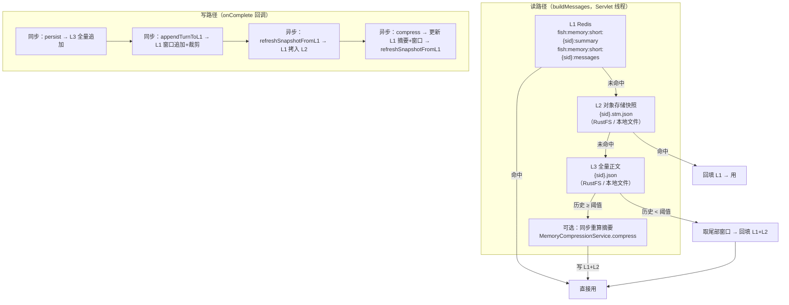
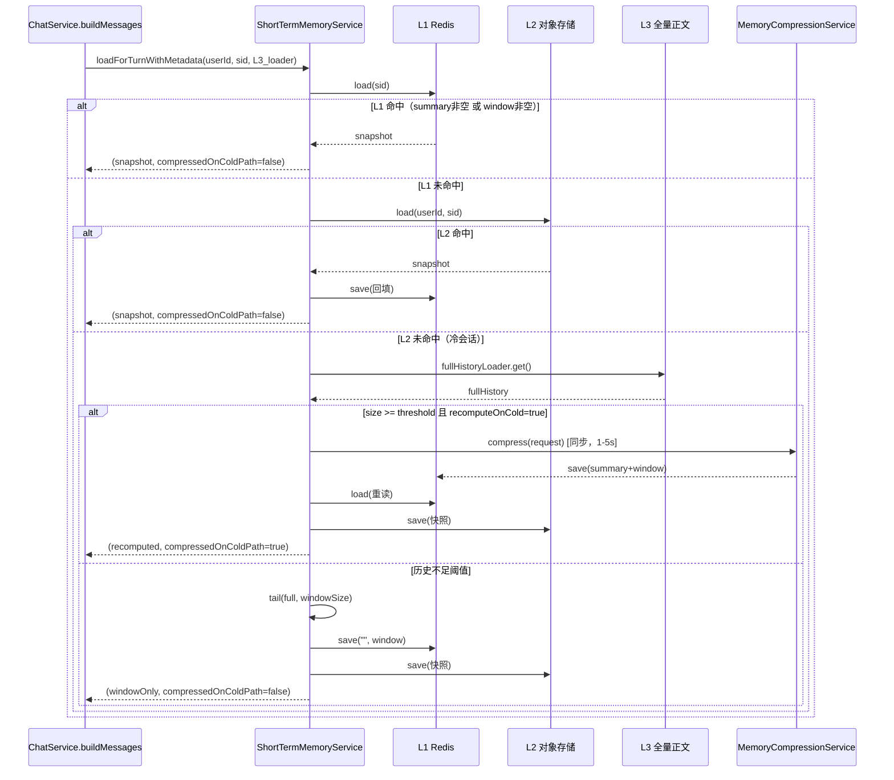
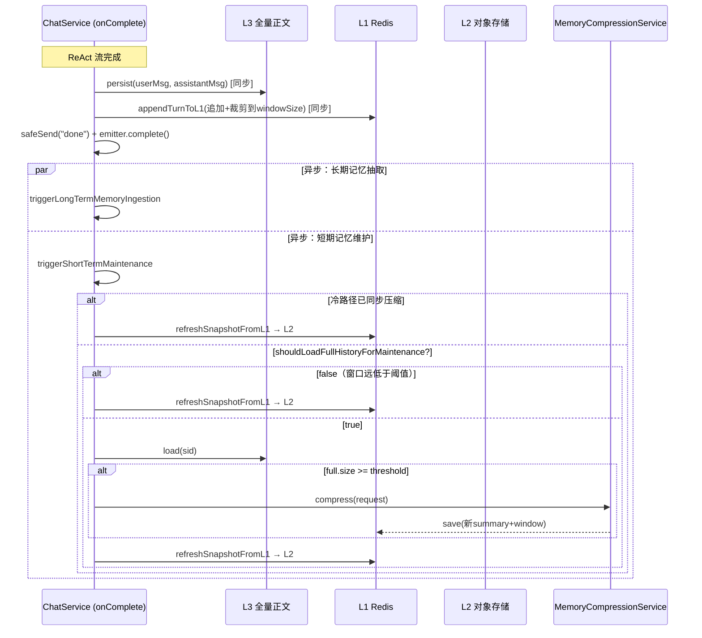

# Fish-Agent v3.1 短期记忆三级读穿写穿

> 项目路径：`D:\1_Backend\Fish-Agent`
> 覆盖版本：**v3.1**（在 [v3.0](v3.0-后端模块重构-20260512.md) 基线上完成：短期记忆从 Redis 单层扩展为 L1(Redis)→L2(对象存储快照)→L3(全量正文)三级结构，对话热路径只读 Redis）。
> 文档生成日期：**2026-06-01**

**分文档索引**

- [v3-全景文档](v3-全景文档-20260512.md) — v3 全景（含 v3.0 + v3.1 更新）
- [v3.0-后端模块重构](v3.0-后端模块重构-20260512.md) — v3.0 增量记录

---

## 一、v3.1 一句话增量

短期记忆从 Redis 单层扩展为 **L1(Redis 每轮主存) → L2(对象存储快照兜底) → L3(RustFS/文件全量正文)** 三级读穿写穿结构；对话热路径（首字）只读 Redis，对话结束后同步追加 L1 窗口、异步刷新 L2 快照与压缩摘要；Redis TTL 过期或不可用时从 L2/L3 自动回源。

---

## 二、重构动机

### 现状问题

1. **热路径每轮全量读 L3**：前 29 条消息时 Redis 为空（只在 ≥30 条压缩后才写入），`ChatService.buildMessages()` 每轮同步调用 `memoryStore.load(sid)` 从 RustFS/文件读取全量历史并 JSON 反序列化——延迟直接影响首字等待时间。
2. **TTL 过期摘要永久丢失**：Redis `shortTermTtlDays=30` 到期后 summary 和窗口消息被清除，无持久兜底，下次对话回退到全量历史窗口（无摘要）。
3. **对话结束后 L1 不可见**：原实现中 `appendTurnToL1` 不存在，L1 只在异步压缩时写入——如果用户在压缩完成前立刻发下一条消息，Redis 仍是旧数据。

### 目标

- 热路径**只读 Redis**（微秒级），不再每轮访问对象存储。
- Redis 失效时从 L2 快照自动回源并回填 L1。
- 每轮对话结束后**同步**把本轮消息写入 L1，保证下一轮立即可见。
- L2 快照持久保存，无 TTL，作为 Redis 的可靠兜底。

---

## 三、三级架构总览



---

## 四、读穿流程详解



---

## 五、写穿流程详解



---

## 六、新增文件与修改一览

### 新增文件

| 文件 | 说明 |
|------|------|
| `memory/shortterm/ShortTermSnapshotStore.java` | L2 快照存储 SPI（load/save/clear） |
| `memory/shortterm/RustFsShortTermSnapshotStore.java` | L2 RustFS 实现（key `{sid}.stm.json`，桶 `fish-chat`） |
| `memory/shortterm/FileShortTermSnapshotStore.java` | L2 文件兜底实现（`{historyDir}/{userId}/{sid}.stm.json`） |
| `memory/shortterm/ShortTermMemoryService.java` | 三级协调器（loadForTurn / appendTurnToL1 / refreshSnapshotFromL1 / clear） |
| `src/test/.../ShortTermMemoryServiceTest.java` | 协调器单测（10 个用例） |

### 修改文件

| 文件 | 变更 |
|------|------|
| `memory/config/MemoryProperties.java` | 新增内嵌 `SnapshotProperties`（enabled / recomputeOnCold） |
| `memory/shortterm/ShortTermMemoryStore.java` | 接口新增 `void clear(String sessionId)` |
| `memory/shortterm/RedisShortTermMemoryStore.java` | 实现 `clear`（删 summary + messages 两个 key） |
| `chat/ChatService.java` | 读路径走协调器、写路径拆同步/异步、`deleteSession` 联动清 L1+L2、删除无用字段和方法 |

---

## 七、关键设计决策

### 7.1 协调器返回 `ShortTermMemoryLoadResult` 而非裸 `Snapshot`

**问题**：冷路径同步压缩后，异步维护任务不知道本轮已压缩过，会重复读 L3 并再次调用 `compress`——浪费 1 次 LLM 调用。

**决策**：`loadForTurnWithMetadata` 返回 `record ShortTermMemoryLoadResult(snapshot, compressedOnColdPath)`。`ChatService` 将 `compressedOnColdPath` 传入异步维护任务，本轮只做 `refreshSnapshotFromL1`。

### 7.2 `shouldLoadFullHistoryForMaintenance` 避免不必要的 L3 读取

**问题**：原方案每轮异步维护都读 L3 全量历史（HTTP + JSON 全量反序列化），即使只有 5 条消息。

**决策**：新增 `shouldLoadFullHistoryForMaintenance(sid)` 方法——先读 L1，无摘要且窗口 < `threshold/2` 时跳过 L3 读取。默认 threshold=30 时，窗口 < 15 条即跳过。

### 7.3 L2 实现通过 `@ConditionalOnProperty` 互斥

| 配置 | 激活的 L2 实现 | 激活的 L3 实现 |
|------|---------------|---------------|
| `fish.rustfs.enabled=true`（默认） | `RustFsShortTermSnapshotStore` | `RustFsChatMemoryStore` |
| `fish.rustfs.enabled=false` | `FileShortTermSnapshotStore` | `UserScopedFileChatMemoryStore` |

两者 `@ConditionalOnProperty` 完全互补，运行时只有一个 L2 Bean。

### 7.4 `appendTurnToL1` 与异步 compress 的竞态为已知低风险

`appendTurnToL1` 是 L1 的 read-modify-write（load → 追加 → save），异步 compress 也写入 L1。极端情况下 `appendTurnToL1` 可能用旧 summary 覆盖刚写入的新 summary。

**接受理由**：影响范围仅"摘要最多回退一轮"，后续异步维护自修复。引入 Redis Lua 原子操作会耦合 L1 存储格式和协调器接口，当前规模不值得。

---

## 八、新增配置项

| 配置键 | 默认值 | 说明 |
|--------|--------|------|
| `fish.memory.snapshot.enabled` | `true` | 是否启用 L2 对象存储快照兜底 |
| `fish.memory.snapshot.recompute-on-cold` | `true` | 冷会话（L1+L2 均未命中）且历史达到阈值时，是否同步重算摘要（阻塞首字 1-5s） |

---

## 九、数据流变化对比

### 旧流程（v3.0 及之前）

```
每轮对话开始:
  ChatService.buildMessages()
    → memoryStore.load(sid)        ← 每轮全量读 L3（RustFS/文件）
    → shortTermMemoryStore.load(sid)
        → Redis 有数据 → 用
        → Redis 无数据 → 降级到文件历史尾部截取

对话结束:
    → persist(sid, ...)            ← 写 L3
    → triggerMemoryCompressionIfNeeded()
        → size >= 30?
            → async compress → Redis.save(summary + window)
```

### 新流程（v3.1）

```
每轮对话开始:
  ChatService.buildMessages()
    → shortTermMemoryService.loadForTurnWithMetadata(userId, sid, L3_loader)
        → L1(Redis) 命中 → 直接用（不读 L3）
        → L1 未命中 → L2(快照) 命中 → 回填 L1 → 用
        → L1+L2 均未命中 → L3_loader（仅在冷会话时调用）

对话结束:
    → persist(sid, ...)                            ← 同步写 L3
    → appendTurnToL1(sid, userMsg, assistantMsg)   ← 同步写 L1（下一轮立即可见）
    → triggerShortTermMaintenance(...)
        → 冷路径已压缩? → 只 refreshSnapshotFromL1（L1→L2）
        → 窗口远低于阈值? → 跳过 L3，只 refreshSnapshotFromL1
        → 否则 → 读 L3 → compress → refreshSnapshotFromL1
```

---

## 十、删除会话变化

```java
// 旧（v3.0）
public void deleteSession(String sessionId) {
    memoryStore.clear(sessionId);
}

// 新（v3.1）
public void deleteSession(String sessionId) {
    Long uid = UserContextHolder.currentUserIdOrNull();
    memoryStore.clear(sessionId);              // L3（含归属校验）
    shortTermMemoryService.clear(uid, sessionId); // L1 + L2
}
```

清理顺序：先 L3（含 `assertOwnedByCurrentUser` 归属校验），再 L1+L2。L3 校验失败则 L1/L2 不清理（保留过时数据比删除他人数据安全）。

---

## 十一、关联代码路径速查

| 职责 | 路径 |
|------|------|
| L1 SPI | `memory/shortterm/ShortTermMemoryStore.java` |
| L1 Redis 实现 | `memory/shortterm/RedisShortTermMemoryStore.java` |
| L2 SPI | `memory/shortterm/ShortTermSnapshotStore.java` |
| L2 RustFS 实现 | `memory/shortterm/RustFsShortTermSnapshotStore.java` |
| L2 文件兜底 | `memory/shortterm/FileShortTermSnapshotStore.java` |
| 三级协调器 | `memory/shortterm/ShortTermMemoryService.java` |
| 快照 record | `memory/shortterm/ShortTermMemorySnapshot.java` |
| 加载结果 record | `memory/shortterm/ShortTermMemoryService.java` 内 `ShortTermMemoryLoadResult` |
| 记忆压缩服务 | `memory/MemoryCompressionService.java`（未改动） |
| 对话编排（读穿+写穿） | `chat/ChatService.java` |
| 记忆配置 | `memory/config/MemoryProperties.java` |
| L3 RustFS 实现 | `chat/history/RustFsChatMemoryStore.java` |
| L3 文件实现 | `chat/history/UserScopedFileChatMemoryStore.java` |
| RustFS 服务 | `rag/service/RustFsService.java` |

---

## 十二、已知风险与可改进项

| 风险 | 影响 | 缓解措施 |
|------|------|---------|
| 冷路径同步重算阻塞首字 1-5s | 仅 L1+L2 均未命中且历史 ≥ 阈值时发生（老会话首访） | `fish.memory.snapshot.recompute-on-cold=false` 可关闭 |
| `appendTurnToL1` 与异步 compress 的 read-modify-write 竞态 | summary 最多回退一轮 | 下一轮异步维护自修复；未引入 Redis Lua |
| `shouldLoadFullHistoryForMaintenance` 多读一次 L1 | 一次 Redis GET（微秒级） | 相比避免的 L3 全量读，开销可忽略 |

---

_文档版本：**v3.1 增量** · 生成日期：2026-06-01 · 对应代码能力线：v1 → v1.3 → v2.0 ~ v2.6 → v3.0 → **v3.1**_
