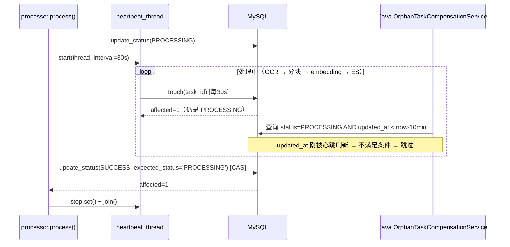
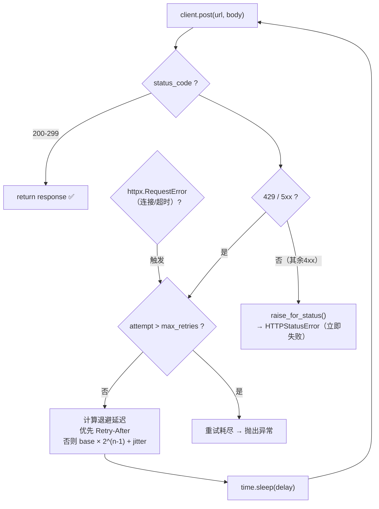

# Fish-Agent v3.2 Worker 心跳与 Embedding 重试

> 项目路径：`D:\1_Backend\Fish-Agent`
> 覆盖版本：**v3.2**（在 [v3.1](v3.1-短期记忆三级读穿写穿-20260601.md) 基线上完成：修复 Python Worker 两个 P0 缺陷——长任务被孤儿补偿误杀、Embedding 瞬时错误无重试）。
> 文档生成日期：**2026-06-01**
> 改动范围：**仅 Python Worker**（`python/fish_worker/**`），Java 侧零改动。

**分文档索引**

- [v3-全景文档](v3-全景文档-20260512.md) — v3 全景（含 v3.0 + v3.1 + v3.2 更新）
- [v3.1-短期记忆三级读穿写穿](v3.1-短期记忆三级读穿写穿-20260601.md) — v3.1 增量记录
- [v3.0-后端模块重构](v3.0-后端模块重构-20260512.md) — v3.0 增量记录

---

## 一、v3.2 一句话增量

Python Worker 新增**处理心跳**（定期刷新 MySQL `updated_at`，防止长任务被 Java 孤儿补偿误杀）+ **终态 CAS 写入**（`expected_status='PROCESSING'`，补偿抢先标 FAILED 时 Worker 不回写 SUCCESS）+ **CAS 落空后 ES 分片清理**（防幽灵切片）+ **Embedding HTTP 指数退避重试**（429/5xx/网络错误自动重试，400/401 立即失败）。

---

## 二、修复的两个 P0 缺陷

### P0-1：长任务被孤儿补偿误杀

**根因**：`processor.py` 只在开始时写一次 `update_status(PROCESSING)`，处理过程中不刷新 `updated_at`。Java `OrphanTaskCompensationService` 按 `status=PROCESSING AND updated_at < now - timeoutMinutes`（默认 10min）判孤儿。

**影响**：几百页 PDF 逐页 OCR（每页 1-3s）轻松超 10 分钟。Worker 仍在跑却被判孤儿 → ES 被删、MySQL 被标 FAILED → Worker 跑完又写 SUCCESS → MySQL 与 ES 不一致 → RAG 永久召回不到该文档。

**修复**：

| 层次 | 机制 | 说明 |
|------|------|------|
| 心跳 | `_heartbeat_loop` + `db.touch()` | 守护线程每 N 秒刷新 `updated_at`（仅 `status='PROCESSING'`），保持补偿判活 |
| 终态保护 | `update_status(SUCCESS, expected_status='PROCESSING')` | CAS 写入：补偿已抢先改 FAILED 时 rowcount=0，不回写 SUCCESS |
| 幽灵清理 | CAS 落空 → `delete_by_doc_id` | 已 bulk 写入的 ES 分片被删除，MySQL 终值为 FAILED |

### P0-3：Embedding 瞬时错误无重试

**根因**：`embedder.py` 中 `raise_for_status()` 直接抛异常 → 整任务 FAILED。大文档分多个 batch，任一遇到限流(429)/超时即全任务作废。

**修复**：

| 错误类型 | 行为 |
|---------|------|
| 429 / 500 / 502 / 503 / 504 | 指数退避重试（默认 3 次，上限 30s），尊重 `Retry-After` 头 |
| `httpx.RequestError`（连接/超时） | 同上，指数退避重试 |
| 400 / 401 / 403 等 | 立即失败，不重试 |
| 重试耗尽 | 抛出标准 `HTTPStatusError`，任务 FAILED |

---

## 三、心跳流程详解



### 竞态场景：补偿先于 Worker 完成

```mermaid
sequenceDiagram
    participant P as processor.process()
    participant HB as heartbeat_thread
    participant DB as MySQL
    participant COMP as Java OrphanTaskCompensationService
    participant ES as Elasticsearch

    Note over P: Worker 处理中，心跳正常运行
    COMP->>DB: 判定孤儿 → update_status(FAILED)
    HB->>DB: touch(task_id)
    DB-->>HB: affected=0（已非 PROCESSING）
    HB->>HB: 心跳退出

    Note over P: ES bulk 写入已完成
    P->>DB: update_status(SUCCESS, expected_status='PROCESSING') [CAS]
    DB-->>P: affected=0（当前状态已是 FAILED，CAS 不匹配）
    P->>ES: delete_by_doc_id(清理本次写入的切片)
    Note over P,DB,ES: MySQL 终值=FAILED，ES 无残留
```

---

## 四、Embedding 重试流程详解



**退避策略**：

```
delay = min(cap, base × 2^(attempt-1)) + random(0, 0.5)
```

| 尝试 | 基础延迟（base=1s） | 加抖动 |
|------|-------------------|--------|
| 第 1 次 | 1.0s | 1.0 ~ 1.5s |
| 第 2 次 | 2.0s | 2.0 ~ 2.5s |
| 第 3 次 | 4.0s | 4.0 ~ 4.5s |

如果响应带 `Retry-After` 头，优先使用其值（受 `backoff_max` 上限约束）。

---

## 五、新增与修改文件一览

### 修改文件

| 文件 | 变更 |
|------|------|
| `python/fish_worker/config.py` | 新增 4 个配置项：心跳间隔、重试次数、退避基数、退避上限 |
| `python/fish_worker/db/mysql.py` | `update_status` 增加 `expected_status` CAS + 返回 rowcount；新增 `touch()` 和 `close_current_thread_conn()` |
| `python/fish_worker/processor.py` | 新增心跳线程 + `_mark_success` 统一 CAS 写入 + ES 兜底清理 |
| `python/fish_worker/chunker/embedder.py` | 新增 `_post_with_retry` + `_retry_delay` + `_RetryableHttpStatus` |

### 新增文件

| 文件 | 说明 |
|------|------|
| `python/tests/test_embedder_retry.py` | Embedding 重试测试（429 重试成功、400 不重试、网络错误重试） |
| `python/tests/test_mysql_repository.py` | MySQL CAS/touch/连接关闭测试 |
| `python/tests/test_processor_cas.py` | Processor 终态 CAS 失败后 ES 清理测试 |

### 配置/文档更新

| 文件 | 变更 |
|------|------|
| `python/.env.example` | 新增 4 个 Worker 配置变量及注释 |
| `python/README.md` | 补充心跳机制与重试机制说明 |

---

## 六、新增配置项

| 环境变量 | 默认值 | 说明 |
|---------|--------|------|
| `FISH_WORKER_HEARTBEAT_SECONDS` | `30` | 心跳刷新间隔（秒）。须远小于 Java `fish.knowledge.compensation.timeout-minutes`（默认 600） |
| `FISH_WORKER_EMBED_MAX_RETRIES` | `3` | Embedding 单次 POST 最大重试次数（不含首次） |
| `FISH_WORKER_EMBED_BACKOFF_BASE` | `1.0` | 指数退避基数（秒） |
| `FISH_WORKER_EMBED_BACKOFF_MAX` | `30.0` | 单次退避上限（秒） |

---

## 七、关键设计决策

### 7.1 心跳失败不杀主流程

心跳 `touch()` 抛异常时只记 warn，不终止处理。理由：MySQL 短暂抖动不应杀死已跑了几分钟的 OCR / embedding。最终一致性由终态 CAS + ES 清理兜底。

### 7.2 FAILED 写入不加 CAS

终态→终态重写幂等无害。如果 Worker 在 `except` 中写 FAILED 时 MySQL 已是 FAILED（被补偿抢先），重写仍然是 FAILED，不会产生数据不一致。

### 7.3 不引入 tenacity 等第三方重试库

手写 `_post_with_retry` 约 30 行，不新增依赖，行为可被单元测试精确覆盖。重试逻辑与 embedding 逻辑内聚在同一个类中。

### 7.4 心跳与补偿超时的约束关系

心跳间隔（默认 30s）须远小于 Java 侧补偿超时（默认 10min）。Python 侧读不到 Java 的 `fish.knowledge.compensation.timeout-minutes`，仅在 `.env.example` 和 README 中注明约束。如果 Java 侧缩短补偿超时，需同步调整心跳间隔。

---

## 八、数据一致性保障矩阵

| 场景 | MySQL 终值 | ES 状态 | 机制 |
|------|-----------|---------|------|
| 正常完成（无补偿介入） | SUCCESS | 完整切片 | 心跳保持活 → CAS 成功 → 不触发清理 |
| Worker 中途崩溃 | FAILED（补偿写入） | 空（补偿清理） | 心跳停止 → 补偿超时 → 补偿标 FAILED + 清 ES |
| Worker 完成，但补偿抢先标 FAILED | FAILED（补偿写入） | 空（CAS 落空后清理） | CAS rowcount=0 → 不回写 SUCCESS → delete_by_doc_id |
| Worker 完成，但 CAS 前心跳已退出 | 取决于时序 | 一致 | 心跳 `touch` 返回 0 时不影响主流程，CAS 做最终判断 |

---

## 九、测试覆盖

| 测试文件 | 用例数 | 覆盖内容 |
|---------|--------|---------|
| `test_embedder_retry.py` | 3 | 429 重试成功、400 不重试、网络错误重试 |
| `test_mysql_repository.py` | 3 | CAS 条件写入、touch 仅更新 PROCESSING 行、连接关闭 |
| `test_processor_cas.py` | 1 | 终态 CAS 失败后 ES 清理（含幂等 delete + 兜底 delete） |

验证命令：

```bash
python -m unittest discover -s tests    # Ran 7 tests ... OK
python -m compileall fish_worker tests  # 无语法错误
```

---

## 十、已知限制与后置项

| 项目 | 说明 | 优先级 |
|------|------|--------|
| DashScope HTTP 200 + body.code 限流 | 当前不识别为可重试，直接 FAILED | 后置增强 |
| 重试日志未透传 task_id | embedder 无 task_id 上下文，改动略大 | 后置 |
| 批次间 throttle | embedding batch 间无限速，高频可能触发限流 | 后置 |
| `_RetryableHttpStatus` 重试耗尽后不可达 raise | `e.response.raise_for_status()` 必定抛异常，后续 `raise` 不可达；功能无误，建议清理 | 小改进 |

---

_文档版本：**v3.2 增量** · 生成日期：2026-06-01 · 对应代码能力线：v1 → v1.3 → v2.0 ~ v2.6 → v3.0 → v3.1 → **v3.2**_
