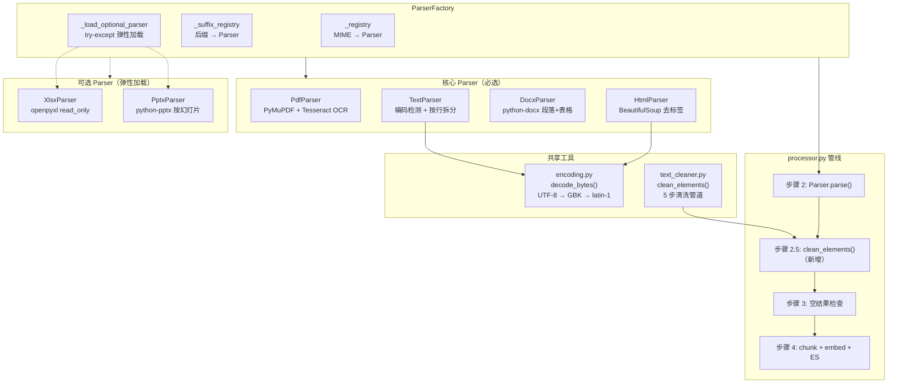
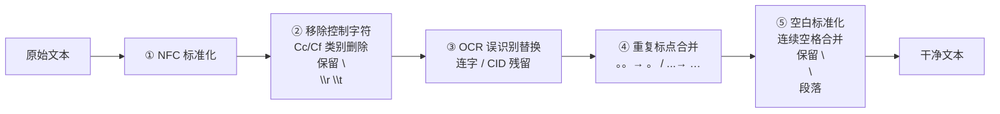
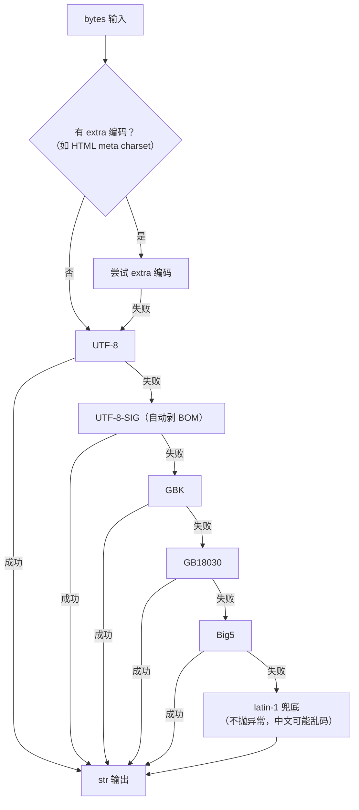

# Fish-Agent v3.3 多格式文档解析 + OCR 文本清洗

> 项目路径：`D:\1_Backend\Fish-Agent`
> 覆盖版本：**v3.3**（在 [v3.2](v3.2-Worker心跳与embedding重试-20260601.md) 基线上完成：扩展 Python Worker 支持 6 种新文档格式 + OCR 输出文本统一清洗管道）。
> 文档生成日期：**2026-06-04**
> 改动范围：**仅 Python Worker**（`python/fish_worker/parser/**` + `processor.py`），Java 侧零改动。

**分文档索引**

- [v3-全景文档](v3-全景文档-20260512.md) — v3 全景（含 v3.0 ~ v3.3 更新）
- [v3.2-Worker心跳与embedding重试](v3.2-Worker心跳与embedding重试-20260601.md) — v3.2 增量记录
- [v3.1-短期记忆三级读穿写穿](v3.1-短期记忆三级读穿写穿-20260601.md) — v3.1 增量记录
- [v3.0-后端模块重构](v3.0-后端模块重构-20260512.md) — v3.0 增量记录

---

## 一、v3.3 一句话增量

Python Worker 新增 **6 种文档格式解析**（txt / md / docx / html / xlsx / pptx，每种格式独立 Parser + 工厂注册）+ **共享编码探测工具**（UTF-8 / BOM / GBK / GB18030 等中文编码自动检测）+ **OCR 输出文本统一清洗管道**（NFC 标准化 / 控制字符移除 / OCR 误识别替换 / 重复标点合并 / 空白标准化，在 processor 层对全格式统一执行），下游 chunker / embedder / ES 写入零改动。

---

## 二、解决的两个问题

### 问题 1：只支持 PDF，其他格式上传即失败

**根因**：`ParserFactory._registry` 仅注册 `application/pdf`，用户上传 txt / md / docx 等文件时 Worker 抛 `UnsupportedFileTypeError`，任务标记 FAILED。

**修复**：新增 6 个独立 Parser，继承 `BaseParser`，在工厂注册对应 MIME 类型 + 后缀推断。所有 Parser 输出统一的 `list[RawElement]`，下游完全无感。

### 问题 2：OCR 输出仍含乱码符号

**根因**：Tesseract OCR 对数学符号（∑、∫）、特殊标点、表格区域、中英混排边界偶有误识别。输出中存在不可见控制字符、零宽字符、排版连字（fi/fl）、连续重复标点、PyMuPDF CID 残留（如 `(cid:1339)`）。

**修复**：新增无状态纯函数清洗模块 `text_cleaner.py`，在 `processor.py` 解析后、分块前统一执行 5 步清洗管道。

---

## 三、架构变化

### 3.1 解析管线对比

```
v3.2（改动前）：
  MinIO → PdfParser(OCR) → chunk → embed → ES
               ↑ 唯一支持格式

v3.3（改动后）：
  MinIO → ParserFactory → {Pdf|Text|Docx|Html|Xlsx|Pptx}Parser
                                    ↓
                            clean_elements（新增清洗管道）
                                    ↓
                              chunk → embed → ES
```

### 3.2 新增文件架构



---

## 四、流程详解

### 4.1 多格式解析流程

```mermaid
sequenceDiagram
    participant PROC as processor.process()
    participant FACT as ParserFactory
    participant PAR as {Format}Parser
    participant CLEAN as text_cleaner
    participant CHUNK as chunk_elements

    PROC->>FACT: get(content_type, filename)
    alt MIME 直接匹配
        FACT-->>PROC: 对应 Parser 实例
    else MIME = octet-stream
        FACT->>FACT: 从 filename 后缀推断
        FACT-->>PROC: 推断的 Parser 实例
    else 完全无法识别
        FACT-->>PROC: UnsupportedFileTypeError → FAILED
    end

    PROC->>PAR: parse(content, filename)
    alt PDF
        PAR->>PAR: PyMuPDF 渲染 300 DPI → Tesseract OCR
    else txt / md
        PAR->>PAR: decode_bytes() 编码检测 → 按行拆分
    else docx
        PAR->>PAR: python-docx 提取段落 + 标题样式 + 表格
    else html
        PAR->>PAR: BeautifulSoup 去标签 + 语义提取 + 去重
    else xlsx
        PAR->>PAR: openpyxl read_only 按行提取
    else pptx
        PAR->>PAR: python-pptx 按幻灯片提取文本框
    end
    PAR-->>PROC: list[RawElement]

    PROC->>CLEAN: clean_elements(elements)
    CLEAN->>CLEAN: NFC / 控制字符 / OCR替换 / 标点合并 / 空白标准化
    CLEAN-->>PROC: 清洗后的 list[RawElement]

    PROC->>CHUNK: chunk_elements(cleaned)
```

### 4.2 OCR 文本清洗管道



### 4.3 编码探测策略



---

## 五、新增与修改文件一览

### 新增文件

| 文件 | 说明 |
|------|------|
| `python/fish_worker/parser/text_cleaner.py` | OCR / 提取文本 5 步清洗管道（纯函数，零依赖） |
| `python/fish_worker/parser/encoding.py` | 共享编码探测 `decode_bytes()`（UTF-8 → 中文编码 → latin-1） |
| `python/fish_worker/parser/text_parser.py` | txt / md 解析器（编码自动检测 + 按行拆分） |
| `python/fish_worker/parser/docx_parser.py` | .docx 解析器（python-docx，毫秒级，不走 OCR） |
| `python/fish_worker/parser/html_parser.py` | .html 解析器（BeautifulSoup 去标签 + 语义提取 + 嵌套去重） |
| `python/fish_worker/parser/xlsx_parser.py` | .xlsx 解析器（openpyxl read_only 流式读取） |
| `python/fish_worker/parser/pptx_parser.py` | .pptx 解析器（python-pptx 按幻灯片提取） |
| `python/tests/test_text_cleaner.py` | 清洗管道 7 个用例（5 步 + 端到端 + clean_elements） |
| `python/tests/test_text_parser.py` | TextParser 编码检测、空文件、中英文 |
| `python/tests/test_docx_parser.py` | DocxParser 段落、标题样式、表格 |
| `python/tests/test_html_parser.py` | HtmlParser 语义标签、script 过滤、编码、去重 |
| `python/tests/test_xlsx_parser.py` | XlsxParser 非空行提取 |
| `python/tests/test_pptx_parser.py` | PptxParser 幻灯片文本 + 页码 |
| `python/tests/test_factory.py` | ParserFactory MIME 分派 + 后缀推断 + 可选模块缺失 + 恢复验证 |

### 修改文件

| 文件 | 变更 |
|------|------|
| `python/fish_worker/parser/factory.py` | `_registry` 注册 6 种新 MIME；`_suffix_registry` 后缀推断表；`_load_optional_parser()` 弹性加载可选 Parser |
| `python/fish_worker/processor.py` | 顶部 import `clean_elements`；步骤 2 之后插入步骤 2.5 统一清洗 |
| `python/requirements.txt` | 新增 `python-docx`、`beautifulsoup4`、`lxml`、`openpyxl`、`python-pptx` |

### 明确不改

| 文件 | 原因 |
|------|------|
| `parser/base.py` | `BaseParser` / `RawElement` 接口不变 |
| `parser/pdf.py` | OCR 逻辑不变 |
| `chunker/text_chunker.py` | 下游输入仍是 `list[RawElement]` |
| `chunker/embedder.py` | 不涉及 |
| `storage/elasticsearch.py` | 不涉及 |
| `db/mysql.py` | 不涉及 |
| `consumer.py` | 不涉及 |
| `Dockerfile` | 所有新依赖是纯 Python 包，pip install 即可 |
| Java 后端 / 前端 | 上传逻辑不变，`KnowledgeUpload.vue` 已 `accept="*/*"` |

---

## 六、格式支持详情

### 6.1 格式矩阵

| 格式 | MIME | 解析库 | 依赖方式 | 页码 | element_type |
|------|------|--------|---------|------|-------------|
| `.pdf` | `application/pdf` | PyMuPDF + Tesseract | 必选（OCR） | ✅ 有 | Text |
| `.txt` | `text/plain` | 内置 `str.decode` | 零依赖 | ❌ None | Text |
| `.md` | `text/markdown` | 内置 `str.decode` | 零依赖 | ❌ None | Text |
| `.docx` | `application/vnd.openxmlformats-officedocument.wordprocessingml.document` | python-docx | 必选 | ❌ None | Text / Title / Table |
| `.html` | `text/html` | BeautifulSoup + lxml | 必选 | ❌ None | Text / Title |
| `.xlsx` | `application/vnd.openxmlformats-officedocument.spreadsheetml.sheet` | openpyxl | 可选 | ❌ None | Table |
| `.pptx` | `application/vnd.openxmlformats-officedocument.presentationml.presentation` | python-pptx | 可选 | ✅ 有 | Text |

### 6.2 依赖清单

```
# v4.0 多格式解析（requirements.txt 新增）
python-docx>=1.1          # .docx
beautifulsoup4>=4.12      # .html
lxml>=5.0                 # HTML 解析后端
openpyxl>=3.1             # .xlsx（可选）
python-pptx>=1.0          # .pptx（可选）
```

### 6.3 不在支持范围

| 格式 | 原因 |
|------|------|
| `.doc`（旧版二进制 Word） | 需 antiword / LibreOffice 转换，复杂度过高。建议用户先转 `.docx` |
| `.pdf`（文字提取模式） | 经过三代库迭代（pypdf → pdfminer → OCR），直接文本提取的乱码问题无法可靠解决，统一走 OCR |

---

## 七、清洗管道详解

### 7.1 五步管道

| 步骤 | 函数 | 输入示例 | 输出 |
|------|------|---------|------|
| ① NFC 标准化 | `normalize_unicode` | `"é"` | `"é"` |
| ② 控制字符移除 | `remove_control_chars` | `"a\x00b​c\n"` | `"abc\n"` |
| ③ OCR 误识别替换 | `fix_common_ocr_errors` | `"file(cid:9)flow"` | `"fileflow"` |
| ④ 重复标点合并 | `collapse_punctuation` | `"好。。。wait...."` | `"好。wait…"` |
| ⑤ 空白标准化 | `normalize_whitespace` | `"a   b\n\n\n\npara2"` | `"a b\n\npara2"` |

### 7.2 OCR 替换表（保守策略）

```python
_OCR_FIXES = [
    (r"fi", "fi"),          # 排版连字
    (r"fl", "fl"),
    (r"ff", "ff"),
    (r"ffi", "ffi"),
    (r"ffl", "ffl"),
    (r"\(cid:\d+\)", ""),   # PyMuPDF CID 残留
]
```

**设计原则**：仅包含经过验证的安全替换。高风险映射（如 `〇→O`、`⼀→-`）默认不启用——这些字符在正常文本中也会出现，强行替换会误伤正文。新增规则须有真实 OCR 误识别证据并加注释说明来源。

### 7.3 调用位置

清洗在 `processor.py` 步骤 2（解析）之后、步骤 3（空结果检查）之前统一执行：

```python
# processor.py process() 方法
elements = parser.parse(content, filename, tmp_dir=tmp_root)

# ---- 步骤 2.5: 文本清洗（对所有格式的解析结果统一执行）----
elements = clean_elements(elements)

# ---- 步骤 3: 空结果处理 ----
if not elements: ...
```

**设计理由**：清洗集中在 processor 层而非各 Parser 内部，保证：
- 所有格式（含未来新增的）自动受益，无需在各 Parser 中重复调用
- 清洗逻辑单点维护，修改一处全局生效
- 清洗后全部为空的文档自然落入既有步骤 3 空结果分支，标记 `SUCCESS + chunk_count=0`

---

## 八、关键设计决策

### 8.1 格式专用 Parser 而非统一转换器

**不选**：所有文件先转 PDF 再走 OCR（LibreOffice headless 方案）。

**理由**：
- txt / md 是纯文本，做 OCR 完全是浪费（毫秒级 vs 秒级）
- LibreOffice headless Docker 镜像增加约 800MB+
- LibreOffice 转换本身不稳定（复杂文档可能崩溃）
- `BaseParser` + `ParserFactory` 的工厂架构天然支持逐格式扩展

### 8.2 延迟 import 第三方库

docx / html / xlsx / pptx 的第三方库在 `parse()` 方法内 import（如 `from docx import Document`），确保：
- 未安装可选依赖时不影响其他 Parser 启动
- `ParserFactory` 的 top-level import 不会因依赖缺失而失败

### 8.3 可选 Parser 弹性加载

`xlsx_parser` / `pptx_parser` 通过 `_load_optional_parser()` 加载，使用 `importlib.import_module` + `try-except ImportError`：
- 模块存在 → 正常注册到 `_registry` 和 `_suffix_registry`
- 模块缺失 → 返回 `None`，不注册，不影响其他格式

### 8.4 清洗管道纯函数设计

`text_cleaner.py` 无类、无全局可变状态，所有函数输入 `str` 输出 `str`。理由：
- 便于单元测试（每个步骤独立可测）
- 便于复用（不依赖实例状态）
- `clean_elements` 创建新 `RawElement` 对象而非修改原有，避免副作用

### 8.5 HtmlParser 嵌套去重

`<li><p>text</p></li>` 等 HTML 嵌套结构中，`soup.find_all()` 会同时匹配外层和内层标签，导致同一文本出现两次。解决方案：`_dedupe()` 方法按 `text` 内容去重，保留首次出现。

### 8.6 编码探测顺序

候选编码列表：`utf-8-sig → utf-8 → gbk → gb2312 → gb18030 → big5 → latin-1`

- `utf-8-sig` 排在 `utf-8` 前面：BOM 文件需 `utf-8-sig` 正确剥离；无 BOM 文件用 `utf-8-sig` 解码等价于 `utf-8`，无副作用
- `gbk` → `gb18030`：GBK 是 GB18030 的子集，先尝试 GBK 速度略快；GB18030 是 GBK 的超集，覆盖更多罕见字符
- `latin-1` 兜底：不会抛异常，但中文会是乱码——覆盖绝大多数中文场景的前 6 个编码已足够

---

## 九、新增配置项

**无。** 本版本不新增环境变量，零配置即可使用。新增依赖通过 `pip install -r requirements.txt` 安装，Dockerfile 无需修改。

---

## 十、测试覆盖

| 测试文件 | 用例数 | 覆盖内容 |
|---------|--------|---------|
| `test_text_cleaner.py` | 7 | NFC 标准化 / 控制字符 / OCR 替换 / 标点合并 / 空白标准化 / 端到端 / clean_elements 元数据保留 |
| `test_text_parser.py` | 3 | UTF-8 BOM / GBK 中文 / 空文件 |
| `test_docx_parser.py` | 1 | 标题样式 + 普通段落 + 表格行 |
| `test_html_parser.py` | 3 | 语义标签 + script/style 过滤 / GBK charset 探测 / 无标签回退 |
| `test_xlsx_parser.py` | 1 | 非空行提取 + 空行跳过 |
| `test_pptx_parser.py` | 1 | 幻灯片文本 + 页码 |
| `test_factory.py` | 4 | MIME 分派 / octet-stream 后缀推断 / 不支持类型抛异常 / 可选模块缺失模拟+恢复 |
| `test_processor_cas.py` | +2 | 清洗在分块前执行（脏文本→干净文本）/ 清洗清空所有元素→SUCCESS |

验证命令：

```bash
python -m unittest discover -s tests    # Ran 29 tests ... OK
python -m compileall fish_worker tests  # 无语法错误
```

---

## 十一、已知限制与后置项

| 项目 | 说明 | 优先级 |
|------|------|--------|
| 编码检测非 100% 可靠 | `decode_bytes` 最终 latin-1 兜底不抛异常，特殊编码中文可能仍乱码。已用 GBK/GB18030 覆盖绝大多数中文场景；如需更强可引入 `charset-normalizer` | 后置增强 |
| `.doc` 旧版 Word 不支持 | 需 antiword / LibreOffice 转换，复杂度过高 | 不计划支持 |
| OCR 替换表需持续维护 | `_OCR_FIXES` 是经验性的，应按实际 OCR 错误模式增补。`clean_elements` 已内置 DEBUG 级日志记录清洗为空的元素 | 持续优化 |
| 大 HTML 文件内存压力 | BeautifulSoup 对超大 HTML 有内存压力，但文档上传场景通常可控 | 低 |
| PDF 混合提取策略 | 先尝试直接文本提取 → 检测乱码 → 回退 OCR。文字型 PDF 可获得完美文本并大幅提速 | v3.4 候选 |

---

_文档版本：**v3.3 增量** · 生成日期：2026-06-04 · 对应代码能力线：v1 → v1.3 → v2.0 ~ v2.6 → v3.0 → v3.1 → v3.2 → **v3.3**_
