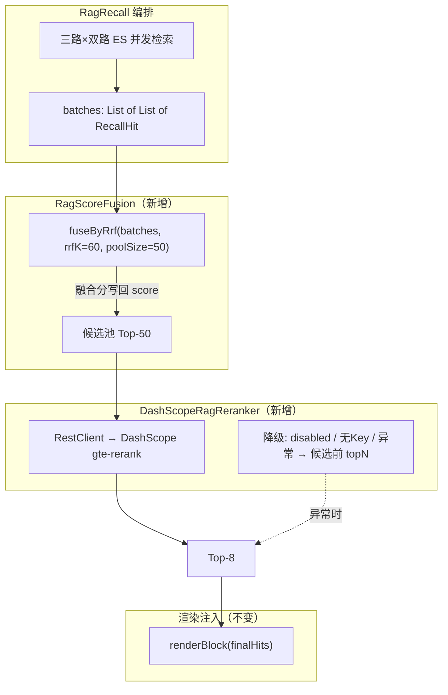

# Fish-Agent v3.4 RAG 检索重排序（RRF 融合 + DashScope Rerank）

> 项目路径：`D:\1_Backend\Fish-Agent`
> 覆盖版本：**v3.4**（在 [v3.3](v3.3-多格式解析与OCR清洗-20260604.md) 基线上完成：RAG 检索链路插入 RRF 分数融合与 DashScope Cross-Encoder 精排两阶段，解决 BM25/cosine 分数不可比 + 无精排 + 候选池过小三个精度问题）。
> 文档生成日期：**2026-06-05**
> 改动范围：**仅 Java 后端 `rag/pipeline/` + `rag/config/`**（新增 fusion / rerank 组件，改造 RagRecall 编排接缝），Python Worker / 前端 / ES mapping 零改动。

**分文档索引**

- [v3-全景文档](v3-全景文档-20260512.md) — v3 全景（含 v3.0 ~ v3.4 更新）
- [v3.3-多格式解析与OCR清洗](v3.3-多格式解析与OCR清洗-20260604.md) — v3.3 增量记录
- [v3.2-Worker心跳与embedding重试](v3.2-Worker心跳与embedding重试-20260601.md) — v3.2 增量记录
- [v3.1-短期记忆三级读穿写穿](v3.1-短期记忆三级读穿写穿-20260601.md) — v3.1 增量记录
- [v3.0-后端模块重构](v3.0-后端模块重构-20260512.md) — v3.0 增量记录

---

## 一、v3.4 一句话增量

在 RAG 检索链路「三路双路并发召回」与「渲染注入」之间，插入 **RRF（Reciprocal Rank Fusion）分数融合**（统一 BM25 与 cosine 不可比的原始分数为排名制）+ **DashScope Cross-Encoder Rerank 精排**（50 条候选池 → `gte-rerank` API → Top-8 注入），同时将初检索 `per-subquery-size` 从 5 扩大到 10、`knn-num-candidates` 从 80 扩大到 120，为 Reranker 提供更充足的候选。所有新增阶段均可开关、失败自动降级，零配置复用 `DASHSCOPE_API_KEY`。

---

## 二、解决的三个问题

### 问题 1：BM25 与 cosine 分数不可比

**根因**：`RagRecall` 将三路双路（文本 BM25 + 向量 cosine）的检索结果按 ES 原始 `_score` 直接排序截断。BM25 分数通常在 0~15+，cosine 相似度在 0~1.0，两者不在同一尺度——文本路的高 BM25 分主导排序，向量路的语义匹配被压到后面。

**表现**：用户问"如何容器化部署"，向量路能召回包含"Docker Compose 最佳实践"的语义相关文档（cosine 0.87），但文本路一个恰好包含"部署"关键词的低相关文档（BM25 3.2）排在前面，Top-8 截断时语义匹配被丢掉。

**修复**：引入 RRF 分数融合——不看原始分数，只看各路组内排名，`score = Σ 1/(k + rank + 1)`，将不同尺度的多路结果统一到同一排名制。

### 问题 2：没有精排阶段

**根因**：初检索用 bi-encoder（embedding）求快但精度有限——只看 query 和 document 各自的 embedding 距离，不交互计算。业界 RAG 标准做法是三阶段：初检索（bi-encoder）→ 重排序（cross-encoder）→ 截断注入。

**修复**：引入 DashScope `gte-rerank` Cross-Encoder 精排——将 query 和每个候选文档拼在一起过一遍模型，捕捉词级别的交互关系，精度显著高于 bi-encoder。50 条候选 → 精排 → Top-8 注入。

### 问题 3：初检索候选池过小

**根因**：`per-subquery-size=5`，3 索引 × 2 路 × 5 = 最多 30 条候选，去重后可能只剩 15~20 条。真正相关的文档如果在初检索时排名 25，根本进不了候选池。

**修复**：`per-subquery-size` 扩大到 10、`knn-num-candidates` 扩大到 120，初检索最大候选 60 条/子查询，融合后候选池 50 条，喂给 Reranker 充分精排。

---

## 三、架构变化

### 3.1 检索管线对比

```
v3.3（改动前）：
  用户消息 → [可选重写] → [查询扩展] → 三路×双路 ES 并发检索
                                              ↓
                                         按 _score 合并去重
                                              ↓
                                      Top-8 截断 → 注入 SystemMessage

v3.4（改动后）：
  用户消息 → [可选重写] → [查询扩展] → 三路×双路 ES 并发检索
                                              ↓
                                       RRF 分数融合 ← 新增
                                              ↓
                                      候选池 Top-50 ← 扩大
                                              ↓
                                    DashScope Rerank API ← 新增
                                              ↓
                                      Top-8 截断 → 注入 SystemMessage
```

### 3.2 新增文件架构



---

## 四、新增与修改文件一览

### 新增文件

| 文件 | 说明 |
|------|------|
| `rag/pipeline/fusion/RagScoreFusion.java` | RRF 分数融合，无状态纯函数 |
| `rag/pipeline/rerank/RagReranker.java` | 精排接口，单一方法 `rerank(query, candidates, topN)` |
| `rag/pipeline/rerank/DashScopeRagReranker.java` | DashScope `gte-rerank` 实现 + 三级降级 |
| `src/test/.../fusion/RagScoreFusionTest.java` | RRF 融合 4 个单测 |
| `src/test/.../rerank/RagRerankerTest.java` | Reranker 精排 + 降级 6 个单测 |

### 修改文件

| 文件 | 变更 |
|------|------|
| `rag/pipeline/recall/RagRecall.java` | 抽出 `dedupKey()` 供融合复用；`DefaultAugmentation` 增加 `RagReranker` 依赖；`buildAugmentation` 接缝改造为 RRF → Rerank → renderBlock |
| `rag/config/RagProperties.java` | 新增嵌套 `Fusion` / `Rerank` 配置类；`Recall.perSubquerySize` 5→10、`knnNumCandidates` 80→120 |
| `rag/pipeline/recall/RagRecallConfiguration.java` | 注册 `RagReranker` Bean，注入 `DefaultAugmentation` |
| `src/main/resources/application.yml` | 新增 `fish.rag.fusion.*` / `fish.rag.rerank.*`，调整 `recall` 默认值 |

### 明确不改

| 文件 | 原因 |
|------|------|
| 三个 Searcher | 检索逻辑不变，只是多取几条 |
| RagQueryRewrite / RagQueryExpand | 查询处理不变 |
| Python Worker | 不涉及 |
| ES mapping | 不涉及 |
| 前端 | 不涉及 |

---

## 五、方案详解

### 5.1 RRF 分数融合（RagScoreFusion）

**原理**：Reciprocal Rank Fusion 不看原始分数，只看排名。对每路结果按 `_score` 降序排列后，组内排名 `rank` 从 0 开始，融合分 `= Σ 1/(k + rank + 1)`，其中 k=60 是标准常数。跨组求和后统一排序。

**为什么选 RRF 而不是线性加权**：线性加权需要先做 min-max 归一化，但 BM25 分数长尾分布，min-max 会把大多数文档压到 0 附近；RRF 只依赖排名，对分数分布不敏感，鲁棒性更好。

**实现要点**：

- 无状态纯函数，输入 `List<List<RecallHit>>`，输出融合排序后的候选列表
- 去重 key 复用 `RagRecall.dedupKey()`（优先 id，否则 content hash），与旧 `mergeByMaxScore` 保持一致
- 同一文档跨多路时，代表命中保留原始 score 最高的一条（保留最佳 content）
- 融合分写回 `RecallHit.score()` 字段

**配置项**：

| 配置 | 默认值 | 说明 |
|------|--------|------|
| `fish.rag.fusion.enabled` | `true` | 融合开关；false 时回退旧 `mergeByMaxScore` |
| `fish.rag.fusion.rrf-k` | `60` | RRF 常数 k（标准值，一般不调） |
| `fish.rag.fusion.candidate-pool-size` | `50` | 融合后候选池大小（喂给 Reranker） |

### 5.2 DashScope Rerank 精排（DashScopeRagReranker）

**选型对比**：

| 方案 | 精度 | 延迟 | 部署成本 | 中文支持 | 生态契合度 |
|------|------|------|---------|---------|-----------|
| DashScope Rerank API（采用） | 高（中文优化） | 200~400ms（50条） | 零（SaaS） | 原生 | ⭐ 共用 API Key |
| BGE-reranker 本地 | 高 | 50~200ms | 需 GPU | 好 | 中 |
| Cohere Rerank | 高 | 200~400ms | 零（SaaS） | 一般 | 低（海外） |
| 不做 Rerank | 中 | 零 | 零 | — | — |

**选择 DashScope 的理由**：项目已用 DashScope 做 embedding，Rerank 共用同一 API Key，零额外配置；`gte-rerank` 对中文原生优化；SaaS 零部署。

**实现要点**：

- `RagReranker` 接口 + `DashScopeRagReranker` 实现分离，便于后续替换
- `RestClient` 在构造时创建一次并复用，非每次调用重建
- 包私有双参构造器 `DashScopeRagReranker(RagProperties, RestClient)` 供测试注入 mock
- 响应解析 `reorderByResults` 为静态方法，可脱离 HTTP 单测
- 编排层**始终**调用 `reranker.rerank(...)`，所有降级集中在实现内部

**降级策略（三级）**：

| 条件 | 行为 |
|------|------|
| `rerank.enabled=false` 或 `apiKey` 为空 | 返回候选池前 topN，不调 HTTP |
| Rerank API 调用失败 + `fallback-on-error=true` | 记 WARN 日志，返回候选池前 topN |
| Rerank API 调用失败 + `fallback-on-error=false` | 向上抛出 `RuntimeException` |
| Rerank 返回空结果或 reorder 后全空 | 返回候选池前 topN |

**配置项**：

| 配置 | 默认值 | 说明 |
|------|--------|------|
| `fish.rag.rerank.enabled` | `true` | Rerank 开关 |
| `fish.rag.rerank.model` | `gte-rerank` | DashScope Rerank 模型名 |
| `fish.rag.rerank.top-n` | `8` | 精排后保留条数 |
| `fish.rag.rerank.timeout-seconds` | `5` | API 调用超时 |
| `fish.rag.rerank.fallback-on-error` | `true` | 失败时降级 |
| `fish.rag.rerank.base-url` | `https://dashscope.aliyuncs.com` | DashScope 根地址 |
| `fish.rag.rerank.api-key` | `${DASHSCOPE_API_KEY:}` | 复用已有 Key |

### 5.3 初检索召回量扩大

| 配置 | 改动前 | 改动后 | 说明 |
|------|--------|--------|------|
| `recall.per-subquery-size` | 5 | **10** | 每条子查询每路多取一倍 |
| `recall.knn-num-candidates` | 80 | **120** | HNSW 候选集扩大 |

扩大后理论最大候选：10 条/路 × 6 路 = 60 条/子查询，融合后取 Top-50 喂给 Reranker。ES 负载增加可忽略（分页和 HNSW 遍历开销极小）。

### 5.4 RagRecall 接缝改造

**关键改动**（`buildAugmentation` 方法尾部）：

```java
// 旧代码（v3.3）：
List<RecallHit> merged = mergeByMaxScore(batches, maxFacts);
String block = renderBlock(merged);

// 新代码（v3.4）：
int poolSize = Math.max(maxFacts, ragProperties.getFusion().getCandidatePoolSize());

List<RecallHit> candidates = ragProperties.getFusion().isEnabled()
        ? RagScoreFusion.fuseByRrf(batches, ragProperties.getFusion().getRrfK(), poolSize)
        : mergeByMaxScore(batches, poolSize);  // 关闭时回退旧逻辑

int topN = Math.min(maxFacts, Math.max(1, ragProperties.getRerank().getTopN()));
List<RecallHit> finalHits = reranker.rerank(textForExpandAndVector, candidates, topN);
// Reranker 内部封装降级，编排层保持直线流程

String block = renderBlock(finalHits);
```

**兼容性**：`fusion.enabled=false` 时回退到旧的 `mergeByMaxScore`，行为与 v3.3 完全一致（回归测试验证）。

---

## 六、完整数据流

```
用户消息："Docker Compose 怎么配置"

  ↓ [可选] RagQueryRewrite（当前默认关闭）

  ↓ RagQueryExpand → 子查询列表
     ["Docker Compose 配置", "Docker Compose 基本使用", ...]

  ↓ 三路×双路 ES 并发检索（per-subquery-size=10）
     UserMemorySearcher   (text: 10 + vector: 10)
     UserKnowledgeSearcher(text: 10 + vector: 10)
     PublicKnowledgeSearcher(text: 10 + vector: 10)
     → 每条子查询最多 60 条，N 条子查询共 60N 条

  ↓ RagScoreFusion（RRF 融合）
     按 RRF 分数排序 → 候选池 Top-50

  ↓ DashScopeRagReranker（gte-rerank 精排）
     50 条 → Cross-Engine 精排 → Top-8
     失败时自动降级到候选池前 8 条

  ↓ renderBlock → 注入 SystemMessage
```

---

## 七、测试覆盖

| 测试文件 | 用例数 | 覆盖内容 |
|---------|--------|---------|
| `RagScoreFusionTest` | 4 | 双路 RRF 分数验证 / 去重+代表内容 / poolSize 截断 / null+blank 过滤 |
| `RagRerankerTest` | 6 | API 映射重排 / 越界 index 过滤 / disabled 降级 / apiKey 空 降级 / HTTP 失败+fallback / HTTP 失败+throw |
| `LongTermRecallHitMergerTest` | 2 | 回归：`dedupKey` 重构不影响原有合并行为 |
| **合计** | **12** | **全绿** |

验证命令：

```bash
mvn -q -DskipTests compile                                                    # 编译通过
mvn -q -Dtest=RagScoreFusionTest,RagRerankerTest,LongTermRecallHitMergerTest test  # 12 tests OK
```

---

## 八、关键设计决策

### 8.1 RRF 融合而非线性加权

BM25 分数长尾分布（少数高分，多数低分），min-max 归一化区分度差。RRF 只依赖排名，对分布不敏感。标准常数 k=60 在论文和工程实践中验证充分。

### 8.2 接口与实现分离

`RagReranker` 接口 + `DashScopeRagReranker` 独立类文件。后续如需切换为本地 BGE-reranker 或其他服务，只需新增实现类并替换 Bean 注册，编排层和测试零改动。

### 8.3 RestClient 构造一次复用

`DashScopeRagReranker` 在构造时创建 `RestClient` 并缓存为实例字段，非每次 `rerank()` 调用重建。避免高并发对话场景下反复创建 HTTP 工厂。

### 8.4 双参构造器供测试注入

包私有构造器 `DashScopeRagReranker(RagProperties, RestClient)` 允许测试注入指向 `127.0.0.1:1` 的 mock RestClient，触发连接拒绝覆盖异常路径——不依赖外部网络，测试稳定可控。

### 8.5 降级内聚在实现中

编排层 `RagRecall.buildAugmentation` 始终直线调用 `reranker.rerank(...)`，不散落 if/else。所有降级逻辑（disabled / no-key / exception / empty-result）集中在 `DashScopeRagReranker` 内部。

### 8.6 `@ConditionalOnProperty` 不适用的原因

`ChatService` 直接构造器注入 `RagRecall.Augmentation` Bean。若仅对 `ragReranker` 加 `@ConditionalOnProperty` 而 `longTermRagContextService` 无条件注册，`FISH_RAG_ENABLED=false` 时 Spring 找不到 `RagReranker` → `NoSuchBeanDefinitionException` 启动崩溃。内部 `enabled` 检查（`buildAugmentation` 第 139 行 + `DashScopeRagReranker.rerank` 第 45 行）已足够。

---

## 九、已知限制与后置项

| 项目 | 说明 | 优先级 |
|------|------|--------|
| Rerank 延迟增加 | 单次 RAG 延迟增加约 200~400ms（DashScope API RTT） | 可接受（对话流是 SSE 流式，用户体感不明显） |
| Rerank API 限流 | DashScope Rerank 有 QPS 限制，极高并发可能触发 429 | `fallback-on-error=true` 自动降级；后置可加本地 reranker 兜底 |
| 融合权重不可调 | RRF 假设各路等权，未支持对不同路（文本/向量/不同索引）设不同权重 | v3.5+ 可扩展为加权 RRF |

---

_文档版本：**v3.4 增量** · 生成日期：2026-06-05 · 对应代码能力线：v1 → v1.3 → v2.0 ~ v2.6 → v3.0 → v3.1 → v3.2 → v3.3 → **v3.4**_
