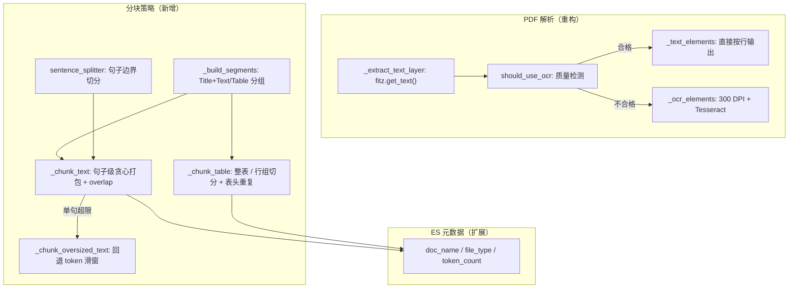

# Fish-Agent v3.5 知识加工精切（结构化分块 + PDF 混合提取 + ES 元数据）

> 项目路径：`D:\1_Backend\Fish-Agent`
> 覆盖版本：**v3.5**（在 [v3.4](v3.4-检索重排序-20260605.md) 基线上完成：Python Worker 分块从固定 512-token 滑窗升级为按文档结构差异化分块，PDF 解析从全量 OCR 改为文本层优先 + OCR 回退，ES 文档补充 `doc_name` / `file_type` / `token_count` 元数据）。
> 文档生成日期：**2026-06-05**
> 改动范围：**仅 Python Worker**（新增 sentence_splitter / structured_chunker，重构 pdf.py，扩展 elasticsearch.py / processor.py / config.py），Java 后端 / 前端 / ES mapping 补充字段说明（零破坏性变更）。

**分文档索引**

- [v3-全景文档](v3-全景文档-20260512.md) — v3 全景（含 v3.0 ~ v3.5 更新）
- [v3.4-检索重排序](v3.4-检索重排序-20260605.md) — v3.4 增量记录
- [v3.3-多格式解析与OCR清洗](v3.3-多格式解析与OCR清洗-20260604.md) — v3.3 增量记录
- [v3.2-Worker心跳与embedding重试](v3.2-Worker心跳与embedding重试-20260601.md) — v3.2 增量记录
- [v3.1-短期记忆三级读穿写穿](v3.1-短期记忆三级读穿写穿-20260601.md) — v3.1 增量记录
- [v3.0-后端模块重构](v3.0-后端模块重构-20260512.md) — v3.0 增量记录

---

## 一、v3.5 一句话增量

将 Python Worker 的固定 512-token 滑窗分块升级为「按 `element_type` 差异化的结构化分块」（Title+Text 合并 / Table 整表或行组保留 / 文本句子边界对齐），PDF 解析从「全量 OCR」改为「先文本提取、质量不合格才回退 OCR」，并为 ES 文档补充 `doc_name` / `file_type` / `token_count` 元数据。所有改动可通过 `FISH_WORKER_CHUNK_STRATEGY=flat` 回退到 v3.4 行为。

---

## 二、解决的三个问题

### 问题 1：固定 token 滑窗硬切，上下文断裂

**根因**：`text_chunker.py` 不区分元素类型，所有内容按 512 token 滑窗切分。Title（"第三章 Redis 持久化"）可能被切成独立的无意义碎片；Table 被逐行拆散后丧失表头上下文；句子在词中间被硬切（"部署时需要注" | "意以下几点"）。

**表现**：用户问"Redis 的持久化策略有哪些"，RAG 召回的 chunk 可能是一段被硬切的标题碎片，语义不完整；或表格数据丢失表头，模型无法理解列含义。

**修复**：引入结构化分块——Title 与紧随同页 Text 合并为 Section 再按句子边界打包；Table 优先整表保留（≤ `table_max_tokens`），超限时按行组切分并在每组重复表头；文本在句末标点（`。？！；.?!;`）处断句，单句超限时回退 token 滑窗。

### 问题 2：文字型 PDF 也全量 OCR，速度慢且引入 OCR 噪声

**根因**：`pdf.py` 无条件将每页渲染为 300 DPI PNG 再 OCR。文字型 PDF（有嵌入文本层）完全不需要 OCR——直接 `fitz.get_text()` 即可毫秒级提取完美文本。全量 OCR 既慢（300 DPI 渲染 + Tesseract），又引入 OCR 特有错误（连字识别偏差、版式错乱）。

**表现**：上传一份纯文字 PDF，Worker 处理耗时 30s+，且 chunk 中混入 OCR 标点错误（`fi` → `fi`）。

**修复**：混合提取策略——先提取文本层，质量合格（长度 ≥ 50 字符、CID 残留 ≤ 5%、乱码字符 ≤ 5%）则直接输出；不合格时回退 OCR。

### 问题 3：ES 文档缺少溯源元数据

**根因**：`ElasticsearchIndexer.bulk_index_document_chunks` 写入 ES 的 `_source` 不含 `doc_name`（PRIVATE scope）、`file_type`、`token_count`。前端无法按文件类型筛选、无法显示文档名、无法诊断 chunk 大小分布。

**修复**：两种 scope 都写入 `doc_name`、`file_type`、`token_count`，ES mapping 补充对应字段。

---

## 三、架构变化

### 3.1 Worker 处理管线对比

```
v3.4（改动前）：
  MinIO 下载 → Parser 解析 → 文本清洗 → text_chunker 固定 512-token 滑窗
                                              ↓
                                    embedding → ES bulk 写入（缺 file_type / token_count）

v3.5（改动后）：
  MinIO 下载 → Parser 解析（PDF：文本层优先 → OCR 回退）→ 文本清洗
                                                          ↓
                                    structured_chunker（按 element_type 差异化分块）
                                     ├─ Title + Text → Section → 句子边界打包
                                     ├─ Table → 整表或行组（重复表头）
                                     └─ 单句超限 → 回退 token 滑窗
                                              ↓
                                    embedding → ES bulk 写入（+ doc_name / file_type / token_count）
```

### 3.2 新增文件架构



---

## 四、新增与修改文件一览

### 新增文件

| 文件 | 说明 |
|------|------|
| `chunker/sentence_splitter.py` | 中文/英文句子边界切分（纯函数，无外部依赖） |
| `chunker/structured_chunker.py` | 结构化分块入口 `chunk_elements`，输出 `TextChunk` |
| `tests/test_structured_chunker.py` | 句子切分 5 + 结构化分块 7 = 12 个单测 |
| `tests/test_pdf_hybrid.py` | PDF 质量检测 5 + 解析分支 2 = 7 个单测 |
| `tests/test_elasticsearch_indexer.py` | ES 元数据 PRIVATE + PUBLIC scope 2 个单测 |

### 修改文件

| 文件 | 变更 |
|------|------|
| `chunker/text_chunker.py` | 新增 `count_tokens()` 公共函数；`_ENCODER` → `ENCODER`、`_chunk_tokens` → `chunk_tokens`（提为公共 API）；标注为 `flat` 兼容策略 |
| `parser/pdf.py` | 新增 `should_use_ocr` / `count_cid_residuals` / `has_garbled_unicode` 质量检测函数；重构 `PdfParser.parse()` 为文本层优先 + OCR 回退 |
| `storage/elasticsearch.py` | `bulk_index_document_chunks` 新增 `file_type` 参数；两种 scope 都写入 `doc_name` / `file_type` / `token_count` |
| `processor.py` | 按 `fish_worker_chunk_strategy` 选择分块器（`structured` / `flat`）；新增 `_file_type()` 静态方法派生文件类型；传入 `file_type` 给 ES |
| `config.py` | 新增 `fish_worker_chunk_strategy`（默认 `structured`）和 `fish_worker_table_max_tokens`（默认 `1024`）配置 |
| `tests/test_processor_cas.py` | fake settings 补齐新字段、策略设为 `flat` 保证旧 patch 仍命中 |
| `database/es/es.txt` | 三索引 mapping 补充 `doc_name` / `file_type` / `token_count` 字段 |

### 明确不改

| 文件 | 原因 |
|------|------|
| Java 后端 | 新增字段走 ES dynamic mapping，Java 侧不需要改 |
| 前端 | 本期无 UI 变更 |
| text_cleaner.py | PDF 直接提取文本的清洗复用既有 `clean_elements`，不重复实现 |

---

## 五、方案详解

### 5.1 句子边界切分（sentence_splitter）

**职责**：将一段文本按句末标点切分为句子列表，保证分块不在句中硬切。

**规则**：
- 句末标点：`。？！；.?!;`
- 闭合符号并入当前句：`」』"'」』)]》】`
- 英文小数点不作为句末：`3.14` 不切分
- 去除空句，尾部无标点的文本保留为最后一句

**实现要点**：
- 纯函数 `split_sentences(text: str) -> list[str]`，无状态，方便单测
- 闭合符号用显式 Unicode 码点（`」` 等）避免引号转义歧义
- 单遍扫描 O(n)，无正则开销

### 5.2 结构化分块（structured_chunker）

**策略矩阵**：

| element_type | 策略 |
|---|---|
| Title + 紧随同页 Text | 合并为 Section → 句子边界贪心打包 |
| 连续同页 Text | 同上 |
| 连续同页 Table | 整表 ≤ `table_max_tokens` 则完整保留；否则按行组切分，每组重复表头 |
| 单句超 chunk_size | 回退 `text_chunker.chunk_tokens` token 滑窗 |

**实现要点**：

1. **分段（`_build_segments`）**：将 `RawElement` 流按类型和页码归并为内部 `_Segment`（`text` 或 `table`）。连续同页的 Title+Text 合并为一个 text 段；连续同页 Table 合并为一个 table 段。

2. **正文分块（`_chunk_text`）**：对 Section 文本调用 `split_sentences` 得到句子列表，贪心打包到 `chunk_size` token。相邻块通过 `_overlap_tail` 从尾部回收若干完整句作为重叠区（句子级 overlap，避免在句中制造重复）。单句超过 `chunk_size` 时回退 `chunk_tokens` token 滑窗。

3. **表格分块（`_chunk_table`）**：先判整表 token 是否 ≤ `table_max_tokens`，是则完整保留。否则按行组切分，每组以表头行（`rows[0]`）开头，当 `len(group) > 1` 且加上下一行超 `chunk_size` 时切分。极端情况（单行+表头超限）宁可略超也不丢表头。

4. **全局 chunk_index**：跨段自增，保证输出的 `TextChunk.chunk_index` 连续。

**输出兼容**：沿用 `TextChunk(text, chunk_index, page, token_count)`，对下游 embedder / ES 完全透明。

**配置项**：

| 配置 | 默认值 | 说明 |
|------|--------|------|
| `FISH_WORKER_CHUNK_STRATEGY` | `structured` | `structured` 结构化 / `flat` 旧版滑窗 |
| `FISH_WORKER_TABLE_MAX_TOKENS` | `1024` | 整表保留的 token 上限 |

### 5.3 PDF 混合提取（pdf.py 重构）

**策略**：文本层优先 → 质量检测 → OCR 回退。

**质量检测（`should_use_ocr`）**：

| 检测项 | 阈值 | 说明 |
|--------|------|------|
| 文本长度 | < 50 字符 | 太短说明文本层为空或扫描件 |
| CID 残留占比 | > 5% | `(cid:1339)` 是 PDF 字体 CMap 缺失的典型症状 |
| 乱码 Unicode 占比 | > 5% | 替换符 U+FFFD + 私用区 U+E000–U+F8FF |

三项任一不合格即回退 OCR。阈值偏保守——宁可多 OCR，也不写入乱码。

**实现要点**：
- `PdfParser.parse()` 先调 `_extract_text_layer` 拼接全部页文本，再调 `should_use_ocr` 判断
- 质量合格走 `_text_elements`（按非空行输出 Text 元素），不合格走 `_ocr_elements`（原有 300 DPI + Tesseract 路径不变）
- `count_cid_residuals` / `has_garbled_unicode` / `should_use_ocr` 为模块级纯函数，可直接单测
- 提取文本无需在 parser 内重复「轻量清洗」——交给既有 `processor.clean_elements` 统一处理

### 5.4 ES 元数据扩展（elasticsearch.py）

**变更**：
- `bulk_index_document_chunks` 新增 `file_type: str` 关键字参数
- `_source` 字典对两种 scope（PRIVATE / PUBLIC）统一写入 `doc_name`、`file_type`、`token_count`
- PRIVATE scope 额外写入 `user_id`（不变）

**file_type 派生**（`processor._file_type`）：
- 优先用文件名后缀（`.pdf` → `pdf`）
- 无后缀时回退 MIME 子类型（`application/vnd.openxmlformats-officedocument.wordprocessingml.document` → `vnd.openxmlformats-officedocument.wordprocessingml.document`）
- 兜底返回空串

### 5.5 processor 策略分发

```python
# processor.py 步骤 4
strategy = getattr(self._settings, "fish_worker_chunk_strategy", "structured")
if strategy == "structured":
    chunks = structured_chunk_elements(elements, ...)
else:
    chunks = chunk_elements(elements, ...)  # flat 旧版
```

- `getattr(..., "structured")` 带默认值，兼容旧版 `SimpleNamespace` 测试
- `flat` 策略走 `text_chunker.chunk_elements`（与 v3.4 完全一致）
- 测试 `test_processor_cas` 设置 `fish_worker_chunk_strategy="flat"` 保证旧 patch 仍命中

---

## 六、完整数据流

```
用户上传 "Redis运维手册.pdf"（文字型 PDF）

  ↓ MinIO 下载

  ↓ PdfParser.parse()
    → _extract_text_layer: 拼接全部页文本 (len=12340)
    → should_use_ocr: len=12340 ≥ 50, CID=0, 无乱码 → 不需 OCR
    → _text_elements: 按非空行输出 RawElement(text, page, "Text")

  ↓ clean_elements: NFC / 控制字符 / OCR 替换 / 标点 / 空白

  ↓ structured_chunk_elements (chunk_size=512, overlap=50, table_max_tokens=1024)
    → _build_segments:
        [Title:"Redis 持久化", Text:"支持 RDB..."] → Section(kind=text)
        [Table:"策略 | 优点", Table:"RDB | 快", ...] → Segment(kind=table)
    → _chunk_text(Section): split_sentences → 贪心打包到 512 token
    → _chunk_table(Table): 整表 token=380 ≤ 1024 → 完整保留
    → 输出 TextChunk(text, chunk_index, page, token_count)

  ↓ embedder.embed_batch → vectors

  ↓ ElasticsearchIndexer.bulk_index_document_chunks
    → _source = { content, embedding, doc_name: "Redis运维手册.pdf",
                  file_type: "pdf", token_count: 380, ... }
```

---

## 七、测试覆盖

| 测试文件 | 用例数 | 覆盖内容 |
|---------|--------|---------|
| `test_structured_chunker` — SentenceSplitterTest | 5 | 中文句末 / 闭合引号 / 英文句末 / 小数点 / 空文本+尾部无标点 |
| `test_structured_chunker` — StructuredChunkerTest | 7 | Title+Text 合并 / 小表整表 / 大表行组+表头重复 / 句子边界不硬切 / 超长句回退滑窗 / chunk_index 连续 / 空输入 |
| `test_pdf_hybrid` — PdfQualityFunctionsTest | 5 | CID 残留计数 / 乱码 Unicode / 短文本需 OCR / 干净长文本不需 OCR / CID 占比过高需 OCR |
| `test_pdf_hybrid` — PdfHybridParseTest | 2 | 文本层可用时不调 OCR / 空白页回退 OCR |
| `test_elasticsearch_indexer` | 2 | PRIVATE scope 写 doc_name/file_type/token_count/user_id / PUBLIC scope 无 user_id |
| `test_processor_cas` | 3 | 回归：CAS 丢失 ES 清理 / 清洗集成 / 清洗后空结果 SUCCESS |
| **合计** | **24** | **50 tests OK（全量回归）** |

验证命令：

```bash
cd python
python -m compileall fish_worker tests    # 语法编译
python -m unittest discover -s tests -v   # 50 tests OK
```

---

## 八、关键设计决策

### 8.1 策略可切换而非直接替换

`FISH_WORKER_CHUNK_STRATEGY` 环境变量控制 `structured` / `flat`，默认 `structured`。保留 `flat` 旧版滑窗作为回退——如果结构化分块在某种文档格式上表现不佳，运维可即时切回无需发版。

### 8.2 文本层质量阈值保守

`should_use_ocr` 三项检测（长度 < 50 / CID > 5% / 乱码 > 5%）阈值偏保守。宁可多 OCR 也不要把乱码写进 ES——OCR 只是慢一点，乱码是永久污染。质量检测是文档级而非页级（混合型 PDF 不会逐页分别处理），这是已知的合理折衷。

### 8.3 表格"宁可略超不丢表头"

当单行+表头超过 `chunk_size` 时，`_emit_table_group` 不切分，直接输出。切丢表头会导致模型无法理解列含义，比 chunk 略大几 token 的代价大得多。

### 8.4 ES 新字段走 dynamic mapping

`doc_name` / `file_type` / `token_count` 虽然在 `es.txt` 中补充了 mapping 说明，但 ES 8.x 的 dynamic mapping 默认开启。**旧文档缺失这些字段不影响检索**，新写入文档自动包含。Java 侧无需改动。

### 8.5 公共 API 提取而非私有导入

`text_chunker.py` 将 `ENCODER` / `chunk_tokens` / `count_tokens` 提为公共 API（去掉下划线前缀），`structured_chunker.py` 走公共接口而非导入私有符号。避免内部重构导致跨模块静默崩溃。

### 8.6 PDF 清洗复用 processor 层

PDF 直接提取的文本不在 parser 内做轻量清洗，而是交给 `processor.clean_elements` 统一处理（NFC / 控制字符 / OCR 替换 / 标点 / 空白）。避免双清洗（parser 一次 + processor 一次），逻辑集中在 `text_cleaner.py` 一处。

---

## 九、已知限制与后置项

| 项目 | 说明 | 优先级 |
|------|------|--------|
| 英文缩写误切 | `Dr. Smith` / `e.g.` / `i.e.` 在句点处断句；当前面向中文文档影响有限 | 低 |
| PDF 质量检测文档级 | 混合型 PDF（部分页扫描+部分页文字）不会逐页分别处理，要么全文本层要么全 OCR | 低（扫描件全 OCR 合理） |
| 省略号/破折号 | `……` / `——` 不作为句末标点，不触发断句 | 低 |
| file_type 回退精度 | 无后缀时用 MIME 子类型，`vnd.openxmlformats-...` 不够友好；可加映射表 | 中 |

---

_文档版本：**v3.5 增量** · 生成日期：2026-06-05 · 对应代码能力线：v1 → v1.3 → v2.0 ~ v2.6 → v3.0 → v3.1 → v3.2 → v3.3 → v3.4 → **v3.5**_
