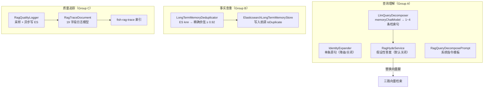

# Fish-Agent v3.6 查询理解与检索闭环（LLM 查询分解 + 事实查重 + 质量追踪）

> 项目路径：`D:\1_Backend\Fish-Agent`
> 覆盖版本：**v3.6**（在 [v3.5](v3.5-知识加工精切-20260605.md) 基线上完成：RAG 查询扩展从词级拆解升级为 LLM 语义查询分解（可选叠加 HyDE），长期事实写入前做 embedding 余弦查重，新增 RAG 全链路质量追踪异步写 ES）。
> 文档生成日期：**2026-06-06**
> 改动范围：**仅 Java 后端 `rag/pipeline/` + `memory/longterm/` + 新增 `rag/tracing/`**，Python Worker / 前端 / 既有 ES mapping 零改动；新增 `fish-rag-trace` 索引。

**分文档索引**

- [v3-全景文档](v3-全景文档-20260512.md) — v3 全景（含 v3.0 ~ v3.6 更新）
- [v3.5-知识加工精切](v3.5-知识加工精切-20260605.md) — v3.5 增量记录
- [v3.4-检索重排序](v3.4-检索重排序-20260605.md) — v3.4 增量记录
- [v3.3-多格式解析与OCR清洗](v3.3-多格式解析与OCR清洗-20260604.md) — v3.3 增量记录
- [v3.2-Worker心跳与embedding重试](v3.2-Worker心跳与embedding重试-20260601.md) — v3.2 增量记录
- [v3.1-短期记忆三级读穿写穿](v3.1-短期记忆三级读穿写穿-20260601.md) — v3.1 增量记录
- [v3.0-后端模块重构](v3.0-后端模块重构-20260512.md) — v3.0 增量记录

---

## 一、v3.6 一句话增量

把 RAG 检索管线的词级查询扩展升级为 **LLM 语义查询分解**（可选叠加 HyDE 假设性文档嵌入），长期事实写入 ES 前做 **embedding 余弦查重**（相似度 ≥ 0.92 跳过），新增 **RAG 全链路质量追踪**（每次检索异步写 ES `fish-rag-trace` 索引）。三块互相独立，均可在配置中关闭回退到 v3.5 行为。

---

## 二、解决的三个问题

### 问题 1：查询扩展只是词级拆解，不是语义扩展

**根因**：`RagQueryExpand.java` 的 `BreakIteratorExpander` 按 `BreakIterator` 词边界分词，把用户原句拆成孤立 token 片段作为子查询。

**表现**：用户问"之前聊的 Redis 配置和 Docker 部署再讲一下"，当前扩展出 `"Redis" / "配置" / "Docker" / "部署"` 这些孤立词。而真正需要的是语义层面的变体：`"Redis 持久化配置详解"` / `"Docker Compose 容器部署最佳实践"`。孤立词检索只能匹配恰好包含这些词的文档，缺乏上下文理解。

**修复**：引入 `LlmQueryDecomposer`——调用 `memoryChatModel` 将用户问题拆成 1~4 条不同角度的完整检索句；超时 3s 或解析失败自动降级为单条原句。同时保留 `BreakIteratorExpander`（词级）和 `IdentityExpander`（原句）作为可切换策略。

### 问题 2：长期事实写入不查重

**根因**：`ElasticsearchLongTermMemoryStore.saveFacts` 每轮对话结束后异步抽取事实 → embedding → ES 写入，不做去重。

**表现**：用户多轮对话中反复提到"我是做 Java 后端的"，每轮都抽取并存入 ES。检索时这些重复事实占据 Top-K 名额，挤掉其他有用信息。

**修复**：新增 `LongTermMemoryDeduplicator`——写入前用候选事实的 embedding 做 ES knn 搜索取回最近邻，手动重算精确余弦（避免 ES 归一化 `(1+cos)/2` 与原始阈值不一致），最大值 ≥ 0.92 判定重复跳过。查重复用已算好的 embedding，不增加额外 embedding 调用。

### 问题 3：没有检索质量可观测性

**根因**：RAG 检索结果注入后，模型用不用、用户满不满意，完全没有追踪。改了参数只能靠主观感受评估效果。

**修复**：新增 `RagQualityLogger`——每次 RAG 检索异步记录全链路指标（原始查询 / 子查询 / 命中数 / rerank 分数 / HyDE 状态 / 延迟分解）写入 ES `fish-rag-trace` 索引。采样率可配置，写入失败仅记 WARN 不阻塞主流程。

---

## 三、架构变化

### 3.1 检索管线对比

```
v3.5（改动前）：
  用户消息 → [可选重写] → [词级扩展 BreakIterator] → 三路检索 → RRF → Rerank → 注入

v3.6（改动后）：
  用户消息 → [可选重写] → [LLM 语义查询分解] ← 新增（可回退词级/原句）
                                   ↓
                 [可选 HyDE 假设性答案] ← 新增（仅替换向量腿，默认关闭）
                                   ↓
                          三路检索 → RRF → Rerank → 注入
                                   ↓
                          RAG 质量日志 → ES 异步写入 ← 新增

  长期事实抽取 → embedding 查重 → 相似度 ≥ 0.92 跳过 ← 新增
```

### 3.2 新增文件架构



---

## 四、新增与修改文件一览

### 新增文件

| 文件 | 说明 |
|------|------|
| `rag/pipeline/expand/RagQueryDecomposePrompt.java` | LLM 查询分解 Prompt 模板（系统指令 + 用户段） |
| `rag/pipeline/expand/RagHydeService.java` | HyDE 假设性文档嵌入（默认关闭，仅替换向量腿） |
| `memory/longterm/LongTermMemoryDeduplicator.java` | embedding 余弦查重（ES knn + 精确余弦验证） |
| `rag/tracing/RagTraceDocument.java` | RAG 全链路质量日志文档模型（19 字段） |
| `rag/tracing/RagQualityLogger.java` | 异步写 ES（自建索引 + 采样 + 降级） |
| `database/es/es.txt` | 新增 `fish-rag-trace` 索引 DDL（追加） |
| `test/.../expand/RagQueryDecomposerTest.java` | 查询分解 6 个单测 |
| `test/.../longterm/LongTermMemoryDeduplicatorTest.java` | 查重 8 个单测 |

### 修改文件

| 文件 | 变更 |
|------|------|
| `rag/pipeline/expand/RagQueryExpand.java` | 新增 `IdentityExpander` + `LlmQueryDecomposer` 嵌套类 |
| `rag/pipeline/expand/RagQueryExpandConfiguration.java` | 按 `strategy`（LLM/TOKEN/IDENTITY）装配 |
| `rag/pipeline/recall/RagRecall.java` | 接入 HyDE 向量腿文本 + 全链路质量埋点 |
| `rag/pipeline/recall/RagRecallConfiguration.java` | 注册 `RagHydeService` + `RagQualityLogger` Bean |
| `rag/config/RagProperties.java` | 新增 `Expand` / `Hyde` / `Tracing` 嵌套配置类 |
| `memory/config/MemoryProperties.java` | 新增 `Dedup` 嵌套配置类 |
| `memory/longterm/ElasticsearchLongTermMemoryStore.java` | `saveFacts` 写入前调用 `isDuplicate` 查重 |
| `src/main/resources/application.yml` | 补充 `expand.*` / `hyde.*` / `tracing.*` / `dedup.*` |

### 明确不改

| 文件 | 原因 |
|------|------|
| Python Worker | 不涉及 |
| 三个 Searcher | 检索逻辑不变 |
| RagScoreFusion / DashScopeRagReranker | v3.4 的逻辑不变 |
| 前端 | 不涉及 |

---

## 五、方案详解

### 5.1 LLM 语义查询分解（RagQueryExpand 重写）

**策略三档**：

| 策略 | 行为 | 配置值 |
|------|------|--------|
| **LLM**（默认） | `memoryChatModel` 生成 1~4 条语义不同的子查询 | `strategy=LLM` |
| **TOKEN** | `BreakIterator` 词级拆解（v3.5 行为） | `strategy=TOKEN` |
| **IDENTITY** | 单条原句不做拆解 | `strategy=IDENTITY` / `enabled=false` |

**LLM Prompt 设计**：系统指令限定模型角色为"搜索查询优化专家"，输出严格 JSON 字符串数组。解析层容忍 ` ```json ` 代码块包裹（`extractJsonArray` 截取 `[` ~ `]`），对所有子查询做长度过滤（5~200 字符）+ 去重 + 总数 cap。

**超时降级**：`CompletableFuture.supplyAsync().get(timeoutMs)` 3s 超时，`catch (Exception)` 兜底所有异常路径（null 链、解析失败、超时），统一降级为单条原句。

**LLM 不可用降级**：`RagQueryExpandConfiguration` 装配时 `memoryChatModelProvider.getIfAvailable()` 返回 null → 回退 `IdentityExpander`（单条原句），而非词级碎片——更贴合用户"要语义分解"的预期。

### 5.2 HyDE 假设性文档嵌入（可选增强，默认关闭）

**原理**：用 LLM 生成一段"假设性答案"，其 embedding 比原始问题更接近目标文档，用于替换向量腿的检索文本。文本路仍用原始查询。

**实现**：`RagHydeService.generate()` 在 `buildAugmentation` 主线程中同步调用（在异步 ES 检索之前），必须超时保护（3s `TimeoutException` 单独 catch），避免慢 LLM 卡住整条 RAG 链路。关闭/失败/超时返回 null，调用方回退原 query。

**为什么默认关闭**：HyDE 对事实型查询效果好，但对闲聊型查询（"你好"/"帮我写个代码"）反而有害——LLM 生成的不相关假设答案会误导检索。

### 5.3 长期事实 embedding 查重（LongTermMemoryDeduplicator）

**查重流程**：

1. `saveFacts` 循环中对每条事实计算 embedding
2. 调用 `isDuplicate(operations, index, userId, embedding)` → ES knn 搜索 `fish-user-memory`（k=3, filter: user_id + source_type=chat）
3. 从返回文档中提取原始 embedding 向量，手动重算精确余弦
4. `maxCosine ≥ 0.92` → 判定重复 → 跳过写入

**为什么手动重算而非直接用 ES 分数**：(1) ES knn 是 ANN 近似检索，分数可能不精确；(2) ES 的 cosine 相似度被归一化为 `(1+cos)/2`，与本类 0.92 的原始余弦阈值语义不一致。手动重算保证阈值判定准确。

**查重失败不阻塞写入**：ES 异常 → `catch (Exception)` → `log.warn` → 返回 false（宁可多存不可漏存）。

**复用 embedding**：查重放在 `saveFacts` 的 embedding 计算之后、`operations.save` 之前，直接复用本次已算好的向量，不增加额外 embedding 调用。

### 5.4 RAG 全链路质量追踪（RagQualityLogger）

**记录内容**（19 字段）：

| 类别 | 字段 |
|------|------|
| 身份 | `trace_id` (UUID), `user_id`, `session_id` |
| 查询 | `original_query`, `rewritten_query`, `expanded_queries` |
| 召回 | `recall_total_hits`, `recall_deduped_hits` |
| 融合 | `fusion_top_n`, `rerank_input_count` |
| 精排 | `rerank_top_score`, `rerank_lowest_score` |
| HyDE | `hyde_used` (boolean) |
| 注入 | `injected_fact_count`, `injected_total_chars` |
| 延迟 | `recall_latency_ms`, `rerank_latency_ms`, `total_latency_ms` |
| 时间 | `created_at` (epoch_millis) |

**写入方式**：异步 `CompletableFuture.runAsync()` + `ForkJoinPool.commonPool()`，写入失败仅记 WARN。应用启动时 `@PostConstruct initIndex()` 自动检测并创建 `fish-rag-trace` 索引（含完整 mapping），无需手动操作 ES。

**埋点位置**：`RagRecall.buildAugmentation` 中三处 exit point（无召回/精排空/正常返回）均落库，保证每次 RAG 调用都有追踪记录。

### 5.5 配置项汇总

| 配置 | 默认值 | 说明 |
|------|--------|------|
| `fish.rag.expand.enabled` | `true` | 查询扩展总开关；false → IdentityExpander 单条原句 |
| `fish.rag.expand.strategy` | `LLM` | 扩展策略：LLM / TOKEN / IDENTITY |
| `fish.rag.expand.max-queries` | `4` | LLM 分解最多生成的子查询条数 |
| `fish.rag.expand.timeout-ms` | `3000` | LLM 调用超时（毫秒） |
| `fish.rag.expand.min-query-chars` | `5` | 子查询最小字符数 |
| `fish.rag.expand.max-query-chars` | `200` | 子查询最大字符数 |
| `fish.rag.hyde.enabled` | `false` | HyDE 开关（默认关闭） |
| `fish.rag.hyde.timeout-ms` | `3000` | HyDE LLM 超时（毫秒） |
| `fish.rag.tracing.enabled` | `true` | 质量追踪开关 |
| `fish.rag.tracing.index-name` | `fish-rag-trace` | ES 索引名 |
| `fish.rag.tracing.sample-rate` | `1.0` | 采样率（0.0~1.0） |
| `fish.memory.dedup.enabled` | `true` | 事实查重开关 |
| `fish.memory.dedup.similarity-threshold` | `0.92` | 余弦相似度阈值 |
| `fish.memory.dedup.k` | `3` | knn 取回最近邻条数 |
| `fish.memory.dedup.num-candidates` | `20` | knn num_candidates |

---

## 六、完整数据流

```
用户消息："之前聊的 Docker 部署和 Redis 持久化再讲一下"

  ↓ [可选] RagQueryRewrite（当前默认关闭）

  ↓ LlmQueryDecomposer（memoryChatModel）
     → ["Docker Compose 容器部署最佳实践", "Redis 持久化 RDB 和 AOF 机制详解"]

  ↓ [可选] RagHydeService（默认关闭）
     → 若开启：生成假设性答案 → 替换向量腿 embedding 文本

  ↓ 三路×双路 ES 并发检索（per-subquery-size=10）
     每条子查询: UserMemory(text+vec) + UserKnowledge(text+vec) + PublicKnowledge(text+vec)
     → 2 子查询 × 6 路 = 最多 24 批次

  ↓ RagScoreFusion（RRF 融合）
     → 候选池 Top-50

  ↓ DashScopeRagReranker（qwen3-rerank 精排）
     50 条 → Cross-Encoder 精排 → Top-8
     失败时自动降级到候选池前 8 条

  ↓ renderBlock → 注入 SystemMessage

  ↓ RagQualityLogger（异步写 ES fish-rag-trace）
     trace_id, original_query, expanded_queries, recall_latency_ms,
     rerank_top_score, hyde_used=false, total_latency_ms ...

---

长期事实写入链路（异步，对话结束后）：

  LLM 抽取事实列表 → facts: ["用户做 Java 后端开发", "用户在研究微服务"]
  逐条:
    → embeddingModel.embed(fact)
    → LongTermMemoryDeduplicator.isDuplicate(ops, index, userId, embedding)
      → ES knn(field=embedding, k=3, filter=user_id+source_type=chat)
      → 手动重算精确余弦 vs 返回邻居向量
      → maxCosine ≥ 0.92? → 跳过（重复）
    → operations.save(document, index)
```

---

## 七、测试覆盖

| 测试文件 | 用例数 | 覆盖内容 |
|---------|--------|---------|
| `RagQueryDecomposerTest` | 6 | 有效 JSON+cap / code fence 提取 / 无效 JSON 回退 / 全过滤回退 / 去重 trim / IdentityExpander |
| `LongTermMemoryDeduplicatorTest` | 8 | 余弦恒等/正交/零向量/长度不一致 / maxCosine 最高邻 / 空候选 / isDuplicate disabled / blank 防御 / ES 异常降级 |
| `BreakIteratorSubQueryExpanderTest` | 3 | 回归：词级扩展不受影响 |
| `LongTermRecallHitMergerTest` | 2 | 回归：dedupKey + mergeByMaxScore 不受影响 |
| **合计** | **19** | **全绿** |

验证命令：

```bash
mvn -q -DskipTests compile                                                                    # 编译通过
mvn -q -Dtest=RagQueryDecomposerTest,LongTermMemoryDeduplicatorTest,BreakIteratorSubQueryExpanderTest,LongTermRecallHitMergerTest test  # 19 tests OK
```

---

## 八、关键设计决策

### 8.1 策略三档而非直接替换

`fish.rag.expand.strategy`（`LLM|TOKEN|IDENTITY`）+ `expand.enabled` 双层控制。保留 TOKEN 作为 v3.5 兼容回退，IDENTITY 用于关闭扩展。运维可即时切换无需发版。

### 8.2 LlmQueryDecomposer 不持有专属线程池

单次 LLM I/O 调用使用 `CompletableFuture.supplyAsync()` 默认 `ForkJoinPool.commonPool()`，`future.get(timeout)` 做超时控制。不创建自定义 `ExecutorService`，避免生命周期管理负担（与 `ragRecallExecutor` 的 `destroyMethod = "shutdown"` 处理不一致的风险）。

### 8.3 HyDE 超时保护

HyDE 在 `buildAugmentation` 主线程同步调用（在异步 ES 检索之前），必须超时保护。`CompletableFuture.supplyAsync().get(3000ms)` + 独立 `catch (TimeoutException)` 确保慢 LLM 不卡住整条 RAG 链路。

### 8.4 事实查重用精确余弦而非 ES 分数

ES knn 的 cosine 相似度被归一化为 `(1+cos)/2`，与 0.92 原始余弦阈值语义不一致。手动重算保证阈值判定准确。代价：每次查重多传输 k 个 1536 维向量，量小可接受。

### 8.5 追踪三处 mapping 统一

`RagTraceDocument` 字段注解、`RagQualityLogger.traceMapping()`、`es.txt` DDL 三处的字段名和类型严格对齐。text 字段统一使用 `ik_max_word` 索引分词 + `ik_smart` 搜索分词。

### 8.6 trace_id 用 UUID

`RagRecall` 无 turnNumber 上下文，使用 `UUID.randomUUID()` 保证唯一性。`session_id` 单独存储用于按会话聚合分析。

### 8.7 LLM 不可用降级到 IdentityExpander 而非 BreakIteratorExpander

用户配置 `strategy=LLM` 期望语义分解，若 `memoryChatModel` 不可用，降级到单条原句（不扩展）比降级到词级碎片更符合用户预期——"语义分解不可用则不做扩展"。

---

## 九、已知限制与后置项

| 项目 | 说明 | 优先级 |
|------|------|--------|
| LLM 分解增加 0.5~2s 延迟 | 使用独立 `memoryChatModel` 不占主模型；超时 3s 自动降级 | 可接受（对话流 SSE 流式体感不明显） |
| `future.get(timeout)` 不取消底层 LLM 调用 | 超时只停止等待，虚拟线程中的 `chatModel.call()` 继续运行 | 低（单次 I/O 调用，不会积累） |
| HyDE 对闲聊型查询有副作用 | 默认关闭，开启后只替换向量路的 query，文本路不变 | 低 |
| 事实查重 check-then-write 无锁 | 并发写入同一事实可能双写，概率极低（异步单线程抽取） | 低 |
| 英文缩写误切 | `Dr. Smith` / `e.g.` 在句点处可能被误判为句末 | 低（面向中文文档） |
| 追踪索引无 ILM | `fish-rag-trace` 无自动清理策略，长期运行需加 ILM 或定期删除 | 中 |

---

_文档版本：**v3.6 增量** · 生成日期：2026-06-06 · 对应代码能力线：v1 → v1.3 → v2.0 ~ v2.6 → v3.0 → v3.1 → v3.2 → v3.3 → v3.4 → v3.5 → **v3.6**_
