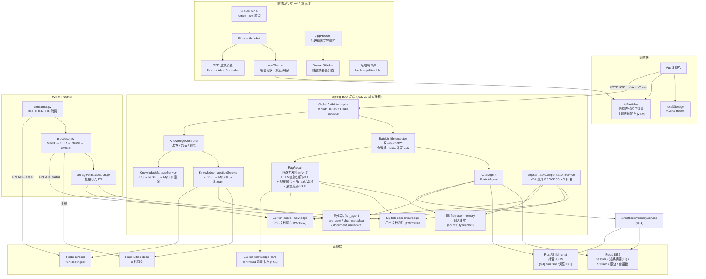
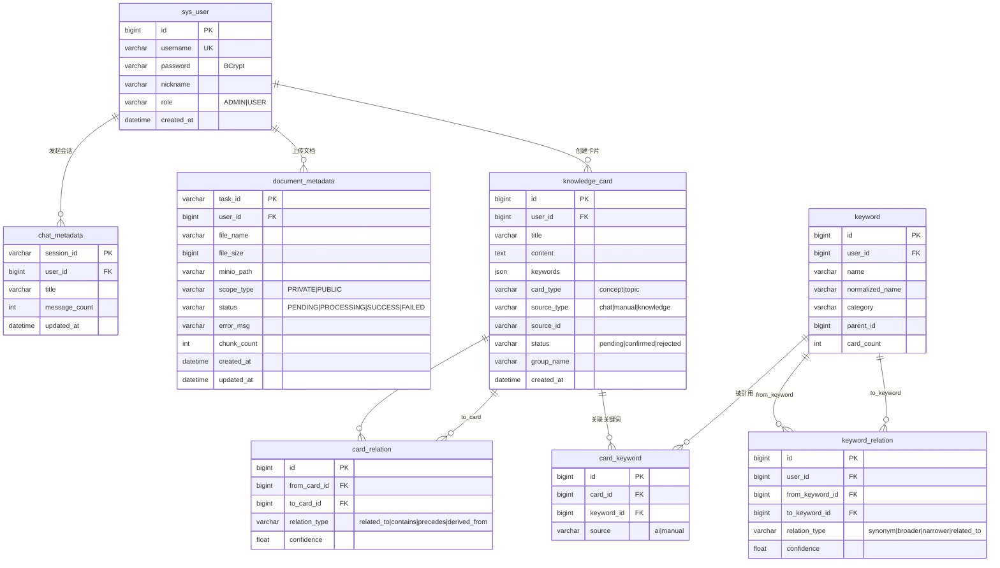
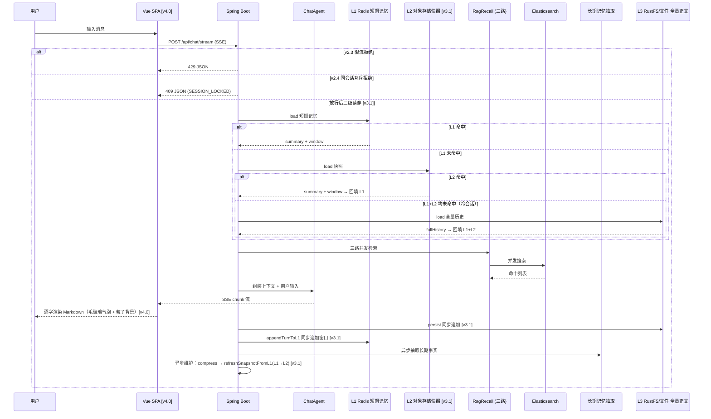

# Fish-Agent v4 全景文档

> 项目路径：`D:\1_Backend\Fish-Agent`
> 覆盖版本：**v2.0 ~ v2.6 + v3.0 ~ v3.6 + v4.0 + v4.1 + v4.2**（v1 → v1.3 → v2.0 → ... → v2.6 → v3.0 后端模块重构 → v3.1 短期记忆三级读穿写穿 → v3.2 Worker 心跳与 Embedding 重试 → v3.3 多格式文档解析 + OCR 文本清洗 → v3.4 RAG 检索重排序 → v3.5 知识加工精切 → v3.6 查询理解与检索闭环 → v4.0 前端视觉重设计 → v4.1 知识卡片系统 → **v4.2 知识卡片闭环与切片可视化（分组层级化 + RAG 四路召回 + 复习模式 + 切片 K-Means 可视化 + 切片↔卡片双向桥接）**）
> 后端 Java 源文件约 **140** 个，`frontend/src` 下 TS/Vue 约 **42** 个，Python Worker 约 **21** 个文件。

**分文档索引**

- [v2 全景文档](../v2/v2-全景文档-20260505.md) — v2.x 全景（含 v2.0 ~ v2.6 增量索引）
- [v3 全景文档](../v3/v3-全景文档-20260512.md) — v3.x 全景（含 v3.0 ~ v3.6 增量索引）
- [v3.0-后端模块重构](../v3/v3.0-后端模块重构-20260512.md)
- [v3.1-短期记忆三级读穿写穿](../v3/v3.1-短期记忆三级读穿写穿-20260601.md)
- [v3.2-Worker心跳与embedding重试](../v3/v3.2-Worker心跳与embedding重试-20260601.md)
- [v3.3-多格式解析与OCR清洗](../v3/v3.3-多格式解析与OCR清洗-20260604.md)
- [v3.4-检索重排序](../v3/v3.4-检索重排序-20260605.md)
- [v3.5-知识加工精切](../v3/v3.5-知识加工精切-20260605.md)
- [v3.6-查询理解与检索闭环](../v3/v3.6-查询理解与检索闭环-20260606.md)
- **[v4.0-前端视觉重设计](v4.0-前端视觉重设计-20260606.md) — v4.0 增量记录（粒子背景 + 毛玻璃 + 抽屉侧栏）**
- **[v4.1-知识卡片系统](v4.1-知识卡片系统-20260606.md) — v4.1 增量记录（AI 提取 + CRUD + 关键词实体 + 图谱 + 关联发现）**
- **[v4.2-知识卡片闭环与切片可视化](v4.2-知识卡片闭环与切片可视化-20260607.md) — v4.2 增量记录（分组层级 + RAG 四路召回 + 复习模式 + 切片可视化 + 双向桥接）**
- [Redis常量名速查](../速查文档/Redis常量名速查.md)
- [数据库速查](../速查文档/数据库速查.md)
- [向量库速查](../速查文档/向量库速查.md)
- [ES 索引 DDL](../../database/es/es.txt)
- [MySQL 建表语句](../../database/sql/fish_agent.sql)
- [Python Worker 说明](../../python/README.md)

---

## 一、项目定位

Fish-Agent 是基于 **Spring Boot 3.5 + Spring AI Alibaba ReAct** 的全栈智能体应用。

**核心能力链**：登录鉴权 → **`/api/chat/**` Redis 令牌桶 + SSE 并发限流** → **同 `sessionId` Redis 互斥（v2.4，防双击竞态）** → 多轮对话（SSE 流式）→ **三级短期记忆（v3.1：L1 Redis → L2 对象存储快照 → L3 全量正文，热路径只读 Redis）** / 长期事实抽取（v2.4，**v3.6：写入前 embedding 余弦查重**）→ **四路 ES RAG 检索（v4.2：记忆 + 文档 + 知识卡片 + 公共知识）→ LLM 语义查询分解（v3.6）→ RRF 分数融合 + DashScope Rerank 精排（v3.4）** → 工具调用。**RAG 全链路质量追踪异步写 ES（v3.6）**。

**知识卡片闭环（v4.1 → v4.2）**：**AI 自动提取**（LLM 分析对话 → pending 卡片 + 内部/外部关联，prompt 注入已有分组/关键词减少同义不同名）+ **手动创建** → **即时预览确认** → **关键词实体系统**（normalized_name 归一化 + parent_id 层次 + synonym/broader/narrower 关系）→ **树形分组层级（v4.2：card_group 实体表 + 归一化去重 + AI 感知分组树 + cascader 级联选择 + 面包屑）** → **4 种 relation_type 关联** → **vis-network 力导向图谱可视化** → **多信号智能关联发现**（关键词 Jaccard 0.35 + 分组一致 0.20 + 祖先匹配 0.20 + embedding 0.25，>0.45 阈值建议 related_to）。MySQL + ES 双写，confirmed 卡片**参与四路 RAG recall（v4.2）**。**翻转卡片复习模式（v4.2：忘了/模糊/熟悉 + 进度条）**。

**对话模型路由**：支持 **DashScope**（阿里云通义）/ **Ollama**（本地）/ **DeepSeek**（OpenAI-compatible）三路可选，嵌入独立配置，切换只需修改一个环境变量，上层业务零感知。

**知识库闭环**：前端上传（直传/分片）→ Java 写入 RustFS + MySQL + Redis Stream → Python Worker 异步消费 → **多格式解析（v3.3：PDF OCR / txt / md / docx / html / xlsx / pptx，v4.2：PDF CMap 乱码噪声检测增强）** → **文本清洗管道（v3.3：NFC / 控制字符 / OCR 替换 / 标点合并 / 空白标准化）** → **结构化分块（v3.5：Title+Text 合并 / Table 整表保留 / 句子边界对齐，可回退 flat 滑窗）** → embedding 向量化（v3.2：429/5xx 指数退避重试）→ **ES 批量写入（v3.5：+ doc_name / file_type / token_count 元数据）** → **切片可视化（v4.2：K-Means 主题聚类 + LLM 分组标题/摘要 + 两级浏览 + 关键词搜索 + 切片↔卡片双向向量关联）** → 前端管理页列表/删除。Worker 心跳（v3.2）防长任务被孤儿补偿误杀，终态 CAS + ES 清理保证数据一致。

**前端**：**v4.0 全面视觉重设计**——**tsParticles 网络连线粒子背景**（深色模式亮色粒子 + 亮色模式深色粒子，主题感知动态切换配色），**毛玻璃拟态**（`backdrop-filter: blur` 贯穿 Header / 侧栏 / 输入框 / 消息气泡），**深色蓝紫基调**（默认 `#0a0a14`）+ **明暗双主题切换**（`useTheme` composable，CSS 变量约 40 项完整覆盖），**抽屉式侧栏**（`DrawerSidebar` 从左滑入 300px + 遮罩层），**居中单栏聊天布局**（消息区 max 800px，最大化粒子背景可视面积），**共享 AppHeader**（汉堡按钮 + 品牌 + 知识库 + 主题切换 + 用户信息 + 退出），**登录页单卡片切换**（登录/注册淡入滑动过渡），**知识库页渐变 Banner**（`--gradient-brand` + 白色标题 + 底部渐变过渡）。

---

## 二、全链路架构



---

## 三、技术栈

### 3.1 后端 (Java)

| 分层 | 技术 | 说明 |
|------|------|------|
| 运行时 | JDK 21 | 虚拟线程 `spring.threads.virtual.enabled=true` |
| 框架 | Spring Boot 3.5.13 | 自动配置 + `@ConfigurationProperties` |
| AI 引擎 | Spring AI Alibaba 1.1.2 | ReAct Agent + `ModelCallLimitHook` |
| AI BOM | Spring AI BOM 1.1.4 | Chat / Embedding SPI |
| 模型路由 | DashScope / Ollama / DeepSeek（Chat） | `fish.llm.chat-provider` / `embedding.provider` 可独立配置 |
| 持久层 | MyBatis-Plus 3.5 | `sys_user`、`chat_metadata`、`document_metadata`、`knowledge_card`、`card_relation`、`card_group`、`keyword`、`card_keyword`、`keyword_relation` |
| 缓存 | Redis (Lettuce) | DB2：Session + 短期摘要(L1) + Stream + 限流 + 会话互斥 |
| 检索引擎 | Elasticsearch 8.x | 五索引：用户记忆 / 私有知识 / 公共知识 / 知识卡片 / RAG 追踪 |
| 对象存储 | MinIO (RustFS) | 对话 JSON (`fish-chat`) + 文档原文 (`fish-docs`) |
| 安全 | spring-security-crypto | BCrypt 密码哈希（无完整 FilterChain） |
| 工具库 | Lombok, Jsoup, JUnit 5 | — |

### 3.2 Python Worker

| 分层 | 技术 | 说明 |
|------|------|------|
| 运行时 | Python 3.11+ | Docker 多阶段构建 |
| 消息消费 | redis-py 5.x | `XREADGROUP` + `XAUTOCLAIM` + `XACK` |
| 对象存储 | minio-py 7.x | 下载 `fish-docs` 桶原始文件 |
| PDF 解析 | PyMuPDF (fitz) 1.24+ | 文本层优先 + OCR 回退 [v3.5] |
| 多格式解析 | python-docx / BeautifulSoup / openpyxl / python-pptx | **v3.3**：docx / html / xlsx / pptx / txt / md |
| 文本清洗 | 标准库 `unicodedata` + `re` | **v3.3**：NFC / 控制字符 / OCR 替换 / 标点合并 / 空白标准化 |
| OCR 识别 | pytesseract 0.3+ | Tesseract 引擎, `chi_sim+eng` 中英双语 |
| token 分块 | tiktoken 0.7+ | `cl100k_base` 编码器, **v3.5: 结构化分块（Title+Text/Table 差异化 + 句子边界）** |
| embedding | httpx → DashScope API | 批量 25 条/次, `text-embedding-v2` 1536 维, **v3.2: 429/5xx/网络错误指数退避重试** |
| ES 写入 | elasticsearch-py 8.x | 20 条/批 bulk index + **v3.5: doc_name/file_type/token_count** |
| 配置 | pydantic-settings 2.x | 所有环境变量与 Java `application.yml` 命名对齐 |
| 数据库 | PyMySQL 1.x | `document_metadata` 状态更新, **v3.2: CAS 写入 + 心跳 touch** |
| 心跳 | threading + PyMySQL | **v3.2**: 守护线程每 30s 刷新 `updated_at`，防孤儿补偿误杀 |

### 3.3 前端

| 分层 | 技术 | 说明 |
|------|------|------|
| 框架 | Vue 3.5 + TypeScript 5.6 | Composition API + `<script setup>` |
| 构建 | Vite 6 | HMR 热更新, 自动导入 Element Plus |
| 路由 | vue-router 4 | `/login` `/chat` `/knowledge` `/cards`, `beforeEach` token 校验 |
| UI 库 | Element Plus 2.x + Icons | 暗色 CSS 变量全覆盖 |
| 状态管理 | Pinia | auth (token+nickname), chat (sessions+messages+streaming) |
| **粒子背景** | **@tsparticles/vue3 + @tsparticles/slim** | **v4.0：网络连线粒子，主题感知双色配置，鼠标 grab 吸引 + push 添加** |
| SSE 消费 | Fetch API + ReadableStream | `AbortController` 取消生成 |
| Markdown | marked + highlight.js | 代码高亮, 内联代码着色 |
| **明暗主题** | **`useTheme` composable** | **v4.0：默认深色，CSS 变量约 40 项 + Element Plus 全组件覆盖 + 组件背景变量化** |
| **CSS 体系** | **CSS 变量约 40 项** | **v4.0：`:root` 深色 + `[data-theme='light']` 亮色覆盖，含 `--bg-header` / `--bg-input-wrap` / `--bg-suggestion` 等组件变量** |
| **毛玻璃** | **`backdrop-filter: blur`** | **v4.0：Header / DrawerSidebar / ChatInput / MessageBubble / LoginCard / KnowledgeContainer** |

---

## 四、后端源码目录（v3.0 按业务域分包）

```
src/main/java/com/yuyu/fishagent/
├── FishAgentApplication.java                   @SpringBootApplication + @MapperScan(3个包)
│
├── agent/                                      Agent 核心
│   ├── BaseAgent.java                          抽象基类
│   ├── ChatAgent.java                          ReAct Agent 主循环, 工具编排
│   ├── AgentStatus.java                        原子状态枚举 (IDLE/RUNNING/STOPPED)
│   ├── config/
│   │   ├── AgentProperties.java                Agent 配置（人设、最大迭代次数等）
│   │   └── ToolProperties.java                 外部工具配置
│   └── tool/
│       ├── AgentToolProvider.java              SPI 接口
│       ├── ToolRegistry.java                   自动发现 + 单工具失败隔离
│       ├── builtin/                            DateTime, Calculator, WebFetch, FileRead, FileWrite
│       └── external/                           Tavily, Bocha, AmapWeather, AmapGeo, Mail
│
├── chat/                                       对话模块
│   ├── ChatController.java                    /api/chat/stream|sessions|sessions/{sid} + PATCH rename
│   ├── ChatService.java                       对话编排主入口 (SSE → Agent → 记忆)
│   ├── ChatMetadataService.java               会话元数据 CRUD
│   ├── history/                               对话持久化 (SPI)
│   │   ├── ChatMemoryStore.java               SPI 接口
│   │   ├── RustFsChatMemoryStore.java         RustFS fish-chat 桶 (默认)
│   │   └── UserScopedFileChatMemoryStore.java 本地文件回退
│   ├── dto/
│   │   ├── ChatRequest.java
│   │   └── SessionInfo.java
│   ├── entity/
│   │   └── ChatMetadata.java                  session_id, user_id, title, message_count
│   └── mapper/
│       └── ChatMetadataMapper.java
│
├── rag/                                        RAG + 知识库模块
│   ├── KnowledgeController.java               /api/knowledge/** + /api/admin/knowledge/** + 切片可视化 3 端点 [v4.2]
│   ├── service/
│   │   ├── KnowledgeIngestionService.java     上传 → RustFS → MySQL → Redis Stream
│   │   ├── KnowledgeManageService.java        列表查询 / 删除 (ES→RustFS→MySQL)
│   │   ├── OrphanTaskCompensationService.java v2.4 定时清理孤儿 PROCESSING
│   │   ├── ChunkClusterService.java           切片可视化：权限/ES读取/K-Means/LLM标题/Redis缓存/双向关联 [v4.2]
│   │   ├── ChunkKMeansClusterer.java          轻量 K-Means（确定性初始化+归一化欧氏距离） [v4.2]
│   │   ├── MultipartInitResult.java           分片上传中间结果 record
│   │   └── RustFsService.java                 MinIO 封装
│   ├── pipeline/                               RAG 检索管道
│   │   ├── query/RagQueryRewrite.java         可选查询重写
│   │   ├── expand/
│   │   │   ├── RagQueryExpand.java            多子查询扩展（BreakIterator + LlmQueryDecomposer + IdentityExpander）
│   │   │   ├── RagQueryExpandConfiguration.java 按 strategy 装配 [v3.6]
│   │   │   ├── RagQueryDecomposePrompt.java   LLM 查询分解 Prompt 模板 [v3.6]
│   │   │   └── RagHydeService.java            HyDE 假设性文档嵌入（默认关闭）[v3.6]
│   │   ├── recall/
│   │   │   ├── RagRecall.java                 编排 + LLM分解[v3.6] + 四路并发[v4.2] + RRF融合 + Rerank精排 + 质量埋点[v3.6] + 渲染注入块 + 增强日志[v4.2]
│   │   │   ├── RagRecallConfiguration.java    四路 Searcher + Reranker + HyDE + Logger Bean 装配 [v3.6, v4.2]
│   │   │   ├── UserMemoryElasticsearchSearcher.java      fish-user-memory
│   │   │   ├── UserKnowledgeElasticsearchSearcher.java   fish-user-knowledge
│   │   │   ├── UserKnowledgeCardSearcher.java            fish-knowledge-card [v4.2]
│   │   │   └── PublicKnowledgeElasticsearchSearcher.java fish-public-knowledge
│   │   ├── fusion/
│   │   │   └── RagScoreFusion.java            RRF 分数融合 [v3.4]
│   │   ├── rerank/
│   │   │   ├── RagReranker.java               精排接口 [v3.4]
│   │   │   └── DashScopeRagReranker.java      DashScope qwen3-rerank 实现 + 降级 [v3.4, v4.2 增强日志]
│   │   └── tracing/
│   │       ├── RagTraceDocument.java          RAG 全链路质量日志文档 [v3.6]
│   │       └── RagQualityLogger.java          异步写 ES + 采样 + 自建索引 [v3.6]
│   ├── document/                               ES 文档模型
│   │   ├── PublicKnowledgeDocument.java
│   │   ├── UserMemoryDocument.java
│   │   └── KnowledgeChunkDocument.java        切片文档模型 [v4.2]
│   ├── dto/
│   │   ├── DocumentMetadataPageResponse.java
│   │   ├── DocumentMetadataResponse.java
│   │   ├── DocumentTaskStatusResponse.java
│   │   ├── KnowledgeUploadResponse.java
│   │   ├── Multipart*.java (6个)
│   │   ├── ChunkGroupVO / ChunkGroupItemVO / ChunkItemVO / ChunkListVO.java  切片 DTO [v4.2]
│   │   └── RelatedCardVO / RelatedChunkVO.java                              关联 DTO [v4.2]
│   ├── entity/
│   │   └── DocumentMetadata.java              task_id, user_id, scope_type, status, chunk_count
│   ├── mapper/
│   │   └── DocumentMetadataMapper.java
│   └── config/
│       ├── KnowledgeProperties.java            索引名 + Stream key + compensation
│       ├── RagProperties.java                  RAG 检索配置
│       └── RustFsProperties.java               MinIO 配置
│
├── card/                                        知识卡片模块 [v4.1, v4.2]
│   ├── controller/
│   │   └── KnowledgeCardController.java       18 个 REST 端点 (CRUD + 提取 + 合并 + 发现 + 分组树 + 迁移)
│   ├── entity/
│   │   ├── KnowledgeCard.java                 卡片主实体 (keywords JSON TypeHandler, groupId [v4.2])
│   │   ├── CardRelation.java                  关联实体 (4 种 relation_type)
│   │   ├── CardGroup.java                     分组实体 (normalizedName + parentId + cardCount) [v4.2]
│   │   ├── Keyword.java                       关键词实体 (normalized_name + parent_id + card_count)
│   │   ├── CardKeyword.java                   卡片-关键词关联 (source: ai/manual)
│   │   └── KeywordRelation.java               关键词关系 (synonym/broader/narrower)
│   ├── dto/                                    18+ DTO (请求/响应/统计/提取/发现/分组树 [v4.2])
│   ├── extract/
│   │   ├── CardExtractPromptBuilder.java      提取 prompt (含已有分组树/关键词注入) [v4.2 分组树]
│   │   ├── CardExtractResponseParser.java     JSON 解析 + 质量过滤
│   │   └── CardExtractionDraft / Extracted*Draft.java  提取草稿 records
│   ├── document/
│   │   └── KnowledgeCardDocument.java         ES 文档模型
│   ├── mapper/
│   │   ├── KnowledgeCardMapper.java           复杂列表/统计 SQL (含 group_id 适配 [v4.2])
│   │   ├── CardRelationMapper.java            双向关联查询 + 全量边
│   │   ├── CardGroupMapper.java               分组去重查找 + card_count 原子更新 [v4.2]
│   │   ├── KeywordMapper.java                 归一化查找 + card_count 更新
│   │   ├── CardKeywordMapper.java             批量插入 + 按卡片/关键词查询
│   │   └── KeywordRelationMapper.java         关键词关系 CRUD
│   └── service/
│       ├── KnowledgeCardService.java          CRUD + 确认/拒绝/合并 + ES 同步 + 分组同步 [v4.2] + relatedChunks [v4.2]
│       ├── CardExtractService.java            AI 提取管线 (对话加载→摘要→LLM→入库→关联+分组同步 [v4.2])
│       ├── KnowledgeCardEsSyncService.java    embedding 生成 + ES 写入 + 向量检索
│       ├── KeywordService.java                关键词归一化 + card_keyword 同步 + 历史迁移
│       ├── CardGroupService.java              分组归一化/树组装/面包屑/迁移/后代收集 [v4.2]
│       └── CardRelationDiscoveryService.java  多信号关联发现引擎
│
├── memory/                                     记忆系统模块
│   ├── MemoryController.java                  /api/memory/compress (调试)
│   ├── LongTermMemoryIngestionService.java    对话结束后事实抽取入库
│   ├── MemoryCompressionService.java          短期→长期压缩
│   ├── shortterm/                              短期记忆 (Redis L1 + 对象存储 L2)
│   │   ├── ShortTermMemoryStore.java          L1 SPI 接口 (save/load/clear)
│   │   ├── RedisShortTermMemoryStore.java     L1 Redis 实现
│   │   ├── ShortTermSnapshotStore.java        L2 快照 SPI 接口 (load/save/clear) [v3.1]
│   │   ├── RustFsShortTermSnapshotStore.java  L2 RustFS 实现 ({sid}.stm.json) [v3.1]
│   │   ├── FileShortTermSnapshotStore.java    L2 文件兜底实现 [v3.1]
│   │   ├── ShortTermMemoryService.java        三级协调器 (L1→L2→L3 读穿/写穿) [v3.1]
│   │   └── ShortTermMemorySnapshot.java       快照 record
│   ├── longterm/                               长期记忆 (ES + LLM 抽取)
│   │   ├── LongTermMemoryStore.java           SPI
│   │   ├── ElasticsearchLongTermMemoryStore.java  写入前查重 [v3.6]
│   │   ├── LongTermMemoryDeduplicator.java    embedding 余弦查重 [v3.6]
│   │   ├── LongTermMemoryPromptBuilder.java   事实抽取 Prompt 模板
│   │   ├── LongTermMemoryResponseParser.java  JSON 解析
│   │   └── LongTermMemoryFactSanitizer.java   事实清洗去噪
│   ├── compress/                               记忆压缩 (LLM 摘要)
│   │   ├── MemoryPromptBuilder.java
│   │   └── MemoryResponseParser.java
│   ├── dto/
│   │   ├── MemoryCompressionRequest.java
│   │   └── MemoryCompressionResult.java
│   └── config/
│       └── MemoryProperties.java               短期窗口/触发阈值/Redis TTL/长期配置
│
├── auth/                                       认证鉴权模块
│   ├── AuthController.java                    /api/auth/login|register|logout|me
│   ├── AuthService.java                       登录注册, BCrypt, Redis Session
│   ├── context/
│   │   ├── UserContext.java                   用户上下文记录 (userId, nickname, role)
│   │   └── UserContextHolder.java             ThreadLocal<UserContext> 存取
│   ├── session/
│   │   └── RedisSessionManager.java           Redis Hash 存 token→userId, TTL 续期
│   ├── interceptor/
│   │   ├── GlobalAuthInterceptor.java         拦截 /api/**, 校验 X-Auth-Token
│   │   ├── RateLimitInterceptor.java          v2.3：仅 /api/chat/**，令牌桶 + SSE 并发
│   │   └── PermissionInterceptor.java         预留 ADMIN 路由权限细分
│   ├── dto/
│   │   ├── LoginRequest.java / LoginResponse.java / RegisterRequest.java
│   ├── entity/
│   │   └── SysUser.java                       id, username, password(BCrypt), nickname, role
│   ├── mapper/
│   │   └── SysUserMapper.java
│   ├── enums/
│   │   └── UserRole.java                      ADMIN / USER
│   └── config/
│       └── AuthProperties.java                 会话 TTL、白名单路径
│
├── llm/                                        LLM 配置模块
│   └── config/
│       ├── FishLlmEnvironmentPostProcessor.java  早期写入 spring.ai.model.chat
│       ├── FishChatModelConfiguration.java       v2.4 @Bean memoryChatModel
│       ├── FishEmbeddingModelConfiguration.java  嵌入模型选择
│       ├── FishLlmChatProvider.java              三路枚举
│       ├── FishLlmProperties.java                对话配置
│       ├── FishLlmEmbeddingProperties.java       嵌入配置
│       └── FishLlmConfigurationConsistencyLogger.java 配置校验
│
├── common/                                     共享基础设施
│   ├── exception/
│   │   ├── GlobalExceptionHandler.java          统一异常 → JSON（含 v2.4 409 SESSION_LOCKED）
│   │   └── SessionLockedException.java          v2.4 同会话并发占用
│   ├── ratelimit/                               v2.3 Redis Lua 限流；v2.4 会话互斥锁
│   │   ├── RateLimitResult.java                 密封接口：放行 / 两类拒绝
│   │   └── RateLimitService.java                evaluate + decrementSseConcurrent + tryAcquireSessionLock
│   ├── config/
│   │   ├── WebMvcConfig.java                    CORS + 拦截器注册
│   │   ├── SchedulingConfiguration.java         v2.4 @EnableScheduling
│   │   └── RateLimitProperties.java             v2.3 fish.rate-limit
│   └── dto/
│       └── ChatMessageDTO.java                  通用消息结构（role + content），多模块共享
```

---

## 五、Python Worker 源码目录

```
python/
├── Dockerfile                           多阶段构建, Tesseract OCR 中文语言包
├── requirements.txt                     redis, minio, PyMySQL, elasticsearch, PyMuPDF, pytesseract, tiktoken, httpx, pydantic-settings
├── .env.example                         环境变量模板（含 v3.2 心跳/重试参数）
├── README.md                            本地 venv + Docker 启动说明 + 心跳/重试机制说明
│
└── fish_worker/
    ├── __init__.py                      包声明 + __version__
    ├── __main__.py                      python -m fish_worker 入口
    ├── main.py                          CLI 主入口: 组装依赖 → 注册信号 → 启动消费循环
    ├── config.py                        pydantic-settings, 所有环境变量映射（含 v3.2 心跳/重试配置）
    ├── exceptions.py                    WorkerError / UnsupportedFileTypeError
    ├── deps.py                          WorkerContext @dataclass DI 容器
    ├── consumer.py                      Redis Stream XREADGROUP + XAUTOCLAIM + XACK
    ├── processor.py                     单任务流水线 + v3.2: 心跳线程 + CAS 终态 + ES 兜底清理 + v3.5: 策略分块 + file_type
    ├── health.py                        HTTP /health 端点 (Redis/MySQL/ES/MinIO 四探针)
    │
    ├── storage/
    │   ├── minio.py                     DocObjectStore: get_object
    │   └── elasticsearch.py            ElasticsearchIndexer: delete_by_doc_id + bulk + v3.5: doc_name/file_type/token_count
    │
    ├── db/
    │   └── mysql.py                     DocumentMetadataRepository + v3.2: CAS / touch / 线程连接关闭
    │
    ├── parser/
    │   ├── base.py                      BaseParser(ABC)
    │   ├── factory.py                   ParserFactory: MIME → Parser + _suffix_registry + _load_optional_parser
    │   ├── pdf.py                       PdfParser: 文本层优先 + OCR 回退 [v3.5]
    │   ├── text_cleaner.py              文本清洗管道: NFC / 控制字符 / OCR 替换 / 标点 / 空白 [v3.3]
    │   ├── encoding.py                  共享编码探测: UTF-8 → GBK → latin-1 [v3.3]
    │   ├── text_parser.py               TextParser: .txt / .md [v3.3]
    │   ├── docx_parser.py               DocxParser: python-docx 段落+表格 [v3.3]
    │   ├── html_parser.py               HtmlParser: BeautifulSoup 去标签+去重 [v3.3]
    │   ├── xlsx_parser.py               XlsxParser: openpyxl read_only [v3.3 可选]
    │   └── pptx_parser.py               PptxParser: python-pptx 按幻灯片 [v3.3 可选]
    │
    └── chunker/
        ├── text_chunker.py              tiktoken cl100k_base, 512 token / 50 overlap (flat 策略) + v3.5: count_tokens 公共 API
        ├── sentence_splitter.py         句子边界切分（中英文）[v3.5]
        ├── structured_chunker.py        结构化分块入口 [v3.5]
        └── embedder.py                  DashScope / Ollama + v3.2: HTTP 指数退避重试

python/tests/                             v3.2 ~ v3.5 单元测试
├── test_embedder_retry.py               Embedding 重试（429/网络/400）
├── test_mysql_repository.py             MySQL CAS / touch / 连接关闭
├── test_processor_cas.py                终态 CAS 失败后 ES 清理 + v3.3 清洗集成
├── test_text_cleaner.py                 文本清洗管道 5 步 + clean_elements [v3.3]
├── test_text_parser.py                  TextParser 编码检测 / 空文件 [v3.3]
├── test_docx_parser.py                  DocxParser 段落/标题/表格 [v3.3]
├── test_html_parser.py                  HtmlParser 语义标签/去重/编码 [v3.3]
├── test_factory.py                      ParserFactory MIME 分派/后缀推断/弹性加载 [v3.3]
├── test_xlsx_parser.py                  XlsxParser 非空行提取 [v3.3]
├── test_pptx_parser.py                  PptxParser 幻灯片文本+页码 [v3.3]
├── test_structured_chunker.py           句子切分 5 + 结构化分块 7 [v3.5]
├── test_pdf_hybrid.py                   PDF 质量检测 5 + 解析分支 2 [v3.5]
└── test_elasticsearch_indexer.py        ES 元数据 PRIVATE/PUBLIC 2 [v3.5]
```

---

## 六、前端源码目录（v4.0 重设计）

```
frontend/
├── package.json                  Vue 3 / Vite 6 / vue-router 4 / Element Plus / Pinia / @tsparticles
├── pnpm-lock.yaml
├── vite.config.ts                /api → :8080 代理
├── tsconfig.json                 strict, "@/*" 路径别名
├── index.html                    lang="zh-CN", #app
│
└── src/
    ├── main.ts                   Particles 插件注册 + 主题初始化（默认深色）+ createApp
    ├── App.vue                   <ParticleBackground> + <RouterView> + onErrorCaptured 错误边界
    ├── style.css                 :root 深色变量（~40项）+ [data-theme='light'] 亮色覆盖 + Element Plus 全组件暗色适配
    │
    ├── composables/
    │   ├── useTheme.ts           applyTheme() 三同步: data-theme + html.dark + localStorage，默认深色
    │   └── useDrawer.ts          抽屉开关状态（open / openDrawer / closeDrawer / toggleDrawer）
    │
    ├── router/index.ts           /login (public), /chat, /knowledge, beforeEach token 校验
    │
    ├── api/
    │   ├── auth.ts               登录/注册/登出/fetchMe (X-Auth-Token)
    │   ├── chat.ts               SSE 流式对话 + AbortSignal + 409 友好提示 + renameSession
    │   ├── card.ts               知识卡片 CRUD + 提取 + 关联 + 发现 + 分组树 [v4.1, v4.2]
    │   └── knowledge.ts          直传/分片上传/列表/删除/状态轮询 + 切片可视化 API [v4.2]
    │
    ├── store/
    │   ├── auth.ts               token + nickname localStorage 持久化
    │   └── chat.ts               sessions / activeSid / messagesBySid / streaming + rename
    │
    ├── types/
    │   ├── auth.ts
    │   └── chat.ts
    │
    ├── utils/time.ts             相对时间格式化
    │
    ├── views/
    │   ├── LoginView.vue         毛玻璃卡片 + 登录/注册单卡片切换（Transition 淡入滑动）[v4.0]
    │   ├── ChatView.vue          AppHeader + DrawerSidebar + 居中消息区 + 提取知识卡片按钮 + 被动提示 [v4.0, v4.1]
    │   ├── KnowledgeView.vue     AppHeader(showBack) + DrawerSidebar + 渐变 Banner + 毛玻璃容器 [v4.0]
    │   └── KnowledgeCardView.vue 知识卡片主页面 + 统计栏 + 分组Tab + 卡片/图谱视图 + 发现关联 [v4.1]
    │
    └── components/
        ├── ParticleBackground.vue tsParticles 网络连线粒子，主题感知双色配置 [v4.0]
        ├── AppHeader.vue          固定毛玻璃导航栏：汉堡+品牌+知识库+主题切换+用户+退出 [v4.0]
        ├── DrawerSidebar.vue      Teleport 抽屉侧栏（300px + 遮罩 + 滑入动画）[v4.0]
        ├── MessageList.vue        消息流 + 粘底滚动 + 渐进式渲染 + 毛玻璃建议卡片 [v4.0]
        ├── MessageBubble.vue      用户渐变紫 / 助手毛玻璃 / 工具半透明 + Markdown + 工具卡片 [v4.0]
        ├── ChatInput.vue          毛玻璃输入框 + 蓝紫 focus 发光 [v4.0]
        ├── KnowledgeUpload.vue    小文件直传 / 大文件分片 + 状态轮询
        ├── CardGrid.vue           3列卡片网格 + 批量checkbox + 状态标识 [v4.1]
        ├── CardDetailPanel.vue    右侧滑出详情 + 关联列表 + 疑似重复合并 [v4.1]
        ├── CardCreateDialog.vue   创建/编辑对话框 + 分组下拉 [v4.1]
        ├── CardGraphView.vue      vis-network 力导向图谱 + 分组过滤 + 全屏 [v4.1]
        ├── CardExtractPreview.vue AI 提取即时预览 + 行内编辑 + 确认 [v4.1]
        ├── CardRelationDiscovery.vue 关联发现弹窗 + 勾选确认 [v4.1]
        └── EmptyCardGuide.vue     空状态引导页（双入口）[v4.1]
	        ├── CardReviewMode.vue      翻转卡片复习（忘了/模糊/熟悉 + 进度条）[v4.2]
	        ├── ChunkDetailPanel.vue    右侧切片面板（概览 + 主题分组 + 切片列表 + 搜索 + 关联卡片）[v4.2]
	        └── ChunkCardLinks.vue      切片↔卡片关联复用列表（相似度 + 跳转）[v4.2]
```

---

## 七、数据模型

### 7.1 MySQL 核心表



### 7.2 Elasticsearch 索引职责

| 索引 | 字段 | 写入方 | 召回 filter |
|------|------|--------|-------------|
| `fish-user-memory` | id, user_id, content, embedding, source_type, doc_id, page_number, chunk_index, token_count | Java | `user_id` + `source_type=chat` |
| `fish-user-knowledge` | id, user_id, content, embedding, doc_id, doc_name, file_type, page_number, chunk_index, token_count | Python Worker | `user_id` |
| `fish-public-knowledge` | id, doc_name, file_type, content, embedding, doc_id, page_number, chunk_index, token_count | Python Worker | 无 |
| `fish-rag-trace` | trace_id, user_id, session_id, original/rewritten/expanded_queries, recall/rerank/total 指标, hyde_used, latency_ms | Java (异步) [v3.6] | — |
| `fish-knowledge-card` | cardId, userId, title, content, keywords, cardType, groupName, embedding(1536), createdAt | Java (confirm 时) [v4.1] | `userId` + `status=confirmed` |

---

## 八、关键流程

### 8.1 对话完整链路



### 8.2 短期记忆三级读穿写穿流程（v3.1）

| 阶段 | 数据来源 | 热路径 IO | 模型看到什么 |
|------|----------|----------|-------------|
| 前 N 条（L1 已有窗口） | L1 Redis | Redis GET | 最近 windowSize 条原始消息 |
| Redis TTL 过期 | L2 快照 → 回填 L1 | RustFS/文件 GET | 上次快照的 summary + window |
| 冷会话（L1+L2 均空，历史 < 阈值） | L3 全量 → 回填 L1+L2 | RustFS GET（仅首次） | 尾部 windowSize 条 |
| 冷会话（L1+L2 均空，历史 ≥ 阈值） | L3 全量 → 同步 compress → L1+L2 | RustFS GET + LLM 调用（仅首次，1-5s） | LLM 生成的压缩摘要 + window |

### 8.3 知识库上传 + Python Worker 闭环

（同 v2 全景，参见 [v2-全景文档 §八](../v2/v2-全景文档-20260505.md)）

---

## 九、项目亮点（简历向）

### 架构设计

**1. ReAct 智能体 + 工具插件化 SPI 体系**
`AgentToolProvider` 接口 + `ToolRegistry` 自动发现，内置 5 + 外部 5 共 10 个工具按 `@ConditionalOnProperty` 懒装配。三重防死循环。

**2. 四索引 RAG 检索引擎 + RRF 融合 + Rerank 精排（v3.4, v4.2）**
`fish-user-memory` + `fish-user-knowledge` + `fish-knowledge-card` + `fish-public-knowledge` 四索引完全分离。每个子查询 8 路并发召回（4 索引 × text+vector）→ **RRF 分数融合** → **DashScope `qwen3-rerank` Cross-Encoder 精排**（50 条候选 → Top-8 注入）。降级链完整。

**3. 知识库全链路闭环 (Java + Python + Stream 解耦)**
Java 写入 → Redis Stream → Python Worker 异步消费 → OCR → 分块 → embedding → ES。

**3.5. Worker 处理心跳 + 终态 CAS + Embedding 重试（v3.2）**
守护线程定期刷新 MySQL `updated_at`；终态 CAS 写入；embedding HTTP 429/5xx 指数退避重试。

**4. 多格式文档解析管线（v3.3 扩展）**
ParserFactory 工厂模式 + 格式专用 Parser → 文本清洗管道 → tiktoken 分块 → DashScope embedding → ES bulk 写入。

**4.5. 知识加工精切（v3.5）**
结构化分块按 `element_type` 差异化：Title+Text 合并 → Table 整表保留 → PDF 文本层优先 + OCR 回退。

**5. 按业务域分包（v3.0）**
后端从按技术层分包重构为按业务域分包（agent/chat/rag/memory/auth/llm/common）。

**5.5. 短期记忆三级读穿写穿（v3.1）**
`ShortTermMemoryService` 协调 L1(Redis) → L2(RustFS/文件快照) → L3(全量正文)。热路径只读 Redis。

**5.6. 查询理解与检索闭环（v3.6）**
LLM 语义查询分解 + HyDE + 长期事实 embedding 余弦查重 + RAG 质量追踪异步写 ES。

**5.7. 知识卡片系统（v4.1 → v4.2）**
AI 自动提取 + 手动创建双通道生成卡片。关键词实体系统（`normalized_name` 归一化 + `parent_id` 层次 + `keyword_relation` 同义词/上下位关系）。**树形分组层级（v4.2：`card_group` 实体表 + 归一化去重 + AI 感知分组树 + cascader 级联选择 + 面包屑路径）**。多信号智能关联发现（关键词 Jaccard × 0.35 + 分组一致 × 0.20 + 祖先匹配 × 0.20 + embedding 余弦 × 0.25，综合 > 0.45 建议关联）。MySQL + ES 双写，prompt 注入已有分组和关键词减少同义不同名。vis-network 力导向图谱可视化 4 种关系类型。**confirmed 卡片参与四路 RAG recall（v4.2）。翻转卡片复习模式（v4.2）。**

**5.8. 知识库切片可视化 + 双向桥接（v4.2）**
文档切片 K-Means 主题聚类（确定性初始化 + 归一化欧氏距离 + 手写纯函数 + Redis 24h 缓存）+ LLM 批量生成分组标题/摘要。两级浏览（概览 → 切片列表）+ 关键词搜索。切片↔知识卡片通过 embedding 余弦相似度（>0.70）动态关联，不落库，双向导航。PDF CMap 乱码检测增强（`has_noisy_scripts` 多语言噪声检测，覆盖冷门 Unicode 区段乱码场景）。

### 工程实践

**6. 分层持久化 + 多租户数据隔离**
Redis Session → RustFS 对话 JSON → MySQL 元数据 → Redis 短期摘要 → ES 长期事实。私有数据强制 `user_id` filter。

**7. 防御性编程**
SSE 生命周期回调先注册再 subscribe、persist 独立 try-catch、会话锁与 SSE 槽位合并释放、Python 消费者无论成败都 XACK。

**8. Redis Lua 对话限流（v2.3）**
按 userId 令牌桶 + SSE 并发槽，Lua 原子操作。

**9. 记忆链路隔离 + 会话互斥（v2.4）**
`memoryChatModel` 与主模型隔离、Redis SET NX 会话互斥、孤儿任务定时补偿。

### 前端工程

**10. tsParticles 网络连线粒子背景 + 主题感知配色（v4.0）**
`ParticleBackground.vue` 使用 `@tsparticles/vue3` + `@tsparticles/slim`，`position: fixed` z-index: 0 全局渲染。组件内通过 `useTheme().dark` 动态切换两套配色：深色模式使用亮色粒子（`#a5b4fc` / `#ddd6fe` / `#e0e7ff`）+ 发光连线阴影，亮色模式使用深色粒子（`#4338ca` / `#312e81`）。140 个粒子 + 呼吸闪烁动画 + 大小动画 + 鼠标 grab 吸引连线 + 点击 push 添加粒子。

**11. 毛玻璃拟态设计体系（v4.0）**
全组件 `backdrop-filter: blur` 体系：AppHeader（blur 16px）、DrawerSidebar（blur 24px）、ChatInput（blur 20px）、MessageBubble 助手气泡（blur 12px）、LoginView 卡片（blur 24px）、KnowledgeView 容器（blur 16px）。所有硬编码 RGBA 色值抽取为 CSS 变量（`--bg-header` / `--bg-input-wrap` / `--bg-suggestion` / `--bg-to-bottom` / `--bg-copy-hover` / `--bg-chat-area` / `--bg-knowledge-table` / `--border-bubble`），切换主题时所有组件背景自适应。

**12. 抽屉式侧栏 + 居中单栏聊天（v4.0）**
`DrawerSidebar` 通过 `Teleport to="body"` 渲染在 body 层，`useDrawer` composable 全局共享开关状态。从左滑入 300px + `rgba(0,0,0,0.45)` 遮罩 + `backdrop-filter: blur(4px)`。聊天区无固定侧栏，消息居中 max 800px，最大化粒子背景可视面积。`AppHeader` 在所有已登录页面共享（Chat / Knowledge），含汉堡按钮 + 品牌 + 知识库入口 + 主题切换 + 用户信息 + 退出。

**13. 明暗双主题 + CSS 变量化（v4.0）**
`useTheme` composable 管理 `data-theme` 属性 + Element Plus `.dark` class + localStorage 持久化，默认深色。`:root` 定义约 40 项深色变量，`[data-theme='light']` 完整覆盖亮色值（背景 `#f0f2f5` / 边框 `rgba(0,0,0,0.08)` 灰色系 / 所有组件背景白色系）。Element Plus 全组件暗色覆盖（表格、分页、按钮、输入框、卡片、Tabs、MessageBox）无 `[data-theme]` 选择器前缀，直接全局生效。

**14. 知识库页渐变 Banner + 视觉层次（v4.0）**
顶部 `--gradient-brand` 紫色渐变 Banner + 白色标题 + `::after` 底部渐变过渡到内容区。内容区 `.kb-content` 独立 padding，上传区虚线边框 + hover 蓝紫发光。`AppHeader` showBack 模式提供返回导航。

---

## 十、HTTP / SSE 接口速查

### 认证

| Method | Path | Auth | 说明 |
|--------|------|------|------|
| POST | `/api/auth/register` | 否 | 注册 |
| POST | `/api/auth/login` | 否 | 登录, 返回 token |
| POST | `/api/auth/logout` | 是 | 登出, Redis 删 session |
| GET | `/api/auth/me` | 是 | 当前用户 (id, nickname, role) |

### 对话

| Method | Path | Auth | 说明 |
|--------|------|------|------|
| POST | `/api/chat/stream` | 是 | SSE 流式对话, body: `{sessionId?, message}` |
| GET | `/api/chat/sessions` | 是 | 当前用户会话列表 |
| GET | `/api/chat/sessions/{sid}` | 是 | 会话历史消息 |
| DELETE | `/api/chat/sessions/{sid}` | 是 | 删除会话 |
| PATCH | `/api/chat/sessions/{sid}` | 是 | v2.6 重命名会话标题 |
| POST | `/api/memory/compress` | 是 | 手动触发短期压缩 (调试) |

**SSE 事件类型**: `session` / `chunk` / `tool` / `done` / `error`

### 知识库 (用户)

| Method | Path | Auth | 说明 |
|--------|------|------|------|
| POST | `/api/knowledge/upload` | 是 | 小文件直传 (≤1MB) |
| POST | `/api/knowledge/upload/init` | 是 | 分片上传初始化 |
| POST | `/api/knowledge/upload/chunk` | 是 | 上传单个分片 |
| POST | `/api/knowledge/upload/complete` | 是 | 完成分片合并并入队 |
| POST | `/api/knowledge/upload/abort` | 是 | 取消分片上传 |
| GET | `/api/knowledge/tasks/{taskId}` | 是 | 轮询解析状态 |
| GET | `/api/knowledge/documents` | 是 | 当前用户文档列表 (分页) |
| DELETE | `/api/knowledge/documents/{taskId}` | 是 | 删除文档 (本人或 ADMIN) |

### 切片可视化 [v4.2]

| Method | Path | Auth | 说明 |
|--------|------|------|------|
| GET | `/api/knowledge/documents/{taskId}/chunks/groups` | 是 | 文档切片主题分组 + AI 摘要 |
| GET | `/api/knowledge/documents/{taskId}/chunks` | 是 | 切片列表（支持 groupIndex/keyword/page/size） |
| GET | `/api/knowledge/chunks/{taskId}/{chunkIndex}/related-cards` | 是 | 单切片关联知识卡片 |

### 知识库 (管理员)

| Method | Path | Auth | 说明 |
|--------|------|------|------|
| POST | `/api/admin/knowledge/upload` | ADMIN | 上传公共知识文档 |
| POST | `/api/admin/knowledge/upload/init` | ADMIN | 分片初始化 |
| GET | `/api/admin/knowledge/documents` | ADMIN | 全部文档列表 (分页) |

### 知识卡片 [v4.1]

| Method | Path | Auth | 说明 |
|--------|------|------|------|
| POST | `/api/card` | 是 | 手动创建卡片（直接 confirmed） |
| GET | `/api/card/list` | 是 | 分页列表（status/keyword/groupName 筛选） |
| GET | `/api/card/{id}` | 是 | 卡片详情（含双向关联） |
| PUT | `/api/card/{id}` | 是 | 编辑卡片 |
| PUT | `/api/card/{id}/confirm` | 是 | 单个确认 |
| PUT | `/api/card/batch-confirm` | 是 | 批量确认 |
| PUT | `/api/card/batch-reject` | 是 | 批量拒绝 |
| DELETE | `/api/card/{id}` | 是 | 删除卡片（含关联+关键词+ES 清理） |
| POST | `/api/card/merge` | 是 | 合并两张卡片 |
| POST | `/api/card/{id}/relation` | 是 | 添加关联 |
| GET | `/api/card/{id}/relations` | 是 | 卡片关联列表 |
| GET | `/api/card/all-relations` | 是 | 用户全部关联（图谱用） |
| DELETE | `/api/card/relation/{id}` | 是 | 删除关联 |
| GET | `/api/card/stats` | 是 | 统计概览 |
| POST | `/api/card/extract/{sessionId}` | 是 | AI 从对话提取卡片 |
| POST | `/api/card/discover-relations` | 是 | 智能关联发现 |
| POST | `/api/card/confirm-discovered-relations` | 是 | 确认发现的关系 |
| POST | `/api/card/migrate-keywords` | 是 | 迁移历史 keywords JSON |
| GET | `/api/card/groups` | 是 | 用户分组树形结构 [v4.2] |
| POST | `/api/card/migrate-groups` | 是 | 迁移 group_name → card_group [v4.2] |

---

## 十一、关键环境变量

| 变量 | 必填 | 默认值 | 说明 |
|------|------|--------|------|
| `DASHSCOPE_API_KEY` | DashScope 模式 | — | 对话 + Embedding |
| `FISH_LLM_CHAT_PROVIDER` | 否 | `DASHSCOPE` | `DASHSCOPE` / `OLLAMA` / `DEEPSEEK` |
| `FISH_LLM_EMBEDDING_PROVIDER` | 否 | `DASHSCOPE` | `DASHSCOPE` / `OLLAMA` |
| `OLLAMA_BASE_URL` | Ollama 模式 | `http://localhost:11434` | Ollama 服务地址 |
| `DEEPSEEK_API_KEY` | DeepSeek 模式 | — | `FISH_LLM_CHAT_PROVIDER=DEEPSEEK` 时必填 |
| `DEEPSEEK_BASE_URL` | DeepSeek 模式 | `https://api.deepseek.com` | 兼容 OpenAI 接口 |
| `DB_HOST/PORT/NAME/USERNAME/PASSWORD` | 是 | — | MySQL 连接 |
| `REDIS_HOST/PORT/PASSWORD` | 否 | `localhost:6379` | Redis 连接 |
| `ELASTICSEARCH_URIS` | 否 | `http://localhost:9200` | ES 连接 |
| `RUSTFS_ENDPOINT/ACCESS_KEY/SECRET_KEY` | RustFS 开启 | — | MinIO 兼容 |
| `RUSTFS_ENABLED` | 否 | `true` | false → 本地文件 |
| `AUTH_SESSION_TTL` | 否 | `86400` | Redis Session TTL (秒) |
| `MEMORY_LONG_TERM_ENABLED` | 否 | `true` | 长期记忆写入开关 |
| `FISH_RAG_ENABLED` | 否 | `true` | RAG 总开关 |
| `FISH_RATE_LIMIT_ENABLED` | 否 | `true` | v2.3 限流开关 |
| `KNOWLEDGE_COMPENSATION_ENABLED` | 否 | `true` | v2.4 孤儿补偿开关 |
| `FISH_WORKER_HEARTBEAT_SECONDS` | 否 | `30` | v3.2 Worker 心跳间隔 |
| `FISH_WORKER_EMBED_MAX_RETRIES` | 否 | `3` | v3.2 Embedding 最大重试次数 |
| `FISH_WORKER_EMBED_BACKOFF_BASE` | 否 | `1.0` | v3.2 退避基数（秒） |
| `FISH_WORKER_EMBED_BACKOFF_MAX` | 否 | `30.0` | v3.2 退避上限（秒） |
| `FISH_RAG_FUSION_ENABLED` | 否 | `true` | v3.4 RRF 融合开关 |
| `FISH_RAG_RERANK_ENABLED` | 否 | `true` | v3.4 Rerank 精排开关 |
| `FISH_RAG_RERANK_MODEL` | 否 | `qwen3-rerank` | v3.4 Rerank 模型名 |
| `FISH_WORKER_CHUNK_STRATEGY` | 否 | `structured` | v3.5 分块策略：`structured` / `flat` |
| `FISH_WORKER_TABLE_MAX_TOKENS` | 否 | `1024` | v3.5 表格整表保留 token 上限 |
| `FISH_RAG_EXPAND_ENABLED` | 否 | `true` | v3.6 查询扩展开关 |
| `FISH_RAG_EXPAND_STRATEGY` | 否 | `LLM` | v3.6 扩展策略：LLM / TOKEN / IDENTITY |
| `FISH_RAG_HYDE_ENABLED` | 否 | `false` | v3.6 HyDE 开关（默认关闭） |
| `FISH_RAG_TRACING_ENABLED` | 否 | `true` | v3.6 RAG 质量追踪开关 |
| `FISH_RAG_TRACING_SAMPLE_RATE` | 否 | `1.0` | v3.6 追踪采样率 |
| `FISH_MEMORY_DEDUP_ENABLED` | 否 | `true` | v3.6 事实查重开关 |
| `FISH_MEMORY_DEDUP_THRESHOLD` | 否 | `0.92` | v3.6 余弦相似度阈值 |

---

## 十二、关键代码路径速查

### 后端（同 v3，未变）

| 职责 | 路径 |
|------|------|
| 鉴权拦截 | `auth/interceptor/GlobalAuthInterceptor.java` |
| 对话限流拦截 | `auth/interceptor/RateLimitInterceptor.java` |
| 限流 Lua 与 Redis | `common/ratelimit/RateLimitService.java` |
| 对话编排 | `chat/ChatService.java` |
| 智能体核心 | `agent/ChatAgent.java` |
| 四路 RAG 召回 | `rag/pipeline/recall/RagRecall.java` [v4.2 四路] |
| 知识卡片检索器 | `rag/pipeline/recall/UserKnowledgeCardSearcher.java` [v4.2] |
| 查询扩展 | `rag/pipeline/expand/RagQueryExpand.java` [v3.6] |
| HyDE | `rag/pipeline/expand/RagHydeService.java` [v3.6] |
| RAG 质量追踪 | `rag/tracing/RagQualityLogger.java` [v3.6] |
| 长期事实查重 | `memory/longterm/LongTermMemoryDeduplicator.java` [v3.6] |
| RRF 分数融合 | `rag/pipeline/fusion/RagScoreFusion.java` [v3.4] |
| DashScope Rerank | `rag/pipeline/rerank/DashScopeRagReranker.java` [v3.4, v4.2 增强日志] |
| 短期记忆三级协调器 | `memory/shortterm/ShortTermMemoryService.java` [v3.1] |
| 知识上传编排 | `rag/service/KnowledgeIngestionService.java` |
| 切片可视化核心 | `rag/service/ChunkClusterService.java` [v4.2] |
| K-Means 聚类 | `rag/service/ChunkKMeansClusterer.java` [v4.2] |

### 知识卡片（v4.1 + v4.2）

| 职责 | 路径 |
|------|------|
| 卡片 CRUD + 确认/合并 | `card/service/KnowledgeCardService.java` [v4.1, v4.2 分组同步+relatedChunks] |
| AI 提取管线 | `card/service/CardExtractService.java` [v4.1, v4.2 分组同步] |
| 提取 prompt 构建 | `card/extract/CardExtractPromptBuilder.java` [v4.1, v4.2 分组树注入] |
| ES 同步 + 向量检索 | `card/service/KnowledgeCardEsSyncService.java` [v4.1] |
| 关键词归一化 + 迁移 | `card/service/KeywordService.java` [v4.1] |
| 分组层级服务 | `card/service/CardGroupService.java` [v4.2] |
| 多信号关联发现 | `card/service/CardRelationDiscoveryService.java` [v4.1] |
| 卡片 REST 端点 | `card/controller/KnowledgeCardController.java` [v4.1, v4.2 +2端点] |
| 卡片主页面 | `views/KnowledgeCardView.vue` [v4.1, v4.2 树形Tab+复习模式] |
| 图谱可视化 | `components/CardGraphView.vue` [v4.1, v4.2 groupId过滤] |
| 提取预览 | `components/CardExtractPreview.vue` [v4.1] |
| 关联发现弹窗 | `components/CardRelationDiscovery.vue` [v4.1] |
| 卡片详情面板 | `components/CardDetailPanel.vue` [v4.1, v4.2 面包屑+源切片] |
| 复习模式 | `components/CardReviewMode.vue` [v4.2] |
| 切片可视化面板 | `components/ChunkDetailPanel.vue` [v4.2] |
| 切片↔卡片关联 | `components/ChunkCardLinks.vue` [v4.2] |

### 前端（v4.0 新增/变更）

| 职责 | 路径 | 说明 |
|------|------|------|
| **粒子背景** | `components/ParticleBackground.vue` | **[v4.0 新增]** tsParticles 网络连线，主题感知双色配置 |
| **顶部导航栏** | `components/AppHeader.vue` | **[v4.0 新增]** 毛玻璃 fixed 导航，汉堡+品牌+知识库+主题切换+用户+退出 |
| **抽屉侧栏** | `components/DrawerSidebar.vue` | **[v4.0 新增]** Teleport 抽屉 300px，会话列表+上传区 |
| **抽屉状态** | `composables/useDrawer.ts` | **[v4.0 新增]** 全局抽屉开关状态 |
| 主题管理 | `composables/useTheme.ts` | **[v4.0 恢复]** 明暗切换，默认深色 |
| 全局样式 | `style.css` | **[v4.0 重写]** ~40 项深色变量 + 亮色覆盖 + 组件变量化 + EP 暗色适配 |
| 根组件 | `App.vue` | **[v4.0 修改]** 挂载 ParticleBackground |
| 聊天页 | `views/ChatView.vue` | **[v4.0 重写]** AppHeader + DrawerSidebar + 居中单栏 |
| 登录页 | `views/LoginView.vue` | **[v4.0 重写]** 毛玻璃卡片 + 登录/注册单卡片切换 |
| 知识库页 | `views/KnowledgeView.vue` | **[v4.0 重写]** 渐变 Banner + 毛玻璃容器 |
| 消息气泡 | `components/MessageBubble.vue` | **[v4.0 修改]** 助手毛玻璃 + 变量化色值 |
| 输入框 | `components/ChatInput.vue` | **[v4.0 修改]** 毛玻璃 + focus 发光 |
| 消息列表 | `components/MessageList.vue` | **[v4.0 修改]** 毛玻璃建议卡片 + 变量化色值 |
| 入口 | `main.ts` | **[v4.0 修改]** Particles 插件注册 + 主题初始化 |

### Python Worker（同 v3，未变）

| 职责 | 路径 |
|------|------|
| Python 消费入口 | `python/fish_worker/consumer.py` |
| Python 处理管线 | `python/fish_worker/processor.py` |
| Python PDF 混合提取 | `python/fish_worker/parser/pdf.py` |
| Python 多格式解析工厂 | `python/fish_worker/parser/factory.py` |
| Python 文本清洗管道 | `python/fish_worker/parser/text_cleaner.py` |
| Python 结构化分块 | `python/fish_worker/chunker/structured_chunker.py` |
| Python Embedding（含重试） | `python/fish_worker/chunker/embedder.py` |

---

## 十三、近期可改进项

### 后端 / Python

- ~~**RAG Recall 扩展**：新增 `UserKnowledgeCardSearcher`，confirmed 卡片参与 RAG 检索~~ ✅ v4.2 已完成
- ~~**卡片复习模式**：CardReviewMode 组件，逐张翻转 + 忘了/模糊/熟悉 + 轮次逻辑~~ ✅ v4.2 已完成
- ~~**知识库切片可视化**：K-Means 聚类 + 两级浏览 + 切片↔卡片双向关联~~ ✅ v4.2 已完成
- **卡片复习持久化**：将前端临时队列替换为后端调度（SM-2 间隔重复算法），跨设备同步复习进度
- **文档预览**：从 RustFS 生成临时签名 URL 供前端预览原文
- **OCR 引擎升级**：PaddleOCR 替换 Tesseract，中英文准确率从 ~95% 提升至 ~99%
- **Docker Compose 一键部署**：MySQL + Redis + ES + MinIO + Python Worker
- **DeepSeek 嵌入支持**：扩展 `OpenAiEmbeddingModel` 分支
- **appendTurnToL1 原子性**：将 L1 的 read-modify-write 改为 Redis Lua 原子窗口合并
- **KnowledgeChunkDocument 映射统一**：当前 `ChunkClusterService` 用 `KnowledgeChunkDocument` 而 RAG recall 用 `UserMemoryDocument` 读同一索引，应统一为一个文档类

### 前端

- **粒子配置外部化**：将粒子数量/速度/颜色移入 CSS 变量或环境变量，方便部署时调优
- **移动端适配**：抽屉侧栏在小屏上宽度自适应，粒子数量根据屏幕尺寸降低
- **消息区虚拟滚动**：大量消息场景下使用虚拟列表替代渐进式渲染
- **键盘快捷键**：Ctrl+N 新会话、Ctrl+K 搜索会话、Esc 关闭抽屉
- **代码块一键复制**：已在 MessageBubble 有复制按钮，可扩展为代码块独立复制
- **会话搜索**：在 DrawerSidebar 中增加搜索过滤框
- **消息编辑/重新生成**：支持编辑已发送消息并重新生成回复

---

_文档版本：**v4 全景（v2.0 ~ v2.6 + v3.0 ~ v3.6 + v4.0 + v4.1 + v4.2 合并）** · 最后更新：2026-06-07_
