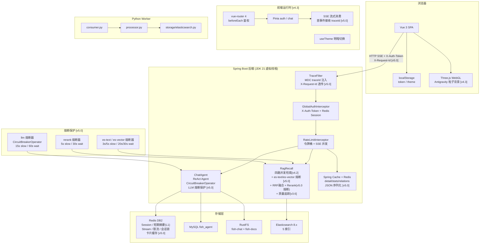
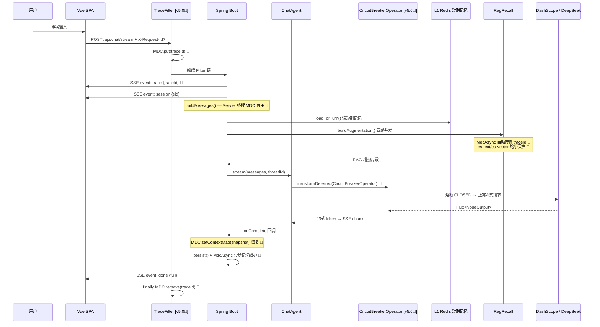
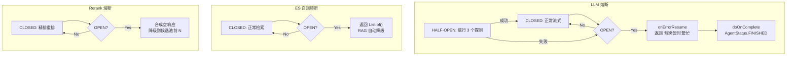
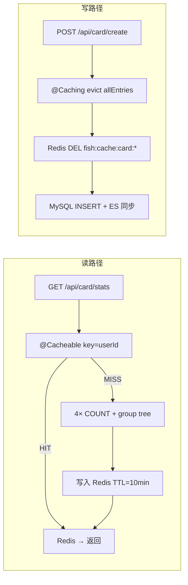

# Fish-Agent v5 全景文档

> 项目路径：`D:\1_Backend\Fish-Agent`
> 覆盖版本：**v2.0 ~ v2.6 + v3.0 ~ v3.6 + v4.0 ~ v4.3 + v5.0**（v1 → v1.3 → v2.0 → ... → v2.6 → v3.0 后端模块重构 → v3.1 短期记忆三级读穿写穿 → v3.2 Worker 心跳与 Embedding 重试 → v3.3 多格式文档解析 + OCR 文本清洗 → v3.4 RAG 检索重排序 → v3.5 知识加工精切 → v3.6 查询理解与检索闭环 → v4.0 前端视觉重设计 → v4.1 知识卡片系统 → v4.2 知识卡片闭环与切片可视化 → v4.3 Antigravity 风格动态粒子背景 & 前端极简重设计 → **v5.0 后端工程化提升（全链路 MDC TraceId + 知识卡片 Redis 缓存 + Resilience4j 熔断保护）**）
> 后端 Java 源文件约 **148** 个（+8 新增），`frontend/src` 下 TS/Vue 约 **42** 个，Python Worker 约 **21** 个文件。

**分文档索引**

- [v2 全景文档](../v2/v2-全景文档-20260505.md) — v2.x 全景（含 v2.0 ~ v2.6 增量索引）
- [v3 全景文档](../v3/v3-全景文档-20260512.md) — v3.x 全景（含 v3.0 ~ v3.6 增量索引）
- [v4.0-前端视觉重设计](../v4/v4.0-前端视觉重设计-20260606.md)
- [v4.1-知识卡片系统](../v4/v4.1-知识卡片系统-20260606.md)
- [v4.2-知识卡片闭环与切片可视化](../v4/v4.2-知识卡片闭环与切片可视化-20260607.md)
- [v4.3-Antigravity风格动态粒子背景与前端极简重设计](../v4/v4.3-Antigravity风格动态粒子背景与前端极简重设计-20260608.md)
- **[v5.0-后端工程化提升](v5.0-后端工程化提升-20260608.md) — v5.0 增量记录（链路追踪 + 缓存 + 熔断器）**
- [Redis常量名速查](../速查文档/Redis常量名速查.md)
- [数据库速查](../速查文档/数据库速查.md)
- [向量库速查](../速查文档/向量库速查.md)
- [ES 索引 DDL](../../database/es/es.txt)
- [MySQL 建表语句](../../database/sql/fish_agent.sql)
- [Python Worker 说明](../../python/README.md)

---

## 一、项目定位

Fish-Agent 是基于 **Spring Boot 3.5 + Spring AI Alibaba ReAct** 的全栈智能体应用。

**核心能力链**：登录鉴权 → **`TraceFilter` 全链路 traceId 注入 [v5.0]** → **`/api/chat/**` Redis 令牌桶 + SSE 并发限流** → **同 `sessionId` Redis 互斥（v2.4，防双击竞态）** → 多轮对话（SSE 流式）→ **三级短期记忆（v3.1：L1 Redis → L2 对象存储快照 → L3 全量正文，热路径只读 Redis）** / 长期事实抽取（v2.4，**v3.6：写入前 embedding 余弦查重**）→ **四路 ES RAG 检索（v4.2：记忆 + 文档 + 知识卡片 + 公共知识，v5.0：es-text/es-vector 熔断保护）→ LLM 语义查询分解（v3.6）→ RRF 分数融合 + DashScope Rerank 精排（v3.4，v5.0：rerank 熔断保护）** → 工具调用。**RAG 全链路质量追踪异步写 ES（v3.6）**。

**LLM 调用保护 [v5.0]**：`ChatAgent.stream()` 通过 `CircuitBreakerOperator` 包裹 `Flux<NodeOutput>`，DashScope API 持续故障时自动熔断，返回固定降级提示；半开状态放行探测请求，成功后自动恢复。

**知识卡片闭环（v4.1 → v4.2）**：**AI 自动提取**（LLM 分析对话 → pending 卡片 + 内部/外部关联）+ **手动创建** → **即时预览确认** → **关键词实体系统** → **树形分组层级（v4.2）** → **4 种 relation_type 关联** → **vis-network 力导向图谱** → **多信号智能关联发现**。MySQL + ES 双写，confirmed 卡片**参与四路 RAG recall（v4.2）**。**Redis 多级缓存 [v5.0]：`@Cacheable` 缓存 detail/stats/relations，`@CacheEvict` 写路径驱逐，JSON 序列化 record VO，`transactionAware` 防回滚误清。**

**对话模型路由**：支持 **DashScope**（阿里云通义）/ **Ollama**（本地）/ **DeepSeek**（OpenAI-compatible）三路可选。

**知识库闭环**：前端上传 → Java 写入 RustFS + MySQL + Redis Stream → Python Worker 异步消费 → 多格式解析 → 文本清洗 → 结构化分块 → embedding 向量化 → ES 批量写入 → 切片可视化。

**前端**：Vue 3 + Three.js WebGL Antigravity 粒子背景 + Modern Minimalist Monochrome 配色（详见 [v4.3 文档](../v4/v4.3-Antigravity风格动态粒子背景与前端极简重设计-20260608.md)）。

---

## 二、全链路架构



---

## 三、技术栈

### 3.1 后端 (Java)

| 分层 | 技术 | 说明 |
|------|------|------|
| 运行时 | JDK 21 | 虚拟线程 `spring.threads.virtual.enabled=true` |
| 框架 | Spring Boot 3.5.13 | 自动配置 + `@ConfigurationProperties` |
| AI 引擎 | Spring AI Alibaba 1.1.2 | ReAct Agent + `ModelCallLimitHook` |
| AI BOM | Spring AI BOM 1.1.4 | Chat / Embedding SPI |
| 模型路由 | DashScope / Ollama / DeepSeek | `fish.llm.chat-provider` / `embedding.provider` |
| 持久层 | MyBatis-Plus 3.5 | 9 张业务表 |
| 缓存 | Redis (Lettuce) | DB2：Session + 短期摘要(L1) + Stream + 限流 + 会话互斥 + **应用数据缓存 [v5.0]** |
| 应用缓存 | **Spring Cache + RedisCacheManager [v5.0]** | JSON 序列化 record VO / TTL 分级 / transactionAware / CacheErrorHandler 降级 |
| 检索引擎 | Elasticsearch 8.x | 五索引 |
| 对象存储 | MinIO (RustFS) | fish-chat + fish-docs |
| **熔断器** | **Resilience4j 2.2.0 [v5.0]** | `resilience4j-spring-boot3` + `circuitbreaker` + `reactor`；4 个熔断实例 + `CircuitBreakerOperator` 响应式保护 |
| **链路追踪** | **SLF4J MDC + TraceFilter [v5.0]** | `OncePerRequestFilter` + `MdcAsync` 异步传播 + `logback-spring.xml`；Reactor/SSE 回调手动恢复 |
| 安全 | spring-security-crypto | BCrypt 密码哈希 |
| 工具库 | Lombok, Jsoup, JUnit 5 | — |

### 3.2 Python Worker

（同 v4，无变化）

### 3.3 前端

（同 v4.3，无变化）

---

## 四、后端源码目录（v5.0 更新标记 🔺）

```
src/main/java/com/yuyu/fishagent/
├── FishAgentApplication.java                   @SpringBootApplication + @MapperScan
│
├── agent/                                      Agent 核心
│   ├── BaseAgent.java                          抽象基类
│   ├── ChatAgent.java                          ReAct Agent + CircuitBreakerOperator 熔断 [v5.0🔺]
│   ├── AgentStatus.java                        原子状态枚举
│   ├── config/AgentProperties.java + ToolProperties.java
│   └── tool/builtin/ + tool/external/
│
├── chat/                                       对话模块
│   ├── ChatController.java                    SSE 首事件推 traceId [v5.0🔺]
│   ├── ChatService.java                       MDC 快照捕获 + Reactor/SSE 回调恢复 + MdcAsync [v5.0🔺]
│   └── ...
│
├── rag/                                        RAG + 知识库模块
│   ├── pipeline/
│   │   ├── recall/
│   │   │   ├── RagRecall.java                 safeTextSearch/safeVectorSearch 熔断 + MdcAsync [v5.0🔺]
│   │   │   ├── RagRecallConfiguration.java    CircuitBreakerHelper 注入 [v5.0🔺]
│   │   │   └── ...Searcher.java               × 4
│   │   ├── rerank/
│   │   │   └── DashScopeRagReranker.java      rerank 熔断 + 合成空响应降级 [v5.0🔺]
│   │   ├── expand/
│   │   │   ├── RagQueryExpand.java            MdcAsync [v5.0🔺]
│   │   │   └── RagHydeService.java            MdcAsync [v5.0🔺]
│   │   └── tracing/
│   │       └── RagQualityLogger.java          MdcAsync [v5.0🔺]
│   └── ...
│
├── card/                                        知识卡片模块 [v4.1, v4.2]
│   ├── service/
│   │   ├── KnowledgeCardService.java          @Cacheable + @Caching(evict) × 11 [v5.0🔺]
│   │   ├── CardExtractService.java            extractFromSession @Caching(evict) [v5.0🔺]
│   │   └── ...
│   └── ...
│
├── common/                                     共享基础设施
│   ├── cache/                                  🔺 v5.0 新增
│   │   ├── CacheConstants.java                缓存名 + Redis 前缀 + SpEL key 常量
│   │   └── RedisCacheConfig.java              @EnableCaching + JSON序列化 + TTL + transactionAware + CacheErrorHandler
│   ├── trace/                                  🔺 v5.0 新增
│   │   ├── TraceConstants.java                MDC key / Header 名 / SSE 事件名
│   │   ├── TraceFilter.java                   OncePerRequestFilter + @Order(HIGHEST_PRECEDENCE)
│   │   └── MdcAsync.java                      8 静态方法：自动/显式快照 × supplyAsync/runAsync/wrap*
│   ├── resilience/                             🔺 v5.0 新增
│   │   ├── ResilienceConstants.java           熔断器名常量 + 降级文案
│   │   ├── ResilienceConfig.java              事件日志（状态变更 + 错误 + 动态实例监听）
│   │   └── CircuitBreakerHelper.java          同步熔断执行（executeSupplier + 降级值）
│   ├── exception/
│   │   ├── GlobalExceptionHandler.java
│   │   └── SessionLockedException.java
│   ├── ratelimit/RateLimitService.java
│   ├── config/WebMvcConfig.java + ...
│   └── dto/ChatMessageDTO.java
│
├── auth/ / memory/ / llm/                      （无变化）
└── ...
```

---

## 五、新增资源文件 [v5.0]

```
src/main/resources/
├── application.yml              +resilience4j.circuitbreaker 配置块（4 个实例）
└── logback-spring.xml           🔺 新增：pattern 含 %X{traceId:-} + AsyncAppender
```

---

## 六、新增测试文件 [v5.0]

```
src/test/java/com/yuyu/fishagent/
├── common/
│   ├── trace/
│   │   ├── TraceFilterTest.java              Header 透传 / 自动生成 / MDC 清理
│   │   └── MdcAsyncTest.java                 显式快照 / worker 清理 / 无 Executor 重载
│   └── cache/
│       ├── KnowledgeCardCacheAnnotationTest.java  @Cacheable cacheName+key / 8 写方法 @Caching / ExtractService
│       └── RedisCacheConfigTest.java              TTL / key prefix / errorHandler
└── rag/pipeline/rerank/
    └── RagRerankerTest.java (增量)           CB OPEN → fallback 立即返回
```

---

## 七、关键流程

### 7.1 对话完整链路（v5.0 更新标记 🔺）



### 7.2 熔断降级链路 [v5.0]



### 7.3 缓存读写链路 [v5.0]



---

## 八、数据模型

（同 v4，无表结构变化。v5.0 全部为应用层改动：缓存/追踪/熔断，不涉及 DDL。）

### 8.1 Redis Key 空间（v5.0 更新）

| Key 前缀 | 用途 | 版本 |
|----------|------|------|
| `fish:session` | 登录 token → 用户信息映射 | v2 |
| `fish:memory` | L1 对话摘要 + 滑动窗口 | v3.1 |
| `fish:ratelimit:` | 令牌桶 + SSE 并发计数 | v2.3 |
| `fish:mutex:session:` | 同一会话防并发流式 | v2.4 |
| **`fish:cache:card:`** | **知识卡片 detail/stats/relations 缓存（JSON 序列化 record VO）** | **v5.0** |

### 8.2 Elasticsearch 索引

（同 v4，5 索引无变化）

---

## 九、面试亮点总结

### v5.0 新增面试话题

| 话题 | 核心点 |
|------|--------|
| **链路追踪** | MDC + TraceFilter + MdcAsync 异步传播 + Reactor/SSE 回调手动恢复。单体为什么不用 SkyWalking。SSE 长连接 MDC 生命周期。 |
| **多级缓存** | Spring Cache + Redis。Java record JSON 序列化。SpEL key 含 userId 防越权。`transactionAware` 防回滚误清。`CacheErrorHandler` 降级。`allEntries` 简化 vs 精确清除 trade-off。 |
| **熔断器** | Resilience4j + `CircuitBreakerOperator` 保护 Flux 流式。为什么不用 `@CircuitBreaker` 注解。编排层 vs 实现层。4 个熔断实例参数调优。降级策略（LLM 固定提示 / ES 空列表 / Rerank 候选池前 N）。 |

### 历史面试话题（v2 ~ v4）

| 版本 | 话题 |
|------|------|
| v2.3 | Redis Lua 令牌桶限流 |
| v2.4 | SSE 会话互斥锁（防双击竞态） |
| v3.1 | 短期记忆三级读穿写穿（L1 Redis → L2 RustFS 快照 → L3 全量正文） |
| v3.2 | Worker 心跳 + Embedding 指数退避重试 |
| v3.4 | RRF 分数融合 + DashScope Rerank 精排 + 降级 |
| v3.5 | 结构化分块（Title+Text / Table 差异化 + 句子边界） |
| v3.6 | LLM 语义查询分解 + embedding 余弦查重 + RAG 质量追踪 |
| v4.1 | 知识卡片 AI 提取 + 关键词实体系统 + vis-network 图谱 |
| v4.2 | 四路 RAG recall + 分组层级 + 切片可视化 + 双向桥接 |

---

## 十、版本历史

| 版本 | 日期 | 主题 |
|------|------|------|
| v1.0 ~ v1.3 | 2025-04 | 项目初始化：登录鉴权 + 对话 + 知识库上传 + ES 检索 |
| v2.0 ~ v2.6 | 2025-05 | 后端工程化：限流 + 会话互斥 + 对话持久化 + 长期记忆 + MinIO |
| v3.0 ~ v3.6 | 2025-05 | 后端模块重构：短期记忆三级 + Worker 心跳 + 多格式解析 + RAG 精排 + 查询闭环 |
| v4.0 | 2026-06-06 | 前端视觉重设计：粒子背景 + 毛玻璃 + 抽屉侧栏 |
| v4.1 | 2026-06-06 | 知识卡片系统：AI 提取 + CRUD + 关键词 + 图谱 + 关联发现 |
| v4.2 | 2026-06-07 | 知识卡片闭环：分组层级 + RAG 四路召回 + 复习 + 切片可视化 |
| v4.3 | 2026-06-08 | Antigravity 风格粒子背景 + Monochrome 配色 + Canvas Logo |
| **v5.0** | **2026-06-08** | **后端工程化提升：全链路 MDC TraceId + 知识卡片 Redis 缓存 + Resilience4j 熔断保护** |
