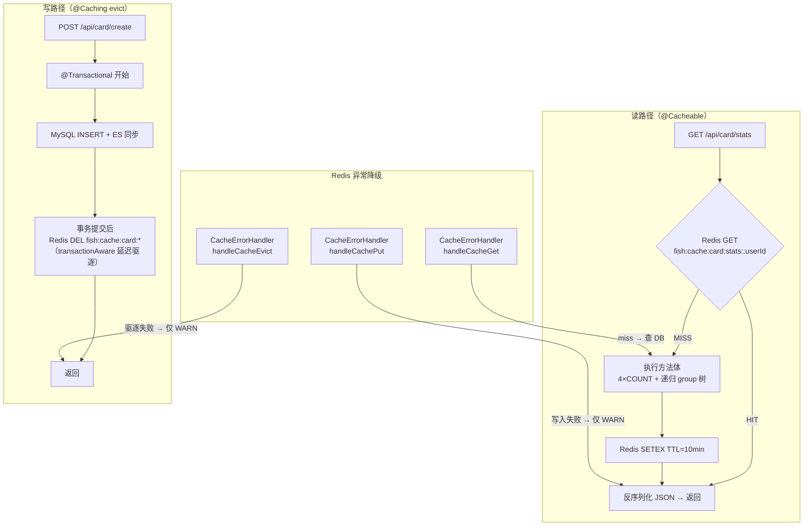
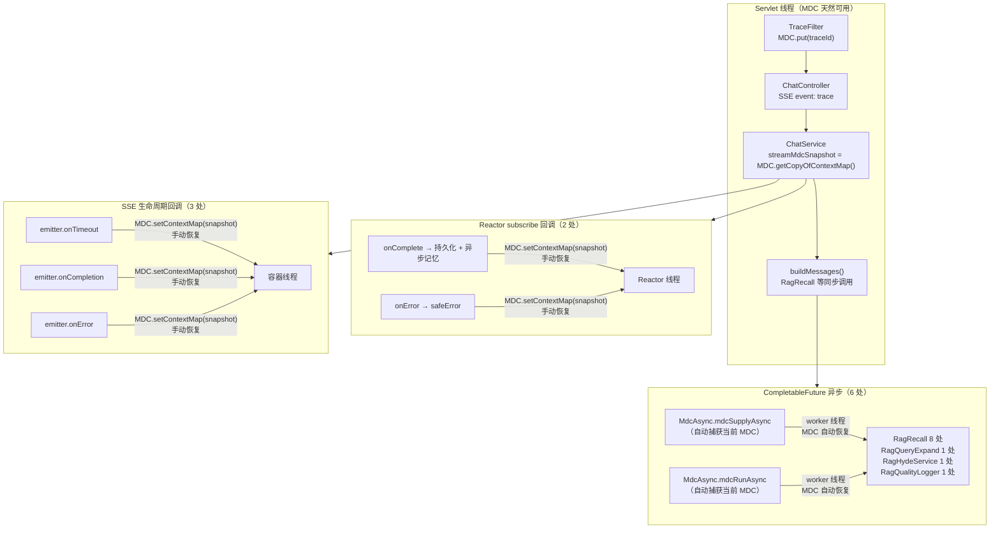
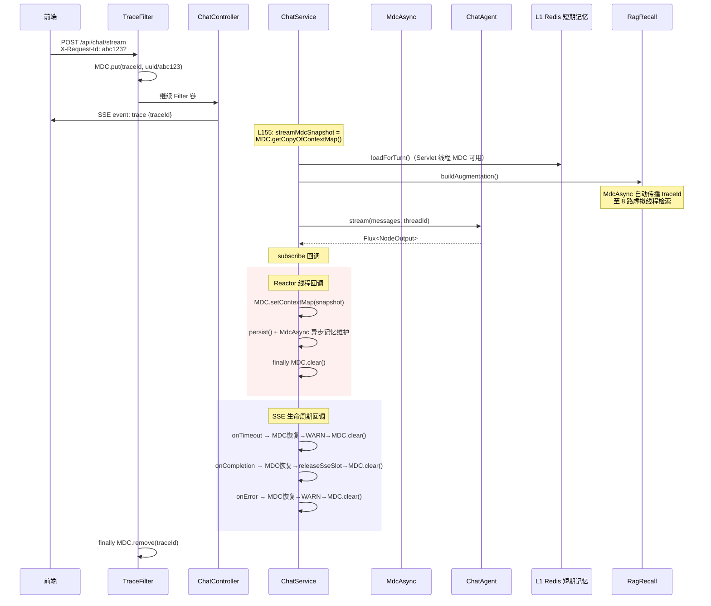

# Fish-Agent v5.0 后端工程化提升

> **版本**：v5.0
> **日期**：2026-06-08
> **范围**：全链路追踪（MDC TraceId）· 知识卡片多级缓存 · 外部服务熔断保护
> **前置版本**：v4.3（Antigravity 风格动态粒子背景 & 前端极简重设计）
> **后端 Java 源文件约 148 个**（+8 新增）

---

## 一、更新目标

v4 完成了知识卡片闭环与前端视觉重设计，系统在功能层面已较为完备。但作为面试项目，后端**生产级工程化**存在三个明显短板：

| 短板 | 影响 |
|------|------|
| 零缓存 | `detail()` 每次打 4 次子查询；`stats()` 每次打 4 个 COUNT + 递归 group 树 |
| 无链路追踪 | 50+ 并发请求下日志无法按请求串联，排障靠人肉 grep |
| 无熔断保护 | DashScope/ES 挂了 → 所有请求超时等待 → 虚拟线程池积压 → 雪崩 |

**目标**：在不改变业务逻辑的前提下，补齐这三个工程化能力，使系统从「能跑」升级到「能观测、能自保」。

---

## 二、方案 A — 知识卡片多级缓存

### 2.1 设计概要

| 项 | 内容 |
|----|------|
| 缓存框架 | Spring Cache (`@Cacheable` / `@CacheEvict`) + Redis |
| 缓存目标 | `detail(id)` · `stats()` · `allRelations()` |
| Key 设计 | `fish:cache:card:{cacheName}::{userId}:{业务key}` |
| 序列化 | `GenericJackson2JsonRedisSerializer`（JSON，Java record 不实现 Serializable） |
| TTL | detail/stats = 10min, relations = 5min |
| 驱逐策略 | 写操作 → `allEntries = true`（简化实现，写低频可接受） |
| Redis 降级 | `CacheErrorHandler` 吞掉 Redis 异常，读 miss → 查 DB，写/驱逐失败 → 日志 |

### 2.2 Key 安全设计

`detail()` 方法内含 `findOwnedCardOrForbidden(userId, id)` 权限校验。`@Cacheable` 命中时**跳过方法体**，即权限校验被绕过。解决方案：**将 userId 编入缓存 key**。

```
key = T(UserContextHolder).currentUserIdOrNull() + ':' + #id
用户 A 查卡片 123 → cache key = A:123 → 缓存命中 → 同一用户，安全
用户 B 查卡片 123 → cache key = B:123 → cache miss → 权限校验 → 403
```

### 2.3 事务感知驱逐

`RedisCacheManager.transactionAware()` 让 `@CacheEvict` 延迟到事务提交后执行。避免写操作驱逐缓存后事务回滚导致缓存被误清。

### 2.4 写路径覆盖

| 写操作 | 驱逐 | Plan 中未列出的补充 |
|--------|------|------|
| `create` / `update` / `delete` | `@Caching(evict = {detail, stats, relations})` | — |
| `batchConfirm` / `batchReject` | 同上 | — |
| `merge` | 同上 | — |
| `addRelation` / `deleteRelation` | 同上 | — |
| `CardExtractService.extractFromSession` | 同上 | ✅ 方案外补充：AI 提取创建 pending 卡片 + 关联 |

### 2.5 缓存读写链路



### 2.6 新增/修改文件

```
新增:
  common/cache/CacheConstants.java            — 缓存名 + Redis 前缀 + SpEL key 常量
  common/cache/RedisCacheConfig.java          — @EnableCaching + JSON 序列化 + TTL + transactionAware + CacheErrorHandler

修改:
  card/service/KnowledgeCardService.java      — 3 个 @Cacheable + 8 个 @Caching(evict)
  card/service/CardExtractService.java        — extractFromSession + @Caching(evict)
```

### 2.6 面试 Trade-off

> **Q：为什么选 Redis 缓存而不是 Caffeine 本地缓存？**
> A：知识卡片是用户隔离的。本地缓存多实例不一致；Redis 集中式保证一致性。代价是多 ~0.5ms RTT，比起省掉的 4 次 MySQL 查询（~8-15ms），净收益显著。

> **Q：`allEntries=true` 不是会清除所有用户的缓存吗？**
> A：个人项目用户量小，写操作低频（每分钟可能不到 1 次），全清后重建成本可接受。如果未来用户量增长，改为自定义 `KeyGenerator` 按 userId 精确清除。

---

## 三、方案 B — 全链路追踪（MDC TraceId）

### 3.1 设计概要

| 项 | 内容 |
|----|------|
| 追踪方式 | MDC (SLF4J) + traceId，不引入 SkyWalking/Zipkin |
| 入口 | `TraceFilter`（`OncePerRequestFilter`），`@Order(HIGHEST_PRECEDENCE)` |
| traceId 来源 | 请求头 `X-Request-Id`（前端/网关传入）或自动生成 32 位 UUID |
| 日志格式 | `%d{HH:mm:ss.SSS} [%thread] [%X{traceId:-}] %-5level %logger{36} - %msg%n` |
| 异步传播 | `MdcAsync` 工具类 + 显式 `Map<String,String>` 快照重载 |
| SSE 支持 | 首事件 `event: trace` 推给前端；Reacto 回调 + SSE 生命周期回调手动恢复 MDC |

### 3.2 异步传播点（3 类，11 处）

| 类型 | 数量 | 传播方式 |
|------|------|---------|
| CompletableFuture 异步 | 6 处 | `MdcAsync.mdcSupplyAsync` / `mdcRunAsync`（自动捕获当前 MDC） |
| Reactor subscribe 回调 | 2 处 | `MDC.setContextMap(streamMdcSnapshot)` / `MDC.clear()` 手动恢复 |
| SSE 生命周期回调 | 3 处 | 同上（onTimeout / onCompletion / onError） |

### 3.3 MDC 异步传播全景



### 3.4 SSE 场景的 MDC 生命周期

```
HTTP POST /api/chat/stream
  │ TraceFilter: MDC.put(traceId) → ChatController → ChatService
  │   L155: streamMdcSnapshot = MDC.getCopyOfContextMap()    ← 入口快照
  │   buildMessages() → RagRecall (MdcAsync 自动传播)       ← Servlet 线程，MDC 可用
  │   chatAgent.stream().subscribe(...)
  │     ├── onComplete 回调  → MDC.setContextMap(snapshot)   ← Reactor 线程，手动恢复
  │     └── onError 回调     → MDC.setContextMap(snapshot)   ← Reactor 线程，手动恢复
  │   emitter.onTimeout/onCompletion/onError                 ← 容器线程，手动恢复
  │ TraceFilter: finally MDC.remove(traceId)                 ← Servlet 线程清理
```

### 3.4 新增/修改文件

```
新增:
  common/trace/TraceConstants.java            — MDC key / Header 名 / SSE 事件名
  common/trace/TraceFilter.java               — @Component + @Order(HIGHEST_PRECEDENCE) + X-Request-Id 透传
  common/trace/MdcAsync.java                  — 8 个静态方法：自动/显式快照 × supplyAsync/runAsync/wrapSupplier/wrapRunnable
  resources/logback-spring.xml                — %X{traceId:-} + AsyncAppender(1024, neverBlock)

修改:
  chat/ChatController.java                    — SSE 首事件 event: trace
  chat/ChatService.java                       — MDC 快照捕获 + Reactor 回调恢复 + SSE 回调恢复 + MdcAsync 替换
  rag/pipeline/recall/RagRecall.java          — 8 处 supplyAsync → MdcAsync
  rag/pipeline/expand/RagQueryExpand.java     — 1 处 supplyAsync → MdcAsync
  rag/pipeline/expand/RagHydeService.java     — 1 处 supplyAsync → MdcAsync
  rag/tracing/RagQualityLogger.java           — 1 处 runAsync → MdcAsync
```

### 3.6 链路追踪全链路时序



### 3.7 面试 Trade-off

> **Q：为什么不用 SkyWalking / Zipkin？**
> A：单体应用，所有调用在一个 JVM 内，MDC + traceId 零侵入、零部署、grep 即可串联。`X-Request-Id` header 已预留，未来拆微服务可平滑迁移到 Micrometer Tracing + Zipkin。

> **Q：SSE 长连接的 MDC 怎么处理？**
> A：两类异步场景区分处理：CompletableFuture 用 `MdcAsync` 自动传播；Reactor/SSE 回调用入口快照手动恢复。整个 SSE 生命周期内 traceId 都能传播——包括持久化失败、流式异常、SSE 超时这些关键排障路径。

---

## 四、方案 C — 外部服务熔断保护

### 4.1 设计概要

| 项 | 内容 |
|----|------|
| 框架 | Resilience4j 2.2.0 + `resilience4j-spring-boot3` 自动配置 |
| 熔断实例 | `llm` / `es-text` / `es-vector` / `rerank` |
| LLM 特殊处理 | `CircuitBreakerOperator`（reactive），不能用 `@CircuitBreaker` 注解 |
| 放置层级 | 编排层（RagRecall.safeXxxSearch / DashScopeRagReranker / ChatAgent），非实现层 |
| Registry 来源 | `resilience4j-spring-boot3` 自动创建（非手动），YAML 配置全部生效 |

### 4.2 四个熔断器参数

| 熔断器 | 保护对象 | slow-call-duration | wait-duration-in-open | 降级行为 |
|--------|---------|-------------------|----------------------|---------|
| `llm` | ChatAgent LLM 流式调用 | 15s（time-to-first-token） | 60s | 固定提示"服务暂时繁忙" |
| `es-text` | 所有 ES 文本查询 | 3s | 20s | 空列表（跳过文本召回） |
| `es-vector` | 所有 ES 向量查询 + Embedding | 5s | 30s | 空列表（只走文本腿） |
| `rerank` | DashScope Reranker | 5s | 30s | 跳过精排，RRF 候选池前 N |

通用参数：`failure-rate-threshold=50`, `slow-call-rate-threshold=80`, `sliding-window-size=10`, `minimum-number-of-calls=5`, `permitted-number-of-calls-in-half-open-state=3`

### 4.3 LLM 响应式熔断 — 为什么必须用 CircuitBreakerOperator

`ChatAgent.stream()` 返回 `Flux<NodeOutput>`。`@CircuitBreaker` 基于同步调用模型，只保护方法调用本身（Flux 对象创建），不保护后续的流式数据传输。必须使用 `resilience4j-reactor` 的 `CircuitBreakerOperator` 作为 Flux operator：

```java
reactAgent.stream(messages, config)
    .transformDeferred(CircuitBreakerOperator.of(llmCircuitBreaker))  // 订阅时检查 CB 状态
    .onErrorResume(CallNotPermittedException.class, e -> fallbackStream())  // CB 开 → 降级
    .doOnComplete(() -> transitionTo(AgentStatus.FINISHED))
    .doOnError(e -> { transitionTo(AgentStatus.ERROR); })
```

### 4.4 编排层 vs 实现层

Embedding 调用分散在 3 个 Searcher 类里。如果在每个 Searcher 各加熔断器：
- 3 个独立状态机，状态不一致（用户记忆的熔断了但卡片没熔断）
- 配置冗余（3 套阈值）

**统一放 `RagRecall.safeTextSearch/safeVectorSearch`**：所有同类查询共享一个熔断器，状态一致、配置统一。

### 4.5 Reranker 熔断降级链路

```
CB OPEN → executeRerankRequest 返回 {"output":{"results":[]}}
  → extractResults → 空
  → "DashScope Rerank 返回空结果，降级到融合候选池"
  → fallback (candidates 前 topN)
```

熔断降级复用了现有的 fallback 路径，无需额外逻辑分支。

### 4.6 熔断状态转换与降级全景

```mermaid
flowchart TD
    subgraph StateMachine["CircuitBreaker 状态机"]
        CLOSED["CLOSED<br/>正常放行<br/>滑动窗口统计"]
        OPEN["OPEN<br/>直接拒绝<br/>返回降级值"]
        HALF["HALF-OPEN<br/>放行 3 个探测请求"]
    end

    CLOSED -->|"失败率 ≥ 50%<br/>或慢调用率 ≥ 80%"| OPEN
    OPEN -->|"wait-duration 到期<br/>llm=60s / es=20-30s"| HALF
    HALF -->|"探测成功"| CLOSED
    HALF -->|"探测失败"| OPEN

    subgraph LLM_CB["llm 熔断器"]
        L_REQ["ChatAgent.stream()"]
        L_OP["CircuitBreakerOperator<br/>transformDeferred"]
        L_OK["Flux 正常流式"]
        L_FALL["fallbackStream()<br/>'服务暂时繁忙'"]
        L_REQ --> L_OP
        L_OP -->|CLOSED| L_OK
        L_OP -->|OPEN<br/>CallNotPermittedException| L_FALL
    end

    subgraph ES_CB["es-text / es-vector 熔断器"]
        E_REQ["safeTextSearch /<br/>safeVectorSearch"]
        E_OP["CircuitBreakerHelper<br/>executeSupplier"]
        E_OK["ES 正常检索结果"]
        E_FALL["List.of() 空列表<br/>RAG 自动降级"]
        E_REQ --> E_OP
        E_OP -->|CLOSED| E_OK
        E_OP -->|OPEN| E_FALL
    end

    subgraph RERANK_CB["rerank 熔断器"]
        R_REQ["DashScopeRagReranker<br/>executeRerankRequest"]
        R_OP["CircuitBreakerHelper<br/>executeSupplier"]
        R_OK["qwen3-rerank 精排结果"]
        R_FALL["合成空响应<br/>→ extractResults 为空<br/>→ 降级到候选池前 N"]
        R_REQ --> R_OP
        R_OP -->|CLOSED| R_OK
        R_OP -->|OPEN| R_FALL
    end
```



### 4.7 新增/修改文件

```
新增:
  common/resilience/ResilienceConstants.java  — 熔断器名常量 + 降级文案
  common/resilience/ResilienceConfig.java     — 事件日志（onStateTransition + onError + onEntryAdded 动态监听）
  common/resilience/CircuitBreakerHelper.java — 同步熔断执行工具（executeSupplier + CallNotPermittedException 降级）

修改:
  pom.xml                                     — +3 resilience4j 依赖
  application.yml                             — +resilience4j.circuitbreaker 配置块
  agent/ChatAgent.java                        — CircuitBreakerOperator + onErrorResume + fallbackStream
  rag/pipeline/recall/RagRecall.java          — safeTextSearch/safeVectorSearch 接入 CB
  rag/pipeline/recall/RagRecallConfiguration.java — CircuitBreakerHelper 注入
  rag/pipeline/rerank/DashScopeRagReranker.java   — rerank 接入 CB
```

### 4.7 面试 Trade-off

> **Q：为什么用熔断器而不是简单重试？**
> A：重试解决瞬时抖动，但面对持续性故障（API 限流、服务宕机），重试加剧问题。熔断器核心价值是**快速失败 + 自动恢复**：检测到 50% 失败率后直接拦截后续请求，等 30-60s 后放探测请求。LLM 流式响应刻意不加重试：重试导致重复 token 或连接异常。

> **Q：Resilience4j 和 Sentinel 怎么选？**
> A：Resilience4j 原生支持 Reactor（`CircuitBreakerOperator`），Sentinel 对响应式支持是后加的。Resilience4j 函数式 API 无代理无字节码增强，与 Spring AI Alibaba ReactAgent 不冲突。

---

## 五、实施顺序与依赖关系

```
实际顺序: B(链路追踪) → A(缓存) → C(熔断器)

B 最先：所有日志带 traceId，后续调试/验证效率倍增
A 其次：改动小、见效快（直接减少 DB 查询）
C 最后：改动面最大（+3 依赖 + 改 Agent 调用链），B/A 日志基础先打好

无硬依赖：三个方案互不阻塞，可并行实施
```

---

## 六、测试覆盖

| 方案 | 测试文件 | 测试点 |
|------|---------|--------|
| B 链路追踪 | `TraceFilterTest` | Header 透传 / 自动生成 / MDC 清理 |
| B 链路追踪 | `MdcAsyncTest` | 显式快照传播 / worker 线程清理 / 无 Executor 重载 |
| A 缓存 | `KnowledgeCardCacheAnnotationTest` | 3 个 @Cacheable cacheName+key / 8 个写方法 @Caching / CardExtractService 驱逐 |
| A 缓存 | `RedisCacheConfigTest` | TTL / key prefix / errorHandler 存在性 |
| C 熔断 | `RagRerankerTest` (增量) | CB OPEN → fallback 立即返回 |

---

## 七、Redis Key 空间更新

| Key 前缀 | 用途 | 版本 |
|----------|------|------|
| `fish:session` | 登录 token → 用户信息映射 | v2 |
| `fish:memory` | L1 对话摘要 + 滑动窗口 | v3.1 |
| `fish:ratelimit:` | 令牌桶 + SSE 并发计数 | v2.3 |
| `fish:mutex:session:` | 同一会话防并发流式 | v2.4 |
| **`fish:cache:card:`** | **知识卡片 detail/stats/relations 缓存** | **v5.0** |
