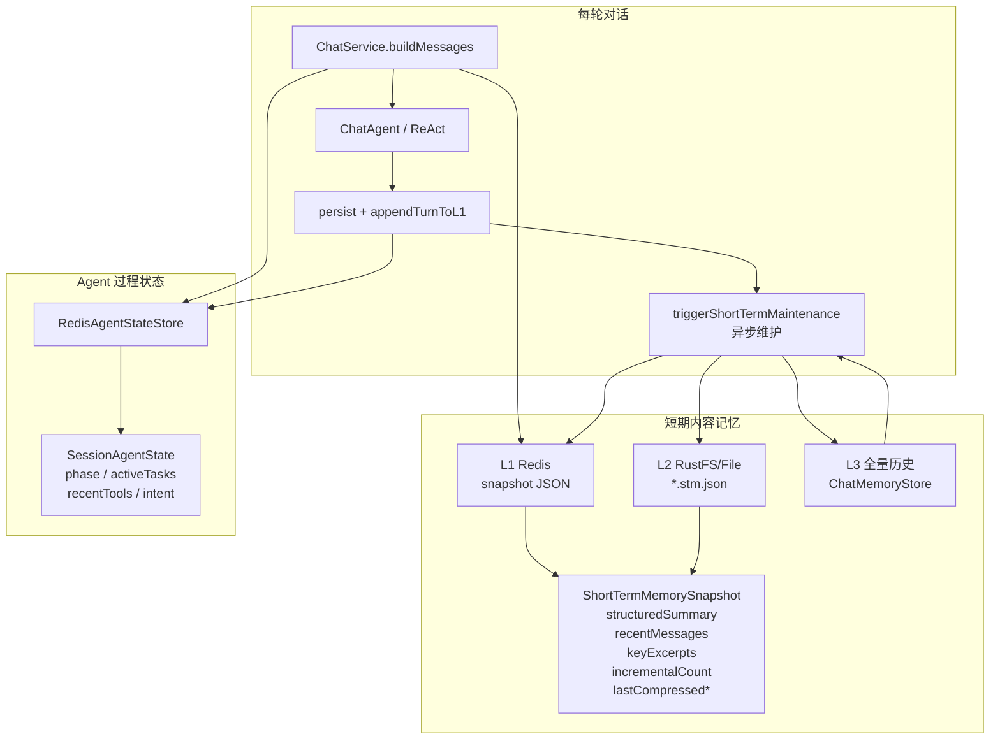
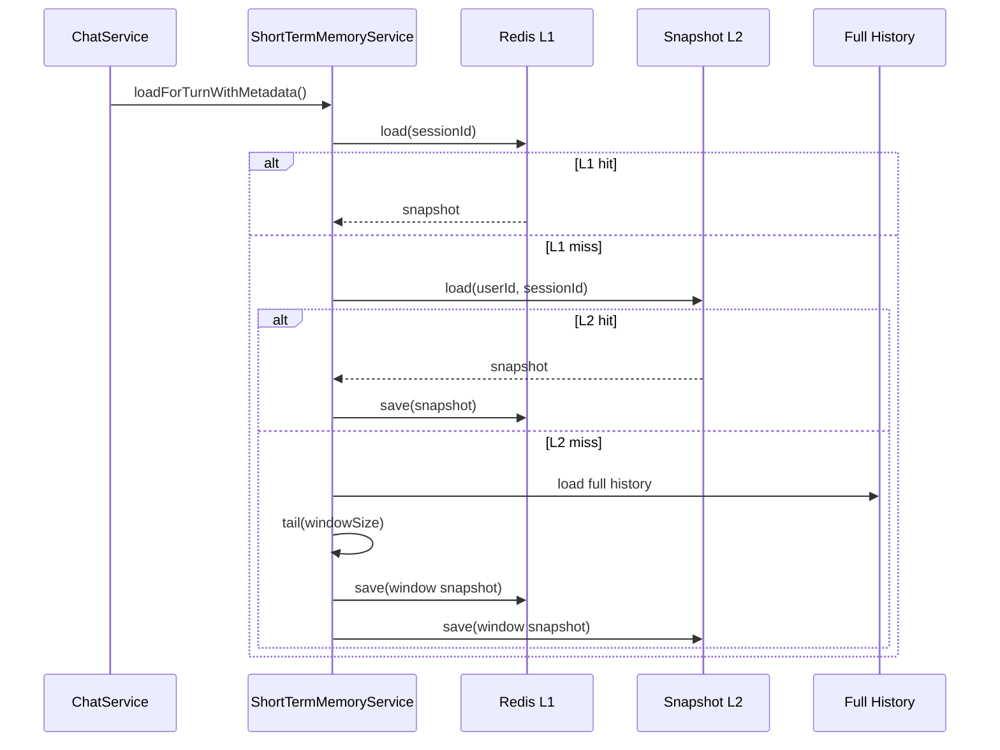
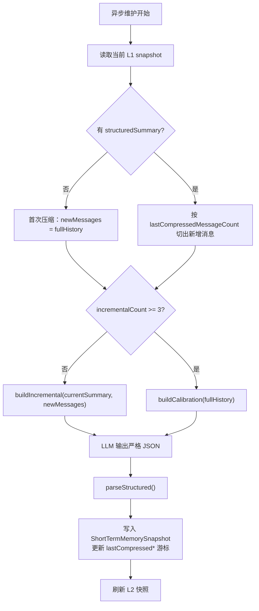
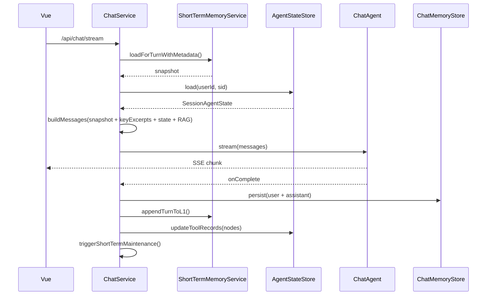
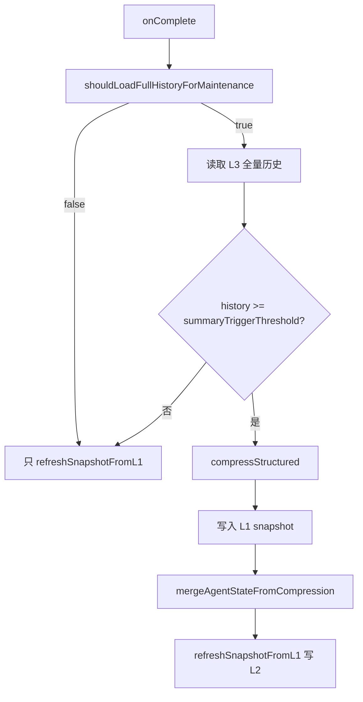

# Fish-Agent v5.3 短期记忆增强与 Agent 状态记录

> **版本**：v5.3
> **日期**：2026-06-11
> **范围**：工具结果治理 · 冷启动异步化 · 结构化短期记忆 · 增量压缩游标 · Agent 状态记录 · Redis/L2 快照兼容
> **前置版本**：v5.2（前端交互细节优化）
> **后端增量**：新增短期记忆结构化模型、Agent 状态 SPI、统一文本截断工具；改造 ChatService、MemoryCompressionService、短期记忆存储与工具注册链路

---

## 一、更新目标

v3.1 已经完成了短期记忆三级读穿写穿：L1 Redis 热窗口、L2 对象存储快照、L3 全量历史兜底。v5.3 在这条链路上继续解决三个问题：

| 痛点 | 影响 | v5.3 处理 |
|------|------|-----------|
| 工具返回过长 | ReAct 上下文被网页/文件原文挤占，模型容易复述原文 | `ToolRegistry` 统一截断，提示模型先提取关键信息 |
| 冷会话同步压缩 | L1/L2 未命中且历史较长时，首字被压缩调用阻塞 | 冷启动先返回窗口，压缩放到对话完成后的异步维护 |
| 纯文本摘要难维护 | 摘要无法按话题/实体/意图更新，增量压缩容易重复消费旧历史 | `StructuredSummary` + `KeyExcerpt` + 压缩游标 |
| Agent 过程状态丢失 | 模型只记得“聊过什么”，不记得“正在做什么” | 独立 `SessionAgentState` 记录阶段、任务、近期工具 |

目标不是新增一条记忆链路，而是把现有短期记忆从“纯文本摘要 + 窗口”升级为“结构化摘要 + 关键片段 + 增量游标 + 过程状态”。

---

## 二、总体设计

### 2.1 三阶段落地

| 阶段 | 名称 | 核心改动 |
|------|------|----------|
| Stage 1 | 工具结果治理与冷启动异步 | `TextTruncator`、`ToolRegistry` 统一截断、冷会话不再同步压缩 |
| Stage 2 | 短期记忆核心改造 | 结构化摘要、关键片段、增量/校准 Prompt、压缩游标、Redis 新旧格式兼容 |
| Stage 3 | Agent 状态系统 | `SessionAgentState`、`AgentStateStore`、`AgentStateUpdater`、ChatService 注入当前状态 |

### 2.2 运行时结构



---

## 三、Stage 1：工具结果治理与冷启动异步

### 3.1 统一工具结果治理

**新增/修改文件：**

| 文件 | 作用 |
|------|------|
| `common/util/TextTruncator.java` | 智能截断、head-tail 压缩、硬预算截断 |
| `agent/config/ToolProperties.java` | 扩展 `fish.tools.*` 工具治理配置 |
| `agent/tool/ToolRegistry.java` | 包装所有 `ToolCallback` 返回值，统一治理结果 |
| `agent/tool/builtin/WebFetchToolProvider.java` | 移除工具内部截断 |
| `agent/tool/builtin/FileReadToolProvider.java` | 移除工具内部截断 |

**配置：**

```yaml
fish:
  tools:
    max-result-chars: 4000
    hint-threshold-chars: 1500
    overrides:
      web_fetch: 6000
      file_read: 8000
      web_search: 3000
```

**边界规则：**

- `max-result-chars <= 0` 表示不截断。
- 最终返回长度会包含截断提示和长结果提示，并保证不超过上限。
- 工具名支持 override，默认走全局 `max-result-chars`。
- 截断优先段落边界，其次句子边界，最后硬截断。

### 3.2 冷启动异步化

v3.1 冷会话如果 L1/L2 都未命中且历史达到阈值，会在请求线程同步压缩，影响首字。v5.3 改为：

1. `loadForTurn()` 先从 L1 读。
2. L1 miss 时读 L2，命中则回填 L1。
3. L1/L2 都 miss 时读取 L3 全量历史，但只取最近窗口构造快照。
4. 本轮回复完成后，异步维护任务再决定是否压缩。



---

## 四、Stage 2：短期记忆核心改造

### 4.1 结构化快照

`ShortTermMemorySnapshot` 从“纯文本摘要 + 窗口”升级为：

```java
public record ShortTermMemorySnapshot(
        StructuredSummary structuredSummary,
        List<ChatMessageDTO> recentMessages,
        List<KeyExcerpt> keyExcerpts,
        int incrementalCount,
        long lastCompressedAt,
        int lastCompressedMessageCount
) {}
```

| 字段 | 说明 |
|------|------|
| `structuredSummary` | 结构化摘要，包含话题、实体、待办意图、用户信号 |
| `recentMessages` | 最近窗口，下一轮原文回放 |
| `keyExcerpts` | 关键原文片段，保留用户约束、关键决策、排障结论 |
| `incrementalCount` | 增量压缩次数，达到 3 次后触发全量校准 |
| `lastCompressedAt` | 压缩覆盖到的最后消息时间，兼容旧快照 |
| `lastCompressedMessageCount` | 压缩覆盖到的全量历史消息数，优先用于精确切分新增消息 |

### 4.2 结构化摘要模型

| 类 | 作用 |
|----|------|
| `StructuredSummary` | 顶层结构化摘要 |
| `TopicSegment` | 单个话题段：`topic/status/summary` |
| `UserSignals` | 用户专业度、沟通偏好、观察到的偏好 |
| `KeyExcerpt` | 关键原文片段：`turnIndex/role/content/reason` |

### 4.3 增量压缩与定期校准

压缩入口：`MemoryCompressionService.compressStructured(...)`

| 模式 | 触发 | 输入 | 输出 |
|------|------|------|------|
| 增量 | `incrementalCount < 3` | 当前摘要 + 游标后的新增消息 | 更新后的结构化摘要 |
| 校准 | `incrementalCount >= 3` | 全量历史 | 从零重建结构化摘要 |



### 4.4 为什么需要双游标

只靠滑动窗口倒推新增内容会重复压缩旧历史；只靠 `createdAt` 又可能遇到同毫秒消息。v5.3 使用双游标：

1. 优先使用 `lastCompressedMessageCount` 从全量历史按下标切分。
2. 旧快照没有数量游标时，回退使用 `lastCompressedAt`。
3. 两者都没有时，按首次压缩处理。

这保证了长会话不会每轮重复消费旧历史，降低 token 成本和摘要漂移风险。

### 4.5 Redis 与 L2 兼容

**新 Redis key：**

```
{fish.memory.redis-key-prefix}:short:{sessionId}:snapshot
```

**旧 Redis key 仍兼容读取：**

```
{prefix}:short:{sessionId}:summary
{prefix}:short:{sessionId}:messages
```

读取策略：

1. 优先读取 `snapshot` 新格式。
2. 新格式存在但 JSON 损坏时，记录 warn。
3. 回退读取旧 `summary/messages`。
4. 全部失败时返回空快照，不阻塞聊天流程。

---

## 五、Stage 3：Agent 状态系统

### 5.1 状态模型

`SessionAgentState` 独立于短期内容摘要，只描述 Agent 的“过程状态”：

```java
public record SessionAgentState(
        String phase,
        List<ActiveTask> activeTasks,
        List<ToolInvocationRecord> recentTools,
        String lastDetectedIntent,
        Instant lastUpdated
) {}
```

| 字段 | 说明 |
|------|------|
| `phase` | `IDLE / EXPLORING / EXECUTING / REVIEWING` |
| `activeTasks` | 多步骤任务描述、状态、当前步骤、阻塞原因 |
| `recentTools` | 最近工具调用，规则提取，不依赖 LLM |
| `lastDetectedIntent` | 上轮推断意图 |
| `lastUpdated` | 更新时间 |

### 5.2 更新来源

| 来源 | 时机 | 可信度 | 处理 |
|------|------|--------|------|
| ReAct `NodeOutput` | 每轮完成后 | 高 | `AgentStateUpdater.updateToolRecords()` 提取工具调用记录 |
| 结构化压缩 `agent_state` | 短期记忆维护时 | 中 | `mergeWithInferred()` 合并阶段、任务、意图 |

合并原则：规则提取的工具记录更贴近真实调用，因此保留当前 `recentTools`；LLM 推断只补充 `phase/activeTasks/lastDetectedIntent`。

### 5.3 上下文注入

`ChatService.buildMessages()` 会读取：

- `ShortTermMemorySnapshot.structuredSummary()`
- `ShortTermMemorySnapshot.keyExcerpts()`
- `AgentStateStore.load(userId, sid)`

只有 `phase != IDLE` 时才注入当前会话状态，避免空状态污染系统提示词。

---

## 六、关键流程

### 6.1 本轮对话主流程



### 6.2 异步维护流程



### 6.3 维护节流边界

`shouldLoadFullHistoryForMaintenance()` 不再“有摘要就回源”。规则：

- 无摘要：窗口消息数达到维护阈值才回源。
- 有摘要但无游标：按旧快照处理，回源一次完成迁移。
- 有摘要且有游标：只统计窗口内游标后的新增消息；新增数达到阈值才回源。
- 维护阈值取 `min(summaryTriggerThreshold / 2, shortTermWindowSize)`，避免阈值大于窗口导致永远不维护。

---

## 七、代码路径速查

### 7.1 新增文件

```
src/main/java/com/yuyu/fishagent/common/util/TextTruncator.java

src/main/java/com/yuyu/fishagent/memory/shortterm/
├── StructuredSummary.java
├── TopicSegment.java
├── UserSignals.java
└── KeyExcerpt.java

src/main/java/com/yuyu/fishagent/memory/agentstate/
├── SessionAgentState.java
├── ActiveTask.java
├── ToolInvocationRecord.java
├── AgentStateStore.java
├── RedisAgentStateStore.java
└── AgentStateUpdater.java
```

### 7.2 修改文件

| 文件 | 改动 |
|------|------|
| `agent/config/ToolProperties.java` | 增加工具结果治理配置 |
| `agent/tool/ToolRegistry.java` | 统一工具返回截断与提示 |
| `chat/ChatService.java` | 注入结构化短期记忆、关键片段、Agent 状态；异步维护改为结构化增量压缩 |
| `memory/MemoryCompressionService.java` | 新增 `compressStructured()` 与压缩游标写入 |
| `memory/compress/MemoryPromptBuilder.java` | 增量/校准 Prompt，长消息 head-tail 压缩 |
| `memory/compress/MemoryResponseParser.java` | 解析 `structured_summary/key_excerpts/agent_state` |
| `memory/shortterm/ShortTermMemorySnapshot.java` | 快照模型扩展 |
| `memory/shortterm/RedisShortTermMemoryStore.java` | 新 snapshot key + 旧格式 fallback |
| `memory/shortterm/ShortTermMemoryService.java` | 冷启动异步、维护节流、窗口追加保留游标 |

---

## 八、边界与降级

| 边界 | 处理 |
|------|------|
| Redis 不可用 | L1 读写静默降级，不影响聊天 |
| L2 快照失败 | 记录 warn，继续走 L3 或空快照 |
| 新 snapshot JSON 损坏 | fallback 旧 `summary/messages` |
| 工具结果超长 | 截断后最终长度仍不超过配置上限 |
| 增量游标缺失 | 旧快照回源一次，压缩后写入新游标 |
| LLM 结构化 JSON 解析失败 | 异步维护捕获异常，保留上一轮可用快照 |
| `NodeOutput` 为空 | `ChatService.handleNode()` 直接跳过，避免 NPE |

---

## 九、验证建议

### 9.1 单元测试

```powershell
$env:JAVA_HOME='D:\Code\jdks\ms-21.0.9'
$env:Path="$env:JAVA_HOME\bin;$env:Path"
mvn '-Dtest=TextTruncatorTest,ToolRegistryTest,ShortTermMemoryServiceTest,RedisShortTermMemoryStoreTest,MemoryCompressionServiceTest,MemoryResponseParserTest,AgentStateUpdaterTest' test
```

覆盖点：

- 工具治理最终长度不超过配置上限。
- 冷会话不同步压缩，先返回最近窗口。
- 有摘要时按压缩游标判断是否回源。
- Redis 新格式损坏时回退旧格式。
- 结构化压缩 JSON 能解析出摘要、关键片段和 `agent_state`。
- Agent 状态合并时保留规则提取的工具记录。

### 9.2 全量测试

```powershell
$env:JAVA_HOME='D:\Code\jdks\ms-21.0.9'
$env:Path="$env:JAVA_HOME\bin;$env:Path"
$env:DASHSCOPE_API_KEY='dummy'
mvn test
```

`FishAgentApplicationTests` 加载 Spring 上下文时需要 DashScope API Key；测试环境可使用 dummy 值。

---

## 十、面试 Trade-off

| 问题 | 回答要点 |
|------|----------|
| 为什么不直接每轮全量压缩？ | 长会话 token O(N) 增长，且摘要会反复改写。增量 + 定期校准把大多数轮次降到 O(新增消息)。 |
| 为什么要 `lastCompressedMessageCount` 和 `lastCompressedAt` 两个游标？ | 数量游标精确，不受同毫秒时间戳影响；时间游标用于兼容旧快照。 |
| Agent 状态为什么不塞进短期摘要？ | 内容记忆和过程状态生命周期不同。摘要描述“聊了什么”，状态描述“正在做什么”，解耦后更容易替换存储或更新策略。 |
| 工具截断为什么放在 ToolRegistry？ | 统一治理所有工具，避免每个工具各自截断导致策略不一致；新增工具天然受保护。 |
| 新 Redis snapshot key 为什么不覆盖旧 summary key？ | 迁移更稳。新旧格式并存，读取优先新格式，损坏时 fallback 旧格式。 |

---

## 十一、补充：查询扩展注入对话上下文

> 实施日期：2026-06-12
> 关联方案：`temp/查询扩展注入上下文方案.md`

### 11.1 问题

用户在对话中说 "那你觉得玩多久合适呢"，前文是 "我想去净月潭玩"。查询扩展 LLM 只收到当前轮用户输入，不知道 "玩" 指旅游，扩展结果偏向游戏：

```json
"expanded_queries": [
  "那你觉得玩多久合适呢",
  "游戏时长建议 每天玩多久合适",
  "健康游戏时间 合理时长推荐",
  "不同年龄段 游戏时间建议"
]
```

**根因**：`LlmQueryDecomposer.expand(String query)` 只接收当前轮用户输入，没有任何对话上下文。

### 11.2 方案设计

利用 `@FunctionalInterface` + `default` 方法保证向后兼容，从短期记忆的活跃话题中提取 ≤200 字的上下文提示，注入到 LLM 查询分解的 Prompt 中。

### 11.3 改动范围

| 文件 | 改动 |
|------|------|
| `rag/pipeline/expand/RagQueryExpand.SubQueryExpander` | 新增 `default expand(query, contextHint)` 委托旧方法 |
| `rag/pipeline/expand/RagQueryExpand.LlmQueryDecomposer` | 重写 2 参数版本，context 拼入 Prompt；1 参数版本委托 `expand(q, null)` |
| `rag/pipeline/expand/RagQueryDecomposePrompt` | 新增 `userSegmentWithContext(query, contextHint)` |
| `rag/pipeline/recall/RagRecall.Augmentation` | 新增 `default buildAugmentation(sid, input, contextHint)` |
| `rag/pipeline/recall/RagRecall.DefaultAugmentation` | 提取 `doBuildAugmentation` 私有方法，两公开方法均委托；context 透传给 expander |
| `chat/ChatService` | 新增 `extractContextHint(snapshot)` 从活跃话题提取 ≤200 字摘要；RAG 调用改为 3 参数 |

**不改**：`BreakIteratorExpander`、`IdentityExpander`、所有 Store / Searcher、配置项。

### 11.4 调用链路

```
ChatService.buildMessages()
  → extractContextHint(snapshot)                          // activeTopics → "话题名：摘要" ≤200 字
  → Augmentation.buildAugmentation(sid, input, hint)     // 3 参数
    → DefaultAugmentation.doBuildAugmentation(sid, input, hint)
      → SubQueryExpander.expand(text, hint)               // 2 参数
        → LlmQueryDecomposer: 重写版，hint 拼入 Prompt
        → 其他 Expander: default 委托 1 参数，忽略 hint
```

### 11.5 上下文提取逻辑

从 `ShortTermMemorySnapshot.structuredSummary().activeTopics()` 中提取：

1. 跳过 `status == "CLOSED"` 的话题。
2. 每个话题拼接为 `话题名：摘要`。
3. 话题间以 `；` 连接。
4. 总长度超过 200 字符时截断。
5. 无活跃话题或快照为 null 时返回 null，走原有无上下文路径。

### 11.6 Prompt 效果

注入后的 UserMessage：

```
## 对话上下文（仅供理解用户意图，不要照搬）
净月潭：用户想去净月潭游玩，正在讨论行程安排

## 用户问题（仅用于生成检索子查询，不要作答）
那你觉得玩多久合适呢
```

LLM 现在知道 "玩" 指旅游，扩展结果应与旅游相关：

```json
["那你觉得玩多久合适呢", "净月潭游览时间建议", "净月潭一天还是半天", "长春净月潭旅游攻略"]
```

### 11.7 兼容性保证

- `SubQueryExpander` 仍是 `@FunctionalInterface`（`default` 方法不计入抽象方法数）。
- `Augmentation` 接口的 `default` 方法保证现有调用方无需改动。
- `LlmQueryDecomposer.expand(String)` 委托 `expand(q, null)`，消除代码重复。
- contextHint 为 null 时，Prompt 走原有无上下文分支，行为与改动前完全一致。

### 11.8 Token 成本

当前 LLM 分解 prompt（无上下文）：~100–200 input token。
加上下文后：~150–300 input token（多 ~100 token）。
实际成本增加 < ¥0.0001/次，完全可以接受。

### 11.9 面试 Trade-off

| 问题 | 回答要点 |
|------|----------|
| 为什么不传完整对话历史？ | 查询分解只需极少量上下文消除歧义，传全文浪费 token 且噪声大。≤200 字的活跃话题摘要足够。 |
| 为什么用 `default` 方法而不是新建接口？ | 向后兼容。现有所有 Expander 实现零改动，只有 LlmQueryDecomposer 需要重写。 |
| `extractContextHint` 为什么不用 summary 文本？ | `snapshot.summary()` 包含 CLOSED 话题且较长。活跃话题摘要是精准且轻量的选择。 |
| 为什么 200 字上限？ | 经验值。查询分解 LLM 调用本身是最小的 LLM 调用之一（maxTokens=256），上下文太长会喧宾夺主。 |

---

_增量文档 · v5.3 · 2026-06-12_
