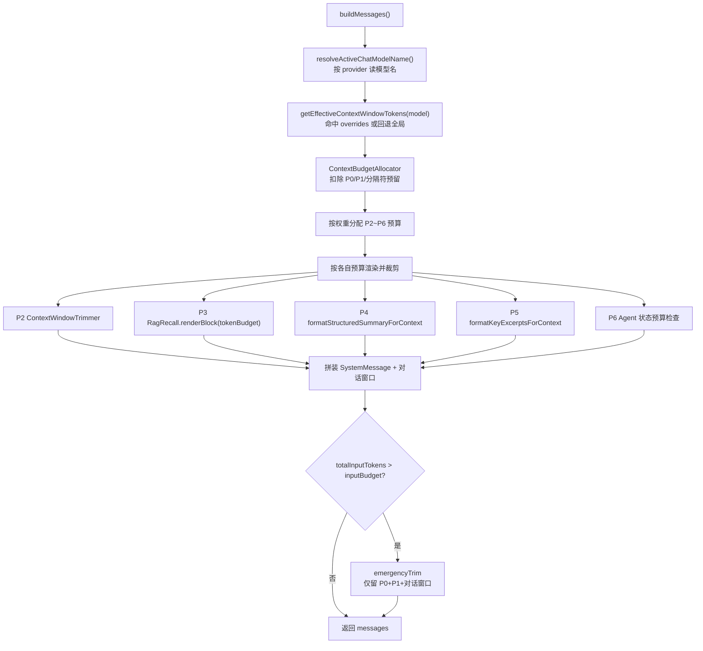

# Fish-Agent v5.4 Token 预算管理

> **版本**：v5.4
> **日期**：2026-06-12
> **范围**：本地 Token 估算 · 上下文预算分配 · 分段优先级裁剪 · 模型窗口自适应 · 最终兜底降级
> **前置版本**：v5.3（短期记忆增强与 Agent 状态记录）
> **后端增量**：新增 Token 估算器、预算分配器、对话窗口裁剪器；改造 ChatService 按预算驱动、RagRecall 按 token 渲染、LLM 配置扩展上下文窗口

---

## 一、更新目标

v5.3 之后，`ChatService.buildMessages()` 每轮拼接的上下文包含 6 个动态段落 + 1 段对话窗口，**但没有任何人知道总 token 数是多少**。

| 段落 | 来源 | v5.3 限制 |
|------|------|-----------|
| 系统指令 | `fish.agent.instruction` 配置 | 无上限 |
| 结构化摘要 | `StructuredSummary` | 无上限 |
| 关键历史片段 | `KeyExcerpt` | 无上限 |
| Agent 状态 | `SessionAgentState` | 仅 `phase != IDLE` 注入 |
| RAG 增强块 | `RagRecall.renderBlock` | **4000 字符 / 8 条事实** |
| 对话窗口 | `recentMessages` | **20 条消息** |

**问题**：

1. **静默截断**：超出模型上下文窗口后，LLM API 静默丢弃尾部消息，用户最新提问可能被截掉，模型"答非所问"。
2. **质量退化**：结构化摘要膨胀时挤占对话窗口，模型丧失近期上下文。
3. **无法优化**：没有 token 计量就无法做预算分配，所有限流/截断都是拍脑袋的字符数。

v5.4 目标：

1. **buildMessages 前**估算本轮总 token 数，与模型上下文窗口上限对比。
2. **超预算时**按优先级智能裁剪，保证用户最新提问和近期对话永远不被截断。
3. **可观测**：每轮记录实际 token 消耗与是否裁剪。
4. **零 API 开销**：token 估算走本地算法，不额外调用 LLM。

---

## 二、总体设计

### 2.1 设计原则

- **本地估算**：不引入 tiktoken 本地库，不调 LLM API 计数；用 CJK/Latin 字符密度经验公式，误差 ±15%，配合 20% 安全区吸收。
- **固定权重分配**：可预测、可调试、可配置；不追求运行时动态权重（复杂度高、收益不明确）。
- **降级优于拒绝**：超预算时裁剪低优先级内容，模型仍能正常工作；绝不让请求直接打到模型触发截断。
- **向后兼容**：新增逻辑全部用 `default` 方法 + 配置默认值兜底，未配置时行为与 v5.3 一致。

### 2.2 预算模型

```
模型上下文窗口（contextWindowTokens）
├── 预留给模型输出（outputReserveTokens）        ← 固定 2048
├── 安全区（safetyMarginRatio）                  ← 固定 20%
└── 可用输入预算（inputBudget）                  ← 窗口 × 0.8 − 输出预留

inputBudget 按优先级分配：
┌──────────────────────────────────────────────────────┐
│ P0  用户当前轮消息              │ 必须完整保留        │
│ P1  系统指令（时钟+人格）        │ 必须完整保留        │
│ P2  对话窗口 recentMessages     │ 40% · 从 head 裁剪  │
│ P3  RAG 增强块                  │ 25% · 减少事实条数  │
│ P4  结构化摘要                  │ 20% · 裁剪子段落    │
│ P5  关键历史片段                │ 10% · 保留最新      │
│ P6  Agent 状态                  │  5% · 不足则丢弃    │
└──────────────────────────────────────────────────────┘
段间分隔符开销预留 64 token（SECTION_SEPARATOR_RESERVE）
```

### 2.3 运行时结构



---

## 三、核心组件

### 3.1 TokenEstimator —— 本地估算器

`common/util/TokenEstimator.java`

```java
public static int estimate(String text) {
    if (text == null || text.isEmpty()) return 0;
    int cjk = 0;
    int total = text.length();
    for (int i = 0; i < total; i++) {
        if (isCjk(text.charAt(i))) cjk++;
    }
    int latinLike = total - cjk;
    // CJK: ~1.5 字符/token, Latin: ~4 字符/token
    return (int) Math.ceil(cjk / 1.5 + latinLike / 4.0);
}
```

- `isCjk` 覆盖 CJK 统一表意文字、兼容表意文字、扩展 A/B、韩文音节、平假名、片叶名。
- 纯本地计算，O(N) 遍历，无 API 开销。
- 误差 ±15%，由上层 20% 安全区吸收。

**为什么不用 tiktoken / API？**
- tiktoken 需要 JNA/本地库，增加部署复杂度。
- 调 LLM API 计数有延迟和成本。
- 预算控制不追求精确到个位 token。

### 3.2 ContextBudgetAllocator —— 预算分配器

`chat/budget/ContextBudgetAllocator.java`

```java
public ContextBudgetAllocator(int contextWindowTokens, int outputReserve, double safetyRatio) {
    int boundedWindow = Math.max(0, contextWindowTokens);
    int boundedReserve = Math.max(0, outputReserve);
    double boundedSafetyRatio = Math.clamp(safetyRatio, 0.0, 0.9);
    int safeBudget = (int) (boundedWindow * (1 - boundedSafetyRatio));
    this.inputBudget = Math.max(MIN_INPUT_BUDGET, safeBudget - boundedReserve);
}

public BudgetPlan allocate(BudgetRequest request) {
    int userTokens = TokenEstimator.estimate(request.userMessage());
    int instructionTokens = TokenEstimator.estimate(request.instruction());
    // 预留段间分隔符开销后再按权重切分
    int remaining = inputBudget - userTokens - instructionTokens - SECTION_SEPARATOR_RESERVE;
    if (remaining <= 0) {
        return BudgetPlan.exhausted(userTokens, instructionTokens, inputBudget);
    }
    int windowBudget  = (int) (remaining * 0.40);
    int ragBudget     = (int) (remaining * 0.25);
    int summaryBudget = (int) (remaining * 0.20);
    int excerptBudget = (int) (remaining * 0.10);
    int stateBudget   = remaining - windowBudget - ragBudget - summaryBudget - excerptBudget;
    return new BudgetPlan(...);
}
```

要点：

- **三入参全部边界保护**：`Math.max` / `Math.clamp` 防御负数与越界配置。
- **MIN_INPUT_BUDGET = 1000**：即使配置异常，也保证最低可用预算。
- **SECTION_SEPARATOR_RESERVE = 64**：段间 `"\n\n---\n"` 分隔符开销预留，保证五段预算之和留出分隔符空间，避免最终守卫因分隔符误触发 emergencyTrim。
- **stateBudget 吸收取整余数**：五段预算之和严格等于 `remaining`，无 token 漏算。

### 3.3 BudgetPlan / BudgetRequest —— 数据载体

`chat/budget/BudgetPlan.java`（record）

| 字段 | 说明 |
|------|------|
| `userTokens` / `instructionTokens` | P0/P1 实际估算 |
| `windowBudget` / `ragBudget` / `summaryBudget` / `excerptBudget` / `stateBudget` | P2~P6 各段预算 |
| `inputBudget` | 总可用输入预算 |
| `exhausted` | P0+P1+分隔符已耗尽预算时为 true，所有段预算归零 |

`BudgetRequest(userMessage, instruction)` —— 仅承载必保的高优先级文本。

### 3.4 ContextWindowTrimmer —— 对话窗口裁剪器

`chat/budget/ContextWindowTrimmer.java`（独立工具类，不塞进 ChatService）

```java
public static List<ChatMessageDTO> trimMessagesByBudget(List<ChatMessageDTO> messages, int budget) {
    // 从尾部往前累加，保留最近的消息
    // 若裁剪边界落在 assistant 消息上，向前推进一格，避免孤立 assistant 回复
}
```

- **保留最近**：从列表尾部往前累加 token，保证当前语境完整。
- **pair-boundary 对齐**：若保留切片以 assistant 开头（缺少前序 user），边界 +1，避免模型看到无语境的 assistant 回复。
- **budget ≤ 0 直接返回空列表**。

---

## 四、ChatService.buildMessages 改造

### 4.1 改造前后对比

| 维度 | v5.3 | v5.4 |
|------|------|------|
| 段落限制 | 字符数 / 条数硬编码 | token 预算驱动 |
| 裁剪策略 | 无（靠上游窗口上限） | 按优先级分段裁剪 |
| 超窗处理 | 无感知，靠 LLM 静默截断 | emergencyTrim 兜底降级 |
| 可观测 | 仅 DEBUG 日志 | 每轮 INFO token 用量 + 是否裁剪 |
| 返回值 | `(messages, skipMaintenanceCompression)` | 增加 `totalInputTokens / inputBudget / trimmed` |

### 4.2 流程

1. **解析模型名**：`resolveActiveChatModelName()` 按 provider 读 `spring.ai.{openai|ollama|dashscope}.chat.options.model`。
2. **查窗口大小**：`getEffectiveContextWindowTokens(modelName)` 命中 overrides 或回退全局默认。
3. **分配预算**：`ContextBudgetAllocator.allocate(BudgetRequest)`。
4. **按预算渲染各段**：每段传入对应预算，超预算时各自裁剪。
5. **最终守卫**：估算总 token，超 `inputBudget` 则 `emergencyTrim`（仅留 P0+P1+对话窗口）。
6. **INFO 日志**：记录 model / used / budget / trimmed。

### 4.3 BuildMessagesResult 扩展

```java
private record BuildMessagesResult(
        List<Message> messages,
        boolean skipMaintenanceCompression,
        int totalInputTokens,      // 实际消耗输入 token
        int inputBudget,           // 输入预算上限
        boolean trimmed            // 是否发生裁剪
) {}
```

日志：

```
[ChatService] Token 预算 sid=xxx, model=deepseek-chat, used=4521/50400, trimmed=false
```

---

## 五、各段裁剪策略

### 5.1 P2 对话窗口

`ContextWindowTrimmer.trimMessagesByBudget`：从 head 裁剪，保留最近 + pair-boundary 对齐（见 3.4）。

### 5.2 P3 RAG 块

`RagRecall.renderBlock(merged, tokenBudget)`：

- 固定指令 header **不计入预算**，保证小预算仍能放至少一条事实。
- 逐条累加 token，超预算即停。
- `tokenBudget ≤ 0` 回退旧的字符上限（4000）渲染，保持向后兼容。

### 5.3 P4 结构化摘要

`formatStructuredSummaryForContext(summary, tokenBudget)`：按子段落优先级写入 —— **话题 > 实体 > 待办意图 > 用户画像**，每个子段写入后检查是否超预算，超则 `trimTextToBudget` 二分裁剪。

`trimTextToBudget` 用 **ceiling-mid 二分**找最大合规前缀（token 估算对前缀长度单调，二分有效）。

### 5.4 P5 关键历史片段

`formatKeyExcerptsForContext(excerpts, tokenBudget)`：

- 按 `turnIndex` **从新到旧**累加，保留最近的片段。
- 渲染时再按 `turnIndex` **升序**输出（保持时间线）。
- `tokenBudget ≤ 0` 返回空串。

### 5.5 P6 Agent 状态

最易丢弃：`stateBudget > 0` 且 `estimate(stateBlock) <= stateBudget` 才注入，否则跳过。

### 5.6 emergencyTrim —— 最终兜底

极端情况（估算总量仍超预算）：

```java
messages = [SystemMessage(requiredSystemText)] + ContextWindowTrimmer.trim(contextMessages, 剩余预算)
```

仅保留 P1 系统必需文本 + P0 当前输入（由调用方追加）+ 尽量多的近期对话。**绝不**让超窗请求直接打到模型。

---

## 六、配置设计

### 6.1 application.yml

```yaml
fish:
  llm:
    # DASHSCOPE | OLLAMA | DEEPSEEK
    chat-provider: ${FISH_LLM_CHAT_PROVIDER:DEEPSEEK}

    # Token 预算管理：本地估算输入成本，防止上下文静默超窗
    context-window-tokens: ${FISH_LLM_CONTEXT_WINDOW_TOKENS:32768}
    output-reserve-tokens: ${FISH_LLM_OUTPUT_RESERVE_TOKENS:2048}
    safety-margin-ratio: ${FISH_LLM_SAFETY_MARGIN_RATIO:0.2}
    model-context-overrides:
      deepseek-chat: 65536
      qwen-plus: 131072
      qwen-turbo: 131072
      qwen3-235b-a22b: 131072
```

### 6.2 DashScope 模型名显式化

v5.4 同时补齐 DashScope 对话模型配置，使模型名可被项目显式控制：

```yaml
spring:
  ai:
    dashscope:
      api-key: ${DASHSCOPE_API_KEY:}
      chat:
        options:
          model: ${DASHSCOPE_CHAT_MODEL:qwen-plus}
```

此前 DashScope 对话模型走 starter 内置默认，`resolveActiveChatModelName` 读不到，预算覆盖不生效。显式配置后命中 `qwen-plus → 131072`。

### 6.3 FishLlmProperties 扩展

```java
private int contextWindowTokens = 32_768;
private int outputReserveTokens = 2_048;
private double safetyMarginRatio = 0.2;
private Map<String, Integer> modelContextOverrides = new HashMap<>();

public int getEffectiveContextWindowTokens(String modelName) {
    // 优先按模型名查 overrides，命中且 > 0 才用；否则回退全局默认
}
```

---

## 七、代码路径速查

### 7.1 新增文件

```
src/main/java/com/yuyu/fishagent/
├── common/util/
│   └── TokenEstimator.java                  本地 CJK/Latin token 估算
└── chat/budget/                             🔺 v5.4 新增预算子包
    ├── BudgetRequest.java                   预算请求 record
    ├── BudgetPlan.java                      预算分配结果 record
    ├── ContextBudgetAllocator.java          预算分配器
    └── ContextWindowTrimmer.java            对话窗口裁剪器
```

### 7.2 修改文件

| 文件 | 改动 |
|------|------|
| `llm/config/FishLlmProperties.java` | 新增 contextWindowTokens / outputReserveTokens / safetyMarginRatio / modelContextOverrides + getEffectiveContextWindowTokens |
| `chat/ChatService.java` | buildMessages 改预算驱动；新增 formatKeyExcerptsForContext / countEffectiveExcerpts / trimTextToBudget / emergencyTrim / resolveActiveChatModelName / estimateMessages / appendSystemSection；BuildMessagesResult 扩展 |
| `rag/pipeline/recall/RagRecall.java` | Augmentation 加 default 带 tokenBudget 方法；DefaultAugmentation 重写；renderBlock 按 token 预算渲染（header 不计预算） |
| `application.yml` | 新增 fish.llm 上下文窗口配置 + dashscope.chat.options.model |

---

## 八、边界与降级

| 边界 | 处理 |
|------|------|
| 模型名未知 / null | 回退全局 `context-window-tokens` 默认值 |
| 配置异常（负数 / 越界） | Allocator 三入参 `Math.max` / `Math.clamp` 兜底 |
| P0+P1 已耗尽预算 | `exhausted=true`，所有段预算归零，emergencyTrim 保 P0+P1 |
| 段间分隔符开销 | SECTION_SEPARATOR_RESERVE=64 预留，五段预算之和留出空间 |
| 估算总量仍超预算 | emergencyTrim 仅留 P0+P1+对话窗口 |
| 对话窗口预算不足 | 从 head 裁剪，保留最近 + pair-boundary 对齐 |
| RAG tokenBudget ≤ 0 | 回退字符上限（4000）渲染 |
| 关键片段含空内容条目 | countEffectiveExcerpts 只计有效条目，避免 trimmed 误报 |
| 二分裁剪落在代理对中间 | 产生 lone surrogate，模型容忍，可忽略 |

---

## 九、验证

### 9.1 新增测试

```powershell
$env:JAVA_HOME='D:\Code\jdks\ms-21.0.9'
$env:Path="$env:JAVA_HOME\bin;$env:Path"
mvn '-Dtest=TokenEstimatorTest,ContextBudgetAllocatorTest,ContextWindowTrimmerTest,FishLlmPropertiesBudgetTest,RagRecallRenderBudgetTest' test
```

| 测试类 | 覆盖点 |
|--------|--------|
| `TokenEstimatorTest` | CJK/Latin/混合估算准确度；null/blank 归零 |
| `ContextBudgetAllocatorTest` | 权重分配精确值；exhausted 场景；五段预算之和留分隔符余量 |
| `ContextWindowTrimmerTest` | 保留最新消息；pair-boundary 调整不以 assistant 开头 |
| `FishLlmPropertiesBudgetTest` | overrides 命中优先于全局默认；未知/null 回退 |
| `RagRecallRenderBudgetTest` | token 预算下停止追加事实；tokenBudget=0 回退字符上限 |

### 9.2 覆盖验证

- 权重分配：`remaining=6929` 时 window=2771 / rag=1732 / summary=1385 / excerpt=692 / state=349。
- 分隔符预留：五段预算之和严格小于 `inputBudget − user − instruction`。
- 真裁剪：有效片段 5 条放 3 条 → trimmed=true；空内容条目不影响判定。

---

## 十、面试 Trade-off

| 问题 | 回答要点 |
|------|----------|
| 为什么用估算而非精确计数？ | tiktoken 需本地库增加部署复杂度；LLM API 计数有延迟成本。预算控制 ±15% 误差 + 20% 安全区足够，不追求精确到个位。 |
| 为什么对话窗口优先级最高（P2）？ | 对话窗口含最近用户意图和模型回复，丢失后模型无法理解当前语境。RAG 是补充，摘要可部分截断。 |
| 安全区为什么是 20%？ | 覆盖估算误差（±15%）+ 模型内部特殊 token（BOS/EOS/role tag）开销。可配置调整。 |
| 预算不够时为什么不直接报错？ | 降级优于拒绝。裁剪低优先级后模型仍能工作，只是"知道得更少"；报错则用户体验直接断裂。 |
| 为什么预算用固定权重而非动态？ | 固定权重可预测、可调试、可配置。动态权重需运行时反馈（响应质量），复杂度高且收益不明确。 |
| 段间分隔符为什么单独预留？ | 分隔符不属于任何一段预算，最坏情况（各段同时撑满）会使总量超出预算几十 token，触发不必要的 emergencyTrim。预留 64 token 消除该误触发。 |
| 模型切换时怎么保证预算正确？ | modelContextOverrides 按模型名映射窗口大小；切换 provider 后自动查表，未知模型回退全局默认。 |
| emergencyTrim 何时触发？ | 估算总量仍超 inputBudget 时。此时 inputBudget 已含 20% 安全区，emergencyTrim 是最后保险，确保请求绝不超模型真实窗口。 |
| 为什么把裁剪逻辑独立成 ContextWindowTrimmer？ | 单一职责：buildMessages 编排与裁剪策略解耦。裁剪器可独立测试、复用，ChatService 保持编排清爽。 |

---

_增量文档 · v5.4 · 2026-06-12_
