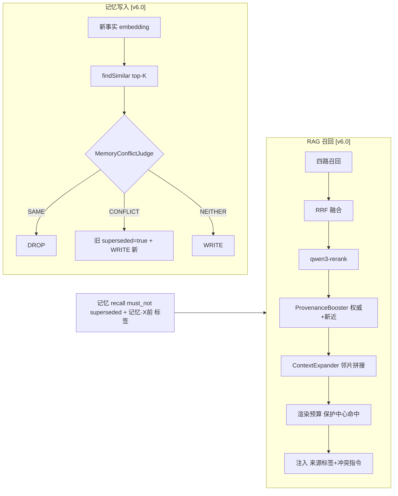

# Fish-Agent v6 全景文档

> 项目路径：`D:\1_Backend\Fish-Agent`
> 覆盖版本：**v2.0 ~ v2.6 + v3.0 ~ v3.6 + v4.0 ~ v4.3 + v5.0 ~ v5.6 + v6.0 + v6.1 + v6.2 + v6.3**（… → v6.0 记忆冲突/时效/层级检索治理（长期记忆更新失效 + KB 冲突感知 + 邻片扩展 + 索引期上下文前缀）→ v6.1 可评估 + 可观测（Eval golden set/nDCG + Agent Trace）→ v6.2 上下文韧性（工具结果治理 A 截断 + B 摘要 + C 检索式注入）→ **v6.3 长上下文适配（DeepSeek V4-Flash 1M 落地 + 治理阈值随窗口自缩放 + ActiveChatModelContext 单真相源）**）
> 后端 Java 源文件约 **195** 个（v6.0 +6、v6.1 +11、v6.2 +6、v6.3 +1：`llm/config/ActiveChatModelContext`），Python Worker 约 **22** 个文件，前端无改动。
> 前序全景：[v5 全景文档](../v5/v5-全景文档-20260608.md)（v2~v5.6 完整架构、源码目录与历史在此，本文聚焦 v6.x 增量）。

**分文档索引**

- [v5 全景文档](../v5/v5-全景文档-20260608.md) — v2~v5.6 全景（含各版本增量索引）
- **[v6.0-记忆冲突时效与层级检索治理](v6.0-记忆冲突时效与层级检索治理-20260613.md) — v6.0 增量记录（A2 写侧三态 + B1 冲突感知 + C2 邻片扩展 + D 上下文前缀 + createdAt 标签）**
- **[v6.1-可评估与可观测-Eval与Trace](v6.1-可评估与可观测-Eval与Trace-20260613.md) — v6.1 增量记录（Eval golden set/nDCG + LLM-judge + Agent TurnTrace）**
- **[v6.2-上下文韧性-工具结果治理](v6.2-上下文韧性-工具结果治理-20260613.md) — v6.2 增量记录（单结果 token 预算 A + LLM 摘要 B + 检索式注入 C + turn-bound scratch）**
- **[v6.3-长上下文适配-工具结果治理自缩放](v6.3-长上下文适配-工具结果治理自缩放-20260627.md) — v6.3 增量记录（V4-Flash 1M 落地 + 治理阈值随窗口自缩放 + ActiveChatModelContext 单真相源）**
- [向量库速查](../速查文档/向量库速查.md)、[ES 索引 DDL](../../database/es/es.txt)、[Python Worker 说明](../../python/README.md)

---

## 一、项目定位

Fish-Agent 是基于 **Spring Boot 3.5 + Spring AI Alibaba ReAct** 的全栈智能体应用。

**核心能力链**（v6.x 改动用 🔺 标注）：登录鉴权 → `TraceFilter` traceId 注入 → Redis 令牌桶 + SSE 并发限流 → 多轮对话（SSE 流式）→ 三级短期记忆 + Agent 状态 → **长期事实抽取 🔺[v6.0：写入侧三态判定 WRITE/DROP/SUPERSEDE，矛盾事实自动失效，recall 过滤 superseded]** → 四路 ES RAG 检索 🔺[v6.0：召回后 ProvenanceBooster 按权威/新近加权 + ContextExpander 邻片扩展；索引期 contextualized 上下文前缀] → RRF 融合 + DashScope Rerank 精排 → 工具调用 🔺[v6.2：单结果 token 预算头尾截断 + 超大结果检索式注入 scratch] 🔺[v6.3：治理阈值随 V4-Flash 1M 窗口自缩放，正常结果放行不误杀] 🔺[v6.1：全链路 TurnTrace + 离线 Eval 量化召回质量]。

**v6.0 的本质升级**：把记忆与知识库从"只会 append"升级为"会更新、会失效、会选优"——直击字节三面/头条"信息冲突与过期"那类题。三块改动共享一套 Provenance 溯源脊梁，**系统层（supersede/加权）与模型层（时间标签/冲突 prompt）双保险**。

**v6.1 的本质升级**：给 agent 补上**可观测 + 可评估**——ReAct 执行 trace（每步 thought/action/observation + 耗时 + rag/memory 片段，CAS 一次落 ES、dev 端点可查）+ 离线 Eval（golden set + nDCG/MRR/precision@k，公平 A/B 量化 v6.0 booster 收益）。直击虾皮「Agent 性能评估 / Trace」、头条「让智能体自测」。

**v6.2 的本质升级**：给 agent 补上**上下文韧性**——单工具结果按 token 封顶（A 头尾截断兜底），中等大走 LLM 摘要（B），真正巨量不截断不摘要、分片入单轮 scratch 只注预览、agent 用 `search_large_result` 按需回取（C 检索式注入）。直击虾皮「工具结果太长 / 上下文爆炸 / 日志超窗口」一连串。字符预算从自家 `TokenEstimator` 反推（首轮审查揪出的中文预算 BLOCKER 的根治点）。

**v6.3 的本质升级**：让 v6.2 的工具结果治理从"绝对阈值"进化为"随模型上下文窗口自缩放"——DeepSeek 迁到 V4-Flash 1M 后，原 64K 时代调的阈值（budget 4096 / 摘要 8192 / scratch 20480）会误杀正常网页/搜索结果（~6K 就被头尾截断）。同时收口「当前模型名 + 有效窗口」为单一真相源 `ActiveChatModelContext`（对话预算 allocator 与工具结果 governor 共用），根除"模型迁移漏改窗口 override"这类问题——本次 `deepseek-v4-flash: 65536` 即 V3（deepseek-chat）的 64K 遗留数。

> 前序版本（v5.0 工程化 / v5.1 卡片 SM-2 / v5.3 短期记忆增强 / v5.4 Token 预算 / v5.5 可观测性 / v5.6 OTel 下线）详见 [v5 全景](../v5/v5-全景文档-20260608.md)。

## 二、全链路架构（v6.0 改动链路）



（完整架构图见 [v5 全景 · 二、全链路架构](../v5/v5-全景文档-20260608.md)；v6.1 Trace/Eval、v6.2 工具结果治理、v6.3 长上下文自缩放是横切观测/治理层，见 §7.3、§7.4、§7.5。）

## 三、技术栈

### 3.1 后端 (Java)
Spring Boot 3.5.13 + Spring AI Alibaba ReAct + Spring Data Elasticsearch + Actuator/Micrometer Prometheus（v5.5）+ Resilience4j。v6.x **无新增中间件**——Provenance/三态判定/邻片扩展/TurnTrace/Eval/工具结果治理均为纯 Java 逻辑，trace 复用已有 ES，scratch 复用已有 Redis。

### 3.2 Python Worker
任务消费 + 结构化分块 + embedding。v6.0 新增 `contextual_indexing.py`（可插拔上下文前缀 generator），LLM = DeepSeek（context caching 默认自动）。

### 3.3 前端
Vue 3 + Three.js（v4.3）。v6.x 无前端改动。

## 四、后端源码目录（v6.0 / v6.1 / v6.2 / v6.3 新增标记 🆕）

```
rag/pipeline/recall/                              [v6.0]
  🆕 SourceAuthority.java        来源权威度与标签统一规则（PUBLIC=官方=1.0 / PRIVATE=0.7）
  🆕 ProvenanceBooster.java      rerank 后权威+新近加权
  🆕 ContextExpander.java        doc_id+chunk_index±N 邻片扩展
  🆕 MemoryAgeLabel.java         createdAt → 相对时间标签
memory/longterm/                                  [v6.0]
  🆕 SimilarFact.java            相似事实值对象
  🆕 MemoryConflictJudge.java    SAME/CONFLICT/NEITHER 判定
eval/                                             [v6.1]
  🆕 EvalRunner.java             离线排序评测（baseline vs booster A/B）
  🆕 GoldenSet.java / RetrievalMetrics.java   precision@k / MRR / nDCG@k
  🆕 LlmAnswerJudge.java         LLM-judge 接口（faithfulness/相关性/利用率）
common/trace/                                     [v6.1]
  🆕 TurnTrace.java             轮次执行轨迹（节点/耗时/片段/终态/disposition）
  🆕 TraceCollector.java        累积 + CAS 一次落盘（recordNode 7-arg 带 disposition）
  🆕 TraceObservationHandler.java  gen_ai.* Observation → trace 节点
  🆕 TraceEsWriter.java         async 写 ES + doc-max-chars 封顶
  🆕 TraceQueryController.java  GET /admin/trace/{turnId}（dev）
  🆕 TraceContext.java / TraceProperties.java
agent/tool/result/                                [v6.2]
  🆕 ToolResultGovernor.java       工具结果治理总入口（C→B→A 路由 + disposition 记 trace）
  🆕 ToolResultBudgeter.java       A 头尾截断（token-aware 字符预算采样反推 + while 收敛）
  🆕 ToolResultSummarizer.java     B LLM 摘要（失败回落 A）
  🆕 LargeResultScratchStore.java  C 单轮 scratch（Redis TTL/本地兜底 + 关键词检索 + 调用上限）
  🆕 ToolResultProperties.java     fish.tool.result.* 配置
agent/tool/builtin/                               [v6.2]
  🆕 SearchLargeResultToolProvider.java  search_large_result 工具（按 turnId 回取 scratch 片段）
llm/config/                                       [v6.3]
  🆕 ActiveChatModelContext.java   当前模型名 + 有效上下文窗口 单一真相源（allocator/governor 共用）
  ✏️ ToolResultProperties / ToolResultGovernor / ChatService  治理阈值随窗口自缩放 + 复用真相源（v6.2 既有文件演进）
```

（v5 完整目录见 [v5 全景 · 四](../v5/v5-全景文档-20260608.md)。）

## 五、新增资源与配置 [v6.0 / v6.1 / v6.2 / v6.3]

**application.yml 增量**：
```yaml
fish.memory.conflict:        { enabled: true, similar-fact-k: 5 }
fish.rag.provenance:         { enabled: true, authority-boost-alpha: 0.15, recency-boost-beta: 0.10, recency-halflife-days: 180 }
fish.rag.expand-neighbors:   { enabled: true, neighbor-span: 1 }
fish.rag.contextual-indexing:{ enabled: true, prefix-model: deepseek-chat, use-prompt-cache: true }
fish.eval:                   { golden-set-path: classpath:eval/golden-rag.json, judge-model: memoryChatModel }   # [v6.1]
fish.trace:                  { enabled: true, es-index: fish-trace, doc-max-chars: 50000, sample-rate: 1.0 }   # [v6.1]
fish.llm.model-context-overrides: { deepseek-v4-flash: 1048576 }   # [v6.3] V4-Flash 原生 1M（V3 遗留的 65536 已修；~300K 后质量下降，1M 仅作硬上限）
fish.tool.result:            { budget-tokens: 4096, summarize-threshold-tokens: 8192, scratch-large-threshold-tokens: 20480, scratch-search-max-calls: 5, scratch-chunk-tokens: 900, scratch-inject-top-k: 3, scratch-ttl: 30m, window-relative: { enabled: true, budget-fraction: 0.03, summarize-fraction: 0.12, scratch-fraction: 0.25 } }   # [v6.2 + v6.3 自缩放]
```

**Python config 增量**：`FISH_RAG_CONTEXTUAL_INDEXING_ENABLED`、`FISH_RAG_AUTHORITY_PRIVATE=0.7`、`FISH_RAG_AUTHORITY_PUBLIC=1.0`。

**ES 字段/索引**：`UserMemoryDocument` +superseded/validTo/authority；`KnowledgeChunkDocument` / `PublicKnowledgeDocument` +contextPrefix/contextualizedContent/authority/docCreatedAt；**[v6.1] 新增 `fish-trace` 索引**（TurnTrace）。

**Redis key 增量 [v6.2]**：`fish:scratch:{turnId}`（大结果分片，TTL 单轮）、`fish:scratch:{turnId}:calls`（检索调用计数，TTL 单轮）——turn 结束 CAS 主动清。

## 六、新增测试文件 [v6.0 / v6.1 / v6.2 / v6.3]

- `ElasticsearchLongTermMemoryStoreTest`（CONFLICT/SAME/NEITHER 三态端到端）
- `MemoryConflictJudgeTest`、`ProvenanceBoosterTest`（真同分 tie-break + disabled passthrough）、`SourceAuthorityTest`、`ContextExpanderTest`、`MemoryAgeLabelTest`
- Python `test_contextual_indexing`、`test_elasticsearch_indexer`（扩展）
- **[v6.1]** `RetrievalMetricsTest`、`EvalRunnerTest`、`GoldenSetResourceTest`（≥20 防退化）、`TraceCollectorTest`、`TraceEsWriterTest`、`ObservationConfigTest`
- **[v6.2]** `ToolResultBudgeterTest`（ASCII 头尾 + **中文 6304 字符截到 ≤budget**）、`ToolResultGovernorTest`（B 摘要 + C 预览 + **C 中文注入 ≤budget**）、`LargeResultScratchStoreTest`（ASCII 检索 + 调用上限 + **中文分片 ≤chunk 预算** + **空 scratch 不烧配额**）
- **[v6.3]** `ActiveChatModelContextTest`（override 命中 / 回退默认 / 三 provider 解析）、`ToolResultPropertiesScalingTest`（1M→~31K、131K/0 退 floor、关缩放退绝对、per-tool override 不缩放）、`ToolResultGovernorTest`（+1：**1M 下 ~10K token 结果 unchanged**，旧 4096 必挂）

## 七、关键流程

### 7.1 长期记忆写入三态判定 [v6.0]
新事实 → embedding → `findSimilar` top-K → `MemoryConflictJudge` → WRITE / DROP / SUPERSEDE（旧 superseded 留审计）→ recall 双腿 `must_not superseded=true`。

### 7.2 RAG 召回冲突感知 + 邻片扩展 [v6.0]
四路召回 → RRF → rerank → `ProvenanceBooster`（权威+新近）→ `ContextExpander`（邻片）→ 渲染预算（保护中心命中）→ 注入（来源标签 + 冲突指令）。

### 7.3 Agent Trace + Eval [v6.1]
- **Trace**：`ChatAgent` `NodeOutput` tap（节点分类 + 相邻耗时）+ `ChatService` 灌 rag/memory → `TraceCollector` 累积 → turn 结束 `ChatTurnLifecycle` CAS 一次 → `TraceEsWriter` async 写 ES（`fish-trace`）→ `GET /admin/trace/{turnId}`。
- **Eval**：golden set（query + 带标签候选）→ fusion+rerank+booster → `RetrievalMetrics`（nDCG/MRR/precision@k）→ baseline vs booster A/B 报告。

### 7.4 工具结果治理 A+B+C [v6.2]
工具结果 → `ToolRegistry` turn-bound wrap（绑 turnId + set/restore TraceContext）→ `ToolResultGovernor` 路由：**C**（tokens ≥ scratch 阈值，非 search_large_result）→ `LargeResultScratchStore` 分片入 scratch，仅注 top-k 预览 + 检索提示；**B**（≥ 摘要阈值）→ `memoryChatModel` 摘要，失败回落；**A**（兜底）→ `ToolResultBudgeter` 头尾截断。三层都受单结果 budget 封顶，处置（truncated/summarized/retrieved）落 trace。turn 结束 `ChatTurnLifecycle` CAS 清 `fish:scratch:{turnId}` + `:calls`。

### 7.5 长上下文适配（治理自缩放 + 真相源）[v6.3]
`ActiveChatModelContext`（模型名 + 有效窗口 单真相源）→ `ToolResultGovernor` 顶部解析一次窗口 → `ToolResultProperties.effective*`（`max(绝对下限, 窗口×分数)`）→ 三档 budget/summarize/scratch 阈值。V4-Flash 1M 下 budget≈31K / summarize≈126K / scratch≈262K，正常网页/搜索结果原样放行；窗口未知或 `window-relative.enabled=false` 退回绝对下限（= v6.2 行为，既有测试零回归）。`ChatService` 同源复用该 bean（删私有 `resolveActiveChatModelName`）。

## 八、数据模型 [v6.0 / v6.1 / v6.2]

| 文档/索引 | v6.x 新增字段 |
|---|---|
| `fish-user-memory`（UserMemoryDocument） | `superseded`(bool)、`valid_to`(date)、`authority`(double) |
| `fish-user-knowledge` / `fish-public-knowledge`（KnowledgeChunkDocument / PublicKnowledgeDocument） | `context_prefix`(text)、`contextualized_content`(text, ik 分词)、`authority`(double)、`doc_created_at`(date) |
| `fish-trace`（TurnTrace）[v6.1] | `nodes[]{...,disposition}`（v6.2 工具结果治理处置方式）、`rag_injected/memory_injected`、`token_usage`、`status` |

authority：PUBLIC=1.0（官方）、PRIVATE=0.7（用户）；`SourceAuthority` 阈值 0.95 → 标签"官方"。

**[v6.2] Redis 瞬态**：`fish:scratch:{turnId}` 存大结果分片 JSON、`fish:scratch:{turnId}:calls` 存检索调用计数，TTL 单轮、turn 结束 CAS 主动清（非持久数据模型）。

## 九、面试亮点总结

### v6.0 新增面试话题
- **append-only 长期记忆的致命伤**：只会加不会废，矛盾/过期事实共存——北京→上海被 cosine 查重当重复丢弃。
- **supersede = Graphiti 时序图 lite**：valid_to 关闭而非删除，留审计；完整进化版是 `(s,p,o,valid_from,valid_to)` 时序知识图谱。
- **冲突感知双保险**：系统层 ProvenanceBooster（权威+新近加权，PUBLIC=官方=1.0）+ 模型层冲突 prompt（声明冲突 / 引用双方 / 不确定反问 / 不编造）。
- **contextual retrieval 诚实讲法**：索引期前缀让孤立块可召回；搭了管线 + 可插拔 generator，启发式占位，生产 generator=DeepSeek + prompt 缓存（省 ~90%）。
- **createdAt 时间标签代替衰减打分**：把写入时间交给模型推理渐进过期。

### v6.1 新增面试话题
- **召回质量怎么量**：离线 golden set + nDCG/MRR/precision@k + baseline vs booster 公平 A/B（证 v6.0 booster 提 nDCG 0.63→1.0）；LLM-judge 接口预留。
- **Trace 是什么 / 怎么做**：ReAct 每步 thought/action/observation + 耗时；`NodeOutput` tap 捕获、CAS 一次落 ES、dev 端点可查。
- **trace 为什么不进 Redis**：内存会被全文 trace 撑爆；ES 磁盘 + Kibana 白送 UI，turn 结束一次 async 写，符 v5.6"不搞云原生"。
- **token 捕获的诚实边界**：Spring AI Observation handler 已注册，跨线程 ThreadLocal 未传 → token 待 ContextPropagation（演进项）。

### v6.2 新增面试话题
- **工具结果太长吃爆上下文怎么办**：A 单结果 token 预算头尾截断（兜底）→ B LLM 摘要（中档）→ C 检索式注入（招牌，超大结果不截断不摘要，分片入单轮 scratch，只注 top-k，agent 用 `search_large_result` 按需回取）。
- **为什么超大日志不直接截断/摘要**：丢细节；C 把全文留 scratch、只注预览+检索提示，细节按需可回取，既不爆上下文又不丢信息。
- **字符预算踩过的坑（诚实弹药）**：最初按 Latin ×4 算字符预算，中文 1.5 字符/token 导致 6K-16K 中文结果绕过预算且 disposition=unchanged 不留 trace；测试全 ASCII 故隐形；后改成从自家 `TokenEstimator` 采样反推 CJK/Latin 密度 + while 收敛。一个"测试语言偏见掩盖真实 bug"的活案例。
- **scratch 为什么用 Redis**：跨进程可见 + TTL 自动回收；进程内仅作兜底；turn 结束 CAS 主动清两个 key，泄漏有界。
- **turn-bound 动态工具的取舍**：为把 scratch/调用上限/Trace 绑到同一 turn，真实链路每轮重建 ReactAgent——turn 隔离换的构建成本，框架支持运行时工具上下文后可复用 graph。

### v6.3 新增面试话题
- **迁到长上下文模型（1M）后工具链要改什么**：两件事——① 模型名→窗口 override 是上一代（V3 的 64K）遗留、迁移漏改，先修正到原生 1M；② v6.2 工具结果阈值是为 64K 调的绝对值，1M 下严重偏低会误杀正常结果，改成随窗口自缩放。
- **为什么不直接调大绝对值**：硬编码绝对值与模型窗口脱钩，下次迁移又 stale（就是这次踩的坑）；`max(下限, 窗口×分数)` 随模型自动缩放，小窗也不回退。
- **怎么保证不回归**：有效值 = `max(绝对下限, 窗口×分数)`，小窗/未知窗（≤0）退回绝对下限 = v6.2 原行为；既有 governor 测试加个 `null` resolver 继续守绝对行为，新测试专测大窗放行。
- **为什么单开 ActiveChatModelContext bean**：「当前用哪个模型 / 窗口多大」原本散在 ChatService 私有方法，allocator 与 governor 各取一份——这次 override 漏改就是这散落结构的结果。收口成单真相源，迁移不会再漏。
- **1M 会用满吗（诚实边界）**：不会也不该——V4-Flash 原生 1M 但 ~300K 后质量/延迟下降，1M 只是硬上限；实际打包量仍由 safety-margin 收敛，"质量目标"与"硬上限"拆分是下一步。

（v2~v5 历史面试话题见 [v5 全景 · 九](../v5/v5-全景文档-20260608.md)。）

## 十、版本历史

| 版本 | 日期 | 要点 |
|---|---|---|
| v5.6 | 2026-06-13 | OTel 链路层下线（移除 OTel/OTLP/Collector，保留 Prometheus + MDC traceId） |
| **v6.0** | **2026-06-13** | **记忆冲突/时效/层级检索治理：A2 写侧三态 + B1 冲突感知 + C2 邻片扩展 + D 上下文前缀 + createdAt 标签；经两轮审查通过** |
| **v6.1** | **2026-06-13** | **可评估 + 可观测：Eval golden set/nDCG + LLM-judge + Agent TurnTrace（ES-only / CAS 一次落盘）；经两轮审查通过** |
| **v6.2** | **2026-06-13** | **上下文韧性：单结果 token 预算 A 头尾截断 + LLM 摘要 B + 检索式注入 C（scratch + search_large_result）+ turn-bound 动态工具；首轮审查揪出中文预算 BLOCKER（测试语言偏见），二轮修复通过** |
| **v6.3** | **2026-06-27** | **长上下文适配：DeepSeek V4-Flash 1M 落地（修 V3 遗留的 65536 override）+ 工具结果治理阈值随窗口自缩放（max(下限, 窗口×分数)）+ ActiveChatModelContext 单真相源（allocator/governor 共用，ChatService 复用）；TDD 全绿 249/249** |

（v1~v5.6 完整版本历史见 [v5 全景 · 十](../v5/v5-全景文档-20260608.md)。）

---

_2026-06-27 更新 · v6.0 ~ v6.3 全景_
