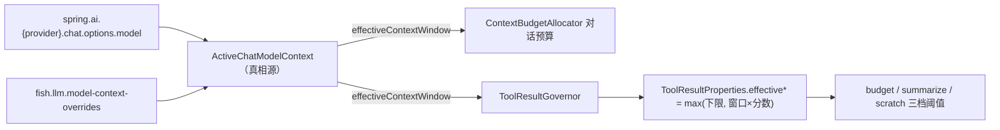

# Fish-Agent v6.3 长上下文适配（工具结果治理随窗口自缩放 + 模型上下文真相源）

> 日期：2026-06-27
> 主题：DeepSeek V4-Flash 1M 上下文落地——治理阈值随窗口自缩放 + 收口「当前模型 / 有效窗口」单一真相源
> 状态：**已实施**（TDD 红→绿，全量 `mvn test` 249/249 绿，新增 10 条测试）
> 前置：DeepSeek V3→V4-Flash 迁移（`deepseek-chat`→`deepseek-v4-flash`，`thinking.type=disabled` 规避 V4 思考模式与 tool calling 冲突）
> 关联：[v6.2 工具结果治理](v6.2-上下文韧性-工具结果治理-20260613.md)（本版让其自缩放）、v5.4 Token 预算（`ContextBudgetAllocator`）
> 同期：rerank 对 qwen3-rerank 静默失效修复 + 上传链 ready 半可见/doc_created_at 修复（见 memory，独立主题，不在本版范围）

## 一、背景与动机

V4-Flash 迁移改了模型名，但 `fish.llm.model-context-overrides` 里 `deepseek-v4-flash: 65536` 是 **V3（deepseek-chat）的 64K 遗留数**——迁移漏改。V4-Flash 原生支持 **1M** 上下文（284B 总参 / 13B 激活 MoE，OpenAI 兼容，无需特殊开关），实际只用了 1/16。

连带的二级问题：v6.2 的工具结果治理三档阈值（budget 4096 / summarize 8192 / scratch 20480）是**为 64K 窗口调的绝对值**。窗口变 1M 后这些阈值严重偏低——一个 ~6K token 的普通网页结果会被头尾截断丢中段，~8K 起走有损 LLM 摘要。治理从"防单个结果吃爆总量"退化成"误杀正常结果"。

**根因**：阈值是硬编码绝对值，与"当前模型窗口多大"这件事脱钩——模型一换就 stale。本版把两者重新耦合：阈值随窗口自缩放，并把"窗口多大"收口为单一真相源。

## 二、设计原则

1. **自缩放，不再硬编码**：有效阈值 = `max(绝对下限, 窗口×分数)`。大窗下放行正常结果、把摘要/scratch 退化为只对付真正巨型结果的兜底；小窗/未知窗退回绝对下限（今天的行为），**零回归**。
2. **单一真相源**：新增 `ActiveChatModelContext` 收口「当前模型名 + 有效窗口」，`ContextBudgetAllocator`（对话预算）与 `ToolResultGovernor`（工具结果预算）**共用同一份"窗口有多大"**——模型名→窗口的映射只在一处，迁移不会再漏改（正是本版 bug 的根因）。
3. **1M 是硬上限，非打包目标**：V4-Flash 原生 1M，但官方与社区反馈 **~300K 之后质量/延迟下降**（150–250K 是甜点区）。1M 仅作天花板，实际打包量仍由 `safety-margin-ratio` 收敛；把"质量目标"与"硬上限"拆分留作后续。

## 三、方案与实施

### 3.1 单一真相源 `ActiveChatModelContext`（`llm/config/`，新增）
`activeModelName()`：按 `chat-provider` 读对应 `spring.ai.{provider}.chat.options.model`（从 `ChatService` 私有方法迁出）。`effectiveContextWindow()`：命中 `model-context-overrides` 用 override，否则回退 `context-window-tokens`。激活模型在运行期由配置决定、不热切换，按调用即时解析（一次 Map 查找 + 一次 Environment 读取，开销可忽略）。

### 3.2 窗口比例缩放（`ToolResultProperties`）
新增 `window-relative.{enabled, budget-fraction(0.03), summarize-fraction(0.12), scratch-fraction(0.25)}`。`effectiveBudgetTokens / effectiveSummarizeThreshold / effectiveScratchThreshold` = `scaledOrFloor(下限, 分数, 窗口)`：关闭缩放或窗口≤0 返回绝对下限，否则 `max(下限, floor(窗口×分数))`。
**1M 下的实际效果**：budget≈31K / summarize≈126K / scratch≈262K——正常网页/搜索结果（5–15K token）**原样放行不治理**，摘要/scratch 只对真正巨型结果触发。**显式 per-tool override 仍是绝对硬上限，不参与缩放**（运营刻意设的封顶）。删掉了被取代的死方法 `budgetTokensFor`。

### 3.3 Governor 接线（`ToolResultGovernor`）
注入 `ActiveChatModelContext`（nullable，测试传 null），`govern()` 顶部解析一次窗口，三档阈值全部改用 `effective*`。窗口未知（测试 / 未注入）→ 0 → 退回绝对下限，所以 v6.2 的既有测试零行为变化。

### 3.4 `ChatService` 复用真相源
删掉私有 `resolveActiveChatModelName()` 与不再使用的 `environment` 字段，改调 `activeChatModelContext.activeModelName()` / `effectiveContextWindow()`。消除"模型名解析"在两处的重复。

## 四、代码路径

新增（1 + 2 测试）：
- `llm/config/ActiveChatModelContext.java` —— 模型名 + 有效窗口单一真相源
- `llm/config/ActiveChatModelContextTest.java`、`agent/tool/result/ToolResultPropertiesScalingTest.java`

修改：
- `ToolResultProperties`（+window-relative 分数与 `effective*`，删 `budgetTokensFor`）
- `ToolResultGovernor`（注入 `ActiveChatModelContext`，三档用 `effective*`）
- `ChatService`（复用 bean，删 `resolveActiveChatModelName` + `environment`）
- `application.yml`（`deepseek-v4-flash` override `65536`→`1048576`；`fish.tool.result` 下加 `window-relative` 块）
- 测试：`ToolResultGovernorTest`（+1 缩放用例，3 个既有用例构造器加 `null` resolver）、`ToolRegistryTest`、`ChatServiceObservabilityTest`（`Environment` mock → `ActiveChatModelContext` mock）

## 五、验证

TDD 红→绿逐项（每步先看失败再实现）。全量 `mvn test` **249/249 绿**（+10）：
- `ActiveChatModelContextTest`（3）：override 命中 / 未知模型回退默认 / 三 provider 模型名解析。
- `ToolResultPropertiesScalingTest`（6）：1M→~31K、summarize/scratch 同步放大、131K 退 floor、窗口 0/-1 退 floor、`enabled=false` 全退绝对、per-tool override 不缩放。
- `ToolResultGovernorTest`（+1）：**1M 窗口下 ~10K token 结果 `disposition=unchanged` 且内容原样**（旧绝对 4096 下本会被截断），并断言其 token 数 > 4096（证明旧码必挂）。

关键不变量：`窗口≤0 或 enabled=false ⇒ 行为与 v6.2 完全一致`，由既有 3 条 governor 用例 + 1 条 registry 用例守卫。

## 六、面试 Trade-off

| 问题 | 回答要点 |
|---|---|
| 迁到 1M 上下文模型后，工具调用链要改什么 | 两件事：① 模型名→窗口的 override 是上一代（V3 的 64K）遗留，迁移漏改，先修正到原生 1M；② v6.2 的工具结果阈值是为 64K 调的绝对值，1M 下严重偏低会误杀正常结果，改成随窗口自缩放 |
| 阈值为什么不直接调大绝对值 | 硬编码绝对值与模型窗口脱钩，下次迁移又会 stale（就是这次踩的坑）；`max(下限, 窗口×分数)` 自动随模型缩放，小窗模型也不会回退 |
| 怎么保证不回归 | 有效值 = `max(绝对下限, 窗口×分数)`：小窗/未知窗（≤0）退回绝对下限 = v6.2 原行为；现有 governor 测试加个 `null` resolver 就继续守绝对行为，新测试专测大窗放行 |
| 为什么单开一个 ActiveChatModelContext bean | "当前用哪个模型 / 窗口多大"原本散在 ChatService 私有方法里，allocator 和 governor 各取一次——这次 override 漏改就是这散落结构的结果。收口成单真相源，两处共用，迁移不会再漏 |
| 1M 真的会用满吗 | 不会也不该：V4-Flash 原生 1M 但 ~300K 后质量/延迟下降。1M 只是硬上限，实际打包量由 safety-margin 收敛；"质量目标"与"硬上限"拆分是下一步 |
| 治理放行更大结果，不会吃爆总量吗 | 单结果 budget 仍随窗口有上限（1M 下 ~31K），且最终仍进 v5.4 `ContextBudgetAllocator` 总量预算；放行的是"正常结果"，巨量结果仍走 B 摘要/C scratch |

## 七、后续

- **~300K 质量目标**：`ContextBudgetAllocator` 现按 `窗口×(1-safety)` 打包（1M 下 ~800K），长对话可能冲过 ~300K 质量 cliff。加一个独立 `target-context-tokens`（默认 ~256K）给 allocator 用，1M 只作天花板——与工具结果正交，同源问题。
- **Prompt-cache 排序**：当前 `buildMessages` 把易变的 RAG 注入在中段，破坏 DeepSeek 上下文缓存的前缀命中。稳定段（system/长期摘要/tools schema）前置、易变段（本轮 RAG/最近窗口/工具结果）后置，大窗口才"用得起"。
- **验证真实 API tier**：1M 是模型规格，实际可用上下文取决于账户 tier；线上应监控 prompt token + `prompt_cache_hit_tokens`（DeepSeek usage 返回）+ 单轮成本。

---

_2026-06-27 · 已实施，TDD 全绿_
