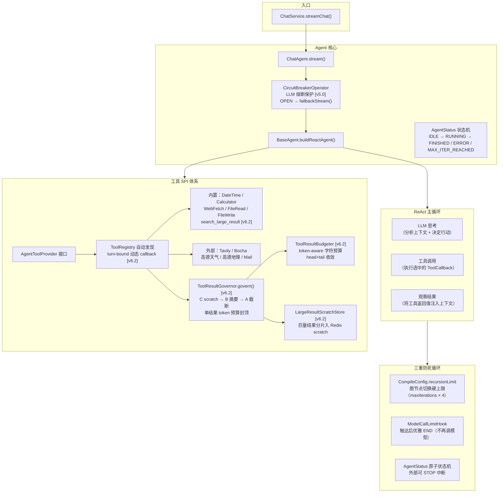
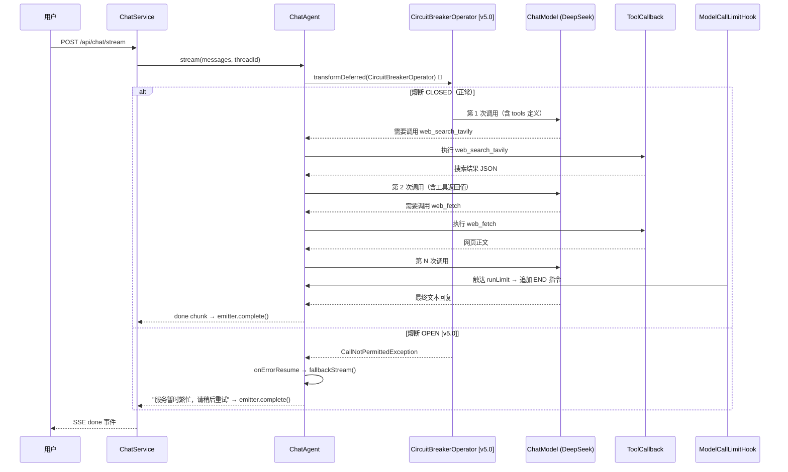

# 模块 1：Agent 核心与工具链

## 一句话定位

基于 **Spring AI Alibaba ReAct** 的智能体引擎，以"思考-行动-观察"循环驱动 LLM 自主决策调用工具，通过 **SPI 插件化体系**零侵入扩展工具，三重机制防止死循环。**LLM 流式调用经 `CircuitBreakerOperator` 熔断保护 [v5.0]**。**工具结果经 `ToolResultGovernor` 三层治理 [v6.2]：A 单结果 token 预算头尾截断（兜底）→ B LLM 摘要（中档）→ C 巨量结果分片入 Redis scratch + `search_large_result` 按需回取（招牌）；字符预算从 `TokenEstimator` 采样反推 CJK/Latin 密度，保证中文结果不绕过预算。turn-bound 动态 callback 把 scratch/trace 绑到同一轮 [v6.1/v6.2]。**（v5.3 的字符级 `TextTruncator` 治理已被 v6.2 取代，仅作无 governor 时的测试兼容回退。）**[v6.3] 三档阈值随当前模型窗口自缩放（`max(下限, 窗口×分数)`）——V4-Flash 1M 下 budget≈31K，正常网页/搜索结果原样放行不再被误杀；窗口未知或关缩放退回绝对下限（= v6.2 行为，零回归）。**

---

## 架构图



---

## 流程图：ReAct 主循环



---

## 关键位置

### 1. BaseAgent.buildReactAgent() — Agent 构建工厂

`[BaseAgent.java](../../src/main/java/com/yuyu/fishagent/agent/BaseAgent.java)` 第 57-82 行：

```java
protected ReactAgent buildReactAgent(List<ToolCallback> tools, String systemPrompt) {
    CompileConfig compileConfig = CompileConfig.builder()
        .recursionLimit(Math.max(maxIterations * 4, 20))  // 第一道防线
        .build();
    ModelCallLimitHook limitHook = ModelCallLimitHook.builder()
        .runLimit(maxIterations)       // 第二道防线
        .exitBehavior(ModelCallLimitHook.ExitBehavior.END)
        .build();
    return ReactAgent.builder()
        .model(this.chatModel)
        .tools(tools)
        .hooks(limitHook)
        .compileConfig(compileConfig)
        .build();
}
```

**设计要点**：
- `recursionLimit` 是底层的最后保险（图节点级别，触达抛异常）
- `ModelCallLimitHook` 是优雅终止（触达后追加一条 END 指令，不再调模型，避免浪费 token）
- `AgentStatus` 状态机允许外部通过 `transitionTo(STOPPED)` 中断

### 2. ToolRegistry — 自动发现 + 隔离失败

`[ToolRegistry.java](../../src/main/java/com/yuyu/fishagent/agent/tool/ToolRegistry.java)` 第 34-53 行：

启动期遍历所有 `AgentToolProvider` Bean，逐个调用 `build()` 构造 `ToolCallback`。单个工具构造失败 **不阻断**其他工具注册——catch 后 continue。同时为每个 `ToolCallback` 包一层 DEBUG 日志代理，运行时每次工具调用自动打印工具名与输入摘要。

### 3. ChatAgent.stream() — 流式入口 + LLM 熔断 [v5.0] + turn-bound 重建 [v6.2] + 逐节点 trace [v6.1]

`[ChatAgent.java](../../src/main/java/com/yuyu/fishagent/agent/ChatAgent.java)`：

```java
public Flux<NodeOutput> stream(List<Message> messages, String threadId, String turnId) {
    try {
        transitionTo(AgentStatus.RUNNING);
        RunnableConfig config = RunnableConfig.builder().threadId(threadId).build();
        AtomicLong previousNodeAt = new AtomicLong(System.nanoTime());
        // [v6.2] 有 turnId 的真实链路每轮重建 ReactAgent，把 scratch key/调用上限/trace 绑到本轮
        ReactAgent agent = (turnId == null || turnId.isBlank())
                ? reactAgent
                : buildReactAgent(toolRegistry.allCallbacks(turnId), "");
        return agent.stream(messages, config)
                .transformDeferred(CircuitBreakerOperator.of(llmCircuitBreaker))   // [v5.0] 订阅时检查 CB
                .onErrorResume(CallNotPermittedException.class, e -> fallbackStream())  // OPEN → 降级
                .doOnNext(node -> recordTraceNode(turnId, node, previousNodeAt))   // [v6.1] 逐节点 trace + 耗时
                .doOnComplete(() -> transitionTo(AgentStatus.FINISHED))
                .doOnError(e -> transitionTo(AgentStatus.ERROR))
                .doOnCancel(() -> transitionTo(AgentStatus.IDLE));
    } catch (Exception e) {
        transitionTo(AgentStatus.ERROR);
        return Flux.error(e);
    }
}
```

**v5.0 熔断**：
- **`transformDeferred` 而非 `transform`**：`transform` 构建时应用 operator（CB 可能还 CLOSED），`transformDeferred` 在**订阅时**才应用——每次订阅重新检查 CB 状态，OPEN 时立即拦截
- **`onErrorResume(CallNotPermittedException.class, ...)`**：只捕获熔断拒绝走降级，其它异常（网络错误、LLM 格式错误）正常传播到 ChatService 的 `subscribe.onError`
- **`fallbackStream()`** 返回单元素降级提示，AgentStatus 仍正常 FINISHED

**v6.2 turn-bound**：`allCallbacks(turnId)` 每轮重建工具集，`wrap` 在 `call()` 前 `TraceContext.setTurnId(turnId)`、finally 里 restore——让 `ToolResultGovernor`、`LargeResultScratchStore`、`SearchLargeResultToolProvider` 都拿到本轮 turnId（scratch key = `fish:scratch:{turnId}`）。代价是每轮重建 ReactAgent，换的是 turn 隔离。

**v6.1 逐节点 trace**：`doOnNext` 对每个 `NodeOutput` 分类（thought/action/observation/tool/streaming）+ 计算与上一节点耗时，落 `TraceCollector`，turn 结束经 `ChatTurnLifecycle` CAS 一次性 async 写 ES。

返回 `Flux<NodeOutput>`，上层（ChatService）按需过滤 `StreamingOutput` chunk 推 SSE。

### 4. 工具结果治理 A/B/C（v6.2，取代 v5.3 字符截断）

`[ToolResultGovernor.java](../../src/main/java/com/yuyu/fishagent/agent/tool/result/ToolResultGovernor.java)`

v5.3 的字符级 `TextTruncator` 治理已被 v6.2 取代（`ToolRegistry.governResult` 仅在 `toolResultGovernor == null` 时作测试兼容回退）。生产链路所有工具返回经 `ToolResultGovernor.govern(turnId, toolName, toolInput, result)` 统一处理，路由顺序 **C 检索式注入 → B 摘要 → A 截断**：

```java
public GovernedResult govern(String turnId, String toolName, String toolInput, String result) {
    int originalTokens = TokenEstimator.estimate(result);
    // [v6.3] 三档阈值随当前模型窗口自缩放：max(绝对下限, 窗口×分数)；窗口未知→0→退回绝对下限(v6.2 行为)
    int window = activeChatModelContext == null ? 0 : activeChatModelContext.effectiveContextWindow();
    int budget = properties.effectiveBudgetTokens(toolName, window);          // 1M 下 ~31K，正常结果放行不截断
    int scratchThreshold = properties.effectiveScratchThreshold(window);      // 1M 下 ~262K
    int summarizeThreshold = properties.effectiveSummarizeThreshold(window);  // 1M 下 ~126K

    // C 检索式注入：tokens ≥ max(budget+1, scratchThreshold) 且 turnId 存在且非 search_large_result
    if (scratchEnabled && originalTokens >= Math.max(budget + 1, scratchThreshold)
            && turnId != null && !"search_large_result".equals(toolName)) {
        StoreResult stored = scratchStore.store(turnId, toolName, result);   // 分片入 Redis scratch
        if (stored.stored()) {
            String injected = renderScratchInjection(toolName, originalTokens, stored);  // 只注 top-k 预览
            return fit(injected, budget, "retrieved");
        }
    }
    // B 摘要：tokens ≥ max(budget+1, summarizeThreshold) → memoryChatModel 忠实摘要，失败回落 A
    if (summarizeEnabled && originalTokens >= Math.max(budget + 1, summarizeThreshold)) {
        String summary = summarizer.summarize(toolName, toolInput, result, budget);
        if (summary != null && !summary.isBlank()) return fit(summary, budget, "summarized");
    }
    // A 头尾截断（兜底）
    return budgeter.fit(result, budget, "truncated");
}
```

**三层**：

| 层 | 触发阈值 | 处置 | disposition |
|----|---------|------|-------------|
| **A 头尾截断**（兜底） | 超单结果预算 | `ToolResultBudgeter` head+tail 保留，中间中文 marker，token-aware 字符预算 while 收敛到 ≤ budget | truncated |
| **B LLM 摘要**（中档） | ≥ 8192 token | `ToolResultSummarizer` 用 `memoryChatModel`（低温、禁工具）忠实摘要，保留错误/数字/路径/URL/时间/结论；摘要仍受 A 封顶；失败回落 A | summarized |
| **C 检索式注入**（招牌） | ≥ 20480 token | `LargeResultScratchStore` 按 turnId 分片（token-aware，每片 ≤ `scratch-chunk-tokens`）入 `fish:scratch:{turnId}`（Redis + TTL，不可用走进程内）；只注 top-k 预览 + `search_large_result` 工具按关键词回取（单轮调用上限，空 scratch 不计数） | retrieved |

**A 的字符预算为什么不能硬编码 `budget×4`（首轮审查 BLOCKER）**：项目主语言是中文，`TokenEstimator` 对 CJK 是 1.5 字符/token、Latin 是 4 字符/token。最初按 `budget×4`（Latin）算字符上限，中文结果落 6K–16K 字符时旧守卫 `head+tail >= text.length()` 直接返回原文 unchanged——**既超预算又因 disposition=unchanged 不留 trace，完全静默**（测试全 ASCII 故未发现）。修复：字符预算从文本样本采样反推 charsPerToken（clamp [1,4]）+ while 收敛 + 删危险守卫 + 4 条中文回归测试。

配置（`fish.tool.result.*`）：

| 配置 | 默认值 | 说明 |
|------|--------|------|
| `budget-tokens` | 4096 | 单结果 token 预算（可按工具 override） |
| `summarize-threshold-tokens` | 8192 | 超此走 B 摘要 |
| `summarize-enabled` | true | 关闭则巨量结果只走 A/C |
| `scratch-large-threshold-tokens` | 20480 | 超此走 C scratch |
| `scratch-chunk-tokens` | 900 | scratch 分片 token |
| `scratch-search-max-calls` | 5 | `search_large_result` 单轮调用上限 |
| `scratch-inject-top-k` | 3 | 注入预览片段数 |
| `scratch-ttl` | 30m | scratch TTL 兜底 |
| **`window-relative.enabled` [v6.3]** | true | 开启按窗口比例缩放；关则全用绝对下限（= v6.2） |
| **`window-relative.budget-fraction` [v6.3]** | 0.03 | budget = max(下限, 窗口×分数)，1M 下 ~31K |
| **`window-relative.summarize-fraction` [v6.3]** | 0.12 | 摘要阈值，1M 下 ~126K |
| **`window-relative.scratch-fraction` [v6.3]** | 0.25 | scratch 阈值，1M 下 ~262K |

**协同**：
- `ToolRegistry.allCallbacks(turnId)` 每轮重建，`wrap` 绑定 turnId 到 `TraceContext`；
- `TurnTrace.Node` 新增 `disposition`（truncated/summarized/retrieved），治理节点经 `recordDisposition` 落 trace，可追溯"为什么这条只有片段"；
- `ChatService` 在 `ChatTurnLifecycle` 的 CAS finish callback（success/error/cancel/timeout 四路）调 `clearScratch(turnId)` 清两 key；
- A/B/C 产物最终都进 `ContextBudgetAllocator`——per-result 封顶 = 单结果吃不爆总量。

> 遗留：`TextTruncator`（`truncate` / `truncateWithin` / `headTailCompress`）仍作为通用文本工具保留，但**不再用于工具结果治理主链路**。

---

## 方案详解：ReAct Agent + SPI 工具体系 + 三重防死循环

### 我们选了什么

- **Agent 范式**：ReAct（Reasoning + Acting），基于 Spring AI Alibaba `ReactAgent` 的 graph 执行引擎
- **工具体系**：`AgentToolProvider` SPI 接口 + `ToolRegistry` 自动发现 + `FunctionToolCallback` 包装
- **防死循环**：`recursionLimit`（图节点硬上限）+ `ModelCallLimitHook`（优雅终止）+ `AgentStatus`（外部中断）

### 为什么这样选

**ReAct 的核心价值在于"观察 → 调整"**。聊天场景下工具调用经常会失败——搜索 API 超时、网页不可达、文件不存在。ReAct 的循环给模型一次"再试一次"的机会：

```
用户: "帮我搜一下今天长春的天气"
  → LLM 决定调 tavily_search → 超时返回 ERROR
  → LLM 观察到失败，自动换用 bocha_search → 成功
  → LLM 总结结果返回用户
```

如果换成纯 function calling（不带循环），调用方需要手写 while 循环 + 重试策略 + 异常处理，本质上就是在重新实现一个更差版本的 ReAct。

**SPI 工具体系的"零侵入"扩展**：项目现有 10 个工具，未来每增加一个（如"发送钉钉消息"、"查数据库"），只需新增一个 `@Component` 类实现两个方法（`name()` + `build()`）。Agent 核心代码一行不改。`ToolRegistry` 在启动期遍历所有 Provider，单个工具构造失败不影响其他——不会因为一个"高德天气 API Key 没配"而导致 DateTime 和 Calculator 都不可用。

**三重防死循环的分层哲学**，从优雅到强制：

```
第 1 层（优雅）：ModelCallLimitHook
  "你已经调了 10 次模型了，到此为止吧"
  → 追加一条 END 指令，模型不会再被调用
  → 用户看到的是自然结束，不是报错

第 2 层（硬上限）：recursionLimit
  "图节点切换了 40 次了，强制终止"
  → 这是兜底，防止 Hook 未生效的极端情况
  → 直接抛异常中断 graph 执行

第 3 层（外部中断）：AgentStatus
  "用户点了停止生成按钮"
  → AbortController → disposable.dispose() → transitionTo(STOPPED)
  → 不在 Agent 内部，而在调用方控制
```

### 详细运作

**ReactAgent 的 graph 结构**（简化）：

```
agent（入口）
  ↓
llm_node（调用 LLM）
  ↓
router（LLM 输出是文本还是 tool_call？）
  ├── 文本 → END（流式输出给前端）
  └── tool_call → tool_node（执行 ToolCallback）
                    ↓
                  llm_node（将工具结果注入上下文继续推理）
```

每次 LLM 调用都会走一次 `ModelCallLimitHook`——它计数，触达后不是抛异常，而是在返回的 `AssistantMessage` 末尾追加一条内容让模型"自然地结束"（`ExitBehavior.END`）。这比抛异常优雅——模型有最后一次机会给出一个好的总结回复，用户不会看到"系统错误"。

**ToolRegistry 的启动期隔离行为**：

```java
for (AgentToolProvider p : providers) {
    try {
        ToolCallback original = p.build();
        // 包一层 debug 日志代理：每次调用打印工具名和输入摘要
        ToolCallback cb = new ToolCallback() { ... };
        callbacks.add(cb);
    } catch (Exception e) {
        log.error("工具 {} 构造失败，已跳过", p.name(), e);
        // 不抛异常，继续下一个
    }
}
```

**运行时故障不传播**：工具执行异常在 `FunctionToolCallback` 内部被 catch，返回 error 字符串（如 `"ERROR: timeout"`）而非抛异常。Agent 看到 error 字符串后可以换策略（重试 / 换工具 / 告诉用户）。单工具故障不传播到 Agent 主循环——这是关键：一个外部 API 挂了不会让整个对话崩溃。

---

## 技术选型对比

### 方案一：ReAct Agent（本项目）

ReAct = Reasoning + Acting。模型在"思考→行动→观察→思考"的循环中自主决定何时调用工具、调用哪个工具、如何解读工具返回。Spring AI Alibaba 的 `ReactAgent` 基于 graph 执行引擎调度：LLM 节点产出 tool call → tool 节点执行回调 → LLM 节点接收结果继续推理。

**优点**：
- 多步推理天然支持——模型可以有任意步"试错"过程
- 可观察性强——每一步 think/act 都可流式输出到前端
- 工具失败可恢复——模型看到"搜索结果为空"后可以换关键词重搜
- 适合复杂任务——文件读写、多工具联动、条件分支等

**缺点**：
- Token 消耗高——每轮工具调用都要重新发送完整上下文
- 延迟大——多次 LLM 调用串行，用户等待时间 = N × 单次调用延迟
- 模型依赖强——模型必须理解工具定义并准确输出 tool call JSON

**本项目适配**：有 10 个工具、存在工具调用失败场景（搜索超时、网页不可达）、存在多步组合任务（搜索→抓取→总结），ReAct 是最自然的选择。

### 方案二：纯 Function Calling（不带推理循环）

即 OpenAI/DeepSeek 原生 function calling —— 一次请求带上所有 tools 定义，模型返回需要调用的工具名和参数，调用方执行后把结果拼回上下文再发一次。不包在 graph 或 agent 框架里，由调用方手写循环。

**对比 ReAct**：
| 维度 | ReAct（本项目） | 纯 Function Calling |
|------|----------------|-------------------|
| 循环逻辑 | 框架内置（ReactAgent graph） | 调用方手写 while 循环 |
| 防死循环 | recursionLimit + Hook + Status | 自己实现计数器 + try-catch |
| 流式输出 | 框架统一管理 chunk 流 | 自己拼 SSE |
| 工具注册 | SPI 自动发现 | 手动构造 tools 列表 |
| 代码量 | 低（buildReactAgent 一个 Builder） | 高（循环 + 异常 + 流式全手写） |
| 灵活性 | 受限于框架 graph 模型 | 完全自定义 |

**为什么不选**：Spring AI Alibaba 已经提供了成熟的 ReAct 实现，底层就是驱动 LLM 的 function calling，但封装了循环、流式、Hook、状态机。手写纯 function calling 循环相当于"重新造一个更差的 ReAct"。

### 方案三：纯 Prompt 驱动（不调用工具）

把所有可用信息（搜索借口、计算器能力等）写进 system prompt，让模型在文本回复里"声称"调用了工具，实际由下游正则解析。这是早期的"tool use"方案。

**对比 ReAct**：
| 维度 | ReAct（本项目） | 纯 Prompt 驱动 |
|------|----------------|-------------------|
| 结构化输出 | JSON tool call（模型原生支持） | 正则匹配"搜索：xxx" |
| 可靠性 | 高（模型专门为 function calling 训练） | 低（格式不稳定，幻觉严重） |
| 工具结果注入 | 框架自动拼为 ToolMessage | 手动字符串拼接 |
| 错误处理 | 模型可感知失败并重试 | 基本无法感知 |
| 模型要求 | 需支持原生 function calling | 任何模型 |

**为什么不选**：2024+ 的模型（deepseek-chat、qwen 等）均已原生支持 function calling，Prompt 驱动的伪调用完全没有存在的理由——格式不稳定、无法控制工具调用节拍、模型可能"跳过工具直接编造答案"。

### 总结

| 方案 | 适用场景 | 本项目决策 |
|------|----------|-----------|
| ReAct Agent | 多步推理、多工具、需流式输出 | ✅ 选用 |
| 纯 Function Calling | 单步工具调用、极致定制度 | 上层不如直接用 ReactAgent |
| 纯 Prompt | 无法使用 function calling 的老模型 | ❌ 已淘汰 |

---

## 面试追问预判

**Q：如果 LLM 幻觉，反复调用同一个工具怎么办？**

三重兜底：`ModelCallLimitHook` 设在 `maxIterations=10`，触达后优雅追加 END——不会立刻炸掉，而是告诉模型"到此为止"；`recursionLimit` 设在图节点级别（`maxIterations × 4` = 40），这是硬上限，触达直接抛异常——因为图节点数远大于 LLM 调用数（每次调用产生的内部节点也计入）；`AgentStatus` 可外部中断——用户在对话中途点"停止生成"，`AbortController` 信号传入后 `transitionTo(STOPPED)`。三者叠加确保无论模型如何"一根筋"，都能终止且不会浪费多余的 token。

**Q：工具注册为什么用 SPI 而不是直接在 Agent 里硬编码？**

新增工具只需加一个 `@Component` 实现 `AgentToolProvider` 接口（实现 `name()` + `build()` 两个方法），不用改 Agent 核心代码一行。符合开闭原则。项目内 10 个工具分布在 `builtin/` 和 `external/` 两个包，外部工具通过 `@ConditionalOnProperty` 懒装配——例如 `TavilySearchToolProvider` 在 `fish.tools.tavily.api-key` 未配置时根本不会注册为 Bean。`ToolRegistry` 在启动期遍历所有 Provider，单个构造失败用 try-catch 隔离，不影响其他工具。

**Q：Runtime 时工具调用失败怎么办？**

两层：
- 构造期：`ToolRegistry.init()` 中 catch 失败的工具 → 跳过，log 告警。如果搜索结果工具构造失败，DateTime 和 Calculator 仍可用。
- 运行时：`ToolCallback` 内部 catch 异常并返回 error 字符串（而非抛异常）。Agent 看到 error 字符串后可以换策略——例如 Tavily 返回 `"ERROR: timeout"`，模型可以转用 Bocha 搜索或告诉用户"搜索暂时不可用"。单工具异常不传播到 Agent 主循环——这是关键设计：一个外部 API 挂了不会让对话整体崩溃。

**Q：LLM API 本身失败（超时 / 429 / 连接断开）怎么办？**

`ChatService.streamChat()` 的 `subscribe()` 中有三层处理：
- `onError` 回调：捕获 Reactor 异常 → `safeError(emitter, err)` 向前端发送 `event: error` 事件（含错误消息）→ `emitter.completeWithError()` 关闭 SSE 流。用户看到的是错误提示而非无限转圈。
- `emitter.onTimeout`：SSE 长时间无数据写入时触发 → 释放资源 + `disposable.dispose()` 中断 ReAct 循环。
- `emitter.onError`：客户端断连时触发 → 同样释放资源，避免服务端泄漏。

**v5.0 熔断保护 [v5.0]**：`ChatAgent.stream()` 通过 `CircuitBreakerOperator.of(llmCircuitBreaker)` 保护整个 Flux 生命周期。当 DashScope API 出现持续性故障（50% 失败率或 80% 慢调用率），`llm` 熔断器从 CLOSED → OPEN，后续请求直接触发 `CallNotPermittedException` → `fallbackStream()` 返回固定降级提示"服务暂时繁忙"。60s 后进入 HALF-OPEN 状态放行 3 个探测请求，成功则恢复 CLOSED。**关键：LLM 流式响应刻意不加重试**——重试导致重复 token 或连接异常，熔断器用"快速失败 + 自动恢复"替代重试。

当前**没有跨模型 fallback 策略**（如 DeepSeek 挂了自动切 DashScope），因为三家的 API Key 和模型能力不同（DeepSeek 支持 tool calling 但 DashScope 的工具协议有差异），热切换可能导致更差的体验。设计选择是"快速失败 + 明确提示 + 自动恢复"而非"静默降级到另一个模型"。

**Q：Agent 的 system prompt 是怎么设计的？为什么不让模型暴露 RAG / 记忆等技术细节？**

`application.yml` 中 `fish.agent.instruction` 定义核心人设，关键设计原则：

1. **自然承接背景信息**："若消息中出现可供参考的用户背景信息，请直接据此作答，像一直了解对方一样自然承接，不要先否认「不记得」再引用背景。"——RAG 召回的事实以 `SystemMessage` 形式注入，指令要求模型当作"已知信息"使用，而非"检索到的资料"。
2. **禁止技术元叙述**："勿在面向用户的句子中提及：长期记忆、记忆片段、检索结果、系统提示、上下文块、RAG、embedding 等技术或来源措辞"——用户不需要知道底层用了向量检索，只需要得到准确的回答。
3. **时间锚定**："当前会话时间"由服务端注入，模型以服务器时间为锚判断"今天""最近"等相对时间，而非依赖训练数据的截止日期。

RAG 上下文块由 `RagRecall.renderBlock()` 注入，引导语为"以下为可能与当前对话相关的已知事实（仅使用其中已列内容，勿编造）"，同样要求模型"自然承接，勿提及「记忆」「片段」「检索」"。整条 `SystemMessage` 由 `ChatService.buildMessages()` 合并（人设 + 短期摘要 + RAG 上下文 + 当前时间），避免多条 `SystemMessage` 触发框架 WARN。

**Q：工具的 description 怎么写才能让 LLM 准确选择？**

Tool description 是 LLM 决定调用哪个工具的唯一依据，项目遵循三个原则：

1. **开头说明用途**：`"使用 Tavily 进行联网搜索，返回相关网页摘要列表与简短答案。"`——模型看到"联网搜索"就知道何时该用。
2. **标注必选/可选参数 + 默认值**：`"query 必填，maxResults 默认 5（最大 20）。"`——减少模型瞎编参数。
3. **中文描述**：因为 system prompt 和用户交互都是中文，工具描述也用中文，避免模型在"中文思考→英文工具描述"之间产生语义漂移。

对比反面案例：如果 `DateTimeToolProvider` 的 description 只写 `"get current datetime"`，模型可能不确定该用 DateTime 还是 WebFetch 去搜"现在几点"；写成 `"获取当前的日期与时间。可选传入 IANA 时区名（如 Asia/Shanghai），不传则使用系统默认时区。"` 后，模型能精确匹配"用户问现在几点"→ 调用 DateTime。

**Q：工具结果太长吃爆上下文怎么办？[v6.2]**

三层递进，`ToolResultGovernor.govern` 路由 **C → B → A**：
- **A 单结果 token 预算头尾截断（兜底）**：默认 4096 token，head+tail 保留中间写中文 marker；
- **B LLM 摘要（中档）**：≥ 8192 token 走 `memoryChatModel` 忠实摘要，失败回落 A；
- **C 检索式注入（招牌）**：≥ 20480 token 的巨量结果不截断不摘要，分片入单轮 Redis scratch，只注 top-k 预览，agent 用 `search_large_result` 按需回取。

三层产物都进 `ContextBudgetAllocator`，per-result 封顶 = 单结果吃不爆总量。**字符预算从 `TokenEstimator` 采样反推 CJK/Latin 密度**（踩过的坑：最初按 Latin ×4 算，中文 1.5 字符/token 导致 6K–16K 中文结果绕过预算且无 trace，全 ASCII 测试没发现——详见 §4）。

**Q：迁到 1M 上下文模型后，这套绝对阈值不就偏低了？[v6.3]**

正是。v6.2 三档阈值（4096/8192/20480）是为 V3 的 64K 窗口调的绝对值，迁到 V4-Flash 1M 后一个 ~6K token 的普通网页结果就会被头尾截断——治理从"防吃爆"退化成"误杀正常结果"。v6.3 改成**随窗口自缩放**：有效值 = `max(绝对下限, 窗口×分数)`，1M 下 budget≈31K / 摘要≈126K / scratch≈262K，正常结果原样放行。**为什么不直接调大绝对值**：硬编码与窗口脱钩，下次迁移又 stale（就是这次的坑）；小窗/未知窗（≤0）退回绝对下限 = v6.2 行为，既有测试零回归。窗口来源是模块 2 的 `ActiveChatModelContext` 单真相源。

**Q：一次典型对话消耗多少 token？最坏情况呢？**

粗略估算（以 DeepSeek-chat 为基准，1K token ≈ ¥0.001）：

| 场景 | LLM 调用次数 | 预估 token | 成本 |
|------|-------------|-----------|------|
| 简单问答（无工具） | 1 | ~1.5K（500 prompt + 1K response） | ¥0.0015 |
| 单工具调用（如搜索） | 2 | ~4K（含工具定义 + 搜索结果） | ¥0.004 |
| 双工具链式调用（搜索→抓取） | 3 | ~8K | ¥0.008 |
| 最坏情况（maxIterations=10 打满） | 10 | ~30-40K | ¥0.03-0.04 |

额外 token 消耗来源：
- 记忆压缩：~2K/次（异步，不影响用户体感）
- 长期事实抽取：~1.5K/次（异步）
- RAG 查询重写（如开启）：~1K/次

`maxIterations=10` 的设置是在"处理复杂任务能力"和"成本/延迟上限"之间的平衡——实际对话中 90% 以上在 1-3 次内完成，10 次是极端异常的兜底。

**Q：水平扩展时 Agent 有什么瓶颈？**

Agent 本身是无状态的——`ChatAgent` 不持有任何跨请求的会话状态（消息历史在 Redis，长期事实在 ES）。多实例部署时，同一用户的两次请求可能落到不同实例上，完全不影响。唯一的注意点是 `AgentStatus` 状态机在内存中——如果实例 A 正在处理 session-123，实例 B 收到同一 session 的请求时不会知道 A 的状态。但这已被**会话互斥锁**（Redis `SET NX`）覆盖——B 在 Service 层获取不到锁直接返回 409，根本不会进入 Agent。

**注意 [v5.0]**：`CircuitBreaker` 状态也是内存中的——实例 A 的 `llm` 熔断器 OPEN 了，实例 B 的可能还是 CLOSED。但 `resilience4j-spring-boot3` 的 Registry 是实例级单例，YAML 配置中每个实例的阈值相同。如果需要跨实例共享熔断状态，可引入 `resilience4j-circuitbreaker` 的分布式事件发布（如通过 Redis pub/sub），当前单实例部署不需要。

---

## 最难/最有挑战的事情：三重防死循环的分层设计

### 问题

ReAct Agent 的核心是"思考-行动-观察"循环——模型自主决定调用工具、接收结果、再思考。没有防护的 ReAct 循环可能无限运行：模型反复调用同一个工具（幻觉）、工具返回触发模型再次调用（乒乓效应）、或者模型陷入"我需要更多信息"的死循环。

### 挑战

死循环防护不是简单的"加个计数器"——粗暴的硬终止会导致用户看到错误提示或半截回复，体验很差。真正难的是：**如何让 Agent 自然地停下来，同时保证用户看到的是完整的回复？**

### 解决方案：三层递进，从优雅到强制

```
第 1 层（优雅）：ModelCallLimitHook
  → runLimit=10，触达后追加一条 END 指令
  → 模型收到"到此为止"信号，自然给出总结回复
  → 用户看到完整回答，无任何报错

第 2 层（硬上限）：recursionLimit
  → 图节点切换上限 = maxIterations × 4 = 40
  → 这是兜底：防止 Hook 未生效的极端情况
  → 触达直接抛异常，Agent 流中断

第 3 层（外部中断）：AgentStatus
  → 用户点"停止生成"→ AbortController → disposable.dispose()
  → transitionTo(STOPPED)，不在 Agent 内部
  → 调用方控制，Agent 无感知
```

### 为什么不只用一层

| 层 | 触达概率 | 用户体验 | 为什么要这一层 |
|----|---------|---------|-------------|
| Hook | 最高（90% 异常由它兜住） | 好（自然结束） | 优雅终止，模型有最后一次机会总结 |
| recursionLimit | 极低（Hook 失效才到） | 差（异常中断） | 框架层兜底，防止图节点级无限循环 |
| AgentStatus | 用户主动 | 好（用户预期中断） | 给用户"取消"能力 |

### 关键设计决策

- `recursionLimit = maxIterations × 4`：因为一次 LLM 调用在 graph 内部会产生多个节点（agent → llm → router → tool → llm → ...），所以上限要远大于 LLM 调用次数
- `ExitBehavior.END` 而非 `THROW`：END 追加指令让模型自然结束，THROW 直接中断会让用户看到空回复
- Hook 计数在 LLM 调用级别而非节点级别：这样才能精确控制模型调用次数

### 面试回答要点

> "三重防护的分层哲学是'先礼后兵'。第一层 ModelCallLimitHook 是优雅终止——告诉模型'你已经调了 10 次了，到此为止吧'，模型有最后一次机会给出好的总结。第二层 recursionLimit 是框架级硬上限——万一 Hook 没生效（比如 Spring AI Alibaba 内部 bug），图节点切换 40 次后强制终止。第三层是用户侧控制——点'停止'按钮直接 dispose。三者叠加确保无论模型怎么'一根筋'，都能终止且不浪费多余 token。"

---

## 关联代码路径速查

| 职责 | 路径 |
|------|------|
| ReAct Agent 主循环 | `agent/ChatAgent.java` |
| Agent 抽象基类 + 构建工厂 | `agent/BaseAgent.java` |
| 状态机 | `agent/AgentStatus.java` |
| 工具 SPI | `agent/tool/AgentToolProvider.java` |
| 工具注册中心 | `agent/tool/ToolRegistry.java` |
| 内置工具 | `agent/tool/builtin/*.java` |
| 外部工具 | `agent/tool/external/*.java` |
| **LLM 熔断器常量 [v5.0]** | `common/resilience/ResilienceConstants.java`（CB_LLM / LLM_FALLBACK_MESSAGE） |
| **熔断配置 [v5.0]** | `application.yml`（resilience4j.circuitbreaker.instances.llm：50%/80%/60s/3 探测） |
| **工具结果治理总入口 A/B/C [v6.2/v6.3]** | `agent/tool/result/ToolResultGovernor.java`（govern 路由 + recordDisposition + 窗口自缩放） |
| **单结果预算 + token-aware 截断 [v6.2]** | `agent/tool/result/ToolResultBudgeter.java`（initialCharBudget 采样反推 + while 收敛） |
| **结果摘要 [v6.2]** | `agent/tool/result/ToolResultSummarizer.java`（memoryChatModel，失败回落 A） |
| **巨量结果分片 scratch [v6.2]** | `agent/tool/result/LargeResultScratchStore.java`、`agent/tool/builtin/SearchLargeResultToolProvider.java` |
| **工具治理配置 [v6.2/v6.3]** | `agent/tool/result/ToolResultProperties.java`（`fish.tool.result.*` + `window-relative.*` 自缩放） |
| **治理窗口来源（自缩放）[v6.3]** | `llm/config/ActiveChatModelContext.java`（effectiveContextWindow，与模块 2 共用） |
| **token 估算 [v5.4]** | `common/util/TokenEstimator.java`（CJK 1.5 / Latin 4 字符每 token） |
| **逐节点 trace + disposition [v6.1/v6.2]** | `common/trace/TraceCollector.java`、`common/trace/TurnTrace.java` |
| **通用文本工具（非治理主链路）** | `common/util/TextTruncator.java`（遗留，仍可用） |
