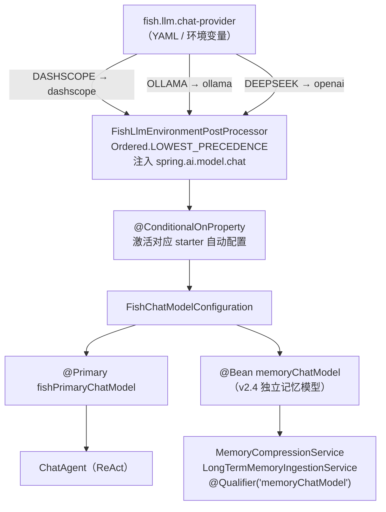
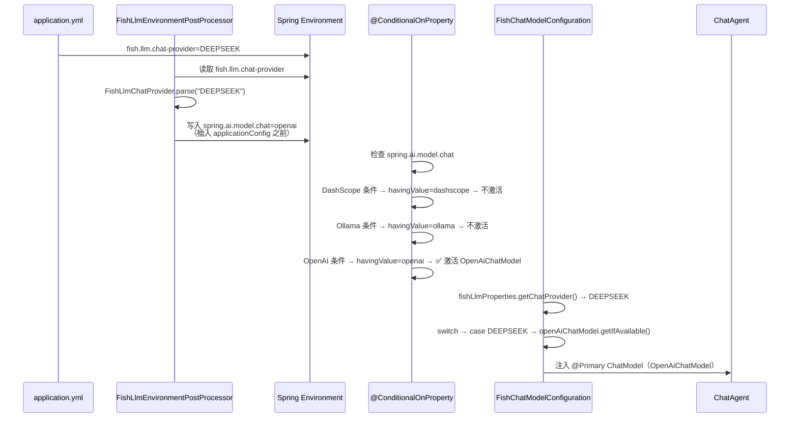
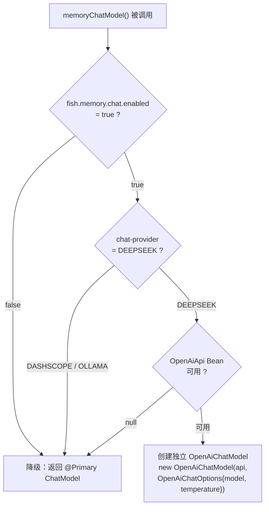

# 模块 2：模型路由体系

## 一句话定位

通过 **EnvironmentPostProcessor** 早期注入 + **`@ConditionalOnProperty`** 条件装配 + **`@Primary`** 收敛，实现 DashScope / Ollama / DeepSeek 三路对话路由与嵌入路由完全解耦，**切换只需一个环境变量**，记忆链路可选独立模型。

---

## 架构图



---

## 流程图：路由决策全链路



---

## 流程图：memoryChatModel 降级链路



---

## 关键位置

### 1. FishLlmEnvironmentPostProcessor — 属性注入时机

`[FishLlmEnvironmentPostProcessor.java](../../src/main/java/com/yuyu/fishagent/llm/config/FishLlmEnvironmentPostProcessor.java)`：

```java
@Override
public int getOrder() {
    return Ordered.LOWEST_PRECEDENCE;  // 在所有 ConfigData 加载完毕后执行
}

@Override
public void postProcessEnvironment(ConfigurableEnvironment environment, SpringApplication application) {
    String raw = environment.getProperty("fish.llm.chat-provider");
    FishLlmChatProvider provider = FishLlmChatProvider.parse(raw);
    String value = provider.toSpringAiModelChatValue();  // DEEPSEEK → "openai"
    
    MapPropertySource routing = new MapPropertySource("fishLlmSpringAiModelChat",
        Collections.singletonMap("spring.ai.model.chat", value));
    
    // 插入 applicationConfig 之前 → 覆盖 YAML 中的 spring.ai.model.chat
    // 但低于 systemEnvironment → 允许 SPRING_AI_MODEL_CHAT 环境变量最终覆盖
    sources.addBefore(configAnchor, routing);
}
```

**优先级链**（高 → 低）：
```
-Dspring.ai.model.chat=xxx      ← 最高，JVM 参数
SPRING_AI_MODEL_CHAT=xxx        ← 环境变量
fishLlmSpringAiModelChat        ← PostProcessor 注入（覆盖 YAML）
applicationConfig:[yml]         ← application.yml 中的 spring.ai.model.chat
```

### 2. FishChatModelConfiguration — 双 Bean 收敛

`[FishChatModelConfiguration.java](../../src/main/java/com/yuyu/fishagent/llm/config/FishChatModelConfiguration.java)`：

- `@Bean @Primary fishPrimaryChatModel`：主对话模型，走 switch 三选一
- `@Bean("memoryChatModel")`：记忆链路模型，`@Qualifier` 注入；DEEPSEEK 下用 `OpenAiChatModel.builder()` + `ObjectProvider<OpenAiApi>` 创建独立实例；其他 provider 降级

### 3. FishLlmEmbeddingProperties + FishEmbeddingModelConfiguration — 嵌入独立路由

`[FishLlmEmbeddingProperties.java](../../src/main/java/com/yuyu/fishagent/llm/config/FishLlmEmbeddingProperties.java)`：

嵌入枚举复用 `FishLlmChatProvider`，但 `FishEmbeddingModelConfiguration` 的 switch 对 `DEEPSEEK` 抛出明确异常（当前不支持 DeepSeek 嵌入）。对话和嵌入可自由组合：Chat 用 DeepSeek 省钱 + Embedding 用 DashScope 保质量。

---

## 方案详解：EnvironmentPostProcessor + @ConditionalOnProperty + @Primary 收敛

### 我们选了什么

- **属性注入**：`FishLlmEnvironmentPostProcessor`（`Ordered.LOWEST_PRECEDENCE`）在 Spring 环境就绪早期将 `fish.llm.chat-provider` 自动推导为 `spring.ai.model.chat`
- **条件装配**：Spring AI 的 `@ConditionalOnProperty` 只激活与 `spring.ai.model.chat` 值匹配的 starter 自动配置
- **Bean 收敛**：`@Primary` + switch 穷举选出唯一 ChatModel，`@Qualifier("memoryChatModel")` 支持记忆链路独立模型

### 为什么这样选

**"一个变量切换三路模型"的体验**：用户只需要 `FISH_LLM_CHAT_PROVIDER=DEEPSEEK`，PostProcessor 自动完成 DEEPSEEK → `openai` 的映射，激活正确的 starter。不需要手动同步 `spring.ai.model.chat` 和 `fish.llm.chat-provider` 两处配置。

**fail-fast 安全性**：如果环境变量冲突（例如 `SPRING_AI_MODEL_CHAT=dashscope` 但 `fish.llm.chat-provider=DEEPSEEK`），`FishChatModelConfiguration` 会进入 `case DEEPSEEK` 但却找不到 `OpenAiChatModel` Bean，`requireBean` 直接抛 `IllegalStateException` 让应用启动失败。这比"静默连错模型"安全得多——生产环境不会偷偷跑到错误的模型上去。

**对话与嵌入独立**：`fish.llm.chat-provider` 管对话路由，`fish.llm.embedding.provider` 管嵌入路由。可以用 DeepSeek 做对话（省钱、工具调用好），同时用 DashScope 做嵌入（向量质量高、1536 维）。切换组合只需改两个环境变量。

**记忆链路独立模型**：`@Bean("memoryChatModel")` 用与主对话相同的 `OpenAiApi` 客户端（复用 HTTP 连接池和 API Key），但使用不同的 `OpenAiChatOptions`（默认 temperature=0.1，比主对话的默认更确定）。通过 `@Qualifier` 精确注入 `MemoryCompressionService`、`LongTermMemoryIngestionService`、查询重写、**v6.2 `ToolResultSummarizer`** 等"辅助链路"——凡需要"低温、禁工具、确定输出"的任务都复用它，不污染主对话路由。

> **三模型分工 [v6.x 现状]**：① `fishPrimaryChatModel`（主对话，ReAct，温度较高保创意、开 tool calling）；② `memoryChatModel`（压缩/抽取/查询重写/工具结果摘要，低温 0.1、禁工具）；③ DashScope 系（`qwen3-rerank` 精排 + `text-embedding-v2` 向量化）——对话走 DeepSeek 省钱 + 工具调用稳，嵌入/精排走 DashScope 保质量，**两个环境变量自由组合**。

### 详细运作

**EnvironmentPostProcessor 的属性源优先级链**（从高到低）：

```
-Dspring.ai.model.chat=xxx          ← JVM 启动参数（最高优先）
SPRING_AI_MODEL_CHAT=xxx            ← 系统环境变量
fishLlmSpringAiModelChat            ← PostProcessor 注入（覆盖 YAML）
applicationConfig:[classpath:/application.yml]
```

PostProcessor 用 `sources.addBefore(configAnchor, routing)` 插入到 `applicationConfig` 之前——这意味着它覆盖 YAML 中的 `spring.ai.model.chat`（如果有），但允许环境变量做最终覆盖。这种设计兼顾了"默认自动推导"和"高级用户手动覆盖"。

**`@ConditionalOnProperty` 如何精确控制谁激活**：

| Provider | `spring.ai.model.chat` 值 | 激活的 AutoConfig | 产生的 Bean |
|----------|--------------------------|-------------------|------------|
| DASHSCOPE | `dashscope` | DashScope 自动配置 | `DashScopeChatModel` |
| OLLAMA | `ollama` | Ollama 自动配置 | `OllamaChatModel` |
| DEEPSEEK | `openai` | OpenAI 自动配置 | `OpenAiChatModel` |

非 Chat 模态的 OpenAI 自动配置（Speech / Transcription / Embedding / Image / Moderation）在 `application.yml` 中通过 `spring.autoconfigure.exclude` 显式排除——因为它们不检查 `spring.ai.model.chat`，无 API key 也会尝试装配，导致启动失败。

**`memoryChatModel` 的降级链路**：

```
fish.memory.chat.enabled = false？
  → 是 → 返回 @Primary（零额外 Bean）
  → 否 → chat-provider = DEEPSEEK？
           → 否 → 返回 @Primary（DASHSCOPE/OLLAMA 暂不支持独立记忆模型）
           → 是 → OpenAiApi Bean 可用？
                    → 否 → 返回 @Primary（降级）
                    → 是 → 创建独立 OpenAiChatModel(api, opts)
```

---

## 技术选型对比

### 对比一：EnvironmentPostProcessor vs YAML 直接配置 vs Profile

**方案 A：YAML 直接写 `spring.ai.model.chat`**

```yaml
spring:
  ai:
    model:
      chat: openai
```

最简单直接。但需要维护两个配置项的同步：`fish.llm.chat-provider=DEEPSEEK` 和 `spring.ai.model.chat=openai`。如果改了一个忘了另一个，会出现"业务层以为在用 DeepSeek、框架层却激活了 DashScope"的不一致。而且 mapping 关系（DEEPSEEK → openai）在每个开发者的脑子里，没有强制约束。

**方案 B：Spring Profile**

```yaml
spring:
  config:
    activate:
      on-profile: deepseek
  ai:
    model:
      chat: openai
```

通过 profile 切换环境，比方案 A 好——至少避免了两处配置同步。但缺点是需要额外维护多套 profile YAML，且 profile 切换在本地开发、测试、生产环境容易搞混。

**方案 C：EnvironmentPostProcessor（本项目）**

`FishLlmEnvironmentPostProcessor` 在环境就绪早期自动将 `fish.llm.chat-provider`（业务枚举）转换为 `spring.ai.model.chat`（框架属性）。用户只需改一个变量（`FISH_LLM_CHAT_PROVIDER=DEEPSEEK`），映射关系由代码保证。且属性源插入优先级明确（高于 YAML 但低于系统环境变量），允许 `SPRING_AI_MODEL_CHAT` 做最终覆盖。

| 维度 | YAML 直接 | Profile | EnvironmentPostProcessor（本项目） |
|------|----------|---------|--------------------------------|
| 配置项数量 | 2 处需同步 | 每个 profile 1 处 | 1 处（`fish.llm.chat-provider`） |
| 映射正确性 | 依赖开发者记忆 | 依赖 profile 命名 | 代码强制 `enum → value` |
| 环境变量覆盖 | 无法（环境变量会覆盖 YAML） | 受 profile 限制 | ✅ 通过属性源优先级支持 |
| 启动失败快 | 慢（连错模型可能运行时才发现） | 中等 | ✅ fail-fast：枚举解析失败直接无法启动 |
| 实现复杂度 | 低（零代码） | 低（YAML 片段） | 中（约 100 行 PostProcessor） |

### 对比二：@Primary vs @Qualifier 全局

**方案 A：全局 @Qualifier**

每个注入 ChatModel 的地方都标注具体 Bean 名：
```java
@Qualifier("openAiChatModel") private final ChatModel chatModel;  // ChatAgent
@Qualifier("openAiChatModel") private final ChatModel chatModel;  // MemoryCompressionService
@Qualifier("openAiChatModel") private final ChatModel chatModel;  // LongTermMemoryIngestionService
```

一旦路由策略变了（例如从 DeepSeek 切到 DashScope），所有注入点都要改。耦合太重。

**方案 B：@Primary 收敛 + 例外用 @Qualifier（本项目）**

`FishChatModelConfiguration` 提供一个 `@Primary` Bean。所有不关心具体实现的消费者按类型注入即可。只有需要**不同**模型的消费者才用 `@Qualifier` 例外（如 `memoryChatModel`）。

| 维度 | 全局 @Qualifier | @Primary + 例外 @Qualifier（本项目） |
|------|----------------|-----------------------------------|
| 切换后端成本 | 改所有注入点 | 0（@Primary 自动切换） |
| 代码可读性 | 差（到处是 Bean 名） | 好（默认注入不写注解） |
| 特殊情况 | 全用 Qualifier | @Qualifier 仅标记例外 |
| Bean 发现 | 必须知道所有 Bean 名 | IDE 按类型自动补全 |

### 对比三：DeepSeek 接入方式 — OpenAI 适配器 vs 独立 starter vs 自定义适配器

**方案 A：独立 DeepSeek Starter**

为 DeepSeek 专门写一个 `spring-ai-starter-model-deepseek`，对齐其专有 API（如果有的话）。优势是可以利用 DeepSeek 特有参数；劣势是需要维护一个完整 starter（自动配置 + properties 绑定 + 条件注解），以及应对 DeepSeek API 更新时的同步改版。

**方案 B：自定义适配器**

基于 Spring AI 的 `ChatModel` SPI 手写一个 `DeepSeekChatModel` 实现类，直接用 RestClient 调 DeepSeek API。灵活性最高，但需要自己处理：流式解析、tool calling 转换、OpenAi vs DeepSeek 的 JSON Schema 差异、异常重试等。本质是"从零实现一个 Spring AI 模型接入层"。

**方案 C：复用 OpenAI 兼容适配器（本项目）**

DeepSeek API 完整实现了 OpenAI Chat Completions 接口（`POST /v1/chat/completions`），payload 和 response 格式完全一致。Spring AI 已有的 `spring-ai-starter-model-openai` 提供了成熟的：
- `OpenAiApi`：RestClient 封装 + API 认证
- `OpenAiChatModel`：ChatModel SPI 实现 + 流式支持 + tool calling 转换
- `OpenAiAutoConfiguration`：属性绑定 + 条件装配

只需把 `spring.ai.openai.base-url` 从 `https://api.openai.com` 改为 `https://api.deepseek.com`，整个自动配置栈复用，零代码即可接入。

| 维度 | 独立 starter | 自定义适配器 | OpenAI 复用（本项目） |
|------|------------|-------------|------------------|
| 开发成本 | 高（新建 starter 项目） | 最高（手写所有逻辑） | 零（4 行 YAML 配置） |
| 维护成本 | 高（跟踪 DeepSeek 更新） | 最高（自己修 bug） | 低（Spring AI 上游维护） |
| 功能完整性 | 取决于开发投入 | 取决于手写质量 | ✅ OpenAI starter 的成熟度 |
| tool calling | 需单独适配 | 需单独适配 | ✅ 开箱即用 |
| 流式支持 | 需单独适配 | 需单独适配 | ✅ 开箱即用 |
| DeepSeek 专有特性 | ✅ 可用 | ✅ 可用 | 需通过自定义 options 注入 |
| 风险 | DeepSeek 可能变 API | 所有异常自己扛 | DeepSeek 兼容性变化时需适配 |

**DeepSeek 不兼容的已知问题**：
- `deepseek-v4-pro` / `deepseek-reasoner` 的 tool calling 不支持或与 OpenAI 行为差异大——统一用 `deepseek-chat`
- `"strict": true` 参数不被 DeepSeek 支持（Spring AI OpenAI 适配器可能发送），需要关注

---

## 面试追问预判

**Q：用了 @Primary，为什么还要 EnvironmentPostProcessor 写 spring.ai.model.chat？**

两个解决不同问题。PostProcessor 负责"让哪个 starter 的自动配置激活"——`@ConditionalOnProperty` 检查 `spring.ai.model.chat`，值为 `openai` 才注册 `OpenAiChatModel` Bean。`@Primary` 负责"当多个 ChatModel Bean 同时存在时（理论上可能），选哪个注入"。两者配合：PostProcessor 让不需要的 Bean 不注册（减少上下文中的 Bean 数量），@Primary 兜底（万一有多个，用这个）。

**Q：如果 SPRING_AI_MODEL_CHAT 环境变量被误设为 dashscope，但 fish.llm.chat-provider=DEEPSEEK，会发生什么？**

应用**启动失败**。`FishChatModelConfiguration` 进入 `case DEEPSEEK`，但 `OpenAiChatModel` 未注册（Spring AI OpenAI 自动配置因 `spring.ai.model.chat` 不是 `openai` 不激活），`requireBean` 抛 `IllegalStateException`。这是 fail-fast 设计——不在生产静默连错模型。错误消息明确指出矛盾所在，修正方式清晰。

**Q：memoryChatModel 为什么不用 builder(template)？**

Spring AI 1.1.4 的 `OpenAiChatModel.builder()` 无参，不支持传入模板复制。改为 `ObjectProvider<OpenAiApi>` 获取 API 客户端 + `OpenAiChatModel.builder().openAiApi(api).defaultOptions(opts).build()`。记忆链路（压缩、抽取）不需要 tool calling，独立 options 反而更干净——temperature 设为 0.1 保证抽取和压缩的输出稳定性。

**Q：多实例部署时，模型路由有状态问题吗？**

完全没有。`FishChatModelConfiguration` 是 `@Configuration` 类，在**启动期**通过 `@ConditionalOnProperty` 决定激活哪个 Bean——这是 Spring 容器级别的单例，运行时不存在"切换"或"状态"。所有实例读同一个环境变量 `FISH_LLM_CHAT_PROVIDER`，容器启动后 Bean 已固定。如果要动态切换模型（不重启），需要引入配置中心（如 Nacos）+ 刷新机制，这是未来的可扩展点，当前不需要。

---

## 最难/最有挑战的事情：EnvironmentPostProcessor 的属性源优先级陷阱

### 问题
Fish-Agent 支持 DashScope / Ollama / DeepSeek 三路模型切换。Spring AI 的自动配置通过 `@ConditionalOnProperty("spring.ai.model.chat")` 决定激活哪个 starter。但用户只想配一个业务枚举 `fish.llm.chat-provider=DEEPSEEK`，不想同时维护 `spring.ai.model.chat=openai` 这种框架内部属性。

### 挑战
`FishLlmEnvironmentPostProcessor` 需要在 Spring 环境就绪早期把 `fish.llm.chat-provider`（业务枚举）自动推导为 `spring.ai.model.chat`（框架属性）。难的不是写代码——难的是**属性源优先级**：PostProcessor 注入的属性必须覆盖 YAML 但不能覆盖环境变量，而且必须在所有自动配置检查之前生效。

### 解决方案
- PostProcessor 使用 `Ordered.LOWEST_PRECEDENCE` 确保在所有 ConfigData 加载后执行
- 用 `sources.addBefore(configAnchor, routing)` 插入到 `applicationConfig` 之前——覆盖 YAML 但低于 `systemEnvironment`
- 优先级链：`-D` JVM 参数 > `SPRING_AI_MODEL_CHAT` 环境变量 > PostProcessor 注入 > YAML
- 如果优先级搞反了（比如 `addAfter`），PostProcessor 注入会被 YAML 中的旧值覆盖；如果插入太高（`addFirst`），环境变量无法覆盖

### 面试回答要点
> "模型路由最难的不是三路 switch，而是 EnvironmentPostProcessor 的属性源插入位置。必须用 `addBefore(applicationConfig)` 插入——覆盖 YAML 但允许环境变量做最终覆盖。搞反了要么 YAML 旧值覆盖新值（启动连错模型），要么环境变量失效（运维无法热覆盖）。加上 fail-fast 设计：如果环境变量和业务枚举矛盾，`FishChatModelConfiguration` 会因为找不到对应 Bean 让应用直接启动失败，而不是静默连错模型。"

---

## 关联代码路径速查

| 职责 | 路径 |
|------|------|
| 对话提供方枚举 | `llm/config/FishLlmChatProvider.java` |
| 环境后处理器 | `llm/config/FishLlmEnvironmentPostProcessor.java` |
| 对话 Bean 选择 | `llm/config/FishChatModelConfiguration.java` |
| 嵌入 Bean 选择 | `llm/config/FishEmbeddingModelConfiguration.java` |
| 对话属性 | `llm/config/FishLlmProperties.java` |
| 嵌入属性 | `llm/config/FishLlmEmbeddingProperties.java` |
| 启动一致性校验 | `llm/config/FishLlmConfigurationConsistencyLogger.java` |
| 记忆链路模型配置 | `memory/config/MemoryProperties.java`（MemoryChatProperties 嵌套类） |
