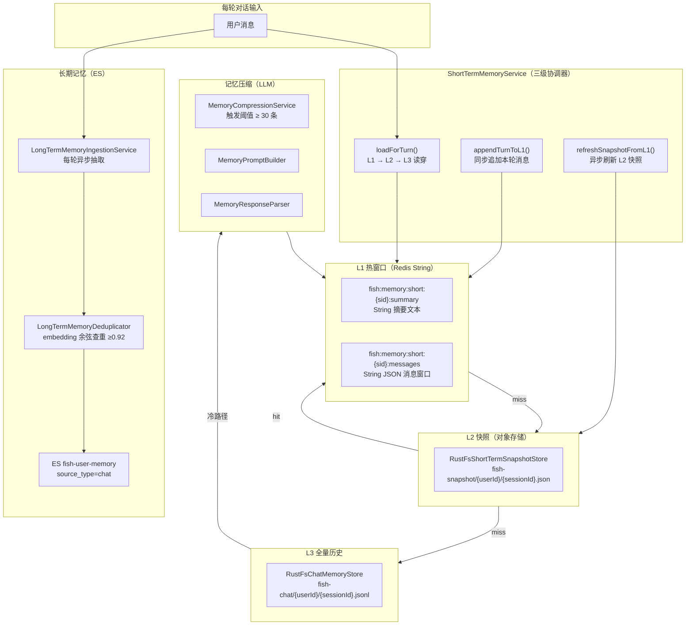
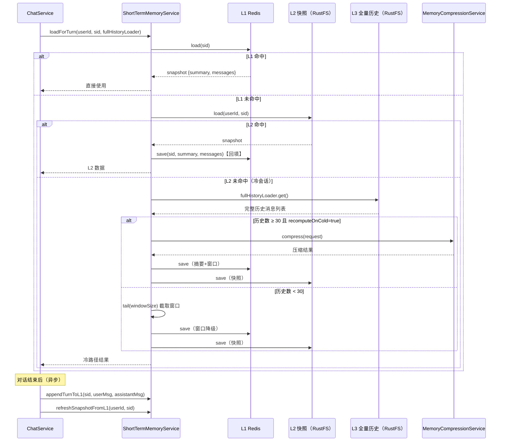
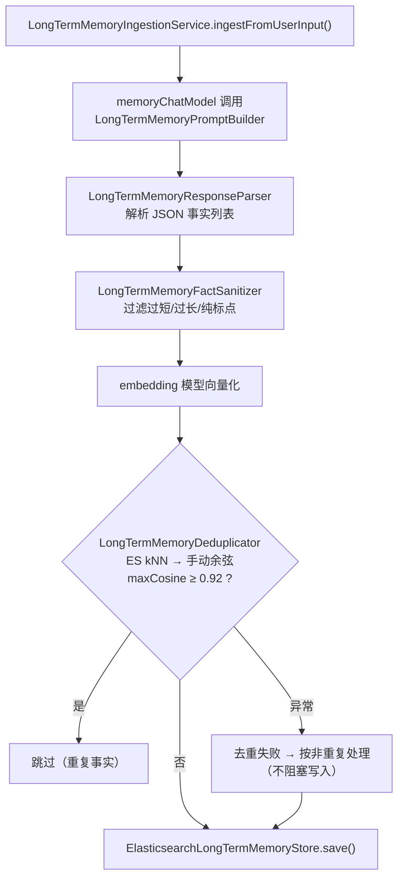

# 模块 3：分层记忆

## 一句话定位

**L1 热窗口（Redis）→ L2 快照（对象存储）→ L3 全量历史（对象存储）** 三级读穿写穿，配合 **LLM 异步压缩** 与 **长期事实去重写入**，实现跨会话记忆的高效加载与持久化。

> **注意**：RAG 检索增强管线（召回、融合、精排、查询分解、HyDE、质量追踪）已拆分至 [模块 7：RAG 检索增强管线](模块7-RAG检索增强管线.md)。

---

## 架构图



---

## 流程图：三级读穿写穿



---

## 流程图：长期事实写入（含去重）



---

## 关键位置

### 1. ShortTermMemoryService — 三级协调器（v3.1）

`[ShortTermMemoryService.java](../../src/main/java/com/yuyu/fishagent/memory/shortterm/ShortTermMemoryService.java)`：

**L1 → L2 → L3 读穿逻辑**：

```java
public ShortTermMemoryLoadResult loadForTurnWithMetadata(Long userId, String sessionId,
                                                         Supplier<List<ChatMessageDTO>> fullHistoryLoader) {
    // L1: Redis 热窗口
    ShortTermMemorySnapshot l1Snap = safeSnapshot(l1.load(sessionId));
    if (isNonEmpty(l1Snap)) {
        return new ShortTermMemoryLoadResult(l1Snap, false);
    }
    // L2: 对象存储快照（miss 后回填 L1）
    if (properties.getSnapshot().isEnabled()) {
        ShortTermMemorySnapshot l2Snap = safeSnapshot(l2.load(userId, sessionId));
        if (isNonEmpty(l2Snap)) {
            l1.save(sessionId, safeSummary(l2Snap), safeMessages(l2Snap));
            return new ShortTermMemoryLoadResult(l2Snap, false);
        }
    }
    // L3: 全量历史（冷会话，可能触发同步压缩）
    List<ChatMessageDTO> full = fullHistoryLoader.get();
    if (full.size() >= properties.getSummaryTriggerThreshold()) {
        compression.compress(new MemoryCompressionRequest(sessionId, full));
        // 压缩后 L1 已有摘要，同步写 L2
    }
    // ... 窗口降级路径
}
```

**设计要点**：
- `compressedOnColdPath` 标记冷会话首轮是否已同步压缩，供 ChatService 避免重复触发
- `shouldLoadFullHistoryForMaintenance()` 判断异步维护是否值得回源 L3
- `clear()` 尽力清理 L1 + L2，单层失败不影响另一层

### 2. 短期记忆 L1 存储层

`[RedisShortTermMemoryStore.java](../../src/main/java/com/yuyu/fishagent/memory/shortterm/RedisShortTermMemoryStore.java)`：

- **summary key**：`fish:memory:short:{sessionId}:summary`（String）
- **messages key**：`fish:memory:short:{sessionId}:messages`（String，JSON 序列化消息列表）
- TTL：`short-term-ttl-days`（默认 30 天），summary 和 messages 共用
- `load()` 同时返回摘要 + 窗口消息；`save()` 分别写入两个 key

### 3. 短期记忆 L2 快照层

`[RustFsShortTermSnapshotStore.java](../../src/main/java/com/yuyu/fishagent/memory/shortterm/RustFsShortTermSnapshotStore.java)`：

- 存储路径：`fish-snapshot/{userId}/{sessionId}.json`
- 将 `ShortTermMemorySnapshot` 序列化为 JSON 写入 RustFS 对象存储
- L1 miss 时从此处加载并回填 L1，保证热路径后续命中
- 配置开关：`fish.memory.snapshot.enabled`

### 4. 记忆压缩：LLM 异步触发

`[MemoryCompressionService.java](../../src/main/java/com/yuyu/fishagent/memory/MemoryCompressionService.java)`：

由 `ChatService` 每轮对话结束后通过 `CompletableFuture.runAsync()` 异步调用。触发条件：历史消息数 ≥ 30 条。

**压缩 Prompt 设计**（`MemoryPromptBuilder`）：
- 输入完整 chat_history
- 输出 `{"short_term_summary": "...", "long_term_facts": []}`
- **关键约束**：`long_term_facts` 必须返回空数组——压缩只管摘要，不提取长期事实
- 压缩后摘要通常 500-1000 字符，远小于原始 30 条消息

### 5. 长期事实抽取

`[LongTermMemoryIngestionService.java](../../src/main/java/com/yuyu/fishagent/memory/LongTermMemoryIngestionService.java)`：

- 每轮对话结束后异步调用 `ingestFromUserInput()`
- 使用 `memoryChatModel`（独立 ChatModel，temperature=0.1）判断用户输入是否含稳定事实
- `LongTermMemoryPromptBuilder` 严格白名单过滤——只提取：①用户身份 ②明确偏好 ③长期目标/约束
- 黑名单过滤——寒暄、疑问句中的未确认事实、助手推测、情绪抱怨均不保存

### 6. 长期事实去重（v3.6）

`[LongTermMemoryDeduplicator.java](../../src/main/java/com/yuyu/fishagent/memory/longterm/LongTermMemoryDeduplicator.java)`：

```java
public boolean isDuplicate(ElasticsearchOperations operations, IndexCoordinates index,
                           String userId, List<Float> candidateVector) {
    // 1. ES kNN 查找候选邻居（同 user_id + source_type=chat）
    // 2. 从 SearchHit 中提取原始 embedding 向量
    // 3. 手动重算精确余弦相似度
    // 4. maxCosine ≥ 0.92 → 判定为重复，跳过写入
}
```

**为什么手动 cosine 而不用 ES 分数**：
1. ES kNN 是 ANN 近似搜索，分数经 `(1+cos)/2` 归一化，与原始余弦阈值不一致
2. 手动从文档中提取 embedding 向量，做精确点积计算，保证阈值判断的准确性

**降级策略**：去重查询失败（ES 异常）→ 返回 `false`（不阻塞写入）

配置项（`fish.memory.dedup.*`）：

| 配置 | 默认值 | 说明 |
|------|--------|------|
| `enabled` | true | 是否启用去重 |
| `similarity-threshold` | 0.92 | 余弦相似度阈值 |
| `k` | 3 | kNN 查询的 k 值 |
| `num-candidates` | 20 | kNN 候选集大小 |

---

## 方案详解

### 我们选了什么

- **三级短期记忆**：L1（Redis 热窗口）→ L2（对象存储快照）→ L3（全量历史），读穿写穿
- **长期事实存储**：ES `fish-user-memory`（对话事实，`source_type=chat`）
- **记忆压缩**：LLM 异步压缩历史为摘要 JSON，触发阈值 30 条消息
- **长期事实去重**：ES kNN 候选 + 手动余弦精确验证，≥0.92 阈值判重

### 为什么这样选

**三级读穿写穿解决冷启动问题（v3.1）**。旧方案中 Redis 短期记忆有 TTL（30 天），到期后下次对话需要从全量历史重新加载。全量历史在对象存储中（RustFS），读取延迟高（10-100ms）。三级方案通过 L2 快照层（压缩后的摘要+窗口）在 Redis miss 时提供快速回源（通常 < 10ms），避免每次冷会话都触发 L3 全量读取 + 同步压缩。

**冷会话的同步压缩是必要的权衡**。如果 L1 和 L2 都 miss，说明是很久未活跃的会话。此时从 L3 加载全量历史，如果超过 30 条则同步触发 LLM 压缩——虽然增加首字延迟（1-3 秒），但保证后续对话质量（有摘要而非仅窗口截断）。`compressedOnColdPath` 标记让 ChatService 知道首轮已压缩，不再重复触发。

**长期事实去重避免知识冗余（v3.6）**。用户在不同对话中可能反复提及相同偏好（"我喜欢用 Docker 部署"），旧方案每次都会写入 ES 导致重复事实堆积。去重器用 embedding 余弦相似度判断，≥0.92 认定为同一事实跳过写入。选择手动 cosine 而非 ES 分数是因为 ES kNN 是 ANN 近似且分数做了归一化，直接用 0.92 阈值会不一致。

### 详细运作

**三级读穿的典型路径**：

```
热会话（L1 命中）：
  loadForTurn() → Redis GET → 命中 → 直接返回
  延迟：~1ms

温会话（L1 miss, L2 命中）：
  loadForTurn() → Redis GET → miss
    → RustFS GET snapshot → 命中
    → Redis SET 回填 L1 → 返回
  延迟：~10ms

冷会话（L1/L2 均 miss）：
  loadForTurn() → Redis GET → miss
    → RustFS GET snapshot → miss
    → RustFS GET 全量历史 → 返回 N 条消息
    → N ≥ 30 → LLM 压缩 → Redis SET + RustFS PUT
    → N < 30 → tail(windowSize) 截断 → Redis SET + RustFS PUT
  延迟：~1-3s（压缩路径）/ ~50ms（窗口降级路径）
```

**写穿流程（每轮对话结束后）**：

```
ChatService（异步回调）：
  1. appendTurnToL1(sid, userMsg, assistantMsg)
     → Redis GET 现有窗口 → 追加 → 裁剪到 windowSize → Redis SET
  2. refreshSnapshotFromL1(userId, sid)
     → Redis GET → RustFS PUT（异步，失败仅记日志）
```

**长期事实写入全链路**：

```
ChatService.triggerLongTermMemoryIngestion(userId, sid, userInput)
  → CompletableFuture.runAsync()
    → LongTermMemoryIngestionService.ingestFromUserInput()
      → memoryChatModel.call(prompt)  // LLM 判断是否含稳定事实
      → LongTermMemoryResponseParser.parse()  // 解析 JSON
      → LongTermMemoryFactSanitizer.sanitize()  // 过滤
      → 对每条事实：
          → embedding 模型向量化（1536 维）
          → LongTermMemoryDeduplicator.isDuplicate()
            → ES kNN(user_id, source_type=chat) → 取邻居 embedding
            → 手动 cosine(queryVec, neighborVec) → maxCosine
            → maxCosine ≥ 0.92 → skip
            → maxCosine < 0.92 → ElasticsearchLongTermMemoryStore.save()
```

---

## 技术选型对比

### 对比一：三级读穿写穿 vs 两级（Redis + L3 全量） vs 单级 Redis

| 维度 | 单级 Redis | 两级（Redis + L3） | 三级读穿写穿（本项目） |
|------|-----------|-------------------|---------------------|
| 冷会话延迟 | 30 天 TTL 后丢失 | 需读 L3 + 同步压缩（1-3s） | L2 快照命中时 ~10ms |
| 数据安全 | Redis 宕机即丢失 | L3 全量兜底 | L2 + L3 双层兜底 |
| 存储成本 | 高（全在内存） | 低 | 低（热数据在 Redis，冷数据在对象存储） |
| 实现复杂度 | 低 | 中 | 中高（三级协调） |
| Redis miss 回源 | 不可回源 | 慢（L3 全量读） | 快（L2 快照 → 慢（L3 全量） |

**为什么不用两级**：两级方案中 Redis miss 后直接读 L3 全量历史，要么做同步压缩（慢），要么截取窗口（丢失摘要）。三级方案插入 L2 快照层，大多数温会话（几天到几周未活跃）能从 L2 快速恢复（摘要+窗口都保留），无需触发 L3。

### 对比二：长期事实去重 — ES kNN + 手动余弦 vs ES 分数直接判断 vs 不去重

| 维度 | 不去重 | ES 分数直接判断 | ES kNN + 手动余弦（本项目） |
|------|--------|---------------|--------------------------|
| 重复事实堆积 | ❌ 严重 | 可缓解 | ✅ 精确控制 |
| 阈值一致性 | N/A | ❌ ES 归一化后与原始余弦不一致 | ✅ 手动计算原始余弦 |
| 计算开销 | 零 | 低（ES 已有分数） | 中（需额外向量提取+计算） |
| 准确率 | N/A | 中（ANN 近似） | ✅ 高（精确余弦） |

**为什么选手动余弦**：ES 8.x 的 kNN 分数是 `(1 + cosine_similarity) / 2` 归一化后的值，范围 [0, 1]。直接用 ES 分数与 0.92 阈值比较，需要做反向归一化（`cos = score * 2 - 1`），且 kNN 本身是 ANN 近似搜索。手动提取邻居向量做精确余弦，虽然多一步计算，但阈值判断的准确性有保证。

### 对比三：记忆压缩 — 同步 vs 异步

**方案 A：同步压缩**

`done` 事件发送前先完成 LLM 压缩（1-5s），用户看到"生成完成"时摘要已写入 Redis。好处是数据一致性高，下一轮对话能立刻用上摘要。缺点是用户多等 1-5 秒。

**方案 B：异步压缩（本项目）**

`CompletableFuture.runAsync()` 不阻塞 `done` 事件返回。用户立刻看到完整回复。压缩失败（LLM 超时 / 临时不可用）只记日志不影响已完成对话。代价是如果用户在压缩完成前立刻发下一条消息，那一条将使用旧摘要——发生概率极低且影响微小。

---

## 面试追问预判

**Q：三级读穿写穿中，L1 和 L2 的数据一致性怎么保证？**

L2 快照的更新是异步的（`refreshSnapshotFromL1`），不与 L1 写入在同一个事务中。这意味着 L2 可能比 L1 旧一轮。但这是可接受的——L2 的作用是"冷会话快速恢复"，不是"实时镜像"。即使 L2 数据旧一轮，也比从 L3 全量重新加载快得多。且下一轮对话结束后 `refreshSnapshotFromL1` 会自动追平。

**Q：冷会话同步压缩会不会阻塞用户？**

会，但有缓解措施：①同步压缩只在 L1 和 L2 都 miss 时触发（冷会话，概率低）；② `compressedOnColdPath` 标记让 ChatService 知道首轮已压缩，跳过当轮的异步压缩；③如果压缩失败（LLM 超时），降级为窗口截断（`tail(windowSize)`），保证对话不中断。

**Q：长期事实如何避免写入重复/相似事实？**

v3.6 引入 `LongTermMemoryDeduplicator`：写入前先用 embedding 向量在 ES 中做 kNN 搜索（同 user_id + source_type=chat），取最近的 k 个邻居的原始向量，手动计算精确余弦相似度。maxCosine ≥ 0.92 判定为重复事实，跳过写入。去重失败（ES 异常）时降级为不去重（返回 false），保证不阻塞写入。这是"宁可多存不可漏存"的策略——少量重复不影响检索效果（`max-injected-facts=8` 限制注入数量），但漏存关键事实会影响对话质量。

**Q：记忆压缩和事实抽取的 prompt 为什么分开？**

两个 prompt 职责完全不同：

- **压缩 prompt**（`MemoryPromptBuilder`）：批量处理历史（30 条），生成摘要。`long_term_facts` 强制返回空数组，避免压缩链路和抽取链路同时写入 ES 导致重复。
- **事实抽取 prompt**（`LongTermMemoryPromptBuilder`）：仅分析当前用户输入，严格白名单过滤。输出粒度是单条事实。

分开的原因：输入粒度不同（批量 vs 单条）、输出 schema 不同、调用频率不同（压缩 ≥30 条才触发，抽取每轮都跑）。

**Q：短期记忆 L2 快照存对象存储而不是 Redis，性能不会差吗？**

L2 快照是**冷数据**，只在 L1 miss 时访问。热会话（每天使用）永远走 L1 Redis（~1ms）。L2 的典型访问场景是"用户隔了几天再来"——此时 Redis TTL 过期、L1 为空，从 L2 对象存储读取（~10ms）比从 L3 全量历史重新加载 + 压缩（1-3s）快两个数量级。存储成本上，对象存储（磁盘）比 Redis（内存）便宜 10-100 倍。

**Q：RAG 三路检索的 user_id filter 在哪个环节做？**

RAG 检索层的三个 Searcher 在 ES 查询时拼接 `user_id` term filter。`UserContextHolder`（ThreadLocal）在主线程中由 `GlobalAuthInterceptor` 写入，在 RAG 异步检索时通过显式快照回放传递给虚拟线程。这属于认证与多租户模块（模块 6）和 RAG 检索模块（模块 7）的内容。

---

## 关联代码路径速查

| 职责 | 路径 |
|------|------|
| **短期记忆三级协调器** | `memory/shortterm/ShortTermMemoryService.java` |
| L1 热窗口存储 | `memory/shortterm/RedisShortTermMemoryStore.java` |
| L2 快照存储（RustFS） | `memory/shortterm/RustFsShortTermSnapshotStore.java` |
| L2 快照存储（文件） | `memory/shortterm/FileShortTermSnapshotStore.java` |
| 短期记忆快照 DTO | `memory/shortterm/ShortTermMemorySnapshot.java` |
| 短期记忆接口 | `memory/shortterm/ShortTermMemoryStore.java` |
| 快照存储接口 | `memory/shortterm/ShortTermSnapshotStore.java` |
| **记忆压缩编排** | `memory/MemoryCompressionService.java` |
| 压缩 Prompt 构建 | `memory/compress/MemoryPromptBuilder.java` |
| 压缩响应解析 | `memory/compress/MemoryResponseParser.java` |
| 压缩请求/结果 DTO | `memory/dto/MemoryCompressionRequest.java` / `Result.java` |
| **长期事实抽取** | `memory/LongTermMemoryIngestionService.java` |
| 事实 Prompt 构建 | `memory/longterm/LongTermMemoryPromptBuilder.java` |
| 事实响应解析 | `memory/longterm/LongTermMemoryResponseParser.java` |
| 事实清洗 | `memory/longterm/LongTermMemoryFactSanitizer.java` |
| 长期事实 ES 存储 | `memory/longterm/ElasticsearchLongTermMemoryStore.java` |
| **长期事实去重（v3.6）** | `memory/longterm/LongTermMemoryDeduplicator.java` |
| 记忆配置 | `memory/config/MemoryProperties.java`（含 Dedup / MemoryChatProperties 嵌套类） |
| 对话编排（调用记忆服务） | `chat/ChatService.java` |
