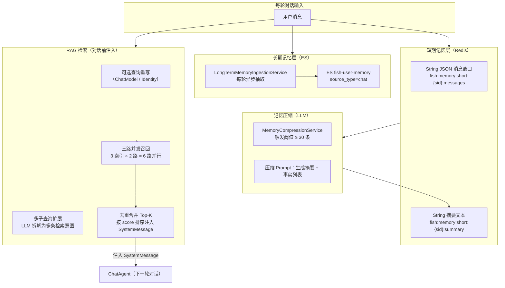
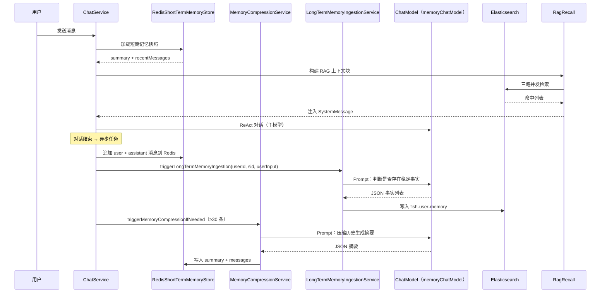
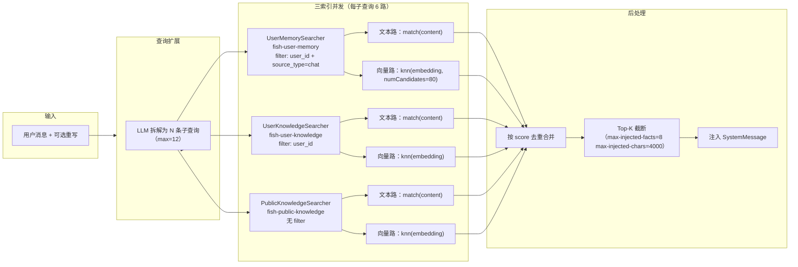

# 模块 3：分层记忆与 RAG

## 一句话定位

**短期记忆（Redis String JSON）→ 压缩摘要（LLM）→ 长期事实（ES）→ RAG 召回注入**四层流水线，配合 **三索引 × 双路（文本 + 向量）并发检索**，在**虚拟线程**下保证 ThreadLocal 隔离，实现跨会话的知识复用。

---

## 架构图



---

## 流程图：记忆全生命周期



---

## 流程图：RAG 三路并发召回



---

## 关键位置

### 1. 短期记忆：Redis String 消息窗口

`[RedisShortTermMemoryStore.java](../../src/main/java/com/yuyu/fishagent/agent/memory/shortterm/RedisShortTermMemoryStore.java)`：

- **summary key**：`fish:memory:short:{sessionId}:summary`（String）
- **messages key**：`fish:memory:short:{sessionId}:messages`（String，JSON 序列化消息列表）
- TTL：`short-term-ttl-days`（默认 30 天），summary 和 messages 共用
- 加载快照时同时返回摘要 + 窗口消息，供 `buildMessages` 使用

### 2. RAG 编排：虚拟线程 + ThreadLocal 回放

`[RagRecall.java](../../src/main/java/com/yuyu/fishagent/agent/memory/rag/recall/RagRecall.java)`：

三个 Searcher 并发执行时，`UserContextHolder`（ThreadLocal）在虚拟线程间不会自动传递。解决方式：
- 进入异步前从 `UserContextHolder.get()` 快照 `userId`
- 在异步线程/回调中显式 `UserContextHolder.set(snapshot)` 回放
- 完成后 `UserContextHolder.clear()`

配置项（`fish.rag.recall.*`）：

| 配置 | 默认值 | 说明 |
|------|--------|------|
| `per-subquery-size` | 5 | 单子查询每路召回数 |
| `max-sub-queries` | 12 | 最大并行子查询数 |
| `knn-num-candidates` | 80 | kNN 候选集大小 |
| `vector-leg-enabled` | true | 向量召回开关 |

### 3. 长期记忆：异步抽取 + 防御性 filter

`[LongTermMemoryIngestionService.java](../../src/main/java/com/yuyu/fishagent/service/LongTermMemoryIngestionService.java)`：

由 `ChatService` 每轮对话结束后通过 `CompletableFuture.runAsync()` 异步调用 `ingestFromUserInput()`，LLM 判断用户输入中是否含稳定事实 → 抽取 → ES 写入。

`[UserMemoryElasticsearchSearcher.java](../../src/main/java/com/yuyu/fishagent/agent/memory/rag/recall/UserMemoryElasticsearchSearcher.java)` 第 56 行：

```java
.filter(f -> f.term(t -> t.field("source_type").value("chat")))
```

即使历史有 `source_type=document` 误写入，也不会混入记忆上下文。这是**防御性约束**，与知识库文档切片严格分离。

---

## 方案详解：Redis 短期 + ES 长期 + 三索引双路 RAG

### 我们选了什么

- **短期存储**：Redis String（消息窗口 JSON + 摘要文本），30 天 TTL
- **长期存储**：ES `fish-user-memory`（对话事实，`source_type=chat`）
- **记忆压缩**：LLM 异步压缩历史为摘要 JSON，触发阈值 30 条消息
- **RAG 检索**：三索引（用户记忆 / 用户文档 / 公共知识）× 双路（文本 `match` + 向量 `knn`），虚拟线程并发

### 为什么这样选

**分层不是按数据类型，而是按访问模式**。短期窗口在每轮对话开始时**同步**加载——延迟直接影响用户首字等待时间，必须是 Redis 的微秒级。长期事实在检索时**异步**注入——允许 ES 的毫秒级查询。如果反过来（短期放 ES、长期放 Redis），要么首字等到 50ms+，要么长期事实吃内存吃到爆炸。

**三索引分离的实际收益**：

```
用户:"之前聊过的 Docker Compose 怎么配置？"
  → 用户记忆索引（source_type=chat）→ 命中 "使用 docker-compose.yml 定义服务"
  → 用户文档索引（user_id filter）→ 命中文档里 "Docker Compose 最佳实践"
  → 公共知识索引（无 filter）→ 命中公司知识库的 "容器化部署规范"
  → 三个来源的知识合并去重后注入上下文
```

如果不分离索引，需要在一个索引里用复杂的 `bool` filter 区分来源——不仅查询复杂，而且三种数据的写入方不同（记忆由 Java 写入，文档由 Python Worker 写入），索引 DDL 无法独立演进。

**双路召回的互补性**：文本检索（`match` with `ik_max_word` 分词）对精确关键词匹配好——搜"Docker Compose"直接命中包含这个词的段落。向量检索（`knn` with `cosine`）对语义泛化好——搜"如何容器化部署"能召回"Docker Compose"相关内容，即使原文没出现"容器化"一词。两路并行召回同一索引、按 score 合并排序——单基础设施满足两种查询需求。

### 详细运作

**短期记忆的生命周期**：

```
每轮对话开始时：
  ChatService.buildMessages()
    → RedisShortTermMemoryStore.load(sid)
    → 返回 ShortTermMemorySnapshot { summary, recentMessages }
    → summary 注入 SystemMessage，recentMessages 作为多轮上下文

每轮对话结束后（异步）：
  ChatService.triggerMemoryCompressionIfNeeded()
    → 检查历史消息数 >= 30
    → CompletableFuture.runAsync()
    → MemoryCompressionService.compress(request)
    → LLM 调用（memoryChatModel）："请将以下对话压缩为摘要 JSON"
    → 解析 JSON → 写入 Redis summary + messages
```

**压缩的触发策略**：30 条是阈值，不是每轮都压。前 29 条消息不做任何处理——直接用全量历史。第 30 条触发首次压缩 → 生成摘要 → 后续每轮到 30 条时再压缩。压缩后的 summary 长度通常在 500-1000 字符，远小于原始 30 条消息。

**RAG 检索的并发模型**：

```
用户消息（如 "Docker Compose 怎么配置"）
  ↓ RagQueryRewrite（可选，当前默认关闭）
  ↓ RagQueryExpand：LLM 拆为 N 条子查询
      如："Docker Compose 基本配置" / "Docker Compose 网络配置" / ...
  ↓ 每条子查询 → 3 索引 × 2 路 = 6 路并行检索
  ↓ 虚拟线程线程池 → CompletableFuture.allOf()
  ↓ 所有结果按 score 合并去重
  ↓ 截断 Top-K（max-injected-facts=8, max-injected-chars=4000）
  ↓ 拼入 SystemMessage："以下是相关背景信息：\n1. ...\n2. ..."
```

**虚拟线程下 ThreadLocal 传递的显式处理**：在进入异步检索前，`UserContextHolder.get()` 快照到局部变量 `userId`。在 `CompletableFuture` 的 lambda 中，`UserContextHolder.set(snapshot)` 回放——确保 `user_id` filter 在异步线程中不丢失。完成后 `UserContextHolder.clear()`。

---

## 技术选型对比

### 对比一：短期 Redis + 长期 ES 的分层架构 vs 统一存储

**方案 A：全部放 Redis**

Redis 是内存数据库，读写延迟微秒级。把短期消息窗口和长期事实全部放 Redis，代码最简单。但问题很明显：跨会话的长期事实会随时间无限增长——假如每轮对话抽取 3 条事实，1000 轮就是 3000 条，每条事实 200 字 + embedding 1536 浮点（约 6KB），总计约 18MB/用户。内存昂贵且受限于物理上限，不适合"永久事实存储"。

**方案 B：全部放 ES**

ES 支持全文检索 + 向量检索，可以同时存短期和长期。但短期消息窗口的读写是**高频率的**（每轮对话至少 1 读 1 写），ES 的索引刷新间隔（默认 1s）和写延迟（毫秒级）虽不高，但合计下来比 Redis 慢 10-100 倍。对于"加载最近 20 条消息"这种高频精确操作，性能浪费明显。

**方案 C：Redis 短期 + ES 长期（本项目）**

分层依据是**访问模式**而非数据类型：

| 维度 | Redis（短期） | ES（长期） |
|------|-------------|-----------|
| 数据量 | 小且固定（最近 20 条 + 1 摘要） | 大且增长（跨会话累积） |
| 查询模式 | 精确 key（`fish:memory:short:{sid}:messages`） | 全文 + 向量检索 |
| 读写频率 | 极高（每轮对话） | 低（检索时 + 结束时写入） |
| TTL | ✅ 需要（30 天自动过期） | ❌ 不需要（事实保留用于跨会话召回） |
| 延迟要求 | 微秒级（同步加载） | 毫秒级（异步召回） |
| 存储成本 | 内存（总量可控 ≈ 20条×每条500B×并发会话数） | 磁盘（总量仅受磁盘限制） |

关键设计点：短期摘要和窗口消息在每轮对话开始时**同步**加载（`buildMessages` 的第 8 行），延迟直接影响用户首字等待时间，必须是 Redis 的微秒级。而 RAG 检索是**异步并行**的（不受首字等待影响），且需要全文 + 向量双路查询能力，ES 8.x 的 `dense_vector` + kNN + `ik_max_word` 分词是最合适的选择。

### 对比二：ES 作为向量库 vs 独立向量数据库（Milvus / Pinecone / Weaviate）

**方案 A：Milvus**

开源向量数据库，GPU 加速索引、支持十亿级向量、ANN 算法可选（HNSW / IVF_FLAT / DiskANN）。在千万级以上向量规模时优势显著——索引构建速度、QPS、召回率均优于 ES kNN。

但在本项目场景下：
- 长期事实量级：每用户数百条至数千条，全站假设 1000 用户 = 数十万条。这个量级 ES kNN 完全够用
- Milvus 需要独立部署（etcd + MinIO + Pulsar / Kafka），运维成本远高于"只加一个 ES 索引"
- 项目中 ES 已承担全文检索（`ik_max_word` 分词）——RAG 需要文本 + 向量**双路**召回。如果用 Milvus，文本路还是要靠 ES，变成两个检索引擎维护

**方案 B：Pinecone**

托管向量数据库（SaaS），零运维、自动扩缩。但：
- 数据需出站——与现有自托管 ES 不在同一网络，增加 20-50ms RTT
- 费用按 pod 计费——数十万条向量不算大但也不算小
- 同样只解决向量路，文本路仍需 ES

**方案 C：Weaviate**

向量 + 文本一体化数据库，自带 embedding 集成。比 Milvus 易部署、比 Pinecone 可控。但项目已有 ES 承担全文检索 + 日志/APM 基础设施角色，引入 Weaviate 需要额外维护一份存储。

**方案 D：ES kNN（本项目）**

ES 8.x 的 `dense_vector` 字段类型支持：
- `index: true` → 使用 HNSW 算法构建向量索引
- `similarity: cosine` → 余弦相似度
- `numCandidates` → 控制 ANN 搜索精度与速度的平衡

| 维度 | Milvus | Pinecone | Weaviate | ES kNN（本项目） |
|------|--------|----------|----------|-----------------|
| 部署复杂度 | 高（4-5 组件） | 零（SaaS） | 中（1 容器） | 零（已有 ES） |
| 全文检索 | ❌ 不支持 | ❌ 不支持 | ✅ 内置 | ✅ 内置（ik_max_word） |
| 向量规模上限 | 十亿级 | 无限（付费） | 千万级 | 百万级 |
| 本项目规模适配 | 过度 | 过度 + 网络代价 | 过度 | ✅ **最优** |
| 运维成本 | 高 | 中（月费） | 中 | 零 |
| 双路召回（文本+向量） | 需两个引擎 | 需两个引擎 | 1 引擎 | ✅ **1 引擎** |

**结论**：在当前量级（数十万向量 + 数万文档）下，为向量检索引入独立数据库是**过度工程**。ES 的 kNN 在百万级向量内的召回性能和 QPS 均够用，且"一个引擎搞定文本 + 向量"简化了架构。如果未来向量规模增长到千万级以上，可以考虑对 Embedding 模型升级维度 + 对 ES 做 shard 拆分，或再评估 Milvus。

### 对比三：RAG 查询处理 — 直接用原句 vs 查询重写 vs 多查询扩展

**方案 A：用户原句直接检索**

最简单：把用户消息 trim 后直接拿去 match / embed。对于"今天天气怎么样"这类单一意图有效，但对于长问题、多意图问题效果差——"我们上次聊到 Docker Compose 部署和 Redis 配置，你能再讲一下吗？"这种消息中，关键检索词被埋在一堆闲聊里。

**方案 B：先查询重写再检索**

用 LLM 将用户的自然语言问题重写为检索友好的纯 query 格式（去掉礼貌用语、补全指代、拆出核心词）。本项目通过 `RagQueryRewrite` 实现，`rewrite-provider` 可选 `CHAT_MODEL`（LLM 改写）或 `IDENTITY`（原文不改）。`rewrite-enabled` 控制是否启用。

优点：检索精度更高。缺点：多一次 LLM 调用（延迟增加 1-2 秒）。当前默认 `rewrite-enabled=false`（关闭），适合大多数场景。

**方案 C：查询重写 + 多查询扩展（本项目 v2.4 可扩展）**

在重写基础上，`RagQueryExpand` 将改写后的 query 拆解为最多 12 条子查询，每条覆盖不同意图方向。例如"Docker Compose 部署和 Redis 配置"可能拆成"如何用 Docker Compose 部署应用""Redis 配置最佳实践"两条。每条子查询各自对三索引并发检索，最终所有结果合并去重。

| 方案 | 检索精度 | 延迟 | 额外 LLM 调用 | 本项目状态 |
|------|---------|------|-------------|-----------|
| 原句直搜 | 低 | 零 | 0 | 默认（rewrite-enabled=false） |
| 先重写后搜 | 中 | +1-2s | 1 次 | 可选（rewrite-enabled=true） |
| 重写+扩展+多路 | 高 | +2-4s | 1+N 次 | 已实现，可选开关 |

### 对比四：短期记忆压缩 — 同步 vs 异步

**方案 A：同步压缩**

`done` 事件发送前先完成 LLM 压缩（1-5s），用户看到"生成完成"时摘要已写入 Redis。好处是数据一致性高，下一轮对话能立刻用上摘要。缺点是用户多等 1-5 秒，体感上"转圈"。

**方案 B：异步压缩（本项目）**

`CompletableFuture.runAsync()` 不阻塞 `done` 事件返回。用户立刻看到完整回复。压缩失败（LLM 超时 / 临时不可用）只记日志不影响已完成对话。代价是如果用户在压缩完成前立刻发下一条消息，那一条将使用旧摘要（而非最新压缩版）——发生概率极低且影响微小（差一轮的摘要仍在上下文中）。

---

## 面试追问预判

**Q：RAG 三路检索和单索引搜索有什么区别？**

三路对应三种不同来源的知识：用户记忆（对话中抽取的事实，`source_type=chat`）、用户文档（上传的知识库文件，`user_id` filter）、公共知识（管理员维护的组织知识，无 filter）。设计成三个独立索引而非一个混合索引的原因：
1. **权限模型不同**：记忆和文档是私有的（`user_id` filter），公共是全局的（无 filter）。混在一个索引里每次检索都要带复杂 filter 组合
2. **写入方不同**：记忆由 Java 写入，文档由 Python Worker 写入——索引分离后各自 DDL 独立演进
3. **查询优化**：三个索引可以分别调整分片数、刷新间隔、分析器——比如公共知识索引的文档量大可能需要更多 shard

**Q：文本检索和向量检索各自适用什么场景？**

文本检索（`match` with `ik_max_word`）对精确关键词匹配好——搜"Docker Compose"直接命中文档中恰好包含这个词的段落。向量检索（`knn` with `cosine`）对语义泛化好——搜"如何容器化部署"能召回"Docker Compose"相关内容，即使原文没出现"Docker 化"这个词。两路并行互补：文本路保精确，向量路保召回。可以单独关掉向量路（`vector-leg-enabled=false`）来节省 ES 的 kNN 计算资源。

**Q：长期记忆如何避免写入重复/相似事实？**

`LongTermMemoryFactSanitizer` 对 LLM 输出做两轮清洗：去掉过长/过短/纯标点片段。当前版本未做写入前 embedding 余弦去重——这已在全景文档"可改进项"中列出（v2.4+）。当前策略偏"宁可多存不可漏存"，检索端的 `max-injected-facts=8` 限制注入数量，冗余事实不会撑爆上下文。且 `source_type=chat` 的防御 filter 确保文档切片误写入也不会被记忆检索拿到。

**Q：记忆压缩和事实抽取的 prompt 是怎么设计的？为什么分开？**

两个 prompt 职责完全不同，故意分离：

**压缩 prompt**（`MemoryPromptBuilder`）：输入完整 chat_history → 输出 `{"short_term_summary": "...", "long_term_facts": []}`。关键约束是 `long_term_facts` **必须返回空数组**——压缩只管摘要，不提取长期事实。这避免了压缩链路和抽取链路同时写入 ES 导致重复。摘要要求"只保留继续对话所需的信息"，避免复述无关细节，压缩后的摘要通常 500-1000 字符。

**事实抽取 prompt**（`LongTermMemoryPromptBuilder`）：仅分析当前用户输入 → 输出 `{"long_term_facts": ["事实1"]}`。严格的白名单过滤——只提取三类信息：①用户身份（姓名/职业/项目背景）②明确偏好 ③长期目标/约束。同时有黑名单过滤——寒暄、疑问句中的未确认事实、助手推测、情绪抱怨、对 Fish-Agent 自身的架构描述都不保存。这样设计的目的是避免把"我刚才问的那个问题"当作长期事实存入 ES。

分开的原因：压缩是**批量处理历史**（30 条消息），抽取是**单条分析当前输入**。输入粒度不同、输出 schema 不同、调用频率不同（压缩 ≥30 条才触发，抽取每轮都跑）。

**Q：RAG 的参数（8 facts / 4000 chars / 512 tokens / 50 overlap / 1536 维）是怎么定的？**

这些参数不是拍脑袋的，各有依据：

- **`max-injected-facts=8`**：基于 LLM 上下文预算分配。DeepSeek-chat 上下文窗口 64K，但实际有效注意力范围在 4K-8K token 后衰减。8 条事实 × 平均 200 字 ≈ 1600 字 ≈ 2K token，加上 system prompt + 短期摘要 + 工具定义 + 对话历史，总计约 6-8K token，留足了 response 空间。
- **`max-injected-chars=4000`**：作为事实条数的字符级上限，防止单条事实特别长时挤占过多上下文。
- **`512 tokens / 50 overlap`**：512 对齐 DashScope `text-embedding-v2` 的输入上限；50 token overlap ≈ 1-2 个中文句子，确保跨 chunk 边界的语义不丢失。做过非正式对比：256 太碎（句子被切断），1024 太粗（检索精度下降），512 是在粒度和完整性之间的平衡点。
- **`1536 维 cosine`**：`text-embedding-v2` 的默认维度。选 DashScope 而非 OpenAI embedding 的原因：① DashScope 国内延迟低（<50ms vs OpenAI 200-500ms）；② 中文文本的 embedding 质量更好（阿里针对中文语料优化）；③ 不需要翻墙。ES 8.x 的 HNSW + cosine 在百万级向量内召回率和 QPS 均够用。
- **`knn-num-candidates=80`**：HNSW 的 `numCandidates` 越大召回越精确但越慢。80 是 HNSW 论文推荐的 `k × 16`（k=5）的经验值，实测在十万级向量下 P95 延迟 <50ms。

**Q：RAG 上下文是怎么注入到 Agent 的？为什么不用多轮对话中的 user message？**

`RagRecall.renderBlock()` 将检索结果格式化为编号列表，拼接到 `SystemMessage` 末尾。引导语为"以下为可能与当前对话相关的已知事实（仅使用其中已列内容，勿编造）"。

选择注入 `SystemMessage` 而非 `UserMessage` 的原因：
1. **语义定位**：RAG 上下文是"系统提供的背景知识"，不是"用户说的话"。放入 SystemMessage 让模型将其视为已知事实而非需要回复的内容。
2. **避免干扰工具调用**：如果作为 UserMessage 注入，模型可能误以为用户在问问题，触发不必要的搜索工具。
3. **统一合并**：`ChatService.buildMessages()` 将人设 + 短期摘要 + RAG 上下文 + 当前时间合并为**单条 SystemMessage**，避免多条 SystemMessage 触发 Spring AI Alibaba AgentLlmNode 的 WARN 日志。

**Q：ES kNN 在数据量增长后性能怎么变化？什么时候该换 Milvus？**

ES 的 HNSW 向量索引在百万级以内 P95 <50ms，与项目当前规模（数千用户 × 数百条事实 ≈ 数十万向量）匹配良好。性能衰减拐点在千万级——因为 ES 的 kNN 查询在 coordinating node 上单线程执行，无法利用多 shard 并行。扩展路径：
- **短期**（百万→五百万）：增加 ES shard 数 + 提升 `num_candidates` 精度
- **中期**（五百万→千万）：对 embedding 降维（1536→768）减少索引体积，或引入 Milvus 做向量专查、ES 只负责文本路
- **长期**（千万+）：Milvus + ES 双引擎，向量路走 Milvus（GPU 加速 ANN），文本路走 ES（ik 分词）

Redis 短期记忆不是瓶颈——单用户仅 20 条消息 + 1 摘要，总占用 <10KB。并发 1 万会话也只 100MB，Redis 单节点轻松覆盖。

---

## 关联代码路径速查

| 职责 | 路径 |
|------|------|
| 短期记忆存储 | `agent/memory/shortterm/RedisShortTermMemoryStore.java` |
| 记忆压缩编排 | `service/MemoryCompressionService.java` |
| 长期事实抽取 | `service/LongTermMemoryIngestionService.java` |
| RAG 检索编排 | `agent/memory/rag/recall/RagRecall.java` |
| 用户记忆检索（文本+向量） | `agent/memory/rag/recall/UserMemoryElasticsearchSearcher.java` |
| 用户知识检索 | `agent/memory/rag/recall/UserKnowledgeElasticsearchSearcher.java` |
| 公共知识检索 | `agent/memory/rag/recall/PublicKnowledgeElasticsearchSearcher.java` |
| 查询重写 | `agent/memory/rag/query/RagQueryRewrite.java` |
| 查询扩展 | `agent/memory/rag/expand/RagQueryExpand.java` |
| 记忆配置 | `config/MemoryProperties.java`（含 v2.4 MemoryChatProperties） |
| RAG 配置 | `config/RagProperties.java` |
