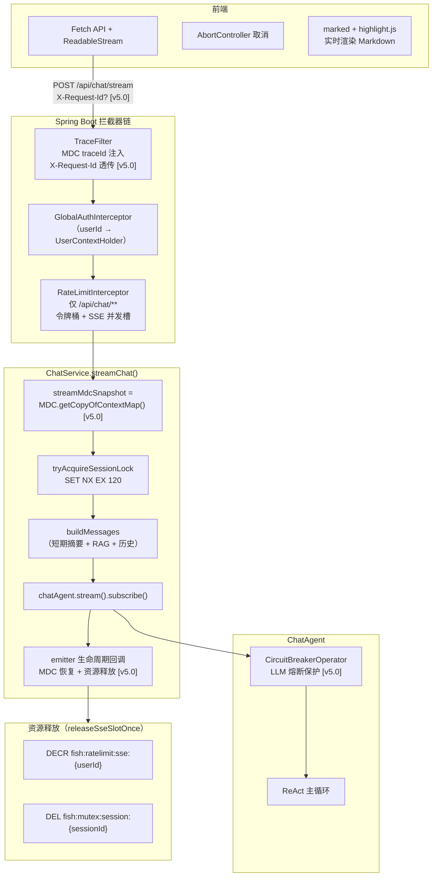
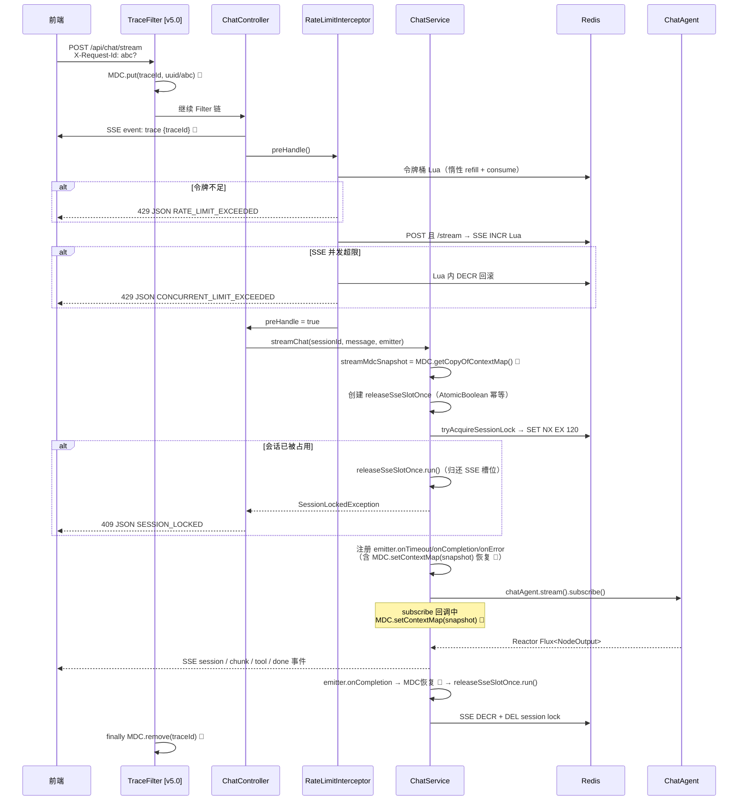
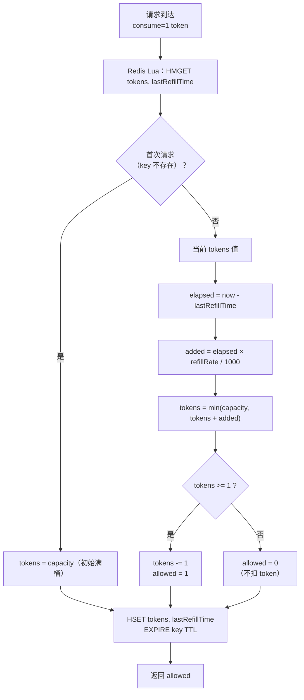

# 模块 4：流式对话与并发控制

## 一句话定位

基于 **SseEmitter** 的 POST SSE 流式对话，前端 **Fetch + ReadableStream** 逐字渲染 Markdown；通过 **Redis Lua 令牌桶 + SSE 并发槽 + 会话互斥锁** 三层防护，以 **429/409** 明确区分频率与并发拒绝，回调注册顺序防竞态锁泄漏。**MDC traceId 全链路传播 [v5.0]：TraceFilter 入口注入 → MdcAsync 异步自动传播 → Reactor/SSE 回调手动恢复。**

---

## 架构图



---

## 流程图：SSE 全生命周期 + 拒绝分支



---

## 流程图：令牌桶惰性 Refill



**关键设计**：没有后台定时器，令牌补充完全由请求驱动——每次请求计算距离上次请求的 `elapsed` 时间，按 `refillRate` 换算令牌补充量。这是令牌桶的**惰性实现**。

---

## 关键位置

### 1. RateLimitInterceptor — 拦截器链中的精确匹配

`[RateLimitInterceptor.java](../../src/main/java/com/yuyu/fishagent/auth/interceptor/RateLimitInterceptor.java)`：

```java
// 仅 /api/chat/** 走限流
registry.addInterceptor(rateLimitInterceptor).addPathPatterns("/api/chat/**");

// preHandle 内：
Long userId = UserContextHolder.currentUserIdOrNull();
if (userId == null) return true;  // null guard

boolean sseStreamPost = isChatStreamPost(request);  // POST + URI endsWith /api/chat/stream
RateLimitResult result = rateLimitService.evaluate(userId, sseStreamPost);
```

限流发生在 `preHandle` 阶段，SSE 流尚未建立，429/409 响应为普通 `application/json`。

### 2. ReleaseSseSlotOnce — 合并释放模式

`[ChatService.java](../../src/main/java/com/yuyu/fishagent/chat/ChatService.java)` 第 138-151 行：

```java
// 先创建清理 Runnable（锁失败时需释放已占 SSE 槽位）
AtomicBoolean released = new AtomicBoolean(false);
Runnable releaseSseSlotOnce = () -> {
    if (released.compareAndSet(false, true)) {
        if (streamUserId != null) rateLimitService.decrementSseConcurrent(streamUserId);
        rateLimitService.releaseSessionLock(streamUserId, sid);
    }
};

// 再抢锁（失败时先 run 再抛异常）
if (!rateLimitService.tryAcquireSessionLock(streamUserId, sid)) {
    releaseSseSlotOnce.run();
    throw new SessionLockedException("...");
}
```

### 3. emitter 回调注册顺序（v2.4 关键修复）

`[ChatService.java](../../src/main/java/com/yuyu/fishagent/chat/ChatService.java)`：

**emitter 回调必须在 `chatAgent.stream().subscribe()` 之前注册**。若 Reactor 的 `onComplete` 异步触发 `emitter.complete()` 时 `onCompletion` 尚未注册，`releaseSseSlotOnce` 永久不执行，会话锁泄漏。`Disposable` 通过 `Disposable[]` 数组引用桥接（subscribe 后才产生实例）。

**v5.0 MDC 恢复 [v5.0]**：SSE 生命周期回调（onTimeout / onCompletion / onError）和 Reactor subscribe 回调（onComplete / onError）运行在非 Servlet 线程上，MDC 已被 TraceFilter 清理。所有回调入口处 `MDC.setContextMap(streamMdcSnapshot)` 恢复 traceId，finally 中 `MDC.clear()` 防止泄漏。这确保持久化失败日志、流式异常日志、SSE 超时日志都携带 traceId，可串联到原始请求。

---

## 方案详解：令牌桶 + SSE 并发槽 + 会话互斥锁 + 合并释放

### 我们选了什么

- **令牌桶限流**：Redis Lua 惰性 refill，默认 60 tokens 桶容量 + 1 token/s 补充，对所有 `/api/chat/**` 生效
- **SSE 并发槽**：仅对 `POST /api/chat/stream` 生效，默认 2 路，Redis Lua INCR + 超限回滚
- **会话互斥锁**：`fish:mutex:session:{sessionId}`，`SET NX EX 120`，防同 session 竞态
- **合并释放**：所有释放逻辑（SSE DECR + 会话锁 DEL + `disposable.dispose()`）统一在 `releaseSseSlotOnce` 中，`AtomicBoolean` 保幂等
- **MDC 全链路传播 [v5.0]**：TraceFilter 入口注入 → MdcAsync 自动传播至异步任务 → Reactor/SSE 回调手动恢复 snapshot → finally 清理

### 为什么这样选

**令牌桶是聊天场景的最优解**。聊天天然突发——用户可能连发 3-5 条消息然后等回复，漏桶会强制排队（延迟恶化），固定窗口有边界突刺（01:00 前后瞬间双倍流量）。令牌桶允许桶容量内的突发（默认 60 条），突发后的限制通过 refill rate 平滑限制——用户沉默时令牌积累，爆发时用完为止。这才是聊天最自然的限流方式。

**惰性 refill 比定时器更好**。没有后台线程持续计算"应该补充多少令牌"——每次请求来的时候，算一下"距离上次请求过了多少毫秒"，按 refill rate 换算令牌数加回去后立刻扣掉 1 个。零额外线程、精确到毫秒级、Redis Lua 单次原子完成。

**三层防护的分工明确**：

```
请求进入 POST /api/chat/stream
  ↓
[Filter] TraceFilter: MDC.put(traceId) [v5.0]
  ↓
[拦截器] 令牌桶检查 → 不够？429 RATE_LIMIT_EXCEEDED
  ↓ 通过
[拦截器] SSE INCR 并发槽 → 超限？Lua 内 DECR 回滚 → 429 CONCURRENT_LIMIT_EXCEEDED
  ↓ 通过
[ChatService] SET NX 会话锁 → 已被占？先归还 SSE 槽位再 409 SESSION_LOCKED
  ↓ 通过
[ChatService] 正常流式对话
```

令牌桶管"频率"（1 分钟 60 次），SSE 槽管"并发数"（同用户 2 路），会话锁管"竞态"（同 session 1 路）。三者互补不重叠。

**合并释放模式防止回调覆盖**。`SseEmitter` 每个生命周期事件只能注册一个回调（后注册覆盖前者）。如果把 SSE 槽释放、会话锁释放、`disposable.dispose()` 注册为三个独立 callback，必然互相覆盖。解决方案：所有释放逻辑合并到一个 `releaseSseSlotOnce` Runnable 内，一次性注册到 `onCompletion / onError / onTimeout`。**v5.0 后回调内还需 `MDC.setContextMap(snapshot)` 恢复 traceId（这些回调运行在容器/Reactor 线程，MDC 已清空）**。

### 详细运作

**令牌桶 Lua 脚本的核心逻辑**：

```lua
-- 每次请求执行一次
local data = redis.call('HMGET', key, 'tokens', 'lastRefillTime')
local tokens     = tonumber(data[1]) or cap
local lastRefill = tonumber(data[2]) or now

-- 惰性补充：距上次请求过了多少毫秒 → 按 refillRate 换算补充量
local elapsed = math.max(0, now - lastRefill)
tokens = math.min(cap, tokens + elapsed * rate / 1000)

-- 消耗 1 个令牌
if tokens >= 1 then tokens = tokens - 1; allowed = 1 else allowed = 0 end

-- 写回 + 刷新 TTL
redis.call('HSET', key, 'tokens', tokens, 'lastRefillTime', now)
redis.call('EXPIRE', key, ttl)
return allowed
```

注意：`lastRefillTime` 存的是**毫秒级时间戳**，不是服务端计时器。即使 Redis 重启、key 丢失，下次请求初次访问时 `tokens = cap`（满桶开始），不会有状态不一致。

**SSE 并发槽的原子回滚**：

```lua
local cur = redis.call('INCR', key)
redis.call('EXPIRE', key, ttl)
if cur > max then
    redis.call('DECR', key)  -- 超限，回滚
    return -1
end
return cur  -- 通过，返回当前计数
```

关键：**先 INCR 再判断，超限才回滚**。不先 GET 再 SET——那会有竞态。整个判断在 Lua 原子体内完成。

**`releaseSseSlotOnce` 的创建顺序是关键**：

```java
// ① 先创建（锁失败时需要归还已 INCR 的 SSE 槽位）
AtomicBoolean released = new AtomicBoolean(false);
Runnable cleanup = () -> {
    if (released.compareAndSet(false, true)) {
        rateLimitService.decrementSseConcurrent(userId);  // SSE DECR
        rateLimitService.releaseSessionLock(userId, sid); // DEL 会话锁
    }
};

// ② 再注册 emitter 回调（在 subscribe 之前！）
emitter.onTimeout(() -> {
    if (streamMdcSnapshot != null) MDC.setContextMap(streamMdcSnapshot);  // [v5.0] 恢复 MDC
    try { log.warn("[ChatService] SSE 超时, sid={}", sid); }
    finally { MDC.clear(); }                                               // [v5.0] 清理
    cleanup.run(); disposable.dispose();
});
emitter.onCompletion(() -> {
    if (streamMdcSnapshot != null) MDC.setContextMap(streamMdcSnapshot);  // [v5.0] 恢复 MDC
    try { /* ... 资源释放 ... */ }
    finally { MDC.clear(); }                                               // [v5.0] 清理
    cleanup.run(); disposable.dispose();
});
emitter.onError(e -> {
    if (streamMdcSnapshot != null) MDC.setContextMap(streamMdcSnapshot);  // [v5.0] 恢复 MDC
    try { log.warn("[ChatService] SSE error, sid={}", sid); }
    finally { MDC.clear(); }                                               // [v5.0] 清理
    cleanup.run(); disposable.dispose();
});

// ③ 最后订阅（防止 onComplete 异步先触发 emitter.complete）
disposable[0] = chatAgent.stream(messages, sid).subscribe(...);
```

如果 ② 和 ③ 的顺序反了——subscribe 先于回调注册——Reactor 的 `onComplete` 可能异步触发 `emitter.complete()`，而 `onCompletion` 尚未注册 → 回调永久丢失 → 会话锁泄漏 → 该 session 之后的所有对话全被锁。**这是 v2.4 实际遇到的 bug，已修复为先注册回调再订阅。**

---

## 技术选型对比

### 对比零：SSE vs WebSocket

**方案 A：WebSocket**

全双工、长连接、支持二进制帧。适合聊天室、协同编辑、实时游戏等双向高频通信。

但在本项目场景下：
- 聊天是**请求-响应**模式——用户发一条，Agent 流式回复一条。服务端从不需要主动推送（不像聊天室有"其他人发言"的场景）。WebSocket 的双向能力完全浪费。
- WebSocket 需要额外的握手升级协议（`Upgrade: websocket`），代理/CDN/Nginx 配置更复杂。SSE 是纯 HTTP，任何 HTTP 基础设施天然支持。
- WebSocket 断连后需要客户端实现重连逻辑 + 状态恢复。SSE 浏览器原生 `EventSource` 内置 `auto-reconnect`（虽然本项目用 Fetch 手动解析）。
- WebSocket 没有 HTTP 状态码语义——鉴权失败、限流、会话冲突等无法用 401/429/409 表达，需要自定义协议层。SSE 建立在 HTTP 上，拦截器层可以直接返回标准状态码。

**方案 B：SSE（本项目）**

Server-Sent Events，基于 HTTP 的单向服务端推送协议。适合"客户端发请求，服务端持续推数据"的模式——恰好是 LLM 流式输出的场景。

- 纯 HTTP `Content-Type: text/event-stream`，无需协议升级
- 天然兼容 HTTP 拦截器链——鉴权、限流、会话锁全部在 `preHandle` 阶段用标准 HTTP 状态码拒绝
- `SseEmitter` 是 Spring MVC 内置支持，无需额外依赖
- 代理/CDN/Nginx 对长连接 HTTP 的支持成熟

代价：浏览器原生 `EventSource` 只支持 GET（本项目用 `Fetch + ReadableStream` 绕过）；单向通信（但本项目不需要反向通道）。

| 维度 | WebSocket | SSE（本项目） |
|------|-----------|-------------|
| 通信方向 | 双向 | 单向（服务端→客户端） |
| 协议 | WS（需升级） | HTTP（无需升级） |
| 鉴权/限流 | 需自定义协议层 | ✅ HTTP 拦截器 + 状态码 |
| 流式文本 | 需自行分帧 | ✅ 原生 event/data 格式 |
| 自动重连 | 需自实现 | ✅ 浏览器内置（EventSource） |
| 二进制数据 | ✅ | ❌（本项目不需要） |
| 反向通道 | ✅ | ❌（本项目用 POST 请求代替） |
| Nginx/CDN 兼容 | 需额外配置 | ✅ 开箱即用 |

**为什么不选 WebSocket**：本项目的对话模式是"用户 POST 一条消息 → 服务端流式回复"——这是典型的单向推送，WebSocket 的双向能力没有用武之地。且 SSE 可以直接复用整个 HTTP 拦截器链（鉴权→限流→会话锁），用标准 401/429/409 拒绝请求，而不是在 WebSocket 帧里自定义错误协议。

### 对比一：令牌桶 vs 漏桶 vs 固定窗口 vs 滑动窗口

**方案 A：固定窗口计数器**

Redis `INCR counter + EXPIRE window_size`。最简单——每次请求 INCR 1，超过阈值拒绝。问题：边界突刺——59:59 发了 60 次，00:01 又发了 60 次，在 59:59-00:01 这 2 秒窗口内实际通过了 120 次（双倍限额）。对于限速 60/min 的场景，2 秒内 120 次等于无防护。

**方案 B：滑动窗口**

Redis ZSET，每次请求 `ZADD key timestamp member`，查询时 `ZREMRANGEBYSCORE` 清理窗口外的记录，再 `ZCARD` 计数。精确度高，但"写入 + 清理 + 计数"三个操作不是原子的（除非包在 Lua 脚本里），且每个请求都要写入 ZSET（内存和网络开销）。

**方案 C：漏桶**

Redis List 或内存队列，请求进队列，按固定速率出队处理。强制平滑——即使瞬时 1000 QPS，桶的出水速率恒定（如 60/min），多余的请求在队列里排队或被拒绝。问题：**排队**——聊天场景下用户连续发 3 条消息，漏桶会让第 2-3 条消息"排队等待"（而不是立即处理），TTFB 急剧恶化。漏桶适合 API 网关这种"不在乎个别请求延迟"的场景，不适合对延迟敏感的交互式对话。

**方案 D：令牌桶（本项目）**

惰性计算：每次请求计算 `(now - lastRefill) × refillRate` 补充令牌。Redis Hash 存 `{tokens, lastRefillTime}`，单 Lua 脚本完成 refill + consume + EXPIRE。支持突发：桶容量（默认 60）意味着用户可以连发 60 条消息（如果有）而不被限。突发完后按 1 token/s 补充。对聊天场景最友好——用户沉默时令牌自然积累，爆发时用完为止。

| 维度 | 固定窗口 | 滑动窗口 | 漏桶 | 令牌桶（本项目） |
|------|---------|---------|------|-----------------|
| 突发支持 | ✅ 但边界不可控 | ✅ | ❌ 强制排队 | ✅ **可控突发** |
| 原子操作 | 非原子（竞态） | 需 Lua | 需队列 | ✅ 单 Lua 原子 |
| 延迟影响 | 无 | 无 | ❌ 排队增加 TTFB | 无 |
| 内存开销 | 低（1 key） | 中（ZSET per 窗口） | 中（队列） | 低（1 Hash key） |
| 边界突刺 | ❌ 严重 | 无 | 无 | 无 |
| 聊天适配 | 一般 | 一般 | ❌ 差 | ✅ **最优** |

### 对比二：Redis Lua 原子脚本 vs Redisson 分布式锁 vs 纯 Java 同步

**方案 A：纯 Java `synchronized` / `ReentrantLock`**

单 JVM 内互斥，不跨实例。如果部署了 2 个 Spring Boot 实例，同一用户的请求可能分别落到两个实例上——JVM 锁完全不可见。聊天应用水平扩展时不可用。

**方案 B：Redisson 分布式锁**

Redisson 的 `RLock` 提供 Java-native 的分布式锁 API（`lock()` / `unlock()`），底层使用 Redis `SET NX` + Lua + Watchdog 自动续期。优势是 API 友好、支持公平锁/读写锁/联锁等高级特性。但 Redisson 是一个较重的依赖（约 2MB jar），且项目当前的限流逻辑（令牌桶 refill + consume）本身就是 Lua——引入 Redisson 仅为了会话锁有点"杀鸡用牛刀"。

**方案 C：手写 Redis `SET NX` + Lua（本项目）**

`SET NX EX 120` 一行命令搞定锁获取，`DEL` 释放。不需要 Watchdog 自动续期——因为对话流有明确的结束信号（emitter 回调），正常路径主动释放。兜底靠 120s TTL（远大于正常对话时长）。令牌桶的 refill + consume 必须走 Lua（原子读-算-写），与会话锁共用 `StringRedisTemplate`，无额外依赖。

| 维度 | JVM 锁 | Redisson | Redis SET NX + Lua（本项目） |
|------|--------|----------|---------------------------|
| 跨实例 | ❌ | ✅ | ✅ |
| 自动续期 | N/A | ✅ Watchdog | ❌ 不需要（120s TTL 兜底） |
| 额外依赖 | 零 | +2MB jar | 零（已有 StringRedisTemplate） |
| 原子操作 | N/A | ✅ | ✅（令牌桶 Lua） |
| API 复杂度 | 低 | 低 | 低（2 个方法） |
| 适合场景 | 单实例 | 复杂分布式锁需求 | ✅ 简单互斥 + 限流一体化 |

### 对比三：会话锁位置 — Interceptor vs Service

**方案 A：Interceptors 层**

在 `RateLimitInterceptor` 或新建 `SessionMutexInterceptor` 中解析 body 获取 `sessionId`。问题：`HttpServletRequest.getInputStream()` 是**一次性流**——拦截器读了 body、Controller 就无法再读（Spring 默认不缓存 request body）。可以加 `ContentCachingRequestWrapper` 让 body 可重复读，但这会缓存所有请求 body（包括大文件上传），浪费内存。

**方案 B：Service 层（本项目）**

`ChatService.streamChat()` 收到已由 Spring 反序列化的 `ChatRequest`，直接拿 `sessionId`。不碰 `InputStream`，不缓存请求体。唯一的"在 Service 层做互斥"的复杂度是锁失败时需要抛异常并由 Controller re-throw（`SessionLockedException`），但多一层 try-catch 的成本极低。

### 对比四：HTTP 状态码 — 429 vs 503 vs 409

| 状态码 | 语义 | 适用场景 | 本项目使用 |
|--------|------|----------|-----------|
| **429** Too Many Requests | 请求频率超限，稍后重试 | 令牌桶耗尽 / SSE 并发超限 | ✅ 限流拒绝 |
| **503** Service Unavailable | 服务临时不可用（过载/维护） | 熔断、降级、全局限流 | ❌ 语义过重 |
| **409** Conflict | 资源状态冲突 | 同一会话已有进行中流 | ✅ 会话互斥 |

选 429 而非 503 的原因：503 触发客户端常规重试（如 Nginx 默认对 503 做 `proxy_next_upstream` retry），且浏览器可能显示"服务不可用"而非"稍后重试"。429 + `retryAfter` header/body 精确指导前端 retry 间隔。选 409 的原因：`sessionId` 是 URL/资源的一部分，同一资源（session）的冲突用 409 是最接近 HTTP 语义的。

---

## 面试追问预判

**Q：令牌桶的 refill 为什么不用定时任务？**

定时任务需要后台线程持续运行（即使是 `@Scheduled`），浪费资源且精度依赖于调度间隔（如 100ms 间隔补充 0.1 个 token）。惰性计算（请求驱动）的好处：零额外线程、时间精度取决于请求间隔而非调度周期（精确到毫秒）、实现更简洁——Redis Lua 一次完成 refill + consume。唯一的代价是 key 有 TTL（120s），长期不发请求的用户 key 会过期，下次请求重新从满桶开始——这正是期望行为。

**Q：如果 Redis 挂了，限流怎么办？**

`RateLimitService` 所有 Redis 操作都是 fail-open：Lua 执行抛异常 → catch 后 return `Allowed`（放行）。宁可短暂不限流，也不能因 Redis 故障让全站对话不可用。代价是 Redis 故障期间限流失效，但 Redis 恢复后自动恢复限流。这个权衡是基于"限流是保护机制，不应成为单点故障"的原则。

**Q：SseEmitter 回调只有一次注册机会，如果多个地方都需要在 onCompletion 加逻辑怎么办？**

`ChatService` 采用合并模式：所有需要释放的资源（SSE 槽 DECR + 会话锁 DEL + disposable.dispose()）全部放入同一个 `releaseSseSlotOnce` Runnable，注册到 `emitter.onCompletion` 时一次性执行。后续如果需要新增释放逻辑，只需在 Runnable 内部追加（`rateLimitService.decrementSseConcurrent(userId); rateLimitService.releaseSessionLock(userId, sid); someNewService.cleanup();`），不改外层。关键细节：这个 Runnable 必须在 subscribe 之前注册（否则 Reactor 的 onComplete 可能异步先触发 emitter.complete，回调丢失导致锁泄漏）。**v5.0 补充：回调入口还需要 `MDC.setContextMap(streamMdcSnapshot)` 恢复 traceId——SSE 生命周期回调运行在容器线程，Reactor subscribe 回调运行在 Reactor 线程，两者的 MDC 都已在 TraceFilter 中被清理，必须手动恢复才能保证日志可追踪。**

**Q：POST SSE 为什么不用 EventSource？**

浏览器原生 `EventSource` API 只支持 GET 请求，无法携带 request body。聊天接口需要 POST（发送用户消息 JSON），所以用 `Fetch API` + `ReadableStream` 手动解析 SSE 流。附带好处：Fetch 的 `AbortController` 提供更可靠的中止机制；可以自定义请求头（`X-Auth-Token`）。代价是需要手写 SSE 解析（约 30 行），比 EventSource 的 `onmessage` 回调稍复杂。

**Q：多实例部署时，限流和会话锁还正常工作吗？**

**完全正常**——这是选择 Redis 而非 JVM 内存做限流的核心原因。令牌桶（Redis Hash）、SSE 并发计数（Redis INCR）、会话锁（Redis SET NX）全部在 Redis 中操作，与实例数无关。两个 Java 实例处理同一用户的请求时，共享同一个令牌桶 key——Redis Lua 脚本保证原子性，不存在竞态。SSE 并发槽同理——用户在实例 A 有 1 个活跃 SSE，实例 B 的 Lua INCR 能看到计数为 1。唯一需要注意的是 `releaseSseSlotOnce` 的幂等性（`AtomicBoolean` 保单次执行），确保回调不重复释放。

---

## 最难/最有挑战的事情：SSE 回调注册顺序导致的会话锁泄漏

### 问题
v2.3 引入了 SSE 并发限流和会话互斥锁。`ChatService.streamChat()` 中，拦截器已对 SSE INCR，抢锁成功后订阅 ReactAgent 流，流完成后释放 SSE 槽位和会话锁。

### 挑战
v2.4 测试中发现一个严重 bug——某些会话的锁永远不释放（后续所有请求返回 409）。原因是 **emitter 回调注册和 Reactor subscribe 的时序竞争**。如果先 `subscribe()` 再注册 `emitter.onCompletion()`，Reactor 的 `onComplete` 可能在 `onCompletion` 注册之前异步触发 → `emitter.complete()` → 回调丢失 → `releaseSseSlotOnce` 永远不执行。

### 解决方案
- 严格要求：**先创建 `releaseSseSlotOnce` Runnable → 先注册 emitter 回调 → 最后 subscribe**
- `Disposable` 通过 `Disposable[]` 数组引用桥接（subscribe 后才产生实例，回调中需要引用）
- `releaseSseSlotOnce` 用 `AtomicBoolean` 保证幂等——即使 `onTimeout / onCompletion / onError` 都触发了也只执行一次

```java
// ① 先创建（锁失败时需要归还 SSE 槽位）
AtomicBoolean released = new AtomicBoolean(false);
Runnable cleanup = () -> { if (released.compareAndSet(false, true)) { /* DECR + DEL */ } };

// ② 注册回调（必须在 subscribe 之前！）
emitter.onCompletion(() -> { cleanup.run(); disposableRef[0].dispose(); });
emitter.onTimeout(() -> { cleanup.run(); disposableRef[0].dispose(); });

// ③ 最后订阅
disposableRef[0] = chatAgent.stream(...).subscribe(...);
```

### 面试回答要点
> "这是 v2.4 实际遇到的 bug。Reactor 的 onComplete 是异步的——如果先 subscribe 再注册 emitter.onCompletion，Reactor 可能在回调注册前就触发了 emitter.complete()，导致 onCompletion 回调永远不执行，会话锁泄漏。修复很简单：**先注册回调再 subscribe**。但发现根因很难——日志显示锁没释放，但不知道为什么回调没触发。排查靠的是在回调中加日志，发现某些会话的 onCompletion 日志从来没出现过。"

---

## 关联代码路径速查

| 职责 | 路径 |
|------|------|
| 限流拦截器 | `auth/interceptor/RateLimitInterceptor.java` |
| 限流服务（令牌桶 + SSE + 会话锁） | `ratelimit/RateLimitService.java` |
| 限流结果枚举 | `ratelimit/RateLimitResult.java` |
| 限流配置 | `config/RateLimitProperties.java` |
| 对话编排（SSE + 释放合并） | `chat/ChatService.java` |
| 对话控制器 | `chat/ChatController.java` |
| 会话锁异常 | `exception/SessionLockedException.java` |
| 全局异常处理（→ 409 SessionLocked） | `exception/GlobalExceptionHandler.java` |
| 前端 SSE 消费 | `frontend/src/api/chat.ts` |
| 前端消息流 | `frontend/src/components/MessageList.vue` |
