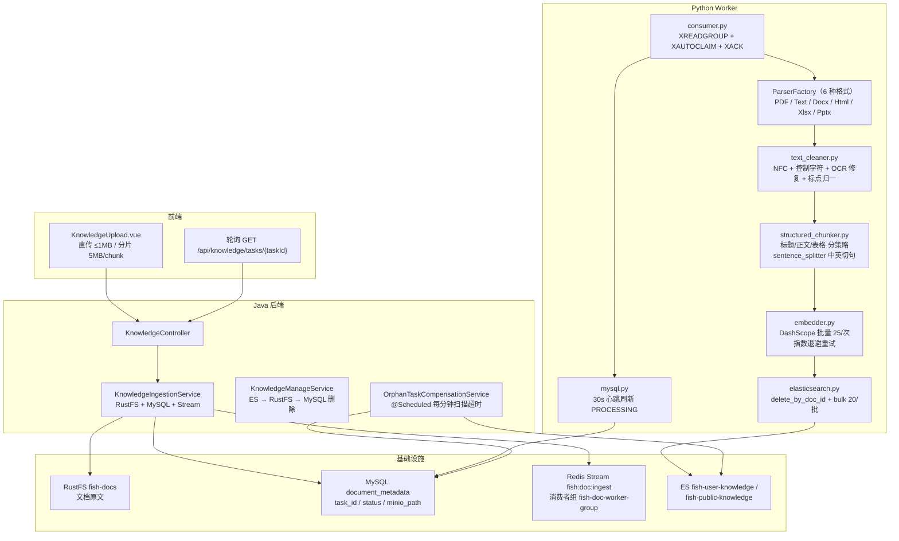
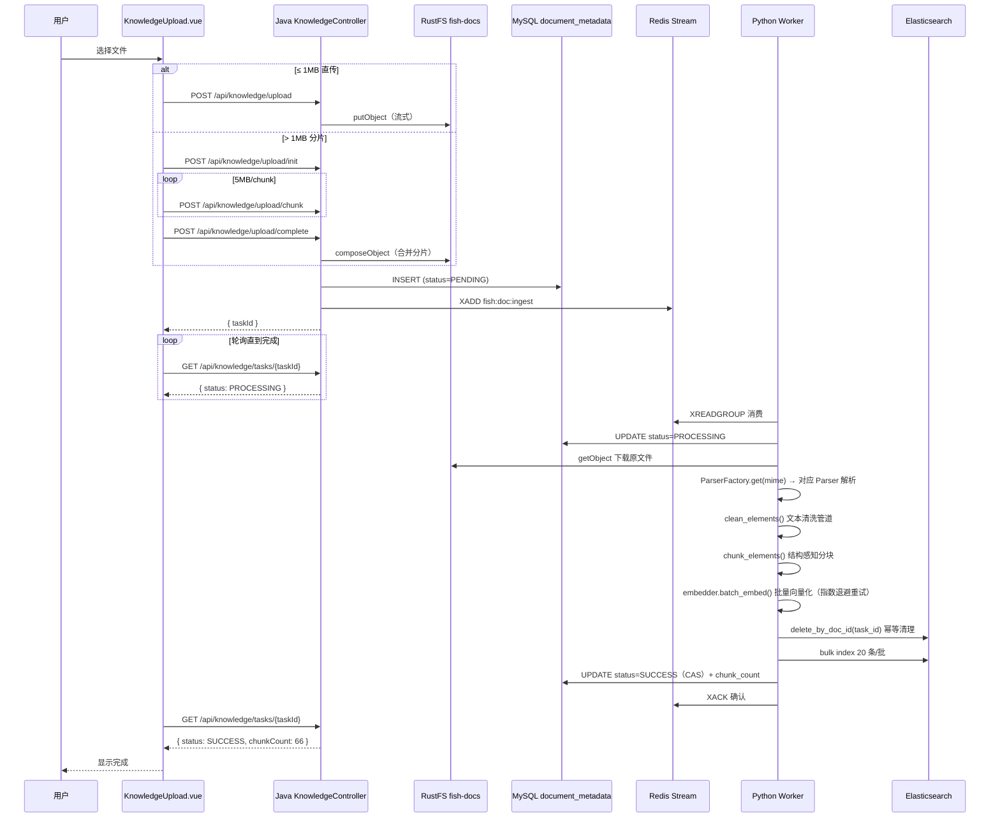
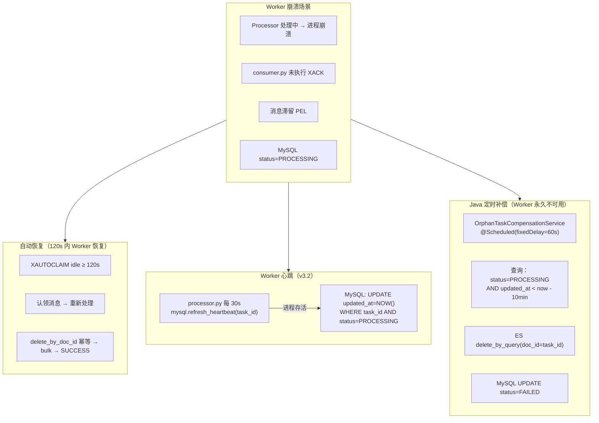

# 模块 5：知识库闭环与可靠性

## 一句话定位

**Java 负责投递 + Python Worker 异步消费**，通过 **Redis Stream 消费者组**解耦，实现 **6 种格式解析 → OCR 清洗 → 结构感知分块 → embedding → ES 写入**全链路；配合 **Worker 心跳**、**XAUTOCLAIM 崩溃恢复**、**Java 定时孤儿补偿**、**Python 幂等写入**与 **embedding 指数退避重试**五重保障。

---

## 架构图



---

## 流程图：文档上传 + Worker 处理



---

## 流程图：Worker 崩溃恢复 + 心跳 + 孤儿补偿



---

## 关键位置

### 1. Java 侧：只投递，不解析

`[KnowledgeIngestionService.java](../../src/main/java/com/yuyu/fishagent/rag/service/KnowledgeIngestionService.java)`：

- 上传时：写入 RustFS → INSERT MySQL（`status=PENDING`）→ XADD Redis Stream
- 不解析文件内容——全部交给 Python Worker 异步处理
- Java 和 Python 仅通过基础设施（Redis/MySQL/RustFS/ES）共享状态，互不感知

### 2. Python Worker：三级消息拉取

`[consumer.py](../../python/fish_worker/consumer.py)`：

```python
def _collect_batch(self):
    batch = self._read_pending_own()    # ① 优先：自己 PEL 未 ACK 消息
    if batch: return batch
    batch = self._xautoclaim_batch()    # ② 其次：认领其他 consumer 超时消息
    if batch: return batch
    return self._read_new(block_ms)     # ③ 最后：新消息
```

**消费语义**：
- `XREADGROUP ">"`：读新消息
- `XREADGROUP "0"`：重读自己 PEL 未确认消息（断点续传）
- `XAUTOCLAIM`：认领其他 consumer 超过 120s 未 ACK 的 idle 消息
- `finally` 块中 XACK——无论成功/失败/非法消息都确认，避免毒消息死循环

### 3. 多格式解析器工厂（v3.3）

`[factory.py](../../python/fish_worker/parser/factory.py)`：

```python
_registry = {
    "application/pdf": PdfParser,
    "text/plain": TextParser,
    "text/markdown": TextParser,
    "application/vnd.openxmlformats-officedocument.wordprocessingml.document": DocxParser,
    "text/html": HtmlParser,
    "application/vnd.openxmlformats-officedocument.spreadsheetml.sheet": XlsxParser,  # 可选
    "application/vnd.openxmlformats-officedocument.presentationml.presentation": PptxParser,  # 可选
}
```

6 种格式解析器：

| 解析器 | 格式 | 核心库 |
|--------|------|--------|
| **PdfParser** | PDF | PyMuPDF（渲染 300 DPI PNG）+ Tesseract OCR（chi_sim+eng） |
| **TextParser** | TXT / MD | 直接读取，保留换行 |
| **DocxParser** | DOCX | python-docx（段落 + 表格） |
| **HtmlParser** | HTML / HTM | BeautifulSoup（提取可见文本） |
| **XlsxParser** | XLSX（可选） | openpyxl（逐行读取） |
| **PptxParser** | PPTX（可选） | python-pptx（幻灯片文本） |

XlsxParser 和 PptxParser 为可选依赖——`_load_optional_parser()` 在 ImportError 时返回 None，工厂不注册对应 MIME 类型。应用不会因为缺少某个解析器依赖而无法启动。

**容错**：MIME 为 `application/octet-stream` 时从文件名后缀推断（网关/代理丢失 Content-Type 的场景）。

### 4. OCR 文本清洗管道（v3.3）

`[text_cleaner.py](../../python/fish_worker/parser/text_cleaner.py)`：

```
clean_elements(rawElements)
  → normalize_unicode()       # NFC 归一化（组合字符序列）
  → remove_control_chars()    # 移除零宽字符、不可见控制字符
  → fix_common_ocr_errors()   # 保守 OCR 修复：fi→fi, fl→fl, (cid:数字)→空
  → collapse_punctuation()    # 重复标点归一：。。。→。, ...→…
  → normalize_whitespace()    # 空格/换行归一，保留段落边界
  → 过滤清洗后为空的元素
```

**设计原则**：只做"确定性安全"的修复——`fi→fi` 是 OCR 对连字的误识别，必定正确。不做"猜测性"的修复（如自动纠正拼写），避免引入新错误。

### 5. 结构感知分块（v3.5）

`[structured_chunker.py](../../python/fish_worker/chunker/structured_chunker.py)`：

```
chunk_elements(rawElements, chunk_size=512, overlap=50)
  → _build_segments(): 将 RawElement 流规整为正文段/表格段
  → 正文段: split_sentences() 中英切句 → 按句子边界贪心打包 → 单句超长回退 token 滑窗
  → 表格段: 优先整表保留 → 超限时按行组切分 + 每组重复表头
```

**三种分块策略**：

| 段落类型 | 分块策略 | 特殊处理 |
|---------|---------|---------|
| **正文** (Title/Text) | 句子边界贪心打包 | 单句超长回退 token 滑窗 |
| **表格** (Table) | 整表优先 → 行组切分 | 切分时每组重复表头 |
| **混合** | 同页连续同类型合并 | 跨页/跨类型强制切分 |

**句子分割器** (`sentence_splitter.py`)：中英文混合场景下，按 `。！？`（中文句号）和 `.!?`（英文句号）+ 换行符切句，保留小数点、缩写等特殊处理。

### 6. Embedding 指数退避重试（v3.2）

`[embedder.py](../../python/fish_worker/chunker/embedder.py)`：

- DashScope 批量 embedding（25 条/次，1536 维）
- 失败时指数退避重试（base=1s，max=30s，最多 5 次）
- 维度校验：embedding 结果维度与 ES mapping 不匹配时 WARN 并跳过

### 7. Worker 心跳（v3.2）

`[mysql.py](../../python/fish_worker/db/mysql.py)`：

- Worker 处理过程中每 30s 刷新 `updated_at`（`refresh_heartbeat()`）
- 孤儿补偿判断依据：`updated_at < NOW() - 10min`
- 心跳刷新保证活跃 Worker 的 task 不会被误补偿
- CAS 更新：`UPDATE status='SUCCESS' WHERE task_id=? AND status='PROCESSING'`，防止补偿和 Worker 同时操作

### 8. 孤儿补偿：Java 定时

`[OrphanTaskCompensationService.java](../../src/main/java/com/yuyu/fishagent/rag/service/OrphanTaskCompensationService.java)`：

每分钟扫描 `status=PROCESSING AND updated_at < now - 10min`，执行 ES delete_by_query + MySQL 标记 FAILED。

### 9. PDF OCR 管线

`[pdf.py](../../python/fish_worker/parser/pdf.py)`：

经过三代库迭代（pypdf → pdfminer → PyMuPDF），最终方案：**混合策略**——先尝试提取文本层，质量检测不通过（CID 残留、乱码 unicode）再渲染为 300 DPI PNG → Tesseract OCR（`chi_sim+eng`）。

---

## 方案详解

### 我们选了什么

- **消息队列**：Redis Stream + 消费者组（`fish-doc-worker-group`）
- **多格式解析**：ParserFactory 6 种格式，可选依赖优雅降级
- **文本清洗**：5 步管道（NFC → 控制字符 → OCR 修复 → 标点 → 空白）
- **结构感知分块**：正文按句贪心打包 + 表格整表优先 + 行组切分重复表头
- **embedding**：DashScope `text-embedding-v2`，批量 25 条/次，指数退避重试
- **五重保障**：XAUTOCLAIM（120s）+ Python 幂等 + Worker 心跳（30s）+ Java 孤儿补偿（60s）+ CAS 防并发

### 为什么这样选

**多格式解析从"只支持 PDF"到"覆盖主流文档"**。用户上传的文档来源多样——公司内部 DOCX 规范、技术团队 Markdown 文档、运营 HTML 页面、财务 XLSX 报表。v3.3 引入 ParserFactory 工厂模式，新增格式只需在 `_registry` 中加一行。XlsxParser 和 PptxParser 为可选依赖（`_load_optional_parser`），没有 openpyxl / python-pptx 不影响其他格式的正常工作。

**结构感知分块解决"表格被切断"的问题（v3.5）**。旧方案用固定 token 滑窗（512 token / 50 overlap），表格行可能在 chunk 边界被切断，丢失表头后后续行不可读。结构感知分块先识别元素类型（Title/Text/Table），对表格优先整表保留；超限时按行组切分，每组重复表头——保证任何 chunk 中的表格行都有表头可读。

**Worker 心跳解决"假死"误判（v3.2）**。旧方案中孤儿补偿判断 `updated_at < NOW() - 10min`，但 Worker 开始处理时只在 `status='PROCESSING'` 时写一次 `updated_at`。如果文档处理耗时较长（大文件 OCR 可能 5-8 分钟），补偿可能在 Worker 还活着时就误触。心跳每 30s 刷新一次 `updated_at`，只要 Worker 还在处理就不会被补偿误杀。

**Embedding 重试解决 DashScope 偶发 429/500**。DashScope API 在高负载时会返回 429（Too Many Requests）或 500（Internal Server Error）。指数退避重试（1s → 2s → 4s → 8s → 16s，最多 5 次）给 API 恢复时间，避免单次失败导致整批 embedding 丢失。

### 详细运作

**六种格式的处理流程差异**：

```
PDF:
  PyMuPDF → 逐页提取文本层
  → 质量检测（CID 残留? 乱码 unicode?）
  → 不通过 → 渲染 300 DPI PNG → Tesseract OCR
  → 输出 RawElement(text, page, element_type)

TXT/MD:
  直接读取全文 → 按换行分段 → RawElement

DOCX:
  python-docx → 遍历段落 + 表格 → 保持顺序
  → 表格: 逐行拼接为制表符分隔文本
  → RawElement(text, page=None, element_type=Text/Table)

HTML:
  BeautifulSoup → 移除 script/style → 提取可见文本
  → RawElement

XLSX:
  openpyxl → 逐行读取 → 表头行 + 数据行
  → RawElement(text=行文本, page=sheet_index, element_type=Table)

PPTX:
  python-pptx → 遍历幻灯片 → 提取文本框 + 表格
  → RawElement(text, page=slide_index, element_type=Text/Table)
```

**所有格式统一后进入相同管道**：

```
RawElement[]
  → clean_elements()      # 5 步文本清洗
  → chunk_elements()      # 结构感知分块
    → _build_segments()   # 正文段 / 表格段
    → 正文: split_sentences() → 句子贪心打包
    → 表格: 整表优先 → 行组切分 + 表头重复
  → TextChunk[]
  → embedder.batch_embed() # 批量 embedding + 指数退避重试
  → es.bulk_index()        # 20 条/批写入
```

**五重保障的分工**：

| 层次 | 机制 | 间隔 | 覆盖场景 |
|------|------|------|---------|
| 1 | XAUTOCLAIM | 120s idle | Worker 临时崩溃 |
| 2 | Python `delete_by_doc_id` | 每次重处理 | ES 残留旧 chunk |
| 3 | Worker 心跳 | 30s 刷新 | 防止长任务被误补偿 |
| 4 | MySQL CAS 更新 | SUCCESS 写入时 | Worker 与补偿并发操作 |
| 5 | Java 孤儿补偿 | 60s 扫描 | Worker 永久不可用 |

---

## 技术选型对比

### 对比一：结构感知分块 vs 固定 token 滑窗 vs 按段落

| 方案 | 表格完整性 | 句子完整性 | 跨 chunk 语义 | 本项目选择 |
|------|-----------|-----------|-------------|-----------|
| 固定 token 滑窗 | ❌ 可能在行中间截断 | ❌ 可能在句中间截断 | overlap 缓解 | 旧方案（v3.4 之前） |
| 按段落（`\n\n` 分割） | ❌ 表格无自然段落边界 | ✅ | 不保证 | ❌ |
| 结构感知（本项目 v3.5） | ✅ 整表优先 + 表头重复 | ✅ 句子边界贪心 | ✅ overlap 用完整句子 | ✅ |

**结构感知的关键优势**：表格是结构化数据，切分后每块必须包含表头才能独立理解。固定 token 滑窗完全不理解结构——可能把表头切在 chunk A，数据行切在 chunk B，检索到 chunk B 时无法理解列含义。结构感知分块先识别表格，整表保留；超限时按行组切分，每组都重复表头。

### 对比二：多格式解析 — 工厂 + 可选依赖 vs 硬编码单格式 vs 统一转 PDF

| 方案 | 格式覆盖 | 依赖管理 | 扩展性 |
|------|---------|---------|--------|
| 硬编码 PDF only | 1 种 | 简单 | 差 |
| 统一转 PDF（LibreOffice） | 广 | 重依赖（LibreOffice ~200MB） | 中 |
| 工厂 + 可选依赖（本项目） | 6 种 | 轻量（无依赖不报错） | ✅ 加一行注册 |

**为什么不选统一转 PDF**：LibreOffice headless 转换额外引入 ~200MB 依赖，且转换过程可能丢失排版信息（表格合并单元格、图表等）。各格式直接解析保留更多原始结构信息。工厂模式 + `_load_optional_parser()` 确保缺少某个依赖不影响其他解析器。

### 对比三：最终一致性策略

| 层次 | 机制 | 处理间隔 | 覆盖场景 |
|------|------|---------|---------|
| 1 | XAUTOCLAIM | 120s idle | Worker 临时崩溃 |
| 2 | Python `delete_by_doc_id` 幂等 | 每次重处理 | ES 残留旧 chunk |
| 3 | Worker 心跳（v3.2） | 30s 刷新 | 防长任务被误补偿 |
| 4 | MySQL CAS 更新 | SUCCESS 时 | Worker + 补偿并发 |
| 5 | Java 孤儿补偿 | 60s 扫描 | Worker 永久不可用 |

### 对比四：Embedding 重试策略

| 策略 | 实现 | 适用场景 | 本项目选择 |
|------|------|---------|-----------|
| 无重试 | 失败即放弃 | 不可接受——整个文档的 embedding 丢失 | ❌ |
| 固定间隔重试 | 每 5s 重试一次 | 可能加重 API 负载 | ❌ |
| 指数退避（本项目） | 1s → 2s → 4s → 8s → 16s，最多 5 次 | ✅ 给 API 恢复时间，逐步增加间隔 | ✅ |

---

## 面试追问预判

**Q：新增一种文件格式支持需要改哪些地方？**

两步：
1. 新建 `parser/xxx_parser.py`，继承 `BaseParser`，实现 `parse(file_path) → list[RawElement]`
2. 在 `factory.py` 的 `_registry` 中添加 MIME → Parser 映射

无需修改 consumer、processor、chunker、embedder——全链路基于 `RawElement` 接口工作，不感知具体格式。

**Q：Worker 在处理过程中崩溃了，消息会丢吗？**

三层保障：① consumer.py 的 `finally` 中有 XACK，但进程崩溃时 `finally` 执行不到 → 消息留在 PEL → 120s 后 XAUTOCLAIM 认领 → 新 Worker 处理；② 重处理前 `delete_by_doc_id` 清空旧切片 → 再 bulk 写入 → 幂等；③ 如果 Worker 永久不恢复，Java 的 `OrphanTaskCompensationService` 每 60s 扫描超时 PROCESSING → 清理 ES 残留 → 标记 FAILED。心跳机制（30s 刷新 `updated_at`）保证活跃 Worker 不会被误补偿。

**Q：结构感知分块对纯文本文件怎么处理？**

纯文本（TXT/MD）由 TextParser 解析，输出的 RawElement `element_type` 全部为 `"Text"`。`_build_segments()` 将连续同页 Text 元素合并为正文段，走句子边界贪心打包路径。不会触发表格分块逻辑。

**Q：XlsxParser 是可选的，如果没装 openpyxl 会怎样？**

`_load_optional_parser("fish_worker.parser.xlsx_parser", "XlsxParser")` 在 ImportError 时返回 None。`if XlsxParser is not None:` 条件不满足，不注册 MIME 映射。用户上传 XLSX 时 ParserFactory 抛 `UnsupportedFileTypeError`，processor 捕获后标记 MySQL `status=FAILED` + `error_msg="unsupported content-type"`。不会导致 Worker 崩溃或其他格式不可用。

**Q：embedding 重试 5 次都失败了怎么办？**

processor 捕获 embedding 异常 → 标记 MySQL `status=FAILED` + `error_msg`（截断到 500 字符）→ XACK 消息。不会无限重试。管理员可在前端看到失败任务，修复后重新上传。

**Q：为什么 Java 不直接处理文档，要绕一圈给 Python？**

Java 生态的 PDF 解析库（PDFBox）对中文支持差——字体映射在处理 CJK 内嵌子集字体时经常输出乱码。OCR 库不够成熟且部署麻烦。Python 的 PyMuPDF + pytesseract + python-docx + openpyxl 是文档解析的事实标准。通过 Redis Stream 解耦后，双方仅共享基础设施（Redis/MySQL/RustFS/ES），一份 `.env` 两端共用。

---

## 关联代码路径速查

| 职责 | 路径 |
|------|------|
| Java 上传编排 | `rag/service/KnowledgeIngestionService.java` |
| Java 管理（列表/删除） | `rag/service/KnowledgeManageService.java` |
| Java 孤儿补偿 | `rag/service/OrphanTaskCompensationService.java` |
| 知识库配置 | `rag/config/KnowledgeProperties.java`（含 CompensationProperties） |
| 调度启用 | `common/config/SchedulingConfiguration.java` |
| Python 消费入口 | `python/fish_worker/consumer.py` |
| Python 处理管线 | `python/fish_worker/processor.py` |
| **解析器工厂** | `python/fish_worker/parser/factory.py` |
| PDF 解析（混合策略） | `python/fish_worker/parser/pdf.py` |
| Text 解析 | `python/fish_worker/parser/text_parser.py` |
| DOCX 解析 | `python/fish_worker/parser/docx_parser.py` |
| HTML 解析 | `python/fish_worker/parser/html_parser.py` |
| XLSX 解析（可选） | `python/fish_worker/parser/xlsx_parser.py` |
| PPTX 解析（可选） | `python/fish_worker/parser/pptx_parser.py` |
| **文本清洗管道** | `python/fish_worker/parser/text_cleaner.py` |
| 解析器基类 | `python/fish_worker/parser/base.py` |
| **结构感知分块** | `python/fish_worker/chunker/structured_chunker.py` |
| 句子分割器 | `python/fish_worker/chunker/sentence_splitter.py` |
| Token 分块（基础） | `python/fish_worker/chunker/text_chunker.py` |
| **Embedding（含重试）** | `python/fish_worker/chunker/embedder.py` |
| Python ES 写入（含幂等） | `python/fish_worker/storage/elasticsearch.py` |
| Python MySQL（心跳+CAS） | `python/fish_worker/db/mysql.py` |
