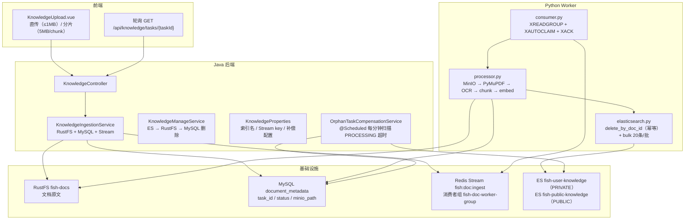
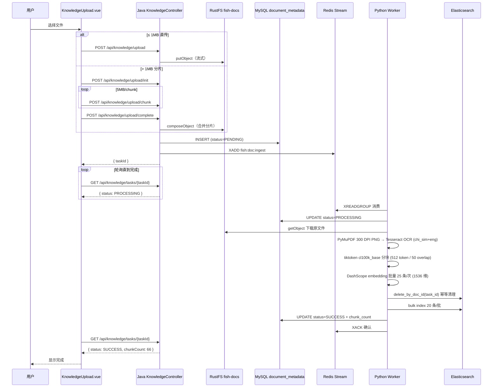
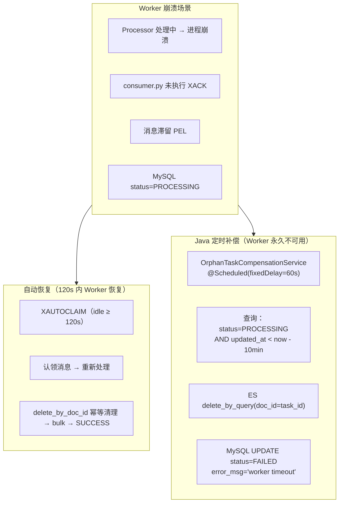
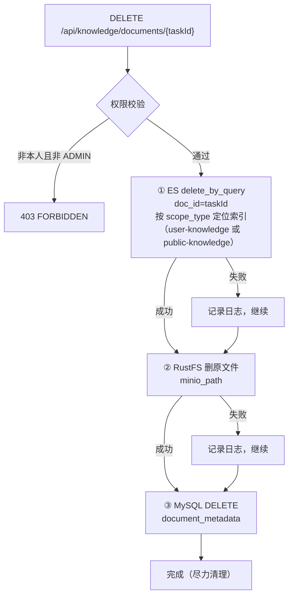

# 模块 5：知识库闭环与可靠性

## 一句话定位

**Java 负责投递 + Python Worker 异步消费**，通过 **Redis Stream 消费者组**解耦，实现 PDF OCR → token 分块 → embedding → ES 写入全链路；配合 **XAUTOCLAIM 崩溃恢复** + **Java 定时孤儿补偿** + **Python 幂等写入**保障最终一致性。

---

## 架构图



---

## 流程图：文档上传 + Python Worker 处理



---

## 流程图：Worker 崩溃恢复 + 孤儿补偿



---

## 流程图：知识库删除三步骤



---

## 关键位置

### 1. Java 侧：只投递，不解析

`[KnowledgeIngestionService.java](../../src/main/java/com/yuyu/fishagent/service/knowledge/KnowledgeIngestionService.java)`：

- 上传时：写入 RustFS → INSERT MySQL（`status=PENDING`）→ XADD Redis Stream
- 不解析文件内容——全部交给 Python Worker 异步处理
- Java 和 Python 仅通过基础设施（Redis/MySQL/RustFS/ES）共享状态，互不感知

### 2. Python Worker：三级消息拉取

`[consumer.py](../../python/fish_worker/consumer.py)` 第 169-181 行：

```python
def _collect_batch(self):
    batch = self._read_pending_own()    # ① 优先：自己 PEL 未 ACK 消息
    if batch: return batch
    batch = self._xautoclaim_batch()    # ② 其次：认领其他 consumer 超时消息
    if batch: return batch
    return self._read_new(block_ms)     # ③ 最后：新消息
```

**消费语义**：
- `XREADGROUP ">"`：读新消息
- `XREADGROUP "0"`：重读自己 PEL 未确认消息（断点续传）
- `XAUTOCLAIM`：认领其他 consumer 超过 120s 未 ACK 的 idle 消息
- `finally` 块中 XACK——无论成功/失败/非法消息都确认，避免毒消息死循环

### 3. 孤儿补偿：Java 定时 + Python 幂等

`[OrphanTaskCompensationService.java](../../src/main/java/com/yuyu/fishagent/service/knowledge/OrphanTaskCompensationService.java)`：

每分钟扫描 `status=PROCESSING AND updated_at < now - 10min`，按 `KnowledgeManageService` 同语义执行 ES delete_by_query，再 MySQL 标记 FAILED。

`[processor.py](../../python/fish_worker/processor.py)` 第 95 行：

```python
# 幂等：重处理前清空该 task_id 的旧切片，避免 chunk 数量变化导致 ES 残留
self._es.delete_by_doc_id(index_name, task.task_id)
self._es.bulk_index_document_chunks(...)
```

### 4. PDF OCR 管线演进

`[parser/pdf.py](../../python/fish_worker/parser/pdf.py)`：

经过三代库迭代（pypdf → pdfminer → PyMuPDF），最终方案：PyMuPDF 渲染每页为 300 DPI PNG → Tesseract OCR（`chi_sim+eng` 中英双语）。核心思想——用"看见→认出"替代"解码→乱码"，完全绕过字体编码层。

---

## 方案详解：Redis Stream 解耦 + Python OCR 管线 + 三重崩溃保障

### 我们选了什么

- **消息队列**：Redis Stream + 消费者组（`fish-doc-worker-group`）
- **PDF 解析**：Python PyMuPDF（300 DPI PNG 渲染）+ Tesseract OCR（`chi_sim+eng`）
- **token 分块**：tiktoken `cl100k_base` 编码器，512 token / 50 overlap
- **embedding**：DashScope `text-embedding-v2`，批量 25 条/次，1536 维
- **崩溃保障**：XAUTOCLAIM（120s idle 自动恢复）+ Java `OrphanTaskCompensationService`（60s 扫描补偿）+ Python `delete_by_doc_id`（重处理幂等）

### 为什么这样选

**Java 投递 + Python 处理 = 各司其职**。Java 擅长 Web API、事务管理、鉴权——处理文件上传、写 MySQL、写 Redis Stream。Python 擅长数据分析生态——PyMuPDF、pytesseract、tiktoken 这些库在 Python 生态中是事实标准，Java 侧没有同等质量和成熟度的替代。通过 Redis Stream 解耦后，两个进程只共享基础设施（Redis / MySQL / RustFS / ES），互不感知对方的存在。Python Worker 挂了不影响 Java 对话，Java 重启不影响 Worker 处理积压消息。

**OCR 管线从"解码字体"到"识别图片"的范式转换**。中文 PDF 的字体问题错综复杂：内嵌子集（subset embedding）、CID 字体映射、GBK/GB2312/UTF-8 编码混用——任何"试图理解底层字体"的方案最终都会遇到乱码。PyMuPDF 用最简单的方式绕过了这一切：把 PDF 页渲染为 300 DPI 的 PNG 像素图，OCR 引擎只看像素不看字体。代价是速度（比直接文本提取慢 10-100 倍），但异步 Worker 攒积压可接受。

**三重保障覆盖所有崩溃场景**：

| 场景 | 触发机制 | 处理 | 延迟 |
|------|---------|------|------|
| Worker 临时崩溃（OOM/网络闪断） | XAUTOCLAIM | 重新认领消息 → 重处理 | 120s |
| Worker 半截崩溃（ES 写了、MySQL 没写） | XAUTOCLAIM 重投 + Python `delete_by_doc_id` 幂等 | 清旧切片 → 重写 | 120s |
| Worker 永久不可用（配置错误/依赖缺失） | Java `OrphanTaskCompensationService` | 扫描超时 PROCESSING → ES 清理 → MySQL FAILED | 60s + 10min 超时 |

### 详细运作

**Redis Stream 消息的完整生命周期**：

```
Java: XADD fish:doc:ingest * task_id=xxx minio_path=xxx ...
  ↓
Worker: XREADGROUP GROUP fish-doc-worker-group CONSUMER host123-42 STREAMS fish:doc:ingest >
  → 消费到新消息 [(msg_id, {task_id: xxx, minio_path: xxx, ...})]
  ↓
Worker: processor.process(task)
  → MySQL: UPDATE status='PROCESSING'
  → MinIO: 下载原文件
  → PyMuPDF: render 300 DPI PNG pages
  → Tesseract: OCR chi_sim+eng
  → tiktoken: cl100k_base 分块 (512 token / 50 overlap)
  → DashScope: batch embed 25/批 (1536 维)
  → ES: delete_by_doc_id(task_id)  ← 幂等清理
  → ES: bulk index 20/批
  → MySQL: UPDATE status='SUCCESS', chunk_count=N
  ↓
Worker: XACK fish:doc:ingest fish-doc-worker-group msg_id
  → 消息从 PEL 中移除，消费完成
```

**如果 Worker 在任意步骤崩溃**：

```
进程死亡 → consumer 消失 → 消息留在 PEL 中
  ↓ 120s 后
其他 Worker: XAUTOCLAIM fish:doc:ingest fish-doc-worker-group (idle=120s)
  → 认领到未 ACK 的消息 → 重新执行 processor.process(task)
  → delete_by_doc_id 清理上次可能已写入的 ES 切片
  → 重新执行完整管线
  → XACK
```

**为什么 tiktoken `cl100k_base` 而不按字符数截断**：中英文 token 数差异巨大——“你好”是 2 个 token 但 2 个字符，“Hello world”是 2 个 token 但 11 个字符。按字符数截断要么中文浪费 token（截 512 字符可能只有 300 token），要么英文超限（截 512 字符可能有 200 token）。`tiktoken` 精确按 token 计数，与 embedding 模型的输入限制对齐。50 token overlap 防止语义边界刚好卡在 chunk 之间。

**孤儿补偿不会与正常 Worker 冲突**：补偿任务检查 `updated_at < NOW() - 10min`。Worker 开始时执行 `UPDATE status='PROCESSING'` 会刷新 `updated_at`。只要 Worker 还在运行（10 分钟内更新过），补偿不会误触。10 分钟是正常处理时长（30s-2min）的多倍余量。

---

## 技术选型对比

### 对比一：Redis Stream vs Kafka vs RabbitMQ vs AWS SQS

**方案 A：Kafka**

业界最成熟的分布式消息系统。高吞吐（百万 QPS）、分区有序、持久化磁盘、支持消息回溯到任意 offset。适合大规模事件流处理。

但在本项目场景下需要额外部署 ZooKeeper（或 KRaft）+ Kafka Broker（至少 3 节点用于生产），运维成本远高于"文档入库"这个单一场景的价值。且 Kafka 的 consumer group rebalance 在 consumer 频繁增减时（Worker 重启）会触发短暂暂停。

**方案 B：RabbitMQ**

AMQP 协议，支持灵活的路由（exchange/queue/binding）、消息确认（ACK/NACK）、死信队列、延迟队列。在 Spring 生态中集成成熟（`spring-amqp`）。

但 RabbitMQ 需要 Erlang 运行时 + 独立部署。消息消费后删除（无原生消息回溯）。被 NACK 的消息默认重入队首，可能引起"毒消息循环"（反复 NACK 同一条坏消息导致队列阻塞）。虽然有 dead letter exchange 兜底，但配置比 Redis Stream 复杂。

**方案 C：AWS SQS**

托管队列，零运维。支持 FIFO 队列（保证顺序）、死信队列、最长 14 天消息保留、Lambda 触发。但：
- 云绑定——本地开发需要 LocalStack 模拟
- 成本——按请求计费，但量不大
- 与项目自托管 Redis 方案不一致（项目所有基础设施为自托管）

**方案 D：Redis Stream（本项目）**

Redis 5.0+ 引入的 Stream 数据结构，支持消费者组、消息持久化、PEL 追踪、XAUTOCLAIM 崩溃恢复。与 Kafka 的核心概念对应：

| Kafka 概念 | Redis Stream 对应 |
|-----------|------------------|
| Topic | Stream（key 即 stream 名） |
| Consumer Group | XGROUP CREATE |
| Partition | Stream 不支持分区（但 Redis Cluster 下可按 key hash 分布） |
| offset | Stream entry ID（`timestamp-sequence` 格式） |
| Consumer | XREADGROUP 中的 consumer 名 |
| Rebalance | XAUTOCLAIM（手动认领超时 consumer 的消息） |
| Commit Offset | XACK |
| Pending Messages | XPENDING + PEL |

| 维度 | Kafka | RabbitMQ | SQS | Redis Stream（本项目） |
|------|-------|----------|-----|----------------------|
| 额外中间件 | 需要 3 节点集群 | 需要 Erlang + 服务 | 云绑定 | 零（已有 Redis） |
| 消息持久化 | ✅ 磁盘 | ✅ 磁盘 | ✅ 托管 | ✅ AOF/RDB |
| 消费者组 | ✅ | ✅ | ✅ FIFO | ✅ XREADGROUP |
| 消息回溯 | ✅ offset | ❌ | ❌ | ✅ PEL + "0" |
| 崩溃恢复 | ✅ rebalance | ✅ NACK/requeue | ✅ visibility timeout | ✅ XAUTOCLAIM |
| 毒消息保护 | 手动 DLQ | 手动 DLX | ✅ DLQ | ✅ 无论成败都 XACK + 补偿 |
| 本地开发复杂度 | 高 | 中 | 低（但需云） | **零** |
| 本项目选择 | — | — | — | ✅ |

**核心原因**：项目已有 Redis（用于 Session、短期记忆、限流、会话锁），Stream 不需要额外中间件。消费者组 + PEL + XAUTOCLAIM 提供了与 Kafka 同级的消息可靠性，且消费者组模式保证不重复消费（同一 group 内单条消息只分发给一个 consumer）。`finally` 中无论如何都 XACK + `processor.py` 的 `delete_by_doc_id` 幂等保护，即使是毒消息也不会陷入死循环。

### 对比二：PDF 解析方案演进 — pypdf → pdfminer → PyMuPDF + Tesseract

**阶段一：pypdf（无 OCR）**

Python 自带，零依赖。直接从 PDF 中提取文本流。问题：中文 PDF 经常使用内嵌字体（CJK），pypdf 提取出来的是一堆 `\uXXXX` Unicode 转义序列或无意义的符号映射。完全不适用于中文文档场景。

**阶段二：pdfminer.six**

支持 CMap（字符映射表），比 pypdf 对中文支持好——能正确解码许多 CJK 字体。但仍依赖 PDF 内部字体映射表。遇到扫描件（图片型 PDF）、特殊编码的字体内嵌、或字体子集化（subset embedding），`pdfminer` 输出乱码或空白。项目文档来源多样（用户上传的 PDF 来自不同操作系统、不同 PDF 生成工具），字体一致性无保证。

**阶段三：PyMuPDF（fitz）+ Tesseract OCR（本项目最终方案）**

核心思想转换：不试图"解码"字体映射，而是把每个 PDF 页渲染为 **300 DPI PNG 图片**，再用 Tesseract OCR 引擎识别图片上的文字。完全绕过字体编码层——OCR 只看像素，不管底层字体。

| 方案 | 中文支持 | 扫描件 | 排版保持 | 字符准确率 | 依赖复杂度 |
|------|---------|--------|---------|-----------|-----------|
| pypdf | ❌ 字体映射乱码 | ❌ | 一般 | 30-60% | 低 |
| pdfminer.six | 部分支持（依赖字体编码） | ❌ | 一般 | 60-85% | 中 |
| PyMuPDF + Tesseract | ✅ 中英双语（`chi_sim+eng`） | ✅ OCR | ✅ 所见即所得 | 95%+ | 中（Tesseract + 中文语言包） |
| 本项目选择 | — | — | — | ✅ | ✅ |

**Tesseract 中文语言包**：`chi_sim`（简体中文）+ `eng`（英文）双语言同时识别。Dockerfile 中安装 `tesseract-ocr-chi-sim`。

**代价**：OCR 比直接文本提取慢 10-100 倍（每页 PDF → 300 DPI PNG 渲染 → Tesseract 逐字识别）。但文档入库是异步的（Worker 后台处理），用户会看到进度条（PENDING → PROCESSING → SUCCESS），延迟可接受。

### 对比三：最终一致性策略 — 仅 Worker 恢复 vs Worker 恢复 + Java 补偿

**方案 A：仅依赖 XAUTOCLAIM**

Worker 崩溃 → 120s 后 XAUTOCLAIM 认领消息 → 重新处理。只要 Worker 最终恢复，消息会被重新处理。问题：
- 如果 Worker **永久不可用**（部署失误、环境变量错误、依赖库缺失），消息永不被处理
- XAUTOCLAIM 重投时如果 chunk 数变化（首次处理写了 ES 但崩溃前的 chunk 数与重试时不同），仅靠 `_id = {task_id}_{chunk_index}` 覆盖无法删除多出来的旧 chunk
- MySQL `status=PROCESSING` 永远不变，前端轮询永远不结束

**方案 B：XAUTOCLAIM + Python 幂等保护**

重处理前 `delete_by_doc_id` 清空旧切片 → bulk 写入。解决 chunk 数变化问题。但仍不能解决 Worker 永久不可用的场景。

**方案 C：XAUTOCLAIM + Python 幂等 + Java 定时补偿（本项目）**

三层防护：

| 层次 | 机制 | 处理间隔 | 覆盖场景 |
|------|------|---------|---------|
| 1 | XAUTOCLAIM | 120s idle | Worker 临时崩溃 |
| 2 | Python `delete_by_doc_id` 幂等 | 每次重处理 | ES 残留旧 chunk |
| 3 | Java `OrphanTaskCompensationService` | 60s 扫描 | Worker 永久不可用 / 长时间宕机 |

补偿任务设计为"尽力清理"——ES delete_by_query + MySQL UPDATE FAILED，不重发 Stream（避免毒消息循环）。失败任务由管理员在前端手动重新上传。

### 对比四：chunk 策略 — 固定 token 数 vs 固定字符数 vs 按段落

| 方案 | 实现 | 上下文完整性 | token 计算精确性 | 本项目选择 |
|------|------|-------------|----------------|-----------|
| 按字符数截断 | `content[:512]` | ❌ 可能在词中间截断 | 不精确（中英文字符 token 数差异大） | ❌ |
| 按段落 | 以 `\n\n` 分割 | ✅ 自然语义边界 | 不精确（段落长度差异大） | ❌ |
| tiktoken 512 token + 50 overlap | `tiktoken` 库精确计数 | ✅ 50 token 重叠防截断 | ✅ 精确（`cl100k_base` 编码器） | ✅ |

`cl100k_base` 是 OpenAI 的 token 编码器，与 embedding 模型对齐，保证每个 chunk 的 token 数 ≤ 512（DashScope `text-embedding-v2` 的输入限制）。50 token overlap 防止语义边界刚好落在 chunk 之间（如"Redis 的持久化机制包括"在 chunk N 结尾，"RDB 和 AOF 两种方式"在 chunk N+1 开头 → overlap 让 chunk N+1 也包含前 50 token 的上下文）。

---

## 面试追问预判

**Q：为什么 Java 不直接处理文档，要绕一圈给 Python？**

Java 生态的 PDF 解析库（PDFBox）对中文支持差——字体映射在处理 CJK 内嵌子集字体时经常输出乱码甚至空白。OCR 库（Tesseract JNA wrapper）不够成熟且部署麻烦。Python 的 PyMuPDF + pytesseract 是文档解析的事实标准，经过三代库迭代（pypdf → pdfminer → PyMuPDF + OCR），最终方案对中文准确率 >95%。通过 Redis Stream 解耦后，双方仅共享基础设施（Redis/MySQL/RustFS/ES），`config.py` 的环境变量命名与 Java `application.yml` 完全对齐，一份 `.env` 两端共用。

**Q：Worker 在处理过程中崩溃了，消息会丢吗？**

三层保障：① consumer.py 的 `finally` 中有 XACK，但进程崩溃时 `finally` 执行不到 → 消息留在 PEL → 120s 后 XAUTOCLAIM 认领 → 新 Worker 处理；② 重处理前 `processor.py` 调用 `delete_by_doc_id` 清空旧切片 → 再 bulk 写入新切片 → 幂等；③ 如果 Worker 永久不恢复，Java 的 `OrphanTaskCompensationService` 每 60s 扫描超时 PROCESSING 记录 → 清理 ES 残留 → 标记 MySQL FAILED。

**Q：如果补偿任务和 Worker 同时处理同一 task_id 怎么办？**

补偿任务判断依据是 `updated_at < now - 10min`。Worker 在开始处理时 `UPDATE status='PROCESSING'` 会刷新 `updated_at`。所以只要 Worker 正常活着（10 分钟内更新过），补偿不会误扫。10 分钟阈值足够保守——正常文档处理（下载+OCR+embedding+ES写入）通常在 30s-2min 内完成。

**Q：Python Worker 如何水平扩展？多个 Worker 实例会重复消费吗？**

不会重复消费——Redis Stream 的消费者组保证同一 group 内每条消息只分发给一个 consumer。启动多个 Worker 实例时，每个实例用不同的 consumer name（`host名-进程号`）加入同一个 `fish-doc-worker-group`。Redis 自动将消息轮询分配给不同 consumer，吞吐量随实例数线性增长。如果某个实例崩溃，XAUTOCLAIM 机制将它的未 ACK 消息转移给其他存活的实例。无需额外配置，只需多起几个容器。

---

## 关联代码路径速查

| 职责 | 路径 |
|------|------|
| Java 上传编排 | `service/knowledge/KnowledgeIngestionService.java` |
| Java 管理（列表/删除） | `service/knowledge/KnowledgeManageService.java` |
| Java 孤儿补偿 | `service/knowledge/OrphanTaskCompensationService.java` |
| 知识库配置 | `config/KnowledgeProperties.java`（含 CompensationProperties） |
| 调度启用 | `config/SchedulingConfiguration.java` |
| Python 消费入口 | `python/fish_worker/consumer.py` |
| Python 处理管线 | `python/fish_worker/processor.py` |
| Python PDF 解析 | `python/fish_worker/parser/pdf.py` |
| Python MIME 工厂 | `python/fish_worker/parser/factory.py` |
| Python token 分块 | `python/fish_worker/chunker/text_chunker.py` |
| Python embedding | `python/fish_worker/chunker/embedder.py` |
| Python ES 写入（含幂等） | `python/fish_worker/storage/elasticsearch.py` |
| Python MySQL 状态 | `python/fish_worker/db/mysql.py` |
