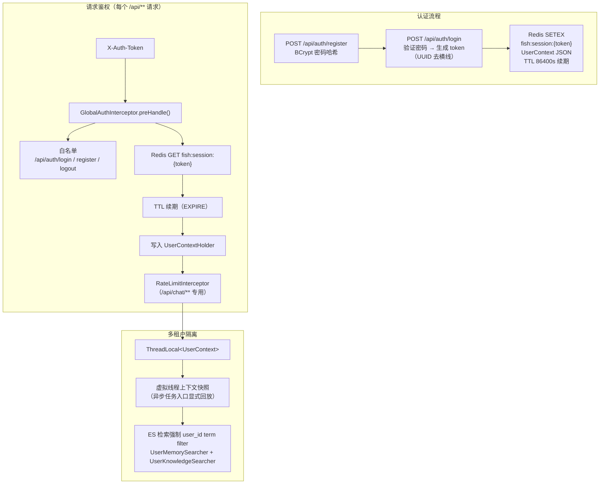
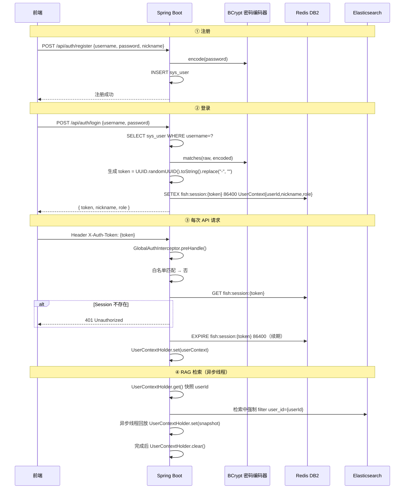

# 模块 6：认证与多租户

## 一句话定位

基于 **自定义 token + Redis Session** 的无状态鉴权体系，通过 **`GlobalAuthInterceptor` + `ThreadLocal<UserContext>`** 全链路携带用户身份，在 **ES 三索引**中以 `user_id` term filter 强制隔离私有数据，**虚拟线程**下显式快照回放防止 ThreadLocal 丢失。

---

## 架构图



---

## 流程图：登录到请求全链路



---

## 关键位置

### 1. GlobalAuthInterceptor — 鉴权入口

`[GlobalAuthInterceptor.java](../../src/main/java/com/yuyu/fishagent/auth/interceptor/GlobalAuthInterceptor.java)`：

```java
@Override
public boolean preHandle(HttpServletRequest request, HttpServletResponse response, Object handler) {
    if (isWhiteListed(request.getRequestURI())) return true;  // 白名单放行
    
    String token = request.getHeader("X-Auth-Token");
    if (token == null || token.isBlank()) {
        response.sendError(401, "缺少认证令牌");
        return false;
    }
    
    UserContext ctx = redisSessionManager.findByToken(token);
    if (ctx == null) {
        response.sendError(401, "会话已过期，请重新登录");
        return false;
    }
    
    redisSessionManager.renewToken(token);       // TTL 续期
    UserContextHolder.set(ctx);                  // 写入 ThreadLocal
    return true;
}
```

拦截器链顺序：
```
GlobalAuthInterceptor（/api/**）→ RateLimitInterceptor（/api/chat/**）→ PermissionInterceptor（/api/**）
```
限流需要 userId，必须排在 Auth 之后。

### 2. UserContextHolder + 虚拟线程快照回放

`[UserContextHolder.java](../../src/main/java/com/yuyu/fishagent/auth/context/UserContextHolder.java)`：

```java
public class UserContextHolder {
    private static final ThreadLocal<UserContext> HOLDER = new ThreadLocal<>();
    
    public static void set(UserContext ctx) { HOLDER.set(ctx); }
    public static UserContext get() { return HOLDER.get(); }
    public static Long currentUserIdOrNull() { ... }
    public static void clear() { HOLDER.remove(); }
}
```

**虚拟线程下的 ThreadLocal 传递问题**：

JDK 21 虚拟线程在 `CompletableFuture.runAsync()` 中大概率切换 carrier thread，ThreadLocal 不会自动传递。因此在 `ChatService.streamChat()` 和 RAG 异步检索中，必须显式处理：

```java
// 入口快照
final UserContext snapshot = UserContextHolder.get();
final Long userId = snapshot == null ? null : snapshot.userId();

// 异步线程回放
CompletableFuture.runAsync(() -> {
    if (snapshot != null) UserContextHolder.set(snapshot);
    try {
        // ... 长期记忆抽取 / RAG 检索 ...
    } finally {
        UserContextHolder.clear();
    }
});
```

### 3. ES 多租户强制隔离

`[UserMemoryElasticsearchSearcher.java](../../src/main/java/com/yuyu/fishagent/rag/pipeline/recall/UserMemoryElasticsearchSearcher.java)`：

```java
// 文本检索
.filter(f -> f.term(t -> t.field("user_id").value(uid)))
.filter(f -> f.term(t -> t.field("source_type").value("chat")))

// 向量检索 kNN 的 filter
.filter(f -> f.bool(b -> b
    .filter(ff -> ff.term(t -> t.field("user_id").value(uid)))
    .filter(ff -> ff.term(t -> t.field("source_type").value("chat")))))
```

三层隔离语义：
- `fish-user-memory`：`user_id` filter + `source_type=chat`（防御性：防文档切片误写入）
- `fish-user-knowledge`：`user_id` filter（仅自己的文档切片可见）
- `fish-public-knowledge`：无 `user_id` filter（所有用户共享）

---

## 方案详解：UUID Token + Redis Session + BCrypt + ThreadLocal 显式回放

### 我们选了什么

- **Token 方案**：`UUID.randomUUID().toString().replace("-", "")`（32 字符），存入 Redis `fish:session:{token}` → `UserContext` JSON，TTL 86400s + 请求续期
- **密码哈希**：BCrypt（`spring-security-crypto`），salt 自动生成，cost factor = 10
- **鉴权层**：`HandlerInterceptor`（`GlobalAuthInterceptor`），非 Filter、非 AOP
- **多租户隔离**：ES 检索 `user_id` term filter + ThreadLocal 快照回放

### 为什么这样选

**自定义 token + Redis Session 比 JWT 更适合本项目**。这个项目的鉴权需求极简：登录 → 发 token → 每次请求带 token → 验证 Redis 里有没有 → 放行。JWT 的无状态特性在这里反而是劣势——登出、封禁、角色变更需要"立即生效"，JWT 必须配合黑名单，退化成 Redis Session。与其绕一圈，不如直接用 Redis。`UUID` 作为 token 没有信息携带能力，但也不需要——Redis `GET` 一次拿到完整的 `UserContext` JSON，包含 userId、nickname、role 三个字段。每请求一次 `GET` + 一次 `EXPIRE`（续期），微秒级延迟，完全可接受。

**BCrypt 是密码哈希的最合理选择**：
- 不是最快的（SHA-256 纳秒级，GPU 可暴力），也不是最新的（Argon2 内存硬抗更好），但是最**成熟的**。
- Spring Security Crypto 直接提供 `BCryptPasswordEncoder`——不需要额外依赖（项目只引入 `spring-security-crypto`，不含完整 Spring Security）。
- `encode(raw)` 自动生成 salt 并嵌入输出（60 字符 `$2a$10$...`），`matches(raw, encoded)` 一行代码完成比较。cost=10 意味着约 2^10 = 1024 轮迭代，单次验证耗时约 100-300ms。对登录操作来说这个延迟完全可接受，但对暴力破解来说是不可逾越的成本。

**HandlerInterceptor 而不是 Filter 或 AOP**。Filter 太早了——在 DispatcherServlet 之前执行，拿不到 Spring Bean（需要手动 `WebApplicationContextUtils`）。AOP 太晚了——Controller 方法的参数绑定（包括反序列化恶意 body）已经执行完了才到切面。Interceptor 在中间——Spring Bean 正常注入、`return false` 终止请求不进入 Controller、异常直接进入 `@ExceptionHandler`。请求生命周期中的最佳鉴权位置。

**ThreadLocal 显式快照解决了虚拟线程兼容性**。JDK 21 的虚拟线程在 `CompletableFuture.runAsync()` 中可能切换 carrier thread，ThreadLocal 不保证传递。`InheritableThreadLocal` 在线程池场景有脏值风险。`ScopedValue`（Java 21 preview）Spring 尚未适配。显式快照——入口做 `UserContextHolder.get()` → 存局部变量 → 异步 lambda 中 `UserContextHolder.set(snapshot)` → finally `UserContextHolder.clear()`——代码量多三行，但行为完全可控，不依赖任何框架特性，虚拟线程和传统线程池通吃。

### 详细运作

**完整登录流程**：

```
POST /api/auth/login { username: "admin", password: "123456" }
  → AuthService.login()
  → SysUserMapper: SELECT * FROM sys_user WHERE username='admin'
  → BCryptPasswordEncoder.matches("123456", "$2a$10$...")
  → 匹配成功
  → token = UUID.randomUUID().toString().replace("-", "")
      // 例如: a1b2c3d4e5f6789012345678901234ab
  → Redis: SETEX fish:session:a1b2...34ab 86400
      '{"userId":1,"nickname":"管理员","role":"ADMIN"}'
  → 前端存储 localStorage.setItem("fish-agent-token", token)
```

**每次 API 请求的鉴权路径**：

```
X-Auth-Token: a1b2...34ab
  ↓ GlobalAuthInterceptor.preHandle()
  → 白名单匹配？→ 否
  → token 为空？→ 否
  → Redis: GET fish:session:a1b2...34ab
      → 返回 {"userId":1,"nickname":"管理员","role":"ADMIN"}
  → 反序列化为 UserContext
  → Redis: EXPIRE fish:session:a1b2...34ab 86400（续期）
  → UserContextHolder.set(ctx)
  → return true（放行）
```

TTL 续期的设计：只要用户持续使用（24h 内至少有一次请求），session 永远不会过期。如果 24h 无任何操作 → key 自然过期 → 下次请求返回 401 → 用户重新登录。

**ES 多租户隔离的三层 filter**：

```
ES 检索时拼接 filter（以 UserMemorySearcher 为例）：

文本路：
  bool:
    must: match(content, subQueryText)      ← 匹配内容
    filter: term(source_type, "chat")       ← 防 document 切片误入（防御性）
    filter: term(user_id, "1")              ← 仅当前用户的事实

向量路（kNN）：
  knn:
    field: embedding
    query_vector: [0.12, -0.34, ...]        ← 1536 维
    k: 5
    num_candidates: 80
    filter:
      bool:
        filter: term(user_id, "1")
        filter: term(source_type, "chat")
```

`source_type=chat` 是防御性约束——正常路径下 `fish-user-memory` 索引只有对话事实（Java `ChatService` 写入，`source_type` 固定为 `"chat"`）。如果因为历史 bug 或迁移导致文档切片（`source_type="document"`）混进来，这个额外 filter 保证它们不会被召回。代价为零——term filter 走倒排索引。

---

## 技术选型对比

### 对比一：自定义 token + Redis Session vs JWT vs OAuth2 + Session vs Spring Security + OAuth2

**方案 A：JWT（JSON Web Token）**

签发后服务端无状态——token 内已携带 userId、role、exp 等 claims，客户端每次请求带上，服务端仅验证签名不查 DB/Redis。

优点：
- 真正的无状态——服务端不存 session，天然水平扩展
- token 本身带有用户信息——减少一次 Redis 查询

缺点：
- **不可撤回**——签发的 token 在 `exp` 到期前始终有效。如果要实现"管理员立刻封禁某用户"或"用户立刻登出"，必须维护黑名单（Redis SET of revoked tokens），反而退化成类似 Redis Session 的模式
- token 体积大——JWT 三段 Base64，典型长度 200-400 字节（含签名），每个请求都要在网络中传输。Header `X-Auth-Token: eyJhbGciOi...` 比自定义 32 字符 UUID 长 10 倍
- 实现复杂度——签名算法（HS256 vs RS256）、密钥管理、claim 设计、refresh token 机制都需要选择

**方案 B：OAuth2 + Spring Security**

企业级认证授权框架。支持多种 grant type（authorization_code / client_credentials / password）、资源服务器和认证服务器分离、角色继承、method security 注解。

缺点：
- 引入完整 Spring Security——自动装配的 FilterChain（至少 10+ 个 Filter）、CSRF 保护（默认开启）、Session 管理（并发控制、固定保护）、formLogin / httpBasic / oauth2Login 等，配置复杂且隐式行为多
- 项目只需要用户名+密码登录→ token 鉴权，不需要第三方登录、client credential、scope 等 OAuth2 特性

**方案 C：自定义 token + Redis Session（本项目）**

架构极简——`UUID.randomUUID().toString().replace("-", "")` 生成 32 字符 token，`SETEX fish:session:{token} 86400 {UserContext JSON}` 存入 Redis，请求时 `GET fish:session:{token}` 校验。代码量：`AuthService`（登录注册）+ `RedisSessionManager`（session CRUD）+ `GlobalAuthInterceptor`（鉴权）+ `AuthController`（端点），总计约 300 行。

| 维度 | JWT | OAuth2 + Spring Security | 自定义 token + Redis（本项目） |
|------|-----|--------------------------|---------------------------|
| 即时封禁/登出 | ❌ 需黑名单 | ✅ 删 session | ✅ `DEL fish:session:{token}` |
| 角色变更即时生效 | ❌ 旧 token 仍有效 | ✅ 重新登录 | ✅ `DEL` 旧 token |
| Token 长度 | ~200-400 字节 | ~200-400 字节 | 32 字符 |
| 服务端存储 | 无（或黑名单） | 有（Session） | 有（Redis Session） |
| 水平扩展 | 天然 | 共享 Session 存储 | 共享 Redis |
| 依赖复杂度 | 低（单库 jjwt） | 高（spring-security 全家桶） | 低（已有 Redis + BCrypt） |
| 每请求 Redis 查询 | 0（或 1 次黑名单查） | 0-1 次 | 1 次 `GET` + 1 次 `EXPIRE` |
| 本项目选择 | — | — | ✅ |

**为什么愿意多一次 Redis 查询**：鉴权拦截器（`GlobalAuthInterceptor`）本身就要查 Redis Session——这是项目的核心鉴权路径。与其引入 JWT 的签名验证、黑名单、refresh token 机制，不如保持简单：token 就是一个随机 key，Redis 里有就是登录了，没有就是过期了，一行 `DEL` 就是登出。这个简单性在排障、审计、安全审查时优势明显——任何人都能看懂"Redis 里有这个 key = 这个用户登录了"。

### 对比二：BCrypt vs SHA-256 vs Argon2 vs PBKDF2

**方案 A：SHA-256（无盐单次哈希）**

`sha256(password)` — 固定输入产生固定输出。问题：相同密码的哈希相同；GPU 每秒可算数十亿次；彩虹表直接反查。完全不适合密码存储。

**方案 B：SHA-256 + Salt**

`sha256(salt + password)` — 每个用户独立 salt，彩虹表失效。但仍快——GPU 每秒仍可算数十亿次。暴力破解成本低。

**方案 C：PBKDF2**

迭代哈希（如 10000 次 HMAC-SHA256），计算慢于单次 SHA。可通过 `iterations` 参数调节。但 GPU 对 HMAC 仍有显著加速（ASIC 更高效），且内存硬抗不够（memory-hardness 不足）。

**方案 D：Argon2**

2015 年密码哈希竞赛冠军。三个可变参数：时间成本（iterations）、内存成本（MB）、并行度（threads）。对 GPU 和 ASIC 都有天然抗性——需要大量内存。比 BCrypt 更安全，但 Spring Security Crypto 模块内建支持不如 BCrypt 成熟（需要额外引入 Bouncy Castle 或 argon2-jvm）。

**方案 E：BCrypt（本项目）**

1999 年设计，但至今仍是最广泛使用的密码哈希算法之一。内建 salt（自动生成、嵌入输出）、可配置 cost factor（`log2(iterations)`，默认 10 = 1024 轮）、天然抗 GPU（BCrypt 使用 Blowfish 密钥扩展，对 GPU 不友好，内存访问模式使其难以并行加速）。Spring Security Crypto 直接提供 `BCryptPasswordEncoder`——`encode()` 自动生成 salt，`matches(raw, encoded)` 比较原文与哈希。

| 维度 | SHA-256 | SHA-256+Salted | PBKDF2 | Argon2 | BCrypt（本项目） |
|------|---------|---------------|--------|--------|-----------------|
| Salt | ❌ 无 | ✅ 手动管理 | ✅ 内置 | ✅ 内置 | ✅ 内置（自动生成） |
| GPU 抗性 | ❌ 极低 | ❌ 低 | 中（可通过 iteration 提升） | ✅ 高（内存硬抗） | ✅ 高（Blowfish 结构） |
| 速度（越慢越安全） | 纳秒级 | 微秒级 | 毫秒级（可调） | 毫秒级（可调） | 几百毫秒（cost=10） |
| 成熟度 | 极高（通用哈希） | 高 | 高 | 中 | ✅ 极高 |
| Spring 内建 | `DigestUtils` | `DigestUtils` | 需额外引入 | 需额外引入 | ✅ `BCryptPasswordEncoder` |
| 本项目选择 | — | — | — | — | ✅ |

### 对比三：鉴权层 — Interceptor vs Filter vs AOP

**方案 A：Servlet Filter**

Filter 在 Servlet 容器层执行，早于 Spring MVC 的 DispatcherServlet。优势：可以拦截所有请求（包括静态资源），不受 Spring MVC 路由限制。劣势：无法直接获取 Spring Bean（需要 `WebApplicationContextUtils` 手动获取），异常处理不经过 `GlobalExceptionHandler`（需手动写 401 JSON 到 `HttpServletResponse`）。

**方案 B：AOP（`@Before` / `@Around`）**

注解驱动的切面鉴权——在 Controller 方法上加 `@RequireAuth` 注解。优势：粒度精确到方法级，代码最简洁。劣势：切面在代理层执行，晚于参数绑定——如果 Controller 方法参数绑定时抛异常，切面不执行；无法阻止恶意请求到达 Controller 层（浪费 CPU 做参数绑定）。

**方案 C：HandlerInterceptor（本项目）**

Spring MVC 拦截器，在 `DispatcherServlet` 之后、Controller 之前执行。优势：可以获取 Spring Bean（直接 `@Component` 注入）、可以 return `false` 终止请求（Controller 不执行）、异常直接进入 `@ExceptionHandler`。`addPathPatterns("/api/**")` 精确匹配路径，白名单跳过 `/api/auth/login|register|logout`。

| 维度 | Filter | AOP | HandlerInterceptor（本项目） |
|------|--------|-----|---------------------------|
| 执行时机 | 最早（Servlet 容器） | 最晚（代理层） | 中间（DispatcherServlet 之后） |
| Spring Bean 注入 | 需手动获取 | ✅ 支持 | ✅ 支持 |
| 路径匹配 | 需手写 | ✅ 注解 | ✅ `addPathPatterns` |
| 异常处理 | 需手写 response | ✅ `@ExceptionHandler` | ✅ `@ExceptionHandler` |
| 请求终止 | `chain.doFilter` 阻断 | `@Before` throw | `return false` |
| 本项目选择 | — | — | ✅ |

### 对比四：虚拟线程 ThreadLocal — 显式快照 vs InheritableThreadLocal vs ScopedValue

**方案 A：InheritableThreadLocal**

`InheritableThreadLocal` 在子线程创建时自动拷贝父线程的值。问题：在**线程池**场景下，子线程是复用的——第二次提交任务时，子线程可能带着上一次 InheritableThreadLocal 的脏值。且虚拟线程的 carrier thread 切换机制不保证 InheritableThreadLocal 的正确性。

**方案 B：ScopedValue（Java 21+ Preview）**

JDK 21 引入的 Structured Concurrency 配套 API——`ScopedValue` 绑定到结构化并发的作用域，自动在线程树中传播且不可变。更安全且更适合虚拟线程。但 **Spring Boot 3.5 未适配 ScopedValue**——Spring 的 `RequestContextHolder`、`SecurityContextHolder` 等仍用 ThreadLocal。

**方案 C：显式快照 + 回放 + 清理（本项目）**

```java
// 入口快照（主线程 / 虚拟线程 carrier）
final UserContext snapshot = UserContextHolder.get();
final Long userId = snapshot == null ? null : snapshot.userId();

// 异步任务中回放
CompletableFuture.runAsync(() -> {
    if (snapshot != null) UserContextHolder.set(snapshot);
    try {
        // 需要 userId 的业务逻辑
    } finally {
        UserContextHolder.clear();  // 防止泄漏
    }
});
```

| 维度 | InheritableThreadLocal | ScopedValue | 显式快照（本项目） |
|------|----------------------|------------|-----------------|
| 线程池安全 | ❌ 脏值风险 | ✅ 不可变 | ✅ 完全受控 |
| Spring 适配 | ✅ 默认 | ❌ 未适配 | ✅ 不依赖框架 |
| 代码显式性 | 隐式（不知道何时传播） | 中 | 高（快照/回放/清理三步可见） |
| 虚拟线程支持 | ❌ 不保证 | ✅ 设计目标 | ✅ 手动保证 |

---

## 面试追问预判

**Q：为什么不用 Spring Security？**

项目只需要：BCrypt 密码哈希 + 自定义 token 登录 + Redis Session 鉴权 + 白名单。Spring Security 为 OAuth2、角色继承、CSRF、Session Fixation 等复杂场景设计——引入后需要关闭十几种默认行为、配置自定义 FilterChain、理解其认证管理器（AuthenticationManager/Provider）体系。当前方案：1 个 Interceptor（80 行）+ 1 个 SessionManager（50 行）+ 1 个 AuthService（100 行）+ BCryptPasswordEncoder（1 行），总计约 300 行，完全可控。如果未来需要接入 OAuth2/OIDC，再考虑引入 Spring Security 也不迟——当前代码不需要任何重构。

**Q：401 和 403 的区别在项目中怎么体现？**

- **401**（Unauthorized —— 实际意思是"未认证"）：不带 `X-Auth-Token` 或 token 在 Redis 中不存在 → `GlobalAuthInterceptor.preHandle()` 中 `response.sendError(401)` → 不经过 Controller。语义：我不知道你是谁。
- **403**（Forbidden —— "已认证但无权限"）：已登录但角色不足（如普通用户访问 `/api/admin/**`）→ `PermissionInterceptor` 预留校验。当前 Controller 内 `UserContextHolder.get().role()` 自行判断是否为 ADMIN。语义：我知道你是谁，但你不能做这件事。

**Q：虚拟线程下 ThreadLocal 传递的问题怎么发现的？**

实际调试场景：RAG 检索日志显示 `user_id` 始终为 null，私有知识检索返回空列表。排查发现 `RagRecall` 使用 `CompletableFuture.runAsync()` 执行三路并发检索，而 JDK 21 虚拟线程的 ForkJoinPool 不保证 ThreadLocal 在 carrier thread 切换时保留。解决：入口将 `UserContextHolder.get()` 快照到局部变量 `userId`，在 `runAsync` 的 lambda 内显式 `UserContextHolder.set(snapshot)`，完成后 `UserContextHolder.clear()`。`ChatService.streamChat()` 中同理——`streamUserSnapshot` 变量跨线程传递 ThreadLocal 上下文。

**Q：为什么 ES 检索时 filter 加 user_id 还不够，还要加 source_type=chat？**

这是防御性过滤。历史数据可能因为 bug 或数据迁移导致 `source_type=document` 的文档切片被写入 `fish-user-memory` 索引（本该写入 `fish-user-knowledge`）。`source_type=chat` 的额外 filter 确保即使这种误写入发生，文档切片也不会作为"用户记忆"被检索到。代价为零（term filter 走倒排索引，不增加延迟）。

**Q：多租户隔离在多实例部署下有漏洞吗？**

没有。租户隔离不依赖任何进程内状态——`user_id` 来自 Redis Session（`GET fish:session:{token}`），每次请求都从 Redis 重新获取，不缓存到 JVM。ES 检索的 `user_id` term filter 是服务端拼接的，用户无法篡改（不由前端传入，而是从 `UserContextHolder` 取）。即使用户手动构造请求绕过前端，`GlobalAuthInterceptor` 在拦截器层已验证 token → 加载真实 `UserContext` → 写入 ThreadLocal。不存在"换一个实例就绕过鉴权"的可能——所有实例共享同一个 Redis 作为 session 存储。

---

## 关联代码路径速查

| 职责 | 路径 |
|------|------|
| 鉴权拦截器 | `auth/interceptor/GlobalAuthInterceptor.java` |
| 权限拦截器（预留） | `auth/interceptor/PermissionInterceptor.java` |
| Session 管理 | `auth/session/RedisSessionManager.java` |
| 用户上下文 | `auth/context/UserContext.java` |
| ThreadLocal 持有者 | `auth/context/UserContextHolder.java` |
| 认证服务 | `auth/AuthService.java` |
| 认证控制器 | `auth/AuthController.java` |
| 认证配置 | `auth/config/AuthProperties.java` |
| 用户实体 | `auth/entity/SysUser.java` |
| 用户 Mapper | `auth/mapper/SysUserMapper.java` |
| ES 私有检索（含 user_id filter） | `rag/pipeline/recall/UserMemoryElasticsearchSearcher.java` |
| ES 知识检索（含 user_id filter） | `rag/pipeline/recall/UserKnowledgeElasticsearchSearcher.java` |
| ES 公共检索（无 filter） | `rag/pipeline/recall/PublicKnowledgeElasticsearchSearcher.java` |
