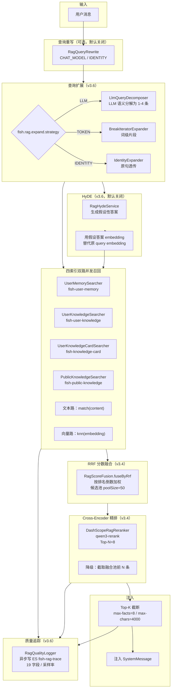
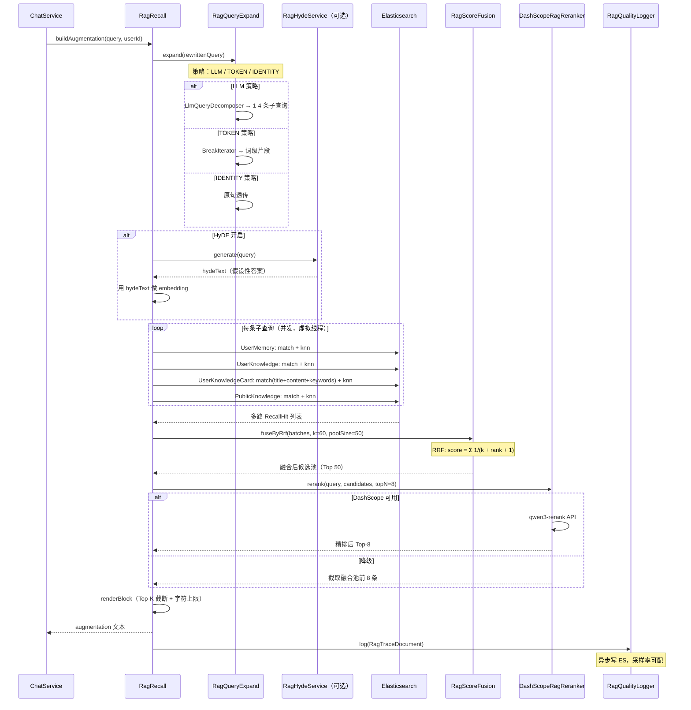
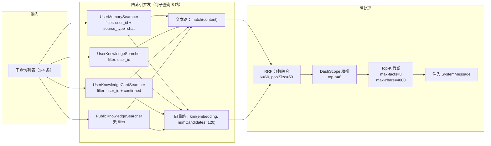

# 模块 7：RAG 检索增强管线

## 一句话定位

**查询分解 → 四索引双路并发召回 → RRF 分数融合 → Cross-Encoder 精排 → Top-K 注入 SystemMessage** 五级管线，配合 **HyDE 假设性答案增强** 与 **ES 异步质量追踪**，实现数据驱动的检索闭环。

---

## 架构图



---

## 流程图：RAG 全链路



---

## 流程图：四路并发召回



---

## 关键位置

### 1. RagRecall — 召回编排入口

`[RagRecall.java](../../src/main/java/com/yuyu/fishagent/rag/pipeline/recall/RagRecall.java)`：

**核心数据结构**：

```java
public record RecallHit(String id, String content, double score, String source) {}
```

**编排逻辑**：
1. 查询扩展（`SubQueryExpander.expand()`）→ 得到子查询列表
2. HyDE（可选）→ 生成假设性答案，替代原 query 做 embedding
3. 每条子查询 → 4 索引 × 2 路 = 8 路并发检索（虚拟线程 + `CompletableFuture.allOf()`）
4. RRF 分数融合 → 候选池
5. DashScope 精排 → Top-N
6. `renderBlock()` 格式化为编号列表，拼入 SystemMessage
7. 质量追踪（`RagQualityLogger.log()`）

**虚拟线程下 ThreadLocal 传递**：`UserContextHolder` 在异步检索中显式快照回放（详见模块 6）。

配置项（`fish.rag.recall.*`）：

| 配置 | 默认值 | 说明 |
|------|--------|------|
| `max-sub-queries` | 12 | 最大并行子查询数 |
| `per-subquery-size` | 10 | 单子查询每路召回数 |
| `knn-num-candidates` | 120 | kNN 候选集大小 |
| `vector-leg-enabled` | true | 向量召回开关 |

### 2. 查询扩展 — 三策略切换（v3.6）

`[RagQueryExpand.java](../../src/main/java/com/yuyu/fishagent/rag/pipeline/expand/RagQueryExpand.java)`：

```
fish.rag.expand.strategy:
  LLM      → LlmQueryDecomposer（默认，LLM 语义分解为 1-4 条完整检索句）
  TOKEN    → BreakIteratorExpander（词级片段，旧方案）
  IDENTITY → IdentityExpander（原句透传，不扩展）
```

**LlmQueryDecomposer 降级链**：LLM 超时（3s）/ 解析失败 / 模型不可用 → 降级为单条原句。

`[RagQueryExpandConfiguration.java](../../src/main/java/com/yuyu/fishagent/rag/pipeline/expand/RagQueryExpandConfiguration.java)` 根据 strategy 字段装配对应 Expander Bean。LLM 策略下如果 `memoryChatModel` 不可用，自动降级为 `IdentityExpander`。

配置项（`fish.rag.expand.*`）：

| 配置 | 默认值 | 说明 |
|------|--------|------|
| `strategy` | LLM | 扩展策略 |
| `max-queries` | 4 | LLM 最多生成几条子查询 |
| `temperature` | 0.3 | LLM 调用温度 |
| `timeout-ms` | 3000 | LLM 调用超时 |
| `min-query-chars` | 5 | 子查询最短字符数 |
| `max-query-chars` | 200 | 子查询最长字符数 |

### 3. HyDE — 假设性答案增强（v3.6）

`[RagHydeService.java](../../src/main/java/com/yuyu/fishagent/rag/pipeline/expand/RagHydeService.java)`：

```java
public String generate(String query) {
    // 1. 检查开关和输入合法性
    // 2. CompletableFuture.supplyAsync() 调用 ChatModel
    // 3. future.get(timeoutMs) 超时保护
    // 4. 返回假设性答案文本（null 如果失败/关闭）
}
```

**设计要点**：
- 仅替代向量检索腿的 embedding 文本，不影响文本检索腿
- 超时保护：`CompletableFuture.supplyAsync().get(timeoutMs)`，超时返回 null → 回退原 query
- 默认关闭（`fish.rag.hyde.enabled=false`）

配置项（`fish.rag.hyde.*`）：

| 配置 | 默认值 | 说明 |
|------|--------|------|
| `enabled` | false | 是否启用 |
| `max-tokens` | 300 | 假设答案最大 token 数 |
| `temperature` | 0.5 | 生成温度 |
| `timeout-ms` | 3000 | 超时 |

### 4. RRF 分数融合（v3.4）

`[RagScoreFusion.java](../../src/main/java/com/yuyu/fishagent/rag/pipeline/fusion/RagScoreFusion.java)`：

```java
public static List<RecallHit> fuseByRrf(List<List<RecallHit>> batches, int rrfK, int poolSize) {
    // 每组按原始 score 降序得到组内 rank
    // RRF 融合分: score = Σ 1/(k + rank + 1)
    // 去重（同一 id 保留原始分最高的代表）
    // 按 RRF 分降序排列，截断到 poolSize
}
```

**为什么用 RRF 而不是直接比原始分**：BM25 分数和 cosine 分数量纲不同（BM25 可以到 20+，cosine 在 0-1 之间），直接比较会导致 BM25 结果完全压过向量结果。RRF 只看排名不看原始分——第 1 名得 1/(k+1)，第 2 名得 1/(k+2)——不同召回路的排名可以公平加权。

配置项（`fish.rag.fusion.*`）：

| 配置 | 默认值 | 说明 |
|------|--------|------|
| `enabled` | true | 是否启用融合 |
| `rrf-k` | 60 | RRF 常数（越大头部差距越平滑） |
| `candidate-pool-size` | 50 | 融合后候选池上限 |

### 5. DashScope Cross-Encoder 精排（v3.4）

`[DashScopeRagReranker.java](../../src/main/java/com/yuyu/fishagent/rag/pipeline/rerank/DashScopeRagReranker.java)`：

```java
public List<RecallHit> rerank(String query, List<RecallHit> candidates, int topN) {
    // 1. 准备降级结果（截取前 topN）
    // 2. 检查开关和 API Key
    // 3. 调用 DashScope qwen3-rerank API
    // 4. 解析返回的 index + relevance_score
    // 5. 映射回候选池，返回精排后列表
    // 失败/空结果 → 降级为截取
}
```

**降级策略**：无 API Key / 网络失败 / 服务返回空 → 截取融合候选池前 topN 条。`fallback-on-error=true`（默认）保证对话主链路不断。

配置项（`fish.rag.rerank.*`）：

| 配置 | 默认值 | 说明 |
|------|--------|------|
| `enabled` | true | 是否启用精排 |
| `model` | qwen3-rerank | DashScope 精排模型 |
| `top-n` | 8 | 精排返回条数 |
| `timeout-seconds` | 5 | API 超时 |
| `fallback-on-error` | true | 失败是否降级 |

### 6. UserKnowledgeCardSearcher — 知识卡片召回（v4.2）

`[UserKnowledgeCardSearcher.java](../../src/main/java/com/yuyu/fishagent/rag/pipeline/recall/UserKnowledgeCardSearcher.java)`：

与其他三个 Searcher 同构（实现 `DocumentSearcher` 接口），但有三个差异点：

**① 三字段文本搜索**（title / content / keywords）：

```java
.should(s -> s.match(mt -> mt.field("title").query(subQueryText)))
.should(s -> s.match(mt -> mt.field("content").query(subQueryText)))
.should(s -> s.match(mt -> mt.field("keywords").query(subQueryText)))
.minimumShouldMatch("1")
```

其他 Searcher 只搜 `content` 一个字段。卡片标题通常比内容更短更精确（如"TCP 三次握手"），单独搜索 title 能显著提高命中率。keywords 字段覆盖用户可能用别名检索的场景。

**② confirmed 状态过滤**：

```java
.filter(f -> f.term(t -> t.field("status").value(KnowledgeCard.STATUS_CONFIRMED)))
```

pending 和 rejected 卡片不参与 RAG 检索，避免未审核内容污染对话上下文。

**③ 事实文本格式**：

```java
"知识卡片《标题》：正文 关键词：xxx"
```

注入给模型时保留标题（`《标题》`）让模型能识别知识来源，关键词后缀补充语义信息。

### 7. RAG 质量追踪（v3.6）

`[RagQualityLogger.java](../../src/main/java/com/yuyu/fishagent/rag/pipeline/tracing/RagQualityLogger.java)` + `[RagTraceDocument.java](../../src/main/java/com/yuyu/fishagent/rag/pipeline/tracing/RagTraceDocument.java)`：

每次 RAG 调用异步写入 ES `fish-rag-trace` 索引，记录 19 个字段：

| 阶段 | 记录字段 |
|------|---------|
| 查询 | `original_query`, `rewritten_query`, `expanded_queries` |
| 召回 | `recall_total_hits`, `recall_deduped_hits` |
| 融合 | `fusion_top_n` |
| 精排 | `rerank_input_count`, `rerank_top_score`, `rerank_lowest_score` |
| HyDE | `hyde_used` |
| 注入 | `injected_fact_count`, `injected_total_chars` |
| 延迟 | `recall_latency_ms`, `rerank_latency_ms`, `total_latency_ms` |
| 元数据 | `trace_id`, `user_id`, `session_id`, `created_at` |

**关键特性**：
- 异步写入，不阻塞主流程
- 采样率可配（`sample-rate`，默认 1.0 = 全量）
- 写入失败仅 WARN
- `@PostConstruct` 自动创建 ES 索引（含 `ik_max_word` 分词映射）
- 三处一致性源：`RagTraceDocument` @Field 注解、`traceMapping()` 方法、`es.txt` DDL

配置项（`fish.rag.tracing.*`）：

| 配置 | 默认值 | 说明 |
|------|--------|------|
| `enabled` | true | 是否启用追踪 |
| `index-name` | fish-rag-trace | ES 索引名 |
| `async` | true | 是否异步写入 |
| `sample-rate` | 1.0 | 采样率（0.0-1.0） |

---

## 方案详解

### 我们选了什么

- **查询扩展**：LLM 语义分解（默认） / TOKEN 词级 / IDENTITY 透传，三策略可切换
- **HyDE**：生成假设性答案替代原 query embedding（默认关闭）
- **四索引双路召回**：用户记忆 / 用户文档 / 用户知识卡片 / 公共知识 × 文本 / 向量，虚拟线程并发
- **RRF 分数融合**：统一 BM25 与 cosine 排名，候选池 poolSize=50
- **DashScope 精排**：qwen3-rerank Cross-Encoder，top-n=8
- **质量追踪**：19 字段异步写 ES，采样率可配

### 为什么这样选

**LLM 查询分解替代词级扩展**。旧方案用 `BreakIterator` 做词级切分——"Docker Compose 部署和 Redis 配置"被切为 ["Docker Compose 部署和 Redis 配置", "Docker", "Compose", "Redis", "配置"]，碎片化的词检索效果差。LLM 分解能生成完整检索句：["Docker Compose 部署配置方法", "Redis 在 Docker 中如何配置"]，每条都是独立完整的检索意图。超时（3s）/ 失败降级为原句，不影响主链路。

**RRF 解决跨路分数不可比问题**。BM25 分数可以到 20+，cosine 分数在 0-1 之间——如果直接按分数合并排序，BM25 结果会完全压过向量结果。RRF 只看排名：每条文档在各路中的排名（第 1、第 2、第 3...），融合分 = Σ 1/(k + rank + 1)。排名越靠前贡献越大，且不受原始分数量纲影响。`k=60` 是经验值——越大则 top-1 和 top-2 的差距越平滑，避免单路第 1 名独占融合分。

**Cross-Encoder 精排弥补双塔模型的精度不足**。召回阶段用的 cosine / BM25 是双塔模型（query 和 document 独立编码），无法捕捉 query-document 交互特征。Cross-Encoder 把 query 和 document 拼在一起编码，精度远高于双塔——但速度慢，所以只在候选池（~50 条）上做精排，而非全量。

**质量追踪实现数据驱动的参数调优**。19 字段覆盖从查询到注入的全链路，可以：①对比 LLM 查询分解前后命中率变化；②找出命中率低的查询针对性优化；③验证 HyDE 开启后的效果；④监控延迟分布。采样率可配（0.01-1.0），高流量时降采样避免 ES 写入压力。

### 详细运作

**完整的 RAG 管线数据流**：

```
用户: "Docker Compose 怎么部署 Redis？"
  ↓
[查询重写] rewrite-enabled=false → 跳过
  ↓
[查询扩展] strategy=LLM → LlmQueryDecomposer
  → LLM 调用（memoryChatModel, temperature=0.3, timeout=3s）
  → 返回: ["Docker Compose 部署 Redis 配置方法", "Redis 容器化部署最佳实践"]
  （如果超时 → 降级为原句）
  ↓
[HyDE] enabled=false → 跳过
  ↓
[四路并发召回] 每条子查询 × 4 索引 × 2 路 = 8 路并发

  子查询1: "Docker Compose 部署 Redis 配置方法"
    → UserMemorySearcher: match + knn → 10 hits
    → UserKnowledgeSearcher: match + knn → 8 hits
    → UserKnowledgeCardSearcher: match(title+content+keywords) + knn → 3 hits
    → PublicKnowledgeSearcher: match + knn → 12 hits

  子查询2: "Redis 容器化部署最佳实践"
    → UserMemorySearcher: match + knn → 5 hits
    → UserKnowledgeSearcher: match + knn → 6 hits
    → UserKnowledgeCardSearcher: match + knn → 2 hits
    → PublicKnowledgeSearcher: match + knn → 9 hits
  ↓
[RRF 融合] 所有 8 路 × 2 子查询 = 16 批结果
  → 各批按 score 降序排 rank
  → RRF 融合分: score = Σ 1/(60 + rank + 1)
  → 去重（同一 id 保留最高原始分代表）
  → 截断到 poolSize=50
  ↓
[DashScope 精排] qwen3-rerank
  → POST /api/v1/services/rerank/...
    body: { model: "qwen3-rerank", input: { query: "Docker Compose 怎么部署 Redis？", documents: [50条] }, parameters: { top_n: 8 } }
  → 返回 8 条，按 relevance_score 降序
  （如果失败 → 截取融合池前 8 条）
  ↓
[Top-K 截断] max-injected-facts=8, max-injected-chars=4000
  → renderBlock() 格式化为编号列表
  → "以下为可能与当前对话相关的已知事实：\n1. ...\n2. ..."
  ↓
[注入 SystemMessage] 拼接到 ChatService.buildMessages() 的 SystemMessage 末尾
  ↓
[质量追踪] 异步写 ES fish-rag-trace
  → trace_id, original_query, expanded_queries, recall_total_hits, fusion_top_n,
    rerank_top_score, hyde_used=false, injected_fact_count, total_latency_ms, ...
```

---

## 技术选型对比

### 对比一：查询扩展 — LLM 语义分解 vs BreakIterator 词级 vs 原句直搜

| 维度 | 原句直搜 | BreakIterator 词级 | LLM 语义分解（本项目默认） |
|------|---------|-------------------|--------------------------|
| 检索精度 | 低（长问题关键词被稀释） | 中（碎片化词片段） | 高（完整检索意图） |
| 延迟 | 零 | 零 | +0.5-3s（LLM 调用） |
| 额外 token | 0 | 0 | ~200-500/次 |
| 降级方案 | N/A | N/A | ✅ 超时/失败 → 原句 |
| 多意图支持 | ❌ | ❌（只是词碎片） | ✅（每条子查询独立意图） |

**为什么默认 LLM**：聊天场景下用户消息经常包含多意图（"上次聊的 Docker 和 Redis 部署再讲一下"），LLM 能拆解为独立检索句。超时 3s 降级为原句，最坏情况下与 IDENTITY 策略等价。

### 对比二：分数融合 — RRF vs 线性加权 vs 仅用一路

| 维度 | 仅文本路 | 仅向量路 | 线性加权 α×BM25 + β×cosine | RRF（本项目） |
|------|---------|---------|---------------------------|-------------|
| 精确匹配 | ✅ 好 | ❌ 弱 | 中 | ✅ 好（文本路保底） |
| 语义泛化 | ❌ 弱 | ✅ 好 | 中 | ✅ 好（向量路补充） |
| 跨路可比 | N/A | N/A | ❌ 需手动调 α/β | ✅ 只看排名，天然可比 |
| 参数敏感 | N/A | N/A | 高（α/β 需调） | 低（k 经验值 60） |

**为什么选 RRF**：线性加权需要手动调 α 和 β 权重，且不同查询的最优权重不同。RRF 不需要调权重——它把所有路的排名归一化为倒数，天然可比。`k=60` 是 HuggingFace BEIR benchmark 中的经验最优值。

### 对比三：精排 — Cross-Encoder vs 无精排 vs 简单规则排序

| 维度 | 无精排 | 按向量分降序 | Cross-Encoder（本项目） |
|------|--------|-------------|----------------------|
| 精度 | 低（双塔模型精度有限） | 中 | ✅ 高（交互式编码） |
| 延迟 | 零 | 零 | +0.3-2s（API 调用） |
| 成本 | 零 | 零 | DashScope API 调用费 |
| 降级 | N/A | N/A | ✅ 失败截取融合池 |

**为什么加精排**：召回阶段（BM25 + cosine）是双塔模型，无法捕捉 query-document 交互特征。例如"如何部署"与"Docker 安装教程"在双塔中可能相似度低，但 Cross-Encoder 能理解两者是问答关系。精排只在 ~50 条候选上做（而非全量），API 延迟可接受。

### 对比四：HyDE — 开启 vs 关闭 vs 用 LLM 重写 query

| 维度 | 原句 embedding | LLM 重写 query | HyDE 假设答案（本项目） |
|------|---------------|---------------|----------------------|
| 语义匹配 | 中（query 与 document 风格差异） | 中高 | ✅ 高（答案与文档同分布） |
| 额外 LLM 调用 | 0 | 1 | 1 |
| 风险 | 无 | 可能改错意图 | 可能生成错误假设 |
| 默认状态 | — | — | 关闭（可选启用） |

**为什么默认关闭 HyDE**：HyDE 的效果高度依赖 query 类型——对事实型问题（"Redis 持久化方式有哪些"）效果好，对开放性问题（"你觉得微服务好不好"）可能生成不相关的假设答案，反而干扰检索。当前作为可选功能，通过 `fish.rag.hyde.enabled=true` 手动开启。

---

## 面试追问预判

**Q：RAG 检索增加的延迟怎么控制？**

管线中各阶段都有降级策略：
- **查询扩展**：LLM 超时 3s → 降级为原句（零延迟）
- **HyDE**：超时 3s → 返回 null，用原 query embedding（零延迟）
- **精排**：超时 5s / API 失败 → 截取融合池前 N 条（零延迟）
- **追踪**：异步写 ES，完全不阻塞

最坏情况（全链路开启且正常）：扩展 ~1s + 召回 ~60ms + 融合 ~5ms + 精排 ~500ms = ~1.5s。最佳情况（全降级）：~60ms（仅四路召回）。

**Q：RRF 的 k=60 是怎么定的？**

k 是平滑常数——k 越大，top-1 和 top-2 的融合分差距越小（越平滑）。HuggingFace BEIR benchmark 中，RRF 在 k=60 时在多个数据集上取得最佳 nDCG@10。过小（如 k=1）则 top-1 的优势过于突出，单路的第 1 名可能主导融合结果；过大（如 k=1000）则所有排名的差距被过度平滑，失去区分度。

**Q：质量追踪的 19 个字段够用吗？能加什么？**

19 个字段覆盖了查询→召回→融合→精排→注入的核心指标。未来可考虑：
- **用户反馈信号**：点赞/点踩 → 追踪文档中加 `user_feedback` 字段，形成"检索→用户评价"的闭环
- **生成质量**：LLM 回复后评估是否引用了注入的事实（需要 LLM judge，成本高）
- **A/B 实验**：trace_id 关联实验组，对比不同策略的检索效果

当前设计已足够支撑数据驱动的参数调优——通过 ES 聚合查询就能回答"LLM 扩展 vs TOKEN 扩展的平均命中率差异"这类问题。

**Q：虚拟线程下 RAG 并发检索的 ThreadLocal 怎么处理？**

`UserContextHolder`（ThreadLocal）在主线程由 `GlobalAuthInterceptor` 写入。RAG 检索在 `CompletableFuture.runAsync()` 中用虚拟线程执行，carrier thread 切换时 ThreadLocal 不保证传递。`RagRecall` 在进入异步前从 `UserContextHolder.get()` 快照 `userId` 到局部变量，在 lambda 内显式 `UserContextHolder.set(snapshot)` 回放，完成后 `UserContextHolder.clear()`。

**Q：四索引分离的实际收益是什么？**

四种索引对应不同来源的知识、不同的写入方和不同的权限模型：
- `fish-user-memory`：对话事实（Java 写入），`user_id + source_type=chat` filter
- `fish-user-knowledge`：用户文档切片（Python Worker 写入），`user_id` filter
- `fish-knowledge-card`：用户知识卡片（Java 写入，confirmed 状态），`user_id + status=confirmed` filter
- `fish-public-knowledge`：公共知识（管理员维护），无 filter

分离后各自 DDL 独立演进、分片数可独立调整、写入方互不影响。知识卡片索引的 `status=confirmed` 过滤确保未审核内容不会注入对话上下文。

**Q：知识卡片 Searcher 的三字段文本搜索为什么不同于其他 Searcher？**

其他三个 Searcher 只搜 `content` 一个字段。卡片 Searcher 搜索 `title + content + keywords` 三个字段（`minimumShouldMatch=1`），因为卡片标题通常比内容更短更精确（如"TCP 三次握手"），如果只搜 content 可能漏召回。keywords 字段覆盖用户用别名检索的场景（卡片标记了"容器化"，用户搜"Docker"也能命中）。

---

## 关联代码路径速查

| 职责 | 路径 |
|------|------|
| **召回编排（核心入口）** | `rag/pipeline/recall/RagRecall.java` |
| 召回配置 | `rag/pipeline/recall/RagRecallConfiguration.java` |
| 用户记忆检索 | `rag/pipeline/recall/UserMemoryElasticsearchSearcher.java` |
| 用户知识检索 | `rag/pipeline/recall/UserKnowledgeElasticsearchSearcher.java` |
| **知识卡片检索** | `rag/pipeline/recall/UserKnowledgeCardSearcher.java` |
| 公共知识检索 | `rag/pipeline/recall/PublicKnowledgeElasticsearchSearcher.java` |
| **查询扩展** | `rag/pipeline/expand/RagQueryExpand.java` |
| 扩展配置 | `rag/pipeline/expand/RagQueryExpandConfiguration.java` |
| LLM 分解 Prompt | `rag/pipeline/expand/RagQueryDecomposePrompt.java` |
| HyDE 服务 | `rag/pipeline/expand/RagHydeService.java` |
| 查询重写 | `rag/pipeline/query/RagQueryRewrite.java` |
| **RRF 分数融合** | `rag/pipeline/fusion/RagScoreFusion.java` |
| **DashScope 精排** | `rag/pipeline/rerank/DashScopeRagReranker.java` |
| 精排接口 | `rag/pipeline/rerank/RagReranker.java` |
| **质量追踪** | `rag/tracing/RagQualityLogger.java` |
| 追踪文档 | `rag/tracing/RagTraceDocument.java` |
| RAG 配置 | `rag/config/RagProperties.java`（含 Recall / Expand / Hyde / Fusion / Rerank / Tracing 嵌套类） |
| 对话编排（调用 RAG） | `chat/ChatService.java` |
