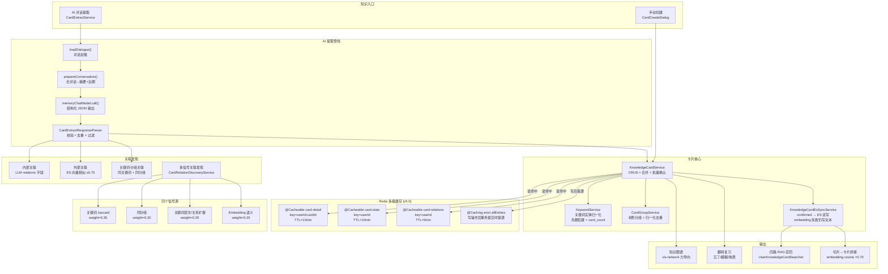
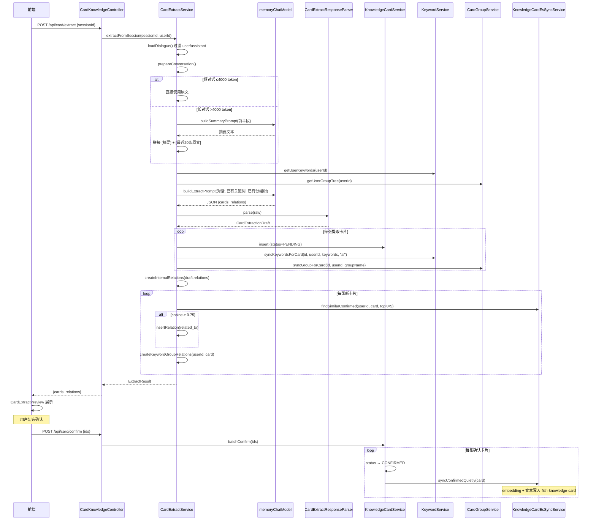
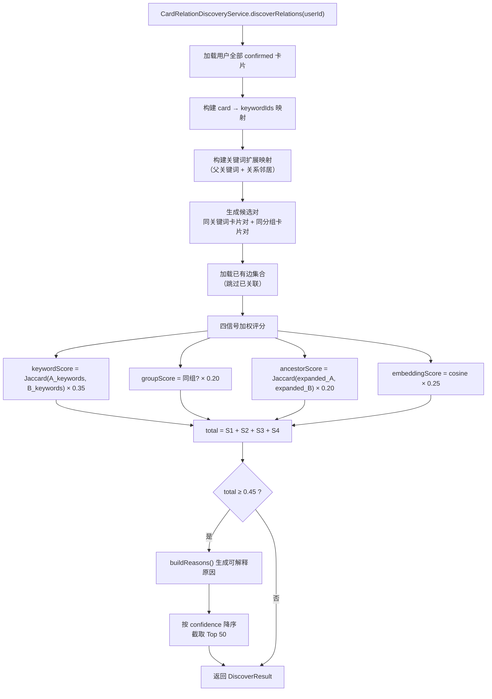

# 模块 8：知识卡片系统

## 一句话定位

基于 **LLM 对话提取 + 人工确认** 的知识沉淀闭环，通过 **关键词实体归一化**、**多信号加权投票关联发现**、**树形分组层级**、**MySQL→ES 双写同步** 和 **Redis 多级缓存 [v5.0]**，将对话中的散碎知识组织为可检索、可复习、可图谱化浏览的结构化卡片，并经 **四路 RAG** 回注对话上下文。

---

## 架构图



---

## 流程图：AI 对话提取全链路



---

## 流程图：多信号关联发现



---

## 关键位置

### 1. CardExtractService — AI 提取编排

`[CardExtractService.java](../../src/main/java/com/yuyu/fishagent/card/service/CardExtractService.java)`：

**长对话处理**（第 111-134 行）：

```java
private String prepareConversation(List<ChatMessageDTO> messages) {
    String full = formatMessages(messages);
    if (estimateTokens(full) <= DIRECT_TOKEN_THRESHOLD) {  // ≤4000 token 直接用
        return full;
    }
    // 长对话：前半段摘要 + 最近20条原文
    int mid = Math.max(1, messages.size() / 2);
    String prefix = formatMessages(messages.subList(0, mid));
    String summary = chatModel.call(promptBuilder.buildSummaryPrompt(prefix))...;
    List<ChatMessageDTO> recent = messages.subList(
        Math.max(0, messages.size() - RECENT_MESSAGE_LIMIT), messages.size());
    return "[对话摘要]\n%s\n[近期对话原文]\n%s".formatted(summary, formatMessages(recent));
}
```

**三阶段关联创建**（第 91-95 行）：
```java
Map<String, KnowledgeCard> titleToCard = insertPendingCards(draft.cards(), userId, sessionId);
relations.addAll(createInternalRelations(draft.relations(), titleToCard));   // ① LLM 内部关联
relations.addAll(createExternalRelations(userId, titleToCard.values()...));  // ② 向量外部关联
// createExternalRelations 内部还调 createKeywordGroupRelations            // ③ 关键词-分组关联
```

### 2. CardExtractPromptBuilder — 提取 Prompt 设计

`[CardExtractPromptBuilder.java](../../src/main/java/com/yuyu/fishagent/card/extract/CardExtractPromptBuilder.java)`：

**Prompt 核心设计原则**：
- **宁缺毋滥**：`宁可少提取，也不要提取低质量内容`。正例/反例 + 提取标准 4 条全部满足
- **结构化输出**：严格 JSON schema，`cards[] + relations[]`，relations 通过 `from_title/to_title` 引用同批卡片
- **上下文感知**：注入用户已有关键词库（前 50 个，`、`分隔）+ 已有分组树（缩进层级），引导 LLM 复用已有概念
- **分组层级感知**：`group_name 支持 "父分组/子分组" 路径格式`，如果属于已有分组的子领域，优先创建子分组

### 3. KeywordService — 关键词实体归一化

`[KeywordService.java](../../src/main/java/com/yuyu/fishagent/card/service/KeywordService.java)`：

```java
// 归一化规则：trim().toLowerCase()
public static String normalize(String raw) {
    String s = raw.trim().toLowerCase();
    return s.length() > MAX_KEYWORD_LENGTH ? s.substring(0, MAX_KEYWORD_LENGTH) : s;
}
```

**先删后建的一致性保证**（第 44-72 行）：

```java
public List<Keyword> syncKeywordsForCard(Long cardId, Long userId, List<String> keywordNames, String source) {
    removeKeywordsForCard(cardId);  // 先清空旧关联 + 回退 card_count
    // 对每个关键词：findOrCreate(userId, displayName, normalizedName)
    // → keyword 表唯一索引 (user_id, normalized_name) 自动去重
    // → card_keyword 表插入关联 + keyword.card_count += 1
}
```

**设计要点**：
- `keyword` 表用 `normalized_name` 去重，"Docker" 和 "docker" 映射到同一个 Keyword 实体
- `card_keyword` 是关联表，`source` 字段区分 AI 提取和手动添加
- `keyword.card_count` 是冗余计数缓存，删除卡片时原子减 1
- 唯一索引保证 `insert` 幂等——重复执行迁移不会重复计数

### 4. CardRelationDiscoveryService — 多信号关联发现

`[CardRelationDiscoveryService.java](../../src/main/java/com/yuyu/fishagent/card/service/CardRelationDiscoveryService.java)`：

**四信号加权投票**：

```java
float keywordScore = jaccard(aKeywords, bKeywords);          // Jaccard 系数 × 0.35
boolean sameGroup = sameGroup(a, b);                          // 同组 +0.20
float ancestorScore = jaccard(expandedA, expandedB);          // 扩展 Jaccard × 0.20
float embeddingScore = embeddingScores.getOrDefault(...);     // cosine × 0.25
float total = keywordScore * 0.35f + (sameGroup ? 0.20f : 0) + ancestorScore * 0.20f + embeddingScore * 0.25f;
```

**关键词扩展映射**（第 157-184 行）：
- **层次扩展**：keyword 有 `parentId` → 向上取父关键词、祖父关键词加入扩展集合
- **关系扩展**：`keyword_relation` 表中的 synonym/broader/narrower/related 邻居加入扩展集合
- 扩展后的集合参与 Jaccard 计算，捕捉"不共享关键词但有层次/关系近邻"的卡片对

**候选对生成**：只对"同关键词"或"同分组"的卡片对计算，避免 O(N²) 全量比较。上限 100 对做 embedding 评分。

### 5. KnowledgeCardEsSyncService — MySQL→ES 双写

`[KnowledgeCardEsSyncService.java](../../src/main/java/com/yuyu/fishagent/card/service/KnowledgeCardEsSyncService.java)`：

**降级安全设计**：
```java
public void syncConfirmedQuietly(KnowledgeCard card) {
    try {
        KnowledgeCardDocument doc = toDocument(card);
        doc.setEmbedding(embedForCardQuietly(card));  // embedding 失败 → 空向量，文本仍写入
        ops.save(doc);
    } catch (Exception e) {
        log.warn("ES 同步失败 cardId={}", card.getId());  // 不抛异常，不回滚 MySQL
    }
}
```

**Embedding 文本构造**：
```java
private static String cardEmbeddingText(KnowledgeCard card) {
    return "标题：" + card.getTitle()
         + "\n分组：" + card.getGroupName()
         + "\n关键词：" + String.join("、", card.getKeywords())
         + "\n内容：" + card.getContent();
}
```

### 6. KnowledgeCardService — CRUD 与事务安全 + Redis 缓存 [v5.0]

`[KnowledgeCardService.java](../../src/main/java/com/yuyu/fishagent/card/service/KnowledgeCardService.java)`：

**v5.0 缓存注解**：

| 方法 | 缓存注解 | 说明 |
|------|---------|------|
| `detail(id)` | `@Cacheable(CARD_DETAIL)` | key=`userId:id`，绕过时需 userId 防**越权** |
| `stats(userId)` | `@Cacheable(CARD_STATS)` | key=`userId`，4×COUNT + 递归 group 树结果 |
| `allRelations(userId)` | `@Cacheable(CARD_RELATIONS)` | key=`userId`，TTL=5min（比 detail/stats 短） |
| `create/update/delete` | `@Caching(evict={detail,stats,relations})` | allEntries=true |
| `batchConfirm/batchReject` | 同上 | — |
| `merge` | 同上 | — |
| `addRelation/deleteRelation` | 同上 | — |

**Key 安全设计**：`detail()` 方法体含 `findOwnedCardOrForbidden(userId, id)` 权限校验。`@Cacheable` 命中时**跳过方法体**，权限校验被绕过。解决方案：**将 userId 编入缓存 key**（`T(UserContextHolder).currentUserIdOrNull() + ':' + #id`），用户 A 和用户 B 查同一张卡片走不同 key，用户 B 的 cache miss 会触发权限校验。

**事务感知驱逐**：`RedisCacheManager.transactionAware()` 让 `@CacheEvict` 延迟到事务提交后执行，避免"驱逐缓存 → 事务回滚 → 缓存被误清 → 下次读到脏数据"。

**删除操作的表顺序**（避免死锁，第 125-141 行）：

```java
public void delete(Long id) {
    // 1. 子表优先：card_keyword + keyword.card_count
    keywordService.removeKeywordsForCard(card.getId());
    cardGroupService.removeGroupForCard(card.getId());
    // 2. 关联表：拆分 OR 为两条 DELETE（避免 InnoDB gap lock 范围过大）
    cardRelationMapper.delete(Wrappers.<CardRelation>lambdaQuery().eq(CardRelation::getFromCardId, card.getId()));
    cardRelationMapper.delete(Wrappers.<CardRelation>lambdaQuery().eq(CardRelation::getToCardId, card.getId()));
    // 3. 主表最后
    knowledgeCardMapper.deleteById(card.getId());
    esSyncService.deleteQuietly(card.getId());
}
```

**合并逻辑**（第 175-211 行）：保留 keep 的标题正文，将 discard 的关键词合并进来，迁移 discard 的所有关联边到 keep，然后删除 discard。关键词去重用 `LinkedHashSet` 保序。

---

## 方案详解

### 我们选了什么

- **AI 提取**：LLM 结构化 JSON 输出 + 人工确认/拒绝工作流，memoryChatModel 独立调用
- **长对话处理**：>4000 token 时前半段摘要 + 最近 20 条原文，避免截断丢失信息
- **关键词实体**：`keyword` 归一化表 + `card_keyword` 关联表，JSON keywords 与索引双轨
- **关联发现**：四信号加权投票（关键词 Jaccard + 同分组 + 关键词层次扩展 + embedding），阈值 0.45
- **分组层级**：`card_group` 实体表，`normalized_name` 去重，`parent_id` 树形结构
- **ES 双写**：confirmed 卡片异步写入 `fish-knowledge-card` 索引，embedding 失败仍保留全文搜索
- **Redis 多级缓存 [v5.0]**：`@Cacheable` 缓存 detail/stats/relations，SpEL key 含 userId 防越权，`@Caching(evict)` 写路径驱逐，`transactionAware` 防回滚误清，`CacheErrorHandler` 降级
- **图谱可视化**：vis-network 力导向布局，节点颜色按卡片类型（concept/topic），边样式按关联类型
- **复习模式**：翻转卡片，忘了/模糊放到队尾，熟悉移出，CSS 3D flip 动画
- **切片桥接**：embedding 余弦 >0.70 动态关联，不落库

### 为什么这样选

**AI 提取 + 人工确认的"双保险"模式**。纯 LLM 提取有幻觉风险——可能提取非知识性内容、编造关键词、生成不准确的关联。纯手动创建效率太低——用户不会主动去"记笔记"。双保险：LLM 做初筛（从长对话中识别值得沉淀的知识），用户做终审（确认/编辑/拒绝），保留人类判断力的同时大幅降低操作成本。

**长对话摘要而非截断**。直接截取最近 N 条会丢失上下文——前半段可能讨论了重要的背景和结论。摘要 + 近期原文的方案兼顾了信息完整性和 token 成本。摘要用 `memoryChatModel`（temperature=0.1）保证输出稳定性，失败降级为仅近期原文。

**关键词归一化解决"同义不同名"**。"Docker"、"docker"、"DOCKER" 在 JSON keywords 中是三个不同值，但语义上是同一个概念。`KeywordService.normalize()` 统一为小写，`keyword` 表的 `(user_id, normalized_name)` 唯一索引自动合并。关联发现和提取 prompt 注入时使用归一化后的实体，避免同一个技术概念产生多张卡片。

**四信号加权投票而非单一 embedding**。纯 embedding 相似度只能捕捉语义层面的关联，无法发现"同属 Java 基础分组但主题不同"的卡片对。四信号互补：
- 关键词 Jaccard（0.35）：精确的概念重叠
- 同分组（0.20）：人工/LLM 的分类判断
- 关键词层次扩展（0.20）：捕捉"A 的子关键词是 B"的隐含关系
- Embedding（0.25）：语义相似度的兜底补充

**MySQL→ES 双写的降级策略**。ES 同步失败不应阻塞 MySQL 主流程——用户创建卡片后不应因为 ES 暂时不可用而收到错误。`syncConfirmedQuietly()` 内部全 try-catch，embedding 生成失败时仍写入文本字段（保证全文搜索可用），ES 写入失败仅 WARN 日志。confirmed 卡片在 ES 中同时具备文本搜索（`ik_max_word` 分词）和向量搜索（1536 维 embedding）能力。

### 详细运作

**AI 提取的完整数据流**：

```
用户点击「从对话提取」
  ↓
CardExtractService.extractFromSession(sessionId, userId)
  ↓
loadDialogue(): 从 RustFS 加载完整对话 → 过滤 user/assistant 角色
  ↓
prepareConversation():
  ├─ 短对话 (≤4000 token): 直接拼接原文
  └─ 长对话: memoryChatModel 生成前半段摘要 + 拼接最近 20 条原文
  ↓
注入上下文: getUserKeywords() (前50个) + getUserGroupTree() (缩进层级)
  ↓
buildExtractPrompt(): system prompt (提取标准 + 格式规则 + 上下文) + user message (对话)
  ↓
memoryChatModel.call() → JSON {cards, relations}
  ↓
CardExtractResponseParser.parse():
  ├─ JSON schema 校验
  ├─ 标题/内容长度过滤
  ├─ 按 title 去重
  └─ 卡片数上限
  ↓
insertPendingCards(): status=PENDING + syncKeywords + syncGroup
  ↓
createInternalRelations(): LLM 输出的 relations[] → by title → CardRelation
  ↓
createExternalRelations():
  ├─ findSimilarConfirmed(userId, card, 5) → cosine ≥ 0.75 → related_to
  └─ createKeywordGroupRelations() → 同关键词 + 同分组 → related_to
  ↓
返回 ExtractResult(cards, relations) → 前端 CardExtractPreview 展示
  ↓
用户勾选确认 → batchConfirm(ids) → status → CONFIRMED + ES 双写
```

**关联发现的完整数据流**：

```
discoverRelations(userId)
  ↓
加载全部 confirmed 卡片 + 构建 card→keywordIds 映射
  ↓
构建关键词扩展映射:
  ├─ 层次扩展: keyword.parentId → grandParentId
  └─ 关系扩展: keyword_relation 中的邻居
  ↓
生成候选对: 同关键词卡片对 ∪ 同分组卡片对
  ↓
加载已有边: 排除已关联的对
  ↓
对每个候选对计算四信号:
  ├─ keywordScore = Jaccard(A.kw, B.kw) × 0.35
  ├─ groupScore = sameGroup(A, B) × 0.20
  ├─ ancestorScore = Jaccard(expanded_A, expanded_B) × 0.20
  └─ embeddingScore = cosine × 0.25
  ↓
total = sum → ≥ 0.45 保留
  ↓
buildReasons(): 生成可解释原因（"共享关键词(JVM、GC)"、"同组(Java 基础)"）
  ↓
按 confidence 降序 → 截取 Top 50 → 返回 DiscoverResult
```

**卡片生命周期的状态机**：

```
手动创建 → CONFIRMED (直接可用) + 缓存驱逐 [v5.0]
AI 提取 → PENDING → CONFIRMED (ES 双写 + 缓存驱逐 [v5.0]) / REJECTED (ES 清除 + 缓存驱逐 [v5.0])
编辑 confirmed 卡片 → MySQL 更新 + ES 更新 + 缓存驱逐 [v5.0]
合并 → keep 保留 + discard 关键词合并 + 关联迁移 + discard 删除 + 缓存驱逐 [v5.0]
删除 → 子表清空 → 关联拆分删除 → 主表删除 → ES 删除 + 缓存驱逐 [v5.0]
```

---

## 技术选型对比

### 对比一：AI 提取 — LLM 结构化输出 vs 正则匹配 vs 手动创建

| 维度 | 手动创建 | 正则/规则匹配 | LLM 结构化提取（本项目） |
|------|---------|-------------|----------------------|
| 提取质量 | 取决于用户投入 | 低（固定模式） | 高（理解语义） |
| 关键词提取 | 用户手填 | TF-IDF/TextRank | LLM 生成 + 归一化 |
| 关联发现 | 无 | 规则驱动 | LLM 内部 + 多信号外部 |
| 用户成本 | 高（全手写） | 低（全自动，质量差） | 低（AI 初筛 + 人工终审） |
| 幻觉风险 | 无 | 无 | 有（人工确认兜底） |

**为什么选 LLM + 人工确认**：知识卡片的质量直接决定 RAG 召回效果和复习体验。纯自动方案（正则/TF-IDF）无法理解"TCP 三次握手是一个值得提取的完整概念，而 for 循环语法不是"。LLM 能理解语义边界，但可能产生幻觉——人工确认步骤保证最终质量。

### 对比二：关键词存储 — JSON 数组 vs 归一化实体表 vs 纯 ES tag

| 维度 | JSON 数组 | ES tag | 归一化实体表（本项目） |
|------|----------|--------|-------------------|
| 去重 | ❌ 字符串精确匹配 | 中（分词） | ✅ normalized_name |
| 关联发现 | 需全量扫描 | 需聚合查询 | ✅ card_keyword JOIN |
| card_count | 需 COUNT 查询 | 需聚合查询 | ✅ 冗余缓存原子更新 |
| 层次/关系 | ❌ | ❌ | ✅ parentId + keyword_relation |
| 扩展性 | 差 | 中 | ✅ 独立表独立演进 |

**为什么双轨**：`KnowledgeCard.keywords` (JSON) 保持前端展示简单（直接渲染标签），`keyword` + `card_keyword` 表支持归一化查询、card_count 统计和关联发现。`KeywordService.syncKeywordsForCard()` 负责两轨一致。

### 对比三：关联发现 — 多信号投票 vs 纯 embedding vs 图数据库

| 维度 | 纯 embedding | 图数据库（Neo4j） | 多信号投票（本项目） |
|------|-------------|-----------------|-------------------|
| 精确匹配 | ❌ 无法区分同关键词 | ✅ 边属性精确查询 | ✅ 关键词 Jaccard |
| 语义相似 | ✅ 优势 | ❌ 需额外嵌入 | ✅ embedding 信号 |
| 部署复杂度 | 低（已有 ES） | 高（新增 Neo4j） | 低（复用 MySQL + ES） |
| 可解释性 | 低（相似度分数） | 中（图路径） | ✅ 人类可读原因 |

**为什么不选 Neo4j**：项目当前的知识图谱规模（用户级通常 <1000 张卡片）不需要图数据库的遍历能力。多信号投票在 MySQL + ES 上即可实现，且每个信号都有明确含义（"共享关键词 JVM、GC" vs "同组 Java 基础"），面试时更容易解释。

### 对比四：ES 同步策略 — 双写 vs CDC vs 定时全量

| 维度 | 定时全量同步 | CDC（Canal/Debezium） | 同步双写（本项目） |
|------|-----------|---------------------|-----------------|
| 实时性 | 延迟分钟级 | 秒级 | ✅ 毫秒级（同事务内） |
| 一致性 | 最终一致 | 强一致（binlog） | ✅ MySQL 优先，ES 降级 |
| 运维复杂度 | 低 | 高（新增 CDC 组件） | 低（代码内 try-catch） |
| 失败处理 | 下次同步修复 | 重试队列 | ✅ 静默失败 + WARN |

**为什么选同步双写**：卡片确认后需要立即可在 RAG 中检索到（用户刚确认的卡片在下一轮对话就要生效）。定时全量同步有延迟，CDC 引入额外组件。同步双写在 Service 层 `batchConfirm()` 中直接调用 `syncConfirmedQuietly()`，embedding 失败不阻塞，ES 不可用不回滚 MySQL。

---

## 面试追问预判

**Q：AI 提取的 prompt 为什么强调"宁缺毋滥"？**

知识卡片进入 ES 后会被 RAG 召回注入对话上下文。低质量卡片（如"for 循环语法"这种常识）被召回后占用 `max-facts=8` 的宝贵槽位，挤掉真正有价值的知识。且用户在复习模式中会看到所有 confirmed 卡片，噪音卡片浪费用户时间。prompt 中通过正例/反例对比 + 4 条硬性标准 + "一次对话通常只有 2-5 个"的引导，控制提取质量。用户始终可以通过确认/拒绝做最终把关。

**Q：关键词归一化的 `trim().toLowerCase()` 会不会误合并？**

极端情况下会——"Java"（编程语言）和 "java"（印尼爪哇岛）会被合并。但在本项目场景（IT 学习助手）中，这种冲突几乎不会发生。如果未来需要区分，可以在归一化时加入领域上下文（如 "Java(SE)" vs "Java(地理)"）。当前方案在"正确率 99%+ "和"实现复杂度极低"之间做了最佳权衡。

**Q：合并两张卡片时，关联边怎么处理？**

discard 的所有关联边（`from_card_id=discard OR to_card_id=discard`）被逐条迁移到 keep。迁移时把 discard 的 ID 替换为 keep，如果替换后 `from=to`（自环）则跳过。迁移用 `createRelationQuietly()`，唯一索引保证不重复。迁移完成后才删除 discard 的关联和主记录。

**Q：多信号关联发现的 embedding 信号为什么只对 ≤100 对计算？**

每对 embedding 查询需要一次 ES kNN 搜索。1000 张卡片的候选对可能上千对，全量计算延迟过高（10-30 秒）。实际上通过"同关键词"和"同分组"两个前置过滤器，大部分无关卡片对已经被排除。剩余的候选对数量通常在 50-100 对以内，embedding 评分可以在 1-2 秒内完成。

**Q：为什么用 memoryChatModel 做提取而不是主对话模型？**

提取是后台异步任务，不需要工具调用能力，用独立的 `memoryChatModel`（temperature=0.1）输出更稳定。同时避免占用主对话模型的并发配额——用户可能在提取卡片的同时进行对话，两个模型互不影响。

**Q：CardRelation 的唯一索引是什么？**

`(from_card_id, to_card_id, relation_type)` 三列唯一索引。同一对卡片可以有不同类型的关联（如 `related_to` + `precedes`），但同类型只允许一条。`insertRelation()` 捕获 `DuplicateKeyException` 静默跳过。

**Q：知识卡片如何参与 RAG 检索？**

confirmed 卡片通过 `KnowledgeCardEsSyncService` 写入 `fish-knowledge-card` ES 索引（含 embedding）。RAG 管线中的 `UserKnowledgeCardSearcher` 对该索引做文本 + 向量双路检索（搜索 title/content/keywords 三个字段），结果参与 RRF 融合和 DashScope 精排。注入格式为 `知识卡片《标题》：正文 关键词：xxx`——保留标题让模型识别来源。

**Q：为什么给知识卡片加 Redis 缓存 [v5.0]？`detail()` 每次打几次 DB？**

`detail(id)` 方法内部包含 4 次子查询：①卡片主表 ②关键词列表 ③分组信息 ④关联列表。`stats()` 更重：4 个 COUNT + 递归构建 group 树。这些读操作频率远高于写操作（用户浏览列表/详情页频繁触发，但创建/编辑低频），是典型的缓存优化场景。

Spring Cache + Redis 的方案用 JSON 序列化 record VO（不需要实现 Serializable），读命中时省掉全部子查询。写操作通过 `@Caching(evict=allEntries)` 清除该用户所有缓存，`transactionAware` 保证驱逐延迟到事务提交后——事务回滚不会误清缓存。Redis 异常时 `CacheErrorHandler` 吞掉异常降级为直查 DB，缓存故障不影响业务。

**Q：缓存 key 里为什么要带 userId？不加会怎样？**

`detail()` 方法体含 `findOwnedCardOrForbidden(userId, id)` 权限校验——用户 A 无权看用户 B 的私有卡片。但 `@Cacheable` 命中时**跳过方法体**，权限校验被绕过。如果 key 只用 `cardId`（`key="#id"`），用户 A 查卡片 123 缓存后，用户 B 查同一张卡片会命中缓存直接返回——**权限绕过漏洞**。

将 userId 编入 key：`key=T(UserContextHolder).currentUserIdOrNull() + ':' + #id`，用户 A 和用户 B 查同一张卡片走不同的 key。用户 B 的 key 在缓存中 miss → 触发方法体 → 权限校验 → 403。安全性和性能兼顾。

**Q：前端知识图谱用什么库渲染？**

`vis-network`（Vis.js）的力导向布局。节点颜色按卡片类型区分（topic=紫色, concept=蓝色），边样式按关联类型区分。支持单击弹出信息卡、双击打开详情面板、按类型/关联类型筛选、全屏模式。数据一次性从后端加载（全部卡片 + 全部关联边），前端内存中构建图，无需分页。

---

## 关联代码路径速查

| 职责 | 路径 |
|------|------|
| **卡片 CRUD 服务** | `card/service/KnowledgeCardService.java` |
| **AI 提取编排** | `card/service/CardExtractService.java` |
| **缓存常量 [v5.0]** | `common/cache/CacheConstants.java` |
| **Redis 缓存配置 [v5.0]** | `common/cache/RedisCacheConfig.java` |
| **提取 Prompt 构建** | `card/extract/CardExtractPromptBuilder.java` |
| **提取响应解析** | `card/extract/CardExtractResponseParser.java` |
| **关键词实体归一化** | `card/service/KeywordService.java` |
| **树形分组管理** | `card/service/CardGroupService.java` |
| **多信号关联发现** | `card/service/CardRelationDiscoveryService.java` |
| **MySQL→ES 双写** | `card/service/KnowledgeCardEsSyncService.java` |
| **卡片控制器** | `card/controller/CardKnowledgeController.java` |
| 卡片实体 | `card/entity/KnowledgeCard.java` |
| 分组实体 | `card/entity/CardGroup.java` |
| 关键词实体 | `card/entity/Keyword.java` |
| 卡片-关键词关联 | `card/entity/CardKeyword.java` |
| 卡片关联 | `card/entity/CardRelation.java` |
| 关键词关联 | `card/entity/KeywordRelation.java` |
| ES 文档模型 | `card/document/KnowledgeCardDocument.java` |
| 分组树节点 DTO | `card/dto/GroupTreeNode.java` |
| 提取结果 DTO | `card/dto/ExtractResult.java` |
| 关联建议 DTO | `card/dto/RelationSuggestion.java` |
| RAG 卡片检索器 | `rag/pipeline/recall/UserKnowledgeCardSearcher.java` |
| 切片↔卡片桥接 | `rag/service/ChunkClusterService.java` |
| 前端卡片视图 | `frontend/src/views/KnowledgeCardView.vue` |
| 前端卡片网格 | `frontend/src/components/CardGrid.vue` |
| 前端详情面板 | `frontend/src/components/CardDetailPanel.vue` |
| 前端 AI 提取预览 | `frontend/src/components/CardExtractPreview.vue` |
| 前端知识图谱 | `frontend/src/components/CardGraphView.vue` |
| 前端翻转复习 | `frontend/src/components/CardReviewMode.vue` |
| 前端关联发现 | `frontend/src/components/CardRelationDiscovery.vue` |
| 前端 API 层 | `frontend/src/api/card.ts` |
