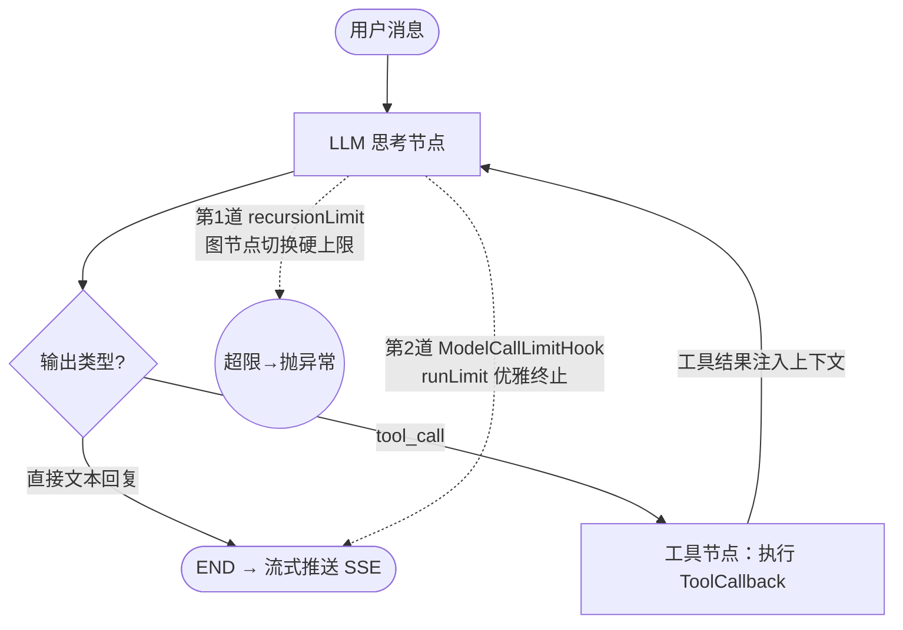

# 模块 1：Agent 核心与工具链（面试复盘版）

> - **配套详细版**（全量代码路径、版本史、mermaid）：`../模块1-Agent核心与工具链.md`
> - **本版定位**：现场复盘口述体——顶部一句话定位 + 每个特性按「背景 / 问题与方案 / 追问」展开，只保留**少量关键图与代码**，方便开口讲。
> - **内容范围**：ReAct + SPI 工具 + 工具结果治理 A/B/C + LLM 熔断 + turn-bound 可观测（均对齐当前代码）。
> - ⚠️ 注意：工具结果治理讲 **token-aware 三层（A/B/C）** 这一套，**不要再讲旧的字符级截断**（早期字符级 `TextTruncator` 治理已被 token-aware 的 `ToolResultGovernor` 取代，仅作无 governor 时的测试兼容回退）。

---

## 一句话定位 & 本模块亮点

基于 **Spring AI Alibaba `ReactAgent`** 的 graph 状态机智能体引擎——思考-行动-观察循环驱动 LLM 自主调工具，三重机制防死循环，工具结果 token 治理保证单个结果吃不爆上下文。

- **ReAct + 三重防死循环**：graph 节点状态机驱动推理，`recursionLimit` 图节点硬上限 + `ModelCallLimitHook` 优雅终止 + `AgentStatus` 原子状态机，从优雅到强制分层兜底，最坏情况也不浪费多余 token。
- **工具结果治理 A/B/C**：单工具结果 token 预算封顶——A 头尾截断（兜底）/ B LLM 摘要（中档）/ C 巨量结果分片入 Redis scratch + `search_large_result` 按需回取（招牌）；字符预算从自家 `TokenEstimator` 采样反推 CJK/Latin 密度，**中文结果不再绕过预算**。
- **SPI 工具零侵入扩展**：`AgentToolProvider` 接口 + `ToolRegistry` 启动期自动发现，单工具构造失败隔离不影响其它；新增工具只需 `@Component` 实现两方法。
- **LLM 熔断**：`CircuitBreakerOperator` 保护整条 Flux，故障率 50% / 慢调用 80% 触发 OPEN 快速失败返回降级，**用快速失败替代重试**，避免重复 token 与连接异常。
- **turn-bound 可观测**：有 turnId 时每轮重建工具集，把 scratch key 与 trace 绑到同一轮；逐节点 thought/action/observation + 耗时落 ES trace，工具治理的处置方式（截断/摘要/检索式注入）可追溯。

---

## 一、自主规划智能体：ReAct + 三重防死循环

### 背景
单纯的大模型对话只能"一问一答"，解决不了需要多步骤、需要调外部能力的复杂问题（比如"帮我搜今天长春天气，再总结成一句话"——要先搜再总结）。

### 问题与方案

让智能体具备"思考-行动"能力：**每轮思考后决定下一步做什么**——是调工具还是直接给答案；如果调工具，工具结果会注入下一轮思考的上下文，于是就能多步骤地解决连续任务。范式上 ReAct（推理+行动）适合实时交互，plan-execute 更适合长期任务，实际常结合着用。

我选的是 **Spring AI Alibaba 的 graph 状态机**来驱动状态流转，而不是手写 `while(true)`：



相比 `while` 循环，graph 把"状态 A → 状态 B"当成"图节点 A → 节点 B"的移动，**可控性和可扩展性更高**——不用在循环里手写调工具的逻辑、重试策略和异常处理，框架全包了。

但状态机也带来新问题：**智能体在特殊情况下可能一直思考无法终止**（比如一次工具调用异常后反复再调同一个工具，形成死循环白白烧 token）。于是上**三重防线**（`BaseAgent.buildReactAgent`）：

```java
protected ReactAgent buildReactAgent(List<ToolCallback> tools, String systemPrompt) {
    // 第 1 道：图节点切换硬上限（触达直接抛异常，兜底）
    CompileConfig cc = CompileConfig.builder()
            .recursionLimit(Math.max(maxIterations * 4, 20))   // 默认 maxIterations=10 → 40
            .build();
    // 第 2 道：优雅终止——达 runLimit 后追加 END，模型不再被调用
    ModelCallLimitHook hook = ModelCallLimitHook.builder()
            .runLimit(maxIterations)
            .exitBehavior(ModelCallLimitHook.ExitBehavior.END)
            .build();
    return ReactAgent.builder()
            .model(chatModel).tools(tools).hooks(hook)
            .compileConfig(cc).build();
}
// 第 3 道：AgentStatus（AtomicReference 状态机），调用方 transitionTo(STOPPED) 从外部中断
```

分层哲学是"先礼后兵"——从优雅到强制：

| 层 | 触发 | 用户感受 | 为什么要这一层 |
|----|------|---------|--------------|
| `ModelCallLimitHook` | 模型调满 10 次 | 好（自然结束） | 优雅终止，模型有最后一次机会给总结回复 |
| `recursionLimit` | 图节点切换满 40 次 | 差（异常中断） | 框架级兜底，防 Hook 失效的极端情况 |
| `AgentStatus` | 用户点"停止生成" | 好（用户预期内） | 调用方控制，给用户取消能力 |

三者叠加确保**无论模型怎么"一根筋"都能终止，且不浪费多余 token**。

### 追问

**1. `recursionLimit` 抛异常后，用户看到的是什么？你怎么处理？**
这道是兜底，正常不会触发——因为模型调满 10 次就被 `ModelCallLimitHook` 优雅终止了。真触发了更可能是框架 bug：用户看到 error，代价是这轮对话不持久化，要重试。

**2. 三层为什么不只用一层？**
单层兜不住所有情况：只靠 Hook，万一框架 bug 让它没生效，图节点会无限切换；只靠 recursionLimit，用户体验差（异常中断看到报错而不是总结）；只靠状态机，需要外部主动触发。三层分别对应"概率最高/框架兜底/用户主动"，职责不重叠。

**3. `recursionLimit` 为什么是 `maxIterations × 4`？**
一次 LLM 调用在 graph 内部会产生多个节点（agent → llm → router → tool → llm → ...），节点数远大于模型调用数，所以硬上限要放大到模型调用次数的 4 倍，才不会误伤正常多步推理。

**4. 如果 LLM 幻觉反复调同一个工具怎么办？**
`ModelCallLimitHook` 的 `runLimit=10` 优雅兜底——告诉模型"到此为止"，它有最后一次机会总结，而不是直接炸掉。再极端 `recursionLimit=40` 硬上限抛异常。用户侧还能 `AgentStatus` 中断。三重保证终止。

---

## 二、工具结果治理 A/B/C：让单个工具结果吃不爆上下文（本模块旗舰）

### 背景
系统已有**总量预算**（`TokenEstimator` + `ContextBudgetAllocator` + `emergencyTrim` 兜底），但**单个工具结果没有独立预算**——一个 `file_read` / `log_query` 返回 50KB，会先吃爆总量预算、再被 `emergencyTrim` 乱砍，而且超长内容是"硬塞进上下文"而不是"检索式注入"。虾皮一连串追问"工具结果太长 / 上下文爆炸 / 日志超窗口"，我答不出系统解。于是给**单个工具结果封顶**，并给超大结果一条"分片 + 按需回取"的招牌路径。

### 问题与方案

三层递进，路由顺序 **C（招牌）→ B（中档）→ A（兜底）**：

```mermaid
flowchart TD
    R[工具原始结果<br/>originalTokens = TokenEstimator.estimate] --> B1{≥ scratch 阈值(20480)<br/>且 turnId 存在?}
    B1 -->|是| C[C 检索式注入<br/>分片入 Redis scratch<br/>只注入 top-k 预览]
    B1 -->|否| B2{≥ 摘要阈值(8192)?}
    B2 -->|是| SM[B LLM 摘要<br/>失败自动回落 A]
    B2 -->|否| A[A 头尾截断<br/>兜底]
    C --> FIT[budgeter.fit ≤ 单结果预算]
    SM --> FIT
    A --> FIT
    FIT --> OUT[注入上下文 + 落 TurnTrace disposition]
```

入口 `ToolResultGovernor.govern`：

```java
public GovernedResult govern(String turnId, String toolName, String toolInput, String result) {
    int originalTokens = TokenEstimator.estimate(result);
    int budget = properties.budgetTokensFor(toolName);          // 默认 4096，可按工具 override

    // C 检索式注入：真正巨量 → 分片入 scratch，注入 top-k 预览
    if (scratchEnabled && originalTokens >= Math.max(budget+1, 20480)
            && turnId != null && !"search_large_result".equals(toolName)) { ... }
    // B 摘要：中等大 → memoryChatModel 忠实摘要（保留错误/数字/路径/URL/时间/结论），失败回落 A
    if (summarizeEnabled && originalTokens >= Math.max(budget+1, 8192)) { ... }
    // A 头尾截断兜底
    return budgeter.fit(result, budget, "truncated");
}
```

- **A 单结果预算 + 智能截断（兜底）**：head + tail 保留（头有 schema/状态码，尾有最新日志/结论），中间写中文 marker。**关键是字符预算从文本样本反推，不硬编码**：

  ```java
  // 采样 2000 字符反推 charsPerToken（CJK≈1.5，Latin≈4），clamp 到 [1.0, 4.0]
  int sampleTokens = estimate(text.substring(0, min(len, 2000)));
  double charsPerToken = clamp(sampleChars / sampleTokens, 1.0, 4.0);
  int maxChars = floor(budget * charsPerToken);
  // head 55% + tail 45%，中间插 marker，while 循环收敛到 ≤ budget
  while (estimate(governed) > budget && head > 20 && tail > 20) { head *= 0.9; tail *= 0.9; ... }
  ```

- **B 结果摘要（中档）**：超 8K token → `memoryChatModel`（低温、禁工具）做忠实摘要，摘要仍受 A 封顶；模型不可用或失败**自动回落 A**，绝不影响工具主链路。
- **C 检索式注入（招牌）**：超 20K token 的巨量结果**不截断、不摘要** → `LargeResultScratchStore` 按 turnId 分片（token-aware，每片收敛到 `scratch-chunk-tokens=900`）入单轮 scratch（Redis `fish:scratch:{turnId}` + TTL，Redis 不可用走进程内兜底）→ 只注入 top-k 预览 + 检索提示；并给 agent 一个 `search_large_result` 工具按关键词回取（带单轮调用上限防滥用，空 scratch 不计数）。

**协同与可观测**：
- `ToolRegistry` 改为 **turn-bound 动态 callback**：有 turnId 的真实链路每轮重建工具集（`ChatAgent.stream(...,turnId)` → `buildReactAgent(allCallbacks(turnId))`），把 scratch key、调用上限、TurnTrace 绑到同一轮；`wrap` 内 set/restore `TraceContext` 透传 turnId。
- `TurnTrace.Node` 新增 `disposition`（truncated/summarized/retrieved），治理节点落 trace，**可追溯"为什么这条只有片段"**。
- A/B/C 产物最终都进 `ContextBudgetAllocator`——**per-result 封顶 = 单结果吃不爆总量**。

配置（`fish.tool.result.*`）：

| 配置 | 默认 | 说明 |
|------|------|------|
| `budget-tokens` | 4096 | 单结果 token 预算（可按工具 override） |
| `summarize-threshold-tokens` | 8192 | 超此走 B 摘要 |
| `summarize-enabled` | true | 关闭则巨量结果只走 A/C |
| `scratch-large-threshold-tokens` | 20480 | 超此走 C scratch |
| `scratch-chunk-tokens` | 900 | scratch 分片 token |
| `scratch-search-max-calls` | 5 | `search_large_result` 单轮调用上限 |
| `scratch-inject-top-k` | 3 | 注入预览片段数 |
| `scratch-ttl` | 30m | scratch TTL 兜底 |

### 踩过的坑：中文预算 BLOCKER（首轮审查揪出）

最初 A 的字符预算是**固定 `budget × 4`**（按 Latin 4 字符/token 算），但项目自家 `TokenEstimator` 对 **CJK 是 1.5 字符/token**。后果：一个中文结果落 6K–16K 字符时，`budget×4` 算出的字符上限（如 4096×4=16384）远大于文本长度，旧守卫 `head+tail >= text.length()` 直接判定"不用截"→**返回原文 unchanged**，既超预算、又因 `disposition=unchanged` **不留任何 trace**，完全静默。

**为什么测试没发现**：当时的单测全是 ASCII（`"HEAD-"+x×2000`、`"error 500\n".repeat(500)`），ASCII 下 4 字符/token 的假设恰好成立，bug 被语言偏见掩盖。

**修复**：字符预算改为从 `TokenEstimator` 采样反推真实密度 + clamp + while 收敛，**删掉危险守卫**（超预算绝不再返回 unchanged）；补 4 条中文回归测试（**旧码必挂**，是真正的回归守卫）。这条"测试语言偏见"本身也是面试诚实弹药——说明我意识到"全 ASCII 测试 = 中文场景未覆盖"是工程盲区。

### 追问

**1. 工具结果太长吃爆上下文怎么办？**
三层：A 单结果 token 预算头尾截断（兜底）→ B LLM 摘要（中档，失败回落 A）→ C 检索式注入（招牌：超大结果不截断不摘要，分片入单轮 scratch，只注 top-k 预览，agent 用 `search_large_result` 按需回取）。三层产物最终都进总量预算分配器，保证单结果吃不爆总量。

**2. 为什么超大日志不直接截断或摘要？**
截断丢细节、摘要也可能丢关键错误码/堆栈。C 把全文留在 scratch、只注入预览 + 检索提示，**细节按需可回取**——既不爆上下文又不丢信息，这是比"无脑截断"更高级的解法。

**3. scratch 为什么用 Redis 不用进程内？**
跨进程可见 + TTL 自动回收；进程内仅作 Redis 不可用兜底；turn 结束在 `ChatTurnLifecycle` 的 CAS finish callback 里**主动清**两个 key（`fish:scratch:{turnId}` + `:calls`），success/error/cancel/timeout 四路都清。

**4. 字符预算怎么定的？（坑）**
最初按 Latin ×4 算，但 TokenEstimator 对中文是 1.5 字符/token，导致 6K–16K 中文结果绕过预算且无 trace；改成从自家 TokenEstimator 采样反推 CJK/Latin 密度 + while 收敛。教训：全 ASCII 测试覆盖不了中文。

**5. 每轮重建 ReactAgent 不贵吗？**
有构建成本，但换的是 turn 隔离——scratch key、调用上限、trace 绑到同一轮，避免跨轮污染。诚实取舍：等框架支持运行时工具上下文透传后，可以复用 graph 省掉重建。

**6. B 摘要同步调用会不会拖慢 agent？**
会加一次 LLM 往返；但按需触发（只有超 8K 才走），且可 `summarize-enabled=false` 关掉，巨量结果仍走 C。后续演进项是把 B 异步化降低热路径延迟。

---

## 三、Tool Calling SPI 扩展：零侵入加工具

### 背景
工具会越来越多（搜索、抓取、天气、地理、文件、邮件……），如果每加一个工具都去改 Agent 核心代码，核心会越来越臃肿、耦合越来越重。

### 问题与方案
用 **SPI 思想**解耦"工具定义"和"工具注册"：定义一个统一接口 `AgentToolProvider`（`name()` + `build()` + `enabled()`），实际工具实现它：

- 启动期 `ToolRegistry.init()` 遍历所有 `AgentToolProvider` Bean，逐个 `build()` 构造 `ToolCallback`；
- 外部工具用 `@ConditionalOnProperty` 懒装配——比如 `TavilySearchToolProvider` 在 API Key 没配时根本不注册成 Bean；
- 单个工具构造失败用 **try-catch 隔离**，跳过它继续下一个——不会因为"高德天气 Key 没配"导致 DateTime 和 Calculator 都不可用。

所以新增工具只需建一个 `@Component` 类实现两个方法，**Agent 核心一行不改**，符合开闭原则。

### 追问

**1. 为什么不在每次请求时动态构建工具，而是 `@PostConstruct` 一次性构建？**
工具是无状态的（纯函数式），构造一次复用即可，避免请求路径上的重复初始化开销。
（注：turn-bound 重建是重建**包装层**绑定 turnId，底层 `ToolCallback` 仍是启动期构造复用的。）

**2. 某个工具构造失败会影响其它工具吗？**
不会。`init()` 里 catch 失败的工具跳过、log 告警。搜索工具构造失败，DateTime 和 Calculator 照常可用。

**3. 运行时工具调用失败怎么办？**
`ToolCallback` 内部 catch 异常返回 error 字符串（而非抛异常），Agent 看到 error 后可以换策略——Tavily 返回 `"ERROR: timeout"`，模型可以转用 Bocha 搜索或告诉用户。**单工具故障不传播到 Agent 主循环**，一个外部 API 挂了不会让整个对话崩溃。

---

## 四、LLM 熔断保护：快速失败替代重试

### 背景
LLM API 可能持续故障（超时、429 限流、连接断开）。如果对每次失败都重试，流式场景下会导致**重复 token 计费**和**连接异常**，越重试越糟。

### 问题与方案
用 Resilience4j 熔断器 `CircuitBreakerOperator` 保护**整条 Flux 生命周期**，用"快速失败 + 自动恢复"替代重试：

```java
return agent.stream(messages, config)
    .transformDeferred(CircuitBreakerOperator.of(llmCircuitBreaker))  // 订阅时检查 CB 状态
    .onErrorResume(CallNotPermittedException.class, e -> fallbackStream())  // OPEN → 降级提示
    .doOnNext(node -> recordTraceNode(turnId, node, ...))  // 逐节点 trace
    .doOnComplete(() -> transitionTo(FINISHED))
    .doOnError(e -> transitionTo(ERROR))
    .doOnCancel(() -> transitionTo(IDLE));
```

llm 熔断器配置（`application.yml`）：滑窗 10 次、最少 5 次才计算、**故障率 50% 或慢调用率 80%** → OPEN；**冷却 60s** 自动转 HALF-OPEN 放行 3 个探测，成功则恢复 CLOSED；慢调用阈值 15s。

两个关键设计：
- **`transformDeferred` 而非 `transform`**：`transform` 在构建时应用 operator（此时 CB 可能还是 CLOSED），`transformDeferred` 在**订阅时**才应用——每次订阅重新检查 CB 状态，保证 OPEN 时立即拦截。
- **`onErrorResume(CallNotPermittedException.class, ...)`**：只捕获熔断拒绝走降级，其它异常（网络错误、LLM 格式错误）正常传播到上层回调，不吞异常。

（RAG 侧另有 es-text / es-vector / rerank 三个熔断器，见模块 7。）

### 追问

**1. 为什么不重试？**
LLM 流式响应重试会导致重复 token 或连接异常；熔断器用"快速失败 + 自动恢复"更合适——OPEN 时直接返回固定降级文案"服务暂时繁忙"，60s 后自动探测恢复，不需要人为干预。

**2. 为什么 `transformDeferred` 而不是 `transform`？**
`transform` 在 Flux 构建时就应用 operator，那时 CB 状态可能还是 CLOSED；`transformDeferred` 在每次订阅时才应用，能拿到**当下**的 CB 状态，保证 OPEN 期间新请求被立即拦截。

**3. 有没有跨模型 fallback（DeepSeek 挂了切 DashScope）？**
没有。三家 API Key 和模型能力不同（DeepSeek 支持 tool calling，但 DashScope 工具协议有差异），热切换可能导致更差体验。设计选择是"快速失败 + 明确提示 + 自动恢复"，而不是"静默降级到另一个模型"。

**4. 多实例部署时熔断器状态怎么共享？**
当前是实例级单例，实例 A 的 llm CB OPEN 了实例 B 可能还 CLOSED。单实例部署不需要；要共享可引入 `resilience4j` 的分布式事件发布（Redis pub/sub），这是多节点演进项。

---

## 关联代码速查

| 职责 | 路径 |
|------|------|
| ReAct Agent 流式入口 + 熔断 + turn-bound + 逐节点 trace | `agent/ChatAgent.java` |
| Agent 抽象基类 + 三重防死循环构建工厂 | `agent/BaseAgent.java` |
| 状态机 | `agent/AgentStatus.java` |
| 工具 SPI 接口 / 注册中心（turn-bound callback） | `agent/tool/AgentToolProvider.java`、`agent/tool/ToolRegistry.java` |
| **工具结果治理总入口（A/B/C 路由）** | `agent/tool/result/ToolResultGovernor.java` |
| **单结果预算 + token-aware 截断** | `agent/tool/result/ToolResultBudgeter.java` |
| **结果摘要** | `agent/tool/result/ToolResultSummarizer.java` |
| **巨量结果分片 scratch + 检索** | `agent/tool/result/LargeResultScratchStore.java`、`agent/tool/builtin/SearchLargeResultToolProvider.java` |
| 工具治理配置 | `agent/tool/result/ToolResultProperties.java`（`fish.tool.result.*`） |
| LLM 熔断器常量 / 降级文案 | `common/resilience/ResilienceConstants.java` |
| token 估算（CJK 1.5 / Latin 4 字符每 token） | `common/util/TokenEstimator.java` |
| 逐节点 trace 记录 + disposition | `common/trace/TraceCollector.java`、`common/trace/TurnTrace.java` |
