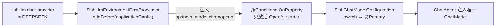

# 模块 2：模型路由体系（面试复盘版）

> - **配套详细版**：`../模块2-模型路由体系.md`
> - **本版定位**：现场复盘口述体，保留少量关键图与代码。
> - **内容范围**：三路对话路由 + 对话/嵌入独立 + 三模型分工（均对齐当前代码）。

---

## 一句话定位 & 本模块亮点

通过 **EnvironmentPostProcessor 早期注入** + **`@ConditionalOnProperty` 条件装配** + **`@Primary` 收敛**，实现 DashScope / Ollama / DeepSeek 三路对话路由与嵌入路由完全解耦——**切换只需一个环境变量**；记忆/辅助链路走独立的低温 `memoryChatModel`。

- **一个变量切三路**：`FISH_LLM_CHAT_PROVIDER=DEEPSEEK` → PostProcessor 自动推导 `spring.ai.model.chat=openai` → 激活 OpenAI starter，业务层零感知映射关系。
- **属性源优先级陷阱**：PostProcessor 用 `addBefore(applicationConfig)` 注入——**覆盖 YAML 但低于系统环境变量**，兼顾"默认自动推导"和"运维手动覆盖"。
- **fail-fast**：环境变量与业务枚举矛盾时（如 `SPRING_AI_MODEL_CHAT=dashscope` 但 `chat-provider=DEEPSEEK`），`requireBean` 找不到对应 Bean 直接启动失败，**不在生产静默连错模型**。
- **对话/嵌入独立路由**：对话走 DeepSeek（省钱、工具调用稳），嵌入/精排走 DashScope（`text-embedding-v2` 向量 + `qwen3-rerank` 精排，质量高），两个变量自由组合。
- **三模型分工**：① 主对话（高温、开工具）；② `memoryChatModel`（低温 0.1、禁工具，供压缩/抽取/查询重写/工具结果摘要复用）；③ DashScope 系（嵌入 + 精排）。
- **DeepSeek 零代码接入**：DeepSeek 完整兼容 OpenAI `/v1/chat/completions`，复用 `spring-ai-starter-model-openai`，只改 `base-url`，工具调用/流式开箱即用。

---

## 一、三路对话路由：一个环境变量切换

### 背景
项目要支持 DashScope（阿里云，质量高）、Ollama（本地，零成本调试）、DeepSeek（便宜、工具调用稳）三种后端。Spring AI 的自动配置靠 `@ConditionalOnProperty("spring.ai.model.chat")` 决定激活哪个 starter——但用户只想配一个**业务枚举** `fish.llm.chat-provider=DEEPSEEK`，不想同时维护 `spring.ai.model.chat=openai` 这种框架内部属性（两处不同步就会"业务层以为用 DeepSeek、框架层却激活了 DashScope"）。

### 问题与方案

用 `FishLlmEnvironmentPostProcessor`（`Ordered.LOWEST_PRECEDENCE`，在所有 ConfigData 加载后执行）在 Spring 环境就绪早期，把业务枚举自动推导为框架属性：



- **条件装配**：只有 `spring.ai.model.chat=openai` 匹配的 OpenAI 自动配置激活，DashScope/Ollama 的 Bean 根本不注册——容器里不会同时存在三个 `ChatModel`。
- **`@Primary` 收敛**：`fishPrimaryChatModel` 用 `ObjectProvider` 三选一 + `@Primary`，万一有多个也能按类型注入唯一一个。
- **fail-fast**：找不到对应 Bean 时 `requireBean` 抛 `IllegalStateException`，错误消息直接指出矛盾（"chat-provider=DEEPSEEK 需要 OpenAiChatModel，但 spring.ai.model.chat=dashscope"）。

```java
@Bean @Primary
public ChatModel fishPrimaryChatModel(
        ObjectProvider<OllamaChatModel> ollama, ObjectProvider<DashScopeChatModel> dashscope,
        ObjectProvider<OpenAiChatModel> openai) {
    return switch (fishLlmProperties.getChatProvider()) {
        case OLLAMA    -> requireBean(ollama.getIfAvailable(), "OLLAMA", ...);
        case DASHSCOPE -> requireBean(dashscope.getIfAvailable(), "DASHSCOPE", ...);
        case DEEPSEEK  -> requireBean(openai.getIfAvailable(), "DEEPSEEK", ...);
    };
}
```

属性源优先级链（高 → 低）：
```
-Dspring.ai.model.chat        ← JVM 参数（最高）
SPRING_AI_MODEL_CHAT          ← 系统环境变量
fishLlmSpringAiModelChat      ← PostProcessor 注入（覆盖 YAML）
applicationConfig:[yml]       ← application.yml
```

### 追问

**1. 用了 @Primary，为什么还要 EnvironmentPostProcessor 写 `spring.ai.model.chat`？**
解决不同问题。PostProcessor 负责"让哪个 starter 的自动配置激活"——`@ConditionalOnProperty` 检查 `spring.ai.model.chat`，值为 `openai` 才注册 `OpenAiChatModel`。`@Primary` 负责"万一多个 ChatModel 同时存在选哪个"。两者配合：PostProcessor 让不需要的 Bean 不注册，@Primary 兜底。

**2. `SPRING_AI_MODEL_CHAT` 误设为 dashscope 但 `chat-provider=DEEPSEEK` 会怎样？**
应用**启动失败**。进入 `case DEEPSEEK` 但 `OpenAiChatModel` 未注册（OpenAI 自动配置因 `spring.ai.model.chat` 不是 `openai` 不激活），`requireBean` 抛异常。这是 fail-fast——不在生产静默连错模型。

**3. 多实例部署时模型路由有状态问题吗？**
完全没有。`FishChatModelConfiguration` 是启动期 `@ConditionalOnProperty` 决定激活哪个 Bean，容器级单例，运行时不存在切换/状态。所有实例读同一环境变量。要动态切模型（不重启）需配置中心 + 刷新机制，当前不需要。

---

## 二、对话/嵌入独立路由 + 三模型分工

### 背景
不同任务对模型要求不同：对话要创意性（高温）+ 工具调用；压缩/抽取/查询重写/摘要要确定性（低温、禁工具）；嵌入要向量质量、精排要 rerank 能力。如果全用一个模型，要么对话死板要么抽取飘。

### 问题与方案
**对话和嵌入独立路由**：`fish.llm.chat-provider` 管对话，`fish.llm.embedding.provider` 管嵌入。可以对话走 DeepSeek（省钱、工具调用稳）+ 嵌入走 DashScope（`text-embedding-v2` 1536 维、质量高）。嵌入枚举复用对话枚举，但 `FishEmbeddingModelConfiguration` 的 switch 对 `DEEPSEEK` 直接抛异常（DeepSeek 当前不支持嵌入），避免误配。

**`memoryChatModel` 独立辅助模型**：与主对话复用同一 `OpenAiApi`（HTTP 连接池/Key 复用），但 `OpenAiChatOptions` 用低温（0.1）+ 禁工具。通过 `@Qualifier` 注入所有"辅助链路"——记忆压缩、长期抽取、查询重写、**工具结果摘要**。降级链路：`fish.memory.chat.enabled=false` → 直接返回主模型（零额外 Bean）；DEEPSEEK 下 `OpenAiApi` 不可用 → 返回主模型。

**精排**：DashScope `qwen3-rerank` 走独立 `rerank` 熔断器（见模块 7）。

### 追问

**1. `memoryChatModel` 为什么不直接复用主对话模型？**
对话模型高温保创意、开 tool calling；压缩/抽取需要低温保准确、禁工具避免抽取过程中乱调工具。独立模型用同 API 客户端但不同 options，互不污染。

**2. 嵌入为什么用 DashScope 不用 DeepSeek？**
DeepSeek 当前不提供嵌入 API（配置时直接 fail-fast 抛异常）。DashScope `text-embedding-v2` 向量质量高、1536 维，和 ES 向量索引配套。对话省钱 + 嵌入保质量，两个变量自由组合正是独立路由的价值。

---

## 三、DeepSeek 零代码接入：复用 OpenAI 适配器

### 背景
要接 DeepSeek。可以写独立 starter、或手写 `DeepSeekChatModel` 适配器，但维护成本高。

### 问题与方案
DeepSeek API **完整兼容 OpenAI `/v1/chat/completions`**（payload/response 格式一致），所以直接复用 `spring-ai-starter-model-openai`：只把 `spring.ai.openai.base-url` 从 `https://api.openai.com` 改成 `https://api.deepseek.com`，整个自动配置栈（`OpenAiApi` RestClient + `OpenAiChatModel` + 流式 + tool calling 转换）开箱即用，**零代码**。

非 Chat 模态的 OpenAI 自动配置（Speech/Transcription/Embedding/Image/Moderation）在 `application.yml` 用 `spring.autoconfigure.exclude` 显式排除——它们不检查 `spring.ai.model.chat`，无 key 也会尝试装配导致启动失败。

已知坑：DeepSeek 只用 `deepseek-chat`（reasoner 系列工具调用不稳）；`"strict": true` 不被支持需关注。

### 追问

**1. 为什么不写独立 DeepSeek starter 或自定义适配器？**
DeepSeek 兼容 OpenAI 协议，复用成熟 starter 零成本拿到流式 + tool calling；独立 starter 要维护完整自动配置 + 跟踪 API 更新，自定义适配器要从零实现流式解析/工具转换/异常重试，性价比都太低。风险是 DeepSeek 兼容性变化时要适配，但当前稳定。

---

## 最难/最有挑战：EnvironmentPostProcessor 的属性源优先级陷阱

### 问题
要让 `fish.llm.chat-provider`（业务枚举）自动推导为 `spring.ai.model.chat`（框架属性），且必须在所有自动配置检查之前生效。

### 挑战
难的不是三路 switch，而是**属性源插入位置**：注入的属性必须覆盖 YAML 但不能覆盖环境变量，且必须在自动配置之前生效。

### 解决方案
- `Ordered.LOWEST_PRECEDENCE` 确保所有 ConfigData 加载后执行；
- `sources.addBefore(applicationConfig, routing)`——覆盖 YAML 但低于 `systemEnvironment`；
- 搞反了要么 YAML 旧值覆盖新值（启动连错模型），要么环境变量失效（运维无法热覆盖）；
- 配 fail-fast：环境变量与枚举矛盾直接启动失败。

### 面试回答要点
> "模型路由最难的不是三路 switch，而是 EnvironmentPostProcessor 的属性源插入位置。必须用 `addBefore(applicationConfig)`——覆盖 YAML 但允许环境变量最终覆盖。搞反了要么连错模型，要么运维覆盖失效。再加 fail-fast：矛盾就启动失败，不静默连错。"

---

## 关联代码速查

| 职责 | 路径 |
|------|------|
| 对话提供方枚举 | `llm/config/FishLlmChatProvider.java` |
| 环境后处理器（属性源注入） | `llm/config/FishLlmEnvironmentPostProcessor.java` |
| 对话 Bean 收敛（@Primary + memoryChatModel） | `llm/config/FishChatModelConfiguration.java` |
| 嵌入 Bean 选择 | `llm/config/FishEmbeddingModelConfiguration.java` |
| 对话/嵌入属性 | `llm/config/FishLlmProperties.java`、`FishLlmEmbeddingProperties.java` |
| 启动一致性校验 | `llm/config/FishLlmConfigurationConsistencyLogger.java` |
| 记忆链路模型配置 | `memory/config/MemoryProperties.java`（MemoryChatProperties） |
| 配置 | `application.yml`（`fish.llm.*` / `fish.memory.chat.*` / `fish.rag.rerank.*`） |
