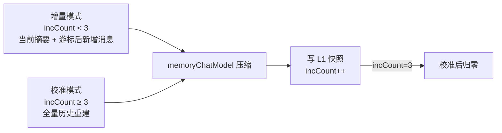
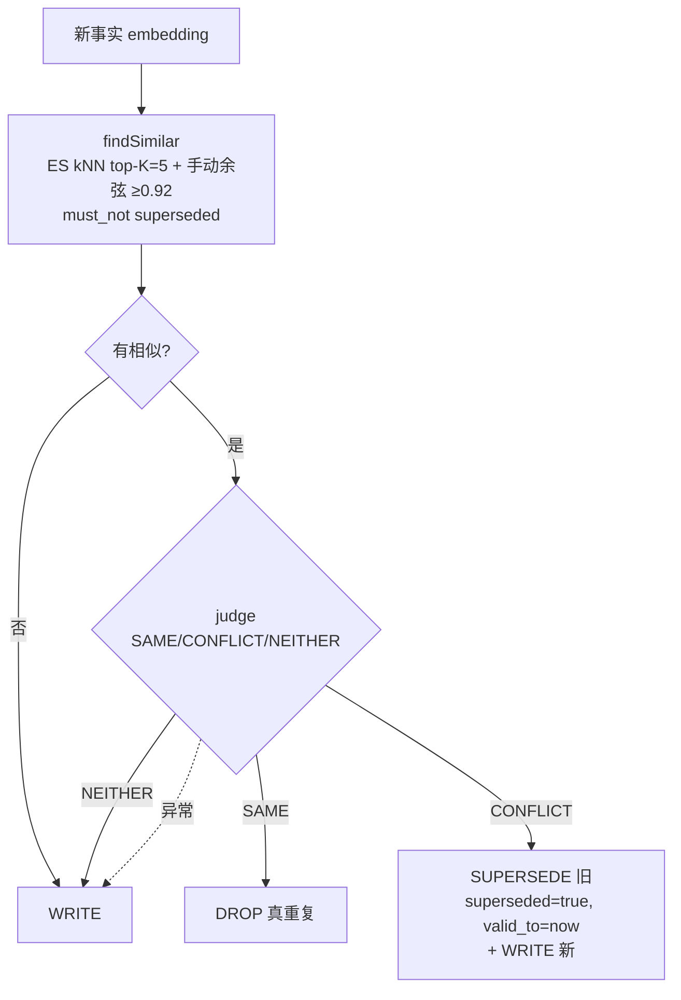
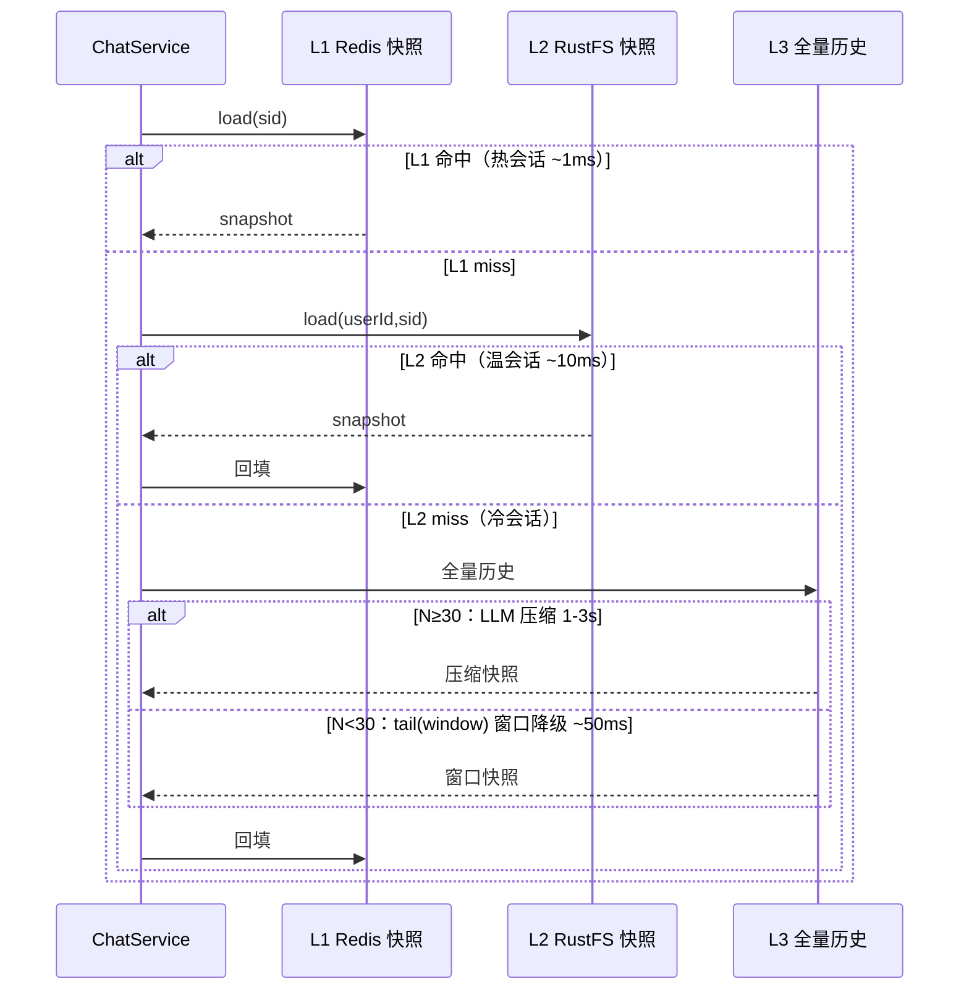

# 模块 3：分层记忆（面试复盘版）

> - **配套详细版**：`../模块3-分层记忆.md`
> - **本版定位**：现场复盘口述体，保留少量关键图与代码。
> - **内容范围**：三级读穿写穿 + 结构化增量压缩 + 长期记忆冲突治理（supersede）（均对齐当前代码）。

---

## 一句话定位 & 本模块亮点

**短期（Redis 滑动窗口 + 结构化摘要）→ 长期（ES 向量事实，supersede 冲突治理）→ 全量历史（对象存储落盘）** 三层分层记忆，跨会话记住用户。

- **三层短期记忆 + 三级读穿写穿**：L1 Redis 热窗口（快照，30 天 TTL）→ L2 RustFS 快照 → L3 RustFS 全量历史（.jsonl），miss 逐级回源、命中回填，冷会话窗口降级。
- **结构化增量压缩**：摘要从纯文本升级为结构化（话题/实体/意图/信号）+ 关键原文片段；**增量压缩**（只喂游标后新增消息）省 token，**双游标**（数量优先/时间兼容）精确切分，每 3 次增量校准一次防漂移。
- **长期记忆冲突治理（旗舰）**：相似事实 `findSimilar` + `MemoryConflictJudge`（SAME/CONFLICT/NEITHER）→ WRITE/DROP/**SUPERSEDE（软失效不删留审计）**，解决"北京→上海"式 append-only 死局；recall 过滤已失效，注入带 `[记忆·X前]` 时间标签让模型自推理过期。
- **辅助链路独立模型**：压缩/抽取/查询重写/工具结果摘要共用 `memoryChatModel`（低温 0.1、禁工具），与主对话（高温、开工具）分离。
- **抽取与压缩链路隔离**：两套 prompt 互不写同一索引，避免摘要链路和抽取链路重复入库污染向量索引。

---

## 一、短期记忆：滑动窗口 + 结构化增量压缩

### 背景
每次发给大模型的只是当前上下文窗口，所以要让它记住当前对话之前的信息。直接截断丢上下文、记状态节点丢背景信息，都不好。

### 问题与方案

**滑动窗口 + 主动摘要**：大模型回复后，异步检测是否需要压缩——没必要就不压，有必要就用 `memoryChatModel`（提示词严格约束只做摘要、禁工具）压缩，替换旧上下文。用户几乎无感知。

**结构化摘要**：从 2 字段纯文本升级为 6 字段快照——`structuredSummary`（话题/实体/意图/信号）+ `recentMessages`（最近窗口）+ `keyExcerpts`（关键原文片段）+ 双游标。

**增量 + 校准压缩（省 token + 防漂移）**：

- **双游标精确切分**：`lastCompressedMessageCount`（数量，优先，按下标 `subList` 精确切）+ `lastCompressedAt`（时间，兼容旧快照）——避免重复消费（token 浪费）或漏消费（信息丢失）。
- **校准机制**：每 3 次增量后全量重建一次，纠正累积漂移。

### 追问

**1. 为什么压缩和录入用两个不同 ChatModel Bean（`memoryChatModel`）而不是复用对话模型？**
对话模型要高温保创意、开 tool calling；压缩/抽取要低温（0.1）保准确、禁工具（避免压缩时乱调工具）。独立 Bean 用同 API 客户端但不同 options，互不污染。

**2. 增量压缩怎么精确切分"新增消息"不重复不漏？**
用消息下标 `lastCompressedMessageCount` 做主游标——全量历史按插入顺序排列，`full.subList(count, size)` 精确切，不受时间戳精度影响；旧快照无数量字段才回退时间戳。每 3 次增量校准一次防漂移。

**3. 冷会话同步压缩会阻塞用户吗？**
会，但有缓解：①只在 L1/L2 都 miss（冷会话）触发，概率低；②`compressedOnColdPath` 标记首轮已压，跳过当轮异步压缩；③压缩失败（LLM 超时）降级为窗口截断 `tail(windowSize)`，保证不中断。

---

## 二、长期记忆冲突治理（本模块旗舰）

### 背景
早期长期事实是 **append-only + 余弦查重**：每条新事实 cosine≥0.92 命中即丢弃。问题是**信息会冲突、会过期**——30 天前"在北京上班"，现在"调到上海了"，"调到上海了"与"在北京上班"语义过近被当重复丢弃，旧"北京"永久留存、recall 仍返旧值。字节 Q6 就挂在这。

### 问题与方案

写侧从"命中即丢弃"升级为**三态**（`MemoryConflictJudge` 用 memoryChatModel 判 SAME/CONFLICT/NEITHER）：

- **SUPERSEDE 软失效**：旧事实标 `superseded=true + valid_to=now`，**不物理删除**——留审计（可追溯"曾在北京"）、可逆（judge 误判能恢复）、零迁移（recall 加 `must_not` 过滤，旧数据无字段也兼容）。
- **recall 过滤**：长期事实召回双腿加 `must_not superseded=true`，模型只见 active 事实。
- **时间标签**（`MemoryAgeLabel`）：active 事实注入带 `[记忆·X前]`，superseded 已过滤，模型只见 active + 年龄，**自行推理渐进过期**——MVP 因此不做新近度衰减打分。
- **judge 失败降级 NEITHER**（宁可短暂双存也不误删新事实，superseded 可逆）。

走查：北京→上海 → judge=CONFLICT → 旧失效 + 写新 → recall 只返"上海"。✅

### 追问

**1. append-only 长期记忆的致命伤？怎么解？（字节 Q6）**
只会加不会废——矛盾事实共存、过期事实永留。北京→上海被 cosine 查重当重复丢弃。解法：写侧 judge 判 CONFLICT → supersede 旧（软失效）+ 写新 → recall 过滤失效 → 只返"上海"。本质是 Graphiti 时序知识图谱 `valid_to` 关闭的轻量实现。

**2. 为什么不物理删除被取代的事实？**
软失效（`superseded=true`）而非 delete：①留审计可追溯；②可逆，judge 误判能恢复；③零迁移成本，recall 加 `must_not` 即可，旧数据无字段兼容（缺失=未失效）。

**3. judge 失败怎么办？**
降级 NEITHER（都写）——宁可短暂双存也不误删新事实；superseded 可逆，后续轮次仍能纠正。

**4. 为什么手动 cosine 不用 ES 分数？**
ES kNN 是 ANN 近似，分数经 `(1+cos)/2` 归一化，与原始余弦阈值不一致；手动从文档提取 embedding 做精确点积，阈值判断准确。

**5. 为什么不做新近度衰减打分？**
把写入时间以相对标签注入，让模型自己推理渐进过期——比硬编码衰减更灵活、零打分复杂度。superseded 已过滤，模型只见 active 事实。

---

## 三、三级读穿写穿：L1 → L2 → L3

### 背景
短期记忆在 Redis 有 TTL（30 天），到期后冷会话要从全量历史重新加载——全量历史在对象存储，读取慢（10-100ms），且每次冷会话都触发 LLM 压缩更慢（1-3s）。

### 问题与方案
**三级读穿写穿**：L1（Redis 热窗口快照）→ L2（RustFS 快照，压缩后的摘要+窗口）→ L3（RustFS 全量历史 .jsonl）。

- **L2 快照层**解决温会话：几天到几周未活跃，Redis TTL 过期，从 L2 快照恢复（摘要+窗口都在）~10ms，比 L3 全量读+压缩快两个数量级。
- **写穿**：每轮结束后 `appendTurnToL1`（同步追加 L1）+ `refreshSnapshotFromL1`（异步刷 L2，失败仅记日志）。
- **冷会话窗口降级**：L1/L2 都 miss 时，N<30 直接 `tail(windowSize)` 截窗口（不强行压缩），N≥30 才同步压缩。
- **完整对话落盘**：每轮写 RustFS `.jsonl`，`ReentrantLock` 按 sessionId 加锁保证并发安全。

### 追问

**1. L1 和 L2 一致性怎么保证？**
L2 异步刷新，可能比 L1 旧一轮——但 L2 是"冷会话快速恢复"不是"实时镜像"，旧一轮也比 L3 全量重加载快得多，且下轮自动追平。

**2. 完整对话存在 RustFS，RustFS 挂了怎么办？**
`RustFsChatMemoryStore` 写操作抛异常，但 `ChatService.persist()` catch 了异常不阻塞 SSE done 事件返回。代价是这轮丢持久化，但主流程（对话本身）不受影响。

**3. L2 存对象存储不存 Redis，性能不差吗？**
L2 是冷数据，只在 L1 miss 访问。热会话永远走 L1 Redis（~1ms）；L2 典型场景是"隔几天再来"，~10ms 比 L3 全量+压缩（1-3s）快两个数量级，存储成本比 Redis 便宜 10-100 倍。

---

## 最难/最有挑战：增量压缩游标的精确切分

### 问题
全量压缩——每次把 30+ 条完整历史喂 LLM，长会话 token 随历史线性增长（O(N)），且 LLM 反复改写导致摘要漂移。后来改增量只喂"新增消息"，难点是**如何精确切分不重复不漏**。

### 三种失败模式
重复消费（token 浪费）/ 漏消费（信息丢失）/ 同毫秒消息（时间戳游标边界不确定）。

### 解决方案：双游标 + 渐进迁移
- `lastCompressedMessageCount`（数量，优先）：按下标 `subList` 精确切，不受时间戳精度影响；
- `lastCompressedAt`（时间，兼容旧快照）：无数量字段才回退；
- 每 3 次增量校准一次防漂移。

### 面试回答要点
> "增量压缩最难的不是 prompt，而是游标精确维护。用消息下标做游标比时间戳精确——全量历史按插入顺序，下标切分不漏不重。双游标是为向后兼容旧格式。校准机制是安全网：每 3 次增量全量重建一次，防累积漂移。"

---

## 关联代码速查

| 职责 | 路径 |
|------|------|
| 短期三级协调器 | `memory/shortterm/ShortTermMemoryService.java` |
| L1 Redis 快照存储 | `memory/shortterm/RedisShortTermMemoryStore.java` |
| L2 RustFS 快照 / L3 全量历史 | `memory/shortterm/RustFsShortTermSnapshotStore.java`、`RustFsChatMemoryStore.java` |
| 短期快照 DTO（结构化 + 双游标） | `memory/shortterm/ShortTermMemorySnapshot.java` |
| 结构化增量/校准压缩 | `memory/MemoryCompressionService.java`、`memory/compress/MemoryPromptBuilder.java` |
| 长期事实抽取 | `memory/LongTermMemoryIngestionService.java` |
| **长期事实 ES 存储（三态写入）** | `memory/longterm/ElasticsearchLongTermMemoryStore.java`（decideMemoryWrite / supersedeConflicts） |
| **相似事实查找** | `memory/longterm/LongTermMemoryDeduplicator.java`（findSimilar） |
| **冲突判定** | `memory/longterm/MemoryConflictJudge.java`、`SimilarFact.java` |
| **Provenance + 时间标签** | `rag/document/UserMemoryDocument.java`、`rag/pipeline/recall/MemoryAgeLabel.java` |
| 记忆配置 | `memory/config/MemoryProperties.java`（Dedup / Conflict / MemoryChatProperties） |
