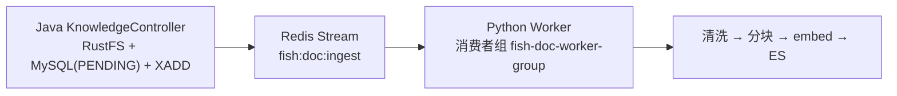
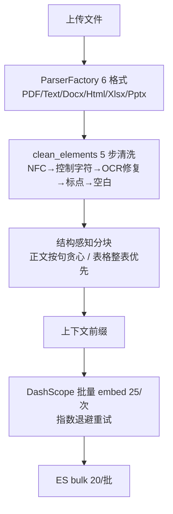

# 模块 5：知识库闭环与可靠性（面试复盘版）

> - **配套详细版**：`../模块5-知识库闭环与可靠性.md`
> - **本版定位**：现场复盘口述体，保留少量关键图与代码。
> - **内容范围**：Java 投递 + Python Worker 异步解析 + 五重可靠性 + 索引期上下文前缀（contextual indexing）（均对齐当前代码）。

---

## 一句话定位 & 本模块亮点

**Java 只投递、Python Worker 异步消费**，通过 Redis Stream 消费者组解耦，跑通"6 格式解析 → OCR 清洗 → 结构感知分块 → embedding → ES"全链路；五重保障杜绝毒消息死循环。

- **Java/Python 零侵入解耦**：只共享基础设施（Redis/MySQL/RustFS/ES），各启动各的，一份 .env 两端共用。
- **6 格式解析 + OCR**：PyMuPDF 渲染 300DPI + Tesseract（chi_sim+eng），工厂模式 + 可选依赖（没装 openpyxl 不影响其他格式）。
- **结构感知分块**：正文按句贪心打包、表格整表优先 + 行组切分重复表头，解决"表头被切断"。
- **索引期上下文前缀（contextual retrieval）**：分块后给每块前缀文档上下文（content/context_prefix/contextualized_content 三字段），解决孤立小块丢上下文；注入 authority（PUBLIC=1.0/PRIVATE=0.7）。
- **五重可靠性**：XAUTOCLAIM 崩溃恢复（120s）+ Worker 心跳（30s 防"假死"误判）+ Java 孤儿补偿（60s）+ Python 幂等清理 + MySQL CAS 防并发。

---

## 一、Java 投递 + Python Worker 解耦

### 背景
一开始想在 Java 里用 Tika 解析文档，但 Java 重、解析占大量堆内存对 JVM 不友好。需要轻量、不占 JVM 资源、且 Java/Python 能通信的方案。

### 问题与方案
用 **Python 异步解析**，Java/Python 间用 **Redis Stream 消息队列**通信（项目已依赖 Redis，Stream 支持消费者组 + 持久化 + ACK，无需额外引入 Kafka/RabbitMQ）。



**零侵入**：只启动 Java 能完成上传（落盘 RustFS + 写 MySQL + 发 Stream）；只启动 Python，消费者会一直读消息处理。双方完全不感知对方，只共享底层组件。

### 追问

**1. 为什么选 Redis Stream 不选 Kafka/RabbitMQ？**
项目已依赖 Redis，不用额外引入中间件增加维护成本；Stream 支持消费者组 + 持久化 + ACK 满足当前规模。缺点是不如 Kafka 适合海量消息，但知识库上传量级不需要。

**2. 为什么 Java 不直接解析要绕一圈给 Python？**
Java 生态 PDFBox 对中文支持差、CJK 内嵌子集字体常输出乱码；OCR 库不成熟部署麻烦。Python 的 PyMuPDF + pytesseract + python-docx 是文档解析事实标准。Redis Stream 解耦后双方只共享基础设施。

---

## 二、解析流水线：6 格式 + OCR + 结构感知分块

### 背景
用户上传文档来源多样（DOCX 规范、MD 文档、HTML 页面、XLSX 报表、PDF 扫描件），且 PDF 文本解析常出乱码。

### 问题与方案



- **PDF 混合策略**：经三代库迭代（pypdf→pdfminer→PyMuPDF），先提取文本层、质量检测不通过（CID 残留/乱码）再渲染 300DPI PNG 走 Tesseract OCR。
- **OCR 清洗只做确定性安全修复**：`fi→fi`、`(cid:数字)→空`、`。。。→。`——必定的修复；不做猜测性拼写纠正避免引入新错误。
- **结构感知分块**：表格整表优先，超限时按行组切分 + **每组重复表头**——保证任何 chunk 的表格行都有表头可读。

### 追问

**1. 表格为什么不能按 token 滑窗切？**
固定 token 滑窗可能在行中间截断、把表头切在 chunk A 数据行切在 chunk B，检索到 B 时无法理解列含义。结构感知先识别表格整表保留，超限按行组切且每组重复表头。

**2. 新增一种格式要改哪些地方？**
两步：新建 `xxx_parser.py` 继承 BaseParser 实现 `parse()→list[RawElement]`；在 `factory.py` 的 `_registry` 加 MIME→Parser 映射。全链路基于 RawElement 接口，不感知具体格式。

**3. XLSX 解析器没装 openpyxl 会怎样？**
`_load_optional_parser` 在 ImportError 时返回 None，不注册 MIME 映射。用户传 XLSX 时工厂抛 UnsupportedFileTypeError，processor 标记 FAILED。不会让 Worker 崩溃或影响其他格式。

---

## 三、索引期上下文前缀（contextual retrieval，攻 Q7）

### 背景
头条 Q7：大文档拆片后小块召回精度高但**丢上下文**——一个讲"部署步骤"的 chunk 脱离文档标题后语义模糊，召回时模型不知道它属于哪个文档的哪部分。

### 问题与方案
分块后、embed 前给每块**前缀文档上下文**（Anthropic Contextual Retrieval 思路）：

```python
for chunk in chunks:
    prefix = generator(document_text, chunk) or _fallback_prefix(...)  # 标题+页+序号
    chunk.context_prefix = prefix
    chunk.contextualized_text = f"{prefix}\n\n{chunk.text}"   # BM25 + embedding 走它
```

- **三字段写 ES**：`content`（原文，渲染/审计用）/ `context_prefix` / `contextualized_content`（前缀+content，**检索都走它**）。Java BM25 改 `contextualized_content + content` 双字段 should 查询，**兼容旧索引**。
- **可插拔 generator**：当前是确定性启发式前缀（标题+页+序号）不接在线 LLM，避免摄取链路引入外部依赖；生产 generator = DeepSeek + prompt 缓存（文档作稳定前缀吃满自动 context caching 省 ~90%），接口预留后续注入。
- **authority 注入**：`PUBLIC=1.0` / `PRIVATE=0.7`，写 `authority` 字段，供 Java `ProvenanceBooster` 加权（模块 7）。
- **诚实边界**：embedding 改用 contextualized 文本，**旧文档需全量重索引才受益**。

### 追问

**1. 为什么不在检索时拼上下文，而在索引期？**
索引期前缀后 embedding 就编码了文档上下文，孤立块也能被语义召回；检索时拼只影响展示不影响向量。代价是要重索引，但一次性。

**2. contextualized_content 和 content 分开存干嘛？**
content 保持原文供渲染展示（用户看到的引用是干净原文）；contextualized_content 供检索（BM25+embedding）。分开避免前缀污染展示。

---

## 四、五重可靠性保障（本模块旗舰）

### 背景
异步解析最怕三件事：Worker 临时崩溃消息丢、Worker 半截崩溃写一半、Worker 永久不可用任务卡死、毒消息反复消费死循环。

### 问题与方案

| 层 | 机制 | 间隔 | 覆盖场景 |
|----|------|------|---------|
| 1 | **XAUTOCLAIM** | 120s idle | Worker 临时崩溃，消息留 PEL 被其他 consumer 认领重处理 |
| 2 | **Python `delete_by_doc_id` 幂等** | 每次重处理 | Worker 半截崩溃留了旧切片，重处理前先清再写 |
| 3 | **Worker 心跳** | 30s 刷 `updated_at` | 防长任务（OCR 5-8 分钟）被孤儿补偿误判"假死" |
| 4 | **MySQL CAS** | SUCCESS 写入时 | `UPDATE status='SUCCESS' WHERE task_id=? AND status='PROCESSING'`，补偿已标 FAILED 时 CAS 不匹配不覆盖 |
| 5 | **Java 孤儿补偿** | 60s 扫描 | Worker 永久不可用，扫 `PROCESSING AND updated_at < now-10min` 清 ES + 标 FAILED |

**毒消息**：`finally` 块中无论成功/失败/非法消息**都 XACK**——避免毒消息反复消费死循环。

### 追问

**1. Worker 处理中崩溃，消息会丢吗？**
三层：①进程崩溃 finally 执行不到，消息留 PEL，120s 后 XAUTOCLAIM 认领重处理；②重处理前 delete_by_doc_id 清旧切片再 bulk，幂等；③Worker 永久不恢复，Java 孤儿补偿每 60s 扫超时 PROCESSING 清理标 FAILED。

**2. 假死误判是什么？怎么解？（本模块最难）**
早期 Worker 开始只在 PROCESSING 时写一次 updated_at，OCR 8 分钟时补偿第 10 分钟认为 Worker 已死误清理。解法：Worker 每 30s 心跳刷新 updated_at，补偿只杀"10 分钟没报平安的"；加 CAS 保证补偿和 Worker 不同时操作同一行。

**3. 毒消息怎么处理？**
finally 里无论成功失败非法都 XACK，不让毒消息反复消费死循环。失败的任务标 FAILED 让管理员看到修复重传，而不是卡住整个队列。

---

## 最难/最有挑战：Worker 心跳 vs 孤儿补偿的"假死"误判

### 问题
大 PDF OCR 耗时 5-8 分钟，Java 孤儿补偿每分钟扫 `PROCESSING AND updated_at < now-10min`。

### 挑战
早期 Worker 只在 PROCESSING 时写一次 updated_at，OCR 8 分钟时补偿第 10 分钟误判 Worker 已死、清 ES + 标 FAILED——但 Worker 还活着！

### 解决方案
心跳机制：processor 每 30s `UPDATE updated_at=NOW() WHERE task_id AND status=PROCESSING`；补偿只杀"10 分钟没报平安的"；CAS 更新保证补偿先标 FAILED 时 Worker 的 SUCCESS CAS 不匹配静默退出。

### 面试回答要点
> "假死误判是分布式系统经典的'心跳 vs 超时'问题。Worker 定期报平安，补偿只杀没报平安的。但实现有细节——CAS 更新保证补偿和 Worker 不并发操作同一行：补偿先标 FAILED，Worker 的 SUCCESS CAS 不匹配就静默退出，不覆盖补偿结果。"

---

## 关联代码速查

| 职责 | 路径 |
|------|------|
| Java 上传编排 / 管理 / 孤儿补偿 | `rag/service/KnowledgeIngestionService.java`、`KnowledgeManageService.java`、`OrphanTaskCompensationService.java` |
| Python 消费入口 / 处理管线 | `python/fish_worker/consumer.py`、`processor.py` |
| 解析器工厂 + 6 格式解析器 | `python/fish_worker/parser/factory.py`、`pdf.py` 等 |
| 文本清洗 / 结构感知分块 | `python/fish_worker/parser/text_cleaner.py`、`chunker/structured_chunker.py` |
| **索引期上下文前缀** | `python/fish_worker/chunker/contextual_indexing.py` |
| authority 配置 | `python/fish_worker/config.py`（`fish_rag_authority_*`） |
| Embedding（指数退避）/ ES 幂等写入 | `python/fish_worker/chunker/embedder.py`、`storage/elasticsearch.py` |
| MySQL 心跳 + CAS | `python/fish_worker/db/mysql.py` |
