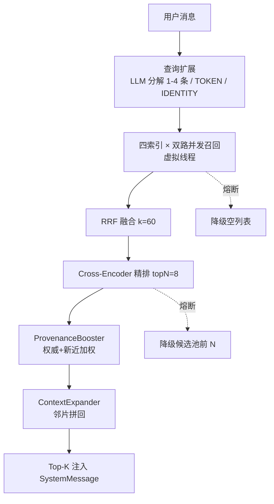

# 模块 7：RAG 检索增强管线（面试复盘版）

> - **配套详细版**：`../模块7-RAG检索增强管线.md`
> - **本版定位**：现场复盘口述体，保留少量关键图与代码。
> - **内容范围**：四索引双路并发召回 + RRF 融合 + Cross-Encoder 精排 + 权威/新近加权 + 邻片扩展 + 冲突感知 + 熔断降级（均对齐当前代码）。

---

## 一句话定位 & 本模块亮点

查询分解 → 四索引双路并发召回 → RRF 融合 → Cross-Encoder 精排 → **权威/新近加权 + 邻片扩展** → 注入 SystemMessage，全链路熔断降级。

- **四索引双路并发**：用户记忆/用户文档/知识卡片/公共知识 × 文本(BM25)+向量(kNN)，虚拟线程并发，UserContextHolder 快照回放防 ThreadLocal 丢失。
- **RRF 分数融合**：只看排名不看原始分（`1/(k+rank+1)`，k=60），解决 BM25 与 cosine 量纲不可比。
- **Cross-Encoder 精排**：qwen3-rerank 在 ~50 候选上做交互式编码，弥补双塔精度不足。
- **ProvenanceBooster 权威+新近加权**（攻 Q8）：rerank 后 `score×(1+α·authority+β·recency)` 重排，官方=1.0 + 新近半衰期 180d，只调分不掩盖相关性。
- **ContextExpander 邻片扩展**（攻 Q7）：按 doc_id+chunk_index±1 取邻片拼回，补全 chunk 上下文。
- **冲突感知 prompt + 溯源标签**：每条带 `[来源:官方/用户/公开·yyyy-MM]` + 冲突处理指令。
- **熔断降级**：es-text/es-vector/rerank 三熔断器，持续性故障毫秒级快速失败，降级为单路/候选池前 N。
- **[v6.5] 知识图谱召回**：`CardGraphExpander` 沿 `card_relation` 取 1 跳邻居（按关系类型加权）以「图谱」来源注入——精心建模的关系类型真正进上下文，不再只是详情页装饰字段；配 per-fact trace（`injected_facts`）让召回可观测、可评估。

---

## 一、RAG 全链路

### 背景
为了让回答更有针对性、更严谨，用 RAG 检索增强：把相关信息注入背景提示词再让大模型答。

### 问题与方案




**为什么用 ES 不用纯向量**：ES 同时支持向量索引 + 文本倒排索引，天然支持**文本+向量双路召回**——纯向量对字差别大但语义近的信息可能漏召回，文本路（BM25）保底精确匹配。

**四索引分离**：① 用户记忆（`user_id+source_type=chat+must_not superseded`）；② 用户文档切片（`user_id`）；③ 知识卡片（`user_id+status=confirmed`，三字段 title/content/keywords）；④ 公共知识（无 filter）。不同来源/写入方/权限模型，DDL 独立演进。

### 追问

**1. 为什么用 RRF 不直接比原始分？**
BM25 分可到 20+、cosine 在 0-1，直接合并 BM25 完全压过向量路。RRF 只看排名（`1/(k+rank+1)`），不同路排名天然可比，k=60 是 BEIR 经验最优值。

**2. 为什么要 Cross-Encoder 精排？**
召回阶段 BM25/cosine 是双塔模型（query 和 doc 独立编码），捕捉不了 query-doc 交互特征。Cross-Encoder 把 query+doc 拼一起编码精度高很多但慢，所以只在 ~50 候选上做而非全量。

**3. 查询扩展为什么默认 LLM 分解？**
聊天常含多意图（"上次聊的 Docker 和 Redis 再讲一下"），LLM 能拆成独立检索句。超时 3s 降级为原句（首条始终是原句保底 BM25 精确匹配）。

**4. 六路并发 ES 扛得住吗？**
虚拟线程池有固定大小天然限流；每子查询 perSubquerySize 可控；任何一路失败 catch 返回空列表不影响其他路。

---

## 二、读侧冲突感知与邻片扩展（攻 Q7/Q8，本模块旗舰）

### 背景
字节 Q8（知识库两条资料冲突，AI 该按权威/新近选优并声明冲突而非乱合并）、Q7（大文档拆片后小块丢上下文）。v5 的 KB 检索四腿 + max-score 去重，**无权威/新近加权、无冲突检测、chunk flat**。

### 问题与方案

**① ProvenanceBooster（权威+新近加权，攻 Q8 系统层）**——rerank 后调分：

```java
boostedScore = score × (1 + α·authority + β·recencyNorm)   // recencyNorm = exp(-ageDays/halfLife)
// α=0.15, β=0.10, halfLife=180d —— 只在 tie 起作用，不掩盖相关性主信号
```

位于 rerank 之后、渲染之前，只调最终候选排序分、不改召回内容。`authority`：官方=1.0、用户知识=0.7（`SourceAuthority`，首轮审查发现此前无 1.0 来源、是死代码，后来通过 Python 入库写 1.0 打通）。

**② ContextExpander（邻片扩展，攻 Q7 检索期）**——rerank topN 后按 `doc_id+chunk_index±1` 取邻片、去重、按 chunk_index 顺序拼回命中块 content；**预算保护首条中心命中截断保留而非整条 drop**。检索排序仍只看中心命中，扩展只补全渲染上下文。配索引期 contextual indexing（模块 5，孤立块带文档上下文可召回）两端治理。

**③ 溯源标签 + 冲突感知 prompt（攻 Q8 模型层）**——每条带 `[来源:官方/用户/公开·yyyy-MM]`（`SourceAuthority.labelForKnowledge`：authority≥0.95→官方）+ 冲突处理指令（声明冲突/优先权威新近/引用双方/不确定反问/不编造）。**系统层 booster + 模型层 prompt 双保险**。

### 追问

**1. 知识库两条资料冲突怎么选？（字节 Q8）**
双保险。系统层 ProvenanceBooster 按权威(官方1.0)+新近(半衰期180d)加权重排，但只调分不掩盖相关性（α/β 小，只在 tie 起作用）；模型层每条带溯源标签 + 冲突感知 prompt，让模型声明冲突、优先权威新近、引用双方、不确定反问、不编造。

**2. booster 为什么放 rerank 之后不放之前？**
rerank 是语义相关性主信号，booster 是权威/新近的轻量偏置。放之后只调最终排序分、不改召回内容，避免权威度压制相关性——只在相关性相近(tie)时权威/新近起决定作用。

**3. chunk 缺上下文怎么办？（字节 Q7）**
两端：索引期 contextual indexing 给每块前缀文档上下文再 embedding（孤立块带文档语义可召回）；检索期 ContextExpander 按邻片坐标拼回渲染内容补全上下文。

**4. 邻片扩展超预算怎么办？**
保护首条中心命中——截断保留而非整条 drop（首轮审查修复的 bug：旧版超预算整条 drop 会让最重要的命中丢失），后续命中超预算才 break。

---

## 三、熔断降级

### 背景

RAG 依赖外部服务（ES 文本/向量召回、DashScope 精排），持续性故障会让每次检索都等超时。

### 问题与方案

三个 Resilience4j 熔断器：`es-text`（3s 慢/20s wait）、`es-vector`（5s/30s）、`rerank`（5s/30s）。故障率 50%/慢调用 80% 触发 OPEN → 毫秒级快速失败：

- ES 文本/向量路 OPEN → 返回空列表，RAG 降级为单路结果；
- rerank OPEN → 合成空响应，自动降级到融合池前 N 条。

**熔断器既是崩溃保护也是延迟保护**——ES 慢查询（>3s/5s 慢调用率 ≥80%）也触发熔断。

### 追问

**1. 熔断器 OPEN 时检索还能用吗？**
能，降级。文本路熔断就只剩向量路（反之亦然），rerank 熔断就用融合池 RRF 排序前 N。对话主链路不断，只是召回/精排质量下降。

**2. 为什么熔断而不是重试？**
持续性故障下重试只会每次等超时、加重负载。熔断快速失败 + 冷却后 HALF-OPEN 放探测自动恢复，比重试更适合外部服务依赖。

---

## 四、v6.5：知识图谱召回 + per-fact trace（STAR，审计驱动）

> 审计发现整套"知识图谱"精心建模了 `card_relation`(precedes/derived_from/contains/related) 却**从不参与召回**——召回只做文本+向量检索，图遍历为零，关系类型是详情页装饰字段。本节让图关系真正进上下文；完整见 [v6.5 文档](../../v6/v6.5-知识图谱链路治理-20260628.md)。

**① CardGraphExpander（图谱邻居注入）**
- **Situation**：`card_relation` 建表建索引、关联发现持续产出边，但召回从不沿边遍历——精心建模的关系类型在召回侧零消费。
- **Task**：让图关系真正进模型上下文（用户问"X 的前置概念"，库里若有 `A precedes X`，A 要能被带入）。
- **Action**：精排后 expand 阶段，对命中卡片沿 `card_relation` 取 1 跳邻居，按关系类型加权（precedes/derived_from/contains=0.9 ＞ related=0.6）、去重、截断上限 4，以来源「图谱」注入；**邻居绕过精排**（相关性来自图关系而非查询匹配，与 ContextExpander 加 chunk 邻块同理）。
- **Result**：关系类型从装饰字段变成召回侧真正消费的图遍历。

**② per-fact trace（可衡量性地基）**
- **Situation**：trace 只记聚合计数（`recall_total_hits`/`injected_fact_count`），回答不了"注入了哪些、来自哪、图谱邻居有没有用"。不可衡量 = 不可改进。
- **Task / Action**：`RagTraceDocument.injected_facts`（id/source_label/score）落每轮注入事实明细，图谱邻居 `source_label=图谱` 可观测。
- **Result**：召回可回归验证，是 v6.1 eval 在图谱子系统的地基。

### 追问

**1. "知识图谱"和普通向量库的区别（曾被问倒）？**
之前 `card_relation` 建模了 precedes 却从不参与召回——召回只做文本+向量，图遍历为零，关系是装饰字段。`CardGraphExpander` 让命中卡片沿边取 1 跳邻居注入，关系才真正进上下文。

**2. 图邻居为什么绕过精排？**
它的相关性来自与种子的图关系（precedes/related），而非与查询文本的匹配；和 `ContextExpander` 加 chunk 邻块同理——按结构邻接补上下文，不参与查询相关性排序。

---

## 最难/最有挑战：RRF 解决跨路分数不可比

### 问题

四路并发（BM25 文本 + cosine 向量）要合并排序选最相关。BM25 可到 20+、cosine 在 0-1，直接合并 BM25 完全压过向量路。

### 挑战

调线性权重 `α×BM25+β×cosine` 要按查询手动调参，且不同查询最优 α/β 不同。

### 解决方案

RRF 只看排名不看分：融合分 `Σ 1/(k+rank+1)`，k=60（BEIR 经验最优）。第 1 名 1/61、第 2 名 1/62，排名越靠前贡献越大，不受量纲影响。去重保留原始分最高代表。

### 面试回答要点

> "BM25 可到 20+、cosine 在 0-1，直接合并等于向量路废了。RRF 核心洞察是不看分数看排名——把所有路排名归一化为倒数，天然可比。k=60 是 BEIR 经验最优，越大头部差距越平滑。比调线性权重简单得多，不用按查询手动调参。"

---

## 关联代码速查


| 职责                        | 路径                                                                                                           |
| ------------------------- | ------------------------------------------------------------------------------------------------------------ |
| 召回编排（核心入口）                | `rag/pipeline/recall/RagRecall.java`                                                                         |
| 四索引 searcher              | `rag/pipeline/recall/{UserMemory,UserKnowledge,UserKnowledgeCard,PublicKnowledge}ElasticsearchSearcher.java` |
| **权威+新近加权**               | `rag/pipeline/recall/ProvenanceBooster.java`                                                                 |
| **邻片扩展**                  | `rag/pipeline/recall/ContextExpander.java`                                                                   |
| **来源权威度 + 标签**            | `rag/pipeline/recall/SourceAuthority.java`、`MemoryAgeLabel.java`                                             |
| 查询扩展 / HyDE               | `rag/pipeline/expand/RagQueryExpand.java`、`RagHydeService.java`                                              |
| RRF 融合 / Cross-Encoder 精排 | `rag/pipeline/fusion/RagScoreFusion.java`、`rerank/DashScopeRagReranker.java`                                 |
| 熔断器                       | `common/resilience/CircuitBreakerHelper.java`、`ResilienceConstants.java`                                     |
| 质量追踪                      | `rag/tracing/RagQualityLogger.java`、`RagTraceDocument.java`                                                  |
| RAG 配置                    | `rag/config/RagProperties.java`（Recall/Expand/Hyde/Fusion/Rerank/Tracing/Provenance/ExpandNeighbors）         |


