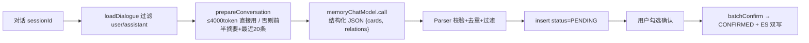

# 模块 8：知识卡片系统（面试复盘版）

> - **配套详细版**：`../模块8-知识卡片系统.md`（详细版准确，本模块近期未大改）
> - **本版定位**：现场复盘口述体，保留少量关键代码。
> - **内容范围**：AI 提取 + 人工确认 + 关联发现 + 双写 + Redis 缓存（均对齐当前代码）。

---

## 一句话定位 & 本模块亮点

LLM 对话提取 + 人工确认的知识沉淀闭环，把散碎对话组织成可检索/可复习/可图谱化浏览的结构化卡片，经四路 RAG 回注对话。

- **AI 提取 + 人工确认双保险**：LLM 初筛（理解语义提取值得沉淀的知识）+ 用户终审（确认/编辑/拒绝），保留人类判断力又降操作成本。
- **关键词实体归一化**：`trim().toLowerCase()` + `(user_id, normalized_name)` 唯一索引，"Docker/docker/DOCKER" 合并同一概念。
- **多信号加权关联发现**：关键词 Jaccard(0.35) + 同分组(0.20) + 关键词层次扩展(0.20) + embedding(0.25)，阈值 0.45，可解释原因。
- **MySQL→ES 双写**：confirmed 卡片同步写 `fish-knowledge-card`，embedding 失败仍写文本，ES 故障不回滚 MySQL。
- **Redis 多级缓存**：detail/stats/relations `@Cacheable`，**userId 编入 key 防越权**，`transactionAware` 防回滚误清。

---

## 一、AI 提取 + 人工确认闭环

### 背景
纯 LLM 提取有幻觉（提取非知识内容、编造关键词），纯手动创建效率太低（用户不会主动记笔记）。

### 问题与方案
**双保险**：LLM 做初筛，用户做终审。

- **长对话摘要而非截断**：>4000 token 时前半段 `memoryChatModel` 摘要 + 最近 20 条原文，兼顾信息完整和 token 成本（直接截断丢前半段背景）。
- **Prompt 宁缺毋滥**：正例/反例 + 4 条硬标准 + "一次对话通常 2-5 个"，控制质量——低质量卡片进 ES 会占 `max-facts=8` 槽位挤掉有价值知识。
- **上下文感知**：注入用户已有关键词库（前 50）+ 已有分组树，引导 LLM 复用已有概念、优先建子分组。

### 追问

**1. 为什么 prompt 强调宁缺毋滥？**
知识卡片进 ES 会被 RAG 召回注入对话。低质量卡片（如 for 循环语法）被召回占用 max-facts=8 槽位挤掉有价值知识，复习模式还浪费用户时间。正例反例 + 4 条硬标准控制质量，用户确认做最终把关。

**2. 为什么用 memoryChatModel 不用主对话模型？**
提取是后台异步任务、不需工具调用，独立 memoryChatModel（temp=0.1）输出更稳定，且不占主对话模型并发配额（用户可能边提取边对话）。

**3. 长对话为什么不直接截断？**
截断丢前半段背景和结论。摘要+近期原文兼顾信息完整和 token 成本，摘要失败降级为仅近期原文。

---

## 二、关键词归一化 + 多信号关联发现

### 背景
"Docker/docker/DOCKER" 是同一概念但字符串不同；纯 embedding 关联只能捕捉语义相似，发现不了"同属 Java 基础分组但主题不同"的卡片。

### 问题与方案

**关键词实体归一化**：`KeywordService.normalize()` = `trim().toLowerCase()`，`keyword` 表 `(user_id, normalized_name)` 唯一索引自动合并；`card_keyword` 关联表 + `keyword.card_count` 冗余计数（删除卡片原子减 1）。JSON keywords（前端展示）+ 归一化表（查询/统计/关联）双轨，`syncKeywordsForCard` 先删后建保一致。

**多信号加权投票**（`CardRelationDiscoveryService`）：

| 信号 | 权重 | 捕捉 |
|------|------|------|
| 关键词 Jaccard | 0.35 | 精确概念重叠 |
| 同分组 | 0.20 | 人工/LLM 分类判断 |
| 关键词层次/关系扩展 | 0.20 | "A 的子关键词是 B" 隐含关系 |
| Embedding 语义 | 0.25 | 语义相似兜底 |

`total ≥ 0.45` 保留，`buildReasons` 生成可解释原因（"共享关键词 JVM、GC"、"同组 Java 基础"），按 confidence 降序取 Top 50。**候选对只对"同关键词/同分组"算，避免 O(N²) 全量**，embedding 只对 ≤100 对算（控制延迟）。

### 追问

**1. 多信号为什么不只用 embedding？**
纯 embedding 只能捕捉语义相似，发现不了"同属 Java 基础分组但主题不同"的卡片。四信号互补：关键词精确重叠 + 同分组分类判断 + 层次扩展隐含关系 + embedding 语义兜底，且每个信号可解释。

**2. 为什么不用 Neo4j 图数据库？**
用户级通常 <1000 张卡片，不需要图遍历能力。多信号投票在 MySQL+ES 即可实现，每个信号有明确含义，面试更易解释。

**3. 关键词归一化 trim+lowercase 会误合并吗？**
极端情况会（Java 语言 vs java 爪哇岛），但 IT 学习助手场景几乎不冲突。正确率 99%+ 换实现复杂度极低，最佳权衡。

---

## 三、MySQL→ES 双写 + Redis 缓存（本模块最难）

### 背景
卡片确认后要立即可在 RAG 检索到（下一轮对话就生效）；detail/stats 读重写轻，适合缓存。

### 问题与方案

**双写降级**：`syncConfirmedQuietly()` 全 try-catch——embedding 失败写空向量仍保留文本搜索，ES 写失败仅 WARN 不回滚 MySQL。不用 CDC（引组件）/定时全量（有延迟），同步双写毫秒级且 MySQL 优先。

**Redis 缓存**：detail/stats/relations `@Cacheable`（读命中省 4×子查询），写操作 `@Caching(evict=allEntries)`，`transactionAware` 让驱逐延迟到事务提交后（防回滚误清），`CacheErrorHandler` Redis 故障降级直查 DB。

**⚠️ 越权漏洞（踩坑）**：`detail()` 方法体含 `findOwnedCardOrForbidden(userId, id)` 权限校验，但 `@Cacheable` **命中时跳过方法体** → 权限校验被绕过。若 key 只用 `cardId`，用户 A 查卡片 123 缓存后，用户 B 查同卡命中缓存直接返回 → **越权**。修复：**userId 编入 key**（`userId:cardId`），不同用户走不同 key，B 的 miss 触发校验返 403。

### 追问

**1. 缓存 key 为什么必须带 userId？**
detail() 方法体含权限校验，但 @Cacheable 命中跳过方法体。key 只用 cardId 会让用户 B 命中用户 A 的缓存绕过校验越权。userId 编入 key 让不同用户走不同 key，B 的 miss 触发校验。

**2. 为什么 transactionAware？**
让 @CacheEvict 延迟到事务提交后。否则驱逐在提交前执行，事务回滚后缓存已空，下次读到旧数据。

**3. ES 双写失败怎么办？**
syncConfirmedQuietly 全 try-catch，embedding 失败写空向量保留文本搜索，ES 写失败仅 WARN 不回滚 MySQL——用户创建卡片不应因 ES 暂时不可用收到错误。

---

## 最难/最有挑战：@Cacheable 命中绕过权限校验的越权漏洞

### 问题
给 detail() 加 @Cacheable 时，方法体含 findOwnedCardOrForbidden 权限校验。

### 挑战
@Cacheable 命中时**跳过方法体**——权限校验被完全绕过。key 只用 cardId 时，用户 A 缓存的卡片用户 B 命中直接返回，越权。

### 解决方案
userId 编入 key（`UserContextHolder.currentUserIdOrNull() + ':' + #id`），不同用户走不同 key；加 transactionAware 防回滚误清。

### 面试回答要点
> "Spring Cache @Cacheable 有个隐含行为——命中时跳过方法体。如果方法体含权限校验，缓存命中等于越权。解法是把 userId 编入 key 让不同用户缓存互不干扰。看似简单但很多项目加缓存时没意识到。事务感知驱逐也很关键——驱逐在提交前执行，回滚后缓存已空会读到旧数据。"

---

## 关联代码速查

| 职责 | 路径 |
|------|------|
| 卡片 CRUD + 缓存 | `card/service/KnowledgeCardService.java` |
| AI 提取编排 | `card/service/CardExtractService.java`、`card/extract/CardExtractPromptBuilder.java` |
| 关键词归一化 / 树形分组 | `card/service/KeywordService.java`、`CardGroupService.java` |
| 多信号关联发现 | `card/service/CardRelationDiscoveryService.java` |
| MySQL→ES 双写 | `card/service/KnowledgeCardEsSyncService.java` |
| Redis 缓存配置 | `common/cache/RedisCacheConfig.java`、`CacheConstants.java` |
| RAG 卡片检索器 | `rag/pipeline/recall/UserKnowledgeCardSearcher.java` |
